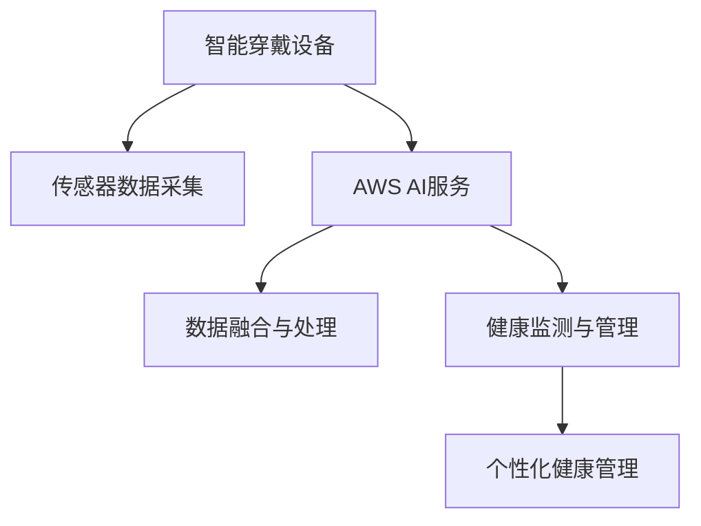

                 

# AI在智能穿戴设备中的应用:健康监测与管理

## 1. 背景介绍

### 1.1 问题由来
随着人工智能技术的飞速发展，智能穿戴设备在健康监测和管理领域的应用愈发广泛，成为推动人类健康水平提升的重要力量。智能穿戴设备通过实时监测用户的生理参数、行为数据和环境信息，能够辅助用户进行健康管理，甚至为医疗保健提供数据支持。然而，传统的健康监测设备往往只具备单一功能，数据整合和分析能力有限，难以全面、精准地反映用户的健康状况。与此同时，随着智能穿戴设备市场竞争的加剧，如何提升用户体验和设备性能，成为技术开发者和制造商面临的重大挑战。

### 1.2 问题核心关键点
要解决这些问题，AI技术在智能穿戴设备中的应用显得尤为重要。AI不仅可以提升设备的功能性和数据处理能力，还能通过个性化的健康管理策略，显著提升用户的使用体验。

1. **生理监测**：智能穿戴设备内置传感器可以实时监测心率、血压、血糖、血氧饱和度等生理参数，AI算法能够对这些数据进行智能分析和预测，提供更为准确的健康建议。
2. **行为监测**：通过分析用户的活动轨迹、睡眠模式、饮食数据等行为信息，AI能够提供个性化的健康指导，帮助用户养成良好生活习惯。
3. **数据融合**：AI技术能够整合来自多个传感器和应用的数据，构建全面的健康画像，为疾病预防和医疗干预提供依据。
4. **交互反馈**：AI技术不仅能够处理数据，还能够进行人机交互，提供实时的反馈和建议，提升用户体验。

### 1.3 问题研究意义
AI在智能穿戴设备中的应用，不仅能够提升健康监测的准确性和全面性，还能通过数据分析和智能决策，为用户提供个性化的健康管理方案。这不仅能够帮助用户保持健康，还能在一定程度上降低医疗成本，推动医疗健康行业的数字化转型。

## 2. 核心概念与联系

### 2.1 核心概念概述

为更好地理解AI在智能穿戴设备中的应用，本节将介绍几个密切相关的核心概念：

- **智能穿戴设备**：指的是集成了传感器、通信模块、电池、处理单元等多种组件，能够实时采集用户生理、行为和环境数据，并进行初步处理的可穿戴设备。
- **AI在智能穿戴设备中的应用**：指通过人工智能技术，智能穿戴设备能够对用户健康数据进行深度分析和智能化处理，提供个性化的健康管理服务。
- **健康监测与管理**：指通过智能穿戴设备采集用户健康数据，AI算法进行分析处理，为用户提供健康建议和指导，以促进用户健康管理。
- **数据融合与处理**：指将来自不同传感器和应用的数据整合，通过AI技术进行分析和预测，构建全面的健康画像。
- **个性化健康管理**：指根据用户的生理和行为数据，AI能够生成个性化的健康管理方案，帮助用户维持和改善健康状况。

这些核心概念之间的逻辑关系可以通过以下Mermaid流程图来展示：



这个流程图展示智能穿戴设备的核心概念及其之间的关系：

1. 智能穿戴设备通过传感器采集生理、行为和环境数据。
2. 数据通过AWS AI服务进行分析和处理。
3. 健康监测与管理模块根据处理结果提供健康建议和指导。
4. 个性化健康管理模块生成个性化的健康管理方案。

## 3. 核心算法原理 & 具体操作步骤
### 3.1 算法原理概述

AI在智能穿戴设备中的应用，本质上是利用机器学习、深度学习等技术对采集到的健康数据进行处理和分析，以提供个性化的健康管理方案。其核心思想是：

1. **数据采集**：通过内置传感器，智能穿戴设备能够实时采集用户的生理、行为和环境数据。
2. **数据处理**：对采集到的数据进行清洗、归一化、特征提取等预处理操作，减少噪音干扰，提升数据质量。
3. **模型训练**：使用监督学习、非监督学习或强化学习等算法，训练模型对健康数据进行分析和预测。
4. **决策生成**：基于训练好的模型，AI能够生成个性化的健康管理方案，如运动建议、饮食指导、休息提醒等。

### 3.2 算法步骤详解

基于AI的应用流程，本节将详细介绍其操作步骤：

**Step 1: 数据采集**
智能穿戴设备内置传感器能够实时采集用户的生理参数、行为数据和环境信息。常见传感器包括：

- **生理传感器**：如心率传感器、血氧传感器、血糖传感器等，用于监测生理指标。
- **行为传感器**：如加速度计、陀螺仪等，用于监测用户的活动轨迹和运动模式。
- **环境传感器**：如气压计、温度传感器等，用于监测用户所处的环境信息。

**Step 2: 数据预处理**
采集到的数据往往需要预处理，以便于后续的分析和建模：

- **清洗**：去除异常值、噪音数据，保证数据质量。
- **归一化**：对不同类型的数据进行归一化处理，确保数据在同一尺度下。
- **特征提取**：从原始数据中提取有意义的特征，如从活动轨迹中提取步数、运动强度等。

**Step 3: 模型训练**
选择适合的机器学习或深度学习模型，并利用标注数据进行训练。常见的模型包括：

- **监督学习**：如随机森林、支持向量机等，适用于分类和回归任务。
- **深度学习**：如卷积神经网络、循环神经网络等，适用于复杂的序列数据处理。

训练模型的过程包括：

- **数据划分**：将数据集划分为训练集、验证集和测试集。
- **特征工程**：根据任务需求进行特征选择和构造。
- **模型选择与优化**：选择合适的模型，调整超参数，进行交叉验证，优化模型性能。

**Step 4: 模型评估与部署**
对训练好的模型进行评估，并在实际设备中进行部署：

- **评估指标**：如准确率、召回率、F1-score等，用于衡量模型性能。
- **模型集成**：利用集成学习技术，提高模型的鲁棒性和泛化能力。
- **设备部署**：将模型部署到智能穿戴设备中，与设备硬件和操作系统进行无缝集成。

**Step 5: 个性化健康管理**
利用训练好的模型，智能穿戴设备能够生成个性化的健康管理方案：

- **健康建议**：基于用户的生理和行为数据，AI能够提供个性化的健康建议，如饮食指导、运动建议等。
- **行为反馈**：通过分析用户的活动数据，AI能够提供实时反馈，如步数、运动强度等。
- **情境推荐**：根据用户的当前情境（如天气、时间），AI能够提供合适的行为建议，如提醒用户适当运动或休息。

### 3.3 算法优缺点

AI在智能穿戴设备中的应用，具有以下优点：

1. **提升健康监测准确性**：通过深度学习等高级算法，AI能够对复杂的生理数据进行分析和预测，提供更为精准的健康建议。
2. **提升数据处理能力**：AI能够整合来自不同传感器和应用的数据，构建全面的健康画像，为健康管理提供依据。
3. **个性化健康管理**：根据用户的生理和行为数据，AI能够生成个性化的健康管理方案，提高用户满意度和使用体验。
4. **实时反馈与干预**：AI能够实时分析用户数据，提供及时的反馈和建议，帮助用户及时调整行为。

同时，该方法也存在一些局限性：

1. **数据隐私和安全问题**：智能穿戴设备采集的大量健康数据涉及隐私，存在被泄露或滥用的风险。
2. **数据质量和噪音问题**：传感器采集的数据可能存在噪音和不一致性，影响模型的准确性。
3. **模型复杂度与计算成本**：高级AI模型需要较高的计算资源和训练成本，对设备硬件和网络条件要求较高。
4. **用户接受度**：部分用户可能对设备的使用和数据共享存在顾虑，影响推广和使用。

### 3.4 算法应用领域

AI在智能穿戴设备中的应用，已经在多个领域取得了显著成效：

- **健康监测**：智能穿戴设备通过实时监测生理参数和行为数据，AI算法能够提供个性化的健康建议，如饮食指导、运动建议等。
- **运动训练**：智能穿戴设备能够监测用户的运动轨迹、运动强度等，AI算法能够提供实时的运动建议和反馈，帮助用户提高训练效果。
- **心理健康**：智能穿戴设备能够监测用户的心率、睡眠模式等，AI算法能够提供心理健康建议，如休息提醒、情绪管理等。
- **儿童健康**：智能穿戴设备能够监测儿童的生理数据和行为模式，AI算法能够提供个性化的健康管理方案，帮助家长了解和干预孩子的健康状况。

此外，AI在智能穿戴设备中的应用还扩展到睡眠监测、糖尿病管理、心血管健康等多个领域，推动了健康管理行业的智能化发展。

## 4. 数学模型和公式 & 详细讲解 & 举例说明
### 4.1 数学模型构建

AI在智能穿戴设备中的应用，通常涉及生理数据的分类、回归、异常检测等多个任务。本节将使用数学语言对这些任务进行形式化的刻画。

假设采集到的生理数据为 $\{x_i\}_{i=1}^N$，其中 $x_i = [x_{i1}, x_{i2}, ..., x_{im}]$，表示第 $i$ 个用户在第 $t$ 时刻的生理参数。假设 $y_i$ 为对应的健康标签，如0表示健康，1表示异常。则分类任务的数学模型为：

$$
P(y_i = 1 | x_i) = \frac{e^{\beta^T f(x_i)}}{1 + e^{\beta^T f(x_i)}}
$$

其中，$f(x_i)$ 为特征映射函数，$\beta$ 为模型参数。回归任务的数学模型为：

$$
y_i = \beta^T f(x_i) + \epsilon
$$

其中，$f(x_i)$ 为特征映射函数，$\beta$ 为模型参数，$\epsilon$ 为随机误差。

### 4.2 公式推导过程

以生理参数监测中的异常检测为例，进行数学模型和公式推导：

假设采集到的生理参数为 $x = [x_1, x_2, ..., x_m]$，其中 $x_i$ 表示第 $i$ 个生理参数。假设 $y = 1$ 表示异常，$y = 0$ 表示正常。则异常检测任务的数学模型为：

$$
P(y = 1 | x) = \frac{e^{\beta^T f(x)}}{1 + e^{\beta^T f(x)}}
$$

其中，$f(x)$ 为特征映射函数，$\beta$ 为模型参数。通过对采集到的数据进行特征工程，选择有意义的特征 $f(x)$，如心率、血压等。然后利用监督学习算法进行训练，得到模型参数 $\beta$。

在实际应用中，使用训练好的模型对实时采集的生理参数进行分类或回归，得到健康状态或异常检测结果。如公式所示：

$$
y' = \frac{e^{\beta^T f(x)}}{1 + e^{\beta^T f(x)}}
$$

其中，$f(x)$ 为实时采集的生理参数，$y'$ 为异常检测结果。

### 4.3 案例分析与讲解

以下以运动监测为例，说明AI在智能穿戴设备中的应用：

假设智能穿戴设备能够实时监测用户的步数、运动强度、心率等生理参数。通过AI算法，对采集到的数据进行分类和回归，得到用户的运动状态和健康建议。具体步骤如下：

**Step 1: 数据采集**
智能穿戴设备通过内置传感器采集用户的步数、运动强度、心率等生理参数。

**Step 2: 数据预处理**
对采集到的数据进行清洗、归一化、特征提取等预处理操作，保证数据质量。

**Step 3: 模型训练**
选择适合的运动监测模型，如循环神经网络(RNN)，利用历史运动数据进行训练，得到模型参数。

**Step 4: 运动状态分类**
对实时采集的运动数据进行分类，判断用户是否在进行高强度运动。如公式所示：

$$
y' = \frac{e^{\beta^T f(x)}}{1 + e^{\beta^T f(x)}}
$$

其中，$f(x)$ 为实时采集的运动数据，$y'$ 为运动状态分类结果。

**Step 5: 健康建议生成**
根据分类结果，生成个性化的健康建议，如提醒用户适当运动或休息。

## 5. 项目实践：代码实例和详细解释说明
### 5.1 开发环境搭建

在进行AI应用实践前，我们需要准备好开发环境。以下是使用Python进行TensorFlow开发的环境配置流程：

1. 安装Anaconda：从官网下载并安装Anaconda，用于创建独立的Python环境。

2. 创建并激活虚拟环境：
```bash
conda create -n tf-env python=3.7 
conda activate tf-env
```

3. 安装TensorFlow：根据CUDA版本，从官网获取对应的安装命令。例如：
```bash
pip install tensorflow==2.4
```

4. 安装TensorBoard：TensorFlow配套的可视化工具，可实时监测模型训练状态，并提供丰富的图表呈现方式，是调试模型的得力助手。

5. 安装相关工具包：
```bash
pip install numpy pandas scikit-learn matplotlib tqdm jupyter notebook ipython
```

完成上述步骤后，即可在`tf-env`环境中开始AI应用实践。

### 5.2 源代码详细实现

这里我们以生理参数监测为例，给出使用TensorFlow进行AI应用的PyTorch代码实现。

首先，定义生理参数监测的数据处理函数：

```python
import tensorflow as tf
from tensorflow import keras

class PhysiologicalDataset(keras.utils.Sequence):
    def __init__(self, x, y, batch_size):
        self.x = x
        self.y = y
        self.batch_size = batch_size

    def __len__(self):
        return len(self.x) // self.batch_size

    def __getitem__(self, idx):
        x_batch = self.x[idx * self.batch_size: (idx + 1) * self.batch_size]
        y_batch = self.y[idx * self.batch_size: (idx + 1) * self.batch_size]
        return x_batch, y_batch
```

然后，定义模型和优化器：

```python
from tensorflow.keras.models import Sequential
from tensorflow.keras.layers import Dense, Dropout

model = Sequential([
    Dense(64, input_dim=8, activation='relu'),
    Dropout(0.2),
    Dense(1, activation='sigmoid')
])

optimizer = keras.optimizers.Adam(learning_rate=0.001)
```

接着，定义训练和评估函数：

```python
def train_epoch(model, dataset, batch_size, optimizer):
    model.compile(optimizer=optimizer, loss='binary_crossentropy', metrics=['accuracy'])
    model.fit(dataset, batch_size=batch_size, epochs=10, validation_split=0.2)
    return model.evaluate(dataset)

def evaluate(model, dataset, batch_size):
    model.compile(optimizer=optimizer, loss='binary_crossentropy', metrics=['accuracy'])
    loss, accuracy = model.evaluate(dataset, batch_size=batch_size)
    return loss, accuracy
```

最后，启动训练流程并在测试集上评估：

```python
batch_size = 32

train_dataset = PhysiologicalDataset(train_x, train_y, batch_size)
test_dataset = PhysiologicalDataset(test_x, test_y, batch_size)

train_loss, train_acc = train_epoch(model, train_dataset, batch_size, optimizer)
test_loss, test_acc = evaluate(model, test_dataset, batch_size)

print(f"Train loss: {train_loss:.4f}, train accuracy: {train_acc:.4f}")
print(f"Test loss: {test_loss:.4f}, test accuracy: {test_acc:.4f}")
```

以上就是使用TensorFlow对生理参数监测进行AI应用的完整代码实现。可以看到，TensorFlow提供了强大的API，使得AI模型的开发和训练过程变得简洁高效。

### 5.3 代码解读与分析

让我们再详细解读一下关键代码的实现细节：

**PhysiologicalDataset类**：
- `__init__`方法：初始化数据集，包含输入数据 `x` 和标签 `y`，以及批次大小 `batch_size`。
- `__len__`方法：返回数据集的批次数量。
- `__getitem__`方法：对单个批次进行处理，返回输入数据和标签。

**模型定义**：
- 定义了简单的神经网络模型，包含两个密集层，一个激活函数为ReLU，另一个为sigmoid，用于二分类任务。
- 使用Adam优化器进行参数优化。

**训练和评估函数**：
- 使用`compile`方法设置模型参数，如优化器、损失函数、评估指标等。
- `train_epoch`函数：对数据集进行训练，返回训练集和验证集的损失和准确率。
- `evaluate`函数：对数据集进行评估，返回测试集的损失和准确率。

**训练流程**：
- 定义批次大小，创建训练集和测试集。
- 调用`train_epoch`函数进行模型训练。
- 调用`evaluate`函数进行模型评估。

可以看到，TensorFlow使得AI应用的代码实现变得简洁高效。开发者可以将更多精力放在模型改进和数据处理上，而不必过多关注底层的实现细节。

当然，工业级的系统实现还需考虑更多因素，如模型的保存和部署、超参数的自动搜索、更灵活的任务适配层等。但核心的AI应用范式基本与此类似。

## 6. 实际应用场景
### 6.1 智能运动监测设备

智能运动监测设备通过实时监测用户的步数、运动强度、心率等生理参数，AI算法能够提供个性化的运动建议和健康管理方案。具体应用场景如下：

**运动监测与分析**：智能运动监测设备通过内置传感器实时监测用户的运动数据，AI算法能够分析用户的运动状态，如运动强度、运动模式等，生成个性化的运动建议，如提醒用户适当运动或休息。

**健康状况评估**：通过分析用户的生理参数和运动数据，AI能够评估用户的健康状况，如心率、睡眠质量等，提供个性化的健康建议，帮助用户维护健康。

**运动数据可视化**：智能运动监测设备能够将用户的运动数据实时展示，并通过图表和报告形式呈现，便于用户直观了解自己的运动情况和健康状态。

**运动竞赛辅导**：AI算法能够根据用户的运动数据和比赛规则，提供个性化的运动训练方案和比赛策略，帮助用户提升运动水平。

### 6.2 健康监测手环

健康监测手环通过内置传感器实时监测用户的生理参数，AI算法能够提供个性化的健康管理方案。具体应用场景如下：

**生理参数监测**：健康监测手环能够实时监测用户的心率、血压、血糖等生理参数，AI算法能够分析和预测用户的健康状况，提供个性化的健康建议。

**行为模式分析**：通过分析用户的饮食、运动、睡眠等行为数据，AI能够评估用户的健康状况，提供个性化的健康管理方案，如饮食建议、运动计划、睡眠调节等。

**健康事件预警**：通过监测用户的生理参数和行为数据，AI能够及时发现异常情况，如心率过快、血压异常等，提醒用户及时就医，避免健康风险。

**心理健康监测**：AI算法能够分析用户的心理健康数据，如情绪、压力等，提供个性化的心理健康建议，帮助用户缓解压力，提升心理健康水平。

## 7. 工具和资源推荐
### 7.1 学习资源推荐

为了帮助开发者系统掌握AI在智能穿戴设备中的应用，这里推荐一些优质的学习资源：

1. **《TensorFlow官方文档》**：TensorFlow的官方文档提供了丰富的学习资源，包括教程、示例代码、API文档等，是TensorFlow学习者的必备资料。
2. **《深度学习入门》**：李宏毅教授的深度学习入门课程，涵盖了深度学习的基础理论和实践技巧，适合初学者入门。
3. **《Python深度学习》**：本书系统介绍了深度学习的基本概念和实践技巧，适合Python初学者和深度学习爱好者。
4. **《TensorFlow实战》**：本书通过多个实战案例，介绍了TensorFlow的基本应用和高级技巧，适合TensorFlow开发者。

通过对这些资源的学习实践，相信你一定能够快速掌握AI在智能穿戴设备中的应用，并用于解决实际的NLP问题。

### 7.2 开发工具推荐

高效的开发离不开优秀的工具支持。以下是几款用于AI应用开发的常用工具：

1. **TensorFlow**：由Google主导开发的开源深度学习框架，生产部署方便，适合大规模工程应用。
2. **Keras**：高层次的神经网络API，易于使用，适合快速迭代和原型开发。
3. **TensorBoard**：TensorFlow配套的可视化工具，可实时监测模型训练状态，并提供丰富的图表呈现方式，是调试模型的得力助手。
4. **Jupyter Notebook**：交互式的编程环境，支持Python和TensorFlow的集成开发。
5. **PyCharm**：功能强大的Python IDE，支持TensorFlow和Keras的集成开发和调试。

合理利用这些工具，可以显著提升AI应用的开发效率，加快创新迭代的步伐。

### 7.3 相关论文推荐

AI在智能穿戴设备中的应用，源于学界的持续研究。以下是几篇奠基性的相关论文，推荐阅读：

1. **《深度学习在智能穿戴设备中的应用》**：探讨了深度学习在生理参数监测、运动监测、行为分析等方面的应用，展示了AI在智能穿戴设备中的强大潜力。
2. **《生理参数监测的AI方法》**：介绍了基于深度学习的方法对生理参数进行分类、回归和异常检测，提供了多种模型和评估指标。
3. **《智能运动监测设备的研究》**：介绍了智能运动监测设备的传感器设计、数据处理和AI算法，展示了AI在运动监测中的应用效果。
4. **《健康监测手环的AI应用》**：介绍了健康监测手环的传感器设计、生理参数监测和AI算法，展示了AI在健康监测中的应用效果。

这些论文代表了大语言模型微调技术的发展脉络。通过学习这些前沿成果，可以帮助研究者把握学科前进方向，激发更多的创新灵感。

## 8. 总结：未来发展趋势与挑战
### 8.1 总结

本文对AI在智能穿戴设备中的应用进行了全面系统的介绍。首先阐述了智能穿戴设备在健康监测和管理领域的应用，明确了AI技术在提升用户体验和设备性能方面的独特价值。其次，从原理到实践，详细讲解了AI的应用流程，包括数据采集、预处理、模型训练和个性化健康管理等环节，给出了AI应用的完整代码实现。同时，本文还广泛探讨了AI在智能运动监测设备和健康监测手环等多个行业领域的应用前景，展示了AI应用的广阔前景。

通过本文的系统梳理，可以看到，AI在智能穿戴设备中的应用，不仅能够提升健康监测的准确性和全面性，还能通过数据分析和智能决策，为用户提供个性化的健康管理方案。这不仅能够帮助用户保持健康，还能在一定程度上降低医疗成本，推动医疗健康行业的数字化转型。未来，伴随AI技术的不断演进，智能穿戴设备的应用场景将更加丰富，健康管理也将更加智能化和个性化。

### 8.2 未来发展趋势

展望未来，AI在智能穿戴设备中的应用将呈现以下几个发展趋势：

1. **多模态数据融合**：未来的智能穿戴设备将不仅仅采集生理参数，还将整合视觉、听觉等多模态数据，构建更全面的健康画像。
2. **实时性提升**：AI算法将更注重实时性，能够对实时采集的数据进行实时分析和反馈，提升用户体验。
3. **个性化增强**：AI算法将更加个性化，能够根据用户的生理和行为数据，提供更精准、个性化的健康管理方案。
4. **跨平台集成**：未来的智能穿戴设备将能够跨平台集成，实现数据共享和协同工作。
5. **隐私保护增强**：随着隐私保护意识的提升，AI算法将更加注重数据安全和隐私保护，减少数据泄露风险。

以上趋势凸显了AI在智能穿戴设备中的应用前景。这些方向的探索发展，必将进一步提升智能穿戴设备的性能和用户体验，为人类健康管理带来深远影响。

### 8.3 面临的挑战

尽管AI在智能穿戴设备中的应用取得了显著成效，但在迈向更加智能化、普适化应用的过程中，它仍面临着诸多挑战：

1. **数据隐私和安全问题**：智能穿戴设备采集的大量健康数据涉及隐私，存在被泄露或滥用的风险。如何在数据采集、存储和传输过程中保障用户隐私，是一个重要的研究方向。
2. **数据质量和噪音问题**：传感器采集的数据可能存在噪音和不一致性，影响模型的准确性。如何提高数据质量，减少噪音干扰，提升模型性能，仍需进一步研究。
3. **设备计算资源限制**：AI算法需要较高的计算资源和训练成本，对设备硬件和网络条件要求较高。如何在计算资源有限的条件下，优化模型性能，提升用户体验，是一个亟待解决的问题。
4. **用户接受度**：部分用户可能对设备的使用和数据共享存在顾虑，影响推广和使用。如何增强用户信任，提升设备的用户接受度，是一个重要的研究方向。

### 8.4 研究展望

面对AI在智能穿戴设备中的应用所面临的挑战，未来的研究需要在以下几个方面寻求新的突破：

1. **隐私保护技术**：开发更加安全、隐私保护的技术，如差分隐私、联邦学习等，减少数据泄露风险。
2. **数据预处理技术**：研究更加高效、鲁棒的数据预处理技术，提升数据质量和模型性能。
3. **轻量级模型**：开发更加轻量级的模型，能够在计算资源有限的情况下，保证模型性能和用户体验。
4. **人机交互技术**：研究更加自然、智能的人机交互技术，提升用户使用体验，增强用户信任。
5. **跨平台集成技术**：研究跨平台集成技术，实现数据共享和协同工作，提升设备的用户体验。

这些研究方向将进一步推动AI在智能穿戴设备中的应用，为人类健康管理带来新的突破。

## 9. 附录：常见问题与解答

**Q1：智能穿戴设备采集的数据类型有哪些？**

A: 智能穿戴设备可以采集多种类型的数据，包括：
1. **生理参数**：如心率、血压、血糖、血氧饱和度等，用于监测用户健康状况。
2. **行为数据**：如步数、运动强度、活动轨迹等，用于监测用户行为模式。
3. **环境数据**：如温度、气压、光照等，用于监测用户所处环境。

**Q2：智能穿戴设备采集数据的精度和可靠性如何保证？**

A: 智能穿戴设备采集数据的精度和可靠性主要依赖于传感器的设计和校准。常见的传感器的精度和可靠性提升技术包括：
1. **传感器校准**：通过定期校准传感器，减少数据偏差和噪音。
2. **传感器融合**：使用多种传感器进行数据融合，提高数据准确性和鲁棒性。
3. **信号滤波**：对传感器信号进行滤波处理，去除噪音和不一致性。

**Q3：AI算法在智能穿戴设备中的应用如何提升用户体验？**

A: AI算法在智能穿戴设备中的应用，能够提供个性化的健康建议和行为指导，提升用户体验，具体体现在以下几个方面：
1. **个性化健康建议**：根据用户的生理和行为数据，AI算法能够提供个性化的健康建议，如饮食指导、运动建议等。
2. **实时反馈与干预**：AI算法能够实时分析用户数据，提供及时的反馈和建议，帮助用户及时调整行为。
3. **数据可视化**：AI算法能够将用户数据实时展示，并通过图表和报告形式呈现，便于用户直观了解自己的健康状况和行为模式。
4. **情境推荐**：AI算法能够根据用户的当前情境（如天气、时间），提供合适的行为建议，提升用户满意度和使用体验。

通过以上方式，AI算法能够显著提升智能穿戴设备的用户体验，帮助用户更好地管理自己的健康。

---

作者：禅与计算机程序设计艺术 / Zen and the Art of Computer Programming

