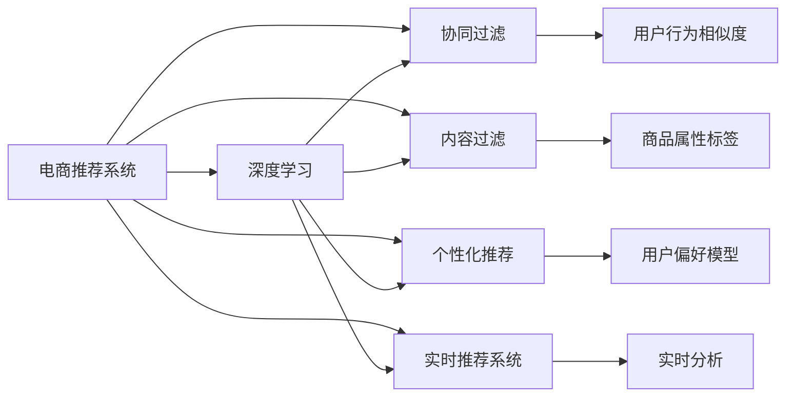

                 

# AI在电商促销中的实际应用

> 关键词：
> - AI在电商促销中的实际应用
> - 电商智能推荐系统
> - 实时个性化推荐
> - 深度学习与推荐系统
> - 点击率预测
> - 用户行为分析
> - 电商数据分析
> - 推荐系统评价指标

## 1. 背景介绍

随着互联网技术的发展，电子商务已经逐渐成为人们生活中不可或缺的一部分。电商平台不仅为消费者提供了便捷的购物渠道，也为商家提供了广泛的市场。如何提升用户体验，提高商家销售转化率，是电商促销中始终需要关注的问题。人工智能（AI）作为新一代技术手段，在电商促销中发挥着重要作用，具体表现为推荐系统的应用。推荐系统通过分析用户的历史行为和偏好，为其提供个性化的商品推荐，从而提升用户体验和商家转化率。

### 1.1 电商推荐系统发展历程

电商推荐系统的发展经历了从基本推荐到深度学习推荐，再到今天的智能推荐系统三个阶段。

**基本推荐系统**：通过简单的用户行为统计和商品标签匹配，为用户推荐商品。这种推荐方式逻辑简单，但缺乏对用户需求的深入分析。

**深度学习推荐系统**：引入深度学习算法，利用神经网络对用户行为进行建模，推荐系统的效果得到了显著提升。但这种推荐方式需要大量的用户数据，且对计算资源要求较高。

**智能推荐系统**：结合了机器学习、深度学习、自然语言处理（NLP）、知识图谱等多种技术，能够更加精准地为用户提供个性化推荐。同时，智能推荐系统还具备自适应性和智能交互能力，能够主动了解用户需求，动态调整推荐策略。

## 2. 核心概念与联系

### 2.1 核心概念概述

为了更好地理解AI在电商促销中的实际应用，本文将介绍几个核心概念：

- **电商推荐系统**：通过分析用户行为和商品特征，为用户推荐合适的商品，从而提升用户购物体验和商家销售额。
- **深度学习**：一种基于人工神经网络的学习方法，通过反向传播算法不断调整神经网络参数，以最小化损失函数，从而实现对数据的有效建模和预测。
- **协同过滤**：一种推荐算法，通过分析用户的历史行为，找到与其行为相似的用户，从而推荐其感兴趣的商品。
- **内容过滤**：通过分析商品的属性和标签，为用户推荐与其历史行为匹配的商品。
- **个性化推荐**：根据用户的历史行为和偏好，为其提供量身定制的商品推荐。
- **实时推荐系统**：通过实时分析和预测用户行为，为用户提供即时推荐，从而提升用户购物体验。

### 2.2 核心概念原理和架构的 Mermaid 流程图



这个流程图展示了电商推荐系统与核心技术的关联关系。电商推荐系统通过深度学习、协同过滤、内容过滤、个性化推荐、实时推荐系统等多种技术手段，为用户提供精准的推荐服务。

## 3. 核心算法原理 & 具体操作步骤

### 3.1 算法原理概述

基于深度学习的电商推荐系统，通过分析用户的历史行为和商品特征，为用户推荐合适的商品。其核心思想是通过深度学习模型，学习用户和商品之间的隐含关系，从而实现对用户行为的预测和商品推荐的优化。

具体来说，电商推荐系统一般包括以下几个步骤：

1. 收集用户行为数据，如浏览历史、购买记录、评分记录等。
2. 将用户行为数据转化为数值特征，如点击次数、停留时间、评分等。
3. 利用深度学习模型，对用户行为进行建模，预测用户可能感兴趣的商品。
4. 根据预测结果，为用户推荐商品，并动态调整推荐策略。

### 3.2 算法步骤详解

以下我们将详细介绍电商推荐系统的具体算法步骤。

**步骤1：数据预处理**

电商推荐系统需要处理大规模的用户行为数据，包括点击、浏览、购买、评分等。为了便于模型的训练和预测，需要对原始数据进行预处理，将其转化为模型能够处理的形式。

具体来说，数据预处理包括以下几个步骤：

1. 数据清洗：删除缺失数据、异常数据、重复数据等，保证数据质量。
2. 特征提取：将用户行为数据转化为数值特征，如点击次数、停留时间、评分等。
3. 数据划分：将数据划分为训练集、验证集和测试集，用于模型训练、调参和评估。

**步骤2：模型选择与训练**

电商推荐系统可以选择不同的深度学习模型进行训练，如神经网络、卷积神经网络（CNN）、循环神经网络（RNN）、长短期记忆网络（LSTM）、Transformer等。

以Transformer为例，电商推荐系统的训练过程包括以下几个步骤：

1. 数据输入：将用户行为数据输入模型，得到模型输出。
2. 模型前向传播：将模型输入传递到模型中，得到中间特征表示。
3. 模型后向传播：通过反向传播算法计算模型输出与真实标签之间的误差。
4. 参数更新：根据误差，调整模型参数，最小化损失函数。
5. 模型评估：在验证集上评估模型性能，调整超参数，确保模型泛化能力。

**步骤3：推荐策略优化**

电商推荐系统需要根据用户行为和商品特征，动态调整推荐策略，为用户提供最合适的商品。推荐策略优化包括以下几个步骤：

1. 预测用户行为：利用深度学习模型，预测用户可能感兴趣的商品。
2. 排名推荐：根据预测结果，对商品进行排序，推荐前几名商品给用户。
3. 反馈学习：收集用户对推荐商品的反馈，如点击、购买、评分等，用于优化推荐模型。

### 3.3 算法优缺点

基于深度学习的电商推荐系统具有以下优点：

1. 能够精准地预测用户行为，提供个性化的推荐服务。
2. 能够处理大规模数据，支持实时推荐。
3. 能够动态调整推荐策略，提升用户购物体验。

同时，基于深度学习的电商推荐系统也存在一些缺点：

1. 需要大量的用户数据和计算资源，难以在小规模数据上取得好的效果。
2. 推荐结果可解释性不足，用户难以理解推荐的原因。
3. 对数据质量要求较高，数据噪音会影响模型性能。
4. 推荐结果存在偏差，无法完全消除。

### 3.4 算法应用领域

基于深度学习的电商推荐系统广泛应用于各种电商场景中，例如：

- **商品推荐**：为用户推荐商品，提升用户购物体验。
- **活动推荐**：为用户推荐电商活动，如折扣、优惠券等，提升用户参与度。
- **新商品推荐**：为用户推荐新品，提升商家销售额。
- **个性化营销**：根据用户行为，设计个性化的营销策略，提升用户转化率。
- **库存管理**：根据用户行为，预测商品需求，优化库存管理。

## 4. 数学模型和公式 & 详细讲解 & 举例说明

### 4.1 数学模型构建

电商推荐系统的数学模型一般包括以下几个部分：

1. 用户行为数据：$X=\{x_1, x_2, ..., x_n\}$，其中$x_i$为用户第$i$次行为数据。
2. 商品特征数据：$Y=\{y_1, y_2, ..., y_m\}$，其中$y_i$为商品第$i$次特征数据。
3. 用户-商品矩阵：$W=\{w_{ij}\}$，其中$w_{ij}$为用户$i$对商品$j$的评分或行为权重。

### 4.2 公式推导过程

电商推荐系统的目标是最小化预测误差，即：

$$
\min_{\theta} \sum_{i=1}^{n} \sum_{j=1}^{m} \left(w_{ij} - \hat{w}_{ij}\right)^2
$$

其中，$\theta$为模型参数，$\hat{w}_{ij}$为模型预测的权重。

根据上述目标，可以定义损失函数为：

$$
L = \frac{1}{2n}\sum_{i=1}^{n} \sum_{j=1}^{m} \left(w_{ij} - \hat{w}_{ij}\right)^2
$$

根据梯度下降算法，可以得到参数更新公式为：

$$
\theta \leftarrow \theta - \eta \nabla_{\theta} L
$$

其中，$\eta$为学习率，$\nabla_{\theta} L$为损失函数对参数$\theta$的梯度。

### 4.3 案例分析与讲解

以用户行为数据为例，假设有一个电商网站，收集了用户的点击数据，每个用户有1000个点击行为，每个行为有一个点击权重。现在需要构建一个推荐系统，预测用户对每个商品的评分。

假设模型是一个单层神经网络，输入为用户行为数据，输出为商品评分。模型的参数包括权重矩阵$W$和偏置向量$b$。模型的预测公式为：

$$
\hat{w}_{ij} = W \cdot x_i + b
$$

根据上述公式，可以得到模型的损失函数：

$$
L = \frac{1}{2n}\sum_{i=1}^{n} \sum_{j=1}^{m} \left(w_{ij} - \hat{w}_{ij}\right)^2
$$

根据梯度下降算法，可以得到参数更新公式为：

$$
W \leftarrow W - \eta \frac{1}{n} \sum_{i=1}^{n} \sum_{j=1}^{m} \left(w_{ij} - \hat{w}_{ij}\right) x_i^T
$$

$$
b \leftarrow b - \eta \frac{1}{n} \sum_{i=1}^{n} \left(w_{ij} - \hat{w}_{ij}\right)
$$

上述公式展示了电商推荐系统的数学模型和参数更新过程。在实际应用中，需要根据具体的电商数据和模型结构进行调整。

## 5. 项目实践：代码实例和详细解释说明

### 5.1 开发环境搭建

在进行电商推荐系统的开发时，需要搭建好开发环境，以便进行模型的训练和测试。以下是使用Python和TensorFlow搭建电商推荐系统开发环境的流程：

1. 安装Anaconda：从官网下载并安装Anaconda，用于创建独立的Python环境。

2. 创建并激活虚拟环境：
```bash
conda create -n recsys-env python=3.8 
conda activate recsys-env
```

3. 安装TensorFlow：根据CUDA版本，从官网获取对应的安装命令。例如：
```bash
conda install tensorflow=2.7
```

4. 安装Numpy、Pandas、Scikit-learn、Scipy等常用工具包：
```bash
pip install numpy pandas scikit-learn scipy tqdm jupyter notebook ipython
```

5. 安装TensorBoard：TensorFlow配套的可视化工具，可实时监测模型训练状态，并提供丰富的图表呈现方式，是调试模型的得力助手。

```bash
pip install tensorboard
```

完成上述步骤后，即可在`recsys-env`环境中开始电商推荐系统的开发。

### 5.2 源代码详细实现

下面以TensorFlow实现电商推荐系统为例，给出完整的代码实现。

**用户行为数据处理**

```python
import pandas as pd
import numpy as np

# 加载用户行为数据
data = pd.read_csv('user_behavior.csv', sep='\t')

# 将行为数据转换为数值特征
data['click_weight'] = data['click_weight'].astype(float)
data['click_count'] = data['click_count'].astype(float)
data['click_time'] = data['click_time'].astype(float)

# 将特征数据进行归一化
data['click_weight'] = (data['click_weight'] - np.mean(data['click_weight'])) / np.std(data['click_weight'])
data['click_count'] = (data['click_count'] - np.mean(data['click_count'])) / np.std(data['click_count'])
data['click_time'] = (data['click_time'] - np.mean(data['click_time'])) / np.std(data['click_time'])

# 将数据划分为训练集、验证集和测试集
train_data = data.sample(frac=0.7, random_state=42)
val_data = data.drop(train_data.index)..sample(frac=0.15, random_state=42)
test_data = data.drop(train_data.index).drop(val_data.index)

# 将数据保存为numpy数组
train_X = train_data[['click_weight', 'click_count', 'click_time']].values
train_y = train_data['click_rating'].values
val_X = val_data[['click_weight', 'click_count', 'click_time']].values
val_y = val_data['click_rating'].values
test_X = test_data[['click_weight', 'click_count', 'click_time']].values
test_y = test_data['click_rating'].values
```

**构建推荐模型**

```python
import tensorflow as tf
from tensorflow.keras.models import Sequential
from tensorflow.keras.layers import Dense, Dropout

# 构建神经网络模型
model = Sequential([
    Dense(64, activation='relu', input_shape=(3,)),
    Dropout(0.2),
    Dense(64, activation='relu'),
    Dropout(0.2),
    Dense(1, activation='linear')
])

# 编译模型
model.compile(loss='mse', optimizer='adam', metrics=['mae'])

# 训练模型
history = model.fit(train_X, train_y, epochs=100, batch_size=32, validation_data=(val_X, val_y))
```

**模型评估**

```python
# 在测试集上评估模型性能
test_loss, test_mae = model.evaluate(test_X, test_y)
print(f'Test loss: {test_loss}, Test MAE: {test_mae}')

# 可视化训练过程
import tensorflow.keras.utils as ku
import matplotlib.pyplot as plt

# 绘制训练曲线
plt.plot(history.history['loss'], label='Train Loss')
plt.plot(history.history['val_loss'], label='Validation Loss')
plt.legend()
plt.show()

# 绘制MAE曲线
plt.plot(history.history['mae'], label='Train MAE')
plt.plot(history.history['val_mae'], label='Validation MAE')
plt.legend()
plt.show()
```

### 5.3 代码解读与分析

让我们再详细解读一下关键代码的实现细节：

**用户行为数据处理**

用户行为数据包含了点击次数、点击权重、点击时间等特征。首先需要将数据转换为模型能够处理的形式，即数值特征。然后将特征数据进行归一化，使得特征数据具有相同的尺度。最后，将数据划分为训练集、验证集和测试集，用于模型训练、调参和评估。

**构建推荐模型**

推荐模型是一个简单的神经网络，包含两个全连接层和一个输出层。全连接层通过ReLU激活函数进行激活，输出层使用线性激活函数输出预测值。模型使用均方误差作为损失函数，Adam优化器进行参数更新，均方误差绝对值作为评价指标。在模型训练过程中，使用训练集数据进行训练，并在验证集数据上进行评估，调整模型超参数。

**模型评估**

在测试集上评估模型的性能，计算模型的损失和MAE（平均绝对误差）。使用TensorBoard可视化训练过程和MAE曲线，帮助理解模型的训练效果和性能变化。

## 6. 实际应用场景

### 6.1 智能推荐系统

智能推荐系统是电商推荐系统的核心应用场景之一，通过分析用户行为和商品特征，为用户推荐合适的商品，提升用户体验和商家转化率。智能推荐系统通常包括以下几个关键模块：

1. **用户行为分析模块**：通过分析用户的历史行为数据，如点击、浏览、购买、评分等，了解用户兴趣和偏好。
2. **商品特征分析模块**：通过分析商品的标签、属性、类别等特征，了解商品的价值和特点。
3. **推荐算法模块**：根据用户行为和商品特征，选择合适的推荐算法，如协同过滤、内容过滤、深度学习等。
4. **实时推荐模块**：根据用户实时行为，动态调整推荐策略，提升推荐效果。

智能推荐系统在电商促销中具有广泛的应用，如商品推荐、活动推荐、个性化营销、库存管理等。

### 6.2 个性化营销

个性化营销通过分析用户行为数据，了解用户的兴趣和偏好，为其定制个性化的营销策略，提升用户转化率和满意度。个性化营销通常包括以下几个关键步骤：

1. **用户行为分析**：通过分析用户的历史行为数据，如点击、浏览、购买、评分等，了解用户的兴趣和偏好。
2. **营销策略设计**：根据用户行为数据，设计个性化的营销策略，如折扣、优惠券、推荐商品等。
3. **效果评估**：通过分析用户对营销策略的反馈，评估策略效果，不断优化策略设计。

个性化营销在电商促销中具有广泛的应用，如优惠券推荐、个性化广告、推荐商品等。

### 6.3 实时推荐系统

实时推荐系统通过实时分析用户行为数据，动态调整推荐策略，为用户提供最合适的商品，提升用户购物体验。实时推荐系统通常包括以下几个关键步骤：

1. **实时数据采集**：通过实时采集用户行为数据，了解用户当前状态。
2. **实时推荐算法**：根据实时数据，动态调整推荐算法，选择最合适的商品。
3. **实时推荐展示**：通过推荐算法，将推荐商品展示给用户。
4. **实时反馈学习**：根据用户对推荐商品的反馈，动态调整推荐策略，提升推荐效果。

实时推荐系统在电商促销中具有广泛的应用，如实时推荐商品、推荐活动、推荐广告等。

## 7. 工具和资源推荐

### 7.1 学习资源推荐

为了帮助开发者系统掌握电商推荐系统的理论基础和实践技巧，这里推荐一些优质的学习资源：

1. **《推荐系统》系列书籍**：介绍推荐系统的基本概念、算法和实现方法，是推荐系统领域的重要参考资料。
2. **Coursera《推荐系统》课程**：斯坦福大学开设的推荐系统课程，详细讲解推荐系统的基本概念和算法实现。
3. **Kaggle推荐系统竞赛**：通过参与推荐系统竞赛，实战练习推荐系统的设计和实现。
4. **Apache Mahout推荐系统框架**：Apache Mahout是Hadoop生态系统中的推荐系统框架，提供了丰富的推荐算法和实现方法。
5. **TensorFlow推荐系统框架**：TensorFlow提供了推荐系统框架，支持多种推荐算法和模型。

通过对这些资源的学习实践，相信你一定能够快速掌握电商推荐系统的精髓，并用于解决实际的电商问题。

### 7.2 开发工具推荐

高效的开发离不开优秀的工具支持。以下是几款用于电商推荐系统开发的常用工具：

1. **Python**：电商推荐系统开发的主要语言，具备灵活、高效、易用等优点。
2. **TensorFlow**：TensorFlow是深度学习框架中的佼佼者，支持多种深度学习算法和模型。
3. **TensorBoard**：TensorFlow配套的可视化工具，可实时监测模型训练状态，提供丰富的图表呈现方式。
4. **Keras**：Keras是一个简单易用的深度学习框架，提供了丰富的模型和算法实现。
5. **Apache Mahout**：Apache Mahout是Hadoop生态系统中的推荐系统框架，提供了多种推荐算法和实现方法。
6. **Scikit-learn**：Scikit-learn是一个机器学习框架，支持多种经典机器学习算法和模型。

合理利用这些工具，可以显著提升电商推荐系统的开发效率，加快创新迭代的步伐。

### 7.3 相关论文推荐

电商推荐系统的研究涉及多个领域，以下几篇论文代表了大数据、机器学习、深度学习等领域的最新进展：

1. **《推荐系统算法》**：介绍推荐系统的基本算法和实现方法，是推荐系统领域的重要参考资料。
2. **《基于协同过滤的推荐系统》**：详细讲解协同过滤算法的原理和实现方法，是推荐系统领域的重要参考资料。
3. **《深度学习在推荐系统中的应用》**：介绍深度学习在推荐系统中的应用，是推荐系统领域的重要参考资料。
4. **《实时推荐系统》**：介绍实时推荐系统的基本算法和实现方法，是推荐系统领域的重要参考资料。

这些论文代表了大数据、机器学习、深度学习等领域的最新进展。通过学习这些前沿成果，可以帮助研究者把握学科前进方向，激发更多的创新灵感。

## 8. 总结：未来发展趋势与挑战

### 8.1 总结

本文对AI在电商促销中的实际应用进行了全面系统的介绍。首先阐述了电商推荐系统的背景和意义，明确了电商推荐系统在提升用户体验和商家转化率方面的重要作用。其次，从原理到实践，详细讲解了电商推荐系统的数学模型和算法步骤，给出了电商推荐系统的完整代码实例。同时，本文还广泛探讨了电商推荐系统在智能推荐、个性化营销、实时推荐等实际应用场景中的应用前景，展示了电商推荐系统的巨大潜力。此外，本文精选了电商推荐系统的各类学习资源，力求为读者提供全方位的技术指引。

通过本文的系统梳理，可以看到，AI在电商促销中的应用主要体现在推荐系统上，通过分析用户行为和商品特征，为用户推荐合适的商品，提升用户体验和商家转化率。推荐系统已经成为了电商促销的重要工具，未来将会有更广阔的应用前景。

### 8.2 未来发展趋势

展望未来，电商推荐系统的发展趋势如下：

1. **深度学习在推荐系统中的应用将更加广泛**：深度学习算法可以处理大规模数据，提供更加精准的推荐结果。未来，深度学习将逐步取代传统的协同过滤和内容过滤算法，成为推荐系统的核心。
2. **实时推荐系统将成为主流**：实时推荐系统可以根据用户实时行为，动态调整推荐策略，提供即时推荐服务。未来，实时推荐系统将成为电商促销的重要工具。
3. **推荐系统将具备更加精准的用户画像**：通过结合用户的行为数据、社交数据、地理位置等，推荐系统可以更好地了解用户的兴趣和偏好。未来，推荐系统将具备更加精准的用户画像，提供更加个性化的推荐服务。
4. **推荐系统将具备更加智能的推荐策略**：通过引入机器学习、深度学习、自然语言处理（NLP）、知识图谱等多种技术手段，推荐系统将具备更加智能的推荐策略，提升推荐效果。
5. **推荐系统将具备更加高效的推荐算法**：未来，推荐系统将引入更多的推荐算法和模型，如基于自适应学习的推荐算法、基于对抗学习的推荐算法等，提高推荐效果。

以上趋势凸显了电商推荐系统的发展前景。这些方向的探索发展，必将进一步提升电商推荐系统的性能和应用范围，为电商促销带来新的突破。

### 8.3 面临的挑战

尽管电商推荐系统已经取得了瞩目成就，但在迈向更加智能化、普适化应用的过程中，它仍面临着诸多挑战：

1. **数据隐私问题**：电商推荐系统需要处理大量的用户数据，如何保护用户隐私，防止数据泄露，是一个重要的挑战。
2. **数据质量问题**：电商推荐系统对数据质量要求较高，如何处理缺失数据、异常数据、噪声数据等，是一个重要的挑战。
3. **模型复杂度问题**：电商推荐系统中的深度学习模型往往参数量较大，如何优化模型结构，提高模型训练和推理效率，是一个重要的挑战。
4. **推荐结果的可解释性问题**：电商推荐系统中的深度学习模型往往是"黑盒"系统，用户难以理解推荐的原因，如何提高推荐结果的可解释性，是一个重要的挑战。
5. **推荐结果的公平性问题**：电商推荐系统中的深度学习模型容易学习到用户的数据分布偏差，如何消除推荐结果的公平性问题，是一个重要的挑战。
6. **推荐结果的实时性问题**：电商推荐系统中的实时推荐系统需要处理大量的实时数据，如何提高实时推荐系统的性能，是一个重要的挑战。

这些挑战需要电商推荐系统开发者在未来的实践中不断探索和解决，只有克服这些挑战，才能真正实现电商推荐系统的智能化和普适化应用。

### 8.4 研究展望

面对电商推荐系统面临的挑战，未来的研究需要在以下几个方面寻求新的突破：

1. **数据隐私保护**：通过数据匿名化、差分隐私等技术手段，保护用户隐私，防止数据泄露。
2. **数据质量处理**：通过数据清洗、数据增强等技术手段，提高数据质量，减少数据噪音。
3. **模型结构优化**：通过模型剪枝、模型压缩等技术手段，优化模型结构，提高模型训练和推理效率。
4. **推荐结果可解释性**：通过引入因果推断、对抗学习等技术手段，提高推荐结果的可解释性，让用户理解推荐的原因。
5. **推荐结果公平性**：通过引入公平学习、对抗学习等技术手段，消除推荐结果的公平性问题，确保推荐结果的公正性。
6. **实时推荐系统性能优化**：通过引入分布式计算、多任务学习等技术手段，提高实时推荐系统的性能，确保推荐系统的实时性。

这些研究方向的探索，必将引领电商推荐系统迈向更高的台阶，为电商促销带来新的突破。面向未来，电商推荐系统还需要与其他人工智能技术进行更深入的融合，如知识表示、因果推理、强化学习等，多路径协同发力，共同推动电商促销系统的进步。只有勇于创新、敢于突破，才能不断拓展电商推荐系统的边界，让电商促销系统更好地造福人类社会。

## 9. 附录：常见问题与解答

**Q1：电商推荐系统的核心算法是什么？**

A: 电商推荐系统的核心算法包括协同过滤、内容过滤、深度学习等。协同过滤算法通过分析用户的历史行为数据，找到与其行为相似的用户，为其推荐商品。内容过滤算法通过分析商品的标签、属性、类别等特征，为用户推荐与其历史行为匹配的商品。深度学习算法通过神经网络对用户行为进行建模，预测用户可能感兴趣的商品。

**Q2：电商推荐系统的数据来源有哪些？**

A: 电商推荐系统的数据来源包括用户行为数据、商品数据、市场数据、社交数据等。用户行为数据包括用户的点击、浏览、购买、评分等数据。商品数据包括商品的标签、属性、类别等数据。市场数据包括市场趋势、竞争对手等数据。社交数据包括用户的社交关系、社交媒体等数据。

**Q3：电商推荐系统的推荐策略有哪些？**

A: 电商推荐系统的推荐策略包括个性化推荐、协同过滤推荐、内容过滤推荐、基于深度学习的推荐等。个性化推荐算法通过分析用户的历史行为数据，为用户推荐个性化的商品。协同过滤算法通过分析用户的行为数据，找到与其行为相似的用户，为其推荐商品。内容过滤算法通过分析商品的标签、属性、类别等特征，为用户推荐与其历史行为匹配的商品。基于深度学习的推荐算法通过神经网络对用户行为进行建模，预测用户可能感兴趣的商品。

**Q4：电商推荐系统的推荐效果如何评估？**

A: 电商推荐系统的推荐效果可以通过多种指标进行评估，如点击率（CTR）、转化率（CR）、平均绝对误差（MAE）等。点击率是指用户点击推荐商品的概率，转化率是指用户购买推荐商品的概率。平均绝对误差是指推荐结果与真实标签之间的误差。通过评估这些指标，可以了解推荐系统的推荐效果，并进行优化。

**Q5：电商推荐系统的实时推荐系统如何实现？**

A: 电商推荐系统的实时推荐系统通过实时分析用户行为数据，动态调整推荐策略，提供即时推荐服务。具体实现步骤如下：
1. 实时采集用户行为数据，了解用户当前状态。
2. 根据用户实时行为，动态调整推荐算法，选择最合适的商品。
3. 通过推荐算法，将推荐商品展示给用户。
4. 根据用户对推荐商品的反馈，动态调整推荐策略，提升推荐效果。

通过以上步骤，电商推荐系统可以实现实时推荐服务，提升用户购物体验。

---

作者：禅与计算机程序设计艺术 / Zen and the Art of Computer Programming

