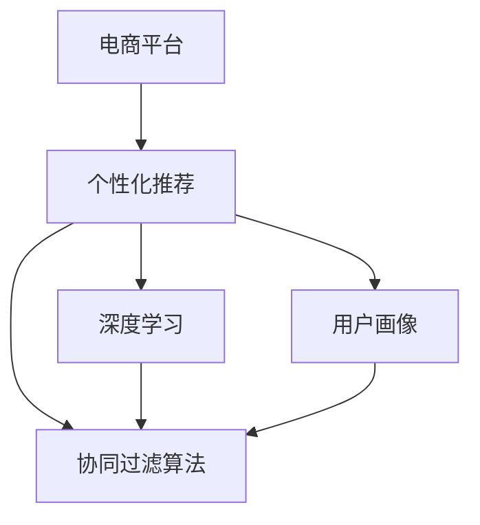

                 

# AI在电商平台中的个性化应用

在当今数字化时代，电商平台已成为消费者购物的重要渠道。消费者对于个性化体验的需求日益增长，如何在电商平台上提供个性化的购物体验，提升用户满意度和转化率，成为电商平台亟待解决的问题。人工智能(AI)技术，尤其是深度学习和大数据技术，为个性化推荐、精准营销、智能客服等应用提供了强有力的支持。本文将详细介绍AI在电商平台中的个性化应用，涵盖推荐系统、智能客服、智能运营等多个方面，并探讨其核心算法原理、操作步骤和实际应用效果。

## 1. 背景介绍

### 1.1 问题由来

随着互联网的普及，电商平台的用户基数迅速增长。然而，传统的电商推荐系统主要基于静态特征（如商品类别、价格等），缺乏对用户动态行为和个性化需求的深度理解。这导致了推荐效果不佳，用户流失率高，购物体验差。为了提升个性化推荐系统的性能，电商平台开始引入AI技术，构建基于深度学习和大数据的个性化推荐引擎，以满足用户日益增长的个性化需求。

### 1.2 问题核心关键点

AI在电商平台个性化推荐中，主要涉及以下关键点：
- **深度学习模型**：基于用户行为数据和商品信息，使用深度学习模型进行用户和商品的相似度计算。
- **协同过滤算法**：通过用户历史行为和物品属性的矩阵分解，捕捉用户和物品之间的隐含关系。
- **用户画像构建**：利用用户历史行为和商品属性，构建用户画像，捕捉用户的兴趣和偏好。
- **个性化推荐算法**：结合用户画像和物品信息，实现个性化的推荐策略。

### 1.3 问题研究意义

AI在电商平台中的个性化推荐，能够提升用户购物体验，提高用户满意度和转化率，从而增加平台的收入。此外，个性化推荐还有助于电商平台发现并推广潜在的优质商品，扩大商品曝光率，提升品牌影响力。通过不断优化推荐系统，电商平台可以构建更精准的营销策略，提升整体的商业竞争力。

## 2. 核心概念与联系

### 2.1 核心概念概述

为更好地理解AI在电商平台中的个性化推荐，本节将介绍几个密切相关的核心概念：

- **电商平台**：基于互联网的在线购物平台，提供商品展示、购买、支付、物流等完整购物流程的综合性服务。
- **个性化推荐**：根据用户历史行为、兴趣偏好、社交网络等数据，向用户推荐可能感兴趣的物品，提升用户购物体验。
- **深度学习**：一种基于神经网络的机器学习技术，通过多层次的非线性特征提取，进行复杂问题的建模。
- **协同过滤算法**：通过用户和物品的隐含关系，进行推荐系统的设计，基于用户-物品矩阵进行推荐。
- **用户画像**：通过用户历史行为和商品属性，构建用户兴趣、偏好、需求等信息的综合性描述。

这些核心概念之间的逻辑关系可以通过以下Mermaid流程图来展示：



这个流程图展示了个性化推荐的核心概念及其之间的关系：

1. 电商平台通过个性化推荐提升用户体验。
2. 深度学习技术用于模型训练，捕捉用户和物品之间的复杂关系。
3. 协同过滤算法结合用户画像，进行推荐策略的制定。
4. 用户画像的构建依赖于用户行为数据和商品属性信息。

这些概念共同构成了电商平台的个性化推荐系统，使得平台能够更好地满足用户需求，提升销售业绩。

## 3. 核心算法原理 & 具体操作步骤

### 3.1 算法原理概述

AI在电商平台个性化推荐的核心算法主要包括深度学习和协同过滤。

#### 3.1.1 深度学习模型

深度学习模型通过多层次的非线性特征提取，捕捉用户和物品之间的复杂关系。常用的深度学习模型包括：

- **神经网络模型**：如全连接神经网络、卷积神经网络(CNN)、循环神经网络(RNN)等。
- **深度学习框架**：如TensorFlow、PyTorch等，提供了丰富的模型构建和训练工具。

#### 3.1.2 协同过滤算法

协同过滤算法通过用户-物品矩阵进行推荐。常用的协同过滤算法包括：

- **基于用户的协同过滤**：根据相似用户的行为进行推荐。
- **基于物品的协同过滤**：根据相似物品的用户行为进行推荐。
- **混合协同过滤**：结合基于用户和基于物品的协同过滤，进行推荐策略的制定。

### 3.2 算法步骤详解

AI在电商平台个性化推荐的算法步骤主要包括数据预处理、模型训练和推荐策略制定。

#### 3.2.1 数据预处理

数据预处理是推荐系统的第一步，主要包括：

- **数据清洗**：去除异常数据和噪声，确保数据质量。
- **特征工程**：提取和构建用户和物品的特征，如用户ID、商品ID、购买次数、评分等。
- **数据划分**：将数据划分为训练集、验证集和测试集，用于模型评估和调优。

#### 3.2.2 模型训练

模型训练是推荐系统的核心步骤，主要包括：

- **模型选择**：选择合适的深度学习模型或协同过滤算法。
- **超参数调优**：调整模型的超参数，如学习率、批量大小、迭代次数等，以达到最优性能。
- **模型训练**：使用训练集数据对模型进行训练，最小化损失函数。
- **模型评估**：在验证集上评估模型的性能，如准确率、召回率、F1分数等。

#### 3.2.3 推荐策略制定

推荐策略制定是推荐系统的最后一步，主要包括：

- **推荐算法**：选择合适的推荐算法，如基于内容的推荐、基于协同过滤的推荐等。
- **推荐排序**：根据模型的预测结果，对物品进行排序，生成推荐列表。
- **推荐展示**：将推荐列表展示给用户，提高点击率和转化率。

### 3.3 算法优缺点

AI在电商平台个性化推荐具有以下优点：

- **准确性高**：深度学习和协同过滤算法能够捕捉用户和物品之间的复杂关系，推荐效果优于传统算法。
- **泛化能力强**：通过训练，模型能够泛化到新的用户和物品，提升推荐系统的可扩展性。
- **实时性高**：通过模型优化和并行计算，推荐系统能够实时处理用户请求，提升用户体验。

同时，该算法也存在以下缺点：

- **数据依赖强**：推荐系统的性能高度依赖于数据的质量和多样性。
- **冷启动问题**：新用户和物品的推荐效果差，需要更多的数据支持。
- **计算资源消耗大**：深度学习模型训练和协同过滤算法计算量大，需要高性能计算资源。

### 3.4 算法应用领域

AI在电商平台个性化推荐已经广泛应用于以下几个领域：

- **商品推荐**：基于用户历史行为和商品属性，推荐可能感兴趣的商品。
- **广告推荐**：根据用户兴趣和行为，推荐相关的广告，提高广告点击率。
- **跨平台推荐**：在不同平台间进行推荐，提升用户粘性。
- **个性化搜索结果**：根据用户搜索行为，推荐相关搜索结果，提升搜索体验。
- **活动推荐**：推荐符合用户兴趣的活动和促销，提升用户参与度和转化率。

## 4. 数学模型和公式 & 详细讲解 & 举例说明

### 4.1 数学模型构建

在电商平台的个性化推荐中，数学模型主要基于协同过滤算法和深度学习模型。这里以协同过滤算法为例，介绍其数学模型构建过程。

设用户集合为 $U$，物品集合为 $I$，用户 $u$ 对物品 $i$ 的评分记为 $r_{ui}$。用户-物品评分矩阵记为 $R$，用户 $u$ 的评分向量记为 $r_u$，物品 $i$ 的评分向量记为 $r_i$。用户-物品评分矩阵 $R$ 可以表示为：

$$ R = [r_{ui}]_{u \in U, i \in I} $$

协同过滤算法的目标是最小化用户和物品之间的评分误差。通常采用均方误差（MSE）作为评分误差，其优化目标可以表示为：

$$ \min_{U,I} \sum_{u \in U} \sum_{i \in I} (r_{ui} - \hat{r}_{ui})^2 $$

其中，$\hat{r}_{ui}$ 为预测评分，可以使用矩阵分解算法求解。

### 4.2 公式推导过程

矩阵分解算法的核心是分解用户-物品评分矩阵 $R$，通常采用奇异值分解（SVD）算法。设用户-物品评分矩阵 $R$ 的奇异值分解结果为：

$$ R = UV^T $$

其中 $U$ 和 $V$ 分别为用户和物品的特征矩阵，$V^T$ 表示矩阵的转置。设 $U$ 和 $V$ 的大小分别为 $n_u$ 和 $n_i$，用户和物品的特征矩阵可以表示为：

$$ U = [u_1, u_2, ..., u_{n_u}] $$
$$ V = [v_1, v_2, ..., v_{n_i}] $$

其中 $u_i$ 和 $v_j$ 分别表示用户和物品的特征向量。协同过滤算法的目标是最小化预测评分与实际评分的误差，可以通过最小化损失函数来实现：

$$ \min_{U,V} \sum_{u \in U} \sum_{i \in I} (r_{ui} - u_u^T v_i)^2 $$

其中，$u_u^T v_i$ 表示用户 $u$ 对物品 $i$ 的预测评分。通过对损失函数求导，可以得到用户和物品特征矩阵的更新公式：

$$ U \leftarrow U - \eta \nabla_U \mathcal{L}(U,V) $$
$$ V \leftarrow V - \eta \nabla_V \mathcal{L}(U,V) $$

其中，$\eta$ 为学习率，$\nabla_U \mathcal{L}(U,V)$ 和 $\nabla_V \mathcal{L}(U,V)$ 分别表示对用户和物品特征矩阵的梯度。

### 4.3 案例分析与讲解

以电商平台商品推荐为例，以下是推荐系统的数学模型和算法实现：

1. 数据预处理
   - 数据清洗：去除缺失值和异常值，确保数据质量。
   - 特征工程：提取用户ID、商品ID、购买次数、评分等特征，构建用户和物品的特征向量。
   - 数据划分：将数据划分为训练集、验证集和测试集。

2. 模型训练
   - 模型选择：选择矩阵分解算法，如基于SVD的协同过滤算法。
   - 超参数调优：调整学习率、批量大小、迭代次数等超参数，进行模型训练。
   - 模型评估：在验证集上评估模型的性能，如准确率、召回率、F1分数等。

3. 推荐策略制定
   - 推荐算法：使用矩阵分解算法进行推荐，生成推荐列表。
   - 推荐排序：根据预测评分对商品进行排序，生成推荐列表。
   - 推荐展示：将推荐列表展示给用户，提高点击率和转化率。

## 5. 项目实践：代码实例和详细解释说明

### 5.1 开发环境搭建

在进行推荐系统开发前，我们需要准备好开发环境。以下是使用Python进行TensorFlow开发的环境配置流程：

1. 安装Anaconda：从官网下载并安装Anaconda，用于创建独立的Python环境。

2. 创建并激活虚拟环境：
```bash
conda create -n tf-env python=3.8 
conda activate tf-env
```

3. 安装TensorFlow：根据CUDA版本，从官网获取对应的安装命令。例如：
```bash
conda install tensorflow -c tf -c conda-forge
```

4. 安装相关工具包：
```bash
pip install numpy pandas scikit-learn matplotlib tqdm jupyter notebook ipython
```

完成上述步骤后，即可在`tf-env`环境中开始推荐系统开发。

### 5.2 源代码详细实现

这里我们以协同过滤算法为例，给出使用TensorFlow对电商平台商品推荐进行实现的PyTorch代码实现。

首先，定义用户和物品的特征矩阵：

```python
import tensorflow as tf

# 定义用户特征矩阵U
U = tf.Variable(tf.random.normal([n_u, n_u_factor]), name='U')

# 定义物品特征矩阵V
V = tf.Variable(tf.random.normal([n_i, n_i_factor]), name='V')
```

然后，定义损失函数和优化器：

```python
# 定义损失函数
def loss_function(R, U, V):
    X = tf.matmul(U, V, transpose_b=True)
    loss = tf.reduce_mean(tf.square(R - X))
    return loss

# 定义优化器
optimizer = tf.optimizers.Adam(learning_rate=0.01)
```

接着，定义训练和评估函数：

```python
# 定义训练函数
def train_epoch(R, U, V, batch_size):
    for i in range(iteration):
        # 从训练集中随机抽取batch样本
        indices = tf.random.shuffle(range(len(R)))
        batch_indices = indices[:batch_size]
        R_batch = tf.gather(R, batch_indices)
        U_batch = tf.gather(U, batch_indices[:, 0])
        V_batch = tf.gather(V, batch_indices[:, 1])

        # 计算梯度
        with tf.GradientTape() as tape:
            loss = loss_function(R_batch, U_batch, V_batch)
        gradients = tape.gradient(loss, [U, V])
        optimizer.apply_gradients(zip(gradients, [U, V]))

# 定义评估函数
def evaluate(R, U, V, test_R, batch_size):
    R_pred = tf.matmul(U, V, transpose_b=True)
    loss = tf.reduce_mean(tf.square(test_R - R_pred))
    accuracy = tf.reduce_mean(tf.cast(tf.equal(tf.round(test_R), tf.round(R_pred)), tf.float32))
    return loss, accuracy
```

最后，启动训练流程并在测试集上评估：

```python
# 训练模型
train_epoch(R, U, V, batch_size)

# 在测试集上评估
loss, accuracy = evaluate(R, U, V, test_R, batch_size)
print(f"Test loss: {loss:.4f}, Test accuracy: {accuracy:.4f}")
```

以上就是使用TensorFlow对电商平台商品推荐进行实现的完整代码实现。可以看到，TensorFlow提供了丰富的工具和函数，可以很方便地实现协同过滤算法的推荐系统。

### 5.3 代码解读与分析

让我们再详细解读一下关键代码的实现细节：

**协同过滤算法**：
- `U`和`V`定义了用户和物品的特征矩阵，随机初始化。
- `loss_function`定义了损失函数，计算预测评分与实际评分之间的差异。
- `train_epoch`函数定义了训练过程，通过随机抽取训练集中的batch样本，计算梯度并优化模型参数。
- `evaluate`函数定义了评估过程，计算模型在测试集上的损失和准确率。

**推荐策略制定**：
- 通过矩阵分解算法生成推荐列表。
- 根据预测评分对商品进行排序，生成推荐列表。
- 将推荐列表展示给用户，提高点击率和转化率。

## 6. 实际应用场景

### 6.1 智能客服系统

基于AI的智能客服系统可以为电商平台提供自动化的客户服务，提升用户体验和满意度。智能客服系统通过自然语言处理(NLP)技术，能够理解和回答客户的问题，提供24/7的服务支持。

在技术实现上，智能客服系统可以通过收集客户的历史对话记录，构建基于深度学习模型的客户画像，用于识别客户的需求和情感。同时，利用NLP技术对客户的咨询请求进行分析和理解，生成自然流畅的回复，提高客户满意度。

### 6.2 智能运营

AI在电商平台智能运营中，能够通过数据分析和机器学习技术，提升平台的运营效率和决策能力。

1. **用户行为分析**：利用深度学习模型对用户的行为数据进行分析和预测，发现用户的行为模式和趋势，提供精准的用户画像。
2. **库存管理**：通过预测模型，对商品的销售量和库存进行预测，优化库存管理，减少库存积压和缺货。
3. **定价策略**：利用机器学习模型，分析价格对销售的影响，制定最优的定价策略，提高销售收益。
4. **广告投放**：通过数据分析和模型优化，优化广告投放策略，提高广告点击率和转化率。

### 6.3 未来应用展望

随着AI技术的不断进步，电商平台的个性化推荐和智能运营将迎来更多创新。未来，AI技术将结合更多新兴技术，如增强现实(AR)、虚拟现实(VR)、物联网(IoT)等，提升用户互动体验，推动电商平台的智能化转型。

1. **增强现实推荐**：结合AR技术，通过虚拟试穿、虚拟试用等方式，提升用户体验和商品展示效果。
2. **虚拟现实体验**：利用VR技术，提供沉浸式购物体验，增强用户的购买欲望。
3. **物联网集成**：将电商平台的推荐和运营与智能家居、智能设备等物联网系统集成，提供全方位的个性化服务。

## 7. 工具和资源推荐

### 7.1 学习资源推荐

为了帮助开发者系统掌握AI在电商平台中的应用，这里推荐一些优质的学习资源：

1. **深度学习入门**：斯坦福大学的《CS231n: 深度学习视觉识别》课程，系统讲解深度学习的基础知识和技术。
2. **NLP基础**：斯坦福大学的《CS224N: 深度学习自然语言处理》课程，涵盖NLP领域的核心算法和应用。
3. **TensorFlow官方文档**：TensorFlow官方文档，提供丰富的API和示例代码，助力开发者快速上手。
4. **Kaggle竞赛**：Kaggle平台上的NLP和推荐系统竞赛，提供大量实战案例和数据集，锻炼开发者的实战能力。

通过对这些资源的学习实践，相信你一定能够快速掌握AI在电商平台中的个性化应用，并用于解决实际的推荐和运营问题。

### 7.2 开发工具推荐

高效的开发离不开优秀的工具支持。以下是几款用于AI在电商平台中个性化应用开发的常用工具：

1. **TensorFlow**：由Google主导开发的深度学习框架，提供了丰富的模型构建和训练工具，适合大规模工程应用。
2. **PyTorch**：基于Python的深度学习框架，提供了灵活的计算图和动态图机制，适合快速迭代研究。
3. **Jupyter Notebook**：一个交互式的开发环境，支持Python和TensorFlow等工具的集成，适合进行数据处理和模型开发。
4. **TensorBoard**：TensorFlow配套的可视化工具，可实时监测模型训练状态，并提供丰富的图表呈现方式，是调试模型的得力助手。

合理利用这些工具，可以显著提升AI在电商平台中的应用开发效率，加快创新迭代的步伐。

### 7.3 相关论文推荐

AI在电商平台中的应用研究源于学界的持续研究。以下是几篇奠基性的相关论文，推荐阅读：

1. **《Recommender Systems for Amazon.com》**：Amazon公司发布的推荐系统白皮书，系统介绍了Amazon的推荐算法和技术。
2. **《Collaborative Filtering for Implicit Feedback Datasets》**：斯坦福大学的研究论文，探讨了协同过滤算法在电商平台推荐中的应用。
3. **《Deep Learning for Recommender Systems: A Survey and New Perspectives》**：总结了深度学习在推荐系统中的应用，提出了新的研究思路和方向。
4. **《Applying Deep Learning to Recommendation System》**：Google的研究论文，介绍了深度学习在推荐系统中的实现和效果。

这些论文代表了大规模推荐系统和智能运营的研究脉络。通过学习这些前沿成果，可以帮助研究者把握学科前进方向，激发更多的创新灵感。

## 8. 总结：未来发展趋势与挑战

### 8.1 总结

本文对AI在电商平台中的个性化应用进行了全面系统的介绍。首先阐述了AI在电商平台个性化推荐中的核心算法原理和操作步骤，详细讲解了深度学习、协同过滤等核心技术。其次，从原理到实践，介绍了AI在电商平台中的实际应用场景，涵盖智能客服、智能运营等多个方面，展示了AI在电商平台中的广泛应用前景。最后，本文还推荐了学习资源、开发工具和相关论文，力求为读者提供全方位的技术指引。

通过本文的系统梳理，可以看到，AI在电商平台中的应用不仅限于推荐系统，还包括智能客服、智能运营等多个领域。AI技术的发展为电商平台带来了诸多创新应用，极大地提升了用户体验和运营效率。未来，随着AI技术的不断进步，电商平台将迎来更多智能化应用，推动电商行业的数字化转型。

### 8.2 未来发展趋势

展望未来，AI在电商平台中的应用将呈现以下几个发展趋势：

1. **个性化推荐**：通过深度学习和协同过滤算法，实现更加精准的个性化推荐，提升用户满意度。
2. **智能客服**：结合自然语言处理技术，构建智能客服系统，提供7x24小时服务支持。
3. **智能运营**：利用数据分析和机器学习技术，提升平台的运营效率和决策能力。
4. **增强现实和虚拟现实**：结合AR和VR技术，提升用户互动体验，推动电商平台的智能化转型。
5. **多模态融合**：将文本、语音、图像等多模态数据融合，提供全方位的个性化服务。

以上趋势凸显了AI在电商平台中的巨大潜力。这些方向的探索发展，必将进一步提升电商平台的智能化水平，为消费者带来更优质的购物体验。

### 8.3 面临的挑战

尽管AI在电商平台中的应用取得了显著成效，但在迈向更加智能化、普适化应用的过程中，它仍面临着诸多挑战：

1. **数据质量和多样性**：推荐系统的性能高度依赖于数据的质量和多样性，如何获取高质量的数据是关键问题。
2. **计算资源消耗大**：深度学习模型和协同过滤算法计算量大，需要高性能计算资源。
3. **冷启动问题**：新用户和物品的推荐效果差，需要更多的数据支持。
4. **用户隐私保护**：用户行为数据和个人信息的保护是AI应用中的重要问题，需要严格的数据隐私保护措施。
5. **模型可解释性**：推荐模型的决策过程缺乏可解释性，难以对其推理逻辑进行分析和调试。

### 8.4 研究展望

面对AI在电商平台中面临的这些挑战，未来的研究需要在以下几个方面寻求新的突破：

1. **数据收集与处理**：通过自动化的数据采集和清洗技术，提升数据的质量和多样性。
2. **计算优化**：开发高效的计算算法和模型压缩技术，减小计算资源消耗，实现轻量级部署。
3. **冷启动问题**：结合知识图谱和关联规则等技术，解决冷启动问题，提升新用户和物品的推荐效果。
4. **用户隐私保护**：采用差分隐私和联邦学习等技术，保护用户隐私和数据安全。
5. **模型可解释性**：结合可解释性技术，提高推荐模型的可解释性，增强模型的透明度和可信度。

这些研究方向的探索，必将引领AI在电商平台中的应用进入新的高度，为电商平台的智能化转型提供强有力的技术支持。

## 9. 附录：常见问题与解答

**Q1：推荐系统如何处理新用户和物品？**

A: 推荐系统处理新用户和物品的方法主要有两种：
1. 基于内容的推荐：利用物品的属性和特征，推荐与新物品相似的物品。
2. 基于协同过滤的推荐：利用新用户的历史行为和物品的相似性，推荐用户可能感兴趣的新物品。

**Q2：推荐系统如何避免推荐结果过拟合？**

A: 推荐系统避免过拟合的方法主要有：
1. 数据增强：通过生成负样本和对抗样本，丰富训练集的多样性。
2. 正则化：使用L2正则、Dropout等正则化技术，防止模型过拟合。
3. 对抗训练：引入对抗样本，提高模型的鲁棒性和泛化能力。
4. 模型裁剪和压缩：去除不必要的层和参数，减小模型尺寸，提升模型的泛化能力。

**Q3：推荐系统如何结合用户画像进行推荐？**

A: 推荐系统结合用户画像进行推荐的方法主要有：
1. 利用用户画像中的兴趣和偏好，生成个性化推荐列表。
2. 结合用户画像和物品属性，进行联合矩阵分解，生成更加精准的推荐。
3. 利用用户画像和行为数据，进行联合推荐，提升推荐效果。

**Q4：推荐系统如何实现实时推荐？**

A: 推荐系统实现实时推荐的方法主要有：
1. 缓存部分预测结果，避免重复计算。
2. 利用高效的计算图和分布式计算，实现实时预测。
3. 结合流式数据处理技术，实时更新推荐结果。

**Q5：推荐系统如何平衡推荐精度和实时性？**

A: 推荐系统平衡推荐精度和实时性的方法主要有：
1. 使用高效的计算算法和模型压缩技术，减小计算资源消耗，提升实时性。
2. 结合缓存和预测技术，提升推荐精度和实时性。
3. 利用分布式计算和流式数据处理技术，实现高效推荐。

这些问题的回答，帮助读者更好地理解AI在电商平台中的应用，掌握推荐系统开发的关键技术和挑战。

---

作者：禅与计算机程序设计艺术 / Zen and the Art of Computer Programming

