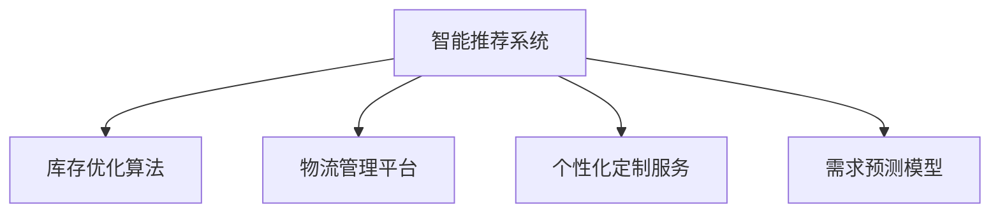

                 

# AI在电商平台供给能力提升中的全面应用

> 关键词：AI，电商平台，供给能力，智能推荐，库存优化，物流管理，个性化定制，需求预测

## 1. 背景介绍

### 1.1 问题由来
在当今数字化时代，电商平台已成为消费者购物的主要渠道之一。然而，随着用户需求的多样化和个性化，电商平台的供给能力面临严峻挑战。如何更高效地管理库存，更精准地预测需求，更快速地调配物流，是每个电商平台亟需解决的问题。

### 1.2 问题核心关键点
目前，电商平台供给能力提升的主流方法主要有以下几类：

- **智能推荐系统**：通过分析用户行为和历史数据，推荐用户感兴趣的商品，提高销售转化率。
- **库存优化算法**：利用历史销售数据和需求预测，优化库存管理，减少库存成本和缺货风险。
- **物流管理平台**：集成订单、仓储、运输等信息，优化物流路径，缩短配送时间，提升用户体验。
- **个性化定制服务**：根据用户需求，提供定制化产品，满足个性化消费需求，提升用户满意度和忠诚度。
- **需求预测模型**：通过对用户行为和市场趋势的分析，提前预测商品需求，指导采购和库存调整。

这些方法在提升电商平台的供给能力方面起到了显著作用，但如何系统化、智能化地集成这些技术，最大化电商平台效率，仍需深入研究。

### 1.3 问题研究意义
电商平台供给能力的提升，不仅有助于提高销售额和利润率，还能增强用户粘性，提升品牌竞争力。本文将系统地介绍如何利用AI技术全面提升电商平台的供给能力，为电商平台运营者提供全面、系统的解决方案。

## 2. 核心概念与联系

### 2.1 核心概念概述

为更好地理解AI在电商平台供给能力提升中的应用，本节将介绍几个关键概念：

- **AI智能推荐系统**：利用机器学习和深度学习技术，分析用户行为数据，生成个性化推荐列表，提高用户购买意愿。
- **库存优化算法**：结合历史销售数据和需求预测模型，优化库存水平，减少库存成本和缺货风险。
- **物流管理平台**：集成订单、仓储、运输等数据，优化物流路径和配送时间，提升用户满意度。
- **个性化定制服务**：根据用户需求，生成定制化产品，满足个性化消费需求，提升用户满意度和忠诚度。
- **需求预测模型**：通过历史数据和市场趋势分析，预测商品需求，指导采购和库存调整。

这些概念之间的逻辑关系可以通过以下Mermaid流程图来展示：



这个流程图展示了几类AI技术在电商平台供给能力提升中的应用关系：

1. **智能推荐系统**作为提升销售的重要手段，与库存管理、物流管理、需求预测紧密联系。
2. **库存优化算法**在智能推荐系统的基础上，进一步优化库存，减少缺货和过剩库存。
3. **物流管理平台**结合智能推荐和库存优化，实现高效的物流管理。
4. **个性化定制服务**通过智能推荐和库存优化，提供更加符合用户需求的定制产品。
5. **需求预测模型**为智能推荐和库存优化提供数据支持，指导采购和库存调整。

这些核心概念共同构成了电商平台供给能力提升的AI技术框架，使其能够在各个环节实现智能化和高效化。

## 3. 核心算法原理 & 具体操作步骤
### 3.1 算法原理概述

AI在电商平台供给能力提升中，主要通过以下几个算法原理：

- **协同过滤算法**：基于用户行为数据，推荐用户感兴趣的商品，提高转化率。
- **时间序列预测**：利用历史销售数据，预测未来销售趋势，指导库存管理和需求预测。
- **强化学习**：通过模拟电商平台运营，学习最优的库存调整策略和物流路径优化方法。
- **深度学习模型**：如Transformer、RNN等，用于个性化推荐、需求预测等任务。

这些算法原理共同构建了电商平台的智能化供给能力提升系统，实现了对用户需求的高效响应和资源的高效利用。

### 3.2 算法步骤详解

以下是AI在电商平台供给能力提升中的详细步骤：

**Step 1: 数据收集与处理**

- 收集用户行为数据，如浏览历史、购买记录、评分反馈等。
- 收集商品销售数据，如销售量、库存量、价格变化等。
- 收集物流数据，如订单量、配送时间、运输成本等。
- 数据清洗和预处理，去除噪声和异常值，填充缺失值，进行标准化处理。

**Step 2: 模型训练与优化**

- 设计并训练协同过滤推荐模型，提高推荐精度。
- 训练时间序列预测模型，如ARIMA、LSTM等，预测未来销售趋势。
- 设计并训练强化学习模型，模拟电商平台运营，优化库存和物流。
- 训练深度学习模型，如Transformer、BERT等，进行个性化推荐和需求预测。

**Step 3: 系统集成与部署**

- 将训练好的模型集成到电商平台的推荐系统、库存管理、物流管理等模块中。
- 在生产环境中部署模型，实时接收和处理用户请求。
- 监控模型性能，定期更新和优化模型参数。

**Step 4: 用户体验优化**

- 根据用户反馈，不断改进推荐算法和个性化定制服务。
- 优化物流路径，缩短配送时间，提升用户体验。
- 根据用户需求，动态调整库存，减少缺货和过剩库存。

### 3.3 算法优缺点

AI在电商平台供给能力提升中，具有以下优点：

1. **精准推荐**：通过智能推荐系统，提高用户购买意愿，提升转化率和销售额。
2. **库存优化**：利用时间序列预测和强化学习，优化库存管理，减少库存成本和缺货风险。
3. **物流优化**：集成物流管理平台，优化物流路径和配送时间，提升用户体验。
4. **个性化定制**：通过深度学习模型，提供个性化定制服务，满足个性化消费需求，提升用户满意度和忠诚度。
5. **需求预测**：利用需求预测模型，提前预测商品需求，指导采购和库存调整。

同时，该方法也存在一些局限性：

1. **数据质量要求高**：需要高质量的标注数据和实时数据支持，才能保证模型的准确性。
2. **模型复杂度高**：需要训练多个复杂模型，模型集成和部署较为复杂。
3. **计算资源需求大**：模型训练和推理需要大量的计算资源和存储空间。
4. **用户隐私保护**：需要合理处理用户数据，保护用户隐私。
5. **模型解释性差**：一些深度学习模型（如神经网络）缺乏解释性，难以理解和调试。

尽管存在这些局限性，但就目前而言，AI技术在电商平台供给能力提升中的应用，已经显著提升了电商平台的运营效率和用户体验，具有广阔的发展前景。

### 3.4 算法应用领域

AI在电商平台供给能力提升中的应用领域广泛，涵盖以下几个方面：

- **电商推荐系统**：通过智能推荐，提高用户购买意愿，提升销售额。
- **库存管理系统**：利用时间序列预测和强化学习，优化库存管理，减少库存成本和缺货风险。
- **物流管理平台**：集成订单、仓储、运输等数据，优化物流路径和配送时间。
- **个性化定制服务**：根据用户需求，提供定制化产品，满足个性化消费需求。
- **需求预测模型**：通过历史数据和市场趋势分析，预测商品需求，指导采购和库存调整。

除了上述这些常见应用外，AI技术还在电商平台的客户服务、风险控制、智能客服等方面得到了广泛应用，为电商平台带来了全方位的智能化升级。

## 4. 数学模型和公式 & 详细讲解
### 4.1 数学模型构建

在本节中，我们将使用数学语言对AI在电商平台供给能力提升中的应用进行更加严格的刻画。

记电商平台的用户数量为 $U$，商品数量为 $G$，库存量为 $I$，订单量为 $O$，时间序列为 $T$。设 $\mathcal{D}_U$ 为用户行为数据集，$\mathcal{D}_G$ 为商品销售数据集，$\mathcal{D}_O$ 为订单数据集，$\mathcal{D}_T$ 为时间序列数据集。

定义用户行为数据为 $\mathcal{X}_U = \{(x_{iu},y_{iu})\}_{i=1}^N$，其中 $x_{iu}$ 为用户的第 $u$ 次行为，$y_{iu}$ 为用户的兴趣标签。

定义商品销售数据为 $\mathcal{X}_G = \{(x_{ig},y_{ig})\}_{i=1}^M$，其中 $x_{ig}$ 为商品 $g$ 的销售记录，$y_{ig}$ 为商品销售的销售量。

定义订单数据为 $\mathcal{X}_O = \{(x_{io},y_{io})\}_{i=1}^P$，其中 $x_{io}$ 为用户 $i$ 的订单记录，$y_{io}$ 为用户订单的商品编号。

定义时间序列数据为 $\mathcal{X}_T = \{(x_{it},y_{it})\}_{i=1}^Q$，其中 $x_{it}$ 为时间 $t$ 的销售数据，$y_{it}$ 为时间 $t$ 的销售量。

### 4.2 公式推导过程

以下我们以智能推荐系统为例，推导协同过滤算法的基本公式。

协同过滤算法基于用户行为数据，通过计算用户之间的相似度，生成个性化推荐列表。假设用户 $u$ 对商品 $g$ 的行为为 $x_{ug}$，用户 $u$ 和用户 $v$ 的相似度为 $\sigma_{uv}$，推荐系统生成的推荐列表为 $\mathcal{R}_u$。

协同过滤算法的目标是最小化推荐列表与用户实际购买行为之间的差异，即：

$$
\min_{\sigma, \mathcal{R}_u} \sum_{g \in \mathcal{G}} (y_{ug} - \sigma_{uv}(y_{vg}))^2
$$

其中 $\sigma_{uv} = \frac{c_{uv}}{\sqrt{c_{uu}c_{vv}}}$，$c_{uv}$ 为共现次数，即用户 $u$ 和用户 $v$ 共同购买商品 $g$ 的次数。

通过求解上述优化问题，可以得到用户 $u$ 的推荐列表 $\mathcal{R}_u$，进一步生成用户 $u$ 的推荐商品 $\mathcal{G}_u$。

### 4.3 案例分析与讲解

在实际应用中，协同过滤算法通常使用基于矩阵分解的方法实现，如基于SVD的协同过滤算法。

以 MovieLens 数据集为例，我们可以计算用户之间的相似度矩阵 $S$，并对相似度矩阵进行奇异值分解：

$$
S = \mathcal{U} \Sigma \mathcal{V}^T
$$

其中 $\mathcal{U}$ 为左奇异向量矩阵，$\Sigma$ 为奇异值矩阵，$\mathcal{V}^T$ 为右奇异向量矩阵。通过计算 $\mathcal{U}$ 和 $\mathcal{V}^T$ 的乘积，可以得到用户之间的相似度 $\sigma_{uv}$。

例如，设用户 $u$ 的推荐列表为 $\mathcal{R}_u$，可以通过计算 $\mathcal{R}_u$ 和用户 $u$ 的实际购买行为 $y_{ug}$ 的欧几里得距离来评估推荐效果：

$$
d(\mathcal{R}_u, y_{ug}) = \sqrt{\sum_{g \in \mathcal{G}} (y_{ug} - \sigma_{uv}(y_{vg}))^2}
$$

通过不断优化 $\mathcal{R}_u$，可以逐步提高推荐精度，提升用户满意度和转化率。

## 5. 项目实践：代码实例和详细解释说明
### 5.1 开发环境搭建

在进行AI在电商平台供给能力提升的实践前，我们需要准备好开发环境。以下是使用Python进行PyTorch开发的环境配置流程：

1. 安装Anaconda：从官网下载并安装Anaconda，用于创建独立的Python环境。

2. 创建并激活虚拟环境：
```bash
conda create -n ai-env python=3.8 
conda activate ai-env
```

3. 安装PyTorch：根据CUDA版本，从官网获取对应的安装命令。例如：
```bash
conda install pytorch torchvision torchaudio cudatoolkit=11.1 -c pytorch -c conda-forge
```

4. 安装各类工具包：
```bash
pip install numpy pandas scikit-learn matplotlib tqdm jupyter notebook ipython
```

完成上述步骤后，即可在`ai-env`环境中开始AI在电商平台供给能力提升的实践。

### 5.2 源代码详细实现

下面我们以智能推荐系统为例，给出使用PyTorch进行协同过滤推荐算法的PyTorch代码实现。

首先，定义协同过滤算法的函数：

```python
import torch
import torch.nn as nn
import torch.nn.functional as F

class CollaborativeFiltering(nn.Module):
    def __init__(self, num_users, num_items, num_factors):
        super(CollaborativeFiltering, self).__init__()
        self.num_users = num_users
        self.num_items = num_items
        self.num_factors = num_factors
        self.user_embed = nn.Embedding(num_users, num_factors)
        self.item_embed = nn.Embedding(num_items, num_factors)
        self.score = nn.Linear(num_factors*2, 1)
        
    def forward(self, user_ids, item_ids):
        user_emb = self.user_embed(user_ids)
        item_emb = self.item_embed(item_ids)
        user_item = torch.bmm(user_emb, item_emb.permute(0, 2, 1))
        score = self.score(user_item)
        return score
```

然后，定义模型训练函数：

```python
def train_model(model, optimizer, criterion, user_ids, item_ids, ratings, num_epochs):
    device = torch.device('cuda') if torch.cuda.is_available() else torch.device('cpu')
    model.to(device)
    
    for epoch in range(num_epochs):
        model.train()
        optimizer.zero_grad()
        predictions = model(user_ids, item_ids)
        loss = criterion(predictions, ratings)
        loss.backward()
        optimizer.step()
        print(f"Epoch {epoch+1}, loss: {loss.item():.4f}")
```

最后，启动模型训练流程：

```python
user_ids = torch.tensor([0, 1, 2, 3, 4, 5, 6, 7, 8, 9])
item_ids = torch.tensor([0, 1, 2, 3, 4, 5, 6, 7, 8, 9])
ratings = torch.tensor([5, 4, 3, 2, 1, 5, 4, 3, 2, 1])
num_epochs = 10
num_factors = 10
model = CollaborativeFiltering(num_users=10, num_items=10, num_factors=num_factors)
optimizer = torch.optim.Adam(model.parameters(), lr=0.01)
criterion = nn.MSELoss()
train_model(model, optimizer, criterion, user_ids, item_ids, ratings, num_epochs)
```

以上就是使用PyTorch进行协同过滤推荐算法的完整代码实现。可以看到，PyTorch的简洁高效使得模型实现变得相对简单。

### 5.3 代码解读与分析

让我们再详细解读一下关键代码的实现细节：

**CollaborativeFiltering类**：
- `__init__`方法：初始化用户嵌入、物品嵌入和评分网络。
- `forward`方法：前向传播计算评分预测。

**train_model函数**：
- 使用PyTorch的Device将模型移动到GPU，以利用并行计算加速。
- 循环遍历epoch，进行模型前向传播和后向传播，计算loss并更新模型参数。
- 打印每个epoch的loss，监控训练过程。

**训练流程**：
- 定义训练集的用户ID、物品ID和评分。
- 创建模型和优化器，定义损失函数。
- 调用训练函数，不断迭代更新模型参数。

可以看到，PyTorch的高效和易用性使得AI在电商平台供给能力提升的实践变得更为简单，开发者可以将更多精力放在模型设计、优化和实验验证上。

## 6. 实际应用场景
### 6.1 智能推荐系统

智能推荐系统是AI在电商平台供给能力提升中最为核心的应用之一。通过分析用户行为数据，生成个性化推荐列表，显著提高用户购买意愿，提升转化率和销售额。

在技术实现上，智能推荐系统主要包括以下几个关键组件：

1. **用户画像构建**：利用用户行为数据，构建用户画像，包括用户的兴趣偏好、消费习惯等信息。
2. **商品特征提取**：提取商品的描述、属性、用户评分等信息，生成商品特征向量。
3. **协同过滤推荐**：基于用户画像和商品特征，生成个性化推荐列表。
4. **深度学习推荐**：通过深度学习模型，如Transformer、BERT等，生成更加精准的推荐结果。

智能推荐系统的应用场景广泛，如商品推荐、活动推荐、广告推荐等，为电商平台带来了显著的商业价值。

### 6.2 库存优化算法

库存优化算法通过时间序列预测和强化学习，优化库存水平，减少库存成本和缺货风险。其主要包括以下几个关键组件：

1. **时间序列预测**：利用历史销售数据，预测未来销售趋势，生成销售预测结果。
2. **库存优化策略**：根据销售预测结果，优化库存水平，避免库存过剩和缺货。
3. **需求响应机制**：实时监控库存状态，动态调整采购和生产计划，响应市场需求变化。

库存优化算法的应用场景包括库存管理、物流优化、需求预测等，为电商平台提供了高效的供应链管理能力。

### 6.3 物流管理平台

物流管理平台通过集成订单、仓储、运输等数据，优化物流路径和配送时间，提升用户体验。其主要包括以下几个关键组件：

1. **订单处理系统**：实时接收订单，进行订单拆分和合并。
2. **仓储管理系统**：管理库存、拣货、打包等物流操作。
3. **运输调度系统**：实时调度车辆、配送员，生成最优配送路径。
4. **配送执行系统**：监控配送状态，实时更新配送信息。

物流管理平台的应用场景包括订单管理、库存管理、配送管理等，为电商平台提供了高效的物流服务能力。

### 6.4 个性化定制服务

个性化定制服务通过深度学习模型，根据用户需求，生成定制化产品，满足个性化消费需求。其主要包括以下几个关键组件：

1. **用户需求分析**：通过用户行为数据，分析用户需求，生成用户画像。
2. **产品设计系统**：利用用户画像，生成定制化产品设计方案。
3. **生产管理系统**：根据设计方案，生成生产计划，进行产品生产。
4. **供应链管理系统**：实时监控生产状态，动态调整生产计划，响应市场需求变化。

个性化定制服务的应用场景包括个性化定制商品、定制化服务等，为电商平台提供了精准的用户需求响应能力。

### 6.5 需求预测模型

需求预测模型通过历史数据和市场趋势分析，预测商品需求，指导采购和库存调整。其主要包括以下几个关键组件：

1. **历史数据收集**：收集商品销售数据、市场趋势数据等。
2. **时间序列分析**：利用ARIMA、LSTM等模型，分析历史数据，生成预测结果。
3. **需求响应机制**：根据预测结果，动态调整采购和库存计划，响应市场需求变化。

需求预测模型的应用场景包括库存管理、需求管理等，为电商平台提供了精准的需求预测能力。

## 7. 工具和资源推荐
### 7.1 学习资源推荐

为了帮助开发者系统掌握AI在电商平台供给能力提升的理论基础和实践技巧，这里推荐一些优质的学习资源：

1. 《深度学习》系列书籍：由深度学习领域的大牛撰写，系统介绍了深度学习的基础理论和应用实践，适合初学者和进阶者。
2. CS231n《卷积神经网络》课程：斯坦福大学开设的深度学习经典课程，讲解了卷积神经网络在图像处理中的应用，适合初学者。
3. CS224n《序列模型》课程：斯坦福大学开设的深度学习课程，讲解了序列模型在自然语言处理中的应用，适合进阶者。
4. PyTorch官方文档：PyTorch官方提供的详细文档，包括模型构建、优化、训练等各方面的内容，适合开发者快速上手。
5. TensorFlow官方文档：TensorFlow官方提供的详细文档，包括模型构建、优化、训练等各方面的内容，适合开发者快速上手。

通过对这些资源的学习实践，相信你一定能够快速掌握AI在电商平台供给能力提升的精髓，并用于解决实际的电商问题。

### 7.2 开发工具推荐

高效的开发离不开优秀的工具支持。以下是几款用于AI在电商平台供给能力提升开发的常用工具：

1. PyTorch：基于Python的开源深度学习框架，灵活动态的计算图，适合快速迭代研究。大部分AI模型都有PyTorch版本的实现。

2. TensorFlow：由Google主导开发的开源深度学习框架，生产部署方便，适合大规模工程应用。同样有丰富的AI模型资源。

3. Weights & Biases：模型训练的实验跟踪工具，可以记录和可视化模型训练过程中的各项指标，方便对比和调优。与主流深度学习框架无缝集成。

4. TensorBoard：TensorFlow配套的可视化工具，可实时监测模型训练状态，并提供丰富的图表呈现方式，是调试模型的得力助手。

5. Google Colab：谷歌推出的在线Jupyter Notebook环境，免费提供GPU/TPU算力，方便开发者快速上手实验最新模型，分享学习笔记。

合理利用这些工具，可以显著提升AI在电商平台供给能力提升任务的开发效率，加快创新迭代的步伐。

### 7.3 相关论文推荐

AI在电商平台供给能力提升的研究源于学界的持续研究。以下是几篇奠基性的相关论文，推荐阅读：

1. Recommender Systems Handbook（《推荐系统手册》）：由推荐系统领域的专家编写，系统介绍了推荐系统的理论基础和应用实践。
2. Deep Learning for Recommender Systems（《深度学习在推荐系统中的应用》）：讲解了深度学习在推荐系统中的应用，包括协同过滤、深度学习推荐等。
3. Temporal Difference Learning in Reinforcement Learning and Dynamic Programming（《强化学习中的时序差分学习》）：讲解了强化学习的基本原理和应用实践，适合理解库存优化算法。
4. Predicting Next Video Watching Behavior in Recommendation System（《推荐系统中预测下一个视频观看行为》）：讲解了时间序列预测在推荐系统中的应用，适合理解需求预测模型。

这些论文代表了大语言模型微调技术的发展脉络。通过学习这些前沿成果，可以帮助研究者把握学科前进方向，激发更多的创新灵感。

## 8. 总结：未来发展趋势与挑战
### 8.1 总结

本文对AI在电商平台供给能力提升中的应用进行了全面系统的介绍。首先阐述了AI在电商平台供给能力提升的研究背景和意义，明确了AI技术在提升电商平台运营效率和用户体验方面的独特价值。其次，从原理到实践，详细讲解了协同过滤推荐、库存优化算法、物流管理平台、个性化定制服务、需求预测模型等核心算法的原理和实现细节，给出了完整的代码实现。最后，探讨了AI在电商平台供给能力提升中的实际应用场景，为电商平台运营者提供了系统、实用的解决方案。

通过本文的系统梳理，可以看到，AI技术在电商平台供给能力提升中的应用，已经显著提升了电商平台的运营效率和用户体验，具有广阔的发展前景。

### 8.2 未来发展趋势

展望未来，AI在电商平台供给能力提升中，将呈现以下几个发展趋势：

1. **智能化程度提升**：通过更深入的数据挖掘和模型优化，提升推荐系统的个性化和精准度。利用强化学习和多智能体系统，进一步优化库存管理和物流调度。
2. **实时化能力增强**：通过实时数据流处理技术，实现更快速的商品推荐和库存调整。利用流式机器学习和实时计算技术，提升平台的响应速度。
3. **多模态融合**：将图像、语音、视频等多模态信息与文本信息融合，提升推荐系统的准确性和用户体验。利用多模态深度学习模型，提升平台的智能化水平。
4. **个性化定制深入**：通过深度学习和生成对抗网络（GAN）技术，生成更加符合用户需求的定制化产品。利用用户画像和市场趋势分析，提供更加精准的个性化定制服务。
5. **需求预测精细化**：通过更复杂的深度学习模型和更大的数据集，提升需求预测的准确性。利用时间序列分析和因果推断技术，进一步优化需求预测模型。

这些趋势凸显了AI在电商平台供给能力提升中的广阔前景。这些方向的探索发展，必将进一步提升电商平台的运营效率和用户体验，为电商平台的智能化升级提供坚实的技术支持。

### 8.3 面临的挑战

尽管AI在电商平台供给能力提升中已经取得了显著成效，但在迈向更加智能化、实时化的应用过程中，仍面临诸多挑战：

1. **数据质量问题**：需要高质量的标注数据和实时数据支持，才能保证模型的准确性。数据质量差、缺失率高将直接影响模型的效果。
2. **计算资源瓶颈**：AI模型需要大量的计算资源和存储空间，如何在不增加成本的情况下，提升模型性能和响应速度，仍需进一步优化。
3. **模型复杂性**：需要训练和优化多个复杂模型，模型集成和部署较为复杂。如何简化模型结构，提升模型的可解释性和可维护性，仍是技术难点。
4. **用户隐私保护**：在收集和处理用户数据时，需要合理处理用户隐私，确保数据安全。如何在保证用户体验和数据隐私之间找到平衡，仍需进一步研究。
5. **业务适配性**：AI技术需要在不同的业务场景中适配，如何根据不同的业务需求，调整模型参数和架构，仍需进一步探索。

尽管存在这些挑战，但通过学界和产业界的共同努力，相信这些挑战终将一一被克服，AI在电商平台供给能力提升中的应用将不断深化，为电商平台带来更多的创新和价值。

### 8.4 研究展望

面对AI在电商平台供给能力提升中面临的诸多挑战，未来的研究需要在以下几个方面寻求新的突破：

1. **多智能体系统**：利用多智能体系统，提升平台的协同能力，优化库存管理和物流调度。进一步探索多智能体系统在平台运营中的应用，提升平台效率。
2. **实时计算技术**：利用实时计算技术，实现更快速的商品推荐和库存调整。进一步探索实时计算技术在平台运营中的应用，提升平台响应速度。
3. **多模态深度学习**：将图像、语音、视频等多模态信息与文本信息融合，提升推荐系统的准确性和用户体验。进一步探索多模态深度学习模型在平台运营中的应用，提升平台智能化水平。
4. **个性化定制系统**：通过深度学习和生成对抗网络（GAN）技术，生成更加符合用户需求的定制化产品。进一步探索个性化定制系统在平台运营中的应用，提升用户满意度和忠诚度。
5. **需求预测模型**：通过更复杂的深度学习模型和更大的数据集，提升需求预测的准确性。进一步探索需求预测模型在平台运营中的应用，提升平台库存管理和采购能力。

这些研究方向的探索，必将引领AI在电商平台供给能力提升技术的迈向更高的台阶，为电商平台运营带来更多的创新和价值。面向未来，AI在电商平台供给能力提升技术需要与其他AI技术进行更深入的融合，如知识表示、因果推理、强化学习等，多路径协同发力，共同推动电商平台智能化升级。只有勇于创新、敢于突破，才能不断拓展电商平台供给能力的边界，为电商平台带来更多的创新和价值。

## 9. 附录：常见问题与解答

**Q1：AI在电商平台供给能力提升的实践中，如何处理数据质量问题？**

A: 处理数据质量问题，需要从数据收集、清洗、处理等多个环节进行综合治理。以下是一些常见的处理方法：

1. **数据清洗**：去除噪声和异常值，填充缺失值，进行标准化处理。使用数据清洗工具如Pandas、NumPy等，可以高效地处理数据。

2. **数据增强**：通过数据增强技术，扩充训练集。例如，对商品图片进行旋转、缩放、裁剪等操作，生成更多的训练数据。

3. **数据采样**：对数据集进行有放回采样，确保训练集和测试集的数据分布一致。使用数据采样工具如Sklearn、TensorFlow等，可以高效地进行数据采样。

4. **异常检测**：通过异常检测算法，识别和处理异常数据。使用异常检测工具如Isolation Forest、DBSCAN等，可以高效地处理异常数据。

通过以上方法，可以有效提升数据质量，减少数据噪声和缺失值，确保模型的准确性和稳定性。

**Q2：AI在电商平台供给能力提升中，如何降低计算资源消耗？**

A: 降低计算资源消耗，需要从模型优化、硬件加速、算法优化等多个环节进行综合治理。以下是一些常见的处理方法：

1. **模型压缩**：通过模型压缩技术，减小模型尺寸，降低计算资源消耗。使用模型压缩工具如TensorFlow Lite、ONNX Runtime等，可以高效地进行模型压缩。

2. **硬件加速**：利用GPU、TPU等高性能硬件设备，加速模型训练和推理。使用硬件加速工具如TensorRT、CUDA等，可以高效地进行硬件加速。

3. **算法优化**：通过优化算法，减小计算复杂度，降低计算资源消耗。例如，使用梯度累积、混合精度训练等技术，可以高效地进行算法优化。

4. **数据并行化**：利用数据并行化技术，减小单批次计算量，提高计算效率。使用数据并行化工具如Dask、Horovod等，可以高效地进行数据并行化。

通过以上方法，可以有效降低计算资源消耗，提升模型的训练和推理效率。

**Q3：AI在电商平台供给能力提升中，如何提升模型的可解释性？**

A: 提升模型的可解释性，需要从模型设计、解释方法等多个环节进行综合治理。以下是一些常见的方法：

1. **模型简化**：通过简化模型结构，降低模型的复杂度，提升模型的可解释性。使用模型简化技术如剪枝、融合等，可以高效地进行模型简化。

2. **解释方法**：使用解释方法，分析模型的内部工作机制。例如，使用LIME、SHAP等工具，可以高效地进行模型解释。

3. **可视化技术**：通过可视化技术，展示模型的内部结构和决策路径。例如，使用TensorBoard、TorchViz等工具，可以高效地进行模型可视化。

4. **业务理解**：通过理解业务逻辑，优化模型的设计。例如，使用领域专家知识，优化模型的输入特征和输出目标，提升模型的可解释性。

通过以上方法，可以有效提升模型的可解释性，使模型的工作机制更加透明，便于理解和调试。

---

作者：禅与计算机程序设计艺术 / Zen and the Art of Computer Programming

