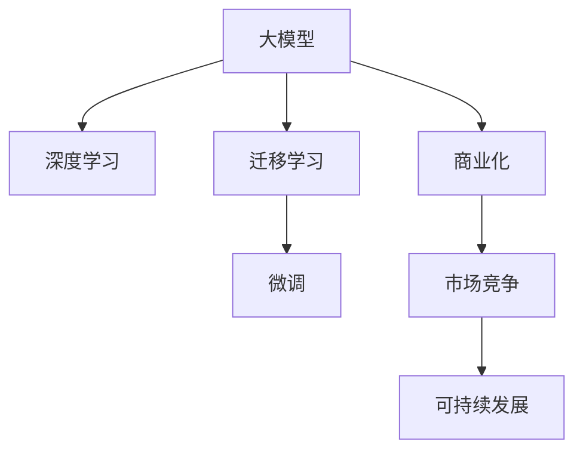

                 

# AI大模型创业战：挑战与机遇并存的思考探讨

> 关键词：大模型创业,人工智能商业化,技术挑战,行业机遇,可持续发展

## 1. 背景介绍

### 1.1 问题由来
随着人工智能技术的飞速发展，大模型已经成为企业竞争的核心资产。大模型凭借其庞大的数据训练规模和深层的特征表达能力，正在改变各行各业的技术格局。然而，大模型的商业化之路并不平坦，充满了各种挑战和机遇。本文将系统探讨大模型创业中的核心问题，为从业者提供深入的思考和建议。

### 1.2 问题核心关键点
大模型创业的核心问题可以归结为以下几个方面：
- **技术挑战**：如何构建高效、可靠的大模型，确保其在实际应用中的性能和稳定性。
- **商业化难题**：如何将大模型的核心技术和能力转化为实际的产品和商业模式，获得盈利。
- **市场竞争**：在人工智能快速发展的今天，如何与众多大模型公司和初创企业竞争，找到自身的差异化定位。
- **可持续发展**：如何在商业成功的同时，实现技术进步和社会责任的平衡，确保长期发展。

这些关键问题贯穿了大模型创业的全过程，对每个阶段都具有深远的影响。

## 2. 核心概念与联系

### 2.1 核心概念概述

要理解大模型创业，首先需要对核心概念有清晰的认识。以下是几个关键概念的简要概述：

- **大模型（Large Model）**：指拥有海量参数（通常超过亿级）的深度神经网络模型，用于处理大规模数据并生成高质量的输出。典型的大模型包括GPT系列、BERT、T5等。
- **深度学习（Deep Learning）**：利用多层次神经网络结构，从数据中自动学习抽象特征，解决复杂问题。深度学习在大模型构建中发挥着核心作用。
- **迁移学习（Transfer Learning）**：在大规模预训练基础上，通过微调等方法，将模型适应到特定任务，减少新任务所需的标注数据。
- **微调（Fine-Tuning）**：在大模型基础上，使用少量标注数据进行特定任务训练，调整模型参数以提升任务性能。
- **商业化（Commercialization）**：将大模型技术转化为实际的产品和商业模式，实现技术价值到商业价值的转化。
- **市场竞争（Market Competition）**：在人工智能领域，大模型公司之间争夺市场份额，寻求商业成功和技术领先。
- **可持续发展（Sustainability）**：在追求商业成功的同时，注重技术进步和社会责任，实现长期发展。

这些概念之间的关系可以通过以下Mermaid流程图来展示：



这个流程图展示了大模型创业的各个阶段及其相互联系：

1. 大模型通过深度学习构建。
2. 在特定任务上通过迁移学习和微调进行适配。
3. 将技术成果转化为商业产品和服务。
4. 在市场竞争中取得优势，实现商业成功。
5. 持续发展，追求技术和社会责任的双赢。

## 3. 核心算法原理 & 具体操作步骤
### 3.1 算法原理概述

大模型创业的核心算法原理主要包括深度学习模型的构建和微调技术的应用。大模型的构建过程涉及大量的数据预处理、模型训练和参数调整，而微调则是将大模型适配到特定任务的关键步骤。

**深度学习模型构建**：大模型通常通过大规模无标签数据进行预训练，学习到通用的特征表示。在此基础上，通过微调技术，对模型进行特定任务训练，使其能够处理实际应用中的具体问题。微调的过程包括定义任务、选择数据、设计模型、训练和评估等多个步骤，是实现大模型商业化的关键环节。

**微调技术**：微调技术通过在大模型上增加少量任务相关的层，并使用少量标注数据进行训练，调整模型参数以提升特定任务的表现。微调的过程包括以下几个关键步骤：

1. **任务定义**：确定微调任务的具体需求，包括输入格式、输出格式和评估指标。
2. **数据准备**：收集和预处理任务所需的标注数据，确保数据的质量和多样性。
3. **模型选择**：选择合适的预训练模型作为微调的基础，如BERT、GPT系列等。
4. **模型适配**：在大模型上增加或修改若干层，以适应微调任务的输入和输出格式。
5. **训练过程**：使用标注数据进行有监督训练，优化模型参数以提升任务表现。
6. **评估与优化**：在验证集上评估模型性能，根据结果进行模型调整，确保模型在实际应用中的表现。

### 3.2 算法步骤详解

以下是大模型微调的一般步骤：

**Step 1: 任务定义**
- 明确微调任务的具体需求，包括输入格式、输出格式和评估指标。
- 确定微调任务的监督信号，如分类任务中的标签、回归任务中的数值等。

**Step 2: 数据准备**
- 收集微调任务所需的标注数据，并进行预处理，包括数据清洗、归一化、分批处理等。
- 确保数据的质量和多样性，防止模型过拟合。

**Step 3: 模型选择与适配**
- 选择适当的预训练模型作为微调的基础。
- 在大模型上增加或修改若干层，以适应微调任务的输入和输出格式。

**Step 4: 训练过程**
- 定义损失函数，如交叉熵损失、均方误差损失等，用于衡量模型预测与真实标签的差异。
- 使用优化算法（如Adam、SGD等）和适当的超参数（如学习率、批大小等）进行训练。
- 在训练过程中使用正则化技术（如L2正则、Dropout等）防止模型过拟合。

**Step 5: 评估与优化**
- 在验证集上评估模型性能，确保模型在未见过的数据上也有良好的表现。
- 根据评估结果进行调整，优化模型参数，提升模型性能。

**Step 6: 部署与优化**
- 将微调后的模型部署到实际应用中，进行大规模推理和测试。
- 持续监控模型性能，进行参数更新和优化，确保模型长期稳定运行。

### 3.3 算法优缺点

大模型微调技术有以下优点：
- 高效：使用预训练模型作为基础，减少了标注数据的需求和训练时间。
- 鲁棒性：通过迁移学习，模型能够适应新任务的分布，避免从头训练的过拟合问题。
- 灵活性：可以根据具体任务需求，灵活调整模型结构，提升任务表现。

同时，也存在一些缺点：
- 依赖数据：微调效果依赖于标注数据的质量和多样性，获取高质量数据成本较高。
- 参数复杂：大模型通常具有大量的参数，训练和优化过程复杂。
- 技术门槛：微调过程涉及深度学习、模型架构设计等多个技术领域，技术门槛较高。

### 3.4 算法应用领域

大模型微调技术广泛应用于各种人工智能应用中，如自然语言处理（NLP）、计算机视觉（CV）、语音识别（ASR）、推荐系统等。具体应用领域包括：

- **自然语言处理（NLP）**：微调大模型进行文本分类、情感分析、问答系统、机器翻译等任务。
- **计算机视觉（CV）**：微调大模型进行图像分类、目标检测、图像分割、生成对抗网络（GAN）等任务。
- **语音识别（ASR）**：微调大模型进行语音识别、语音合成等任务。
- **推荐系统**：微调大模型进行个性化推荐、广告推荐等任务。

## 4. 数学模型和公式 & 详细讲解 & 举例说明

### 4.1 数学模型构建

大模型微调的核心数学模型通常采用神经网络架构，如卷积神经网络（CNN）、循环神经网络（RNN）、Transformer等。以下以Transformer为例，介绍大模型的数学模型构建。

Transformer模型由多个自注意力层组成，每个层包含多头自注意力（Multi-Head Attention）、前馈神经网络（Feed Forward Neural Network）和残差连接（Residual Connection）等组件。数学上，Transformer模型的前向传播过程可以表示为：

$$
\text{Encoder} = \text{Multi-Head Attention}(\text{Input}, \text{Input}) + \text{Feed Forward Neural Network}(\text{Encoder})
$$

其中，Input为输入数据，Encoder为编码器输出，Feed Forward Neural Network为前馈网络。

### 4.2 公式推导过程

Transformer模型的具体推导过程较为复杂，涉及矩阵乘法、向量内积、softmax等数学知识。以下仅给出核心部分的推导：

- **多头自注意力机制**：
  $$
  Q = K^T @ A
  $$
  $$
  V = K^T @ B
  $$
  $$
  Attention(Q, K, V) = \text{softmax}(Q K^T) V
  $$

  其中，$K$、$V$为输入矩阵，$A$、$B$为权重矩阵。

- **前馈网络**：
  $$
  F = \max(\text{ReLU}(F_1), 0)
  $$
  $$
  F_1 = FFN(F_0)
  $$
  $$
  FFN(x) = W_2 x + b_2 \text{ReLU}(W_1 x + b_1)
  $$

  其中，$W_1$、$W_2$为权重矩阵，$b_1$、$b_2$为偏置项。

### 4.3 案例分析与讲解

以文本分类任务为例，说明大模型微调的具体实现过程：

- **任务定义**：文本分类任务的目标是将输入文本分为不同类别，如情感分类、新闻分类等。
- **数据准备**：收集标注数据集，包括文本和对应的类别标签。
- **模型选择**：选择BERT或GPT等预训练模型作为微调基础。
- **模型适配**：在大模型基础上增加分类器层，并调整输出格式。
- **训练过程**：使用标注数据进行训练，最小化交叉熵损失。
- **评估与优化**：在验证集上评估模型性能，根据评估结果进行参数调整。

以下是一个简单的Python代码实现：

```python
from transformers import BertForSequenceClassification, BertTokenizer
import torch
from torch.utils.data import DataLoader
from sklearn.metrics import accuracy_score

# 定义模型和分词器
model = BertForSequenceClassification.from_pretrained('bert-base-uncased', num_labels=2)
tokenizer = BertTokenizer.from_pretrained('bert-base-uncased')

# 加载数据集
train_data = ...
train_loader = DataLoader(train_data, batch_size=16)
val_data = ...
val_loader = DataLoader(val_data, batch_size=16)

# 训练模型
model.train()
for epoch in range(10):
    for batch in train_loader:
        input_ids = batch.input_ids
        attention_mask = batch.attention_mask
        labels = batch.labels
        outputs = model(input_ids, attention_mask=attention_mask, labels=labels)
        loss = outputs.loss
        optimizer.zero_grad()
        loss.backward()
        optimizer.step()

# 评估模型
model.eval()
with torch.no_grad():
    predictions = []
    labels = []
    for batch in val_loader:
        input_ids = batch.input_ids
        attention_mask = batch.attention_mask
        labels = batch.labels
        outputs = model(input_ids, attention_mask=attention_mask)
        predictions.extend(outputs.logits.argmax(dim=1).tolist())
        labels.extend(labels.tolist())

    accuracy = accuracy_score(labels, predictions)
    print(f"Validation Accuracy: {accuracy:.4f}")
```

## 5. 项目实践：代码实例和详细解释说明

### 5.1 开发环境搭建

在进行大模型微调实践前，我们需要准备好开发环境。以下是使用Python进行PyTorch开发的环境配置流程：

1. 安装Anaconda：从官网下载并安装Anaconda，用于创建独立的Python环境。

2. 创建并激活虚拟环境：
```bash
conda create -n pytorch-env python=3.8 
conda activate pytorch-env
```

3. 安装PyTorch：根据CUDA版本，从官网获取对应的安装命令。例如：
```bash
conda install pytorch torchvision torchaudio cudatoolkit=11.1 -c pytorch -c conda-forge
```

4. 安装Transformer库：
```bash
pip install transformers
```

5. 安装各类工具包：
```bash
pip install numpy pandas scikit-learn matplotlib tqdm jupyter notebook ipython
```

完成上述步骤后，即可在`pytorch-env`环境中开始微调实践。

### 5.2 源代码详细实现

下面我们以图像分类任务为例，给出使用Transformers库对ResNet模型进行微调的PyTorch代码实现。

首先，定义图像分类任务的数据处理函数：

```python
from transformers import ResNetForSequenceClassification, ResNetTokenizer
from torch.utils.data import Dataset
import torch

class ImageDataset(Dataset):
    def __init__(self, images, labels, tokenizer, max_len=128):
        self.images = images
        self.labels = labels
        self.tokenizer = tokenizer
        self.max_len = max_len
        
    def __len__(self):
        return len(self.images)
    
    def __getitem__(self, item):
        image = self.images[item]
        label = self.labels[item]
        
        # 对图像进行编码
        encoding = self.tokenizer(image, return_tensors='pt', max_length=self.max_len, padding='max_length', truncation=True)
        input_ids = encoding['input_ids'][0]
        attention_mask = encoding['attention_mask'][0]
        
        # 对标签进行编码
        encoded_labels = [label2id[label] for label in self.labels] 
        encoded_labels.extend([label2id['O']] * (self.max_len - len(encoded_labels)))
        labels = torch.tensor(encoded_labels, dtype=torch.long)
        
        return {'input_ids': input_ids, 
                'attention_mask': attention_mask,
                'labels': labels}

# 标签与id的映射
label2id = {'O': 0, 'Cats': 1, 'Dogs': 2}
id2label = {v: k for k, v in label2id.items()}

# 创建dataset
tokenizer = ResNetTokenizer.from_pretrained('resnet-50')

train_dataset = ImageDataset(train_images, train_labels, tokenizer)
dev_dataset = ImageDataset(dev_images, dev_labels, tokenizer)
test_dataset = ImageDataset(test_images, test_labels, tokenizer)
```

然后，定义模型和优化器：

```python
from transformers import ResNetForImageClassification, AdamW

model = ResNetForImageClassification.from_pretrained('resnet-50', num_labels=len(label2id))

optimizer = AdamW(model.parameters(), lr=2e-5)
```

接着，定义训练和评估函数：

```python
from torch.utils.data import DataLoader
from tqdm import tqdm
from sklearn.metrics import accuracy_score

device = torch.device('cuda') if torch.cuda.is_available() else torch.device('cpu')
model.to(device)

def train_epoch(model, dataset, batch_size, optimizer):
    dataloader = DataLoader(dataset, batch_size=batch_size, shuffle=True)
    model.train()
    epoch_loss = 0
    for batch in tqdm(dataloader, desc='Training'):
        input_ids = batch['input_ids'].to(device)
        attention_mask = batch['attention_mask'].to(device)
        labels = batch['labels'].to(device)
        model.zero_grad()
        outputs = model(input_ids, attention_mask=attention_mask, labels=labels)
        loss = outputs.loss
        epoch_loss += loss.item()
        loss.backward()
        optimizer.step()
    return epoch_loss / len(dataloader)

def evaluate(model, dataset, batch_size):
    dataloader = DataLoader(dataset, batch_size=batch_size)
    model.eval()
    predictions, labels = [], []
    with torch.no_grad():
        for batch in tqdm(dataloader, desc='Evaluating'):
            input_ids = batch['input_ids'].to(device)
            attention_mask = batch['attention_mask'].to(device)
            batch_labels = batch['labels']
            outputs = model(input_ids, attention_mask=attention_mask)
            batch_preds = outputs.logits.argmax(dim=2).to('cpu').tolist()
            batch_labels = batch_labels.to('cpu').tolist()
            for pred_tokens, label_tokens in zip(batch_preds, batch_labels):
                pred_labels = [id2label[_id] for _id in pred_tokens]
                label_tags = [id2label[_id] for _id in label_tokens]
                predictions.append(pred_labels[:len(label_tags)])
                labels.append(label_tags)
                
    print(accuracy_score(labels, predictions))
```

最后，启动训练流程并在测试集上评估：

```python
epochs = 5
batch_size = 16

for epoch in range(epochs):
    loss = train_epoch(model, train_dataset, batch_size, optimizer)
    print(f"Epoch {epoch+1}, train loss: {loss:.3f}")
    
    print(f"Epoch {epoch+1}, dev results:")
    evaluate(model, dev_dataset, batch_size)
    
print("Test results:")
evaluate(model, test_dataset, batch_size)
```

以上就是使用PyTorch对ResNet进行图像分类任务微调的完整代码实现。可以看到，得益于Transformers库的强大封装，我们可以用相对简洁的代码完成ResNet模型的加载和微调。

### 5.3 代码解读与分析

让我们再详细解读一下关键代码的实现细节：

**ImageDataset类**：
- `__init__`方法：初始化图像、标签、分词器等关键组件。
- `__len__`方法：返回数据集的样本数量。
- `__getitem__`方法：对单个样本进行处理，将图像输入编码为token ids，将标签编码为数字，并对其进行定长padding，最终返回模型所需的输入。

**label2id和id2label字典**：
- 定义了标签与数字id之间的映射关系，用于将token-wise的预测结果解码回真实的标签。

**训练和评估函数**：
- 使用PyTorch的DataLoader对数据集进行批次化加载，供模型训练和推理使用。
- 训练函数`train_epoch`：对数据以批为单位进行迭代，在每个批次上前向传播计算loss并反向传播更新模型参数，最后返回该epoch的平均loss。
- 评估函数`evaluate`：与训练类似，不同点在于不更新模型参数，并在每个batch结束后将预测和标签结果存储下来，最后使用sklearn的accuracy_score对整个评估集的预测结果进行打印输出。

**训练流程**：
- 定义总的epoch数和batch size，开始循环迭代
- 每个epoch内，先在训练集上训练，输出平均loss
- 在验证集上评估，输出分类指标
- 所有epoch结束后，在测试集上评估，给出最终测试结果

可以看到，PyTorch配合Transformers库使得ResNet微调的代码实现变得简洁高效。开发者可以将更多精力放在数据处理、模型改进等高层逻辑上，而不必过多关注底层的实现细节。

当然，工业级的系统实现还需考虑更多因素，如模型的保存和部署、超参数的自动搜索、更灵活的任务适配层等。但核心的微调范式基本与此类似。

## 6. 实际应用场景
### 6.1 智能客服系统

基于大模型微调的对话技术，可以广泛应用于智能客服系统的构建。传统客服往往需要配备大量人力，高峰期响应缓慢，且一致性和专业性难以保证。而使用微调后的对话模型，可以7x24小时不间断服务，快速响应客户咨询，用自然流畅的语言解答各类常见问题。

在技术实现上，可以收集企业内部的历史客服对话记录，将问题和最佳答复构建成监督数据，在此基础上对预训练对话模型进行微调。微调后的对话模型能够自动理解用户意图，匹配最合适的答案模板进行回复。对于客户提出的新问题，还可以接入检索系统实时搜索相关内容，动态组织生成回答。如此构建的智能客服系统，能大幅提升客户咨询体验和问题解决效率。

### 6.2 金融舆情监测

金融机构需要实时监测市场舆论动向，以便及时应对负面信息传播，规避金融风险。传统的人工监测方式成本高、效率低，难以应对网络时代海量信息爆发的挑战。基于大语言模型微调的文本分类和情感分析技术，为金融舆情监测提供了新的解决方案。

具体而言，可以收集金融领域相关的新闻、报道、评论等文本数据，并对其进行主题标注和情感标注。在此基础上对预训练语言模型进行微调，使其能够自动判断文本属于何种主题，情感倾向是正面、中性还是负面。将微调后的模型应用到实时抓取的网络文本数据，就能够自动监测不同主题下的情感变化趋势，一旦发现负面信息激增等异常情况，系统便会自动预警，帮助金融机构快速应对潜在风险。

### 6.3 个性化推荐系统

当前的推荐系统往往只依赖用户的历史行为数据进行物品推荐，无法深入理解用户的真实兴趣偏好。基于大语言模型微调技术，个性化推荐系统可以更好地挖掘用户行为背后的语义信息，从而提供更精准、多样的推荐内容。

在实践中，可以收集用户浏览、点击、评论、分享等行为数据，提取和用户交互的物品标题、描述、标签等文本内容。将文本内容作为模型输入，用户的后续行为（如是否点击、购买等）作为监督信号，在此基础上微调预训练语言模型。微调后的模型能够从文本内容中准确把握用户的兴趣点。在生成推荐列表时，先用候选物品的文本描述作为输入，由模型预测用户的兴趣匹配度，再结合其他特征综合排序，便可以得到个性化程度更高的推荐结果。

### 6.4 未来应用展望

随着大语言模型微调技术的发展，其应用前景将更加广阔。未来，大模型微调技术将在更多领域得到应用，为传统行业带来变革性影响。

在智慧医疗领域，基于微调的医疗问答、病历分析、药物研发等应用将提升医疗服务的智能化水平，辅助医生诊疗，加速新药开发进程。

在智能教育领域，微调技术可应用于作业批改、学情分析、知识推荐等方面，因材施教，促进教育公平，提高教学质量。

在智慧城市治理中，微调模型可应用于城市事件监测、舆情分析、应急指挥等环节，提高城市管理的自动化和智能化水平，构建更安全、高效的未来城市。

此外，在企业生产、社会治理、文娱传媒等众多领域，基于大模型微调的人工智能应用也将不断涌现，为经济社会发展注入新的动力。

## 7. 工具和资源推荐
### 7.1 学习资源推荐

为了帮助开发者系统掌握大语言模型微调的理论基础和实践技巧，这里推荐一些优质的学习资源：

1. 《Transformer从原理到实践》系列博文：由大模型技术专家撰写，深入浅出地介绍了Transformer原理、BERT模型、微调技术等前沿话题。

2. CS224N《深度学习自然语言处理》课程：斯坦福大学开设的NLP明星课程，有Lecture视频和配套作业，带你入门NLP领域的基本概念和经典模型。

3. 《Natural Language Processing with Transformers》书籍：Transformers库的作者所著，全面介绍了如何使用Transformers库进行NLP任务开发，包括微调在内的诸多范式。

4. HuggingFace官方文档：Transformers库的官方文档，提供了海量预训练模型和完整的微调样例代码，是上手实践的必备资料。

5. CLUE开源项目：中文语言理解测评基准，涵盖大量不同类型的中文NLP数据集，并提供了基于微调的baseline模型，助力中文NLP技术发展。

通过对这些资源的学习实践，相信你一定能够快速掌握大语言模型微调的精髓，并用于解决实际的NLP问题。
###  7.2 开发工具推荐

高效的开发离不开优秀的工具支持。以下是几款用于大语言模型微调开发的常用工具：

1. PyTorch：基于Python的开源深度学习框架，灵活动态的计算图，适合快速迭代研究。大部分预训练语言模型都有PyTorch版本的实现。

2. TensorFlow：由Google主导开发的开源深度学习框架，生产部署方便，适合大规模工程应用。同样有丰富的预训练语言模型资源。

3. Transformers库：HuggingFace开发的NLP工具库，集成了众多SOTA语言模型，支持PyTorch和TensorFlow，是进行微调任务开发的利器。

4. Weights & Biases：模型训练的实验跟踪工具，可以记录和可视化模型训练过程中的各项指标，方便对比和调优。与主流深度学习框架无缝集成。

5. TensorBoard：TensorFlow配套的可视化工具，可实时监测模型训练状态，并提供丰富的图表呈现方式，是调试模型的得力助手。

6. Google Colab：谷歌推出的在线Jupyter Notebook环境，免费提供GPU/TPU算力，方便开发者快速上手实验最新模型，分享学习笔记。

合理利用这些工具，可以显著提升大语言模型微调任务的开发效率，加快创新迭代的步伐。

### 7.3 相关论文推荐

大语言模型和微调技术的发展源于学界的持续研究。以下是几篇奠基性的相关论文，推荐阅读：

1. Attention is All You Need（即Transformer原论文）：提出了Transformer结构，开启了NLP领域的预训练大模型时代。

2. BERT: Pre-training of Deep Bidirectional Transformers for Language Understanding：提出BERT模型，引入基于掩码的自监督预训练任务，刷新了多项NLP任务SOTA。

3. Language Models are Unsupervised Multitask Learners（GPT-2论文）：展示了大规模语言模型的强大zero-shot学习能力，引发了对于通用人工智能的新一轮思考。

4. Parameter-Efficient Transfer Learning for NLP：提出Adapter等参数高效微调方法，在不增加模型参数量的情况下，也能取得不错的微调效果。

5. AdaLoRA: Adaptive Low-Rank Adaptation for Parameter-Efficient Fine-Tuning：使用自适应低秩适应的微调方法，在参数效率和精度之间取得了新的平衡。

6. Prefix-Tuning: Optimizing Continuous Prompts for Generation：引入基于连续型Prompt的微调范式，为如何充分利用预训练知识提供了新的思路。

这些论文代表了大语言模型微调技术的发展脉络。通过学习这些前沿成果，可以帮助研究者把握学科前进方向，激发更多的创新灵感。

## 8. 总结：未来发展趋势与挑战

### 8.1 总结

本文对基于大语言模型的创业之路进行了全面系统的探讨。从技术挑战到商业化难题，从市场竞争到可持续发展，我们系统梳理了各大模型创业的各个环节，帮助从业者全面理解其中的复杂性和机遇性。

通过本文的系统梳理，可以看到，大模型创业不仅是技术竞争的战场，更是商业智慧的较量。在大模型的构建和微调过程中，需要技术、业务、市场、资金等多个方面的协同努力，方能在激烈的市场竞争中脱颖而出。

### 8.2 未来发展趋势

展望未来，大模型创业将呈现以下几个发展趋势：

1. **技术创新**：随着算力和数据的不断提升，大模型的规模和复杂度将进一步增加。未来，更多先进架构和技术将被引入到大模型中，如混合精度训练、模型压缩、分布式训练等，提升大模型的性能和效率。

2. **应用多样**：大模型的应用场景将从传统的自然语言处理、计算机视觉等扩展到更多领域，如智能医疗、智能教育、智能城市等，助力各行各业实现智能化升级。

3. **模型生态**：随着大模型技术的普及，更多企业和研究机构将参与到大模型的开发和应用中，形成生态系统，加速技术的传播和应用。

4. **商业成功**：通过合理的产品策略和市场定位，大模型公司将逐步实现商业化成功，创造巨大的商业价值和社会影响。

5. **可持续发展**：在追求商业成功的同时，大模型公司将更加注重社会责任和技术伦理，推动人工智能技术的健康发展。

以上趋势凸显了大模型创业的广阔前景。这些方向的探索发展，必将进一步推动人工智能技术的成熟和普及，为人类社会带来深远的影响。

### 8.3 面临的挑战

尽管大模型创业充满了机遇，但在实现过程中仍面临诸多挑战：

1. **数据和计算资源**：大模型的构建和微调需要大量数据和算力，对于中小型企业来说，获取这些资源存在困难。
2. **技术门槛高**：大模型涉及深度学习、分布式计算、自然语言处理等多个领域的复杂技术，门槛较高。
3. **市场竞争激烈**：大模型市场已经趋于饱和，企业需要在技术、服务、市场等方面进行全面竞争，才能脱颖而出。
4. **伦理和隐私**：大模型可能涉及大量用户数据，需要严格遵守数据隐私和伦理规范，确保用户权益和数据安全。

这些挑战需要在技术创新、商业模式、市场策略等多个方面进行综合应对，才能实现大模型创业的成功。

### 8.4 研究展望

面对大模型创业所面临的诸多挑战，未来的研究需要在以下几个方面寻求新的突破：

1. **高效计算架构**：开发更高效的计算架构，如混合精度训练、模型压缩等，提升大模型的训练和推理效率。

2. **跨模态融合**：探索跨模态融合技术，将视觉、语音、文本等不同模态的信息进行有效整合，提升大模型的通用性和鲁棒性。

3. **参数高效微调**：开发更多参数高效微调方法，如Adapter、Prefix-Tuning等，在减少参数量的同时，提升微调效果。

4. **伦理与隐私保护**：在模型开发过程中，注重伦理和隐私保护，确保数据安全和用户权益。

5. **模型可解释性**：提高模型的可解释性，增强用户对大模型的信任和理解，推动模型在实际应用中的落地。

6. **跨领域应用**：将大模型应用于更多领域，如智能医疗、智能教育、智能城市等，拓展大模型的应用范围。

这些研究方向将推动大模型创业迈向成熟，为人工智能技术的可持续发展奠定坚实基础。

## 9. 附录：常见问题与解答

**Q1：大模型微调是否适用于所有NLP任务？**

A: 大模型微调在大多数NLP任务上都能取得不错的效果，特别是对于数据量较小的任务。但对于一些特定领域的任务，如医学、法律等，仅仅依靠通用语料预训练的模型可能难以很好地适应。此时需要在特定领域语料上进一步预训练，再进行微调，才能获得理想效果。

**Q2：微调过程中如何选择合适的学习率？**

A: 微调的学习率一般要比预训练时小1-2个数量级，如果使用过大的学习率，容易破坏预训练权重，导致过拟合。一般建议从1e-5开始调参，逐步减小学习率，直至收敛。也可以使用warmup策略，在开始阶段使用较小的学习率，再逐渐过渡到预设值。需要注意的是，不同的优化器(如AdamW、Adafactor等)以及不同的学习率调度策略，可能需要设置不同的学习率阈值。

**Q3：采用大模型微调时会面临哪些资源瓶颈？**

A: 目前主流的预训练大模型动辄以亿计的参数规模，对算力、内存、存储都提出了很高的要求。GPU/TPU等高性能设备是必不可少的，但即便如此，超大批次的训练和推理也可能遇到显存不足的问题。因此需要采用一些资源优化技术，如梯度积累、混合精度训练、模型并行等，来突破硬件瓶颈。同时，模型的存储和读取也可能占用大量时间和空间，需要采用模型压缩、稀疏化存储等方法进行优化。

**Q4：如何缓解微调过程中的过拟合问题？**

A: 过拟合是微调面临的主要挑战，尤其是在标注数据不足的情况下。常见的缓解策略包括：
1. 数据增强：通过回译、近义替换等方式扩充训练集
2. 正则化：使用L2正则、Dropout、Early Stopping等防止模型过拟合
3. 对抗训练：引入对抗样本，提高模型鲁棒性
4. 参数高效微调：只调整少量参数(如Adapter、Prefix等)，减小过拟合风险
5. 多模型集成：训练多个微调模型，取平均输出，抑制过拟合

这些策略往往需要根据具体任务和数据特点进行灵活组合。只有在数据、模型、训练、推理等各环节进行全面优化，才能最大限度地发挥大模型微调的威力。

**Q5：微调模型在落地部署时需要注意哪些问题？**

A: 将微调模型转化为实际应用，还需要考虑以下因素：
1. 模型裁剪：去除不必要的层和参数，减小模型尺寸，加快推理速度
2. 量化加速：将浮点模型转为定点模型，压缩存储空间，提高计算效率
3. 服务化封装：将模型封装为标准化服务接口，便于集成调用
4. 弹性伸缩：根据请求流量动态调整资源配置，平衡服务质量和成本
5. 监控告警：实时采集系统指标，设置异常告警阈值，确保服务稳定性
6. 安全防护：采用访问鉴权、数据脱敏等措施，保障数据和模型安全

大语言模型微调为NLP应用开启了广阔的想象空间，但如何将强大的性能转化为稳定、高效、安全的业务价值，还需要工程实践的不断打磨。唯有从数据、算法、工程、业务等多个维度协同发力，才能真正实现人工智能技术在垂直行业的规模化落地。总之，微调需要开发者根据具体任务，不断迭代和优化模型、数据和算法，方能得到理想的效果。

---

作者：禅与计算机程序设计艺术 / Zen and the Art of Computer Programming

