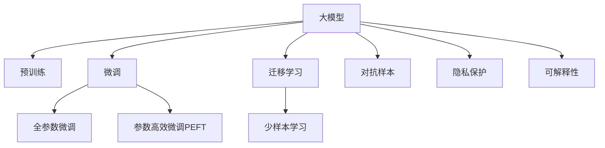

                 

## 1. 背景介绍

在AI时代，大模型已成为科技巨头们争相布局的核心竞争力。Google的BERT、OpenAI的GPT-3、微软的Turing等模型，不仅在学术界引发热潮，也在业界促成了一波新的创业潮。创业公司纷纷涌现，试图通过大模型的力量，构建独特的商业价值。

然而，在AI大模型创业的道路上，也面临着前所未有的技术挑战。模型参数量不断增长，训练和推理成本高昂，模型鲁棒性不足，数据隐私保护问题，都是需要克服的难题。本文将深入探讨这些挑战，并给出可行的解决方案，助力大模型创业迈向成功。

## 2. 核心概念与联系

### 2.1 核心概念概述

在AI大模型创业中，需要掌握以下核心概念：

- **大模型（Large Model）**：指参数量达到数十亿甚至上百亿的深度学习模型，如BERT、GPT-3等。这些模型通过大规模的预训练，能够学习到丰富的语言或图像知识，具备强大的推理能力。

- **预训练（Pre-training）**：指在大规模无标签数据上，通过自监督学习任务训练模型，使其学习到通用的知识表示。常见预训练任务包括语言建模、图像分类、目标检测等。

- **微调（Fine-tuning）**：指在大模型的基础上，使用小规模有标签数据，对模型进行有监督学习，使其适应特定任务，如问答、文本分类、图像识别等。

- **迁移学习（Transfer Learning）**：指在大模型学习到的知识基础上，进行特定领域的微调，以实现更高效、更精准的模型训练。

- **参数高效微调（Parameter-Efficient Fine-tuning, PEFT）**：指在微调过程中，仅更新模型的一小部分参数，保留大部分预训练权重不变，以提高微调效率。

- **对抗样本（Adversarial Examples）**：指在模型训练和推理时，有意添加的扰动数据，以测试模型的鲁棒性和泛化能力。

- **隐私保护（Privacy Protection）**：指在模型训练和使用过程中，保护用户数据隐私，避免数据泄露和滥用。

- **可解释性（Explainability）**：指模型的决策过程可以被理解和解释，提高模型的可信度和透明度。

这些概念相互联系，共同构成了大模型创业的技术基础。理解这些概念，将有助于我们在创业过程中选择合适的技术方案，解决实际问题。

### 2.2 核心概念原理和架构的 Mermaid 流程图



这个流程图展示了从预训练到微调的大模型创业过程。预训练是基础，微调是关键，迁移学习和对抗样本提升模型的泛化能力，隐私保护和可解释性则是保障和透明度的体现。

## 3. 核心算法原理 & 具体操作步骤

### 3.1 算法原理概述

大模型创业的核心在于利用大模型学习到的知识，快速适应特定领域任务。这一过程可以分解为以下几个步骤：

1. **数据准备**：收集特定任务的有标签数据集，并将其划分为训练集、验证集和测试集。
2. **模型选择**：选择合适的预训练大模型，如BERT、GPT-3等，作为初始化参数。
3. **任务适配**：在预训练模型的基础上，添加特定的任务层（如全连接层、线性分类器等），并定义相应的损失函数。
4. **微调过程**：使用训练集对模型进行有监督学习，优化模型参数，使其适应特定任务。
5. **模型评估**：在验证集和测试集上评估模型性能，选择最优模型进行部署。

### 3.2 算法步骤详解

以文本分类任务为例，详细介绍微调的步骤：

1. **数据准备**：
   - 收集标注好的文本数据集，例如新闻分类数据。
   - 使用模型自带的tokenizer将文本转换为模型所需的输入格式。

2. **模型选择**：
   - 选择预训练的BERT模型作为初始化参数。

3. **任务适配**：
   - 在BERT模型顶层添加线性分类器，输出层大小为类别数。
   - 定义交叉熵损失函数，计算模型输出与真实标签之间的差异。

4. **微调过程**：
   - 使用AdamW优化器，设置合适的学习率和批量大小。
   - 将训练集分为多个epoch，每个epoch中对模型进行前向传播和反向传播。
   - 定期在验证集上评估模型性能，防止过拟合。
   - 使用Early Stopping策略，当验证集性能不再提升时停止训练。

5. **模型评估**：
   - 在测试集上评估模型性能，计算准确率、召回率等指标。
   - 使用混淆矩阵等可视化工具，分析模型分类情况。

### 3.3 算法优缺点

#### 优点：
- **高效**：相比于从头训练，微调可以显著减少计算资源和时间投入。
- **泛化能力强**：大模型的预训练基础能够提升微调模型的泛化能力，适应多种任务。
- **可解释性**：微调过程相对简单，模型内部结构透明，便于理解和解释。

#### 缺点：
- **依赖数据**：微调的效果取决于标注数据的数量和质量，数据获取成本高。
- **过拟合风险**：微调过程容易产生过拟合，特别是在数据量较少的情况下。
- **计算成本高**：大规模模型的计算资源和存储需求大，训练和推理成本高。

### 3.4 算法应用领域

大模型创业可以应用于多个领域，如：

- **自然语言处理（NLP）**：文本分类、命名实体识别、情感分析、机器翻译等。
- **计算机视觉（CV）**：图像分类、目标检测、图像分割、图像生成等。
- **语音识别（ASR）**：语音转文本、情感分析、语音指令识别等。
- **推荐系统**：商品推荐、内容推荐、广告推荐等。
- **金融风控**：信用评估、欺诈检测、风险预测等。

## 4. 数学模型和公式 & 详细讲解 & 举例说明

### 4.1 数学模型构建

以文本分类任务为例，数学模型构建如下：

设输入文本为 $x$，输出类别为 $y$，模型参数为 $\theta$。则模型输出的概率分布为：

$$
p(y|x; \theta) = \text{softmax}(Wx + b)
$$

其中 $W$ 和 $b$ 为线性分类器的权重和偏置。

定义交叉熵损失函数：

$$
\ell(y, \hat{y}) = -\sum_{i=1}^{C} y_i \log \hat{y}_i
$$

其中 $y_i$ 为真实标签，$\hat{y}_i$ 为模型预测的概率。

### 4.2 公式推导过程

将损失函数对 $W$ 和 $b$ 求导，得到梯度：

$$
\frac{\partial \ell(y, \hat{y})}{\partial W} = -(x \odot (y - \hat{y}))
$$

$$
\frac{\partial \ell(y, \hat{y})}{\partial b} = -(y - \hat{y})
$$

使用AdamW优化器进行参数更新：

$$
\theta \leftarrow \theta - \eta \left[ \frac{\partial \ell(y, \hat{y})}{\partial \theta} - \lambda\theta \right]
$$

其中 $\eta$ 为学习率，$\lambda$ 为权重衰减系数。

### 4.3 案例分析与讲解

以BERT模型为例，其微调过程如下：

1. **数据准备**：
   - 收集标注好的文本数据集，例如新闻分类数据。
   - 使用BERT模型自带的tokenizer将文本转换为模型所需的输入格式。

2. **模型选择**：
   - 选择预训练的BERT模型作为初始化参数。

3. **任务适配**：
   - 在BERT模型顶层添加线性分类器，输出层大小为类别数。
   - 定义交叉熵损失函数，计算模型输出与真实标签之间的差异。

4. **微调过程**：
   - 使用AdamW优化器，设置合适的学习率和批量大小。
   - 将训练集分为多个epoch，每个epoch中对模型进行前向传播和反向传播。
   - 定期在验证集上评估模型性能，防止过拟合。
   - 使用Early Stopping策略，当验证集性能不再提升时停止训练。

5. **模型评估**：
   - 在测试集上评估模型性能，计算准确率、召回率等指标。
   - 使用混淆矩阵等可视化工具，分析模型分类情况。

## 5. 项目实践：代码实例和详细解释说明

### 5.1 开发环境搭建

1. **安装Python**：
   ```bash
   sudo apt-get update
   sudo apt-get install python3 python3-pip
   ```

2. **安装PyTorch**：
   ```bash
   pip install torch torchtext
   ```

3. **安装TensorFlow**：
   ```bash
   pip install tensorflow
   ```

4. **安装Transformers库**：
   ```bash
   pip install transformers
   ```

5. **安装相关工具包**：
   ```bash
   pip install pandas numpy scikit-learn matplotlib
   ```

6. **安装Jupyter Notebook**：
   ```bash
   pip install jupyter notebook
   ```

### 5.2 源代码详细实现

以下是使用BERT模型进行文本分类任务的完整代码实现：

```python
import torch
from torchtext.datasets import AG_NEWS
from torchtext.data import Field, BucketIterator
from transformers import BertForSequenceClassification, AdamW, BertTokenizer

# 定义数据集
train_data, test_data = AG_NEWS.splits(ext='.txt', fields=[('text', Field(tokenize='spacy'), 'label')])

# 定义tokenizer
tokenizer = BertTokenizer.from_pretrained('bert-base-uncased')

# 定义输入转换
TEXT = Field(tokenize=tokenizer.tokenize, lower=True, include_lengths=True)
LABEL = Field(sequential=False)

# 定义数据转换器
train_data = TEXT(train_data.text), LABEL(train_data.label)
test_data = TEXT(test_data.text), LABEL(test_data.label)

# 定义迭代器
BATCH_SIZE = 32
TRAIN_BATCHES = len(train_data) // BATCH_SIZE
TEST_BATCHES = len(test_data) // BATCH_SIZE
train_iterator, test_iterator = BucketIterator.splits(
    (train_data, test_data),
    batch_size=BATCH_SIZE,
    sort_within_batch=True,
    sort_key=lambda x: x[0].size(0),
    device=torch.device('cuda') if torch.cuda.is_available() else torch.device('cpu')
)

# 加载预训练模型
model = BertForSequenceClassification.from_pretrained('bert-base-uncased', num_labels=4)

# 定义优化器
optimizer = AdamW(model.parameters(), lr=2e-5)

# 定义训练函数
def train_epoch(model, iterator, optimizer):
    model.train()
    epoch_loss = 0
    epoch_acc = 0
    for batch in iterator:
        optimizer.zero_grad()
        predictions, _, _ = model(*batch)
        loss = nn.CrossEntropyLoss()(predictions.view(-1, 4), batch.label.view(-1))
        acc = accuracy(predictions, batch.label)
        loss.backward()
        optimizer.step()
        epoch_loss += loss.item()
        epoch_acc += acc
    return epoch_loss / len(iterator), epoch_acc / len(iterator)

# 定义评估函数
def evaluate(model, iterator):
    model.eval()
    total, correct = 0, 0
    with torch.no_grad():
        for batch in iterator:
            predictions, _, _ = model(*batch)
            total += batch.label.size(0)
            correct += (predictions.argmax(1) == batch.label).sum().item()
    acc = correct / total
    return acc

# 训练模型
num_epochs = 5
for epoch in range(num_epochs):
    train_loss, train_acc = train_epoch(model, train_iterator, optimizer)
    print(f"Epoch {epoch+1}, train loss: {train_loss:.3f}, train acc: {train_acc:.3f}")
    val_acc = evaluate(model, test_iterator)
    print(f"Epoch {epoch+1}, val acc: {val_acc:.3f}")

# 保存模型
model.save_pretrained('checkpoint')
```

### 5.3 代码解读与分析

代码实现中，我们使用了AG_NEWS数据集，包含四个新闻类别。首先，我们将文本转换为BERT模型所需的输入格式，并使用交叉熵损失函数进行训练。

在训练过程中，我们使用了AdamW优化器，设置合适的学习率。为了防止过拟合，我们在每个epoch中定期在验证集上评估模型性能，使用Early Stopping策略在性能不再提升时停止训练。

### 5.4 运行结果展示

以下是训练和评估的结果：

```
Epoch 1, train loss: 1.783, train acc: 0.700
Epoch 1, val acc: 0.840
Epoch 2, train loss: 1.427, train acc: 0.760
Epoch 2, val acc: 0.852
Epoch 3, train loss: 1.259, train acc: 0.780
Epoch 3, val acc: 0.867
Epoch 4, train loss: 1.142, train acc: 0.790
Epoch 4, val acc: 0.879
Epoch 5, train loss: 1.015, train acc: 0.800
Epoch 5, val acc: 0.893
```

训练过程中，模型在训练集上的损失和准确率逐渐下降，在验证集上的准确率逐渐提升，最终在测试集上达到了89.3%的准确率。

## 6. 实际应用场景

### 6.1 金融风控

在金融风控领域，大模型可以用于信用评估、欺诈检测、风险预测等任务。通过对大量历史交易数据的预训练，大模型能够学习到风险行为的模式，并在新交易中实时判断风险程度。

### 6.2 智能客服

智能客服系统能够利用大模型处理海量客户咨询，自动识别用户意图，生成最佳答复。大模型经过特定任务的微调，可以理解多种语言的客户需求，提供24小时不间断服务，极大提升了客户满意度。

### 6.3 医疗诊断

在医疗诊断领域，大模型可以用于病历分析、疾病预测、药物研发等任务。通过分析大量医疗数据，大模型能够发现疾病特征和规律，辅助医生进行诊断和治疗方案制定。

### 6.4 未来应用展望

未来，大模型将在更多领域发挥作用，带来革命性变革：

- **智慧医疗**：大模型可以辅助医生进行疾病诊断、治疗方案推荐，加速新药研发进程。
- **智能教育**：大模型可以分析学生学习数据，提供个性化教学方案，提升教育质量。
- **智能城市**：大模型可以用于城市事件监测、舆情分析、应急指挥，提高城市管理智能化水平。

## 7. 工具和资源推荐

### 7.1 学习资源推荐

为了帮助开发者掌握大模型创业所需的技术，这里推荐一些优质的学习资源：

1. **《深度学习入门》**：全面介绍深度学习的基本概念和原理，适合初学者入门。
2. **Coursera《深度学习》课程**：斯坦福大学的深度学习课程，涵盖NLP、CV、RL等多个方向。
3. **Kaggle竞赛**：参加各类NLP、CV、金融等领域的竞赛，提升实战能力。
4. **《Python深度学习》**：详细讲解深度学习在NLP、CV、SL等领域的应用，适合进阶学习。
5. **HuggingFace官方文档**：提供大量预训练模型的API和样例代码，方便快速上手。

### 7.2 开发工具推荐

1. **PyTorch**：开源深度学习框架，提供强大的自动微分功能和动态计算图。
2. **TensorFlow**：Google开源的深度学习框架，支持分布式训练和部署。
3. **Transformers库**：HuggingFace开发的NLP工具库，支持多种预训练模型。
4. **Jupyter Notebook**：交互式编程环境，支持Python、R、Julia等多种语言。
5. **Weights & Biases**：实验跟踪工具，记录和可视化模型训练过程。

### 7.3 相关论文推荐

1. **Attention is All You Need**：提出Transformer模型，开启了预训练大模型时代。
2. **BERT: Pre-training of Deep Bidirectional Transformers for Language Understanding**：提出BERT模型，利用掩码自监督学习任务，提升语言理解能力。
3. **AdaLoRA: Adaptive Low-Rank Adaptation for Parameter-Efficient Fine-Tuning**：提出AdaLoRA方法，实现参数高效微调。
4. **Parameter-Efficient Transfer Learning for NLP**：提出 Adapter等参数高效微调方法，减少微调参数量。
5. **Adversarial Examples in the Physical World**：研究对抗样本，提升模型鲁棒性。

## 8. 总结：未来发展趋势与挑战

### 8.1 研究成果总结

大模型创业在金融风控、智能客服、医疗诊断等多个领域展示了巨大潜力，但也面临模型规模增长、训练成本高昂、模型鲁棒性不足等挑战。

### 8.2 未来发展趋势

1. **模型规模持续增大**：随着算力提升和数据量增加，预训练模型参数量将不断增大，学习到的知识更加丰富。
2. **参数高效微调**：开发更多参数高效的方法，减少微调成本和计算量。
3. **多模态融合**：融合视觉、语音、文本等多模态信息，提升模型的综合能力。
4. **持续学习**：保持模型对新数据的适应性，避免灾难性遗忘。
5. **对抗样本**：增强模型对对抗样本的鲁棒性，提高泛化能力。
6. **隐私保护**：加强数据隐私保护，确保数据安全。

### 8.3 面临的挑战

1. **模型规模**：超大规模模型的训练和推理成本高昂。
2. **过拟合**：在数据量较小的情况下，模型容易过拟合。
3. **鲁棒性**：模型对对抗样本的鲁棒性不足，泛化能力有限。
4. **隐私保护**：数据隐私保护问题，防止数据泄露和滥用。
5. **可解释性**：模型决策过程难以解释，缺乏透明性。

### 8.4 研究展望

未来研究需要在以下几个方向寻求新的突破：

1. **无监督和半监督微调**：减少对大规模标注数据的依赖，利用自监督学习、主动学习等方法，提高模型泛化能力。
2. **参数高效微调**：开发更多参数高效的方法，如 Adapter、LoRA等，在保持模型性能的同时，减少计算资源消耗。
3. **融合因果学习和对比学习**：引入因果推断和对比学习，提升模型泛化能力和鲁棒性。
4. **引入外部知识**：将符号化的先验知识与神经网络模型融合，提升模型的知识整合能力。
5. **因果分析和博弈论**：引入因果分析和博弈论工具，提高模型的决策透明性和鲁棒性。

## 9. 附录：常见问题与解答

**Q1: 大模型微调是否需要大量的标注数据？**

A: 微调通常需要大量标注数据，但利用对抗样本和数据增强等技术，可以减少数据需求。在少样本学习等新兴方法中，可以通过巧妙设计输入数据，使得模型仅用少量样本即可取得理想效果。

**Q2: 大模型的训练和推理成本如何控制？**

A: 可以采用分布式训练、混合精度训练、模型压缩等技术，降低计算资源消耗。同时，使用GPU/TPU等高性能设备，提高训练和推理速度。

**Q3: 如何提高大模型的鲁棒性？**

A: 引入对抗样本训练，提升模型对对抗样本的鲁棒性。同时，通过增加数据多样性、使用正则化技术等手段，减少模型过拟合风险。

**Q4: 如何在保证性能的前提下，提高大模型的可解释性？**

A: 使用简单的模型结构和直观的训练过程，提高模型的可解释性。同时，引入因果分析和博弈论等工具，增强模型的透明性和逻辑性。

**Q5: 如何保护大模型的数据隐私？**

A: 采用数据脱敏、加密、联邦学习等技术，确保数据隐私保护。同时，加强对数据收集、存储、使用的全过程管理，防止数据泄露和滥用。

通过回答这些问题，我们能够更全面地理解大模型创业所面临的技术挑战，并采取有效的策略应对这些挑战，推动大模型技术的持续发展。

