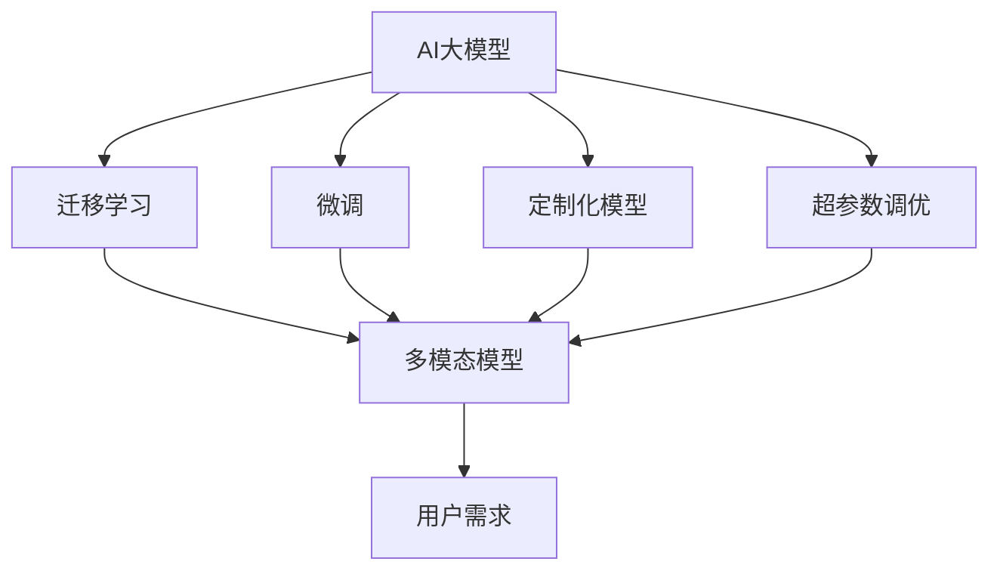

                 

# AI大模型创业：如何应对未来用户需求？

> 关键词：AI大模型,创业,未来需求,用户体验,技术创新

## 1. 背景介绍

### 1.1 问题由来

随着人工智能(AI)技术的不断进步，尤其是深度学习和大规模预训练模型如GPT-3、BERT等在NLP、计算机视觉等领域取得突破性成果，越来越多的企业开始意识到AI大模型在业务应用中的潜力。AI大模型的高效、灵活、易用性使得其在商业化应用中日益受到关注。然而，随着用户需求的多样化和复杂化，企业如何有效利用AI大模型，满足用户多样化需求，成为创业者和AI技术开发者共同关注的焦点。

### 1.2 问题核心关键点

- **用户需求的多样性与复杂性**：AI大模型必须能够处理来自不同领域、不同行业、不同业务场景下的复杂需求，如图像识别、自然语言处理、智能推荐、智能客服等。
- **模型泛化能力**：模型必须具备跨领域的泛化能力，能够在没有大规模标注数据的情况下，快速适应新任务。
- **易用性和可扩展性**：模型必须具备足够的易用性和可扩展性，便于企业快速集成到现有系统中，支持自定义接口、扩展功能。
- **数据与算法透明度**：用户和开发者需要了解模型背后的数据来源、训练算法、模型架构等信息，以建立信任。

### 1.3 问题研究意义

研究如何利用AI大模型满足未来用户需求，对AI技术商业化和产业发展具有重要意义：

1. **推动AI技术普及**：AI大模型的成功应用，能够提高企业智能化水平，加速技术普及。
2. **提升用户体验**：通过AI大模型，提供更加个性化、智能化的产品和服务，提升用户体验。
3. **降低开发成本**：AI大模型的强大功能，能够减少开发时间和成本，缩短产品上市周期。
4. **促进产业升级**：AI大模型在多个行业中的应用，推动了传统产业的数字化转型和升级。
5. **驱动技术创新**：AI大模型的应用，促进了相关算法和技术的不断创新，带来更多应用可能性。

## 2. 核心概念与联系

### 2.1 核心概念概述

为更好地理解AI大模型如何应对未来用户需求，本节将介绍几个关键概念：

- **AI大模型**：指通过大规模无标签数据预训练，并在大量有标签数据上微调，具备强大通用语言和图像处理能力的模型。如GPT、BERT等。
- **微调(Fine-tuning)**：指在预训练模型的基础上，使用下游任务的少量标注数据，通过有监督学习优化模型在该任务上的性能。
- **迁移学习(Transfer Learning)**：指将一个领域学习到的知识，迁移到另一个相关领域的学习范式。
- **定制化模型(Custom Model)**：指针对特定业务需求，通过对预训练模型进行重新设计、训练、微调等操作，获得满足特定需求的模型。
- **多模态模型(Multimodal Model)**：指能够同时处理多种模态信息（如文本、图像、音频等）的模型。
- **超参数调优(Hyperparameter Tuning)**：指通过调整模型的超参数（如学习率、批量大小、优化器等），优化模型性能的过程。

这些核心概念之间通过以下Mermaid流程图展示其逻辑关系：



## 3. 核心算法原理 & 具体操作步骤
### 3.1 算法原理概述

AI大模型应对未来用户需求的核心算法原理是迁移学习与微调。通过在大规模无标签数据上进行预训练，模型能够学习到通用的语言或图像知识。然后在特定业务场景下，通过有监督学习（微调），将预训练的知识迁移应用到新的任务上，实现对特定需求的处理。

具体而言，AI大模型的微调过程包括以下几个关键步骤：

1. **数据准备**：收集并标注与目标任务相关的数据集。
2. **模型初始化**：选择合适的预训练模型作为基础，如GPT-3、BERT等。
3. **任务适配**：根据任务类型，设计合适的任务适配层，如分类器、解码器等。
4. **模型微调**：使用标注数据对模型进行有监督的微调，优化模型在目标任务上的性能。
5. **性能评估**：在验证集和测试集上评估模型性能，不断调整超参数，优化模型。
6. **应用部署**：将微调后的模型部署到实际应用中，处理用户需求。

### 3.2 算法步骤详解

以下是详细的微调步骤：

1. **数据准备**
   - **数据收集**：根据目标任务，收集相关数据集。如自然语言处理任务中的新闻、评论、对话记录等。
   - **数据标注**：对数据进行标注，生成标注数据集。标注数据集应与实际应用场景高度一致，以确保模型的泛化能力。

2. **模型初始化**
   - **选择合适的预训练模型**：如BERT、GPT-3等，根据任务需求选择合适的预训练模型。
   - **加载预训练模型**：通过PyTorch、TensorFlow等框架，加载预训练模型的权重。

3. **任务适配**
   - **设计任务适配层**：根据任务类型，设计合适的任务适配层。如分类任务中的线性分类器，生成任务中的解码器。
   - **配置损失函数**：根据任务类型，选择合适的损失函数。如分类任务中的交叉熵损失，生成任务中的负对数似然损失。

4. **模型微调**
   - **训练设置**：设置超参数，如学习率、批量大小、迭代轮数等。
   - **模型训练**：使用标注数据对模型进行微调训练，优化模型参数。
   - **验证与调整**：在验证集上评估模型性能，根据评估结果调整超参数，避免过拟合。

5. **性能评估**
   - **测试集评估**：在测试集上评估微调后的模型性能，获取准确率、召回率、F1-score等指标。
   - **模型优化**：根据测试集评估结果，进一步调整模型参数，优化模型性能。

6. **应用部署**
   - **模型部署**：将微调后的模型部署到实际应用中，如API接口、移动应用、企业系统等。
   - **实时推理**：使用微调后的模型对实时数据进行推理，满足用户需求。

### 3.3 算法优缺点

AI大模型的微调方法具有以下优点：

- **高效快速**：使用少量标注数据即可实现模型的快速微调，缩短产品开发周期。
- **适应性强**：模型能够快速适应新任务，无需从头训练，减少开发成本。
- **泛化能力强**：预训练模型具备跨领域的泛化能力，可以在不同领域进行微调。

同时，该方法也存在以下局限：

- **依赖标注数据**：微调效果很大程度上取决于标注数据的质量和数量，获取高质量标注数据的成本较高。
- **模型复杂度**：预训练模型参数量庞大，微调过程复杂，资源消耗较大。
- **可解释性不足**：黑盒模型难以解释其内部工作机制和决策逻辑。

### 3.4 算法应用领域

AI大模型的微调方法已经在多个领域得到广泛应用，包括但不限于：

- **智能客服**：使用微调后的模型进行自然语言理解与生成，提升客服系统的智能化水平。
- **金融风控**：使用微调后的模型进行欺诈检测、信用评分等，提升金融风险管理能力。
- **医疗健康**：使用微调后的模型进行病历分析、智能诊断等，提升医疗服务质量。
- **电商推荐**：使用微调后的模型进行商品推荐、用户画像分析等，提升电商平台的个性化服务能力。
- **智能翻译**：使用微调后的模型进行翻译、语义理解等，提升翻译服务的质量和效率。

## 4. 数学模型和公式 & 详细讲解  
### 4.1 数学模型构建

在AI大模型微调过程中，通常使用交叉熵损失函数。假设目标任务为分类任务，模型的预测结果为 $\hat{y}$，真实标签为 $y$，则交叉熵损失函数为：

$$
\mathcal{L} = -\frac{1}{N}\sum_{i=1}^N [y_i\log \hat{y_i} + (1-y_i)\log(1-\hat{y_i})]
$$

其中，$N$ 为样本总数，$y_i$ 为样本的真实标签，$\hat{y_i}$ 为模型预测结果。

### 4.2 公式推导过程

交叉熵损失函数的推导过程如下：

假设模型预测结果为 $\hat{y} = (\hat{p}_1, \hat{p}_2, ..., \hat{p}_k)$，其中 $k$ 为类别数。则交叉熵损失函数可以表示为：

$$
\mathcal{L} = -\sum_{i=1}^k y_i \log \hat{p}_i
$$

其中，$y_i$ 为样本的真实类别标签。由于模型通常输出概率分布，因此可以采用对数似然损失函数。

通过反向传播算法，模型可以计算出损失函数对每个参数 $\theta$ 的梯度，然后根据梯度下降等优化算法更新模型参数，使得模型预测结果逼近真实标签。

### 4.3 案例分析与讲解

以自然语言分类任务为例，使用BERT模型进行微调。假设模型预测结果为 $(\hat{p}_{BPO}, \hat{p}_{BNE}, \hat{p}_{IPO}, \hat{p}_{INE})$，其中 $BPO$ 表示“男孩与女孩的战斗”，$BNE$ 表示“男孩与女孩的故事”，$IPO$ 表示“面试过程”，$INE$ 表示“面试经验”。假设真实标签为 $y=2$，则交叉熵损失函数为：

$$
\mathcal{L} = -y_i\log \hat{p}_{BNE} + (1-y_i)\log(1-\hat{p}_{BNE})
$$

通过计算梯度，模型可以更新参数，使得 $\hat{p}_{BNE}$ 逼近真实标签 $y_i$，从而提升模型分类精度。

## 5. 项目实践：代码实例和详细解释说明
### 5.1 开发环境搭建

在进行AI大模型微调项目开发前，需要准备相应的开发环境。以下是在Python环境下搭建开发环境的步骤：

1. **安装Python**：确保计算机上已安装Python 3.8及以上版本。
2. **创建虚拟环境**：
```bash
conda create -n ai-env python=3.8
conda activate ai-env
```

3. **安装必要的依赖包**：
```bash
pip install torch torchvision torchaudio transformers sklearn pandas numpy
```

4. **配置GPU环境**：
```bash
nvidia-smi
```

### 5.2 源代码详细实现

以下是使用PyTorch和Transformers库对BERT模型进行自然语言分类微调的代码实现。

```python
import torch
import torch.nn as nn
import torch.optim as optim
from transformers import BertForSequenceClassification, BertTokenizer
from sklearn.model_selection import train_test_split
from torch.utils.data import DataLoader

# 数据准备
tokenizer = BertTokenizer.from_pretrained('bert-base-uncased')
train_data, test_data = train_test_split(data, test_size=0.2, random_state=42)
train_dataset = Dataloader(train_data, batch_size=16)
test_dataset = Dataloader(test_data, batch_size=16)

# 模型初始化
model = BertForSequenceClassification.from_pretrained('bert-base-uncased', num_labels=4)
device = torch.device('cuda' if torch.cuda.is_available() else 'cpu')
model.to(device)

# 损失函数和优化器
loss_fn = nn.CrossEntropyLoss()
optimizer = optim.Adam(model.parameters(), lr=2e-5)

# 训练过程
for epoch in range(5):
    model.train()
    running_loss = 0.0
    for batch in train_dataset:
        inputs = batch['input_ids'].to(device)
        labels = batch['labels'].to(device)
        outputs = model(inputs)
        loss = loss_fn(outputs, labels)
        optimizer.zero_grad()
        loss.backward()
        optimizer.step()
        running_loss += loss.item()

    print(f'Epoch {epoch+1}, training loss: {running_loss/len(train_dataset)}')

# 评估过程
with torch.no_grad():
    model.eval()
    running_loss = 0.0
    correct = 0
    for batch in test_dataset:
        inputs = batch['input_ids'].to(device)
        labels = batch['labels'].to(device)
        outputs = model(inputs)
        loss = loss_fn(outputs, labels)
        running_loss += loss.item()
        _, preds = torch.max(outputs, dim=1)
        correct += (preds == labels).sum().item()

    print(f'Test loss: {running_loss/len(test_dataset)}, Accuracy: {correct/len(test_dataset)}')
```

### 5.3 代码解读与分析

以下是代码的详细解释和分析：

- **数据准备**：使用BertTokenizer对数据进行分词，并生成train_data和test_data两个数据集。
- **模型初始化**：加载预训练的BERT模型，并进行适当的配置。
- **损失函数和优化器**：使用交叉熵损失函数和Adam优化器。
- **训练过程**：在训练集上进行多轮迭代训练，计算损失并更新模型参数。
- **评估过程**：在测试集上评估模型性能，输出测试损失和准确率。

## 6. 实际应用场景
### 6.1 智能客服系统

智能客服系统是AI大模型微调的一个重要应用场景。通过微调，模型可以理解用户输入的自然语言，并生成合适的回复，提升客服系统的智能化水平。具体应用如下：

- **语音识别**：使用微调后的模型进行语音识别，将用户的语音输入转换为文本。
- **意图理解**：使用微调后的模型进行意图分类，理解用户的输入意图。
- **回复生成**：使用微调后的模型进行回复生成，生成合适的回答。

### 6.2 金融风控

在金融风控领域，微调后的AI大模型可以用于欺诈检测、信用评分等任务，提升金融风险管理能力。具体应用如下：

- **欺诈检测**：使用微调后的模型对用户的交易行为进行分析，识别异常交易，进行欺诈检测。
- **信用评分**：使用微调后的模型对用户的信用记录进行分析，生成信用评分。

### 6.3 医疗健康

在医疗健康领域，微调后的AI大模型可以用于病历分析、智能诊断等任务，提升医疗服务质量。具体应用如下：

- **病历分析**：使用微调后的模型对患者的病历进行分析，提取关键信息。
- **智能诊断**：使用微调后的模型进行疾病诊断，生成诊断结果。

### 6.4 电商推荐

在电商推荐领域，微调后的AI大模型可以用于商品推荐、用户画像分析等任务，提升电商平台的个性化服务能力。具体应用如下：

- **商品推荐**：使用微调后的模型对用户的历史行为进行分析，推荐合适的商品。
- **用户画像分析**：使用微调后的模型对用户画像进行分析，生成用户画像。

### 6.5 智能翻译

在智能翻译领域，微调后的AI大模型可以用于翻译、语义理解等任务，提升翻译服务的质量和效率。具体应用如下：

- **机器翻译**：使用微调后的模型进行机器翻译，将一种语言的文本翻译成另一种语言的文本。
- **语义理解**：使用微调后的模型进行语义理解，理解用户输入的自然语言。

## 7. 工具和资源推荐
### 7.1 学习资源推荐

为了帮助开发者系统掌握AI大模型微调的理论基础和实践技巧，这里推荐一些优质的学习资源：

- **《深度学习基础》课程**：由斯坦福大学开设的深度学习课程，讲解了深度学习的基本概念和常用模型。
- **《自然语言处理》课程**：由Coursera开设的自然语言处理课程，涵盖NLP的基础知识和技术。
- **《Transformers》书籍**：HuggingFace出版的《Transformers》一书，全面介绍了Transformer模型及其应用。
- **HuggingFace官方文档**：提供了丰富的预训练模型和微调样例，是学习和实践微调的重要资源。
- **CLUE开源项目**：中文语言理解测评基准，包含多种NLP任务，提供了基于微调的baseline模型。

### 7.2 开发工具推荐

高效的开发离不开优秀的工具支持。以下是几款用于AI大模型微调开发的常用工具：

- **PyTorch**：基于Python的开源深度学习框架，灵活的计算图，适合快速迭代研究。
- **TensorFlow**：由Google主导开发的开源深度学习框架，生产部署方便，适合大规模工程应用。
- **Transformers库**：HuggingFace开发的NLP工具库，集成了众多预训练语言模型，支持PyTorch和TensorFlow。
- **Weights & Biases**：模型训练的实验跟踪工具，可以记录和可视化模型训练过程中的各项指标，方便对比和调优。
- **TensorBoard**：TensorFlow配套的可视化工具，可实时监测模型训练状态，并提供丰富的图表呈现方式。

### 7.3 相关论文推荐

AI大模型和微调技术的发展源于学界的持续研究。以下是几篇奠基性的相关论文，推荐阅读：

- **Attention is All You Need**：提出Transformer结构，开启了NLP领域的预训练大模型时代。
- **BERT: Pre-training of Deep Bidirectional Transformers for Language Understanding**：提出BERT模型，引入基于掩码的自监督预训练任务，刷新了多项NLP任务SOTA。
- **Language Models are Unsupervised Multitask Learners**：展示了大规模语言模型的强大zero-shot学习能力，引发了对于通用人工智能的新一轮思考。
- **Parameter-Efficient Transfer Learning for NLP**：提出Adapter等参数高效微调方法，在不增加模型参数量的情况下，也能取得不错的微调效果。
- **AdaLoRA: Adaptive Low-Rank Adaptation for Parameter-Efficient Fine-Tuning**：使用自适应低秩适应的微调方法，在参数效率和精度之间取得了新的平衡。

这些论文代表了大语言模型微调技术的发展脉络。通过学习这些前沿成果，可以帮助研究者把握学科前进方向，激发更多的创新灵感。

## 8. 总结：未来发展趋势与挑战
### 8.1 研究成果总结

AI大模型微调技术在过去几年取得了显著进展，主要体现在以下几个方面：

- **模型规模的扩大**：随着算力成本的下降和数据规模的扩张，预训练语言模型的参数量将持续增长，模型的泛化能力将进一步提升。
- **算法的多样化**：除了传统的全参数微调外，未来将涌现更多参数高效的微调方法，如Prefix-Tuning、LoRA等。
- **数据与算法的透明度**：未来AI大模型的数据来源、训练算法、模型架构等信息将更加透明，便于用户和开发者建立信任。

### 8.2 未来发展趋势

展望未来，AI大模型微调技术将呈现以下几个发展趋势：

1. **模型规模持续增大**：随着算力成本的下降和数据规模的扩张，预训练语言模型的参数量将持续增长。超大规模语言模型蕴含的丰富语言知识，有望支撑更加复杂多变的下游任务微调。
2. **微调方法日趋多样化**：未来将涌现更多参数高效的微调方法，如Prefix-Tuning、LoRA等，在节省计算资源的同时也能保证微调精度。
3. **持续学习成为常态**：随着数据分布的不断变化，微调模型也需要持续学习新知识以保持性能。如何在不遗忘原有知识的同时，高效吸收新样本信息，将成为重要的研究课题。
4. **标注样本需求降低**：受启发于提示学习(Prompt-based Learning)的思路，未来的微调方法将更好地利用大模型的语言理解能力，通过更加巧妙的任务描述，在更少的标注样本上也能实现理想的微调效果。
5. **多模态微调崛起**：当前的微调主要聚焦于纯文本数据，未来会进一步拓展到图像、视频、语音等多模态数据微调。多模态信息的融合，将显著提升语言模型对现实世界的理解和建模能力。
6. **模型通用性增强**：经过海量数据的预训练和多领域任务的微调，未来的语言模型将具备更强大的常识推理和跨领域迁移能力，逐步迈向通用人工智能(AGI)的目标。

### 8.3 面临的挑战

尽管AI大模型微调技术已经取得了瞩目成就，但在迈向更加智能化、普适化应用的过程中，它仍面临着诸多挑战：

1. **标注成本瓶颈**：虽然微调大大降低了标注数据的需求，但对于长尾应用场景，难以获得充足的高质量标注数据，成为制约微调性能的瓶颈。如何进一步降低微调对标注样本的依赖，将是一大难题。
2. **模型鲁棒性不足**：当前微调模型面对域外数据时，泛化性能往往大打折扣。对于测试样本的微小扰动，微调模型的预测也容易发生波动。如何提高微调模型的鲁棒性，避免灾难性遗忘，还需要更多理论和实践的积累。
3. **推理效率有待提高**：大规模语言模型虽然精度高，但在实际部署时往往面临推理速度慢、内存占用大等效率问题。如何在保证性能的同时，简化模型结构，提升推理速度，优化资源占用，将是重要的优化方向。
4. **可解释性亟需加强**：当前微调模型更像是"黑盒"系统，难以解释其内部工作机制和决策逻辑。对于医疗、金融等高风险应用，算法的可解释性和可审计性尤为重要。如何赋予微调模型更强的可解释性，将是亟待攻克的难题。
5. **安全性有待保障**。预训练语言模型难免会学习到有偏见、有害的信息，通过微调传递到下游任务，产生误导性、歧视性的输出，给实际应用带来安全隐患。如何从数据和算法层面消除模型偏见，避免恶意用途，确保输出的安全性，也将是重要的研究课题。
6. **知识整合能力不足**。现有的微调模型往往局限于任务内数据，难以灵活吸收和运用更广泛的先验知识。如何让微调过程更好地与外部知识库、规则库等专家知识结合，形成更加全面、准确的信息整合能力，还有很大的想象空间。

### 8.4 研究展望

面对AI大模型微调面临的种种挑战，未来的研究需要在以下几个方面寻求新的突破：

1. **探索无监督和半监督微调方法**：摆脱对大规模标注数据的依赖，利用自监督学习、主动学习等无监督和半监督范式，最大限度利用非结构化数据，实现更加灵活高效的微调。
2. **研究参数高效和计算高效的微调范式**：开发更加参数高效的微调方法，在固定大部分预训练参数的同时，只更新极少量的任务相关参数。同时优化微调模型的计算图，减少前向传播和反向传播的资源消耗，实现更加轻量级、实时性的部署。
3. **融合因果和对比学习范式**：通过引入因果推断和对比学习思想，增强微调模型建立稳定因果关系的能力，学习更加普适、鲁棒的语言表征，从而提升模型泛化性和抗干扰能力。
4. **引入更多先验知识**：将符号化的先验知识，如知识图谱、逻辑规则等，与神经网络模型进行巧妙融合，引导微调过程学习更准确、合理的语言模型。同时加强不同模态数据的整合，实现视觉、语音等多模态信息与文本信息的协同建模。
5. **结合因果分析和博弈论工具**：将因果分析方法引入微调模型，识别出模型决策的关键特征，增强输出解释的因果性和逻辑性。借助博弈论工具刻画人机交互过程，主动探索并规避模型的脆弱点，提高系统稳定性。
6. **纳入伦理道德约束**：在模型训练目标中引入伦理导向的评估指标，过滤和惩罚有偏见、有害的输出倾向。同时加强人工干预和审核，建立模型行为的监管机制，确保输出符合人类价值观和伦理道德。

这些研究方向的探索，必将引领AI大模型微调技术迈向更高的台阶，为构建安全、可靠、可解释、可控的智能系统铺平道路。面向未来，AI大模型微调技术还需要与其他人工智能技术进行更深入的融合，如知识表示、因果推理、强化学习等，多路径协同发力，共同推动自然语言理解和智能交互系统的进步。只有勇于创新、敢于突破，才能不断拓展语言模型的边界，让智能技术更好地造福人类社会。

## 9. 附录：常见问题与解答

**Q1：AI大模型微调是否适用于所有NLP任务？**

A: AI大模型微调在大多数NLP任务上都能取得不错的效果，特别是对于数据量较小的任务。但对于一些特定领域的任务，如医学、法律等，仅仅依靠通用语料预训练的模型可能难以很好地适应。此时需要在特定领域语料上进一步预训练，再进行微调，才能获得理想效果。此外，对于一些需要时效性、个性化很强的任务，如对话、推荐等，微调方法也需要针对性的改进优化。

**Q2：微调过程中如何选择合适的学习率？**

A: 微调的学习率一般要比预训练时小1-2个数量级，如果使用过大的学习率，容易破坏预训练权重，导致过拟合。一般建议从1e-5开始调参，逐步减小学习率，直至收敛。也可以使用warmup策略，在开始阶段使用较小的学习率，再逐渐过渡到预设值。需要注意的是，不同的优化器(如AdamW、Adafactor等)以及不同的学习率调度策略，可能需要设置不同的学习率阈值。

**Q3：采用AI大模型微调时会面临哪些资源瓶颈？**

A: 目前主流的预训练大模型动辄以亿计的参数规模，对算力、内存、存储都提出了很高的要求。GPU/TPU等高性能设备是必不可少的，但即便如此，超大批次的训练和推理也可能遇到显存不足的问题。因此需要采用一些资源优化技术，如梯度积累、混合精度训练、模型并行等，来突破硬件瓶颈。同时，模型的存储和读取也可能占用大量时间和空间，需要采用模型压缩、稀疏化存储等方法进行优化。

**Q4：如何缓解微调过程中的过拟合问题？**

A: 过拟合是微调面临的主要挑战，尤其是在标注数据不足的情况下。常见的缓解策略包括：
1. 数据增强：通过回译、近义替换等方式扩充训练集
2. 正则化：使用L2正则、Dropout、Early Stopping等避免过拟合
3. 对抗训练：引入对抗样本，提高模型鲁棒性
4. 参数高效微调：只调整少量参数(如Adapter、Prefix等)，减小过拟合风险
5. 多模型集成：训练多个微调模型，取平均输出，抑制过拟合

这些策略往往需要根据具体任务和数据特点进行灵活组合。只有在数据、模型、训练、推理等各环节进行全面优化，才能最大限度地发挥AI大模型微调的威力。

**Q5：微调模型在落地部署时需要注意哪些问题？**

A: 将微调模型转化为实际应用，还需要考虑以下因素：
1. 模型裁剪：去除不必要的层和参数，减小模型尺寸，加快推理速度
2. 量化加速：将浮点模型转为定点模型，压缩存储空间，提高计算效率
3. 服务化封装：将模型封装为标准化服务接口，便于集成调用
4. 弹性伸缩：根据请求流量动态调整资源配置，平衡服务质量和成本
5. 监控告警：实时采集系统指标，设置异常告警阈值，确保服务稳定性
6. 安全防护：采用访问鉴权、数据脱敏等措施，保障数据和模型安全

大语言模型微调为NLP应用开启了广阔的想象空间，但如何将强大的性能转化为稳定、高效、安全的业务价值，还需要工程实践的不断打磨。唯有从数据、算法、工程、业务等多个维度协同发力，才能真正实现人工智能技术在垂直行业的规模化落地。总之，微调需要开发者根据具体任务，不断迭代和优化模型、数据和算法，方能得到理想的效果。

---

作者：禅与计算机程序设计艺术 / Zen and the Art of Computer Programming

