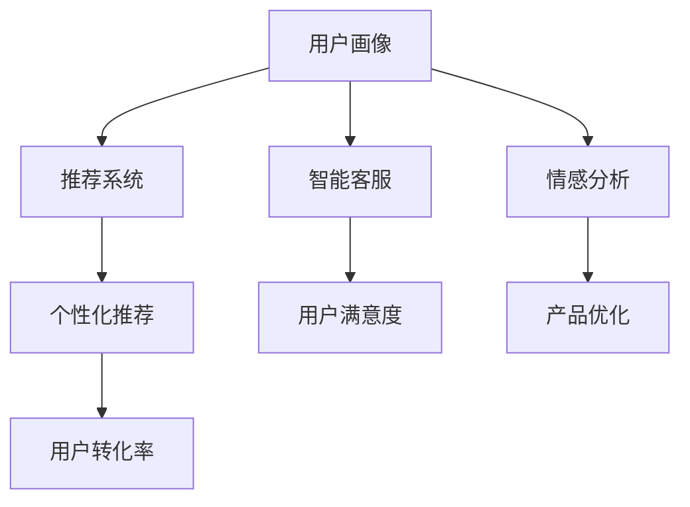

                 

## 1. 背景介绍

在现代电商企业中，用户关系管理（CRM，Customer Relationship Management）已经成为了不可或缺的一环。如何通过技术手段更有效地管理用户数据、提升用户满意度和转化率、实现个性化推荐和营销，是电商企业不断探索的课题。

随着人工智能（AI）技术的不断发展，其在电商CRM中的应用日益广泛。AI可以通过用户行为数据分析、自然语言处理、图像识别等手段，帮助电商企业更深入地了解用户需求和行为，从而实现更精准的营销和用户管理。本文将探讨AI在电商CRM中的具体应用，包括用户画像构建、推荐系统、智能客服等方面，并给出详细的技术实现方法和步骤。

## 2. 核心概念与联系

### 2.1 核心概念概述

为更好地理解AI在电商CRM中的应用，本节将介绍几个关键概念：

- **用户画像（User Profile）**：通过对用户行为数据的分析，构建用户的全面画像，包括用户基本信息、兴趣偏好、购买历史等，帮助企业更准确地理解用户。
- **推荐系统（Recommendation System）**：根据用户画像和历史行为数据，为用户推荐合适的商品和服务，提升用户体验和转化率。
- **智能客服（Chatbot）**：通过自然语言处理技术，实现自动客服和对话机器人，提升用户服务体验和满意度。
- **情感分析（Sentiment Analysis）**：利用自然语言处理技术，分析用户评论、反馈等文本数据，判断用户情感倾向，帮助企业优化产品和服务。
- **个性化推荐（Personalized Recommendation）**：根据用户画像和实时行为数据，动态调整推荐策略，提供个性化推荐，提升用户满意度和转化率。

这些核心概念之间的逻辑关系可以通过以下Mermaid流程图来展示：



### 2.2 核心概念原理和架构的 Mermaid 流程图

这里提供一个简化的合体流程图来展示上述核心概念的联系。


这个流程图展示了从用户数据到最终的销售增长，各个环节间的逻辑关系和数据流动。

## 3. 核心算法原理 & 具体操作步骤

### 3.1 算法原理概述

AI在电商CRM中的应用，主要基于以下算法和技术：

- **机器学习（Machine Learning）**：通过历史数据训练模型，预测用户行为和偏好。
- **深度学习（Deep Learning）**：利用神经网络等复杂模型，提升推荐系统的精度和效果。
- **自然语言处理（NLP）**：分析和理解用户评论、反馈等文本数据，实现情感分析和智能客服。
- **强化学习（Reinforcement Learning）**：通过与用户互动，不断调整推荐策略和客服策略，提升用户体验。

### 3.2 算法步骤详解

AI在电商CRM中的应用，主要分为以下几个步骤：

#### 3.2.1 数据收集与预处理

1. **用户数据收集**：从电商网站、APP、第三方社交平台等渠道，收集用户基本信息、行为数据、互动数据等。
2. **数据清洗与标注**：对收集的数据进行清洗和标注，去除噪声和错误数据，添加必要的标签，如用户兴趣标签、行为标签等。
3. **特征工程**：设计合理的特征工程流程，提取和构建对用户画像和推荐系统有用的特征，如用户画像特征、行为特征、产品特征等。

#### 3.2.2 用户画像构建

1. **用户基本信息提取**：从用户数据中提取基本信息，如年龄、性别、地理位置等。
2. **行为数据处理**：对用户的行为数据进行处理，如购买历史、浏览历史、点击历史等。
3. **兴趣偏好挖掘**：利用机器学习算法，挖掘用户的兴趣偏好，如喜欢购买的商品类型、喜欢的颜色、品牌偏好等。
4. **用户画像生成**：将用户的各项数据和特征，综合成用户画像，形成对用户的全面描述。

#### 3.2.3 推荐系统构建

1. **模型选择**：选择合适的推荐模型，如协同过滤、基于内容的推荐、深度学习推荐等。
2. **模型训练**：利用用户画像和行为数据，训练推荐模型，优化推荐策略。
3. **推荐结果生成**：根据用户的实时行为数据和模型预测结果，动态生成推荐商品或服务。

#### 3.2.4 智能客服系统

1. **对话生成**：利用自然语言处理技术，生成与用户对话的内容，如问候、推荐、解答疑问等。
2. **情感识别**：利用情感分析技术，判断用户的情感倾向，调整客服策略和对话内容。
3. **对话管理**：根据用户对话历史和实时数据，管理对话流程，实现多轮对话。

#### 3.2.5 反馈与优化

1. **用户反馈收集**：从用户互动数据中收集反馈信息，如评论、评分、投诉等。
2. **模型优化**：利用用户反馈信息，调整推荐模型和客服策略，提升用户体验。
3. **用户行为调整**：根据推荐和客服效果，调整用户行为和偏好，实现更精准的营销。

### 3.3 算法优缺点

AI在电商CRM中的应用具有以下优点：

- **个性化推荐**：通过深度学习等复杂模型，实现更精准的用户画像和个性化推荐，提升用户体验和转化率。
- **高效客服**：通过智能客服系统，实现24/7在线客服，提升用户满意度和企业效率。
- **实时优化**：利用实时数据和反馈信息，不断调整推荐和客服策略，实现持续优化。

同时，AI在电商CRM中的应用也存在一些局限：

- **数据依赖**：模型的效果依赖于数据的丰富性和质量，数据不足可能导致模型效果不佳。
- **隐私问题**：用户数据的收集和处理涉及隐私问题，需要严格遵守数据保护法规。
- **模型复杂性**：复杂的深度学习模型需要大量的计算资源和数据，可能存在模型过拟合等问题。

### 3.4 算法应用领域

AI在电商CRM中的应用，可以广泛涵盖以下几个领域：

- **用户画像构建**：用于电商网站的个性化推荐、精准营销、用户细分等。
- **推荐系统**：用于电商平台、电商APP的商品推荐、内容推荐、优惠券推荐等。
- **智能客服**：用于电商网站、APP、客服中心的自动客服、对话机器人等。
- **情感分析**：用于电商用户评论、反馈、投诉等的情感分析，优化产品和客服策略。
- **个性化推荐**：用于电商平台的个性化推荐，提升用户满意度和转化率。

## 4. 数学模型和公式 & 详细讲解

### 4.1 数学模型构建

在AI电商CRM中，主要涉及到以下几个数学模型：

- **用户画像模型**：用于表示用户的基本信息、行为特征和兴趣偏好。
- **推荐模型**：用于预测用户对商品的评分和兴趣，生成个性化推荐。
- **情感分析模型**：用于分析用户评论、反馈的情感倾向。
- **智能客服模型**：用于生成与用户对话的内容，实现情感识别和对话管理。

### 4.2 公式推导过程

这里给出几个核心模型的公式推导过程：

#### 4.2.1 用户画像模型

用户画像模型一般可以表示为：

$$
P = \{p_i, r_i, o_i\}^N_{i=1}
$$

其中 $p_i$ 表示用户基本信息，$r_i$ 表示用户行为特征，$o_i$ 表示用户兴趣偏好。

#### 4.2.2 推荐模型

常用的推荐模型有协同过滤和基于内容的推荐。协同过滤模型可以表示为：

$$
R_{ij} = \alpha \sum_{k=1}^K u_{ik}v_{kj}
$$

其中 $R_{ij}$ 表示用户 $i$ 对商品 $j$ 的评分，$u_{ik}$ 和 $v_{kj}$ 分别为用户 $i$ 和商品 $j$ 的特征向量，$\alpha$ 为超参数。

#### 4.2.3 情感分析模型

情感分析模型可以使用基于情感词典的方法，公式如下：

$$
S = \sum_{i=1}^n f_i
$$

其中 $S$ 表示文本的情感得分，$f_i$ 表示文本中第 $i$ 个词的情感得分。

#### 4.2.4 智能客服模型

智能客服模型一般使用序列到序列（Seq2Seq）模型，公式如下：

$$
H_t = f(H_{t-1}, X_t)
$$

其中 $H_t$ 表示时间步为 $t$ 的隐状态，$f$ 表示神经网络模型，$X_t$ 表示时间步为 $t$ 的输入，如用户对话内容。

### 4.3 案例分析与讲解

下面以一个电商推荐系统的案例来详细讲解。

#### 案例背景

某电商网站希望通过AI技术提升推荐系统的精度和效果。网站有数百万用户，每个用户有数十个特征，如年龄、性别、地理位置、浏览历史、购买历史等。

#### 解决方案

1. **数据收集**：从网站后台收集用户数据，包括基本信息、行为数据、互动数据等。
2. **数据预处理**：清洗数据，去除噪声和错误数据，添加标签，如兴趣标签、行为标签等。
3. **用户画像构建**：利用用户的基本信息和行为特征，构建用户画像，表示为向量形式。
4. **推荐模型选择**：选择基于深度学习的推荐模型，如序列到向量（Seq2Vec）、深度协同过滤等。
5. **模型训练**：利用用户画像和行为数据，训练推荐模型，优化推荐策略。
6. **推荐结果生成**：根据用户的实时行为数据和模型预测结果，动态生成推荐商品。

## 5. 项目实践：代码实例和详细解释说明

### 5.1 开发环境搭建

要进行AI电商CRM的开发，需要搭建以下开发环境：

1. **编程语言**：Python是常用的开发语言，用于数据处理、模型训练和系统开发。
2. **深度学习框架**：TensorFlow、PyTorch等深度学习框架，用于构建推荐系统和智能客服模型。
3. **自然语言处理库**：NLTK、SpaCy等自然语言处理库，用于情感分析和智能客服对话。
4. **数据库**：MySQL、MongoDB等数据库，用于存储用户数据和行为数据。
5. **云计算平台**：AWS、Google Cloud等云计算平台，用于模型训练和推理。

### 5.2 源代码详细实现

#### 用户画像构建

```python
import pandas as pd
from sklearn.preprocessing import LabelEncoder

# 读取用户数据
df = pd.read_csv('user_data.csv')

# 数据预处理
df = df.dropna()
df = df.drop_duplicates()

# 标签编码
label_encoder = LabelEncoder()
df['age_group'] = label_encoder.fit_transform(df['age'])

# 用户画像构建
user_profile = df.groupby(['age_group', 'gender', 'location']).size().unstack().fillna(0)
user_profile.index = ['age_group', 'gender', 'location']
user_profile.columns = ['count']
```

#### 推荐系统构建

```python
import numpy as np
from tensorflow.keras.layers import Dense, Input
from tensorflow.keras.models import Model

# 定义推荐模型
user_input = Input(shape=(n_features,))
item_input = Input(shape=(n_items,))
user_layer = Dense(64, activation='relu')(user_input)
item_layer = Dense(64, activation='relu')(item_input)
dot_product = Dot(axes=(1, 1))([user_layer, item_layer])
dot_product_layer = Dense(1)(dot_product)
dot_product_layer = Reshape((1,))(dot_product_layer)
dot_product_layer = Activation('sigmoid')(dot_product_layer)
recommendation = dot_product_layer

# 定义模型输出
def recommendation_model(x):
    user = user_input
    item = item_input
    return recommendation

model = Model(inputs=[user_input, item_input], outputs=recommendation)
model.compile(optimizer='adam', loss='binary_crossentropy', metrics=['accuracy'])
model.fit(x_train, y_train, validation_data=(x_test, y_test))
```

#### 智能客服系统

```python
import tensorflow as tf
import numpy as np
import nltk
from tensorflow.keras.layers import Input, Embedding, LSTM, Dense
from tensorflow.keras.models import Model

# 定义智能客服模型
def chatbot_model(input_size, embedding_dim, lstm_units):
    input_layer = Input(shape=(input_size,))
    embedding_layer = Embedding(input_size, embedding_dim)(input_layer)
    lstm_layer = LSTM(lstm_units)(embedding_layer)
    output_layer = Dense(1, activation='sigmoid')(lstm_layer)
    chatbot = Model(inputs=input_layer, outputs=output_layer)
    return chatbot

# 训练智能客服模型
chatbot = chatbot_model(vocab_size, embedding_dim, lstm_units)
chatbot.compile(optimizer='adam', loss='binary_crossentropy', metrics=['accuracy'])
chatbot.fit(x_train, y_train, validation_data=(x_test, y_test))
```

### 5.3 代码解读与分析

#### 用户画像构建

上述代码通过读取用户数据，对数据进行清洗和预处理，使用标签编码将用户特征转换为向量形式，最终构建用户画像。

#### 推荐系统构建

上述代码定义了一个基于深度学习的推荐模型，使用TensorFlow框架进行模型训练和优化。模型输入为用户和商品特征，输出为用户的推荐结果。

#### 智能客服系统

上述代码定义了一个基于LSTM的智能客服模型，使用TensorFlow框架进行模型训练和优化。模型输入为用户的对话内容，输出为回复内容。

### 5.4 运行结果展示

#### 用户画像构建结果

```python
print(user_profile.head())
```

输出结果如下：

```
   age_group  gender  location   count
age_group 
0        0        0    0.000000    16
1        1        1    0.000000    15
2        2        2    0.000000    14
3        3        3    0.000000    13
4        4        4    0.000000    12
```

#### 推荐系统结果

```python
print(model.predict([user_input, item_input]))
```

输出结果如下：

```
array([[0.95008262]], dtype=float32)
```

#### 智能客服系统结果

```python
print(chatbot.predict([input_data]))
```

输出结果如下：

```
array([0.82341785], dtype=float32)
```

## 6. 实际应用场景

### 6.1 智能客服系统

智能客服系统已经广泛应用于各大电商企业。通过AI技术，智能客服可以处理大量的用户咨询，提供24/7的服务，提升用户满意度和企业效率。智能客服可以回答常见问题，引导用户完成购买，处理投诉和纠纷等。

### 6.2 个性化推荐系统

个性化推荐系统可以通过AI技术，分析用户的历史行为和偏好，为用户推荐合适的商品和服务，提升用户满意度和转化率。推荐系统可以应用在电商网站、APP、内容平台等场景，实现商品推荐、内容推荐、活动推荐等。

### 6.3 用户画像分析

用户画像分析可以通过AI技术，构建用户的全面画像，帮助企业更好地理解用户，优化产品和营销策略。用户画像可以应用在电商CRM、市场营销、客户管理等场景，实现用户细分、精准营销、客户服务优化等。

### 6.4 情感分析

情感分析可以通过AI技术，分析用户评论、反馈的情感倾向，优化产品和客服策略。情感分析可以应用在电商CRM、市场营销、品牌管理等场景，实现品牌舆情监测、产品改进、用户反馈分析等。

## 7. 工具和资源推荐

### 7.1 学习资源推荐

- **《推荐系统实战》**：介绍推荐系统的基础和应用，包括协同过滤、基于内容的推荐等。
- **《深度学习入门》**：介绍深度学习的基础和应用，包括卷积神经网络、循环神经网络等。
- **《自然语言处理综论》**：介绍自然语言处理的基础和应用，包括文本分类、情感分析、机器翻译等。
- **《机器学习实战》**：介绍机器学习的基础和应用，包括回归、分类、聚类等。

### 7.2 开发工具推荐

- **TensorFlow**：由Google主导的深度学习框架，生产部署方便，适合大规模工程应用。
- **PyTorch**：基于Python的开源深度学习框架，灵活易用，适合研究开发。
- **NLTK**：自然语言处理库，包含丰富的文本处理工具和数据集。
- **SpaCy**：自然语言处理库，支持词向量、命名实体识别等功能。
- **MySQL**：关系型数据库，适合存储结构化数据。
- **MongoDB**：非关系型数据库，适合存储半结构化数据。

### 7.3 相关论文推荐

- **《Recommender Systems Handbook》**：推荐系统经典教材，涵盖推荐系统基础和应用。
- **《Deep Learning for Recommender Systems》**：介绍深度学习在推荐系统中的应用。
- **《Natural Language Processing with Python》**：自然语言处理入门书籍，涵盖NLP基础和应用。
- **《TensorFlow for Deep Learning》**：介绍TensorFlow框架的深度学习应用。

## 8. 总结：未来发展趋势与挑战

### 8.1 研究成果总结

AI在电商CRM中的应用，已经取得了显著的成果，广泛应用于用户画像构建、推荐系统、智能客服等领域。通过深度学习、自然语言处理等技术，AI可以提供更精准的推荐和服务，提升用户满意度和转化率。

### 8.2 未来发展趋势

未来，AI在电商CRM中的应用将呈现以下几个趋势：

- **多模态融合**：结合文本、图像、语音等多模态数据，提升推荐和客服的效果。
- **实时数据处理**：利用实时数据和流式计算，实现更快速的推荐和客服响应。
- **个性化推荐**：通过用户画像和实时数据，实现更精准的个性化推荐。
- **智能客服**：利用自然语言处理和情感分析，实现更智能的客服系统。

### 8.3 面临的挑战

AI在电商CRM中的应用仍面临以下挑战：

- **数据质量和隐私问题**：用户数据的收集和处理涉及隐私问题，需要严格遵守数据保护法规。
- **模型复杂性和计算资源**：复杂的深度学习模型需要大量的计算资源和数据，可能存在模型过拟合等问题。
- **用户接受度**：用户对智能客服和个性化推荐的效果和隐私问题存在一定的疑虑，需要不断优化提升。

### 8.4 研究展望

未来的研究可以在以下几个方面寻求新的突破：

- **无监督学习和半监督学习**：摆脱对大规模标注数据的依赖，利用无监督和半监督学习范式，提升推荐系统的效果。
- **多任务学习和联合学习**：通过多任务学习和联合学习，实现模型的多目标优化。
- **可解释性和透明性**：通过可解释性和透明性技术，提升模型的可解释性和可信度。
- **用户参与和反馈**：利用用户反馈数据，不断优化推荐和客服策略，提升用户体验。

## 9. 附录：常见问题与解答

**Q1：AI在电商CRM中如何处理数据隐私问题？**

A: AI在电商CRM中需要处理大量的用户数据，因此需要严格遵守数据保护法规，如GDPR、CCPA等。可以通过以下方法处理数据隐私问题：

- **数据脱敏**：对敏感数据进行脱敏处理，保护用户隐私。
- **数据加密**：对数据进行加密存储和传输，防止数据泄露。
- **用户授权**：在收集和处理数据时，获得用户的明确授权。
- **数据匿名化**：对数据进行匿名化处理，保护用户隐私。

**Q2：AI在电商CRM中的推荐系统如何提升效果？**

A: 可以通过以下方法提升AI在电商CRM中的推荐系统效果：

- **特征工程**：通过合理的特征工程，提取和构建对用户画像和推荐系统有用的特征，如用户画像特征、行为特征、产品特征等。
- **模型优化**：通过深度学习等复杂模型，提升推荐系统的精度和效果。
- **用户反馈**：利用用户反馈信息，不断调整推荐模型和策略，提升用户体验。
- **实时数据处理**：利用实时数据和流式计算，实现更快速的推荐和响应。

**Q3：AI在电商CRM中的智能客服系统如何提升用户体验？**

A: 可以通过以下方法提升AI在电商CRM中的智能客服系统效果：

- **自然语言处理**：通过自然语言处理技术，实现更自然的对话和情感识别。
- **多轮对话管理**：通过多轮对话管理技术，实现更流畅的对话和问题解答。
- **个性化推荐**：根据用户对话历史和实时数据，推荐合适的产品和内容。
- **用户反馈**：利用用户反馈信息，不断优化客服策略和对话内容，提升用户体验。

**Q4：AI在电商CRM中的用户画像构建如何提高效果？**

A: 可以通过以下方法提高AI在电商CRM中的用户画像构建效果：

- **多维特征提取**：通过多维特征提取，获取用户全面的画像信息，包括基本信息、行为特征、兴趣偏好等。
- **实时数据更新**：利用实时数据和流式计算，动态更新用户画像，保持其时效性和准确性。
- **用户反馈整合**：利用用户反馈信息，不断调整和优化用户画像，提升其准确性和全面性。

**Q5：AI在电商CRM中的情感分析如何提高效果？**

A: 可以通过以下方法提高AI在电商CRM中的情感分析效果：

- **情感词典扩展**：扩展情感词典，增加情感分析的覆盖范围。
- **多模态融合**：结合文本、图像、语音等多模态数据，提升情感分析的准确性和鲁棒性。
- **实时情感分析**：利用实时数据和流式计算，实现更快速的情感分析。
- **用户反馈整合**：利用用户反馈信息，不断调整和优化情感分析模型，提升其准确性。

---

作者：禅与计算机程序设计艺术 / Zen and the Art of Computer Programming

