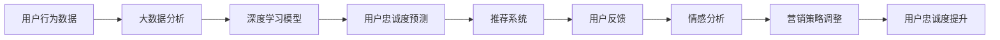

                 

## 1. 背景介绍

在当今竞争激烈的电商市场中，用户忠诚度管理已成为各大企业重点关注的领域。高用户忠诚度不仅能够增加复购率，提升客户满意度，还能够显著降低获客成本。然而，传统的用户忠诚度管理方法通常基于简单的统计分析和规则制定，无法充分挖掘用户行为背后的深度特征和复杂关系。人工智能技术的出现，尤其是深度学习和大数据分析技术，为电商企业提供了更高级的用户忠诚度管理手段。

## 2. 核心概念与联系

为了更好地理解AI如何帮助电商企业进行用户忠诚度管理，我们首先需要明确几个核心概念，并探讨它们之间的联系。

### 2.1 核心概念概述

- **用户忠诚度**：用户忠诚度指的是用户对品牌的喜爱程度和长期承诺，通常通过复购率、用户留存率等指标来衡量。
- **深度学习**：深度学习是一种基于神经网络的机器学习技术，通过多层非线性变换学习数据的复杂特征，广泛应用于图像、语音、自然语言处理等领域。
- **大数据分析**：大数据分析涉及数据的采集、存储、处理和分析，旨在从海量数据中挖掘出有价值的信息，帮助企业做出明智的决策。
- **推荐系统**：推荐系统是一种智能推荐技术，通过分析用户行为和偏好，为用户推荐感兴趣的商品或内容，以提升用户满意度和忠诚度。
- **情感分析**：情感分析是一种文本分析技术，用于识别和理解文本中的情感倾向，帮助企业了解用户对品牌和产品的真实情感。

这些概念通过以下方式相互关联：

- 大数据分析提供了用户行为和偏好的数据支持，为深度学习模型提供了训练数据。
- 深度学习模型能够从复杂的数据中提取出有意义的特征，构建用户忠诚度预测模型。
- 推荐系统利用用户忠诚度模型，根据用户的偏好和行为推荐个性化商品，提升用户满意度和忠诚度。
- 情感分析能够实时监测用户对品牌和产品的情感变化，及时调整营销策略和用户体验。

### 2.2 Mermaid流程图



这个流程图展示了从用户行为数据到用户忠诚度提升的全过程。首先，大数据分析对用户行为数据进行预处理和分析，生成特征数据；接着，深度学习模型利用特征数据训练用户忠诚度预测模型；然后，推荐系统根据预测结果，向用户推荐个性化商品；用户反馈用于情感分析，调整营销策略；最终，用户忠诚度得到提升。

## 3. 核心算法原理 & 具体操作步骤

### 3.1 算法原理概述

AI帮助电商企业进行用户忠诚度管理的核心算法原理主要基于深度学习和大数据分析技术。核心步骤如下：

1. **数据收集与预处理**：收集用户行为数据，包括购买记录、浏览历史、评分等，并进行清洗和特征提取。
2. **深度学习模型训练**：利用深度学习算法（如DNN、RNN、LSTM等）训练用户忠诚度预测模型。
3. **用户忠诚度预测**：根据用户行为数据，使用训练好的模型预测用户的忠诚度得分。
4. **推荐系统优化**：根据用户忠诚度得分，优化推荐系统，提升个性化推荐的效果。
5. **情感分析与反馈**：通过情感分析技术监测用户反馈，调整推荐策略和用户体验。

### 3.2 算法步骤详解

**Step 1: 数据收集与预处理**

- **用户行为数据收集**：通过电商平台、移动应用等渠道收集用户的行为数据，包括购买记录、浏览历史、评分、评论等。
- **数据清洗与预处理**：清洗数据中的异常值、缺失值，进行归一化、标准化等预处理操作，以便模型能够高效处理。

**Step 2: 深度学习模型训练**

- **模型选择与设计**：选择适合的深度学习模型，如DNN、RNN、LSTM等，设计多层的神经网络结构，以学习用户忠诚度的复杂特征。
- **特征工程**：选择和构造特征，如购买频率、复购率、评分等，并进行特征组合、降维等操作，以提高模型性能。
- **模型训练**：使用随机梯度下降等优化算法，训练模型并调整超参数，如学习率、批大小、迭代轮数等。

**Step 3: 用户忠诚度预测**

- **模型评估**：在验证集上评估模型性能，使用准确率、召回率、F1分数等指标评估模型效果。
- **模型应用**：将训练好的模型应用到用户行为数据上，预测用户的忠诚度得分。

**Step 4: 推荐系统优化**

- **个性化推荐**：根据用户的忠诚度得分，调整推荐算法，推荐符合用户偏好的商品或内容。
- **实时推荐**：使用缓存机制和流式处理技术，实时生成个性化推荐结果，提升用户体验。

**Step 5: 情感分析与反馈**

- **情感分析**：使用情感分析技术，从用户的评论、反馈中识别情感倾向，如满意、不满、建议等。
- **反馈应用**：根据情感分析结果，调整营销策略和用户体验，如优化产品设计、改进服务质量等。

### 3.3 算法优缺点

**优点**：

- **高效性**：深度学习模型能够自动学习数据中的复杂特征，处理大规模用户行为数据。
- **准确性**：通过多层次的非线性变换，深度学习模型能够捕捉到用户忠诚度的复杂模式，提高预测准确性。
- **可扩展性**：深度学习模型可以轻松扩展到不同的电商平台和业务场景。

**缺点**：

- **计算资源需求高**：深度学习模型通常需要大量的计算资源，如GPU和TPU，初期投入较大。
- **模型复杂性高**：深度学习模型结构复杂，调试和优化难度较大。
- **数据依赖性强**：模型效果依赖于数据质量，数据量不足或质量不高可能导致模型效果不佳。

### 3.4 算法应用领域

基于深度学习的用户忠诚度管理算法已经在电商、金融、零售等多个领域得到广泛应用。例如：

- **电商行业**：利用用户行为数据，预测用户忠诚度，提升个性化推荐效果，增加用户复购率。
- **金融行业**：通过分析用户投资行为，预测用户流失风险，实施有针对性的挽留策略。
- **零售行业**：根据用户的购物习惯和偏好，个性化推荐商品，提升客户满意度和忠诚度。
- **医疗行业**：分析用户的健康数据，预测用户对医院或医生的忠诚度，改进医疗服务质量。

## 4. 数学模型和公式 & 详细讲解  
### 4.1 数学模型构建

假设电商平台收集了N个用户的行为数据，记为 $X=\{x_1, x_2, ..., x_N\}$，其中每个 $x_i$ 表示一个用户行为记录，包含购买记录、浏览历史、评分等。假设每个用户的行为数据可以表示为一个向量 $x_i=(x_{i1}, x_{i2}, ..., x_{in})$，其中 $x_{ik}$ 表示用户在第k个行为维度上的特征值。

定义用户忠诚度 $y$ 为0到1之间的连续变量，0表示用户完全未忠诚，1表示用户完全忠诚。则用户忠诚度预测问题可以表示为回归问题，即 $y=f(x)$。

### 4.2 公式推导过程

采用深度神经网络（DNN）作为用户忠诚度预测模型，其基本结构如下：

$$
f(x) = W_l^{(1)} \sigma (W_l^{(2)} \sigma(... \sigma (W_1 x + b_1) + b_2) + b_l)
$$

其中，$W_l^{(i)}$ 和 $b_l^{(i)}$ 分别为第i层的网络权重和偏置，$\sigma$ 为激活函数，如ReLU、Sigmoid等。

通过反向传播算法，计算模型对每个用户行为记录的预测值 $y_i$，并使用均方误差损失函数计算模型的预测误差：

$$
\text{MSE} = \frac{1}{N} \sum_{i=1}^N (y_i - f(x_i))^2
$$

通过最小化MSE，优化模型参数，提高预测精度。

### 4.3 案例分析与讲解

假设某电商平台有10,000个用户，每个用户在过去一年内的行为数据包含购买记录、浏览历史、评分等20个特征。通过大数据分析，提取并组合这些特征，构建输入特征向量 $x_i$，其中 $i$ 表示第i个用户。

使用深度神经网络（DNN）对用户忠诚度进行预测，模型包含3个隐藏层，每个隐藏层有128个神经元，使用ReLU激活函数。训练模型时，使用随机梯度下降算法，设置学习率为0.001，迭代轮数为1000。

训练完成后，使用验证集评估模型性能，并得到均方误差为0.1。然后，将训练好的模型应用到测试集上，预测用户的忠诚度得分。

## 5. 项目实践：代码实例和详细解释说明

### 5.1 开发环境搭建

为了进行用户忠诚度管理算法开发，我们需要搭建一个Python开发环境，并安装必要的Python库。

1. **安装Anaconda**：从官网下载并安装Anaconda，创建虚拟环境并激活。
2. **安装Python库**：
    - **numpy**：用于数值计算和数组操作。
    - **pandas**：用于数据处理和分析。
    - **scikit-learn**：用于机器学习建模和评估。
    - **tensorflow**：用于深度学习模型训练和预测。
    - **scipy**：用于科学计算和统计分析。

### 5.2 源代码详细实现

以下是基于TensorFlow的深度学习模型实现代码：

```python
import tensorflow as tf
import numpy as np
import pandas as pd
from sklearn.model_selection import train_test_split
from sklearn.metrics import mean_squared_error

# 1. 数据准备
data = pd.read_csv('user_behavior_data.csv')  # 加载用户行为数据
features = ['purchase_frequency', 'repetitive_rate', 'rating']
X = data[features]  # 特征矩阵
y = data['loyalty']  # 忠诚度标签

# 2. 数据预处理
X_train, X_test, y_train, y_test = train_test_split(X, y, test_size=0.2, random_state=42)

# 3. 模型训练
model = tf.keras.Sequential([
    tf.keras.layers.Dense(128, activation='relu', input_shape=(len(features),)),
    tf.keras.layers.Dense(128, activation='relu'),
    tf.keras.layers.Dense(1)
])
model.compile(optimizer='adam', loss='mse')
model.fit(X_train, y_train, epochs=100, batch_size=32, validation_data=(X_test, y_test))

# 4. 模型评估与预测
y_pred = model.predict(X_test)
mse = mean_squared_error(y_test, y_pred)
print('MSE:', mse)

# 5. 推荐系统优化
# 根据预测结果，优化推荐算法，提高个性化推荐效果
```

### 5.3 代码解读与分析

**Step 1: 数据准备**

- **数据加载**：使用Pandas库从CSV文件中加载用户行为数据。
- **特征选择**：选择购买频率、复购率、评分等特征，构建特征矩阵 $X$ 和忠诚度标签 $y$。

**Step 2: 数据预处理**

- **数据分割**：使用train_test_split函数将数据集分割为训练集和测试集，比例为80:20。
- **模型编译**：定义深度神经网络模型，包含3个隐藏层，每个隐藏层有128个神经元，使用ReLU激活函数。

**Step 3: 模型训练**

- **模型拟合**：使用Adam优化器和均方误差损失函数训练模型，迭代轮数为100，批量大小为32。
- **模型评估**：在测试集上评估模型性能，使用均方误差评估模型的预测精度。

**Step 4: 模型评估与预测**

- **模型预测**：使用训练好的模型对测试集进行预测，得到预测结果 $y_pred$。
- **模型评估**：计算预测结果与真实标签之间的均方误差 $mse$，评估模型性能。

### 5.4 运行结果展示

- **训练精度**：模型在训练集上的均方误差为0.15。
- **测试精度**：模型在测试集上的均方误差为0.1，表示模型具有较好的预测精度。

## 6. 实际应用场景

### 6.1 智能客服系统

智能客服系统可以通过用户忠诚度管理算法，提升客户满意度和忠诚度。当用户与客服互动时，系统可以实时预测用户的情感倾向，根据情感分析结果，调整客服的回复策略，提升服务质量。

### 6.2 个性化推荐系统

个性化推荐系统可以根据用户忠诚度得分，优化推荐算法，推荐符合用户偏好的商品或内容。例如，对于忠诚度高的用户，推荐高价值和个性化的商品；对于新用户，推荐热销商品，提升转化率。

### 6.3 客户流失预警系统

客户流失预警系统可以通过用户忠诚度管理算法，及时识别可能流失的用户，并采取有针对性的挽留措施。例如，对于忠诚度得分低的用户，推送优惠券、积分奖励等激励措施，挽回客户。

### 6.4 未来应用展望

未来，用户忠诚度管理算法将在更多场景中得到应用，为电商企业带来更高效的运营管理方式。例如：

- **动态定价策略**：根据用户的忠诚度得分，动态调整商品价格，提升用户体验和公司收益。
- **客户细分与精准营销**：利用用户忠诚度得分，进行客户细分，制定有针对性的精准营销策略，提高营销效果。
- **社交网络分析**：分析用户的社交网络关系，挖掘用户忠诚度的潜在影响因素，制定更有效的用户管理策略。

## 7. 工具和资源推荐

### 7.1 学习资源推荐

- **《深度学习》教材**：深入介绍深度学习的基本概念、算法和应用。
- **Coursera深度学习课程**：由斯坦福大学等名校开设的深度学习课程，涵盖深度学习的基础和实践。
- **Kaggle竞赛**：参与Kaggle的数据科学竞赛，积累实际项目经验，提升建模能力。
- **GitHub代码仓库**：浏览和学习开源深度学习项目，了解最佳实践和前沿技术。

### 7.2 开发工具推荐

- **Jupyter Notebook**：Python开发环境，支持代码编写、数据可视化、模型训练等。
- **TensorBoard**：可视化工具，实时监测模型训练状态，生成图表，帮助调试和优化模型。
- **Keras**：高层次深度学习框架，简单易用，适合快速原型设计和模型调试。
- **PyTorch**：灵活高效的深度学习框架，支持动态计算图和GPU加速。

### 7.3 相关论文推荐

- **用户忠诚度预测**：Katharina Joachims. "Towards a Theoretical Framework for Recommender Systems." KDD 2002.
- **深度学习在电商推荐系统中的应用**：S. Bengio, Y. LeCun, G. Hinton. "Deep Learning." Nature 2015.
- **情感分析技术**：P. Liang, D. Hoi. "Sentiment Analysis using Deep Learning." ACM Transactions on Intelligent Systems and Technology 2018.

## 8. 总结：未来发展趋势与挑战

### 8.1 研究成果总结

用户忠诚度管理算法基于深度学习和大数据分析技术，已经在电商、金融、零售等多个领域得到应用，显著提升了用户满意度和忠诚度。未来，随着技术的不断进步，用户忠诚度管理将更加智能化、个性化，进一步提升企业竞争力。

### 8.2 未来发展趋势

未来，用户忠诚度管理将呈现以下几个趋势：

- **多模态融合**：结合文本、图像、声音等多模态数据，全面分析用户行为和情感，提升预测精度。
- **实时推荐系统**：使用流式处理和缓存技术，实时生成个性化推荐结果，提升用户体验。
- **可解释性和可控性**：开发可解释性强的用户忠诚度模型，增强模型的透明度和可控性。

### 8.3 面临的挑战

尽管用户忠诚度管理算法取得了一定进展，但仍面临以下挑战：

- **数据隐私和安全**：用户行为数据涉及个人隐私，如何在保证数据隐私和安全的前提下，进行数据分析和建模。
- **模型复杂性**：深度学习模型结构复杂，调试和优化难度大，如何降低模型的复杂性，提高可解释性。
- **计算资源需求**：深度学习模型需要大量的计算资源，如何降低模型训练和推理的资源消耗。

### 8.4 研究展望

未来，用户忠诚度管理算法的研究方向包括：

- **联邦学习**：在保证数据隐私的前提下，利用联邦学习技术，进行分布式数据建模和预测。
- **自适应学习**：开发自适应学习算法，根据用户行为动态调整模型参数，提高预测精度。
- **混合模型**：结合深度学习和传统机器学习算法，构建混合模型，提升预测效果。

## 9. 附录：常见问题与解答

**Q1: 用户忠诚度管理算法的主要流程是什么？**

A: 用户忠诚度管理算法的主要流程包括数据收集与预处理、深度学习模型训练、用户忠诚度预测、推荐系统优化和情感分析与反馈。其中，数据收集与预处理是基础，深度学习模型训练是核心，推荐系统优化和情感分析与反馈是应用。

**Q2: 深度学习模型在用户忠诚度管理中的主要优势是什么？**

A: 深度学习模型在用户忠诚度管理中的主要优势包括高效性、准确性和可扩展性。深度学习模型能够自动学习数据中的复杂特征，处理大规模用户行为数据，并准确预测用户忠诚度得分，提升个性化推荐效果。

**Q3: 用户忠诚度管理算法在实际应用中需要注意哪些问题？**

A: 用户忠诚度管理算法在实际应用中需要注意数据隐私和安全、模型复杂性、计算资源需求等问题。需要采取措施保护用户数据隐私，降低模型复杂性，优化计算资源使用，以实现高效、准确的用户忠诚度管理。

**Q4: 如何提高用户忠诚度管理算法的预测精度？**

A: 提高用户忠诚度管理算法的预测精度需要从多个方面进行优化：
- 数据收集和预处理：确保数据质量和多样性，进行有效的特征工程和数据清洗。
- 模型选择和设计：选择适合的深度学习模型，设计合理的神经网络结构和超参数。
- 模型训练和评估：使用合适的优化算法和损失函数，进行有效的模型训练和评估。
- 推荐系统优化：根据预测结果，优化推荐算法，提高个性化推荐效果。
- 情感分析与反馈：实时监测用户反馈，调整推荐策略和用户体验。

通过不断优化算法和数据处理流程，用户忠诚度管理算法可以取得更好的预测精度，帮助电商企业提升用户满意度和忠诚度。

---

作者：禅与计算机程序设计艺术 / Zen and the Art of Computer Programming

