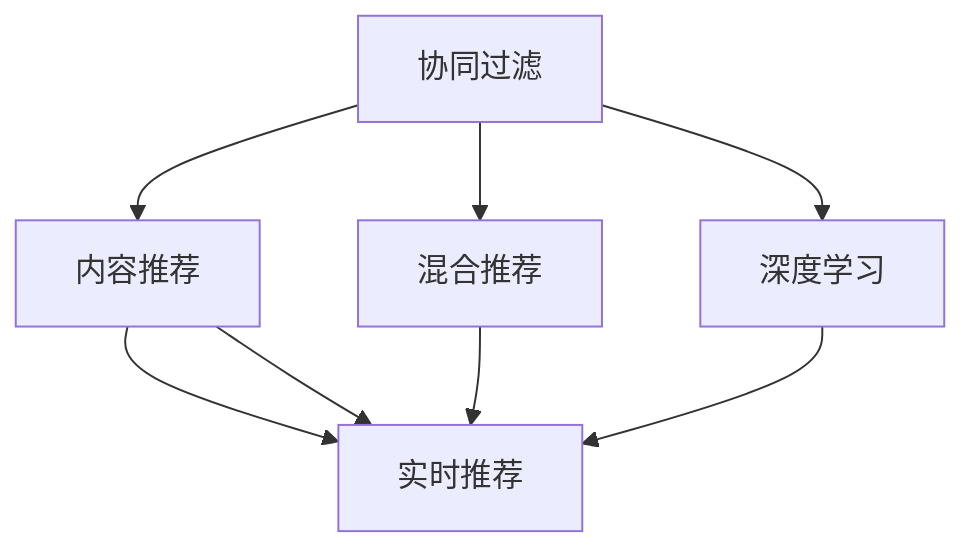

                 

## 1. 背景介绍

### 1.1 问题由来

在当今数字化时代，个性化推荐系统已经成为各行各业提升用户体验、增强业务变现的关键技术。无论是电商、视频流媒体，还是社交网络、新闻媒体，个性化推荐系统都能为用户提供更符合其需求和兴趣的内容，从而提高用户粘性和满意度。但如何高效、精准地构建个性化推荐系统，仍是当前技术开发中的一大挑战。

### 1.2 问题核心关键点

构建个性化推荐系统，本质上是要利用用户的历史行为数据，学习用户偏好，预测未来行为，进而为用户推荐最合适的商品或内容。在数据驱动的推荐系统中，用户行为数据和物品特征数据是两个关键输入，推荐模型的预测能力则依赖于这两类数据的质量和多样性。

### 1.3 问题研究意义

实现个性化推荐系统，可以显著提升用户体验和运营效率。具体表现为：
- 提升用户满意度：通过精准推荐，用户可以快速找到满足自己需求的内容，提高使用体验。
- 增加用户粘性：持续的个性化推荐，可以提升用户对平台的依赖程度，增加使用频率和留存率。
- 优化用户体验：推荐系统可以预测用户需求，提前提供服务，如电商平台的购物助手、视频平台的内容推荐等，优化用户的使用路径。

## 2. 核心概念与联系

### 2.1 核心概念概述

构建个性化推荐系统涉及多个核心概念，这些概念相互交织，共同构成了推荐系统的技术框架。以下将对这些概念进行概述：

- **协同过滤(Collaborative Filtering)**：通过用户-物品的共现关系，推断用户对未评分物品的偏好，进行推荐。
- **内容推荐(Content-Based Recommendation)**：根据物品的特征，匹配用户偏好，进行推荐。
- **混合推荐(Hybrid Recommendation)**：结合协同过滤和内容推荐，提升推荐系统的性能。
- **深度学习(Deep Learning)**：利用深度神经网络模型，直接从用户行为数据和物品特征数据中学习用户偏好，进行推荐。
- **实时推荐(Real-time Recommendation)**：在用户访问平台时，实时生成推荐内容，提高用户体验。
- **多臂老虎机(Multi-Armed Bandit, MAB)**：在推荐系统中，多臂老虎机算法可用于优化点击率预估和推荐策略。

这些概念之间的逻辑关系可以通过以下Mermaid流程图来展示：



这个流程图展示了推荐系统中的各个技术组件及其相互作用关系：协同过滤和内容推荐构成基础推荐组件，混合推荐和多臂老虎机进一步提升推荐效果，深度学习直接从数据中学习用户偏好，实时推荐则实现了推荐内容与用户访问时机的同步。

## 3. 核心算法原理 & 具体操作步骤

### 3.1 算法原理概述

在实际推荐系统中，通常采用深度学习模型进行推荐，例如协同过滤算法、基于神经网络的推荐模型等。本节将重点介绍基于神经网络的推荐模型，并结合实时推荐技术，给出推荐系统的实现原理。

### 3.2 算法步骤详解

基于神经网络的推荐系统主要分为以下几步：
1. **数据准备**：收集用户行为数据和物品特征数据，构建训练集。
2. **模型构建**：选择合适的深度学习模型，如深度神经网络、协同过滤模型等，进行模型搭建。
3. **模型训练**：利用训练集数据，对模型进行训练，优化参数。
4. **推荐生成**：在用户访问时，实时生成推荐内容。

具体步骤如下：

**Step 1: 数据准备**

用户行为数据和物品特征数据是推荐模型的两个关键输入。用户行为数据包括用户的浏览、点击、购买等行为记录，而物品特征数据则描述了物品的各个属性，如价格、类别、品牌等。

**Step 2: 模型构建**

选择合适的深度学习模型进行推荐。例如，可以使用嵌入层(Embedding Layer)将用户行为数据和物品特征数据映射为向量表示，然后利用全连接层(Fully Connected Layer)进行特征组合，并使用输出层(Output Layer)进行推荐结果输出。

**Step 3: 模型训练**

利用训练集数据对模型进行训练，优化参数。训练过程中，可以采用交叉熵损失函数，对模型的预测输出和真实标签进行比较，计算损失并更新参数。

**Step 4: 推荐生成**

在用户访问时，实时生成推荐内容。首先，将用户当前访问的页面信息、浏览历史等信息作为输入，通过模型预测推荐结果。然后，根据预测结果，为用户推荐相应的物品。

### 3.3 算法优缺点

基于神经网络的推荐系统具有以下优点：
1. 高精度：深度神经网络模型可以捕捉用户行为和物品特征之间的复杂关系，提高推荐准确度。
2. 可扩展性：深度学习模型可以处理大规模数据集，具有较强的扩展性。
3. 实时性：结合实时推荐技术，可以提升用户体验，增加系统响应速度。

同时，该方法也存在一定的局限性：
1. 数据需求高：深度学习模型需要大量数据进行训练，且数据质量对推荐效果有较大影响。
2. 计算量大：深度学习模型训练和推理计算量较大，需要高性能硬件支持。
3. 模型复杂度高：深度学习模型结构复杂，难以解释和调试。
4. 过拟合风险：深度学习模型容易过拟合，需要结合正则化等技术进行优化。

### 3.4 算法应用领域

基于神经网络的推荐系统在多个领域得到了广泛应用，如电商、视频流媒体、社交网络等，具体包括：

- 电商平台：根据用户浏览、点击、购买等行为，为用户推荐商品。
- 视频流媒体：根据用户观看历史和评分，推荐电影、电视剧、综艺节目等。
- 社交网络：根据用户点赞、评论、分享等行为，推荐文章、图片、视频等。
- 新闻媒体：根据用户阅读历史和兴趣标签，推荐新闻、文章、博客等。
- 音乐平台：根据用户听歌历史和评分，推荐歌曲、专辑、歌手等。

## 4. 数学模型和公式 & 详细讲解

### 4.1 数学模型构建

本节将使用数学语言对基于神经网络的推荐系统进行严格刻画。

设用户行为数据为 $X$，物品特征数据为 $Y$，推荐系统模型为 $f$，推荐结果为 $Y'$。则推荐过程可以表示为：

$$
Y' = f(X, Y)
$$

其中，$f$ 为一个深度神经网络模型，可以是多层感知器(MLP)、卷积神经网络(CNN)、循环神经网络(RNN)等。

假设推荐模型采用多层感知器，输入层、隐藏层和输出层的节点数分别为 $d_x, d_h, d_y$，激活函数为 $ReLU$。则推荐模型的数学表达式为：

$$
Y' = f(X, Y) = \sigma(\sum_{i=1}^d_w^{(h)}x_i^{(h)} + b^{(h)} + \sum_{j=1}^{d_h}w_{jh}^{(h)}h_{j-1}^{(h)} + b^{(h)})
$$

其中，$\sigma$ 为激活函数，$w$ 和 $b$ 分别为权重矩阵和偏置向量。

### 4.2 公式推导过程

以多层感知器为例，推导其预测输出的计算公式。

假设输入层有 $d_x$ 个特征，隐藏层有 $d_h$ 个节点，输出层有 $d_y$ 个节点。输入向量为 $X \in \mathbb{R}^{d_x}$，隐藏层节点的计算过程为：

$$
h_i^{(h)} = \sigma(\sum_{k=1}^{d_x}w_{ik}^{(h)}x_k + b_i^{(h)})
$$

其中，$w_{ik}^{(h)}$ 和 $b_i^{(h)}$ 分别为权重矩阵和偏置向量。

隐藏层节点的输出向量为 $H \in \mathbb{R}^{d_h}$。输出层的计算过程为：

$$
Y' = \sigma(\sum_{j=1}^{d_h}w_{jh}^{(h)}h_{j-1}^{(h)} + b^{(h)})
$$

其中，$w_{jh}^{(h)}$ 和 $b^{(h)}$ 分别为权重矩阵和偏置向量。

### 4.3 案例分析与讲解

以电商平台的商品推荐为例，分析推荐系统的数学模型和实际应用。

假设电商平台的商品信息为 $Y$，包含商品名称、价格、类别等信息，用户的历史购买行为为 $X$，包括浏览、点击、购买等记录。构建多层感知器模型 $f$，输入层节点数 $d_x=10$，隐藏层节点数 $d_h=50$，输出层节点数 $d_y=1000$，激活函数为 $ReLU$。

设 $X \in \mathbb{R}^{10}$，$Y \in \mathbb{R}^{1000}$，模型的输入为 $X$ 和 $Y$，输出为 $Y' \in \mathbb{R}^{1000}$。模型的训练过程包括：
- 前向传播：将 $X$ 和 $Y$ 输入模型，得到输出 $Y'$。
- 计算损失函数：使用均方误差损失函数 $MSE(Y', Y_{true})$，其中 $Y_{true}$ 为真实标签。
- 反向传播：利用损失函数对模型参数进行梯度更新。

## 5. 项目实践：代码实例和详细解释说明

### 5.1 开发环境搭建

在进行推荐系统开发前，需要准备相应的开发环境。以下是使用Python进行TensorFlow开发的环境配置流程：

1. 安装Anaconda：从官网下载并安装Anaconda，用于创建独立的Python环境。

2. 创建并激活虚拟环境：
```bash
conda create -n tf-env python=3.8 
conda activate tf-env
```

3. 安装TensorFlow：从官网获取对应的安装命令。例如：
```bash
pip install tensorflow
```

4. 安装必要的第三方库：
```bash
pip install numpy pandas scikit-learn tensorflow-addons
```

完成上述步骤后，即可在`tf-env`环境中开始推荐系统的开发。

### 5.2 源代码详细实现

下面是使用TensorFlow实现基于神经网络推荐系统的完整代码：

```python
import tensorflow as tf
from tensorflow_addons.layers.preprocessing import WeightNormalization

# 定义推荐模型
class RecommendationModel(tf.keras.Model):
    def __init__(self, input_dim, hidden_dim, output_dim, activation='relu'):
        super(RecommendationModel, self).__init__()
        self.input_dim = input_dim
        self.hidden_dim = hidden_dim
        self.output_dim = output_dim
        self.activation = activation
        
        self.embedding = tf.keras.layers.Embedding(input_dim, hidden_dim)
        self.fc1 = tf.keras.layers.Dense(hidden_dim, activation=activation)
        self.fc2 = tf.keras.layers.Dense(output_dim, activation='sigmoid')

    def call(self, x, y):
        x = self.embedding(x)
        x = tf.reduce_mean(x, axis=1)
        x = tf.expand_dims(x, 1)
        x = tf.concat([x, y], axis=1)
        x = self.fc1(x)
        x = self.fc2(x)
        return x

# 定义训练函数
def train(model, train_data, train_labels, epochs, batch_size):
    model.compile(optimizer='adam', loss='mse', metrics=['mae'])
    model.fit(train_data, train_labels, epochs=epochs, batch_size=batch_size, validation_split=0.2)

# 定义推荐函数
def recommend(model, user_input, item_input):
    predictions = model.predict(user_input, item_input)
    return predictions
```

### 5.3 代码解读与分析

让我们再详细解读一下关键代码的实现细节：

**RecommendationModel类**：
- `__init__`方法：初始化模型的输入维数、隐藏维数、输出维数以及激活函数。
- `call`方法：定义前向传播过程，包括嵌入层、全连接层等。

**train函数**：
- 定义优化器、损失函数和评估指标。
- 调用`fit`函数对模型进行训练，同时使用`validation_split`参数指定验证集的比例。

**recommend函数**：
- 将用户输入和物品输入作为输入，调用`predict`函数进行推荐预测。

### 5.4 运行结果展示

训练推荐模型后，可以使用推荐函数对用户进行推荐。例如：

```python
# 准备训练数据和标签
train_data = ...  # 用户行为数据
train_labels = ...  # 推荐结果

# 构建推荐模型
model = RecommendationModel(input_dim=10, hidden_dim=50, output_dim=1000)

# 训练模型
train(model, train_data, train_labels, epochs=10, batch_size=32)

# 为用户推荐商品
user_input = ...  # 用户浏览历史
item_input = ...  # 商品信息
predictions = recommend(model, user_input, item_input)
print(predictions)
```

以上就是使用TensorFlow对基于神经网络的推荐系统进行实现的完整代码。可以看到，利用TensorFlow的便捷接口，推荐系统的开发变得非常直观和高效。

## 6. 实际应用场景

### 6.1 电商平台

在电商平台上，个性化推荐系统可以帮助用户快速找到心仪的商品，提升购物体验。例如，用户浏览某个商品后，推荐系统可以实时生成该商品及其相关商品的推荐列表。同时，通过分析用户的历史购买记录，推荐系统还可以推荐用户之前未购买但可能感兴趣的商品，提高用户购买率。

### 6.2 视频流媒体

视频流媒体平台利用个性化推荐系统，为用户推荐感兴趣的电影、电视剧等。通过分析用户的观看历史和评分，推荐系统可以预测用户可能感兴趣的内容，并实时推送至用户界面，提升用户观看时间和满意度。

### 6.3 社交网络

社交网络平台利用个性化推荐系统，为用户推荐感兴趣的文章、图片、视频等。通过分析用户的点赞、评论、分享等行为，推荐系统可以生成个性化推荐内容，增加用户的使用频率和留存率。

### 6.4 新闻媒体

新闻媒体平台利用个性化推荐系统，为用户推荐感兴趣的新闻、文章等。通过分析用户的阅读历史和兴趣标签，推荐系统可以实时推送相关内容，提高用户阅读时间和满意度。

## 7. 工具和资源推荐

### 7.1 学习资源推荐

为了帮助开发者系统掌握推荐系统的理论基础和实践技巧，这里推荐一些优质的学习资源：

1. 《推荐系统基础与实践》：详细介绍了推荐系统的基本原理、算法和实现，涵盖协同过滤、内容推荐、深度学习等多个主题。

2. 《Deep Learning for Recommendation Systems》：专注于深度学习在推荐系统中的应用，介绍了基于神经网络的推荐模型和优化方法。

3. 《TensorFlow推荐系统实战》：结合TensorFlow框架，实战讲解推荐系统的构建和优化。

4. Coursera《推荐系统》课程：斯坦福大学开设的推荐系统课程，讲解了协同过滤、基于深度学习的推荐模型等核心内容。

5. YouTube推荐系统：YouTube平台的推荐系统作为业界标杆，展示了推荐系统的实际应用和优化策略。

通过对这些资源的学习实践，相信你一定能够快速掌握推荐系统的精髓，并用于解决实际的推荐问题。

### 7.2 开发工具推荐

高效的开发离不开优秀的工具支持。以下是几款用于推荐系统开发的常用工具：

1. TensorFlow：基于Python的开源深度学习框架，灵活动态的计算图，适合快速迭代研究。

2. PyTorch：基于Python的开源深度学习框架，灵活且高效。

3. Scikit-learn：Python的机器学习库，包含丰富的推荐算法和评估工具。

4. Hive：用于大数据处理和分析，适用于大规模推荐系统的数据预处理和存储。

5. Apache Spark：用于大数据处理和分析，支持分布式计算，适合大规模推荐系统的数据处理。

6. Redis：内存数据存储和计算系统，适用于推荐系统的实时数据查询和计算。

合理利用这些工具，可以显著提升推荐系统的开发效率，加快创新迭代的步伐。

### 7.3 相关论文推荐

推荐系统领域的研究非常活跃，以下是几篇奠基性的相关论文，推荐阅读：

1. BPR: Bayesian Personalized Ranking from Log-by-Log Data：提出了基于贝叶斯方法的用户-物品关联矩阵分解，被广泛应用于协同过滤推荐算法。

2. Wide & Deep Collaborative Filtering for Recommendation Systems：结合深度学习和宽项模型，提升协同过滤推荐算法的性能。

3. Multi-Armed Bandit for Recommender Systems：介绍了多臂老虎机算法在推荐系统中的应用，优化点击率预估和推荐策略。

4. Neural Collaborative Filtering：利用深度神经网络，直接从用户行为数据和物品特征数据中学习用户偏好，进行推荐。

5. Attention-Based Recommender Systems：利用注意力机制，提升推荐模型的性能，捕捉用户对物品的关注度。

这些论文代表了大规模推荐系统的发展脉络。通过学习这些前沿成果，可以帮助研究者把握学科前进方向，激发更多的创新灵感。

## 8. 总结：未来发展趋势与挑战

### 8.1 总结

本文对基于神经网络的推荐系统进行了全面系统的介绍。首先阐述了推荐系统在实际应用中的重要性和具体实现原理，明确了神经网络在推荐系统中的核心作用。其次，从理论到实践，详细讲解了推荐模型的数学模型和算法步骤，给出了推荐系统开发的完整代码实例。同时，本文还广泛探讨了推荐系统在电商、视频流媒体、社交网络等领域的实际应用，展示了推荐技术的广泛前景。此外，本文精选了推荐系统的各类学习资源，力求为读者提供全方位的技术指引。

通过本文的系统梳理，可以看到，基于神经网络的推荐系统正在成为推荐技术的重要范式，极大地提升了推荐系统在用户体验和运营效率方面的表现。未来，伴随深度学习技术的发展和优化，推荐系统必将在更多领域得到应用，进一步提升用户价值和运营效益。

### 8.2 未来发展趋势

展望未来，推荐系统的发展趋势如下：

1. 数据驱动：推荐系统将继续依赖用户行为数据和物品特征数据，通过深度学习模型进行预测。

2. 实时推荐：结合实时数据处理技术，推荐系统可以实时响应用户行为，提升用户体验。

3. 个性化推荐：基于用户行为的多维度分析，推荐系统可以提供更加精准、个性化的推荐内容。

4. 多模态推荐：结合用户的多模态数据（如行为、社交、生理等），推荐系统可以实现跨模态推荐，提升推荐效果。

5. 实时协同过滤：结合多臂老虎机等优化算法，推荐系统可以实现实时协同过滤，动态调整推荐策略。

6. 可解释性推荐：通过解释性技术，推荐系统可以提供推荐结果的解释，增强用户信任和满意度。

以上趋势凸显了推荐系统在未来的发展方向，将进一步提升推荐系统的性能和用户体验。

### 8.3 面临的挑战

尽管推荐系统已经取得了显著的进展，但在迈向更加智能化、普适化应用的过程中，仍面临诸多挑战：

1. 数据稀疏性：用户行为数据和物品特征数据存在稀疏性，难以构建完整、准确的推荐模型。

2. 冷启动问题：新用户或新商品缺乏足够的历史数据，推荐系统难以提供满意的推荐。

3. 模型复杂性：深度学习模型的结构复杂，难以解释和调试，存在较大的调试成本。

4. 过拟合风险：推荐模型容易过拟合，需要结合正则化等技术进行优化。

5. 资源消耗：推荐系统需要大量的计算资源和存储资源，数据处理和模型训练成本较高。

6. 用户隐私：推荐系统需要处理大量的用户数据，如何保护用户隐私成为重要的伦理问题。

### 8.4 研究展望

面对推荐系统面临的种种挑战，未来的研究需要在以下几个方面寻求新的突破：

1. 数据增强：通过数据增强技术，丰富用户行为数据和物品特征数据，解决数据稀疏性问题。

2. 模型压缩：采用模型压缩技术，减小推荐模型的计算资源和存储资源消耗，提升系统效率。

3. 可解释性技术：开发可解释性推荐模型，增强用户信任和满意度。

4. 分布式计算：采用分布式计算技术，提升推荐系统的计算效率和扩展性。

5. 隐私保护：结合隐私保护技术，保护用户数据隐私，增强系统安全性和可靠性。

6. 多模态融合：结合用户的多模态数据，实现跨模态推荐，提升推荐效果。

这些研究方向的探索发展，必将引领推荐系统迈向更高的台阶，为人工智能技术在推荐领域的进一步发展提供新的动力。

## 9. 附录：常见问题与解答

**Q1：推荐系统在推荐商品或内容时，如何平衡不同用户或不同商品的推荐效果？**

A: 推荐系统可以通过多臂老虎机算法优化推荐策略，平衡不同用户或不同商品的推荐效果。多臂老虎机算法可以在多个推荐对象中进行选择，每次只选取一个对象进行奖励（如点击、购买），根据奖励反馈调整下一个选择的概率。通过优化多臂老虎机模型，可以平衡不同用户或不同商品的推荐效果。

**Q2：推荐系统如何处理冷启动问题？**

A: 推荐系统可以通过以下方法处理冷启动问题：
1. 推荐相似物品：根据用户已经喜欢的物品，推荐与这些物品相似的物品。
2. 利用用户画像：利用用户的背景信息、兴趣标签等，推荐与用户画像匹配的物品。
3. 引入推荐因子：在推荐算法中引入推荐因子，增加新物品的推荐权重。
4. 集成多个推荐系统：结合多个推荐系统，利用它们的优点和不足，提升推荐效果。

**Q3：推荐系统在实际应用中，如何处理用户数据隐私问题？**

A: 推荐系统在处理用户数据隐私问题时，可以采取以下措施：
1. 数据脱敏：对用户数据进行脱敏处理，保护用户隐私。
2. 匿名化处理：将用户数据匿名化，防止用户被识别。
3. 用户控制：允许用户自主控制数据的分享和使用，增强用户信任。
4. 数据加密：对用户数据进行加密处理，防止数据泄露。
5. 访问控制：对用户数据进行访问控制，防止未授权访问。

通过这些措施，可以保护用户数据隐私，增强推荐系统的安全性和可靠性。

**Q4：推荐系统在推荐过程中，如何处理噪声数据和异常行为？**

A: 推荐系统在推荐过程中，可以通过以下方法处理噪声数据和异常行为：
1. 数据清洗：对数据进行清洗和去重，去除噪声数据。
2. 异常检测：对数据进行异常检测，识别和剔除异常行为。
3. 数据校正：对数据进行校正，修正噪声和错误。
4. 异常处理：对异常行为进行特殊处理，避免其影响推荐结果。

通过这些措施，可以提升推荐系统的数据质量，减少噪声和异常行为对推荐结果的影响。

---

作者：禅与计算机程序设计艺术 / Zen and the Art of Computer Programming

