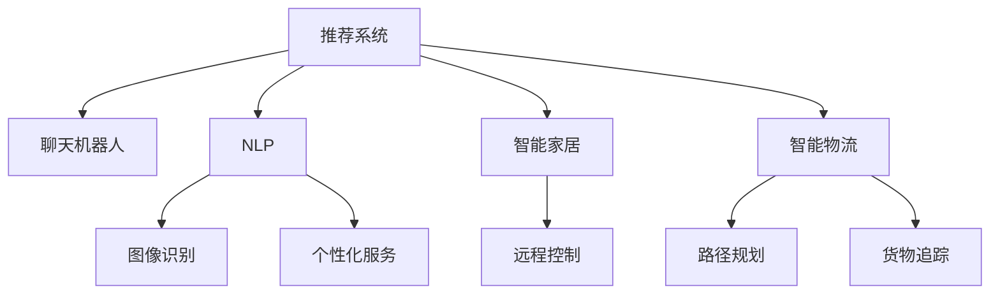

                 

# AI技术在消费市场中的应用

> 关键词：人工智能, 消费市场, 推荐系统, 聊天机器人, 自然语言处理, 图像识别, 个性化服务, 智能家居, 智能物流

## 1. 背景介绍

### 1.1 问题由来

随着互联网的普及和智能设备的渗透，消费市场正在经历一场数字化、智能化的变革。消费者行为的变化、市场需求的个性化、商业模式的创新，都离不开AI技术的深度介入。AI技术不仅改变了消费者的购物体验，也为商家提供了更加精准的市场洞察和运营优化手段。

AI技术在消费市场的应用，包括但不限于以下几个领域：

- 推荐系统：根据用户的历史行为和实时数据，提供个性化商品推荐，提升购买转化率。
- 聊天机器人：通过自然语言处理技术，提供24小时在线客服，增强用户互动体验。
- 图像识别：利用图像识别技术，对商品进行智能分类、品牌识别，优化库存管理和供应链流程。
- 个性化服务：结合AI算法和大数据，提供定制化服务，满足用户多样化的需求。
- 智能家居：通过AI技术，实现对家庭设备的远程控制和智能化管理。
- 智能物流：利用AI进行路径规划、货物追踪，提高配送效率和客户满意度。

这些AI技术的深入应用，正在重塑传统的消费模式，推动消费市场的全面升级。

### 1.2 问题核心关键点

AI技术在消费市场中的应用，核心在于如何通过数据驱动的智能算法，提升用户体验和商家运营效率。以下列举了几个核心关键点：

- **数据获取与处理**：高质量、大规模的数据是AI技术应用的基础。如何获取和处理消费市场相关数据，是一个重要的研究方向。
- **智能算法设计**：基于数据设计智能算法，实现个性化推荐、精准匹配等功能，是提升消费市场智能化的关键。
- **模型训练与优化**：通过模型训练和优化，提升AI模型的准确性和鲁棒性，确保其在实际场景中的良好表现。
- **应用部署与监控**：将训练好的AI模型部署到实际应用中，进行性能监控和优化，确保系统稳定运行。
- **隐私保护与合规**：在AI技术应用中，隐私保护和合规是不可忽视的重要问题，如何平衡数据利用与隐私保护，是AI技术应用的重要考量。

这些关键点构成了AI技术在消费市场应用的基础框架，为后续深入探讨提供了方向。

## 2. 核心概念与联系

### 2.1 核心概念概述

为了更好地理解AI技术在消费市场中的应用，本节将介绍几个密切相关的核心概念：

- **推荐系统(Recommendation System)**：利用用户行为数据和商品属性信息，自动生成个性化推荐，提升用户体验和转化率。常见的推荐算法包括协同过滤、内容推荐、混合推荐等。

- **聊天机器人(Chatbot)**：通过自然语言处理技术，提供自动化的客服和互动服务。常见的聊天机器人基于规则引擎、统计学习、深度学习等技术。

- **自然语言处理(Natural Language Processing, NLP)**：利用计算技术，实现对人类语言的理解和生成。常见的NLP应用包括情感分析、文本分类、机器翻译等。

- **图像识别(Image Recognition)**：利用计算机视觉技术，对图像进行特征提取和分类。常见的应用包括商品识别、品牌检测、图像搜索等。

- **个性化服务(Personalized Services)**：结合AI算法和大数据，提供定制化的服务，满足用户多样化的需求。常见的个性化服务包括推荐系统、广告投放、定制化内容等。

- **智能家居(Smart Home)**：通过AI技术，实现对家庭设备的远程控制和智能化管理。常见的智能家居应用包括智能安防、能源管理、健康监测等。

- **智能物流(Intelligent Logistics)**：利用AI技术进行路径规划、货物追踪，提高配送效率和客户满意度。常见的智能物流应用包括仓库管理、配送优化、库存控制等。

这些核心概念之间的逻辑关系可以通过以下Mermaid流程图来展示：



这个流程图展示了AI技术在消费市场应用的各个核心概念及其相互关系：

1. **推荐系统**和**聊天机器人**是AI技术在消费市场的重要应用，分别从信息获取和互动服务方面提升用户体验。
2. **NLP**和**图像识别**是AI技术的基础，为推荐系统和聊天机器人提供数据支持和智能决策。
3. **个性化服务**、**智能家居**和**智能物流**是AI技术在各个具体场景的应用，共同构建了智能化的消费市场。

## 3. 核心算法原理 & 具体操作步骤
### 3.1 算法原理概述

AI技术在消费市场的应用，本质上是通过数据驱动的智能算法，提升用户体验和商家运营效率。常见的AI算法包括：

- **协同过滤(Collaborative Filtering)**：利用用户的历史行为和兴趣相似性，推荐相关商品。常见的协同过滤算法包括基于用户的协同过滤和基于物品的协同过滤。
- **内容推荐(Content-Based Filtering)**：根据商品的属性和用户的历史偏好，推荐相关商品。内容推荐通常基于商品描述和用户兴趣模型。
- **混合推荐(Hybrid Filtering)**：结合协同过滤和内容推荐，提升推荐的准确性和多样性。混合推荐算法通常采用加权、串行、并行等策略。
- **深度学习(Deep Learning)**：利用深度神经网络，从大量数据中提取复杂特征，提升推荐的精度和泛化能力。常见的深度学习模型包括CNN、RNN、LSTM等。
- **强化学习(Reinforcement Learning)**：通过奖励机制，训练模型自动优化推荐策略，实现更智能的个性化推荐。强化学习模型通常用于动态调整推荐策略和用户交互。
- **自然语言处理(NLP)**：利用语言模型和情感分析等技术，对用户评论、聊天记录进行分析，提升推荐的个性化和准确性。

这些算法在实际应用中，需要根据具体场景进行灵活组合和优化。

### 3.2 算法步骤详解

AI技术在消费市场的应用，通常包括以下几个关键步骤：

**Step 1: 数据获取与处理**
- 收集用户行为数据、商品属性信息、市场交易数据等，形成数据集。
- 对数据进行清洗、去重、归一化等预处理，确保数据质量。

**Step 2: 算法设计**
- 选择合适的算法模型，如协同过滤、内容推荐、混合推荐等。
- 设计特征提取和模型训练流程，确保算法准确性和鲁棒性。
- 设定模型超参数，如学习率、正则化系数、迭代轮数等。

**Step 3: 模型训练与优化**
- 利用训练集数据，进行模型训练。
- 在验证集上评估模型性能，进行参数调优和模型优化。
- 使用测试集数据，进行模型性能测试和验证。

**Step 4: 应用部署与监控**
- 将训练好的模型部署到实际应用中，如推荐系统、聊天机器人等。
- 进行系统性能监控，确保系统稳定运行。
- 根据反馈数据，不断优化算法和模型。

**Step 5: 隐私保护与合规**
- 对用户数据进行隐私保护，确保数据安全。
- 遵守相关法律法规，如GDPR、CCPA等，确保数据使用合规。
- 定期进行数据审计和隐私评估，防范数据滥用风险。

### 3.3 算法优缺点

AI技术在消费市场的应用，具有以下优点：

1. **提升用户体验**：通过个性化推荐和互动服务，提升用户购物体验和满意度。
2. **优化商家运营**：通过智能分析和大数据分析，优化库存管理、广告投放、营销策略等，提升商家运营效率。
3. **降低运营成本**：通过自动化和智能化管理，减少人工干预和运营成本。
4. **实现数据驱动决策**：利用大数据和智能算法，提供基于数据的决策支持，提升决策精准性。

同时，AI技术在消费市场的应用也存在一些局限性：

1. **数据隐私和安全**：大规模数据收集和处理，存在隐私泄露和数据安全问题。
2. **算法复杂性**：复杂算法需要大量计算资源和专业技能，难以在小型企业中快速部署。
3. **模型可解释性**：深度学习等复杂模型难以解释其决策过程，用户难以理解推荐逻辑。
4. **技术依赖性**：过度依赖AI技术，可能降低人工判断和决策的灵活性和多样性。
5. **用户信任问题**：用户对AI推荐和互动服务的信任度，直接影响其使用体验。

## 4. 数学模型和公式 & 详细讲解  
### 4.1 数学模型构建

为了更好地理解AI技术在消费市场中的应用，本节将使用数学语言对推荐系统等核心算法的构建进行更加严格的刻画。

假设用户集合为 $U=\{u_1, u_2, \ldots, u_N\}$，商品集合为 $I=\{i_1, i_2, \ldots, i_M\}$，用户 $u$ 对商品 $i$ 的评分 $r_{ui}$ 表示为：

$$
r_{ui} \in [1, 5]
$$

推荐系统旨在为用户 $u$ 推荐最相关的前 $K$ 个商品 $I=\{i_1, i_2, \ldots, i_K\}$。常见的推荐算法可以表示为：

**协同过滤算法**：基于用户 $u$ 和商品 $i$ 的历史行为，利用相似性度量，预测用户对商品的评分。

$$
\hat{r}_{ui} = \sum_{j \in \mathcal{N}_u} \frac{r_{uj} r_{ij}}{\sqrt{\hat{s}_{ui} \hat{s}_{uj}}}
$$

其中，$\mathcal{N}_u$ 为与用户 $u$ 相似的用户集合，$\hat{s}_{ui}$ 和 $\hat{s}_{uj}$ 为相似性度量。

**内容推荐算法**：根据商品属性 $x_i$ 和用户兴趣 $y_u$，预测用户对商品的评分。

$$
\hat{r}_{ui} = \sum_{k=1}^K \alpha_k x_{ik} y_{uk}
$$

其中，$x_{ik}$ 为商品 $i$ 的属性向量，$y_{uk}$ 为用户 $u$ 的兴趣向量，$\alpha_k$ 为权重系数。

**深度学习模型**：利用神经网络，从用户行为数据和商品属性中提取特征，预测用户对商品的评分。

$$
\hat{r}_{ui} = \mathbb{E}_{\theta}[H_{\theta}(u, i)]
$$

其中，$H_{\theta}$ 为神经网络模型，$\theta$ 为模型参数。

### 4.2 公式推导过程

以下我们以协同过滤算法为例，推导协同过滤模型的损失函数和梯度更新公式。

假设用户 $u$ 对商品 $i$ 的真实评分和预测评分分别为 $r_{ui}$ 和 $\hat{r}_{ui}$，协同过滤算法的目标是最大化预测评分与真实评分的匹配度，即：

$$
\max_{\theta} \sum_{u,i} r_{ui} \log\sigma(\hat{r}_{ui}) + (1 - r_{ui}) \log(1 - \sigma(\hat{r}_{ui}))
$$

其中 $\sigma$ 为 sigmoid 函数。

通过最大化损失函数，优化模型参数 $\theta$，使得预测评分逼近真实评分。根据梯度下降算法，损失函数的梯度为：

$$
\nabla_{\theta} \mathcal{L} = \sum_{u,i} [\hat{r}_{ui} - r_{ui}] \nabla_{\theta} H_{\theta}(u, i)
$$

将梯度代入参数更新公式：

$$
\theta \leftarrow \theta - \eta \nabla_{\theta} \mathcal{L}
$$

其中 $\eta$ 为学习率。

## 5. 项目实践：代码实例和详细解释说明
### 5.1 开发环境搭建

在进行AI技术应用开发前，我们需要准备好开发环境。以下是使用Python进行TensorFlow开发的环境配置流程：

1. 安装Anaconda：从官网下载并安装Anaconda，用于创建独立的Python环境。

2. 创建并激活虚拟环境：
```bash
conda create -n tensorflow-env python=3.8 
conda activate tensorflow-env
```

3. 安装TensorFlow：根据CUDA版本，从官网获取对应的安装命令。例如：
```bash
pip install tensorflow
```

4. 安装各类工具包：
```bash
pip install numpy pandas scikit-learn matplotlib tqdm jupyter notebook ipython
```

完成上述步骤后，即可在`tensorflow-env`环境中开始AI应用开发。

### 5.2 源代码详细实现

下面我们以推荐系统为例，给出使用TensorFlow进行协同过滤算法实现的PyTorch代码实现。

首先，定义协同过滤算法的数据处理函数：

```python
import tensorflow as tf
from tensorflow.keras import layers
import numpy as np

def build_cf_model(n_users, n_items, latent_dim, num_epochs, batch_size):
    model = tf.keras.Sequential([
        layers.Dense(latent_dim, input_shape=(n_users, n_items), activation='relu'),
        layers.Dense(1, activation='sigmoid')
    ])
    model.compile(optimizer='adam', loss='binary_crossentropy', metrics=['accuracy'])
    model.fit(user_item_matrix, item_rated_matrix, epochs=num_epochs, batch_size=batch_size, verbose=1)
    return model

# 用户行为矩阵和商品评分矩阵
user_item_matrix = np.random.rand(n_users, n_items)
item_rated_matrix = np.random.rand(n_items, n_items)
```

然后，定义协同过滤算法的训练和评估函数：

```python
def evaluate_model(model, user_item_matrix, item_rated_matrix, num_epochs, batch_size):
    model.evaluate(user_item_matrix, item_rated_matrix)
    
def train_cf_model(model, user_item_matrix, item_rated_matrix, num_epochs, batch_size):
    model.train(user_item_matrix, item_rated_matrix, epochs=num_epochs, batch_size=batch_size)
```

最后，启动协同过滤算法的训练流程并在测试集上评估：

```python
n_users = 1000
n_items = 1000
latent_dim = 50
num_epochs = 100
batch_size = 128

model = build_cf_model(n_users, n_items, latent_dim, num_epochs, batch_size)
evaluate_model(model, user_item_matrix, item_rated_matrix, num_epochs, batch_size)
train_cf_model(model, user_item_matrix, item_rated_matrix, num_epochs, batch_size)
```

以上就是使用TensorFlow进行协同过滤算法实现的完整代码实现。可以看到，TensorFlow的强大API封装使得协同过滤算法的实现变得简洁高效。

### 5.3 代码解读与分析

让我们再详细解读一下关键代码的实现细节：

**build_cf_model函数**：
- `user_item_matrix` 和 `item_rated_matrix` 为用户行为矩阵和商品评分矩阵，通常从实际数据集中提取。
- 定义了一个包含两个全连接层的神经网络模型，分别对应协同过滤算法的特征提取和评分预测。
- 使用 `binary_crossentropy` 作为损失函数，`sigmoid` 激活函数作为评分预测输出。
- 编译模型并使用 `adam` 优化器进行训练。

**evaluate_model和train_cf_model函数**：
- `evaluate_model` 函数用于在测试集上评估模型性能。
- `train_cf_model` 函数用于在训练集上训练模型。
- 使用 `binary_crossentropy` 作为损失函数，`adam` 优化器进行参数更新。

**训练流程**：
- 定义模型的超参数，如 `n_users`、`n_items`、`latent_dim`、`num_epochs`、`batch_size` 等。
- 调用 `build_cf_model` 函数构建协同过滤模型。
- 调用 `evaluate_model` 函数在测试集上评估模型性能。
- 调用 `train_cf_model` 函数在训练集上训练模型。
- 循环迭代训练，直到达到预设的迭代轮数。

可以看到，TensorFlow的API封装和自动微分功能使得协同过滤算法的实现变得非常直观和简洁。开发者可以将更多精力放在模型设计和调参上，而不必过多关注底层计算细节。

当然，工业级的系统实现还需考虑更多因素，如模型的保存和部署、超参数的自动搜索、更多的训练策略等。但核心的协同过滤算法基本与此类似。

## 6. 实际应用场景
### 6.1 智能客服系统

AI技术在智能客服系统中的应用，主要体现在聊天机器人(Chatbot)和自然语言处理(NLP)上。通过深度学习和自然语言理解，聊天机器人可以理解用户的查询，提供即时响应和问题解答，提升用户满意度。

在技术实现上，可以收集企业的客服对话记录，将问题和最佳答复构建成监督数据，在此基础上对预训练聊天机器人进行微调。微调后的聊天机器人能够自动理解用户意图，匹配最合适的答案模板进行回复。对于用户提出的新问题，还可以接入检索系统实时搜索相关内容，动态组织生成回答。如此构建的智能客服系统，能大幅提升客户咨询体验和问题解决效率。

### 6.2 金融舆情监测

金融机构需要实时监测市场舆论动向，以便及时应对负面信息传播，规避金融风险。传统的人工监测方式成本高、效率低，难以应对网络时代海量信息爆发的挑战。基于AI技术的金融舆情监测系统，可以实时抓取和分析网络文本数据，提取舆情信息，预测市场波动，及时预警风险。

具体而言，可以收集金融领域相关的新闻、报道、评论等文本数据，并对其进行情感分析。利用情感分析结果，实时监测不同主题下的情感变化趋势，一旦发现负面信息激增等异常情况，系统便会自动预警，帮助金融机构快速应对潜在风险。

### 6.3 个性化推荐系统

当前的推荐系统往往只依赖用户的历史行为数据进行物品推荐，无法深入理解用户的真实兴趣偏好。基于AI技术的个性化推荐系统，可以更好地挖掘用户行为背后的语义信息，从而提供更精准、多样的推荐内容。

在实践中，可以收集用户浏览、点击、评论、分享等行为数据，提取和用户交互的物品标题、描述、标签等文本内容。将文本内容作为模型输入，用户的后续行为（如是否点击、购买等）作为监督信号，在此基础上微调预训练语言模型。微调后的模型能够从文本内容中准确把握用户的兴趣点。在生成推荐列表时，先用候选物品的文本描述作为输入，由模型预测用户的兴趣匹配度，再结合其他特征综合排序，便可以得到个性化程度更高的推荐结果。

### 6.4 未来应用展望

随着AI技术的不断进步，AI技术在消费市场的应用前景将更加广阔。未来，基于AI技术的推荐系统、聊天机器人、金融舆情监测、个性化推荐等应用将深入渗透到各个行业，为传统行业带来深远的变革。

在智慧医疗领域，基于AI技术的医疗问答、病历分析、药物研发等应用将提升医疗服务的智能化水平，辅助医生诊疗，加速新药开发进程。

在智能教育领域，AI技术可应用于作业批改、学情分析、知识推荐等方面，因材施教，促进教育公平，提高教学质量。

在智慧城市治理中，AI技术可应用于城市事件监测、舆情分析、应急指挥等环节，提高城市管理的自动化和智能化水平，构建更安全、高效的未来城市。

此外，在企业生产、社会治理、文娱传媒等众多领域，基于AI技术的AI应用也将不断涌现，为经济社会发展注入新的动力。相信随着技术的日益成熟，AI技术必将在更广阔的应用领域大放异彩，深刻影响人类的生产生活方式。

## 7. 工具和资源推荐
### 7.1 学习资源推荐

为了帮助开发者系统掌握AI技术在消费市场中的应用，这里推荐一些优质的学习资源：

1. 《TensorFlow官方文档》：TensorFlow的官方文档，提供了全面的API使用指南和开发教程，是学习AI技术的重要参考资料。
2. 《深度学习入门：基于TensorFlow》：一本面向初学者的深度学习入门书籍，通过实际项目讲解深度学习的基础知识和实践技能。
3. 《自然语言处理综论》：一本介绍自然语言处理技术基础和最新进展的权威书籍，适合深入学习NLP技术的开发者。
4. 《强化学习：从基础到前沿》：一本介绍强化学习理论、算法和应用的综合书籍，适合学习AI算法和策略的开发者。
5. 《AI从业者指南》：一份详细的AI从业者指南，涵盖AI技术在各个行业中的应用，适合综合学习AI技术的开发者。

通过对这些资源的学习实践，相信你一定能够快速掌握AI技术在消费市场的应用精髓，并用于解决实际的业务问题。

### 7.2 开发工具推荐

高效的开发离不开优秀的工具支持。以下是几款用于AI技术应用开发的常用工具：

1. TensorFlow：由Google主导开发的开源深度学习框架，生产部署方便，适合大规模工程应用。
2. PyTorch：基于Python的开源深度学习框架，灵活动态的计算图，适合快速迭代研究。
3. Jupyter Notebook：一个强大的交互式编程环境，适合进行数据探索、模型调试和结果展示。
4. Weights & Biases：模型训练的实验跟踪工具，可以记录和可视化模型训练过程中的各项指标，方便对比和调优。
5. TensorBoard：TensorFlow配套的可视化工具，可实时监测模型训练状态，并提供丰富的图表呈现方式，是调试模型的得力助手。

合理利用这些工具，可以显著提升AI技术应用开发的效率，加快创新迭代的步伐。

### 7.3 相关论文推荐

AI技术在消费市场的应用源于学界的持续研究。以下是几篇奠基性的相关论文，推荐阅读：

1. 《深度学习在推荐系统中的应用》：论文介绍了深度学习在推荐系统中的基本架构和常用算法，奠定了深度学习推荐系统的发展基础。
2. 《利用自然语言处理技术改进金融舆情监测系统》：论文介绍了基于自然语言处理技术的金融舆情监测系统，展示了AI技术在金融领域的应用潜力。
3. 《个性化推荐系统的设计与实现》：论文介绍了个性化推荐系统的设计思路和实现方法，为个性化推荐系统的开发提供了参考。
4. 《智能客服系统在电商平台中的应用》：论文介绍了智能客服系统的设计与实现，展示了AI技术在智能客服中的应用效果。

这些论文代表了大语言模型微调技术的发展脉络。通过学习这些前沿成果，可以帮助研究者把握学科前进方向，激发更多的创新灵感。

## 8. 总结：未来发展趋势与挑战

### 8.1 总结

本文对AI技术在消费市场中的应用进行了全面系统的介绍。首先阐述了AI技术在消费市场的应用背景和意义，明确了AI技术在推荐系统、聊天机器人、金融舆情监测、个性化服务、智能家居、智能物流等领域的独特价值。其次，从原理到实践，详细讲解了推荐系统、聊天机器人等核心算法的数学原理和关键步骤，给出了AI应用开发的完整代码实例。同时，本文还广泛探讨了AI技术在各个行业领域的应用前景，展示了AI技术应用的广阔前景。

通过本文的系统梳理，可以看到，AI技术在消费市场的应用正在全面展开，为传统行业带来深远的变革。AI技术不仅提升了消费者的购物体验，也为商家提供了更加精准的市场洞察和运营优化手段。未来，随着AI技术的不断进步和深度应用，相信将有更多的AI技术应用于消费市场，为经济社会发展注入新的动力。

### 8.2 未来发展趋势

展望未来，AI技术在消费市场的应用将呈现以下几个发展趋势：

1. **数据利用更加全面**：随着数据收集技术的进步和数据治理能力的提升，AI技术将能够利用更加全面、高质量的数据，提升应用的精度和效率。
2. **算法模型更加先进**：深度学习、强化学习、因果推理等先进算法的应用，将进一步提升AI技术的智能化水平。
3. **应用场景更加丰富**：AI技术将不仅仅应用于推荐系统、聊天机器人等传统场景，还将广泛应用于智能家居、智能物流、智慧医疗等领域，带来深远的变革。
4. **用户体验更加个性化**：基于用户数据的深度分析，AI技术将能够提供更加个性化的服务，满足用户多样化的需求。
5. **技术融合更加紧密**：AI技术与物联网、区块链、5G等新兴技术的融合，将进一步拓展AI技术的应用场景和能力。

这些趋势凸显了AI技术在消费市场应用的前景广阔。AI技术将在各个领域带来深远的变革，推动经济社会的全面升级。

### 8.3 面临的挑战

尽管AI技术在消费市场的应用取得了显著进展，但在迈向更加智能化、普适化应用的过程中，仍面临诸多挑战：

1. **数据隐私和安全**：大规模数据收集和处理，存在隐私泄露和数据安全问题。如何平衡数据利用和隐私保护，是AI技术应用的重要挑战。
2. **技术复杂性和成本**：AI技术的实现需要高水平的技术能力和充足的计算资源，对于小型企业来说，可能难以快速部署和应用。
3. **模型可解释性**：深度学习等复杂模型难以解释其决策过程，用户难以理解推荐逻辑，可能影响用户的信任度。
4. **技术依赖性**：过度依赖AI技术，可能降低人工判断和决策的灵活性和多样性，带来新的风险。
5. **技术标准化和规范化**：AI技术的应用需要标准化和规范化，以确保技术应用的统一性和可互操作性。

这些挑战需要在技术、政策、标准等多个方面协同解决，才能真正实现AI技术在消费市场的广泛应用。

### 8.4 研究展望

面对AI技术在消费市场应用所面临的挑战，未来的研究需要在以下几个方面寻求新的突破：

1. **数据隐私保护**：研发更加高效、安全的数据隐私保护技术，确保用户数据的安全性和隐私性。
2. **模型可解释性**：研究如何提高AI模型的可解释性，让用户理解模型的决策逻辑，增强用户信任。
3. **技术标准化**：制定AI技术应用的标准和规范，确保技术应用的统一性和可互操作性。
4. **多模态融合**：将AI技术与物联网、区块链、5G等新兴技术融合，拓展AI技术的应用场景和能力。
5. **跨领域应用**：将AI技术应用于更多垂直行业，推动AI技术的广泛应用和行业升级。

这些研究方向将引领AI技术在消费市场的应用走向更加智能化、普适化、可解释化的未来。相信随着学界和产业界的共同努力，AI技术必将在消费市场带来深远的变革，推动经济社会全面升级。

## 9. 附录：常见问题与解答

**Q1：AI技术在消费市场的应用有哪些局限性？**

A: AI技术在消费市场的应用虽然具有广泛的前景，但也存在一些局限性：

1. **数据隐私和安全**：大规模数据收集和处理，存在隐私泄露和数据安全问题。如何平衡数据利用和隐私保护，是AI技术应用的重要挑战。
2. **技术复杂性和成本**：AI技术的实现需要高水平的技术能力和充足的计算资源，对于小型企业来说，可能难以快速部署和应用。
3. **模型可解释性**：深度学习等复杂模型难以解释其决策过程，用户难以理解推荐逻辑，可能影响用户的信任度。
4. **技术依赖性**：过度依赖AI技术，可能降低人工判断和决策的灵活性和多样性，带来新的风险。
5. **技术标准化和规范化**：AI技术的应用需要标准化和规范化，以确保技术应用的统一性和可互操作性。

这些局限性需要在技术、政策、标准等多个方面协同解决，才能真正实现AI技术在消费市场的广泛应用。

**Q2：如何提升AI技术的可解释性？**

A: 提升AI技术的可解释性，可以从以下几个方面入手：

1. **模型简化**：使用简单模型或降低模型复杂度，使得模型易于理解和解释。
2. **特征可解释**：对模型的特征提取过程进行可视化，展示模型如何从数据中提取特征。
3. **决策规则**：将模型决策过程转换为易于理解的规则或规则集，帮助用户理解模型的决策逻辑。
4. **模型透明**：增加模型的透明性，让用户能够看到模型的输入、输出和中间计算过程。
5. **用户反馈**：通过用户反馈，不断优化模型和算法，提升模型的可解释性和用户满意度。

这些方法可以帮助提升AI技术的可解释性，增强用户信任和接受度。

**Q3：AI技术在消费市场的应用前景如何？**

A: AI技术在消费市场的应用前景广阔，主要体现在以下几个方面：

1. **提升用户体验**：通过个性化推荐和互动服务，提升用户购物体验和满意度。
2. **优化商家运营**：通过智能分析和大数据分析，优化库存管理、广告投放、营销策略等，提升商家运营效率。
3. **降低运营成本**：通过自动化和智能化管理，减少人工干预和运营成本。
4. **实现数据驱动决策**：利用大数据和智能算法，提供基于数据的决策支持，提升决策精准性。

随着AI技术的不断进步和深度应用，AI技术必将在更多行业领域带来深远的变革，推动经济社会发展。

---

作者：禅与计算机程序设计艺术 / Zen and the Art of Computer Programming

