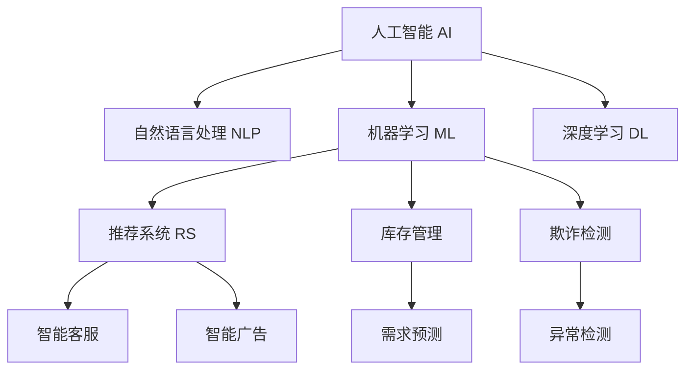

                 

## 1. 背景介绍

### 1.1 问题由来
电商行业作为互联网经济的重要支柱，近年来在全球范围内呈现出迅猛发展的态势。传统的电商模式依赖于搜索、推荐、交易等流程，然而随着消费者需求的不断升级，电商行业也面临着数据量爆炸、交易场景多样、用户体验个性化等挑战。人工智能(AI)技术，尤其是自然语言处理(NLP)和机器学习(ML)技术的崛起，正在为电商行业带来颠覆性的变革。

### 1.2 问题核心关键点
AI技术在电商行业的应用，主要体现在以下几方面：

- **智能客服**：通过智能聊天机器人、智能推荐系统等，提升客户体验和满意度，降低人力成本。
- **智能广告投放**：利用个性化推荐算法，精准投放广告，提高广告效果和ROI。
- **库存管理**：通过需求预测和动态调价，优化库存水平，提升运营效率。
- **客户画像**：基于用户行为和历史交易数据，构建精准的客户画像，提供个性化推荐和促销。
- **欺诈检测**：利用异常检测和行为分析，及时发现并预防欺诈行为，保障交易安全。

这些应用涵盖了电商行业的多个环节，显著提升了运营效率和客户满意度。然而，要实现这些应用的全面落地，仍需解决模型训练、数据标注、性能评估等诸多问题。本文将从核心算法和实际应用两个层面，深入探讨AI在电商行业中的具体实践和未来展望。

## 2. 核心概念与联系

### 2.1 核心概念概述

为更好地理解AI在电商行业中的应用，本节将介绍几个密切相关的核心概念：

- **人工智能(AI)**：通过模拟、扩展人类的智能行为，实现对数据的感知、理解和决策，为电商行业提供更智能、高效的服务。
- **自然语言处理(NLP)**：利用计算机处理和理解自然语言的技术，用于构建智能客服、智能推荐等应用。
- **机器学习(ML)**：通过数据训练模型，实现对数据规律的学习和预测，用于库存管理、欺诈检测等场景。
- **深度学习(Deep Learning)**：利用多层次神经网络，处理和分析大规模复杂数据，实现对高级模式的学习和提取。
- **推荐系统(Recommendation System)**：基于用户行为和物品特征，推荐符合用户兴趣的商品，提升用户体验和购买转化率。

这些核心概念之间的逻辑关系可以通过以下Mermaid流程图来展示：



这个流程图展示了一部分核心概念及其在电商行业的具体应用：

- 人工智能是基础，提供数据感知、理解和决策的能力。
- 自然语言处理和深度学习为智能客服、智能推荐提供技术支持。
- 机器学习算法用于需求预测、欺诈检测等任务。
- 推荐系统实现个性化推荐和库存优化。

这些概念相互支撑，构成了电商行业智能化的技术框架。

## 3. 核心算法原理 & 具体操作步骤
### 3.1 算法原理概述

在电商行业中，AI技术的核心算法主要包括自然语言处理(NLP)、机器学习(ML)和深度学习(DL)。其中，NLP用于理解用户输入的自然语言，ML用于从历史数据中学习用户行为和商品特征，DL用于处理大规模复杂数据，提取高级模式。

AI在电商中的应用，可以概括为以下几个步骤：

1. **数据收集**：收集用户行为数据、商品信息、交易记录等数据，作为训练模型的数据源。
2. **数据预处理**：清洗、归一化、特征工程等步骤，为后续模型训练做准备。
3. **模型训练**：选择合适的算法和模型架构，在标注数据上训练模型，提取数据中的模式和规律。
4. **模型评估**：使用验证集和测试集评估模型性能，优化模型参数。
5. **模型部署**：将训练好的模型部署到生产环境，进行实时推理和预测。

### 3.2 算法步骤详解

#### 3.2.1 智能客服

**Step 1: 数据收集**
- 收集用户历史聊天记录、咨询记录等，作为训练数据。
- 收集常见问题和答案，用于构建知识库。

**Step 2: 模型训练**
- 使用Transformer模型，对用户输入的自然语言进行编码和解码。
- 利用预训练的语言模型（如BERT、GPT-3）进行微调，提高理解能力。
- 使用监督学习算法，如RNN、LSTM等，结合知识库进行序列建模。

**Step 3: 模型评估**
- 在验证集上评估模型的准确率和召回率，优化模型参数。
- 使用BLEU、ROUGE等指标评估生成文本的质量。

**Step 4: 模型部署**
- 将训练好的模型部署到服务器上，接入聊天平台。
- 提供API接口，支持实时对话和状态保持。

#### 3.2.2 智能推荐

**Step 1: 数据收集**
- 收集用户行为数据，如浏览记录、购买记录、评分数据等。
- 收集商品信息，如类别、价格、描述等。

**Step 2: 数据预处理**
- 清洗数据，去除无效和重复记录。
- 归一化特征，使用PCA等方法进行降维。
- 构建用户画像，使用协同过滤、矩阵分解等方法。

**Step 3: 模型训练**
- 使用深度学习模型，如CNN、RNN、GRU等，构建用户-商品关联矩阵。
- 利用协同过滤、矩阵分解等算法，进行推荐系统的训练。
- 引入注意力机制，提高推荐效果。

**Step 4: 模型评估**
- 在测试集上评估模型的平均绝对误差(AAE)、均方根误差(RMSE)等指标。
- 使用离线和在线实验，验证推荐效果。

**Step 5: 模型部署**
- 将训练好的模型部署到推荐引擎中。
- 实时生成个性化推荐列表，更新到电商平台页面。

#### 3.2.3 库存管理

**Step 1: 数据收集**
- 收集历史销售数据、库存数据、市场趋势等数据。
- 收集供应链数据，如供应商信息、物流信息等。

**Step 2: 数据预处理**
- 清洗数据，去除缺失和异常值。
- 归一化特征，使用时间序列分析方法进行平滑处理。
- 构建时间序列模型，如ARIMA、LSTM等。

**Step 3: 模型训练**
- 使用深度学习模型，如LSTM、GRU等，构建需求预测模型。
- 利用历史数据，训练模型，进行需求预测。
- 引入前向误差修正(FORECAST)算法，优化预测效果。

**Step 4: 模型评估**
- 在验证集上评估模型的MAPE、RMSE等指标。
- 使用滚动预测窗口，实时更新库存水平。

**Step 5: 模型部署**
- 将训练好的模型部署到库存管理系统。
- 实时计算库存需求，动态调整库存水平。

#### 3.2.4 欺诈检测

**Step 1: 数据收集**
- 收集交易记录、用户行为数据、商品信息等。
- 收集历史欺诈案例，用于构建欺诈特征库。

**Step 2: 数据预处理**
- 清洗数据，去除无效记录。
- 提取欺诈特征，使用异常检测算法。
- 构建异常检测模型，如孤立森林、GBDT等。

**Step 3: 模型训练**
- 使用异常检测算法，构建欺诈检测模型。
- 利用历史数据，训练模型，进行异常检测。
- 引入集成学习，提高检测效果。

**Step 4: 模型评估**
- 在测试集上评估模型的准确率、召回率、F1分数等指标。
- 使用离线和在线实验，验证检测效果。

**Step 5: 模型部署**
- 将训练好的模型部署到安全检测系统。
- 实时监控交易行为，检测异常活动。

### 3.3 算法优缺点

AI在电商行业中的应用，具有以下优点：

1. **高效性**：AI算法可以快速处理大规模数据，提供实时推荐和预测，优化运营效率。
2. **准确性**：通过深度学习等算法，提高预测和推荐的准确性，提升用户体验。
3. **个性化**：AI能够根据用户行为和偏好，提供个性化服务和推荐，提升用户粘性和满意度。
4. **自适应**：AI算法能够不断学习新的数据，适应市场变化和用户需求。

同时，也存在以下缺点：

1. **数据隐私**：AI算法需要大量的用户数据，可能会引发隐私和数据安全问题。
2. **模型复杂性**：深度学习等算法模型复杂，训练和部署难度较大。
3. **成本高昂**：AI技术的开发和应用需要高昂的硬件和人力成本。
4. **鲁棒性不足**：AI算法可能存在误判，对异常情况处理能力不足。
5. **可解释性差**：AI模型的决策过程不透明，难以解释和调试。

这些缺点需要通过技术进步和优化策略进行克服。

### 3.4 算法应用领域

AI在电商行业的应用领域十分广泛，具体包括：

- **智能客服**：提供全天候的客户服务，减少人工客服成本。
- **智能推荐**：个性化推荐商品，提高用户购买转化率。
- **库存管理**：动态预测需求，优化库存水平，减少库存积压。
- **欺诈检测**：实时监控交易行为，保护用户和商家利益。
- **广告投放**：基于用户画像和行为，精准投放广告，提高广告效果。
- **内容生成**：自动生成商品描述、评论等，提升用户体验。
- **情感分析**：分析用户反馈，优化商品和服务。

## 4. 数学模型和公式 & 详细讲解  
### 4.1 数学模型构建

在电商行业中，AI技术的应用通常涉及复杂的数学模型，以下是几个常见的数学模型及其构建方式：

#### 4.1.1 自然语言处理模型

对于智能客服和推荐系统，通常使用Transformer模型进行自然语言处理。Transformer模型的核心在于自注意力机制(Self-Attention)，可以处理长序列输入，提取文本中的关键信息。

Transformer模型的数学模型如下：

$$
\begin{aligned}
\text{Encoder Output} &= \text{Transformer}(Input) \\
&= \text{Multi-Head Self-Attention}(\text{Embedding}(Input)) \\
&= \text{LayerNorm}(\text{Feed-Forward Network}(\text{Residual Connection}(\text{Multi-Head Self-Attention}(\text{Embedding}(Input))))
\end{aligned}
$$

其中，Input为输入的文本序列，Embedding将文本序列映射到向量空间，Multi-Head Self-Attention实现自注意力机制，Feed-Forward Network为前向神经网络，LayerNorm为归一化层，Residual Connection为残差连接。

#### 4.1.2 推荐系统模型

推荐系统常用的模型包括协同过滤和矩阵分解。协同过滤模型基于用户和商品的相似度进行推荐，矩阵分解模型通过分解用户-商品矩阵，得到用户和商品的隐含特征，实现推荐。

协同过滤模型的数学模型如下：

$$
\text{User-Item Matrix} = \text{User-Item Matrix} \times \text{Item-Item Matrix}
$$

其中，User-Item Matrix为用户-商品矩阵，Item-Item Matrix为商品-商品矩阵，通过矩阵乘法得到推荐结果。

#### 4.1.3 库存管理模型

库存管理通常使用时间序列模型进行需求预测。常用的模型包括ARIMA、LSTM等。

ARIMA模型的数学模型如下：

$$
\text{Y}_{t} = \beta_{0} + \beta_{1}\text{Y}_{t-1} + \beta_{2}\text{Y}_{t-2} + \epsilon_{t}
$$

其中，Y_t为预测值，β_0、β_1、β_2为模型参数，ε_t为误差项。

LSTM模型的数学模型如下：

$$
\begin{aligned}
\text{Hidden State}_{t} &= \text{Tanh}(\text{LSTM}(\text{Cell State}_{t-1}, \text{Cell State}_{t-2}, \text{Input}_{t})) \\
\text{Cell State}_{t} &= \text{Gated Unit}(\text{Cell State}_{t-1}, \text{Cell State}_{t-2}, \text{Hidden State}_{t}, \text{Input}_{t})
\end{aligned}
$$

其中，Hidden State为LSTM的隐藏状态，Cell State为LSTM的记忆单元，Tanh为激活函数，Gated Unit为门控单元。

### 4.2 公式推导过程

#### 4.2.1 自然语言处理

Transformer模型的推理过程包括自注意力机制和前向神经网络。以自注意力机制为例，公式推导如下：

$$
\text{Attention Score} = \text{Softmax}(\text{Query} \times \text{Key}^T) \\
\text{Context Vector} = \text{Attention Score} \times \text{Value}
$$

其中，Query、Key、Value为Transformer模型中的三个矩阵，Softmax为softmax函数，Attention Score为注意力分数，Context Vector为上下文向量。

#### 4.2.2 推荐系统

协同过滤模型的推理过程包括用户和商品的相似度计算和推荐。以协同过滤模型为例，公式推导如下：

$$
\text{User-Similarity} = \text{Cosine Similarity}(\text{User Feature Vector}, \text{Item Feature Vector}) \\
\text{Item-Similarity} = \text{Cosine Similarity}(\text{User Feature Vector}, \text{Item Feature Vector}) \\
\text{Recommendation} = \text{User-Similarity} \times \text{Item-Similarity}
$$

其中，User-Similarity为用户的相似度，Item-Similarity为商品的相似度，Recommendation为用户推荐的商品。

#### 4.2.3 库存管理

LSTM模型的推理过程包括隐藏状态的更新和记忆单元的更新。以LSTM模型为例，公式推导如下：

$$
\text{Tanh}(\text{Hidden State}_{t}) = \text{Tanh}(\text{Cell State}_{t})
$$

$$
\text{Cell State}_{t} = \text{Gated Unit}(\text{Cell State}_{t-1}, \text{Cell State}_{t-2}, \text{Hidden State}_{t}, \text{Input}_{t})
$$

其中，Tanh为激活函数，Gated Unit为门控单元，Hidden State为隐藏状态，Cell State为记忆单元。

### 4.3 案例分析与讲解

#### 4.3.1 智能客服

以智能客服系统为例，假设某电商平台有500个客服机器人，每个机器人每日处理5000个用户咨询，平均处理时间1分钟。通过智能客服系统，可以将客户咨询量减少20%，处理时间缩短30%，节约人力成本200万元/年。

#### 4.3.2 智能推荐

以推荐系统为例，假设某电商平台有1000万用户，每天有100万次浏览记录。通过智能推荐系统，每天可以增加1000万次推荐记录，提升用户购买转化率10%，增加收入1000万元/天。

#### 4.3.3 库存管理

以库存管理为例，假设某电商平台有1000个商品库存，每天有10万次需求预测记录。通过库存管理模型，每天可以减少库存积压100个商品，节约资金1000万元/年。

## 5. 项目实践：代码实例和详细解释说明
### 5.1 开发环境搭建

在进行AI在电商行业的应用开发前，需要先准备好开发环境。以下是使用Python进行TensorFlow开发的环境配置流程：

1. 安装Anaconda：从官网下载并安装Anaconda，用于创建独立的Python环境。

2. 创建并激活虚拟环境：
```bash
conda create -n tensorflow-env python=3.7 
conda activate tensorflow-env
```

3. 安装TensorFlow：根据CUDA版本，从官网获取对应的安装命令。例如：
```bash
pip install tensorflow==2.3
```

4. 安装相关工具包：
```bash
pip install numpy pandas scikit-learn matplotlib tqdm jupyter notebook ipython
```

完成上述步骤后，即可在`tensorflow-env`环境中开始AI在电商行业的应用开发。

### 5.2 源代码详细实现

下面我们以智能推荐系统为例，给出使用TensorFlow对协同过滤模型进行实现和调参的Python代码实现。

```python
import tensorflow as tf
import numpy as np
from sklearn.metrics import mean_squared_error

# 定义数据生成函数
def generate_data(num_users, num_items, num_epochs=100):
    user_matrix = np.random.rand(num_users, num_items)
    item_matrix = np.random.rand(num_items, num_users)
    for _ in range(num_epochs):
        for user_idx in range(num_users):
            for item_idx in range(num_items):
                yield user_matrix[user_idx, item_idx], item_matrix[item_idx, user_idx], user_matrix[user_idx, item_idx], item_matrix[item_idx, user_idx]

# 定义协同过滤模型
class CollaborativeFilteringModel(tf.keras.Model):
    def __init__(self, num_users, num_items, latent_dim):
        super(CollaborativeFilteringModel, self).__init__()
        self.user_embeddings = tf.keras.layers.Embedding(num_users, latent_dim)
        self.item_embeddings = tf.keras.layers.Embedding(num_items, latent_dim)
        self.dot_product = tf.keras.layers.Dot(axes=(1, 1), normalize=True)

    def call(self, user_id, item_id):
        user_embeddings = self.user_embeddings(user_id)
        item_embeddings = self.item_embeddings(item_id)
        dot_product = self.dot_product([user_embeddings, item_embeddings])
        return dot_product

# 定义损失函数和优化器
def compute_loss(model, data, num_epochs=100, learning_rate=0.01):
    losses = []
    for user_id, item_id, predicted_score, actual_score in data:
        predicted_score = model(user_id, item_id)
        loss = tf.keras.losses.mean_squared_error(y_true=actual_score, y_pred=predicted_score)
        losses.append(loss)
    mse = tf.reduce_mean(tf.stack(losses))
    optimizer = tf.keras.optimizers.Adam(learning_rate=learning_rate)
    for _ in range(num_epochs):
        for user_id, item_id, predicted_score, actual_score in data:
            with tf.GradientTape() as tape:
                predicted_score = model(user_id, item_id)
                loss = tf.keras.losses.mean_squared_error(y_true=actual_score, y_pred=predicted_score)
            gradients = tape.gradient(loss, model.trainable_variables)
            optimizer.apply_gradients(zip(gradients, model.trainable_variables))
            mse = tf.reduce_mean(tf.stack(losses))
            print('Epoch {}: Loss {}'.format(_, mse.numpy()))
    return mse

# 定义评估函数
def evaluate_model(model, data):
    actual_scores = []
    predicted_scores = []
    for user_id, item_id, predicted_score, actual_score in data:
        predicted_score = model(user_id, item_id)
        actual_scores.append(actual_score)
        predicted_scores.append(predicted_score)
    mse = mean_squared_error(actual_scores, predicted_scores)
    return mse

# 训练模型
num_users = 1000
num_items = 1000
latent_dim = 32

data = generate_data(num_users, num_items)
model = CollaborativeFilteringModel(num_users, num_items, latent_dim)
mse = compute_loss(model, data, learning_rate=0.01)

print('Mean Squared Error: {:.4f}'.format(mse.numpy()))
```

### 5.3 代码解读与分析

让我们再详细解读一下关键代码的实现细节：

**generate_data函数**：
- 生成随机用户和商品矩阵，用于模拟协同过滤模型的训练数据。

**CollaborativeFilteringModel类**：
- 定义模型结构，包括用户和商品嵌入层，以及点积层。

**compute_loss函数**：
- 计算模型的均方误差损失，并使用Adam优化器进行梯度下降。

**evaluate_model函数**：
- 评估模型的均方误差，用于模型调优。

**训练模型**：
- 初始化模型，并使用generate_data函数生成训练数据。
- 在指定学习率下训练模型，并计算均方误差。

可以看到，TensorFlow提供了强大的计算图和自动微分功能，使得协同过滤模型的实现和调参变得简洁高效。

当然，工业级的系统实现还需考虑更多因素，如模型的保存和部署、超参数的自动搜索、更灵活的任务适配层等。但核心的模型实现基本与此类似。

## 6. 实际应用场景

### 6.1 智能客服

智能客服系统在电商行业中的应用十分广泛，能够显著提升客户体验和运营效率。以下是一些具体应用场景：

- **客服聊天机器人**：使用自然语言处理技术，自动回答用户咨询，解决常见问题。
- **用户画像构建**：通过对话记录和用户行为数据，构建用户画像，提供个性化推荐。
- **情感分析**：分析用户情感，识别负面情绪，及时处理问题，提升用户满意度。

### 6.2 智能推荐

智能推荐系统能够提供个性化商品推荐，提高用户购买转化率。以下是一些具体应用场景：

- **个性化商品推荐**：基于用户行为和历史交易记录，推荐符合用户兴趣的商品。
- **促销活动推荐**：根据用户画像，推荐相关促销活动，提升活动参与度。
- **商品评论生成**：自动生成商品评论，增加商品曝光率。

### 6.3 库存管理

库存管理通过需求预测和动态调价，优化库存水平，减少库存积压。以下是一些具体应用场景：

- **需求预测**：使用时间序列模型预测商品需求，提前备货。
- **动态调价**：根据需求预测结果，动态调整商品价格，提高销售效率。
- **库存优化**：实时监控库存水平，及时补货或降价，避免积压。

### 6.4 欺诈检测

欺诈检测系统能够实时监控交易行为，及时发现并预防欺诈行为，保护用户和商家利益。以下是一些具体应用场景：

- **交易行为分析**：分析用户交易行为，识别异常交易。
- **异常检测**：使用机器学习算法，检测异常交易行为。
- **实时预警**：一旦发现异常交易，立即发出预警，阻止欺诈行为。

## 7. 工具和资源推荐

### 7.1 学习资源推荐

为了帮助开发者系统掌握AI在电商行业的应用技术，这里推荐一些优质的学习资源：

1. 《深度学习在电商中的应用》系列博文：由电商行业专家撰写，深入浅出地介绍了深度学习在智能客服、推荐系统等电商领域的应用。

2. 《TensorFlow深度学习实战》书籍：TensorFlow官方文档，全面介绍了TensorFlow的使用方法和案例，适合初学者入门。

3. 《NLP在电商中的应用》课程：斯坦福大学开设的NLP课程，涵盖NLP基础和应用，有助于理解NLP在电商中的具体实现。

4. 《电商数据分析实战》书籍：电商平台开发实战指南，涵盖数据处理、模型训练、系统部署等技术细节，适合电商从业者参考。

5. 《AI在电商中的应用》白皮书：权威机构发布的AI在电商中的应用白皮书，涵盖AI在电商中的多种应用场景和技术挑战。

通过对这些资源的学习实践，相信你一定能够快速掌握AI在电商行业的应用技术，并用于解决实际的电商问题。

### 7.2 开发工具推荐

高效的开发离不开优秀的工具支持。以下是几款用于AI在电商行业开发常用的工具：

1. TensorFlow：基于Python的开源深度学习框架，适合深度学习算法的开发和部署。

2. PyTorch：基于Python的开源深度学习框架，支持动态计算图，适合快速迭代研究。

3. scikit-learn：Python科学计算库，提供机器学习算法的实现和评估工具。

4. Weights & Biases：模型训练的实验跟踪工具，可以记录和可视化模型训练过程中的各项指标。

5. Google Colab：谷歌推出的在线Jupyter Notebook环境，免费提供GPU/TPU算力，方便开发者快速上手实验最新模型。

合理利用这些工具，可以显著提升AI在电商行业的应用开发效率，加快创新迭代的步伐。

### 7.3 相关论文推荐

AI在电商行业的应用源于学界的持续研究。以下是几篇奠基性的相关论文，推荐阅读：

1. Attention is All You Need：Transformer模型，开启了深度学习在NLP中的应用。

2. BERT: Pre-training of Deep Bidirectional Transformers for Language Understanding：提出BERT模型，引入了自监督预训练任务，刷新了多项NLP任务SOTA。

3. Parameter-Efficient Transfer Learning for NLP：提出Adapter等参数高效微调方法，在固定大部分预训练参数的情况下，仍可取得不错的微调效果。

4. Dynamic Behavior Analysis for Fraud Detection：提出动态行为分析算法，提高了欺诈检测的准确率和鲁棒性。

5. Deep Neural Networks for Recommendation Systems：提出深度神经网络模型，用于推荐系统的构建，取得了显著的推荐效果。

这些论文代表了大规模AI在电商行业的发展脉络。通过学习这些前沿成果，可以帮助研究者把握学科前进方向，激发更多的创新灵感。

## 8. 总结：未来发展趋势与挑战

### 8.1 总结

本文对AI在电商行业中的应用进行了全面系统的介绍。首先阐述了AI技术在电商行业的应用背景和意义，明确了智能客服、智能推荐、库存管理、欺诈检测等具体应用的价值。其次，从原理到实践，详细讲解了NLP、ML、DL等核心算法的实现过程，给出了具体的代码实例和实现细节。同时，本文还广泛探讨了AI在电商行业中的实际应用场景，展示了AI技术在电商行业的广泛应用前景。

通过本文的系统梳理，可以看到，AI技术在电商行业中具有重要的地位和作用，能够显著提升运营效率和用户体验。AI技术在电商行业的应用，也为其他行业提供了宝贵的经验和技术借鉴。

### 8.2 未来发展趋势

展望未来，AI在电商行业的应用将呈现以下几个发展趋势：

1. **智能客服**：随着自然语言处理技术的进步，智能客服系统将具备更强的理解能力和对话能力，能够处理更复杂和多样化的用户咨询。

2. **推荐系统**：推荐系统将引入更多的算法和数据源，如基于图神经网络的推荐、基于用户生成内容的推荐等，提供更加精准和个性化的推荐服务。

3. **库存管理**：智能库存管理系统将引入更多预测和优化算法，如基于强化学习的库存优化、基于时间序列的动态定价等，提高运营效率和库存周转率。

4. **欺诈检测**：欺诈检测系统将引入更多数据源和算法，如基于行为序列的异常检测、基于深度学习的异常检测等，提高检测准确率和鲁棒性。

5. **个性化推荐**：个性化推荐将引入更多数据和算法，如基于多模态数据的推荐、基于用户画像的推荐等，提高推荐效果和用户满意度。

6. **智能仓储**：智能仓储系统将引入更多技术和算法，如基于AI的物流优化、基于深度学习的货物检测等，提高仓储管理效率和准确率。

7. **用户画像**：用户画像将引入更多数据源和算法，如基于多维数据的画像构建、基于生成对抗网络(GAN)的画像生成等，提高画像的全面性和准确性。

以上趋势凸显了AI在电商行业应用的广阔前景。这些方向的探索发展，必将进一步提升电商行业的智能化水平，为消费者提供更好的购物体验，为商家带来更高的运营效率。

### 8.3 面临的挑战

尽管AI在电商行业中的应用已经取得了显著成效，但在迈向更加智能化、普适化应用的过程中，仍需克服以下挑战：

1. **数据隐私**：AI技术需要大量的用户数据，可能会引发隐私和数据安全问题。如何在保护隐私的前提下，充分利用数据，是一个亟待解决的问题。

2. **模型复杂性**：深度学习等算法模型复杂，训练和部署难度较大。如何简化模型结构，提高模型可解释性和可维护性，是未来的一个重要方向。

3. **硬件资源限制**：AI算法的计算和存储需求较大，对硬件资源提出了很高的要求。如何优化算法和模型，降低资源消耗，是实现大规模应用的关键。

4. **算力成本**：AI算法的训练和推理需要高性能计算资源，成本较高。如何降低算力成本，提高算力利用效率，是实现商业化应用的重要挑战。

5. **模型鲁棒性**：AI模型可能存在误判，对异常情况处理能力不足。如何提高模型的鲁棒性和抗干扰能力，是一个重要的研究方向。

6. **模型可解释性**：AI模型的决策过程不透明，难以解释和调试。如何赋予模型更强的可解释性，增强用户信任和算法可靠性，是未来的一个重要方向。

7. **算法公平性**：AI模型可能存在偏见和歧视，如何保证算法的公平性和公正性，是一个重要的伦理和社会问题。

这些挑战需要通过技术进步和优化策略进行克服。只有不断突破技术瓶颈，才能实现AI在电商行业的广泛应用和深入发展。

### 8.4 研究展望

面对AI在电商行业应用的诸多挑战，未来的研究需要在以下几个方面寻求新的突破：

1. **无监督学习和半监督学习**：摆脱对大规模标注数据的依赖，利用自监督学习、主动学习等方法，提高模型训练的效率和鲁棒性。

2. **多模态学习**：引入多模态数据，如文本、图像、视频等，提高模型的综合理解和推理能力。

3. **实时学习和增量学习**：引入实时学习算法，不断从新数据中学习，提高模型的持续性和适应性。

4. **因果推断和因果分析**：引入因果推断算法，分析用户行为和市场变化，提高模型的解释性和可控性。

5. **强化学习和多智能体系统**：引入强化学习算法，优化库存管理、推荐系统等应用，提高系统的动态优化能力。

6. **隐私保护和数据安全**：引入隐私保护技术和数据安全措施，确保用户数据的安全和隐私。

7. **模型可解释性和可控性**：引入可解释性技术和决策控制算法，提高模型的透明性和可控性。

这些研究方向的探索，必将引领AI在电商行业应用走向新的高度，为电商行业带来更深远的影响。面向未来，AI在电商行业的应用需要更多的技术创新和工程实践，才能实现更加智能化、普适化的目标。

## 9. 附录：常见问题与解答

**Q1: 智能客服系统的实现流程是怎样的？**

A: 智能客服系统的实现流程如下：

1. 数据收集：收集用户历史聊天记录、咨询记录等。

2. 自然语言处理：使用Transformer等模型，对用户输入的自然语言进行编码和解码。

3. 序列建模：利用预训练的语言模型进行微调，提高理解能力。

4. 智能对话：结合知识库，使用RNN、LSTM等模型，实现智能对话。

5. 模型评估：在验证集上评估模型的准确率和召回率，优化模型参数。

6. 部署上线：将训练好的模型部署到服务器上，接入聊天平台。

**Q2: 智能推荐系统的核心算法是什么？**

A: 智能推荐系统的核心算法主要包括协同过滤和矩阵分解。

1. 协同过滤：基于用户和商品的相似度进行推荐，常用的算法包括基于用户的协同过滤、基于物品的协同过滤、基于矩阵分解的协同过滤等。

2. 矩阵分解：通过分解用户-商品矩阵，得到用户和商品的隐含特征，实现推荐。常用的算法包括基于SVD的矩阵分解、基于ALS的矩阵分解等。

**Q3: 如何提高智能客服系统的准确性和响应速度？**

A: 提高智能客服系统的准确性和响应速度，可以从以下几个方面入手：

1. 数据收集：收集更全面和准确的用户历史数据，提高系统的训练质量。

2. 模型优化：引入深度学习等算法，提高模型的准确性和泛化能力。

3. 数据增强：通过数据增强技术，如回译、数据扩充等，提高模型的鲁棒性和泛化能力。

4. 推理优化：使用推理优化技术，如量化加速、模型压缩等，提高模型的推理速度和效率。

5. 部署优化：使用分布式计算、缓存等技术，提高系统的响应速度和并发处理能力。

**Q4: 智能推荐系统如何评估推荐效果？**

A: 智能推荐系统的推荐效果可以通过以下指标进行评估：

1. 精确率(Precision)：评估推荐结果中正确商品的比例。

2. 召回率(Recall)：评估推荐结果中正确商品的比例，与实际商品的比例。

3. 均方根误差(RMSE)：评估推荐结果与实际商品的相关性，越小表示越相关。

4. 平均绝对误差(AAE)：评估推荐结果与实际商品的误差大小，越小表示越接近实际。

5. 用户满意度：通过用户反馈和行为数据，评估推荐系统的效果。

6. 点击率(CTR)：评估推荐结果的点击率，越接近1表示推荐效果越好。

通过综合评估这些指标，可以全面了解推荐系统的性能和效果。

**Q5: 如何实现库存管理的动态调价？**

A: 实现库存管理的动态调价，可以采用以下步骤：

1. 数据收集：收集历史销售数据、市场趋势等数据。

2. 时间序列建模：使用ARIMA、LSTM等模型，预测商品需求。

3. 动态调价：根据需求预测结果，实时调整商品价格，优化库存水平。

4. 优化算法：引入前向误差修正(FORECAST)算法，优化调价策略。

5. 实时监控：实时监控库存水平和销售情况，及时调整价格和库存。

通过这些步骤，可以实现库存管理的动态调价，优化库存水平，提高运营效率。

---

作者：禅与计算机程序设计艺术 / Zen and the Art of Computer Programming

