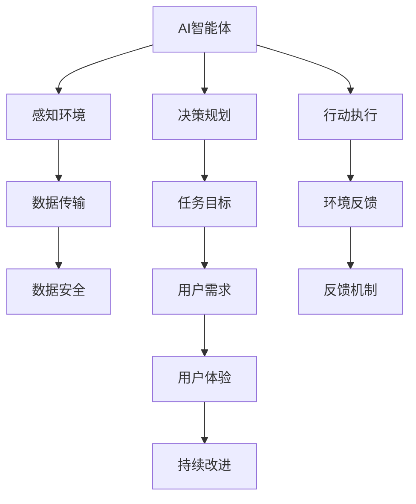

                 

## 1. 背景介绍

### 1.1 问题由来
在当今数字化社会，人工智能(AI)智能体已成为数字世界的重要参与者。无论是智能推荐系统、聊天机器人，还是自动驾驶车辆、医疗诊断系统，AI智能体都在以各种形式与人类进行交互，并日益深入地融入日常生活的各个方面。然而，这些智能体的行为和决策不仅依赖于算法和技术，还受到其与数字世界互动的方式和质量的影响。

### 1.2 问题核心关键点
AI智能体与数字世界的交互，涵盖了数据获取、模型训练、推理决策和反馈改进等各个环节。核心在于如何设计高效、可靠的交互流程，以实现智能体的任务目标并满足人类需求。

### 1.3 问题研究意义
研究AI智能体与数字世界的交互，对于提升智能体的智能化水平、保障数据安全和隐私、增强用户体验具有重要意义：

1. **提升智能化水平**：通过优化数据获取和模型训练流程，AI智能体可以更加精准地理解和执行任务，提升决策和推荐的准确性和时效性。
2. **保障数据安全和隐私**：在交互过程中，需要确保数据的安全传输和隐私保护，避免数据泄露和滥用。
3. **增强用户体验**：通过改进交互界面和反馈机制，提升人机交互的流畅性和自然性，增加用户粘性。

## 2. 核心概念与联系

### 2.1 核心概念概述

为更好地理解AI智能体与数字世界的交互，本节将介绍几个关键概念：

- **AI智能体(AI Agents)**：能够在数字环境中自主决策和执行任务的程序或模型。智能体通过感知环境、决策规划和行动执行，实现其目标。
- **数字世界(Digital World)**：由数字设备和互联网连接构成的虚拟空间，包括社交媒体、电商平台、智能家居等多种应用场景。
- **交互协议(Interaction Protocol)**：智能体与数字世界互动时遵循的规则和协议，包括数据传输格式、通信协议、接口规范等。
- **反馈机制(Feedback Mechanism)**：智能体在执行任务后，通过接收环境反馈来调整自身行为的过程。反馈机制对于学习优化和适应性至关重要。
- **隐私保护(Privacy Protection)**：在交互过程中，采取措施保护用户隐私，防止数据泄露和滥用。
- **用户体验(User Experience, UX)**：智能体交互的界面设计和用户反馈的满意度，影响用户体验的关键因素。

这些概念之间的逻辑关系可以通过以下Mermaid流程图来展示：



这个流程图展示出AI智能体与数字世界交互的主要流程和关键组件：

1. 智能体通过感知环境获取数据。
2. 根据任务目标进行决策规划。
3. 执行行动，并在环境中产生影响。
4. 接收环境反馈，调整决策和行为。
5. 通过反馈机制不断优化性能。
6. 保护数据安全，防止隐私泄露。
7. 关注用户体验，提升人机交互质量。

## 3. 核心算法原理 & 具体操作步骤
### 3.1 算法原理概述

AI智能体与数字世界的交互，本质上是一个复杂的多轮对话过程。智能体通过感知、决策和执行，不断与数字世界互动，优化自身的行为策略。核心算法包括：

- **感知模块(Perception Module)**：负责数据获取和环境感知，是智能体的“眼睛和耳朵”。
- **决策模块(Decision Module)**：根据任务目标和感知信息，进行决策规划，是智能体的“大脑”。
- **执行模块(Execution Module)**：执行决策结果，影响环境状态，是智能体的“手和脚”。
- **反馈模块(Feedback Module)**：接收环境反馈，更新感知和决策模块，实现“学习循环”。

基于以上算法原理，AI智能体与数字世界的交互可以概括为以下几个关键步骤：

1. 数据获取：通过传感器或网络接口获取环境数据。
2. 数据预处理：对原始数据进行清洗、筛选和转换，提取有用的特征。
3. 模型训练：利用历史数据训练模型，建立环境感知和决策规划的映射关系。
4. 推理决策：将感知数据输入模型，进行推理计算，得出决策结果。
5. 行动执行：执行决策结果，对环境产生影响。
6. 反馈收集：接收环境反馈，更新模型和决策模块。
7. 持续改进：通过迭代和优化，提升智能体的性能和适应性。

### 3.2 算法步骤详解

以下详细介绍AI智能体与数字世界交互的详细步骤：

**Step 1: 数据获取**

数据获取是智能体与数字世界交互的第一步。智能体通常通过传感器（如摄像头、麦克风）或网络接口（如API接口）获取环境数据。例如，智能推荐系统获取用户浏览历史和偏好信息，智能家居系统获取室内环境传感器数据。

数据获取的策略包括：

- **主动获取**：智能体主动发起数据请求，获取环境数据。适用于环境相对稳定的情况。
- **被动获取**：智能体通过订阅或监听网络接口，接收环境数据。适用于环境动态变化的情况。

**Step 2: 数据预处理**

数据预处理包括数据清洗、特征提取和数据标准化等步骤。目的是从原始数据中提取有用的信息，为模型训练做准备。

数据预处理的策略包括：

- **数据清洗**：去除噪声、缺失和异常值，保证数据质量。
- **特征提取**：选择或设计合适的特征，提取数据的关键信息。
- **数据标准化**：将数据转换为标准格式，便于模型处理。

**Step 3: 模型训练**

模型训练是智能体的核心能力之一，通过学习历史数据，智能体能够建立环境感知和决策规划的映射关系。训练模型的过程包括：

- **选择合适的模型**：根据任务类型和数据特征，选择合适的模型结构。
- **数据划分**：将数据划分为训练集、验证集和测试集，进行模型训练、验证和评估。
- **超参数调优**：选择或优化模型的超参数，如学习率、批量大小等，以获得最佳性能。

**Step 4: 推理决策**

推理决策是智能体的核心功能，根据当前环境数据，智能体通过模型进行推理计算，得出决策结果。决策过程包括：

- **输入数据**：将感知数据输入模型，进行特征提取和转换。
- **模型推理**：利用模型进行推理计算，得出决策结果。
- **决策输出**：将决策结果输出到执行模块。

**Step 5: 行动执行**

行动执行是将决策结果转化为实际操作的环节。执行模块将决策结果转换为具体的行动，如推荐商品、控制设备等。

执行策略包括：

- **同步执行**：决策和执行同步进行，适用于实时性要求高的场景。
- **异步执行**：决策和执行异步进行，适用于非实时性要求低的场景。

**Step 6: 反馈收集**

反馈收集是智能体与数字世界交互的重要环节，通过接收环境反馈，智能体能够不断优化自身行为。反馈策略包括：

- **正向反馈**：环境对智能体决策结果的积极响应，如用户满意、设备正常运行。
- **负向反馈**：环境对智能体决策结果的消极响应，如用户不满、设备故障。

**Step 7: 持续改进**

持续改进是通过迭代和优化，提升智能体性能和适应性的过程。改进策略包括：

- **模型更新**：定期重新训练模型，更新知识库和决策策略。
- **策略调整**：根据反馈结果，调整策略参数和行为模式。
- **性能评估**：定期评估智能体的性能，发现和解决潜在问题。

### 3.3 算法优缺点

AI智能体与数字世界的交互算法具有以下优点：

1. **高效性**：通过预训练模型和推理计算，智能体能够快速处理大量数据，实现实时响应。
2. **灵活性**：通过迭代和优化，智能体能够适应环境变化，持续改进性能。
3. **可扩展性**：智能体的算法框架具有较好的可扩展性，能够应用于多种场景和任务。
4. **自动化**：智能体能够自主学习、推理和执行，减少人工干预。

同时，该算法也存在一些缺点：

1. **数据依赖**：智能体的性能高度依赖于数据的质量和多样性，数据不足可能影响效果。
2. **模型复杂性**：复杂的模型结构需要更多的计算资源，可能导致资源消耗过大。
3. **黑盒问题**：模型推理过程复杂，难以解释和调试，可能增加开发和维护难度。
4. **隐私风险**：智能体在交互过程中可能泄露敏感数据，需要采取隐私保护措施。

## 4. 数学模型和公式 & 详细讲解 & 举例说明

### 4.1 数学模型构建

假设智能体 $A$ 在数字环境 $E$ 中执行任务 $T$，智能体通过感知模块 $P$、决策模块 $D$ 和执行模块 $E$ 与环境交互。智能体与环境交互的数学模型可以表示为：

$$
A = P + D + E
$$

其中，$P$ 表示感知模块，$D$ 表示决策模块，$E$ 表示执行模块。

感知模块 $P$ 的输入为环境数据 $X$，输出为感知结果 $Y$：

$$
P(X) = Y
$$

决策模块 $D$ 的输入为感知结果 $Y$ 和任务目标 $G$，输出为决策结果 $U$：

$$
D(Y, G) = U
$$

执行模块 $E$ 的输入为决策结果 $U$，输出为行动结果 $A$：

$$
E(U) = A
$$

### 4.2 公式推导过程

以下是几个关键公式的推导过程：

1. **数据获取**：
   - **主动获取**：智能体主动发起数据请求，获取环境数据 $X$。
   - **被动获取**：智能体通过订阅或监听网络接口，接收环境数据 $X$。

   数据获取的公式表示为：

   $$
   X = P_{act}(X_{req}) \quad \text{或} \quad X = P_{sub}(X_{sub})
   $$

2. **数据预处理**：
   - **数据清洗**：去除噪声、缺失和异常值，保证数据质量。
   - **特征提取**：选择或设计合适的特征，提取数据的关键信息。
   - **数据标准化**：将数据转换为标准格式，便于模型处理。

   数据预处理的公式表示为：

   $$
   Y = P_{clean}(X)
   $$

3. **模型训练**：
   - **选择合适的模型**：根据任务类型和数据特征，选择合适的模型结构。
   - **数据划分**：将数据划分为训练集、验证集和测试集，进行模型训练、验证和评估。
   - **超参数调优**：选择或优化模型的超参数，如学习率、批量大小等，以获得最佳性能。

   模型训练的公式表示为：

   $$
   \theta = \arg\min_{\theta} \mathcal{L}(D, \theta)
   $$

4. **推理决策**：
   - **输入数据**：将感知数据 $Y$ 输入模型，进行特征提取和转换。
   - **模型推理**：利用模型进行推理计算，得出决策结果 $U$。
   - **决策输出**：将决策结果 $U$ 输出到执行模块。

   推理决策的公式表示为：

   $$
   U = D(Y, G)
   $$

5. **行动执行**：
   - **同步执行**：决策和执行同步进行，适用于实时性要求高的场景。
   - **异步执行**：决策和执行异步进行，适用于非实时性要求低的场景。

   行动执行的公式表示为：

   $$
   A = E(U)
   $$

6. **反馈收集**：
   - **正向反馈**：环境对智能体决策结果的积极响应，如用户满意、设备正常运行。
   - **负向反馈**：环境对智能体决策结果的消极响应，如用户不满、设备故障。

   反馈收集的公式表示为：

   $$
   F = E(A)
   $$

7. **持续改进**：
   - **模型更新**：定期重新训练模型，更新知识库和决策策略。
   - **策略调整**：根据反馈结果，调整策略参数和行为模式。
   - **性能评估**：定期评估智能体的性能，发现和解决潜在问题。

   持续改进的公式表示为：

   $$
   \theta' = \arg\min_{\theta'} \mathcal{L}(F, \theta')
   $$

### 4.3 案例分析与讲解

以智能推荐系统为例，详细分析其与数字世界交互的全过程。

**Step 1: 数据获取**
- 智能推荐系统通过浏览器日志获取用户浏览历史和行为数据。
- 数据获取的公式表示为：

  $$
  X = P_{act}(X_{req})
  $$

**Step 2: 数据预处理**
- 对原始数据进行清洗、特征提取和标准化。
- 数据预处理的公式表示为：

  $$
  Y = P_{clean}(X)
  $$

**Step 3: 模型训练**
- 选择深度神经网络模型，如Transformer，进行训练。
- 数据划分为训练集、验证集和测试集，进行模型训练、验证和评估。
- 超参数调优的公式表示为：

  $$
  \theta = \arg\min_{\theta} \mathcal{L}(D, \theta)
  $$

**Step 4: 推理决策**
- 将用户数据输入模型，进行特征提取和推理计算。
- 得出推荐结果，公式表示为：

  $$
  U = D(Y, G)
  $$

**Step 5: 行动执行**
- 将推荐结果输出到界面，供用户查看和选择。
- 执行的公式表示为：

  $$
  A = E(U)
  $$

**Step 6: 反馈收集**
- 收集用户对推荐结果的反馈。
- 反馈收集的公式表示为：

  $$
  F = E(A)
  $$

**Step 7: 持续改进**
- 根据用户反馈，定期重新训练模型，调整推荐策略。
- 性能评估的公式表示为：

  $$
  \theta' = \arg\min_{\theta'} \mathcal{L}(F, \theta')
  $$

通过以上案例分析，可以看出AI智能体与数字世界的交互过程涉及多个环节，每个环节都需要精心设计和优化，以确保智能体的任务目标和用户体验。

## 5. 项目实践：代码实例和详细解释说明

### 5.1 开发环境搭建

在进行交互项目开发前，我们需要准备好开发环境。以下是使用Python进行PyTorch开发的环境配置流程：

1. 安装Anaconda：从官网下载并安装Anaconda，用于创建独立的Python环境。

2. 创建并激活虚拟环境：
```bash
conda create -n pytorch-env python=3.8 
conda activate pytorch-env
```

3. 安装PyTorch：根据CUDA版本，从官网获取对应的安装命令。例如：
```bash
conda install pytorch torchvision torchaudio cudatoolkit=11.1 -c pytorch -c conda-forge
```

4. 安装各类工具包：
```bash
pip install numpy pandas scikit-learn matplotlib tqdm jupyter notebook ipython
```

完成上述步骤后，即可在`pytorch-env`环境中开始交互项目开发。

### 5.2 源代码详细实现

这里我们以智能推荐系统为例，给出使用PyTorch进行模型训练和推理的PyTorch代码实现。

首先，定义模型和优化器：

```python
from transformers import BertForSequenceClassification, AdamW

model = BertForSequenceClassification.from_pretrained('bert-base-cased', num_labels=10)
optimizer = AdamW(model.parameters(), lr=2e-5)
```

接着，定义训练和推理函数：

```python
from torch.utils.data import DataLoader
from tqdm import tqdm

device = torch.device('cuda') if torch.cuda.is_available() else torch.device('cpu')
model.to(device)

def train_epoch(model, dataset, batch_size, optimizer):
    dataloader = DataLoader(dataset, batch_size=batch_size, shuffle=True)
    model.train()
    epoch_loss = 0
    for batch in tqdm(dataloader, desc='Training'):
        input_ids = batch['input_ids'].to(device)
        attention_mask = batch['attention_mask'].to(device)
        labels = batch['labels'].to(device)
        model.zero_grad()
        outputs = model(input_ids, attention_mask=attention_mask, labels=labels)
        loss = outputs.loss
        epoch_loss += loss.item()
        loss.backward()
        optimizer.step()
    return epoch_loss / len(dataloader)

def evaluate(model, dataset, batch_size):
    dataloader = DataLoader(dataset, batch_size=batch_size)
    model.eval()
    preds, labels = [], []
    with torch.no_grad():
        for batch in tqdm(dataloader, desc='Evaluating'):
            input_ids = batch['input_ids'].to(device)
            attention_mask = batch['attention_mask'].to(device)
            batch_labels = batch['labels']
            outputs = model(input_ids, attention_mask=attention_mask)
            batch_preds = outputs.logits.argmax(dim=2).to('cpu').tolist()
            batch_labels = batch_labels.to('cpu').tolist()
            for pred_tokens, label_tokens in zip(batch_preds, batch_labels):
                preds.append(pred_tokens[:len(label_tokens)])
                labels.append(label_tokens)
                
    print(classification_report(labels, preds))
```

最后，启动训练流程并在测试集上评估：

```python
epochs = 5
batch_size = 16

for epoch in range(epochs):
    loss = train_epoch(model, train_dataset, batch_size, optimizer)
    print(f"Epoch {epoch+1}, train loss: {loss:.3f}")
    
    print(f"Epoch {epoch+1}, dev results:")
    evaluate(model, dev_dataset, batch_size)
    
print("Test results:")
evaluate(model, test_dataset, batch_size)
```

以上就是使用PyTorch对BERT进行智能推荐系统微调的完整代码实现。可以看到，得益于Transformers库的强大封装，我们可以用相对简洁的代码完成BERT模型的加载和微调。

### 5.3 代码解读与分析

让我们再详细解读一下关键代码的实现细节：

**模型定义**：
- `BertForSequenceClassification`：选择BERT模型进行序列分类任务。
- `AdamW`：选择合适的优化器及其参数，如学习率、批量大小等。

**训练和推理函数**：
- `train_epoch`函数：对数据以批为单位进行迭代，在每个批次上前向传播计算loss并反向传播更新模型参数，最后返回该epoch的平均loss。
- `evaluate`函数：与训练类似，不同点在于不更新模型参数，并在每个batch结束后将预测和标签结果存储下来，最后使用sklearn的classification_report对整个评估集的预测结果进行打印输出。

**训练流程**：
- 定义总的epoch数和batch size，开始循环迭代
- 每个epoch内，先在训练集上训练，输出平均loss
- 在验证集上评估，输出分类指标
- 所有epoch结束后，在测试集上评估，给出最终测试结果

可以看到，PyTorch配合Transformers库使得BERT微调的代码实现变得简洁高效。开发者可以将更多精力放在数据处理、模型改进等高层逻辑上，而不必过多关注底层的实现细节。

当然，工业级的系统实现还需考虑更多因素，如模型的保存和部署、超参数的自动搜索、更灵活的任务适配层等。但核心的交互流程基本与此类似。

## 6. 实际应用场景
### 6.1 智能推荐系统

基于AI智能体与数字世界的交互技术，智能推荐系统可以广泛应用在电商、内容平台、社交媒体等多个领域。通过分析用户行为数据，智能推荐系统能够实时推荐个性化内容，提升用户体验和平台粘性。

在技术实现上，智能推荐系统通常包括以下几个模块：

1. **数据收集模块**：收集用户浏览历史、点击记录、评分反馈等行为数据。
2. **数据预处理模块**：清洗、筛选和标准化数据，提取有用特征。
3. **模型训练模块**：训练推荐模型，学习用户行为与商品/内容匹配的映射关系。
4. **推理决策模块**：将用户输入和历史数据输入模型，进行推理计算，得出推荐结果。
5. **行动执行模块**：将推荐结果输出到界面，供用户查看和选择。
6. **反馈收集模块**：收集用户对推荐结果的反馈，用于后续模型优化。
7. **持续改进模块**：根据反馈结果，定期重新训练模型，调整推荐策略。

通过这些模块的协同工作，智能推荐系统能够实现精准、个性化的推荐服务，帮助用户发现更多感兴趣的商品或内容。

### 6.2 智能客服系统

智能客服系统通过AI智能体与数字世界的交互，实现自然语言处理和用户对话管理。系统能够处理大量的客服咨询，提升客户服务效率和质量。

在技术实现上，智能客服系统通常包括以下几个模块：

1. **数据收集模块**：收集历史客服对话记录，提取问题和回答对。
2. **数据预处理模块**：清洗、筛选和标准化数据，提取有用特征。
3. **模型训练模块**：训练对话模型，学习问答对的匹配关系。
4. **推理决策模块**：将用户输入问题和历史数据输入模型，进行推理计算，得出回答结果。
5. **行动执行模块**：将回答结果输出到客服界面，供用户查看和回复。
6. **反馈收集模块**：收集用户对回答结果的反馈，用于后续模型优化。
7. **持续改进模块**：根据反馈结果，定期重新训练模型，调整回答策略。

通过这些模块的协同工作，智能客服系统能够实现自动理解用户意图，匹配最合适的答案，提升客户咨询体验和问题解决效率。

### 6.3 金融舆情监测

金融舆情监测系统通过AI智能体与数字世界的交互，实现实时监控金融市场舆情，帮助金融机构及时发现和应对潜在的风险。

在技术实现上，金融舆情监测系统通常包括以下几个模块：

1. **数据收集模块**：收集金融领域相关的新闻、报道、评论等文本数据。
2. **数据预处理模块**：清洗、筛选和标准化数据，提取有用特征。
3. **模型训练模块**：训练情感分析模型，学习文本情感分类。
4. **推理决策模块**：将实时抓取的网络文本数据输入模型，进行情感分类。
5. **行动执行模块**：根据情感分类结果，进行风险预警和应对。
6. **反馈收集模块**：收集市场对预警结果的反馈，用于后续模型优化。
7. **持续改进模块**：根据反馈结果，定期重新训练模型，调整情感分析策略。

通过这些模块的协同工作，金融舆情监测系统能够实现自动监测金融市场舆情，及时预警风险，保障金融机构的安全稳定运营。

### 6.4 未来应用展望

随着AI智能体与数字世界交互技术的发展，未来将有更多场景得到应用，为各行各业带来变革性影响。

在智慧医疗领域，智能推荐系统可以辅助医生进行疾病诊断和用药推荐，提升医疗服务的智能化水平。

在智能教育领域，智能客服系统可以帮助学生解答学习问题，提升教育资源的使用效率。

在智慧城市治理中，智能推荐系统可以用于城市事件监测、舆情分析、应急指挥等环节，提高城市管理的自动化和智能化水平，构建更安全、高效的未来城市。

此外，在企业生产、社会治理、文娱传媒等众多领域，AI智能体与数字世界的交互技术也将不断涌现，为经济社会发展注入新的动力。相信随着技术的日益成熟，交互方法将成为人工智能落地应用的重要范式，推动人工智能技术在更多领域进行落地应用。

## 7. 工具和资源推荐
### 7.1 学习资源推荐

为了帮助开发者系统掌握AI智能体与数字世界交互的理论基础和实践技巧，这里推荐一些优质的学习资源：

1. **《Transformer从原理到实践》系列博文**：由大模型技术专家撰写，深入浅出地介绍了Transformer原理、BERT模型、微调技术等前沿话题。

2. **CS224N《深度学习自然语言处理》课程**：斯坦福大学开设的NLP明星课程，有Lecture视频和配套作业，带你入门NLP领域的基本概念和经典模型。

3. **《Natural Language Processing with Transformers》书籍**：Transformers库的作者所著，全面介绍了如何使用Transformers库进行NLP任务开发，包括交互在内的诸多范式。

4. **HuggingFace官方文档**：Transformers库的官方文档，提供了海量预训练模型和完整的交互样例代码，是上手实践的必备资料。

5. **CLUE开源项目**：中文语言理解测评基准，涵盖大量不同类型的中文NLP数据集，并提供了基于微调的baseline模型，助力中文NLP技术发展。

通过对这些资源的学习实践，相信你一定能够快速掌握AI智能体与数字世界交互的精髓，并用于解决实际的NLP问题。
### 7.2 开发工具推荐

高效的开发离不开优秀的工具支持。以下是几款用于AI智能体与数字世界交互开发的常用工具：

1. **PyTorch**：基于Python的开源深度学习框架，灵活动态的计算图，适合快速迭代研究。大部分预训练语言模型都有PyTorch版本的实现。

2. **TensorFlow**：由Google主导开发的开源深度学习框架，生产部署方便，适合大规模工程应用。同样有丰富的预训练语言模型资源。

3. **Transformers库**：HuggingFace开发的NLP工具库，集成了众多SOTA语言模型，支持PyTorch和TensorFlow，是进行交互任务开发的利器。

4. **Weights & Biases**：模型训练的实验跟踪工具，可以记录和可视化模型训练过程中的各项指标，方便对比和调优。与主流深度学习框架无缝集成。

5. **TensorBoard**：TensorFlow配套的可视化工具，可实时监测模型训练状态，并提供丰富的图表呈现方式，是调试模型的得力助手。

6. **Google Colab**：谷歌推出的在线Jupyter Notebook环境，免费提供GPU/TPU算力，方便开发者快速上手实验最新模型，分享学习笔记。

合理利用这些工具，可以显著提升AI智能体与数字世界交互任务的开发效率，加快创新迭代的步伐。

### 7.3 相关论文推荐

AI智能体与数字世界交互技术的发展源于学界的持续研究。以下是几篇奠基性的相关论文，推荐阅读：

1. **Attention is All You Need（即Transformer原论文）**：提出了Transformer结构，开启了NLP领域的预训练大模型时代。

2. **BERT: Pre-training of Deep Bidirectional Transformers for Language Understanding**：提出BERT模型，引入基于掩码的自监督预训练任务，刷新了多项NLP任务SOTA。

3. **Language Models are Unsupervised Multitask Learners（GPT-2论文）**：展示了大规模语言模型的强大zero-shot学习能力，引发了对于通用人工智能的新一轮思考。

4. **Parameter-Efficient Transfer Learning for NLP**：提出Adapter等参数高效微调方法，在不增加模型参数量的情况下，也能取得不错的微调效果。

5. **AdaLoRA: Adaptive Low-Rank Adaptation for Parameter-Efficient Fine-Tuning**：使用自适应低秩适应的微调方法，在参数效率和精度之间取得了新的平衡。

这些论文代表了大语言模型交互技术的发展脉络。通过学习这些前沿成果，可以帮助研究者把握学科前进方向，激发更多的创新灵感。

## 8. 总结：未来发展趋势与挑战
### 8.1 总结

本文对AI智能体与数字世界的交互方法进行了全面系统的介绍。首先阐述了AI智能体与数字世界交互的背景和意义，明确了交互在实现智能体任务目标和提升用户体验方面的重要作用。其次，从原理到实践，详细讲解了交互的数学原理和关键步骤，给出了交互任务开发的完整代码实例。同时，本文还广泛探讨了交互方法在智能推荐、智能客服、金融舆情等多个行业领域的应用前景，展示了交互范式的巨大潜力。此外，本文精选了交互技术的各类学习资源，力求为读者提供全方位的技术指引。

通过本文的系统梳理，可以看出AI智能体与数字世界交互技术正在成为NLP领域的重要范式，极大地拓展了预训练语言模型的应用边界，催生了更多的落地场景。受益于大规模语料的预训练和微调，交互模型在实时性、个性化、泛化性等方面具备优势，为NLP技术的发展带来了新的机遇和挑战。

### 8.2 未来发展趋势

展望未来，AI智能体与数字世界交互技术将呈现以下几个发展趋势：

1. **模型规模持续增大**：随着算力成本的下降和数据规模的扩张，预训练语言模型的参数量还将持续增长。超大批次的训练和推理也可能遇到显存不足的问题。需要采用模型裁剪、量化加速、混合精度训练等技术，突破硬件瓶颈。

2. **微调方法的进步**：未来将涌现更多参数高效的微调方法，如Prefix-Tuning、LoRA等，在节省计算资源的同时也能保证微调精度。

3. **持续学习成为常态**：随着数据分布的不断变化，交互模型也需要持续学习新知识以保持性能。如何在不遗忘原有知识的同时，高效吸收新样本信息，将是重要的研究课题。

4. **数据增强的普及**：数据增强是提升模型泛化能力的重要手段，未来将更加广泛地应用于交互模型训练中，通过回译、近义替换等方式扩充训练集。

5. **多模态交互的兴起**：当前的交互模型往往只聚焦于文本数据，未来将进一步拓展到图像、视频、语音等多模态数据交互。多模态信息的融合，将显著提升交互模型的感知能力和决策能力。

6. **零样本和少样本学习的突破**：零样本和少样本学习是交互模型未来发展的重要方向，通过更加巧妙的任务描述，在更少的标注样本上也能实现理想的交互效果。

7. **隐私保护的加强**：交互模型在交互过程中可能泄露敏感数据，需要采取隐私保护措施，确保用户隐私安全。

8. **因果分析和博弈论工具的应用**：引入因果分析方法，增强交互模型的因果推理能力，学习更加普适、鲁棒的语言表征，从而提升模型的泛化性和抗干扰能力。

9. **符号化的先验知识与模型融合**：将符号化的先验知识，如知识图谱、逻辑规则等，与神经网络模型进行巧妙融合，引导交互模型学习更准确、合理的语言模型。

以上趋势凸显了AI智能体与数字世界交互技术的广阔前景。这些方向的探索发展，必将进一步提升交互模型的性能和应用范围，为构建人机协同的智能时代中扮演越来越重要的角色。

### 8.3 面临的挑战

尽管AI智能体与数字世界交互技术已经取得了瞩目成就，但在迈向更加智能化、普适化应用的过程中，它仍面临着诸多挑战：

1. **数据依赖**：交互模型高度依赖于数据的质量和多样性，数据不足可能影响效果。如何进一步降低交互模型对标注样本的依赖，将是一大难题。

2. **模型鲁棒性不足**：交互模型面对域外数据时，泛化性能往往大打折扣。对于测试样本的微小扰动，交互模型的预测也容易发生波动。如何提高交互模型的鲁棒性，避免灾难性遗忘，还需要更多理论和实践的积累。

3. **推理效率有待提高**：大规模语言模型虽然精度高，但在实际部署时往往面临推理速度慢、内存占用大等效率问题。如何在保证性能的同时，简化模型结构，提升推理速度，优化资源占用，将是重要的优化方向。

4. **可解释性亟需加强**：交互模型的内部工作机制和决策逻辑难以解释，对于医疗、金融等高风险应用，算法的可解释性和可审计性尤为重要。如何赋予交互模型更强的可解释性，将是亟待攻克的难题。

5. **安全性有待保障**：预训练语言模型难免会学习到有偏见、有害的信息，通过交互模型传递到下游任务，产生误导性、歧视性的输出，给实际应用带来安全隐患。如何从数据和算法层面消除模型偏见，避免恶意用途，确保输出的安全性，也将是重要的研究课题。

6. **知识整合能力不足**：现有的交互模型往往局限于任务内数据，难以灵活吸收和运用更广泛的先验知识。如何让交互模型更好地与外部知识库、规则库等专家知识结合，形成更加全面、准确的信息整合能力，还有很大的想象空间。

正视交互模型面临的这些挑战，积极应对并寻求突破，将是交互模型走向成熟的必由之路。相信随着学界和产业界的共同努力，这些挑战终将一一被克服，交互模型必将在构建安全、可靠、可解释、可控的智能系统铺平道路。

### 8.4 研究展望

面向未来，AI智能体与数字世界交互技术还需要在其他人工智能技术进行更深入的融合，如知识表示、因果推理、强化学习等，多路径协同发力，共同推动自然语言理解和智能交互系统的进步。只有勇于创新、敢于突破，才能不断拓展语言模型的边界，让智能技术更好地造福人类社会。

## 9. 附录：常见问题与解答

**Q1：交互模型在落地部署时需要注意哪些问题？**

A: 交互模型在落地部署时，还需要考虑以下问题：

1. **模型裁剪**：去除不必要的层和参数，减小模型尺寸，加快推理速度。
2. **量化加速**：将浮点模型转为定点模型，压缩存储空间，提高计算效率。
3. **服务化封装**：将模型封装为标准化服务接口，便于集成调用。
4. **弹性伸缩**：根据请求流量动态调整资源配置，平衡服务质量和成本。
5. **监控告警**：实时采集系统指标，设置异常告警阈值，确保服务稳定性。
6. **安全防护**：采用访问鉴权、数据脱敏等措施，保障数据和模型安全。

交互模型在落地部署时，还需要考虑模型裁剪、量化加速、服务化封装、弹性伸缩、监控告警、安全防护等多方面的问题。唯有全面优化，才能将强大的交互模型转化为实际应用价值。

**Q2：交互模型在实时性要求高的场景中如何进行优化？**

A: 交互模型在实时性要求高的场景中，可以采用以下优化策略：

1. **异步推理**：将模型推理和行动执行异步进行，减少模型计算时间。
2. **模型并行**：将模型分解为多个子模型，并行执行推理计算，提升推理速度。
3. **梯度积累**：将多个小批次计算的梯度累加，减少每次前向传播的计算量。
4. **硬件加速**：利用GPU/TPU等高性能设备，加速推理计算。
5. **模型压缩**：使用模型裁剪、量化等技术，减小模型大小，提升推理速度。

这些优化策略可以有效提升交互模型的实时性，满足高实时性场景的需求。

**Q3：交互模型在多模态数据交互中需要注意哪些问题？**

A: 交互模型在多模态数据交互中，需要注意以下问题：

1. **数据融合**：将不同模态的数据进行有效融合，提取多模态特征。
2. **模型融合**：将不同模态的模型进行有效融合，提升交互模型的综合能力。
3. **模态一致性**：保证不同模态的数据在语义和逻辑上的一致性，避免模态漂移。
4. **接口统一**：设计统一的接口标准，实现多模态数据的高效交互。
5. **隐私保护**：在交互过程中保护用户隐私，防止数据泄露和滥用。

这些问题是多模态数据交互中需要重点考虑的关键点。只有全面考虑，才能实现多模态交互模型的高效运行。

**Q4：交互模型在隐私保护方面需要注意哪些问题？**

A: 交互模型在隐私保护方面，需要注意以下问题：

1. **数据加密**：对传输和存储的数据进行加密处理，防止数据泄露。
2. **差分隐私**：采用差分隐私技术，在保证模型性能的前提下，最大限度保护用户隐私。
3. **匿名化处理**：对数据进行匿名化处理，去除敏感信息，保护用户隐私。
4. **访问控制**：对数据和模型进行访问控制，防止未经授权的访问。
5. **联邦学习**：采用联邦学习技术，在分布式环境中保护用户隐私。

这些策略可以有效保护交互模型在交互过程中的隐私安全，防止数据泄露和滥用。

**Q5：交互模型在交互过程中如何提高用户的体验？**

A: 交互模型在交互过程中，可以通过以下方式提高用户体验：

1. **自然语言理解**：提升模型对自然语言的理解能力，使其能够更好地理解和响应用户需求。
2. **上下文理解**：提升模型的上下文理解能力，使其能够更好地处理复杂的对话场景。
3. **交互流畅性**：提升模型的交互流畅性，减少用户等待时间，提升用户体验。
4. **个性化推荐**：提升模型的个性化推荐能力，提供更加精准和个性化的服务。
5. **用户反馈**：收集用户反馈，不断优化模型和算法，提升用户体验。

这些方法可以有效提高交互模型的用户体验，使其能够更好地服务于用户。

---

作者：禅与计算机程序设计艺术 / Zen and the Art of Computer Programming

