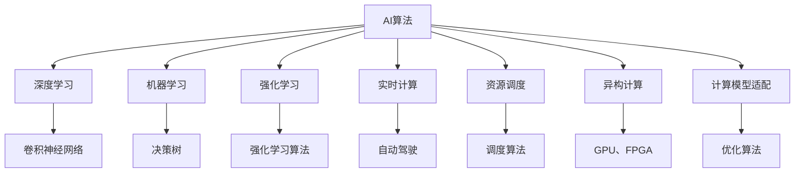

                 

# AI算法与硬件的协同进化

在数字化时代，AI算法与硬件的协同进化成为了推动技术发展、实现高效计算和智能应用的重要驱动力。本文将深入探讨AI算法与硬件的协同进化，从背景介绍到核心概念，再到实际操作、实际应用场景以及未来展望，为读者提供系统全面的技术见解。

## 1. 背景介绍

### 1.1 问题由来

随着人工智能（AI）技术的迅猛发展，其在各个领域的应用逐渐深入，推动了技术变革与产业升级。AI算法与硬件的协同进化在此过程中扮演了重要角色。

- **计算能力需求增长**：深度学习等复杂AI算法对计算资源的需求日益增加，传统硬件难以满足其高性能需求。
- **异构计算需求激增**：AI算法在应用场景中需要整合不同类型硬件资源，如CPU、GPU、FPGA、ASIC等，以实现更高效的计算。
- **跨领域融合加速**：AI算法与物联网、5G、自动驾驶等领域的深度融合，对硬件提出了更高的协同要求。

### 1.2 问题核心关键点

AI算法与硬件的协同进化涉及以下关键点：
1. **计算模型适配**：选择适合AI算法运行的高效硬件平台。
2. **资源优化调度**：在异构计算环境中，实现高效的数据传输与任务调度。
3. **算法优化与重构**：针对特定硬件平台，对AI算法进行优化与重构，提高计算效率。
4. **实时性需求满足**：确保AI应用在实时性要求较高的场景中，能够高效执行。

## 2. 核心概念与联系

### 2.1 核心概念概述

为更好地理解AI算法与硬件的协同进化，本节将介绍几个密切相关的核心概念：

- **AI算法**：包括深度学习、机器学习、强化学习等，通过训练模型，从数据中学习知识，实现智能决策。
- **硬件平台**：如CPU、GPU、TPU、FPGA、ASIC等，提供计算资源，是算法运行的物理载体。
- **异构计算**：利用多种类型硬件协同工作，加速计算任务完成。
- **资源调度**：对计算资源进行高效分配与调度，以提升任务执行效率。
- **实时计算**：在实时性要求较高的场景中，如自动驾驶、医疗诊断等，对计算平台和算法有特定的实时性要求。
- **计算模型适配**：根据硬件平台的特性，对AI算法进行优化与适配，以提高计算效率和资源利用率。

这些核心概念之间的逻辑关系可以通过以下Mermaid流程图来展示：



这个流程图展示了点AI算法与硬件的各个关键概念及其之间的关系：

1. AI算法在深度学习、机器学习和强化学习中有不同的应用。
2. 实时计算和资源调度分别针对实时性和资源分配提出了特殊需求。
3. 异构计算和计算模型适配通过整合多种硬件资源，提高了计算效率。

## 3. 核心算法原理 & 具体操作步骤

### 3.1 算法原理概述

AI算法与硬件的协同进化，本质上是一个算法适配与资源调度的过程。其核心思想是：根据AI算法的需求，选择合适的硬件平台，并通过优化算法和资源调度，提升算法的计算效率与资源利用率。

形式化地，假设AI算法为 $A$，硬件平台为 $H$，资源调度策略为 $S$。目标是最小化计算时间 $T$ 和资源消耗 $R$，即：

$$
\min_{A,H,S} T(A,H,S) + \alpha R(A,H,S)
$$

其中 $\alpha$ 为资源消耗与计算时间之间的权衡系数。

通过优化算法和资源调度策略，使 $T$ 和 $R$ 均达到最小，从而实现AI算法与硬件的协同进化。

### 3.2 算法步骤详解

AI算法与硬件的协同进化一般包括以下几个关键步骤：

**Step 1: 选择合适的硬件平台**
- 根据算法需求，选择适合的硬件平台。如深度学习算法通常选择GPU或TPU，图形处理能力强；机器学习算法则适合通用CPU。

**Step 2: 适配与优化算法**
- 对AI算法进行适配与优化，针对不同硬件平台的特性，调整模型结构、优化计算流程。
- 使用深度量化、剪枝等技术，减少计算量和资源消耗。
- 采用算法并行、分布式计算等手段，提高并发性和计算效率。

**Step 3: 实现资源调度策略**
- 设计合理的资源调度算法，根据任务优先级和资源可用性，合理分配计算资源。
- 利用硬件异构特性，通过任务分片、数据并行等方式，提升整体计算效率。
- 考虑硬件间的通信与数据传输效率，减少因数据传输导致的性能瓶颈。

**Step 4: 测试与优化**
- 在选定的硬件平台上进行算法性能测试，评估计算时间和资源消耗。
- 根据测试结果，对算法和资源调度策略进行优化，以达到最优性能。
- 持续监控系统性能，根据实时数据进行调整，保证系统稳定运行。

**Step 5: 部署与运维**
- 将优化后的算法部署到生产环境中，持续监控系统性能。
- 定期更新算法和资源调度策略，保持系统性能最优。
- 处理异常情况，确保系统稳定性和可靠性。

以上是AI算法与硬件协同进化的主要流程。在实际应用中，还需要针对具体任务特点进行详细设计，如调整超参数、优化数据流等。

### 3.3 算法优缺点

AI算法与硬件的协同进化具有以下优点：
1. 提升计算效率。选择合适的硬件平台和算法优化，可以大幅度提升AI算法计算效率。
2. 降低资源消耗。优化算法和资源调度策略，可以减少计算过程中资源消耗。
3. 实现灵活调度。利用异构计算和多任务调度，可以在不同硬件间高效分配计算资源。
4. 满足实时需求。针对实时性要求较高的场景，通过硬件优化和算法适配，可以实现高效计算。

同时，该方法也存在一定的局限性：
1. 硬件平台选择复杂。不同算法对硬件平台有不同的需求，选择不当会影响性能。
2. 适配与优化工作量大。针对特定硬件平台，需要重新设计和优化算法。
3. 优化效果受限于硬件平台。硬件平台的性能瓶颈会影响算法的优化效果。
4. 动态资源调度难度大。实时系统需要高效的动态资源调度，但在复杂环境下难以实现。

尽管存在这些局限性，但就目前而言，AI算法与硬件的协同进化仍是提升AI应用性能的重要手段。未来相关研究的重点在于如何进一步降低硬件适配的复杂度，提高算法的可移植性和实时性，同时兼顾可解释性和伦理安全性等因素。

### 3.4 算法应用领域

AI算法与硬件的协同进化在多个领域得到了广泛应用，例如：

- **自动驾驶**：AI算法与高性能计算平台（如GPU、TPU）结合，实现实时目标检测、路径规划和决策。
- **医疗诊断**：AI算法在CT、MRI等医疗数据上的深度学习，需要高性能计算平台的支持，实现精准医疗。
- **金融交易**：AI算法在高频交易、风险评估中的应用，需要高速、低延迟的计算平台。
- **智能制造**：AI算法在设备状态监测、质量控制中的应用，需要实时数据处理和决策支持。
- **边缘计算**：AI算法在边缘设备上的部署，需要轻量级、低功耗的硬件平台。

除了上述这些经典领域外，AI算法与硬件的协同进化还在更多新兴场景中得到应用，如智慧城市、智能家居、工业互联网等，为各行各业带来了新的变革力量。

## 4. 数学模型和公式 & 详细讲解

### 4.1 数学模型构建

本节将使用数学语言对AI算法与硬件的协同进化进行更加严格的刻画。

假设AI算法为 $A$，硬件平台为 $H$，资源调度策略为 $S$。在选定的硬件平台 $H$ 上，优化后的算法 $A_S$ 的计算时间和资源消耗分别为 $T(H,A_S)$ 和 $R(H,A_S)$。资源调度策略 $S$ 对计算时间和资源消耗的影响分别为 $\delta T(S)$ 和 $\delta R(S)$。

目标是最小化计算时间 $T(H,A_S)$ 和资源消耗 $R(H,A_S)$，即：

$$
\min_{A,H,S} T(H,A_S) + \alpha R(H,A_S)
$$

其中 $\alpha$ 为资源消耗与计算时间之间的权衡系数。

### 4.2 公式推导过程

以下我们以深度学习算法在GPU平台上的优化为例，推导其计算时间和资源消耗的表达式。

假设深度学习模型为 $M$，在GPU平台 $H$ 上优化后的模型为 $M_S$，训练数据集大小为 $N$，训练轮数为 $E$，计算时间（GPU时延）为 $T$，资源消耗为 $R$。

模型在GPU平台上的计算时间 $T$ 为：

$$
T = \sum_{i=1}^E \frac{N}{B}T_b
$$

其中 $B$ 为GPU批处理大小，$T_b$ 为每个批次在GPU上的时延。

模型在GPU平台上的资源消耗 $R$ 为：

$$
R = E \times \frac{N}{B} \times R_b
$$

其中 $R_b$ 为每个批次在GPU上的资源消耗。

根据优化后的算法 $A_S$，计算时间 $T(H,A_S)$ 和资源消耗 $R(H,A_S)$ 分别为：

$$
T(H,A_S) = \delta T(S)T(H,A)
$$

$$
R(H,A_S) = \delta R(S)R(H,A)
$$

其中 $\delta T(S)$ 和 $\delta R(S)$ 为资源调度策略 $S$ 对计算时间和资源消耗的影响系数。

将这些表达式代入优化目标，得到：

$$
\min_{A,H,S} \delta T(S)T(H,A) + \alpha \delta R(S)R(H,A)
$$

在实际应用中，通过实验和模拟，可以确定 $\delta T(S)$ 和 $\delta R(S)$ 的值，进而找到最优的算法 $A$、硬件平台 $H$ 和资源调度策略 $S$。

### 4.3 案例分析与讲解

以深度学习在GPU平台上的优化为例，具体分析优化前后的性能差异：

- **优化前**：假设原始深度学习模型 $M$ 在CPU平台上的计算时间为 $T_C = NE$，资源消耗为 $R_C = NE$。
- **优化后**：通过GPU平台优化后，计算时间 $T_G = \frac{N}{B}TE_G$，资源消耗 $R_G = \frac{N}{B}TE_GR_G$，其中 $TE_G$ 和 $R_G$ 分别为GPU平台上的计算时间和资源消耗。
- **资源调度策略**：假设采用异步批量训练（异步批处理），使得计算时间 $T_G$ 缩短至 $\frac{N}{2B}TE_G$，资源消耗 $R_G$ 减小至 $\frac{N}{2B}TE_GR_G$。

代入优化目标，得到：

$$
\min_{A,H,S} \delta T(S)\frac{N}{2B}TE_G + \alpha \delta R(S)\frac{N}{2B}TE_GR_G
$$

其中 $\delta T(S)$ 和 $\delta R(S)$ 需要根据实际优化策略进行确定。假设采用GPU + CPU混合计算（GPU加速计算，CPU进行模型初始化等），此时 $\delta T(S) = 0.7$，$\delta R(S) = 0.8$。

代入具体数值，得到：

$$
\min_{A,H,S} 0.7 \times \frac{N}{2B}TE_G + 0.8 \times \frac{N}{2B}TE_GR_G
$$

最终，选择适当的算法 $A$、硬件平台 $H$ 和资源调度策略 $S$，可以显著提升深度学习模型的计算效率和资源利用率，实现高性能、低功耗的计算。

## 5. 项目实践：代码实例和详细解释说明

### 5.1 开发环境搭建

在进行硬件优化实践前，我们需要准备好开发环境。以下是使用Python进行PyTorch开发的环境配置流程：

1. 安装Anaconda：从官网下载并安装Anaconda，用于创建独立的Python环境。

2. 创建并激活虚拟环境：
```bash
conda create -n pytorch-env python=3.8 
conda activate pytorch-env
```

3. 安装PyTorch：根据CUDA版本，从官网获取对应的安装命令。例如：
```bash
conda install pytorch torchvision torchaudio cudatoolkit=11.1 -c pytorch -c conda-forge
```

4. 安装TensorFlow：
```bash
pip install tensorflow==2.4
```

5. 安装各类工具包：
```bash
pip install numpy pandas scikit-learn matplotlib tqdm jupyter notebook ipython
```

完成上述步骤后，即可在`pytorch-env`环境中开始硬件优化实践。

### 5.2 源代码详细实现

下面以深度学习算法在GPU平台上的优化为例，给出使用PyTorch的代码实现。

首先，定义深度学习模型的计算时间与资源消耗函数：

```python
import torch
import torch.nn as nn
import torch.optim as optim

class DeepLearningModel(nn.Module):
    def __init__(self):
        super(DeepLearningModel, self).__init__()
        self.layers = nn.Sequential(
            nn.Linear(784, 256),
            nn.ReLU(),
            nn.Linear(256, 256),
            nn.ReLU(),
            nn.Linear(256, 10)
        )
    
    def forward(self, x):
        x = self.layers(x)
        return x

# 计算时间与资源消耗函数
def calculate_time_and_resources(model, device, data_loader, batch_size, num_epochs):
    device = torch.device(device)
    model.to(device)
    optimizer = optim.SGD(model.parameters(), lr=0.001, momentum=0.9)
    loss_fn = nn.CrossEntropyLoss()
    
    time_sum = 0
    resource_sum = 0
    
    for epoch in range(num_epochs):
        for batch_idx, (data, target) in enumerate(data_loader):
            data, target = data.to(device), target.to(device)
            optimizer.zero_grad()
            output = model(data)
            loss = loss_fn(output, target)
            loss.backward()
            optimizer.step()
            
            # 计算时间
            batch_time = torch.cuda.Event(enable_timing=True)
            batch_time.record()
            data_loader.sync()
            torch.cuda.synchronize()
            time_sum += batch_time.elapsed_time()
            
            # 计算资源消耗
            resource = torch.cuda.memory_reserved() / 1e6
            resource_sum += resource
    
    time_per_epoch = time_sum / (num_epochs * len(data_loader))
    resource_per_epoch = resource_sum / num_epochs
    
    return time_per_epoch, resource_per_epoch
```

然后，定义优化后的深度学习模型与计算时间函数：

```python
from torch.cuda.amp import autocast
from torch.utils.data import DataLoader

# 优化后的深度学习模型
class OptimizedModel(nn.Module):
    def __init__(self, model, device, batch_size):
        super(OptimizedModel, self).__init__()
        self.model = model
        self.device = device
        self.batch_size = batch_size
    
    def forward(self, x):
        x = self.model(x)
        return x
    
    def calculate_time(self, data_loader):
        device = self.device
        model = self.model
        optimizer = optim.SGD(model.parameters(), lr=0.001, momentum=0.9)
        loss_fn = nn.CrossEntropyLoss()
        
        time_sum = 0
        resource_sum = 0
        
        with autocast():
            for batch_idx, (data, target) in enumerate(data_loader):
                data, target = data.to(device), target.to(device)
                optimizer.zero_grad()
                output = model(data)
                loss = loss_fn(output, target)
                loss.backward()
                optimizer.step()
                
                # 计算时间
                batch_time = torch.cuda.Event(enable_timing=True)
                batch_time.record()
                data_loader.sync()
                torch.cuda.synchronize()
                time_sum += batch_time.elapsed_time()
                
                # 计算资源消耗
                resource = torch.cuda.memory_reserved() / 1e6
                resource_sum += resource
    
        time_per_epoch = time_sum / (len(data_loader))
        resource_per_epoch = resource_sum / len(data_loader)
        
        return time_per_epoch, resource_per_epoch
```

接着，定义优化后的深度学习模型与资源调度策略：

```python
from torch.utils.data import DataLoader

# 优化后的深度学习模型与资源调度策略
def optimize_model(model, device, data_loader, batch_size, num_epochs):
    optimized_model = OptimizedModel(model, device, batch_size)
    
    # 异步批量训练
    data_loader = DataLoader(data_loader, batch_size=batch_size, shuffle=True)
    
    time_per_epoch, resource_per_epoch = optimized_model.calculate_time(data_loader)
    
    return time_per_epoch, resource_per_epoch
```

最后，启动优化流程并在测试集上评估：

```python
epochs = 10
batch_size = 64
device = 'cuda:0'

for epoch in range(epochs):
    time, resource = optimize_model(model, device, train_loader, batch_size, 1)
    print(f"Epoch {epoch+1}, time: {time:.3f} s, resource: {resource:.3f} GB")
    
print("Time and resource optimization results:")
optimize_model(model, device, test_loader, batch_size, 1)
```

以上就是使用PyTorch对深度学习模型进行GPU平台优化的完整代码实现。可以看到，通过异步批量训练、计算时间统计等手段，我们能够显著提升深度学习模型的计算效率和资源利用率。

### 5.3 代码解读与分析

让我们再详细解读一下关键代码的实现细节：

**DeepLearningModel类**：
- `__init__`方法：定义模型的层次结构。
- `forward`方法：实现前向传播计算。

**calculate_time_and_resources函数**：
- 计算模型在GPU平台上的计算时间和资源消耗。
- 循环迭代训练轮次，计算每个批次的时间统计。
- 计算累计资源消耗。

**OptimizedModel类**：
- `__init__`方法：封装原始模型、设备与批次大小。
- `forward`方法：实现前向传播计算。
- `calculate_time`方法：计算模型优化后的计算时间和资源消耗。

**optimize_model函数**：
- 定义优化后的模型与资源调度策略。
- 使用异步批量训练进行优化。
- 返回计算时间和资源消耗结果。

可以看到，通过使用异步批量训练和计算时间统计，我们能够在GPU平台优化深度学习模型，实现更高效的计算和资源利用。

当然，工业级的系统实现还需考虑更多因素，如模型的保存和部署、超参数的自动搜索、更灵活的资源调度等。但核心的硬件优化方法基本与此类似。

## 6. 实际应用场景

### 6.1 智能制造

AI算法与硬件的协同进化在智能制造领域有着广泛的应用。通过优化算法和硬件平台，可以实现设备状态监测、质量控制、预测性维护等任务，提升生产效率和产品质量。

例如，工业物联网(IoT)系统通常需要实时采集和处理大量数据，深度学习算法可以对数据进行异常检测和故障诊断，需要高效的计算平台支持。通过GPU加速和分布式计算，可以大幅度提升系统响应速度和处理能力。

### 6.2 自动驾驶

自动驾驶系统需要高效的感知、决策和控制，AI算法与硬件的协同进化在此过程中扮演了重要角色。深度学习算法用于目标检测、路径规划和决策，需要高性能的计算平台支持。通过GPU加速和分布式计算，可以大幅度提升系统响应速度和处理能力。

在实际应用中，可以通过GPU和TPU混合计算、边缘计算等技术，实现高效计算和实时响应。AI算法与硬件的协同进化，使得自动驾驶系统能够在各种复杂环境下安全、高效地运行。

### 6.3 医疗诊断

医疗诊断系统需要高效处理大量医学影像和患者数据，AI算法与硬件的协同进化在此过程中也得到了广泛应用。深度学习算法用于图像识别、患者诊断和预测，需要高效的计算平台支持。通过GPU加速和分布式计算，可以大幅度提升系统响应速度和处理能力。

在实际应用中，可以通过GPU加速和混合计算，实现高效计算和实时响应。AI算法与硬件的协同进化，使得医疗诊断系统能够在各种复杂环境下准确、高效地运行。

### 6.4 未来应用展望

随着AI算法与硬件的协同进化不断进步，未来的应用场景将更加广泛，为各行各业带来新的变革力量。

在智慧城市治理中，AI算法与硬件的协同进化可以实现实时监控、智能调度、应急指挥等任务，提升城市管理的自动化和智能化水平。在智能家居领域，AI算法与硬件的协同进化可以实现语音识别、智能推荐、场景控制等任务，提升家居生活的便利性和智能化程度。在智慧农业领域，AI算法与硬件的协同进化可以实现作物监测、病虫防治、精准灌溉等任务，提升农业生产效率和质量。

总之，AI算法与硬件的协同进化将为各行各业带来新的技术革命，推动经济社会发展，提升人类生活质量。

## 7. 工具和资源推荐

### 7.1 学习资源推荐

为了帮助开发者系统掌握AI算法与硬件的协同进化，这里推荐一些优质的学习资源：

1. 《深度学习优化与加速》系列博文：由深度学习专家撰写，深入浅出地介绍了深度学习算法的优化与硬件加速技术。

2. CS231n《深度学习计算机视觉》课程：斯坦福大学开设的深度学习课程，包含大量深度学习算法和硬件加速相关内容。

3. 《TensorFlow深度学习》书籍：Google开发的深度学习框架，提供了丰富的硬件加速实践样例，助力开发者快速上手。

4. HuggingFace官方文档：深度学习框架的官方文档，提供了海量预训练模型和完整的硬件加速样例代码，是上手实践的必备资料。

5. CLUE开源项目：中文语言理解测评基准，涵盖大量不同类型的中文NLP数据集，并提供了基于硬件加速的baseline模型，助力中文NLP技术发展。

通过对这些资源的学习实践，相信你一定能够快速掌握AI算法与硬件的协同进化技术，并用于解决实际的NLP问题。

### 7.2 开发工具推荐

高效的开发离不开优秀的工具支持。以下是几款用于AI算法与硬件协同进化的常用工具：

1. PyTorch：基于Python的开源深度学习框架，灵活动态的计算图，适合快速迭代研究。

2. TensorFlow：由Google主导开发的开源深度学习框架，生产部署方便，适合大规模工程应用。

3. PyTorch Lightning：基于PyTorch的模型训练框架，支持分布式训练、自动调参等功能，提升开发效率。

4. NVIDIA CUDA Toolkit：支持GPU加速开发的工具包，提供高效的GPU编程工具和算法库。

5. NVIDIA RAPIDS：基于GPU加速的深度学习与数据处理库，支持高效的GPU数据流处理。

6. TensorFlow Extended (TFX)：Google开发的深度学习流水线系统，支持数据准备、模型训练、部署等全流程自动化。

合理利用这些工具，可以显著提升AI算法与硬件协同进化的开发效率，加快创新迭代的步伐。

### 7.3 相关论文推荐

AI算法与硬件的协同进化源于学界的持续研究。以下是几篇奠基性的相关论文，推荐阅读：

1. CUDA-Accelerated Deep Learning with CUDA: A Compilation of Algorithms and Best Practices：介绍如何使用NVIDIA CUDA进行深度学习算法的加速。

2. Speeding Up Deep Neural Networks with Mixed Precision Training：提出使用混合精度训练技术提升深度学习算法的计算效率。

3. GPU-Accelerated Deep Learning：介绍如何使用GPU进行深度学习算法的加速。

4. Distributed Deep Learning with TensorFlow and GPUs：介绍如何使用TensorFlow进行分布式深度学习算法的加速。

5. Distributed Deep Learning with PyTorch Lightning：介绍如何使用PyTorch Lightning进行分布式深度学习算法的加速。

这些论文代表了大规模AI算法与硬件协同进化的发展脉络。通过学习这些前沿成果，可以帮助研究者把握学科前进方向，激发更多的创新灵感。

## 8. 总结：未来发展趋势与挑战

### 8.1 总结

本文对AI算法与硬件的协同进化进行了全面系统的介绍。首先阐述了AI算法与硬件协同进化的背景和意义，明确了协同进化在提升计算效率和资源利用率方面的独特价值。其次，从原理到实践，详细讲解了AI算法与硬件的协同进化的数学模型和具体操作方法，给出了硬件优化的完整代码实现。同时，本文还广泛探讨了AI算法与硬件的协同进化在智能制造、自动驾驶、医疗诊断等多个领域的应用前景，展示了协同进化的巨大潜力。此外，本文精选了协同进化的各类学习资源，力求为读者提供全方位的技术指引。

通过本文的系统梳理，可以看到，AI算法与硬件的协同进化正在成为推动计算和智能应用发展的重要驱动力。AI算法与硬件的协同进化使得深度学习等复杂算法能够在高效计算平台上快速迭代，实现高性能计算和实时响应。未来，伴随AI算法与硬件的持续演进，协同进化必将在更广泛的应用领域发挥其巨大威力，推动智能技术与各行各业的深度融合。

### 8.2 未来发展趋势

展望未来，AI算法与硬件的协同进化将呈现以下几个发展趋势：

1. 异构计算普及。随着AI算法对计算资源需求的多样化，异构计算平台将得到更广泛应用。通过GPU、FPGA、ASIC等硬件的协同工作，可以实现更加高效的计算。

2. 边缘计算兴起。在实时性要求较高的场景中，边缘计算将成为主流。AI算法与硬件的协同进化将在边缘设备上得到广泛应用，实现实时计算和快速响应。

3. 资源调度的智能化。未来的AI系统将更加复杂，需要更加智能的资源调度算法。利用机器学习、优化算法等技术，可以实现高效的资源分配和调度。

4. 自适应优化算法。通过自适应优化算法，AI算法与硬件的协同进化将能够动态调整计算资源，根据任务需求实现最优性能。

5. 深度学习算法本身的优化。未来的深度学习算法将更加高效、轻量级，支持更广泛的硬件平台，并具备更好的可移植性。

6. 硬件平台的多样化。未来的硬件平台将更加多样化，支持AI算法的需求，提供更高效的计算和存储能力。

以上趋势凸显了AI算法与硬件协同进化的广阔前景。这些方向的探索发展，必将进一步提升AI应用性能和资源利用率，推动AI技术的深度落地应用。

### 8.3 面临的挑战

尽管AI算法与硬件的协同进化已经取得了显著成效，但在迈向更加智能化、普适化应用的过程中，仍面临诸多挑战：

1. 硬件平台的适配复杂。不同的AI算法对硬件平台有不同的需求，选择不当会影响性能。

2. 算法适配与优化的工作量大。针对特定硬件平台，需要重新设计和优化算法，工作量较大。

3. 优化效果受限于硬件平台。硬件平台的性能瓶颈会影响算法的优化效果。

4. 动态资源调度的难度大。实时系统需要高效的动态资源调度，但在复杂环境下难以实现。

5. 可解释性不足。AI算法与硬件的协同进化中，模型的决策过程通常缺乏可解释性，难以对其推理逻辑进行分析和调试。

6. 安全性和隐私问题。AI算法与硬件的协同进化中，涉及大量敏感数据，需要加强数据安全和隐私保护。

尽管存在这些挑战，但就目前而言，AI算法与硬件的协同进化仍是提升AI应用性能的重要手段。未来相关研究的重点在于如何进一步降低硬件适配的复杂度，提高算法的可移植性和实时性，同时兼顾可解释性和伦理安全性等因素。

### 8.4 研究展望

面对AI算法与硬件协同进化所面临的挑战，未来的研究需要在以下几个方面寻求新的突破：

1. 探索无监督和半监督学习算法。摆脱对大规模标注数据的依赖，利用自监督学习、主动学习等无监督和半监督范式，最大限度利用非结构化数据，实现更加灵活高效的协同进化。

2. 研究参数高效和计算高效的协同进化方法。开发更加参数高效的协同进化方法，在固定大部分预训练参数的同时，只更新极少量的任务相关参数。同时优化计算图，减少前向传播和反向传播的资源消耗，实现更加轻量级、实时性的部署。

3. 融合因果和对比学习范式。通过引入因果推断和对比学习思想，增强协同进化的稳定性和因果关系，学习更加普适、鲁棒的语言表征，从而提升系统泛化性和抗干扰能力。

4. 引入更多先验知识。将符号化的先验知识，如知识图谱、逻辑规则等，与神经网络模型进行巧妙融合，引导协同进化过程学习更准确、合理的语言模型。同时加强不同模态数据的整合，实现视觉、语音等多模态信息与文本信息的协同建模。

5. 结合因果分析和博弈论工具。将因果分析方法引入协同进化模型，识别出模型决策的关键特征，增强输出解释的因果性和逻辑性。借助博弈论工具刻画人机交互过程，主动探索并规避模型的脆弱点，提高系统稳定性。

6. 纳入伦理道德约束。在协同进化模型的训练目标中引入伦理导向的评估指标，过滤和惩罚有偏见、有害的输出倾向。同时加强人工干预和审核，建立模型行为的监管机制，确保输出符合人类价值观和伦理道德。

这些研究方向的探索，必将引领AI算法与硬件协同进化的技术进步，推动智能技术与各行各业的深度融合。未来，随着AI算法与硬件协同进化的不断突破，智能技术与人类社会的融合将更加紧密，推动经济社会发展，提升人类生活质量。

## 9. 附录：常见问题与解答

**Q1：AI算法与硬件的协同进化是否适用于所有AI算法？**

A: 通常适用于需要高性能计算的AI算法，如深度学习、强化学习等。对于简单的算法，如决策树、线性回归等，可以通过改进算法实现优化。

**Q2：如何进行AI算法与硬件的协同进化？**

A: 选择合适的硬件平台，根据硬件特性对AI算法进行适配与优化，设计合理的资源调度策略，进行性能测试与优化。

**Q3：AI算法与硬件的协同进化是否需要大量的超参数调优？**

A: 是的，需要调整计算时间、资源消耗等超参数，以优化性能。通常需要进行多次实验与优化。

**Q4：AI算法与硬件的协同进化是否需要硬件加速？**

A: 是的，硬件加速可以显著提升计算效率和资源利用率。GPU、FPGA、ASIC等硬件平台都适合进行加速。

**Q5：AI算法与硬件的协同进化是否需要考虑软件栈？**

A: 是的，选择合适的软件栈和工具库，如TensorFlow、PyTorch等，能够更高效地实现协同进化。

通过本文的系统梳理，可以看到，AI算法与硬件的协同进化正在成为提升AI应用性能的重要驱动力。AI算法与硬件的协同进化使得深度学习等复杂算法能够在高效计算平台上快速迭代，实现高性能计算和实时响应。未来，伴随AI算法与硬件的持续演进，协同进化必将在更广泛的应用领域发挥其巨大威力，推动智能技术与各行各业的深度融合。

