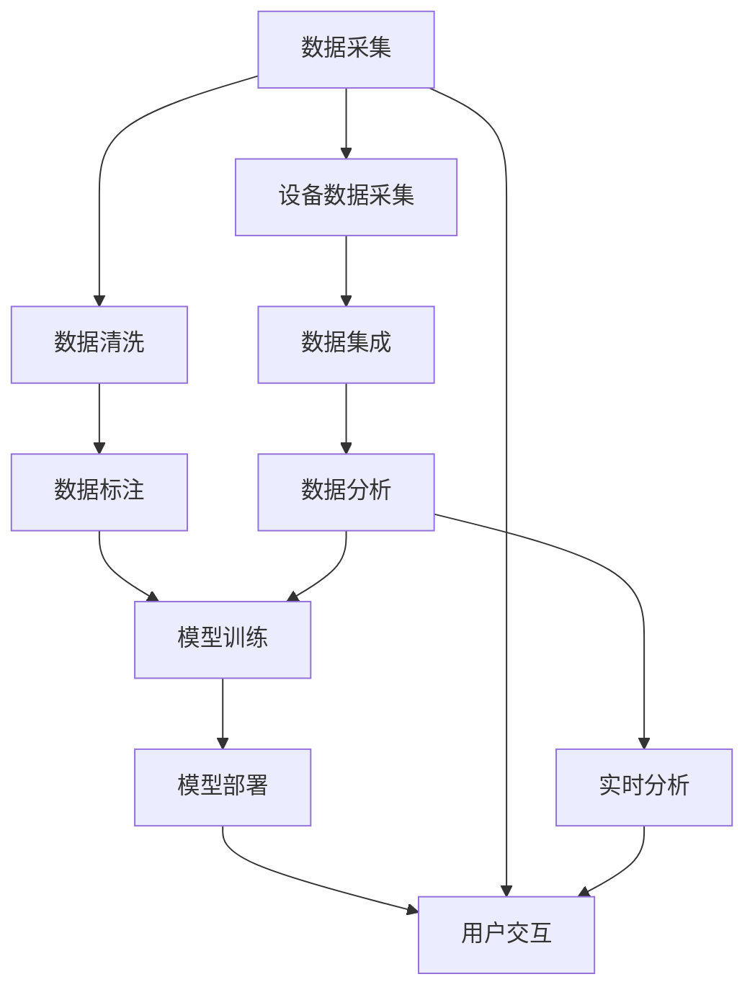

                 

## 1. 背景介绍

在当今信息时代，科技正以前所未有的速度改变着人类社会的面貌，其中医疗行业无疑是这一变革中最受瞩目的领域之一。人类计算，作为一种利用计算机处理海量数据以辅助人类决策的方式，正被广泛应用于医疗行业，从疾病诊断到药物研发，从患者护理到健康管理，无不闪耀着技术的智慧。

### 1.1 问题由来

传统医疗行业受限于有限的医疗资源和不断增长的患者需求，面对海量的病例数据和复杂的诊断问题，常常显得力不从心。人工智能（AI）的出现，尤其是深度学习技术的发展，为医疗行业的智能化转型提供了可能。利用AI进行数据处理和模型训练，可以显著提高诊断的准确性和效率，减轻医务人员的负担，提升医疗服务的可及性。

### 1.2 问题核心关键点

AI驱动的医疗创新主要围绕以下几个核心关键点展开：
- **数据驱动**：AI的核心在于大数据的利用，医疗行业拥有海量的病例数据和健康记录，这些数据为AI模型提供了丰富的训练材料。
- **模型训练**：通过深度学习模型对医疗数据进行处理，可以揭示出潜在的疾病模式和关联关系，从而辅助医生进行诊断和治疗决策。
- **用户友好**：AI技术需要易于使用，确保患者和医护人员能够方便地获取和使用其提供的服务和信息。
- **合规性和隐私保护**：医疗数据涉及个人隐私，AI系统必须遵守相关法规，保护患者信息的安全和隐私。
- **持续学习和适应性**：医疗数据和疾病模式是动态变化的，AI系统需要具备持续学习和适应的能力，以适应新的情况和挑战。

### 1.3 问题研究意义

AI在医疗行业的应用，不仅能够提升诊疗的精准性和效率，还能降低医疗成本，提升患者满意度。在实践中，AI驱动的医疗创新已经在疾病诊断、个性化治疗、药物研发等方面展示了其巨大潜力。然而，AI在医疗领域的应用尚处于初级阶段，其潜力和局限性仍需深入探索。

## 2. 核心概念与联系

### 2.1 核心概念概述

在探讨AI在医疗行业的未来展望之前，我们需要先了解一些核心概念：

- **人工智能（AI）**：利用计算机模拟人类智能行为的科学和技术，涵盖机器学习、自然语言处理、计算机视觉等技术。
- **深度学习（DL）**：一种基于神经网络的学习方法，通过多层次的特征提取和数据转化，实现复杂模式识别和预测。
- **人类计算（Human Computing）**：利用计算机处理和分析大量人类数据，辅助人类进行决策和处理任务。
- **医疗大数据（Healthcare Big Data）**：医疗机构在提供医疗服务过程中产生的大量数据，包括电子病历、影像数据、基因信息等。
- **医疗机器学习（Healthcare Machine Learning）**：利用机器学习技术对医疗数据进行处理和分析，辅助医疗决策。
- **可穿戴设备（Wearable Devices）**：如智能手表、健康监测器等，能够实时采集和传输健康数据。
- **医疗人工智能（Healthcare AI）**：具体应用于医疗领域的AI技术，如医学影像分析、病历分析、智能诊断等。

这些概念共同构成了AI在医疗行业应用的基础，通过综合运用这些技术，可以构建出更加高效、智能、精准的医疗服务体系。

### 2.2 核心概念原理和架构的 Mermaid 流程图



这张图展示了AI在医疗行业数据处理和应用的主要流程：从数据采集到模型训练，再到模型部署和用户交互，最后通过可穿戴设备实时采集数据，形成闭环。

## 3. 核心算法原理 & 具体操作步骤

### 3.1 算法原理概述

AI在医疗行业的应用主要基于机器学习和深度学习算法。以深度学习为例，其核心在于构建神经网络模型，通过多层非线性变换，对输入数据进行特征提取和模式识别，最终输出预测结果。在医疗领域，深度学习模型常用于图像识别、自然语言处理、时间序列分析等任务。

### 3.2 算法步骤详解

AI在医疗行业的应用步骤通常包括以下几个环节：

1. **数据收集和预处理**：从电子病历、影像数据、基因数据、可穿戴设备等渠道收集数据，并进行清洗和标注，确保数据的质量和一致性。
2. **模型训练**：使用收集到的数据训练深度学习模型，调整模型参数以最小化预测误差。
3. **模型评估和优化**：通过验证集或测试集对模型进行评估，根据性能指标（如准确率、召回率、F1值等）调整模型参数和训练策略。
4. **模型部署**：将训练好的模型部署到生产环境中，进行实时推理和预测。
5. **持续学习和适应性**：定期更新模型，以适应新的数据和变化的条件，确保模型的长期有效性。

### 3.3 算法优缺点

AI在医疗行业的优势在于：
- **提升诊断准确性**：深度学习模型能够从海量数据中提取复杂模式，辅助医生进行精准诊断。
- **提高效率**：AI能够自动化处理大量的病历和影像数据，显著提高医疗服务的效率。
- **个性化治疗**：通过分析患者的基因信息和健康数据，AI可以制定个性化的治疗方案。

同时，也存在以下局限性：
- **数据质量和数量**：医疗数据的质量和数量直接影响模型的性能，低质量的标注数据可能导致过拟合。
- **隐私和安全**：医疗数据涉及个人隐私，不当的数据处理和泄露可能引发法律和伦理问题。
- **解释性和可解释性**：AI模型的决策过程往往缺乏可解释性，难以被医生和患者理解和接受。
- **技术门槛**：深度学习等技术需要较高的专业知识和计算资源，难以快速普及和应用。

### 3.4 算法应用领域

AI在医疗行业的应用领域非常广泛，涵盖以下方面：

- **医学影像分析**：利用深度学习对医学影像（如X光片、CT、MRI等）进行分析和识别，辅助医生进行疾病诊断。
- **病历分析**：通过自然语言处理技术对电子病历进行分析，提取关键信息和知识。
- **基因组学和生物信息学**：利用深度学习分析基因序列和蛋白质结构，揭示疾病的遗传机制。
- **个性化医疗**：根据患者的基因信息和健康数据，制定个性化的治疗和健康管理方案。
- **药物研发**：通过深度学习预测药物效果和副作用，加速新药研发过程。
- **健康监测**：利用可穿戴设备和传感器，实时监测患者的健康状况和活动数据。
- **智能诊断**：结合医生的经验，通过AI辅助诊断系统提供诊断建议。

## 4. 数学模型和公式 & 详细讲解 & 举例说明

### 4.1 数学模型构建

以医学影像分析为例，假设有 $N$ 幅医学影像，每幅影像的大小为 $W\times H$ 像素，$D$ 表示每个像素的灰度值。设 $I^{(n)}$ 为第 $n$ 幅影像的像素矩阵，则数学模型可以表示为：

$$
I^{(n)} = f(I^{(n-1)}, \ldots, I^{(1)}, W, H, D) + \epsilon
$$

其中 $f$ 为深度学习模型，$\epsilon$ 为随机噪声。模型的目标是通过 $I^{(n)}$ 预测 $I^{(n+1)}$ 的影像变化，以辅助诊断。

### 4.2 公式推导过程

以卷积神经网络（CNN）为例，CNN 在医学影像分析中的应用可以分为两个主要部分：特征提取和分类。在特征提取阶段，CNN 通过卷积层、池化层等操作，从影像数据中提取高层次的特征表示：

$$
\mathbf{X} = \mathcal{C}(\mathbf{I}) = \{h_1, h_2, \ldots, h_M\}
$$

其中 $\mathbf{I}$ 为原始影像数据，$h_m$ 为第 $m$ 层卷积层的输出，$M$ 为卷积层的数量。分类阶段，通过全连接层将特征表示映射到类别标签：

$$
y = g(\mathbf{X}) = \sigma(\mathbf{W}^T\mathbf{X} + \mathbf{b})
$$

其中 $g$ 为激活函数，$\mathbf{W}$ 和 $\mathbf{b}$ 分别为全连接层的权重和偏置。

### 4.3 案例分析与讲解

以医学影像分析为例，假设有一组肺部CT影像数据，每幅影像大小为 $512\times 512$ 像素，使用 AlexNet 模型进行特征提取和分类。首先，将影像数据归一化到 $[0, 1]$ 范围内：

$$
I^{(n)}_{norm} = \frac{I^{(n)} - I^{(n)}_{min}}{I^{(n)}_{max} - I^{(n)}_{min}}
$$

然后，将归一化后的影像数据输入卷积层，进行特征提取：

$$
h_1 = \mathcal{C}_1(I^{(n)}_{norm})
$$

其中 $\mathcal{C}_1$ 为第一层卷积层，通过滑动窗口和滤波器操作提取特征。经过多个卷积层和池化层后，得到高层次的特征表示：

$$
\mathbf{X} = \mathcal{C}(\mathbf{I}) = \{h_1, h_2, \ldots, h_M\}
$$

最后，通过全连接层对特征表示进行分类：

$$
y = g(\mathbf{X}) = \sigma(\mathbf{W}^T\mathbf{X} + \mathbf{b})
$$

在训练过程中，通过反向传播算法更新模型参数，以最小化预测误差。在测试阶段，将新的影像数据输入模型进行预测，输出诊断结果。

## 5. 项目实践：代码实例和详细解释说明

### 5.1 开发环境搭建

在开始实际项目之前，首先需要准备好开发环境。以下是使用 Python 进行 PyTorch 开发的流程：

1. 安装 Python 和 PyTorch：
   ```
   pip install torch torchvision torchaudio
   ```

2. 准备数据集：
   ```python
   from torch.utils.data import Dataset, DataLoader
   from torchvision import transforms

   class MedicalImageDataset(Dataset):
       def __init__(self, image_dir, transform=None):
           self.image_dir = image_dir
           transforms.Compose([transforms.ToTensor()])

       def __len__(self):
           return len(os.listdir(self.image_dir))

       def __getitem__(self, idx):
           img_path = os.path.join(self.image_dir, f"image{idx}.png")
           img = Image.open(img_path).convert('RGB')
           if self.transform:
               img = self.transform(img)
           return img
   ```

3. 定义模型：
   ```python
   import torch.nn as nn
   import torch.nn.functional as F

   class MedicalImageModel(nn.Module):
       def __init__(self):
           super(MedicalImageModel, self).__init__()
           self.conv1 = nn.Conv2d(3, 16, kernel_size=3, stride=1, padding=1)
           self.pool = nn.MaxPool2d(kernel_size=2, stride=2)
           self.fc1 = nn.Linear(16*16*16, 128)
           self.fc2 = nn.Linear(128, 2)

       def forward(self, x):
           x = self.pool(F.relu(self.conv1(x)))
           x = x.view(-1, 16*16*16)
           x = F.relu(self.fc1(x))
           x = self.fc2(x)
           return F.softmax(x, dim=1)
   ```

4. 训练模型：
   ```python
   import torch.optim as optim
   from torch.optim.lr_scheduler import StepLR

   model = MedicalImageModel()
   criterion = nn.CrossEntropyLoss()
   optimizer = optim.Adam(model.parameters(), lr=0.001)
   scheduler = StepLR(optimizer, step_size=7, gamma=0.1)

   for epoch in range(num_epochs):
       model.train()
       for i, data in enumerate(train_loader, 0):
           inputs, labels = data
           optimizer.zero_grad()
           outputs = model(inputs)
           loss = criterion(outputs, labels)
           loss.backward()
           optimizer.step()
           if (i+1) % 100 == 0:
               print('Epoch [%d/%d], Loss: %.4f' % (epoch+1, num_epochs, loss.item()))
   ```

### 5.2 源代码详细实现

以下是使用 PyTorch 对医学影像进行分类的完整代码实现：

```python
from torch.utils.data import Dataset, DataLoader
from torchvision import transforms
import torch.nn as nn
import torch.nn.functional as F
import torch.optim as optim
from torch.optim.lr_scheduler import StepLR
import os
import numpy as np
from PIL import Image

class MedicalImageDataset(Dataset):
    def __init__(self, image_dir, transform=None):
        self.image_dir = image_dir
        transforms.Compose([transforms.ToTensor()])

    def __len__(self):
        return len(os.listdir(self.image_dir))

    def __getitem__(self, idx):
        img_path = os.path.join(self.image_dir, f"image{idx}.png")
        img = Image.open(img_path).convert('RGB')
        if self.transform:
            img = self.transform(img)
        return img

class MedicalImageModel(nn.Module):
    def __init__(self):
        super(MedicalImageModel, self).__init__()
        self.conv1 = nn.Conv2d(3, 16, kernel_size=3, stride=1, padding=1)
        self.pool = nn.MaxPool2d(kernel_size=2, stride=2)
        self.fc1 = nn.Linear(16*16*16, 128)
        self.fc2 = nn.Linear(128, 2)

    def forward(self, x):
        x = self.pool(F.relu(self.conv1(x)))
        x = x.view(-1, 16*16*16)
        x = F.relu(self.fc1(x))
        x = self.fc2(x)
        return F.softmax(x, dim=1)

def train_model(model, criterion, optimizer, train_loader, num_epochs):
    scheduler = StepLR(optimizer, step_size=7, gamma=0.1)

    for epoch in range(num_epochs):
        model.train()
        for i, data in enumerate(train_loader, 0):
            inputs, labels = data
            optimizer.zero_grad()
            outputs = model(inputs)
            loss = criterion(outputs, labels)
            loss.backward()
            optimizer.step()
            if (i+1) % 100 == 0:
                print('Epoch [%d/%d], Loss: %.4f' % (epoch+1, num_epochs, loss.item()))

def evaluate_model(model, test_loader):
    model.eval()
    correct = 0
    total = 0
    with torch.no_grad():
        for data in test_loader:
            images, labels = data
            outputs = model(images)
            _, predicted = torch.max(outputs, 1)
            total += labels.size(0)
            correct += (predicted == labels).sum().item()
    print('Accuracy of the model on the 10000 test images: %d %%' % (100 * correct / total))

# 加载数据集
train_data = MedicalImageDataset(train_dir)
test_data = MedicalImageDataset(test_dir)
train_loader = DataLoader(train_data, batch_size=32, shuffle=True)
test_loader = DataLoader(test_data, batch_size=32, shuffle=False)

# 定义模型、损失函数和优化器
model = MedicalImageModel()
criterion = nn.CrossEntropyLoss()
optimizer = optim.Adam(model.parameters(), lr=0.001)

# 训练模型
train_model(model, criterion, optimizer, train_loader, num_epochs=10)

# 评估模型
evaluate_model(model, test_loader)
```

### 5.3 代码解读与分析

在上述代码中，我们定义了两个核心类：`MedicalImageDataset` 和 `MedicalImageModel`。`MedicalImageDataset` 类用于加载和预处理医学影像数据，`MedicalImageModel` 类则定义了卷积神经网络模型，用于影像分类。

在训练过程中，我们使用 Adam 优化器来调整模型参数，并使用交叉熵损失函数来计算预测误差。在测试阶段，通过计算准确率来评估模型的性能。

## 6. 实际应用场景

### 6.1 智能影像诊断

智能影像诊断是AI在医疗行业最重要的应用之一。通过深度学习模型对医学影像进行分析和识别，可以显著提高诊断的准确性和效率。以肺结节识别为例，深度学习模型可以自动检测和标注影像中的结节位置和大小，辅助医生进行精准诊断。

### 6.2 病历自动分类

病历自动分类是医院信息化的重要组成部分。通过自然语言处理技术，可以将电子病历中的文本数据进行分类和标注，快速生成结构化的病历信息，提升医疗服务的效率和质量。

### 6.3 个性化治疗方案

基于患者的历史数据和基因信息，AI可以制定个性化的治疗方案，提高治疗的针对性和效果。例如，针对癌症患者的个性化治疗方案，可以根据基因突变情况，推荐最合适的药物和剂量。

### 6.4 健康监测和预警

通过可穿戴设备和传感器，实时监测患者的健康状况和活动数据，AI可以预测潜在健康风险，并及时发出预警。例如，心电图监测、血糖监测等，能够帮助患者及早发现健康问题，进行干预和治疗。

## 7. 工具和资源推荐

### 7.1 学习资源推荐

为了帮助开发者系统掌握AI在医疗行业的应用，以下是一些优质的学习资源：

1. Coursera《机器学习》课程：由斯坦福大学提供，深入介绍机器学习和深度学习的基础知识和算法。
2. DeepLearning.AI的《深度学习专项课程》：涵盖深度学习、自然语言处理、计算机视觉等多个领域。
3. arXiv上的相关论文：深入阅读最新的AI研究成果，了解前沿技术和趋势。
4. Hugging Face官方文档：提供丰富的深度学习模型和工具，是学习和应用深度学习的重要资源。
5. TensorFlow官方文档：提供深度学习框架的详细教程和示例，适合学习者和开发者使用。

### 7.2 开发工具推荐

在AI开发过程中，选择合适的工具可以提高开发效率和模型性能。以下是一些常用的开发工具：

1. PyTorch：基于 Python 的深度学习框架，提供灵活的动态计算图和丰富的模型库。
2. TensorFlow：由 Google 主导开发的深度学习框架，支持分布式计算和生产部署。
3. Keras：高层次的深度学习框架，易于使用且功能强大。
4. Jupyter Notebook：交互式开发环境，适合数据处理和模型训练。
5. Visual Studio Code：强大的代码编辑器，支持 Python 和 PyTorch 开发。

### 7.3 相关论文推荐

以下是几篇对 AI 在医疗行业应用有重要影响的论文：

1. "ChestX-ray8: Towards Automated Lung Nodule Detection in CT Scans"：介绍使用卷积神经网络对医学影像进行自动诊断的技术。
2. "A Review of Automated Patient Data Extraction from Radiology Reports"：综述自然语言处理技术在医学影像报告自动化提取中的应用。
3. "Deep Learning for Personalized Treatment Recommendations in Medicine"：介绍使用深度学习进行个性化治疗方案推荐的研究。
4. "Healthy: A Health Monitoring System Using Wearable Sensors"：介绍使用可穿戴设备进行健康监测的系统设计和实现。
5. "AI for Clinical Decision Making: A Review"：综述 AI 在临床决策支持中的应用，包括疾病诊断和患者管理。

## 8. 总结：未来发展趋势与挑战

### 8.1 研究成果总结

AI在医疗行业的应用已经取得了显著进展，特别是在医学影像分析、病历自动分类和个性化治疗等方面。然而，AI在医疗行业的应用仍然面临数据质量、模型可解释性、隐私保护等方面的挑战。

### 8.2 未来发展趋势

未来，AI在医疗行业的应用将呈现以下几个趋势：

1. **深度学习和大数据的应用将进一步深化**：随着深度学习模型的不断优化和数据量的不断积累，AI在医疗诊断和治疗中的应用将更加广泛和精准。
2. **个性化医疗将成为主流**：基于患者基因信息和健康数据，AI将能够制定更加精准和个性化的治疗方案，提升治疗效果。
3. **实时监测和预警系统将普及**：通过可穿戴设备和传感器，AI能够实时监测患者的健康状况，及时发现潜在风险，进行预警和干预。
4. **跨领域融合将加速**：AI将与物联网、云计算、大数据等技术深度融合，形成更全面、智能的医疗生态系统。

### 8.3 面临的挑战

AI在医疗行业的应用仍面临诸多挑战：

1. **数据质量和隐私保护**：医疗数据涉及个人隐私，不当的数据处理和泄露可能引发法律和伦理问题。
2. **模型可解释性**：AI模型的决策过程往往缺乏可解释性，难以被医生和患者理解和接受。
3. **技术门槛高**：深度学习等技术需要较高的专业知识和计算资源，难以快速普及和应用。
4. **跨领域协同难**：医疗数据和信息涉及多个领域和部门，跨领域的协同和数据共享面临诸多挑战。

### 8.4 研究展望

未来，需要从以下几个方面进行深入研究：

1. **提升数据质量**：改进数据采集和标注流程，提升数据的准确性和可靠性。
2. **增强模型可解释性**：开发可解释性更强、易于理解的模型，提升AI系统的可信度和接受度。
3. **推进跨领域协同**：建立跨领域的数据共享和协作机制，促进AI技术在医疗行业的广泛应用。
4. **关注伦理和法律问题**：加强AI系统的伦理和法律研究，确保技术应用的安全性和合法性。

## 9. 附录：常见问题与解答

**Q1：AI在医疗行业的应用前景如何？**

A: AI在医疗行业的应用前景非常广阔。通过深度学习和自然语言处理技术，AI可以在医学影像分析、病历自动分类、个性化治疗、健康监测等多个方面发挥重要作用，提升医疗服务的精准性和效率。

**Q2：AI在医疗行业应用中面临哪些挑战？**

A: AI在医疗行业应用中面临的主要挑战包括数据质量和隐私保护、模型可解释性、技术门槛高以及跨领域协同难等。这些问题需要通过技术创新和政策支持来解决。

**Q3：如何提升AI在医疗行业中的数据质量？**

A: 提升AI在医疗行业中的数据质量需要改进数据采集和标注流程，确保数据的准确性和可靠性。同时，可以通过数据清洗、去重等技术手段提升数据质量。

**Q4：如何增强AI模型的可解释性？**

A: 增强AI模型的可解释性需要开发可解释性更强、易于理解的模型。例如，使用可视化技术展示模型的决策过程，提供基于规则的解释机制等。

**Q5：如何推进跨领域协同？**

A: 推进跨领域协同需要建立跨领域的数据共享和协作机制。例如，通过构建统一的数据标准和接口，促进不同领域和部门之间的数据共享和协作。

---

作者：禅与计算机程序设计艺术 / Zen and the Art of Computer Programming

