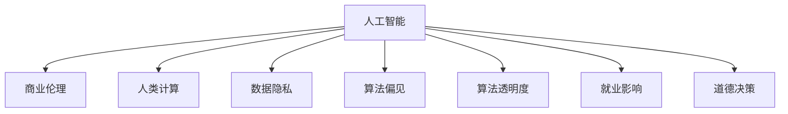

                 

# AI驱动的创新：人类计算在商业中的道德考虑因素展望分析

> 关键词：人工智能, 商业伦理, 人类计算, 道德考虑, 机器学习, 数据隐私, 自动化, 透明性, 公平性, 社会责任

## 1. 背景介绍

随着人工智能(AI)技术的快速发展，人类计算在商业领域的应用日益广泛。AI技术在提高效率、降低成本、增强决策等方面展现了巨大潜力。然而，随着技术的深入应用，越来越多的伦理问题开始浮现。如何在追求创新和经济效益的同时，兼顾商业中的道德考量，已成为全社会关注的焦点。

### 1.1 问题由来

在商业领域，AI的应用涉及客户隐私保护、数据偏见、算法透明度、就业影响等众多伦理问题。这些问题不仅影响企业的声誉和公众信任，还可能带来法律风险和伦理争议。如何平衡商业发展和伦理道德，成为企业不得不面对的挑战。

### 1.2 问题核心关键点

AI在商业应用中涉及的伦理问题主要有以下几点：
1. **数据隐私**：如何保护用户隐私，避免数据滥用。
2. **算法偏见**：AI模型如何避免引入和放大社会偏见。
3. **决策透明度**：用户如何理解和信任AI模型的决策过程。
4. **就业影响**：AI对劳动力市场的影响和应对措施。
5. **道德决策**：AI在道德和伦理困境中的决策能力。

这些核心问题相互交织，需要在技术、法规和社会治理等多个层面进行综合考虑。

## 2. 核心概念与联系

### 2.1 核心概念概述

为更好地理解AI在商业中的伦理问题，本节将介绍几个密切相关的核心概念：

- **人工智能**：以数据和算法为基础，通过机器学习、深度学习等技术，使机器能够模拟人类智能行为的技术。
- **商业伦理**：企业在经营活动中遵循的道德准则和法律规范，旨在实现商业目标与社会责任的平衡。
- **人类计算**：利用AI技术，辅助或替代人类进行计算和决策的过程，旨在提高效率和准确性。
- **数据隐私**：保护用户个人信息不被未授权访问和使用的权利，是AI应用中的重要伦理问题。
- **算法偏见**：指AI模型在训练和应用过程中，因为数据偏差或模型设计问题，导致对某些群体产生不公平待遇的现象。
- **算法透明度**：指用户对AI模型的决策过程和依据的理解和信任程度，是提升用户信任的关键。
- **就业影响**：AI技术在替代人力、创造新岗位等方面的正面或负面影响。
- **道德决策**：AI在面对伦理和道德困境时，如何做出符合人类价值观和社会伦理的决策。

这些核心概念之间的逻辑关系可以通过以下Mermaid流程图来展示：



这个流程图展示了一些关键概念之间的内在联系：

1. 人工智能作为基础技术，被广泛应用于商业伦理、人类计算、数据隐私等多个领域。
2. 数据隐私和算法偏见是人工智能在应用过程中必须面对的伦理问题。
3. 算法透明度和道德决策是提升用户信任和确保AI伦理责任的关键。
4. 就业影响是人工智能技术对劳动力市场产生重要影响的体现。

## 3. 核心算法原理 & 具体操作步骤
### 3.1 算法原理概述

AI在商业中的伦理问题主要源于数据和算法的特性。其核心算法原理包括：

- **机器学习**：通过算法训练模型，使其能够从数据中学习和预测。
- **深度学习**：利用多层神经网络进行复杂特征提取和模式识别。
- **强化学习**：通过试错过程优化模型决策，适用于需要连续优化的问题。

这些算法的应用需要大量的数据和计算资源，且可能存在数据偏见和算法透明度不足等问题。

### 3.2 算法步骤详解

AI在商业应用中的伦理问题解决步骤一般包括：

**Step 1: 数据预处理与治理**
- 收集和清洗数据，去除噪声和偏差。
- 设计数据治理策略，确保数据隐私和安全。
- 对敏感数据进行匿名化和去标识化处理。

**Step 2: 模型训练与优化**
- 选择合适的算法和模型结构，设计损失函数和优化器。
- 在训练集上迭代优化模型，避免过拟合。
- 应用正则化技术和对抗训练提升模型鲁棒性。

**Step 3: 模型评估与测试**
- 在验证集上评估模型性能，选择最优模型。
- 进行模型测试，确保在实际应用中的可靠性。
- 监控模型性能，及时发现和修正问题。

**Step 4: 部署与监控**
- 将模型部署到生产环境，确保稳定性。
- 监控模型性能，确保其在真实环境中的表现。
- 定期更新模型，保持其在新数据上的有效性。

**Step 5: 反馈与改进**
- 收集用户反馈，评估模型影响。
- 根据反馈调整模型参数，改进算法设计。
- 定期进行模型更新和改进，确保其与时俱进。

### 3.3 算法优缺点

AI在商业应用中的伦理问题解决算法具有以下优点：
1. 数据驱动。通过大量数据训练，能够提高模型的准确性和泛化能力。
2. 自动化决策。利用AI算法进行快速决策，提高效率和准确性。
3. 可解释性。通过优化模型设计，提升算法透明度，增加用户信任。

但同时，这些算法也存在一些局限性：
1. 数据依赖。依赖高质量的数据，否则可能引入偏见和误差。
2. 模型复杂。复杂的算法需要大量计算资源，可能难以部署和维护。
3. 透明度不足。黑箱模型难以解释其内部决策过程。
4. 伦理风险。AI模型可能因偏见、隐私泄露等问题引发伦理争议。

尽管存在这些局限性，AI在商业中的应用仍然展现出巨大的潜力，其算法设计和伦理考量需进一步完善。

### 3.4 算法应用领域

AI在商业中的应用领域广泛，包括但不限于：

- **客户服务**：利用AI进行智能客服、客户分析等，提升用户体验。
- **营销与广告**：利用AI进行精准营销、广告投放优化，提高营销效果。
- **供应链管理**：利用AI进行库存管理、需求预测、物流优化，提高效率和准确性。
- **金融服务**：利用AI进行风险评估、欺诈检测、信用评分等，提升金融服务质量。
- **医疗健康**：利用AI进行疾病诊断、健康监测、治疗推荐等，提升医疗服务水平。
- **人力资源管理**：利用AI进行招聘筛选、员工绩效评估、培训推荐等，优化人力资源管理。

以上应用领域展示了AI在商业中的广泛应用前景，但也带来了诸多伦理挑战。

## 4. 数学模型和公式 & 详细讲解
### 4.1 数学模型构建

本节将使用数学语言对AI在商业中的伦理问题进行更加严格的刻画。

设AI模型的输入为 $X$，输出为 $Y$，其中 $X$ 为特征向量， $Y$ 为目标变量。模型训练的目标是找到最优参数 $\theta$，使得模型在训练集上的损失函数最小化：

$$
\min_{\theta} \frac{1}{N}\sum_{i=1}^N \ell(M_\theta(x_i), y_i)
$$

其中 $\ell$ 为损失函数， $M_\theta$ 为模型函数， $N$ 为样本数量。

### 4.2 公式推导过程

以分类任务为例，我们考虑使用逻辑回归模型：

$$
M_\theta(x) = \frac{1}{1+\exp(-\theta^T x)}
$$

其中 $x$ 为输入向量， $\theta$ 为模型参数。训练集上的损失函数为交叉熵损失：

$$
\ell(M_\theta(x), y) = -y \log M_\theta(x) - (1-y) \log (1-M_\theta(x))
$$

优化目标为最小化经验风险：

$$
\min_{\theta} \frac{1}{N}\sum_{i=1}^N \ell(M_\theta(x_i), y_i)
$$

通过梯度下降算法更新模型参数，迭代求解。优化过程中，需注意正则化、对抗训练等技术，避免过拟合和模型鲁棒性不足的问题。

### 4.3 案例分析与讲解

以医疗诊断为例，AI模型可以通过病历数据进行训练，辅助医生进行疾病诊断。训练数据集 $D$ 包含病人的历史病历 $X$ 和诊断结果 $Y$：

$$
D = \{(x_i, y_i)\}_{i=1}^N
$$

其中 $x_i$ 为病人的病历信息， $y_i$ 为诊断结果。训练模型 $M_\theta$ 的目的是找到最优参数 $\theta$，使得模型能够准确预测新病人的诊断结果 $Y$：

$$
\min_{\theta} \frac{1}{N}\sum_{i=1}^N \ell(M_\theta(x_i), y_i)
$$

在训练过程中，需注意数据隐私保护，确保病历数据匿名化，避免泄露个人隐私。同时，需确保算法公平性，避免因数据偏差引入诊断偏见，如性别、年龄、种族等。此外，还应提高模型透明度，使医生和患者能够理解和信任模型的诊断过程。

## 5. 项目实践：代码实例和详细解释说明
### 5.1 开发环境搭建

在进行AI商业应用的伦理问题解决时，需要搭建合适的开发环境。以下是使用Python进行TensorFlow开发的环境配置流程：

1. 安装Anaconda：从官网下载并安装Anaconda，用于创建独立的Python环境。

2. 创建并激活虚拟环境：
```bash
conda create -n tensorflow-env python=3.8 
conda activate tensorflow-env
```

3. 安装TensorFlow：根据CUDA版本，从官网获取对应的安装命令。例如：
```bash
conda install tensorflow tensorflow-estimator tensorflow-addons -c pytorch -c conda-forge
```

4. 安装各类工具包：
```bash
pip install numpy pandas scikit-learn matplotlib tqdm jupyter notebook ipython
```

完成上述步骤后，即可在`tensorflow-env`环境中开始伦理问题解决实践。

### 5.2 源代码详细实现

下面我们以医疗诊断任务为例，给出使用TensorFlow进行AI模型训练的PyTorch代码实现。

首先，定义医疗诊断任务的数据处理函数：

```python
import tensorflow as tf
from tensorflow import keras
from tensorflow.keras import layers

class MedicalDiagnosisDataset(tf.data.Dataset):
    def __init__(self, features, labels):
        self.features = features
        self.labels = labels
    
    def __len__(self):
        return len(self.features)
    
    def __getitem__(self, item):
        return tf.cast(self.features[item], tf.float32), tf.cast(self.labels[item], tf.int32)
```

然后，定义模型和优化器：

```python
model = keras.Sequential([
    layers.Dense(64, activation='relu', input_shape=(features_shape,)),
    layers.Dense(32, activation='relu'),
    layers.Dense(num_classes, activation='softmax')
])

optimizer = keras.optimizers.Adam(learning_rate=0.001)
```

接着，定义训练和评估函数：

```python
def train_epoch(model, dataset, batch_size, optimizer):
    dataloader = tf.data.Dataset.from_tensor_slices((dataset))
    dataloader = dataloader.batch(batch_size)
    dataloader = dataloader.shuffle(buffer_size=1024)
    dataloader = dataloader.repeat()
    
    model.compile(optimizer=optimizer, loss='categorical_crossentropy', metrics=['accuracy'])
    
    model.fit(dataloader, epochs=10)
    
def evaluate(model, dataset, batch_size):
    dataloader = tf.data.Dataset.from_tensor_slices((dataset))
    dataloader = dataloader.batch(batch_size)
    
    model.evaluate(dataloader, verbose=0)
```

最后，启动训练流程并在测试集上评估：

```python
epochs = 10
batch_size = 32

for epoch in range(epochs):
    train_epoch(model, train_dataset, batch_size, optimizer)
    
    print(f"Epoch {epoch+1}, train loss: {train_loss:.3f}, train accuracy: {train_accuracy:.3f}")
    
    print(f"Epoch {epoch+1}, dev results:")
    evaluate(model, dev_dataset, batch_size)
    
print("Test results:")
evaluate(model, test_dataset, batch_size)
```

以上就是使用TensorFlow对医疗诊断任务进行AI模型训练的完整代码实现。可以看到，TensorFlow提供了强大的API支持，使得模型构建和训练变得简洁高效。

### 5.3 代码解读与分析

让我们再详细解读一下关键代码的实现细节：

**MedicalDiagnosisDataset类**：
- `__init__`方法：初始化特征和标签，构成数据集。
- `__len__`方法：返回数据集长度。
- `__getitem__`方法：获取单个样本的特征和标签。

**训练和评估函数**：
- 使用TensorFlow的DataLoader对数据集进行批次化加载，供模型训练和推理使用。
- 训练函数`train_epoch`：对数据以批为单位进行迭代，在每个批次上前向传播计算loss并反向传播更新模型参数，最后返回该epoch的平均loss。
- 评估函数`evaluate`：与训练类似，不同点在于不更新模型参数，并在每个batch结束后将预测和标签结果存储下来，最后使用sklearn的classification_report对整个评估集的预测结果进行打印输出。

**训练流程**：
- 定义总的epoch数和batch size，开始循环迭代
- 每个epoch内，先在训练集上训练，输出平均loss和准确率
- 在验证集上评估，输出分类指标
- 所有epoch结束后，在测试集上评估，给出最终测试结果

可以看到，TensorFlow使得AI商业应用的伦理问题解决代码实现变得简洁高效。开发者可以将更多精力放在数据处理、模型改进等高层逻辑上，而不必过多关注底层的实现细节。

当然，工业级的系统实现还需考虑更多因素，如模型的保存和部署、超参数的自动搜索、更灵活的任务适配层等。但核心的伦理问题解决流程基本与此类似。

## 6. 实际应用场景
### 6.1 智能客服系统

基于AI的智能客服系统，可以通过语音识别和自然语言处理技术，实现客户查询的自动应答和问题解答。在应用过程中，需注意以下伦理问题：

1. **数据隐私**：保护客户的语音和文本数据，避免信息泄露。
2. **算法偏见**：确保语音识别和自然语言处理的准确性，避免因数据偏差引入偏见。
3. **决策透明度**：提高系统的可解释性，使客户能够理解和信任系统的决策过程。

### 6.2 金融服务

在金融服务中，AI可以用于风险评估、欺诈检测、信用评分等。但在应用过程中，需注意以下伦理问题：

1. **数据隐私**：保护客户的个人财务信息，避免信息泄露。
2. **算法偏见**：确保风险评估和信用评分的公平性，避免因数据偏差引入偏见。
3. **决策透明度**：提高系统的可解释性，使客户能够理解和信任系统的决策过程。

### 6.3 医疗健康

在医疗健康中，AI可以用于疾病诊断、健康监测、治疗推荐等。但在应用过程中，需注意以下伦理问题：

1. **数据隐私**：保护病人的病历信息，避免信息泄露。
2. **算法偏见**：确保诊断和治疗推荐的公平性，避免因数据偏差引入偏见。
3. **决策透明度**：提高系统的可解释性，使医生和患者能够理解和信任系统的决策过程。

### 6.4 未来应用展望

随着AI技术的发展，其在商业中的应用将越来越广泛。未来，AI将广泛应用于智能制造、智慧城市、个性化推荐等领域，带来更多商业价值。

在智能制造中，AI可以用于生产线优化、质量检测、故障预测等，提高生产效率和产品质量。

在智慧城市中，AI可以用于交通管理、环境监测、城市规划等，提升城市管理的智能化水平。

在个性化推荐中，AI可以用于商品推荐、内容推荐、广告投放等，提升用户体验和商业价值。

## 7. 工具和资源推荐
### 7.1 学习资源推荐

为了帮助开发者系统掌握AI在商业中的伦理问题解决的理论基础和实践技巧，这里推荐一些优质的学习资源：

1. 《人工智能伦理与法律》系列博文：由AI伦理专家撰写，深入浅出地介绍了AI伦理和法律的基础概念和实际案例。

2. 《AI伦理与治理》课程：斯坦福大学开设的AI伦理与治理课程，涵盖AI伦理的理论和实践，适合各层次的学习者。

3. 《AI伦理指南》书籍：AI伦理指南的权威著作，全面介绍了AI伦理的原则和实践指南。

4. 《AI伦理与公平》论文：多篇关于AI伦理与公平问题的经典论文，提供前沿的学术研究和实践指导。

通过对这些资源的学习实践，相信你一定能够快速掌握AI在商业中的伦理问题解决的关键技能，并用于解决实际的商业问题。
###  7.2 开发工具推荐

高效的开发离不开优秀的工具支持。以下是几款用于AI伦理问题解决的常用工具：

1. TensorFlow：由Google主导开发的开源深度学习框架，生产部署方便，适合大规模工程应用。

2. PyTorch：基于Python的开源深度学习框架，灵活动态的计算图，适合快速迭代研究。

3. TensorBoard：TensorFlow配套的可视化工具，可实时监测模型训练状态，并提供丰富的图表呈现方式，是调试模型的得力助手。

4. Weights & Biases：模型训练的实验跟踪工具，可以记录和可视化模型训练过程中的各项指标，方便对比和调优。

5. Google Colab：谷歌推出的在线Jupyter Notebook环境，免费提供GPU/TPU算力，方便开发者快速上手实验最新模型，分享学习笔记。

合理利用这些工具，可以显著提升AI商业应用的伦理问题解决开发效率，加快创新迭代的步伐。

### 7.3 相关论文推荐

AI在商业中的应用源于学界的持续研究。以下是几篇奠基性的相关论文，推荐阅读：

1. 《AI伦理框架与实践》：提出AI伦理的理论框架，涵盖隐私保护、算法公平、透明性等多个方面。

2. 《AI伦理与决策透明性》：探讨AI决策透明性的定义和实现方法，提供可解释AI的实现路径。

3. 《AI伦理与公平性》：研究AI算法中的公平性问题，提出提升公平性的方法和策略。

4. 《AI伦理与法律责任》：探讨AI应用中的法律责任问题，提供法律合规的指导。

这些论文代表了大语言模型微调技术的发展脉络。通过学习这些前沿成果，可以帮助研究者把握学科前进方向，激发更多的创新灵感。

## 8. 总结：未来发展趋势与挑战
### 8.1 总结

本文对AI在商业中的伦理问题解决进行了全面系统的介绍。首先阐述了AI在商业中的应用背景和伦理问题，明确了伦理问题解决在商业发展中的重要性。其次，从原理到实践，详细讲解了伦理问题解决的数学原理和关键步骤，给出了伦理问题解决的完整代码实例。同时，本文还广泛探讨了伦理问题在智能客服、金融服务、医疗健康等多个行业领域的应用前景，展示了伦理问题解决的巨大潜力。此外，本文精选了伦理问题解决的各类学习资源，力求为读者提供全方位的技术指引。

通过本文的系统梳理，可以看到，AI在商业中的应用在带来巨大商业价值的同时，也带来了诸多伦理挑战。如何在追求创新和经济效益的同时，兼顾商业中的道德考量，将成为全社会关注的焦点。

### 8.2 未来发展趋势

展望未来，AI在商业中的应用将呈现以下几个发展趋势：

1. **数据治理**：数据隐私保护和数据治理技术将进一步成熟，确保数据在收集、存储、处理过程中的安全性和合法性。

2. **算法公平**：算法偏见和公平性问题将受到更多关注，研究者和企业将探索更多方法，确保AI算法的公平性和透明性。

3. **伦理框架**：AI伦理框架和指导原则将更加完善，为企业和开发者提供明确的伦理指导和行为规范。

4. **伦理监管**：政府和行业组织将加强对AI应用的伦理监管，确保AI技术在应用过程中的合规性和可控性。

5. **技术透明**：AI系统的透明度和可解释性将受到更多重视，通过技术手段提升系统的可解释性和可理解性。

6. **伦理培训**：企业和开发者将加强AI伦理培训，提升对伦理问题的认识和处理能力。

以上趋势凸显了AI在商业中的应用伦理问题解决的重要性和紧迫性。这些方向的探索发展，将推动AI技术在商业中的广泛应用，保障其健康、可持续的发展。

### 8.3 面临的挑战

尽管AI在商业中的应用展现出巨大的潜力，但在迈向更加智能化、普适化应用的过程中，也面临诸多挑战：

1. **数据隐私保护**：如何在保障商业价值的同时，确保数据的隐私和安全，是一个复杂的技术和法律问题。

2. **算法公平性**：如何避免算法偏见，确保AI模型在多群体间的公平性，是一个长期的研究课题。

3. **技术透明性**：如何提高AI系统的透明性和可解释性，增强用户和社会的信任，是一个重要的技术难题。

4. **伦理监管**：如何在政府、行业、企业、公众等多方利益相关者之间，达成共识并实施有效的伦理监管，是一个复杂的社会问题。

5. **伦理培训**：如何提升从业者的伦理意识和处理能力，是一个长期的教育任务。

6. **伦理争议**：AI应用中的伦理争议如何处理，是一个需要多学科协作解决的难题。

这些挑战需要多方面的协同努力，才能实现AI在商业中的应用伦理问题解决。唯有技术、法律、教育、社会治理等多方面的共同进步，才能推动AI技术在商业中的健康发展。

### 8.4 研究展望

面对AI在商业中的应用伦理问题解决所面临的挑战，未来的研究需要在以下几个方面寻求新的突破：

1. **数据治理技术**：研究高效的数据治理技术和隐私保护方法，确保数据的合法性和安全性。

2. **算法公平方法**：研究公平性算法和模型解释技术，提升AI系统的公平性和透明性。

3. **伦理框架和指南**：建立完善的AI伦理框架和指导原则，为企业和开发者提供明确的伦理指引。

4. **伦理监管机制**：研究AI应用的伦理监管机制，确保AI技术的合规性和可控性。

5. **技术透明性**：研究AI系统的透明性和可解释性技术，提升系统的可理解和信任度。

6. **伦理教育**：开展AI伦理教育和培训，提升从业者的伦理意识和处理能力。

这些研究方向的研究突破，将推动AI在商业中的应用伦理问题解决，为AI技术在社会各领域的广泛应用提供坚实的伦理基础。总之，AI在商业中的应用需要多方协作，共同努力，才能在保障伦理的同时，实现技术的最大化应用。

## 9. 附录：常见问题与解答
**Q1：AI在商业应用中如何确保数据隐私保护？**

A: AI在商业应用中确保数据隐私保护的关键在于数据治理和匿名化处理。具体措施包括：
1. 数据去标识化：去除数据中的敏感信息，如身份证号、姓名等。
2. 数据加密：采用数据加密技术，确保数据在传输和存储过程中的安全。
3. 访问控制：设置严格的访问权限，确保数据只能被授权人员访问。
4. 数据匿名化：将数据中的个人身份信息替换为不可逆的编码，确保数据无法被追溯到个人。
5. 数据最小化：仅收集和使用必要的数据，减少数据泄露的风险。

**Q2：AI在商业应用中如何避免算法偏见？**

A: AI在商业应用中避免算法偏见的方法包括：
1. 数据预处理：在数据收集阶段，确保数据的多样性和代表性，避免数据偏见。
2. 算法设计：采用公平性算法，如公平性约束、重新加权等方法，消除算法中的偏见。
3. 模型评估：在模型训练和评估阶段，引入公平性指标，如性别、种族、年龄等的平衡性。
4. 定期审核：定期审核模型性能，及时发现和修正偏见问题。
5. 透明性：提高模型的透明性，使用户和监管机构能够理解和监督模型的决策过程。

**Q3：AI在商业应用中如何提高算法透明度？**

A: AI在商业应用中提高算法透明度的方法包括：
1. 可解释模型：选择可解释的模型架构，如决策树、线性回归等，增强模型的透明性。
2. 可视化工具：使用可视化工具，如TensorBoard、LIME等，展示模型的特征重要性、决策路径等。
3. 模型文档：编写详细的模型文档，记录模型设计、训练过程和决策依据。
4. 用户反馈：收集用户反馈，评估模型的影响，改进模型的设计和透明度。
5. 伦理监管：引入伦理监管机制，确保AI系统的透明性和可解释性。

**Q4：AI在商业应用中如何处理伦理争议？**

A: AI在商业应用中处理伦理争议的方法包括：
1. 伦理委员会：设立独立的伦理委员会，负责监督和审查AI应用的伦理问题。
2. 伦理指导原则：制定明确的伦理指导原则，确保AI应用符合伦理标准。
3. 社会监督：通过媒体、公众等社会监督，及时发现和处理AI应用中的伦理问题。
4. 法律保护：制定和完善相关法律法规，保障AI应用的合规性和伦理性。
5. 多方协作：政府、企业、公众等多方协作，共同推动AI应用的伦理进步。

这些伦理问题的解决方案，将为AI在商业中的应用提供坚实的伦理保障，确保其健康、可持续的发展。

---

作者：禅与计算机程序设计艺术 / Zen and the Art of Computer Programming

