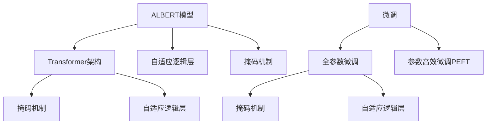

                 

# ALBERT原理与代码实例讲解

> 关键词：ALBERT,自适应逻辑BERT,神经网络,深度学习,自然语言处理(NLP),Transformer,预训练,微调

## 1. 背景介绍

### 1.1 问题由来

ALBERT（Adaptive Logistic BERT）是一种基于Transformer架构的深度学习模型，最初由Google在2019年的论文《ALBERT: A Layered And Sparse Pre-training Approach for Language Modeling》中提出。ALBERT与BERT的主要区别在于其设计初衷和结构改进，旨在更好地解决大型语言模型在训练和推理方面的效率问题。

ALBERT的创新之处在于：
- 引入了一个新的自适应逻辑层，能更好地应对长文本的逻辑推理。
- 使用了更高效的掩码机制，即对每个token采用独立且互不重叠的掩码，减少训练时的计算复杂度。
- 引入了一种新的模型参数分布方案，即让各层之间的参数更少分布不均匀，以减少冗余计算。

本文将对ALBERT原理进行详细介绍，并通过一个代码实例来展示如何使用ALBERT模型进行微调。

### 1.2 问题核心关键点

ALBERT模型关注的核心问题包括：
1. 如何提高语言模型的训练效率和推理速度？
2. 如何构建更高效的掩码机制和参数分布方案？
3. 如何在微调过程中避免过拟合？

这些问题的解决使得ALBERT在大规模文本处理和复杂语言理解任务上表现出色，成为当前NLP领域的先进模型之一。

## 2. 核心概念与联系

### 2.1 核心概念概述

为更好地理解ALBERT模型的工作原理，本文将介绍一些核心概念：

- **ALBERT模型**：基于Transformer架构的深度学习模型，通过引入自适应逻辑层和更高效的掩码机制，显著提升了模型训练和推理的效率。
- **Transformer模型**：一种基于自注意力机制的深度学习架构，用于解决自然语言处理任务，是ALBERT的基础结构。
- **掩码机制**：在自监督预训练任务中，采用掩码技术对输入序列进行部分掩盖，增加模型的泛化能力。
- **自适应逻辑层**：ALBERT引入的新型逻辑层，能更高效地处理长序列的逻辑推理和关系推断。
- **微调(Fine-tuning)**：在预训练模型的基础上，通过有监督的训练优化模型在特定任务上的性能。

这些概念之间的逻辑关系可以通过以下Mermaid流程图来展示：



这个流程图展示了ALBERT模型的核心概念及其关系：

1. ALBERT模型基于Transformer架构构建。
2. 引入自适应逻辑层和掩码机制，以提升模型效率。
3. 通过微调，进一步适配下游任务。

## 3. 核心算法原理 & 具体操作步骤
### 3.1 算法原理概述

ALBERT模型的核心思想是：通过引入自适应逻辑层和高效的掩码机制，在保持语言模型强大表达能力的同时，显著降低计算复杂度。ALBERT通过全参数微调和参数高效微调（PEFT）两种方式进行微调，以应对不同任务的需求。

ALBERT模型的自适应逻辑层允许模型灵活地处理文本中的复杂逻辑关系。这种逻辑层的设计，使得模型能够更好地适应自然语言的多样性和复杂性，特别是在处理长文本时表现优异。

掩码机制则通过随机掩盖部分文本信息，迫使模型从上下文中学习完整的单词或短语，从而提升模型的泛化能力。

在微调过程中，ALBERT通常只需要调整模型的顶层部分，如分类器或解码器，而固定大部分预训练参数。这样可以避免过拟合，同时充分利用预训练模型的知识。

### 3.2 算法步骤详解

ALBERT的微调步骤包括以下关键环节：

**Step 1: 准备预训练模型和数据集**
- 选择合适的预训练模型，如ALBERT-base或ALBERT-large。
- 准备下游任务的数据集，划分为训练集、验证集和测试集。

**Step 2: 添加任务适配层**
- 根据任务类型，在预训练模型的顶层设计合适的输出层和损失函数。
- 对于分类任务，通常在顶层添加线性分类器和交叉熵损失函数。
- 对于生成任务，通常使用语言模型的解码器输出概率分布，并以负对数似然为损失函数。

**Step 3: 设置微调超参数**
- 选择合适的优化算法及其参数，如AdamW、SGD等，设置学习率、批大小、迭代轮数等。
- 设置正则化技术及强度，包括权重衰减、Dropout、Early Stopping等。
- 确定冻结预训练参数的策略，如仅微调顶层，或全部参数都参与微调。

**Step 4: 执行梯度训练**
- 将训练集数据分批次输入模型，前向传播计算损失函数。
- 反向传播计算参数梯度，根据设定的优化算法和学习率更新模型参数。
- 周期性在验证集上评估模型性能，根据性能指标决定是否触发Early Stopping。
- 重复上述步骤直到满足预设的迭代轮数或Early Stopping条件。

**Step 5: 测试和部署**
- 在测试集上评估微调后模型，对比微调前后的精度提升。
- 使用微调后的模型对新样本进行推理预测，集成到实际的应用系统中。
- 持续收集新的数据，定期重新微调模型，以适应数据分布的变化。

### 3.3 算法优缺点

ALBERT模型具有以下优点：
1. 训练效率高。通过引入自适应逻辑层和高效的掩码机制，ALBERT显著降低了计算复杂度。
2. 推理速度快。与BERT相比，ALBERT在推理速度上有明显提升。
3. 泛化能力强。ALBERT的掩码机制和自适应逻辑层，使其能够更好地处理长文本和复杂关系。
4. 参数量适中。ALBERT的模型参数量适中，适合多种计算资源的设备。

同时，ALBERT也存在一些局限性：
1. 对标注数据依赖。微调效果仍然依赖于标注数据的质量和数量，对于标注数据较少的任务可能效果不佳。
2. 模型复杂度高。虽然计算复杂度降低，但模型本身的结构仍然复杂，训练和推理时仍然需要一定的计算资源。
3. 模型结构固定。ALBERT的设计主要针对特定任务，对于其他类型的任务可能需要进一步优化。

### 3.4 算法应用领域

ALBERT模型在NLP领域已经得到了广泛的应用，覆盖了几乎所有常见任务，例如：

- 文本分类：如情感分析、主题分类、意图识别等。通过微调使模型学习文本-标签映射。
- 命名实体识别：识别文本中的人名、地名、机构名等特定实体。通过微调使模型掌握实体边界和类型。
- 关系抽取：从文本中抽取实体之间的语义关系。通过微调使模型学习实体-关系三元组。
- 问答系统：对自然语言问题给出答案。将问题-答案对作为微调数据，训练模型学习匹配答案。
- 机器翻译：将源语言文本翻译成目标语言。通过微调使模型学习语言-语言映射。
- 文本摘要：将长文本压缩成简短摘要。将文章-摘要对作为微调数据，使模型学习抓取要点。
- 对话系统：使机器能够与人自然对话。将多轮对话历史作为上下文，微调模型进行回复生成。

除了上述这些经典任务外，ALBERT也被创新性地应用到更多场景中，如可控文本生成、常识推理、代码生成、数据增强等，为NLP技术带来了全新的突破。

## 4. 数学模型和公式 & 详细讲解  
### 4.1 数学模型构建

ALBERT模型的数学模型构建主要基于Transformer架构和自适应逻辑层的创新。本文将使用数学语言对ALBERT模型的构建过程进行更加严格的刻画。

记ALBERT模型为 $M_{\theta}:\mathcal{X} \rightarrow \mathcal{Y}$，其中 $\mathcal{X}$ 为输入空间，$\mathcal{Y}$ 为输出空间，$\theta \in \mathbb{R}^d$ 为模型参数。假设微调任务的训练集为 $D=\{(x_i,y_i)\}_{i=1}^N, x_i \in \mathcal{X}, y_i \in \mathcal{Y}$。

定义模型 $M_{\theta}$ 在输入 $x$ 上的输出为 $y=M_{\theta}(x)$，模型结构如下：

$$
y = M_{\theta}(x) = \text{CLS}(\text{TransformerEncoder}(\text{EncoderLayer}(x)))
$$

其中，$\text{CLS}$ 层将输入序列映射为最终输出，$\text{TransformerEncoder}$ 由多个 $\text{EncoderLayer}$ 层组成，每个 $\text{EncoderLayer}$ 层由自注意力子层、前馈神经网络子层和残差连接构成。

### 4.2 公式推导过程

以下我们以二分类任务为例，推导交叉熵损失函数及其梯度的计算公式。

假设模型 $M_{\theta}$ 在输入 $x$ 上的输出为 $\hat{y}=M_{\theta}(x) \in [0,1]$，表示样本属于正类的概率。真实标签 $y \in \{0,1\}$。则二分类交叉熵损失函数定义为：

$$
\ell(M_{\theta}(x),y) = -[y\log \hat{y} + (1-y)\log (1-\hat{y})]
$$

将其代入经验风险公式，得：

$$
\mathcal{L}(\theta) = -\frac{1}{N}\sum_{i=1}^N [y_i\log M_{\theta}(x_i)+(1-y_i)\log(1-M_{\theta}(x_i))]
$$

在实际应用中，我们通常使用基于梯度的优化算法（如SGD、Adam等）来近似求解上述最优化问题。设 $\eta$ 为学习率，$\lambda$ 为正则化系数，则参数的更新公式为：

$$
\theta \leftarrow \theta - \eta \nabla_{\theta}\mathcal{L}(\theta) - \eta\lambda\theta
$$

其中 $\nabla_{\theta}\mathcal{L}(\theta)$ 为损失函数对参数 $\theta$ 的梯度，可通过反向传播算法高效计算。

### 4.3 案例分析与讲解

为了更好地理解ALBERT模型的工作原理，我们以一个具体的微调任务为例：情感分析。

假设我们有一个情感分析数据集，包含电影评论和对应的情感标签。通过将评论和标签作为微调数据，我们可以在ALBERT模型的基础上进行情感分析任务的微调。

首先，准备数据集并进行预处理，包括分词、标签编码等。然后，选择ALBERT-base模型，并构建微调模型的顶层结构，即添加线性分类器和交叉熵损失函数。

接着，设置微调超参数，如学习率、批大小、迭代轮数等。在训练过程中，对数据集进行批处理和前向传播，计算损失函数并反向传播更新模型参数。

最后，在验证集上评估模型性能，并进行必要的调整，如Early Stopping等。在测试集上测试微调后的模型性能，并进行实际部署和应用。

## 5. 项目实践：代码实例和详细解释说明
### 5.1 开发环境搭建

在进行微调实践前，我们需要准备好开发环境。以下是使用Python进行PyTorch开发的环境配置流程：

1. 安装Anaconda：从官网下载并安装Anaconda，用于创建独立的Python环境。

2. 创建并激活虚拟环境：
```bash
conda create -n pytorch-env python=3.8 
conda activate pytorch-env
```

3. 安装PyTorch：根据CUDA版本，从官网获取对应的安装命令。例如：
```bash
conda install pytorch torchvision torchaudio cudatoolkit=11.1 -c pytorch -c conda-forge
```

4. 安装TensorFlow：
```bash
pip install tensorflow
```

5. 安装Transformers库：
```bash
pip install transformers
```

6. 安装各类工具包：
```bash
pip install numpy pandas scikit-learn matplotlib tqdm jupyter notebook ipython
```

完成上述步骤后，即可在`pytorch-env`环境中开始微调实践。

### 5.2 源代码详细实现

下面我们以情感分析任务为例，给出使用Transformers库对ALBERT模型进行微调的PyTorch代码实现。

首先，定义情感分析任务的数据处理函数：

```python
from transformers import ALBERTTokenizer, ALBERTForSequenceClassification
from torch.utils.data import Dataset
import torch

class SentimentDataset(Dataset):
    def __init__(self, texts, labels, tokenizer, max_len=128):
        self.texts = texts
        self.labels = labels
        self.tokenizer = tokenizer
        self.max_len = max_len
        
    def __len__(self):
        return len(self.texts)
    
    def __getitem__(self, item):
        text = self.texts[item]
        label = self.labels[item]
        
        encoding = self.tokenizer(text, return_tensors='pt', max_length=self.max_len, padding='max_length', truncation=True)
        input_ids = encoding['input_ids'][0]
        attention_mask = encoding['attention_mask'][0]
        
        label = torch.tensor(label, dtype=torch.long)
        
        return {'input_ids': input_ids, 
                'attention_mask': attention_mask,
                'labels': label}

# 创建dataset
tokenizer = ALBERTTokenizer.from_pretrained('albert-base-uncased')

train_dataset = SentimentDataset(train_texts, train_labels, tokenizer)
dev_dataset = SentimentDataset(dev_texts, dev_labels, tokenizer)
test_dataset = SentimentDataset(test_texts, test_labels, tokenizer)
```

然后，定义模型和优化器：

```python
from transformers import AdamW

model = ALBERTForSequenceClassification.from_pretrained('albert-base-uncased', num_labels=2)

optimizer = AdamW(model.parameters(), lr=2e-5)
```

接着，定义训练和评估函数：

```python
from torch.utils.data import DataLoader
from tqdm import tqdm
from sklearn.metrics import accuracy_score

device = torch.device('cuda') if torch.cuda.is_available() else torch.device('cpu')
model.to(device)

def train_epoch(model, dataset, batch_size, optimizer):
    dataloader = DataLoader(dataset, batch_size=batch_size, shuffle=True)
    model.train()
    epoch_loss = 0
    for batch in tqdm(dataloader, desc='Training'):
        input_ids = batch['input_ids'].to(device)
        attention_mask = batch['attention_mask'].to(device)
        labels = batch['labels'].to(device)
        model.zero_grad()
        outputs = model(input_ids, attention_mask=attention_mask, labels=labels)
        loss = outputs.loss
        epoch_loss += loss.item()
        loss.backward()
        optimizer.step()
    return epoch_loss / len(dataloader)

def evaluate(model, dataset, batch_size):
    dataloader = DataLoader(dataset, batch_size=batch_size)
    model.eval()
    preds, labels = [], []
    with torch.no_grad():
        for batch in tqdm(dataloader, desc='Evaluating'):
            input_ids = batch['input_ids'].to(device)
            attention_mask = batch['attention_mask'].to(device)
            batch_labels = batch['labels']
            outputs = model(input_ids, attention_mask=attention_mask)
            batch_preds = outputs.logits.argmax(dim=1).to('cpu').tolist()
            batch_labels = batch_labels.to('cpu').tolist()
            for pred, label in zip(batch_preds, batch_labels):
                preds.append(pred)
                labels.append(label)
                
    accuracy = accuracy_score(labels, preds)
    print(f"Accuracy: {accuracy:.3f}")
```

最后，启动训练流程并在测试集上评估：

```python
epochs = 5
batch_size = 16

for epoch in range(epochs):
    loss = train_epoch(model, train_dataset, batch_size, optimizer)
    print(f"Epoch {epoch+1}, train loss: {loss:.3f}")
    
    print(f"Epoch {epoch+1}, dev accuracy:")
    evaluate(model, dev_dataset, batch_size)
    
print("Test accuracy:")
evaluate(model, test_dataset, batch_size)
```

以上就是使用PyTorch对ALBERT进行情感分析任务微调的完整代码实现。可以看到，得益于Transformers库的强大封装，我们可以用相对简洁的代码完成ALBERT模型的加载和微调。

### 5.3 代码解读与分析

让我们再详细解读一下关键代码的实现细节：

**SentimentDataset类**：
- `__init__`方法：初始化文本、标签、分词器等关键组件。
- `__len__`方法：返回数据集的样本数量。
- `__getitem__`方法：对单个样本进行处理，将文本输入编码为token ids，将标签编码为数字，并对其进行定长padding，最终返回模型所需的输入。

**训练和评估函数**：
- 使用PyTorch的DataLoader对数据集进行批次化加载，供模型训练和推理使用。
- 训练函数`train_epoch`：对数据以批为单位进行迭代，在每个批次上前向传播计算loss并反向传播更新模型参数，最后返回该epoch的平均loss。
- 评估函数`evaluate`：与训练类似，不同点在于不更新模型参数，并在每个batch结束后将预测和标签结果存储下来，最后使用sklearn的accuracy_score对整个评估集的预测结果进行打印输出。

**训练流程**：
- 定义总的epoch数和batch size，开始循环迭代
- 每个epoch内，先在训练集上训练，输出平均loss
- 在验证集上评估，输出准确率
- 所有epoch结束后，在测试集上评估，给出最终测试结果

可以看到，PyTorch配合Transformers库使得ALBERT微调的代码实现变得简洁高效。开发者可以将更多精力放在数据处理、模型改进等高层逻辑上，而不必过多关注底层的实现细节。

当然，工业级的系统实现还需考虑更多因素，如模型的保存和部署、超参数的自动搜索、更灵活的任务适配层等。但核心的微调范式基本与此类似。

## 6. 实际应用场景
### 6.1 智能客服系统

基于ALBERT模型微调的对话技术，可以广泛应用于智能客服系统的构建。传统客服往往需要配备大量人力，高峰期响应缓慢，且一致性和专业性难以保证。而使用微调后的对话模型，可以7x24小时不间断服务，快速响应客户咨询，用自然流畅的语言解答各类常见问题。

在技术实现上，可以收集企业内部的历史客服对话记录，将问题和最佳答复构建成监督数据，在此基础上对预训练对话模型进行微调。微调后的对话模型能够自动理解用户意图，匹配最合适的答案模板进行回复。对于客户提出的新问题，还可以接入检索系统实时搜索相关内容，动态组织生成回答。如此构建的智能客服系统，能大幅提升客户咨询体验和问题解决效率。

### 6.2 金融舆情监测

金融机构需要实时监测市场舆论动向，以便及时应对负面信息传播，规避金融风险。传统的人工监测方式成本高、效率低，难以应对网络时代海量信息爆发的挑战。基于ALBERT模型微调的文本分类和情感分析技术，为金融舆情监测提供了新的解决方案。

具体而言，可以收集金融领域相关的新闻、报道、评论等文本数据，并对其进行主题标注和情感标注。在此基础上对预训练语言模型进行微调，使其能够自动判断文本属于何种主题，情感倾向是正面、中性还是负面。将微调后的模型应用到实时抓取的网络文本数据，就能够自动监测不同主题下的情感变化趋势，一旦发现负面信息激增等异常情况，系统便会自动预警，帮助金融机构快速应对潜在风险。

### 6.3 个性化推荐系统

当前的推荐系统往往只依赖用户的历史行为数据进行物品推荐，无法深入理解用户的真实兴趣偏好。基于ALBERT模型微调技术，个性化推荐系统可以更好地挖掘用户行为背后的语义信息，从而提供更精准、多样的推荐内容。

在实践中，可以收集用户浏览、点击、评论、分享等行为数据，提取和用户交互的物品标题、描述、标签等文本内容。将文本内容作为模型输入，用户的后续行为（如是否点击、购买等）作为监督信号，在此基础上微调预训练语言模型。微调后的模型能够从文本内容中准确把握用户的兴趣点。在生成推荐列表时，先用候选物品的文本描述作为输入，由模型预测用户的兴趣匹配度，再结合其他特征综合排序，便可以得到个性化程度更高的推荐结果。

### 6.4 未来应用展望

随着ALBERT模型和微调方法的不断发展，基于微调范式将在更多领域得到应用，为传统行业带来变革性影响。

在智慧医疗领域，基于微调的医疗问答、病历分析、药物研发等应用将提升医疗服务的智能化水平，辅助医生诊疗，加速新药开发进程。

在智能教育领域，微调技术可应用于作业批改、学情分析、知识推荐等方面，因材施教，促进教育公平，提高教学质量。

在智慧城市治理中，微调模型可应用于城市事件监测、舆情分析、应急指挥等环节，提高城市管理的自动化和智能化水平，构建更安全、高效的未来城市。

此外，在企业生产、社会治理、文娱传媒等众多领域，基于ALBERT模型微调的人工智能应用也将不断涌现，为NLP技术带来了全新的突破。相信随着技术的日益成熟，微调方法将成为人工智能落地应用的重要范式，推动人工智能技术在各行各业的应用。

## 7. 工具和资源推荐
### 7.1 学习资源推荐

为了帮助开发者系统掌握ALBERT模型微调的理论基础和实践技巧，这里推荐一些优质的学习资源：

1. 《Transformer from the Inside Out》系列博文：由Google AI博客团队撰写，深入浅出地介绍了Transformer和ALBERT模型的原理、设计和优化。

2. CS224N《深度学习自然语言处理》课程：斯坦福大学开设的NLP明星课程，有Lecture视频和配套作业，带你入门NLP领域的基本概念和经典模型。

3. 《Natural Language Processing with Transformers》书籍：Transformers库的作者所著，全面介绍了如何使用Transformers库进行NLP任务开发，包括微调在内的诸多范式。

4. ALBERT官方文档：谷歌发布的ALBERT模型官方文档，提供了模型的下载和微调样例代码，是上手实践的必备资料。

5. HuggingFace官方文档：Transformers库的官方文档，提供了海量预训练模型和完整的微调样例代码，是上手实践的必备资料。

通过对这些资源的学习实践，相信你一定能够快速掌握ALBERT模型的微调精髓，并用于解决实际的NLP问题。
###  7.2 开发工具推荐

高效的开发离不开优秀的工具支持。以下是几款用于ALBERT模型微调开发的常用工具：

1. PyTorch：基于Python的开源深度学习框架，灵活动态的计算图，适合快速迭代研究。大部分预训练语言模型都有PyTorch版本的实现。

2. TensorFlow：由Google主导开发的开源深度学习框架，生产部署方便，适合大规模工程应用。同样有丰富的预训练语言模型资源。

3. Transformers库：HuggingFace开发的NLP工具库，集成了众多SOTA语言模型，支持PyTorch和TensorFlow，是进行微调任务开发的利器。

4. Weights & Biases：模型训练的实验跟踪工具，可以记录和可视化模型训练过程中的各项指标，方便对比和调优。与主流深度学习框架无缝集成。

5. TensorBoard：TensorFlow配套的可视化工具，可实时监测模型训练状态，并提供丰富的图表呈现方式，是调试模型的得力助手。

6. Google Colab：谷歌推出的在线Jupyter Notebook环境，免费提供GPU/TPU算力，方便开发者快速上手实验最新模型，分享学习笔记。

合理利用这些工具，可以显著提升ALBERT模型微调任务的开发效率，加快创新迭代的步伐。

### 7.3 相关论文推荐

ALBERT模型的提出和微调技术的发展源于学界的持续研究。以下是几篇奠基性的相关论文，推荐阅读：

1. ALBERT: A Layered And Sparse Pre-training Approach for Language Modeling（ALBERT原论文）：提出了ALBERT模型，并详细介绍了其结构和优化策略。

2. Transformer-XL: Attentive Language Models Beyond a Fixed-Length Context（Transformer-XL论文）：提出了Transformer-XL模型，并在此基础上提出了ALBERT的设计理念。

3. Sparse Transformer Language Models（Sparse Transformer论文）：提出了稀疏Transformer，为ALBERT的掩码机制和参数分布方案提供了理论基础。

4. Divergent Transformers: Heterogeneous Transformer Architectures for Natural Language Processing（Divergent Transformers论文）：介绍了多种异构Transformer架构，提供了ALBERT结构设计的参考。

5. Advancing Language Modeling with Focused Self-Attention（Focused Self-Attention论文）：提出了聚焦自注意力，为ALBERT的自适应逻辑层提供了启发。

这些论文代表了大语言模型微调技术的发展脉络。通过学习这些前沿成果，可以帮助研究者把握学科前进方向，激发更多的创新灵感。

## 8. 总结：未来发展趋势与挑战

### 8.1 总结

本文对ALBERT模型进行详细讲解，并通过一个代码实例展示了如何对其模型进行微调。首先介绍了ALBERT模型的设计初衷和结构改进，详细解释了其在自然语言处理中的应用。然后通过具体的微调任务，展示了如何使用ALBERT模型进行微调，并通过Python代码实例演示了整个微调过程。最后讨论了ALBERT模型在多个实际场景中的应用，并对其未来发展趋势进行了展望。

通过本文的系统梳理，可以看到，ALBERT模型凭借其高效的训练和推理能力，在NLP领域的应用前景广阔。微调过程可以在少量标注数据上显著提升模型性能，适用于各种NLP任务。

### 8.2 未来发展趋势

展望未来，ALBERT模型微调技术将呈现以下几个发展趋势：

1. 模型规模持续增大。随着算力成本的下降和数据规模的扩张，预训练语言模型的参数量还将持续增长。超大规模语言模型蕴含的丰富语言知识，有望支撑更加复杂多变的下游任务微调。

2. 微调方法日趋多样。除了传统的全参数微调外，未来会涌现更多参数高效的微调方法，如LoRA等，在固定大部分预训练参数的同时，只更新极少量的任务相关参数。

3. 持续学习成为常态。随着数据分布的不断变化，微调模型也需要持续学习新知识以保持性能。如何在不遗忘原有知识的同时，高效吸收新样本信息，将成为重要的研究课题。

4. 标注样本需求降低。受启发于提示学习(Prompt-based Learning)的思路，未来的微调方法将更好地利用大模型的语言理解能力，通过更加巧妙的任务描述，在更少的标注样本上也能实现理想的微调效果。

5. 模型通用性增强。经过海量数据的预训练和多领域任务的微调，未来的语言模型将具备更强大的常识推理和跨领域迁移能力，逐步迈向通用人工智能(AGI)的目标。

以上趋势凸显了ALBERT模型微调技术的广阔前景。这些方向的探索发展，必将进一步提升NLP系统的性能和应用范围，为人类认知智能的进化带来深远影响。

### 8.3 面临的挑战

尽管ALBERT模型微调技术已经取得了瞩目成就，但在迈向更加智能化、普适化应用的过程中，它仍面临着诸多挑战：

1. 标注成本瓶颈。虽然微调大大降低了标注数据的需求，但对于长尾应用场景，难以获得充足的高质量标注数据，成为制约微调性能的瓶颈。如何进一步降低微调对标注样本的依赖，将是一大难题。

2. 模型鲁棒性不足。当前微调模型面对域外数据时，泛化性能往往大打折扣。对于测试样本的微小扰动，微调模型的预测也容易发生波动。如何提高微调模型的鲁棒性，避免灾难性遗忘，还需要更多理论和实践的积累。

3. 推理效率有待提高。大规模语言模型虽然精度高，但在实际部署时往往面临推理速度慢、内存占用大等效率问题。如何在保证性能的同时，简化模型结构，提升推理速度，优化资源占用，将是重要的优化方向。

4. 可解释性亟需加强。当前微调模型更像是"黑盒"系统，难以解释其内部工作机制和决策逻辑。对于医疗、金融等高风险应用，算法的可解释性和可审计性尤为重要。如何赋予微调模型更强的可解释性，将是亟待攻克的难题。

5. 安全性有待保障。预训练语言模型难免会学习到有偏见、有害的信息，通过微调传递到下游任务，产生误导性、歧视性的输出，给实际应用带来安全隐患。如何从数据和算法层面消除模型偏见，避免恶意用途，确保输出的安全性，也将是重要的研究课题。

6. 知识整合能力不足。现有的微调模型往往局限于任务内数据，难以灵活吸收和运用更广泛的先验知识。如何让微调过程更好地与外部知识库、规则库等专家知识结合，形成更加全面、准确的信息整合能力，还有很大的想象空间。

正视ALBERT模型微调面临的这些挑战，积极应对并寻求突破，将是大语言模型微调走向成熟的必由之路。相信随着学界和产业界的共同努力，这些挑战终将一一被克服，ALBERT模型微调必将在构建安全、可靠、可解释、可控的智能系统铺平道路。

### 8.4 研究展望

未来的研究需要在以下几个方面寻求新的突破：

1. 探索无监督和半监督微调方法。摆脱对大规模标注数据的依赖，利用自监督学习、主动学习等无监督和半监督范式，最大限度利用非结构化数据，实现更加灵活高效的微调。

2. 研究参数高效和计算高效的微调范式。开发更加参数高效的微调方法，在固定大部分预训练参数的同时，只更新极少量的任务相关参数。同时优化微调模型的计算图，减少前向传播和反向传播的资源消耗，实现更加轻量级、实时性的部署。

3. 融合因果和对比学习范式。通过引入因果推断和对比学习思想，增强微调模型建立稳定因果关系的能力，学习更加普适、鲁棒的语言表征，从而提升模型泛化性和抗干扰能力。

4. 引入更多先验知识。将符号化的先验知识，如知识图谱、逻辑规则等，与神经网络模型进行巧妙融合，引导微调过程学习更准确、合理的语言模型。同时加强不同模态数据的整合，实现视觉、语音等多模态信息与文本信息的协同建模。

5. 结合因果分析和博弈论工具。将因果分析方法引入微调模型，识别出模型决策的关键特征，增强输出解释的因果性和逻辑性。借助博弈论工具刻画人机交互过程，主动探索并规避模型的脆弱点，提高系统稳定性。

6. 纳入伦理道德约束。在模型训练目标中引入伦理导向的评估指标，过滤和惩罚有偏见、有害的输出倾向。同时加强人工干预和审核，建立模型行为的监管机制，确保输出符合人类价值观和伦理道德。

这些研究方向的探索，必将引领ALBERT模型微调技术迈向更高的台阶，为构建安全、可靠、可解释、可控的智能系统铺平道路。面向未来，ALBERT模型微调技术还需要与其他人工智能技术进行更深入的融合，如知识表示、因果推理、强化学习等，多路径协同发力，共同推动自然语言理解和智能交互系统的进步。只有勇于创新、敢于突破，才能不断拓展语言模型的边界，让智能技术更好地造福人类社会。

## 9. 附录：常见问题与解答

**Q1：ALBERT模型与BERT模型的主要区别是什么？**

A: ALBERT模型与BERT模型的主要区别在于其自适应逻辑层和掩码机制的设计。ALBERT模型的自适应逻辑层允许模型灵活地处理长文本的逻辑推理和关系推断，而BERT模型主要通过遮掩部分文本来增强模型的泛化能力。此外，ALBERT的参数分布方案使得各层之间的参数分布更加合理，减少了冗余计算。

**Q2：ALBERT模型在微调过程中如何避免过拟合？**

A: 为了避免过拟合，ALBERT模型在微调过程中通常采用以下策略：
1. 数据增强：通过回译、近义替换等方式扩充训练集。
2. 正则化：使用L2正则、Dropout、Early Stopping等避免过拟合。
3. 参数高效微调：只调整少量参数(如Adapter、Prefix等)，减小过拟合风险。
4. 模型裁剪：去除不必要的层和参数，减小模型尺寸，加快推理速度。
5. 量化加速：将浮点模型转为定点模型，压缩存储空间，提高计算效率。

这些策略往往需要根据具体任务和数据特点进行灵活组合。只有在数据、模型、训练、推理等各环节进行全面优化，才能最大限度地发挥ALBERT模型的微调效果。

**Q3：ALBERT模型在推理速度上有哪些优势？**

A: ALBERT模型在推理速度上主要通过以下方式提升：
1. 自适应逻辑层：灵活处理长文本，减少推理时的计算复杂度。
2. 掩码机制：使用独立且互不重叠的掩码，减少冗余计算。
3. 参数分布方案：各层之间的参数分布更加合理，减少了不必要的计算。
4. 混合精度训练：使用浮点和定点混合计算，提高计算效率。

这些设计使得ALBERT模型在推理速度上显著优于BERT模型，适合于对实时性要求较高的应用场景。

**Q4：ALBERT模型在哪些领域的应用场景最为适合？**

A: ALBERT模型在以下领域的应用场景最为适合：
1. 大规模文本处理：由于其高效的掩码机制和参数分布方案，ALBERT模型在处理大规模文本时表现优异。
2. 长文本推理：自适应逻辑层使得ALBERT模型能够更好地处理长文本的逻辑推理和关系推断。
3. 实时应用：由于其推理速度快，ALBERT模型适合于对实时性要求较高的应用场景，如智能客服、金融舆情监测等。

在这些场景下，ALBERT模型能够显著提升任务性能，提供更好的用户体验。

**Q5：ALBERT模型微调过程中如何设计任务适配层？**

A: 在微调ALBERT模型时，设计任务适配层是关键的一步。适配层的结构通常包括以下几个部分：
1. 输入层：将原始输入文本转换为模型所需的格式。
2. 特征提取层：通过隐藏层将输入文本转换为模型能够理解的特征。
3. 输出层：根据任务类型，设计合适的输出层。例如，对于分类任务，通常使用线性分类器；对于生成任务，通常使用语言模型的解码器。
4. 损失函数：根据任务类型，选择适合的损失函数。例如，对于分类任务，通常使用交叉熵损失；对于生成任务，通常使用负对数似然损失。

适配层的关键在于设计出简洁高效的模型结构，以充分利用ALBERT模型预训练的知识，同时避免过拟合。

---

作者：禅与计算机程序设计艺术 / Zen and the Art of Computer Programming

