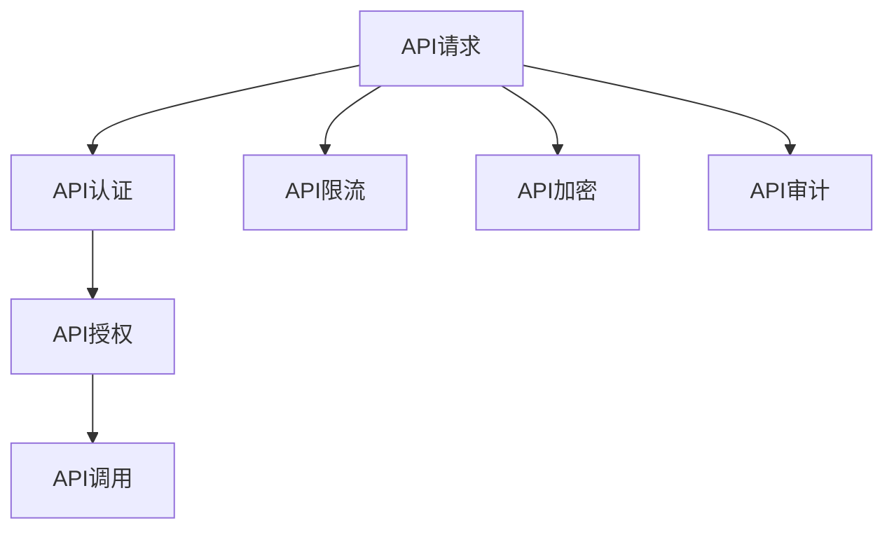

                 

# API 安全和认证机制

## 1. 背景介绍

随着云计算、移动互联网、物联网等技术的蓬勃发展，API（Application Programming Interface，应用程序编程接口）已经成为各行各业不可或缺的基础设施。API提供了一种安全、高效、灵活的方式来构建和集成软件系统，推动了数字经济的快速发展。然而，API的安全问题同样不容忽视，特别是近年来API攻击事件的频发，使得API安全和认证机制成为了一个备受关注的研究热点。

### 1.1 API安全问题概述

API安全问题主要集中在以下几个方面：

1. **数据泄露**：攻击者通过拦截或篡改API请求或响应，获取敏感数据。
2. **身份伪造**：攻击者冒充合法用户或设备，进行非法操作。
3. **拒绝服务攻击**：通过发送大量请求，消耗API服务器资源，导致正常用户无法访问。
4. **功能滥用**：攻击者利用API功能进行不当操作，如批量删除、篡改数据。

这些问题不仅会影响API系统的稳定性和可用性，还可能对企业的商业利益造成巨大损害。因此，构建有效的API安全和认证机制，成为了保障API安全的关键。

### 1.2 API安全的重要性

1. **保护数据隐私**：API认证机制可以确保只有经过授权的用户才能访问敏感数据，防止数据泄露。
2. **防止非法访问**：通过身份认证和权限控制，防止未经授权的用户或设备访问API，避免未授权的功能滥用。
3. **提高系统性能**：合理限流和防止DDoS攻击，可以有效提高API系统的稳定性和性能。
4. **保障业务连续性**：通过API安全机制，可以检测和响应API攻击，及时修复漏洞，保障业务连续性。

## 2. 核心概念与联系

### 2.1 核心概念概述

为更好地理解API安全和认证机制，本节将介绍几个关键概念及其相互联系：

- **API认证**：指在API请求过程中，对请求者身份进行验证的过程。通常包括基本认证、OAuth2、API密钥等方法。
- **API授权**：指在API认证之后，根据用户权限和角色，对API调用进行授权的过程。常见的授权机制包括RBAC（基于角色的访问控制）、ABAC（基于属性的访问控制）等。
- **API限流**：指对API请求进行流量控制，防止DDoS攻击和资源耗尽。常见的限流算法包括固定窗口法、漏桶算法、令牌桶算法等。
- **API加密**：指在API通信过程中，对数据进行加密处理，防止数据在传输过程中被窃听或篡改。常用的加密算法包括SSL/TLS、AES等。
- **API审计**：指对API访问和使用情况进行监控和记录，以便于后续的安全事件分析和问题排查。

这些概念之间的逻辑关系可以通过以下Mermaid流程图来展示：



这个流程图展示了一轮完整的API请求处理流程，从认证、授权、限流、加密到审计，每个环节都是保障API安全的重要组成部分。

## 3. 核心算法原理 & 具体操作步骤
### 3.1 算法原理概述

API安全和认证机制的核心在于对API请求进行身份验证和授权，并结合流量控制、数据加密等手段，综合保障API系统的安全性和可靠性。

在API认证方面，常用的算法包括：

- **基本认证**：指在HTTP头中添加用户名和密码信息，通过HTTP Basic Auth进行验证。
- **OAuth2认证**：基于OAuth2协议，通过访问令牌和客户端密钥进行身份验证，支持授权码模式、密码模式、客户端模式等。
- **API密钥认证**：在API请求中携带API密钥，通过服务器端验证密钥的合法性。

在API授权方面，常用的算法包括：

- **RBAC（基于角色的访问控制）**：根据用户角色和权限，控制其对API的访问权限。
- **ABAC（基于属性的访问控制）**：根据用户属性（如部门、职位、时间等），动态控制API的访问权限。

在API限流方面，常用的算法包括：

- **固定窗口法**：固定时间窗口内对API请求进行计数，超过阈值则拒绝请求。
- **漏桶算法**：通过漏桶模型，平滑API请求流量，防止突发流量。
- **令牌桶算法**：通过令牌桶模型，限制API请求速率，防止资源耗尽。

在API加密方面，常用的算法包括：

- **SSL/TLS协议**：在传输层对数据进行加密，防止中间人攻击和数据窃听。
- **AES算法**：在应用层对数据进行加密，防止数据篡改和泄露。

在API审计方面，常用的算法包括：

- **日志记录**：记录API请求和响应的详细信息，包括请求时间、请求方法、请求参数等。
- **异常检测**：使用机器学习等技术，检测和识别异常流量和攻击行为。
- **行为分析**：分析API使用模式，发现异常行为并进行预警。

### 3.2 算法步骤详解

以下以OAuth2认证为例，详细讲解API认证的流程和步骤：

**步骤1：用户登录**
用户输入用户名和密码，通过身份验证系统（如LDAP、OAuth2等）进行认证。认证成功后，获取访问令牌（Access Token）和客户端密钥（Client Key）。

**步骤2：获取令牌**
用户在API请求中携带访问令牌和客户端密钥，向API服务器发送请求。API服务器验证令牌的合法性，如果合法，则进行下一步。

**步骤3：授权请求**
API服务器将授权请求转发给认证服务器，包括客户端ID、重定向URL等参数。认证服务器根据授权码模式，生成授权码（Authorization Code），并重定向到指定URL。

**步骤4：获取访问令牌**
用户通过重定向URL访问授权页面，选择同意授权。认证服务器验证用户身份，并生成访问令牌（Access Token）和刷新令牌（Refresh Token）。

**步骤5：API调用**
用户携带访问令牌，向API服务器发送请求。API服务器验证令牌的合法性，如果合法，则根据授权权限进行API调用。

**步骤6：刷新令牌**
如果访问令牌失效，用户携带刷新令牌向API服务器请求新的访问令牌。API服务器验证刷新令牌的合法性，并生成新的访问令牌。

通过以上步骤，OAuth2认证机制可以实现对API请求的身份验证和授权控制，保障API系统的安全性。

### 3.3 算法优缺点

OAuth2认证机制具有以下优点：

- **可扩展性**：OAuth2支持多种授权模式，可以根据业务需求灵活配置。
- **安全性**：OAuth2使用访问令牌和刷新令牌，可以避免明文传输密码。
- **互操作性**：OAuth2是开放的国际标准，支持多种第三方身份验证系统。

但OAuth2认证机制也存在一些缺点：

- **复杂性**：OAuth2认证流程相对复杂，需要多个步骤进行身份验证和授权。
- **易受攻击**：OAuth2中的令牌易受到Token劫持和中间人攻击。
- **授权代码易被篡改**：授权码模式中的授权码易被篡改，可能导致身份验证失败。

### 3.4 算法应用领域

API认证机制广泛应用于各种场景中，例如：

- **Web应用**：通过OAuth2认证，Web应用可以实现用户身份验证和授权。
- **移动应用**：通过OAuth2认证，移动应用可以实现单点登录和跨应用身份验证。
- **企业内部API**：通过API密钥认证，企业内部API可以实现统一的身份管理和权限控制。
- **第三方支付接口**：通过OAuth2认证，第三方支付接口可以实现与银行系统的安全对接。

此外，OAuth2认证机制也在云平台、大数据、IoT等众多领域得到了广泛应用，成为保障API安全的重要手段。

## 4. 数学模型和公式 & 详细讲解 & 举例说明

### 4.1 数学模型构建

在OAuth2认证机制中，主要涉及以下数学模型：

- **访问令牌（Access Token）**：由认证服务器颁发，用于标识用户身份，有效期通常为30-60分钟。
- **刷新令牌（Refresh Token）**：由认证服务器颁发，用于在访问令牌失效后，获取新的访问令牌，有效期通常为7-30天。
- **授权码（Authorization Code）**：在授权请求阶段，认证服务器生成，用于重定向到授权页面，有效期通常为5-10分钟。

### 4.2 公式推导过程

**访问令牌（Access Token）的生成公式**：

$$
\text{Access Token} = \text{Sign}(\text{Auth Code}, \text{Client Key}, \text{Timestamp})
$$

其中，$\text{Sign}$表示签名算法，$\text{Auth Code}$表示授权码，$\text{Client Key}$表示客户端密钥，$\text{Timestamp}$表示时间戳。

**刷新令牌（Refresh Token）的生成公式**：

$$
\text{Refresh Token} = \text{Sign}(\text{Client Key}, \text{Timestamp})
$$

其中，$\text{Sign}$表示签名算法，$\text{Client Key}$表示客户端密钥，$\text{Timestamp}$表示时间戳。

**授权码（Authorization Code）的生成公式**：

$$
\text{Authorization Code} = \text{Sign}(\text{Client ID}, \text{Redirect URL}, \text{Timestamp})
$$

其中，$\text{Sign}$表示签名算法，$\text{Client ID}$表示客户端ID，$\text{Redirect URL}$表示重定向URL，$\text{Timestamp}$表示时间戳。

### 4.3 案例分析与讲解

假设一个Web应用需要使用OAuth2进行身份验证和授权。具体流程如下：

1. 用户通过用户名和密码登录系统，输入验证码，提交登录请求。
2. 身份验证系统（如LDAP、OAuth2等）验证用户身份，生成访问令牌（Access Token）和客户端密钥（Client Key）。
3. 用户携带访问令牌和客户端密钥，向API服务器发送请求，请求参数包括$\text{Access Token}$、$\text{Client Key}$、$\text{Timestamp}$。
4. API服务器验证令牌的合法性，如果合法，则进行下一步。
5. API服务器将授权请求转发给认证服务器，包括$\text{Client ID}$、$\text{Redirect URL}$、$\text{Timestamp}$等参数。
6. 认证服务器生成授权码（Authorization Code），并重定向到指定URL。
7. 用户通过重定向URL访问授权页面，选择同意授权。
8. 认证服务器验证用户身份，并生成新的访问令牌（Access Token）和刷新令牌（Refresh Token）。
9. 用户携带访问令牌，向API服务器发送请求，请求参数包括$\text{Access Token}$、$\text{Timestamp}$。
10. API服务器验证令牌的合法性，如果合法，则根据授权权限进行API调用。

在以上流程中，每一步都使用了签名算法，确保令牌和授权码的安全性。

## 5. 项目实践：代码实例和详细解释说明

### 5.1 开发环境搭建

在进行API安全和认证机制的开发前，我们需要准备好开发环境。以下是使用Python进行OAuth2认证开发的环境配置流程：

1. 安装Anaconda：从官网下载并安装Anaconda，用于创建独立的Python环境。

2. 创建并激活虚拟环境：
```bash
conda create -n oauth2-env python=3.8 
conda activate oauth2-env
```

3. 安装OAuth2库：
```bash
pip install oauthlib requests
```

4. 安装相关依赖：
```bash
pip install cryptography
pip install pyjwt
```

完成上述步骤后，即可在`oauth2-env`环境中开始OAuth2认证的开发实践。

### 5.2 源代码详细实现

以下是一个简单的OAuth2认证客户端实现，用于向认证服务器获取访问令牌和刷新令牌。

```python
from requests import Request
from requests_oauthlib import OAuth2Session
import jwt
import time

# 客户端ID和密钥
CLIENT_ID = 'your_client_id'
CLIENT_SECRET = 'your_client_secret'

# 认证服务器URL
AUTHORIZATION_BASE_URL = 'https://example.com/authorization'
TOKEN_BASE_URL = 'https://example.com/token'

# 授权码
AUTHORIZATION_CODE = 'your_authorization_code'

# 创建OAuth2客户端
oauth = OAuth2Session(CLIENT_ID, redirect_uri='http://localhost/callback')

# 准备授权请求
authorization_url, state = oauth.authorization_url(AUTHORIZATION_BASE_URL, redirect_uri='http://localhost/callback', state='example_state')

# 跳转到认证服务器获取授权码
authorization_response = input('请输入授权码：')

# 获取令牌
token = oauth.fetch_token(TOKEN_BASE_URL, client_secret=CLIENT_SECRET, authorization_response=authorization_response, state=state)

# 生成刷新令牌
refresh_token = jwt.encode({'token': token['access_token'], 'exp': time.time() + 3600}, CLIENT_SECRET, algorithm='HS256').decode()

# 输出令牌和刷新令牌
print('Access Token:', token['access_token'])
print('Refresh Token:', refresh_token)
```

### 5.3 代码解读与分析

让我们再详细解读一下关键代码的实现细节：

**OAuth2客户端实现**：
- `OAuth2Session`：使用`requests_oauthlib`库中的`OAuth2Session`类，创建OAuth2客户端。
- `authorization_url`：准备授权请求，生成重定向URL和状态码。
- `authorization_response`：用户在认证服务器上完成授权后，输入授权码。
- `fetch_token`：使用授权码向认证服务器请求令牌，获取访问令牌和客户端密钥。
- `jwt.encode`：使用`pyjwt`库生成刷新令牌，确保令牌在有效期内有效。

在实际应用中，还需要考虑更多的因素，如请求超时、令牌刷新、异常处理等，确保代码的健壮性和可靠性。

## 6. 实际应用场景

### 6.1 智能客服系统

在智能客服系统中，通过OAuth2认证，可以实现单点登录和跨系统身份验证。用户只需登录一次，即可访问不同的Web应用和API接口，提高用户体验和安全性。例如，用户可以通过智能客服系统向银行申请贷款，无需重复输入用户名和密码，即可获取银行API的访问权限。

### 6.2 金融交易平台

在金融交易平台中，通过OAuth2认证，可以实现对API请求的身份验证和授权控制。例如，用户通过OAuth2认证后，可以访问交易API、查询API、理财API等，进行账户查询、交易下单、理财产品购买等操作。同时，通过RBAC和ABAC等授权机制，确保用户只能访问授权的API功能，防止非法操作。

### 6.3 物联网设备管理

在物联网设备管理中，通过OAuth2认证，可以实现对API请求的身份验证和授权控制。例如，用户通过OAuth2认证后，可以访问设备API、配置API、监控API等，进行设备注册、配置、状态监控等操作。同时，通过RBAC和ABAC等授权机制，确保用户只能访问授权的设备和服务，防止未授权操作。

### 6.4 未来应用展望

随着API安全和认证机制的不断演进，未来的应用场景将更加广泛，具体如下：

1. **微服务架构**：在微服务架构中，通过OAuth2认证，可以实现跨服务身份验证和授权。例如，一个服务调用另一个服务时，通过OAuth2认证获取令牌，确保服务间通信的安全性和可靠性。
2. **移动端应用**：在移动端应用中，通过OAuth2认证，可以实现单点登录和跨应用身份验证。例如，用户通过OAuth2认证后，可以在不同的移动应用中访问API接口，进行数据查询、操作等操作。
3. **云平台服务**：在云平台服务中，通过OAuth2认证，可以实现跨租户身份验证和授权。例如，用户通过OAuth2认证后，可以在不同的云平台服务中访问API接口，进行资源管理、配置等操作。

未来，API安全和认证机制将在更多的应用场景中得到广泛应用，成为保障API安全的重要手段。

## 7. 工具和资源推荐

### 7.1 学习资源推荐

为了帮助开发者系统掌握API安全和认证机制的理论基础和实践技巧，这里推荐一些优质的学习资源：

1. **《API安全与认证》系列博文**：由API安全专家撰写，深入浅出地介绍了API安全、认证机制、OAuth2等前沿话题。
2. **《OAuth2认证与授权》课程**：Google提供的在线课程，系统讲解OAuth2认证和授权的原理和实现。
3. **《OAuth2认证实战》书籍**：该书全面介绍了OAuth2认证的原理、实现和应用案例，是学习OAuth2认证的好书。
4. **OAuth2官方文档**：OAuth2官方文档，提供了完整的OAuth2认证和授权的规范和实现指南。
5. **OWASP API Security Top 10**：OWASP发布的API安全Top 10，列出了API安全的主要威胁和防护措施，值得参考学习。

通过对这些资源的学习实践，相信你一定能够快速掌握API安全和认证机制的精髓，并用于解决实际的API安全问题。

### 7.2 开发工具推荐

高效的开发离不开优秀的工具支持。以下是几款用于API安全和认证机制开发的常用工具：

1. **requests库**：Python标准库中的`requests`库，提供了HTTP请求和响应处理的接口，方便进行OAuth2认证和授权。
2. **OAuth2Session库**：`requests_oauthlib`库中的`OAuth2Session`类，封装了OAuth2认证和授权的流程，简化代码实现。
3. **JWT库**：`pyjwt`库，用于生成和解析JWT令牌，确保令牌的安全性。
4. **Cryptography库**：`cryptography`库，提供了密码学相关的算法和工具，用于生成和验证令牌和签名。
5. **Jupyter Notebook**：用于编写和执行Python代码，支持代码块、输出、注释等功能，方便开发和调试。

合理利用这些工具，可以显著提升API安全和认证机制的开发效率，加快创新迭代的步伐。

### 7.3 相关论文推荐

API安全和认证机制的研究源于学界的持续研究。以下是几篇奠基性的相关论文，推荐阅读：

1. **OAuth2.0 Framework**：RFC 6749标准文档，详细描述了OAuth2.0认证和授权的规范和实现。
2. **OAuth2.0 Security Considerations**：RFC 6819标准文档，提供了OAuth2.0认证和授权的安全建议和防护措施。
3. **OAuth2.0 Provider and Client Tooling**：RFC 7591标准文档，提供了OAuth2.0认证和授权的工具和实现指南。
4. **OAuth2.0 for Native and Hybrid Apps**：Google发布的OAuth2.0认证和授权的移动端应用实现指南。
5. **OAuth2.0 and OpenID Connect for IoT**：IoT产业联盟发布的OAuth2.0认证和授权的IoT设备实现指南。

这些论文代表了大规模认证和授权技术的发展脉络。通过学习这些前沿成果，可以帮助研究者把握学科前进方向，激发更多的创新灵感。

## 8. 总结：未来发展趋势与挑战

### 8.1 总结

本文对API安全和认证机制进行了全面系统的介绍。首先阐述了API安全和认证机制的研究背景和意义，明确了OAuth2认证在保障API安全方面的独特价值。其次，从原理到实践，详细讲解了OAuth2认证的流程和步骤，给出了OAuth2认证任务开发的完整代码实例。同时，本文还广泛探讨了OAuth2认证机制在智能客服、金融交易、物联网等众多领域的应用前景，展示了OAuth2认证的广泛应用价值。此外，本文精选了OAuth2认证技术的各类学习资源，力求为读者提供全方位的技术指引。

通过本文的系统梳理，可以看到，OAuth2认证机制已经成为保障API安全的重要手段，广泛应用于各种场景中。受益于OAuth2认证技术的不断发展，API系统的安全性、可用性和可靠性将得到显著提升，助力数字经济的蓬勃发展。

### 8.2 未来发展趋势

展望未来，API认证和授权机制将呈现以下几个发展趋势：

1. **无密码认证**：未来的认证机制将更多地依赖于生物识别、行为分析等技术，减少对密码的依赖，提高安全性。
2. **多因素认证**：未来的认证机制将采用多因素认证，结合指纹、面部识别、短信验证等多种手段，提高认证的安全性和可靠性。
3. **基于区块链的认证**：未来的认证机制将引入区块链技术，实现去中心化、不可篡改的身份认证。
4. **分布式认证**：未来的认证机制将采用分布式认证，实现跨地域、跨系统的身份验证和授权。
5. **基于AI的认证**：未来的认证机制将采用人工智能技术，结合行为分析、异常检测等手段，实现更加智能、高效的认证。

以上趋势凸显了API认证和授权机制的广阔前景。这些方向的探索发展，必将进一步提升API系统的安全性、可用性和可靠性，保障业务连续性和客户隐私。

### 8.3 面临的挑战

尽管OAuth2认证技术已经取得了瞩目成就，但在迈向更加智能化、普适化应用的过程中，它仍面临诸多挑战：

1. **身份认证复杂性**：多因素认证和去中心化认证将带来更高的身份验证复杂性，需要更好的用户体验和技术支持。
2. **认证系统扩展性**：分布式认证和区块链认证将带来更复杂的系统架构，需要更高的扩展性和灵活性。
3. **安全性和隐私保护**：未来的认证机制需要兼顾安全性和隐私保护，防止信息泄露和滥用。
4. **认证技术标准化**：未来的认证技术需要标准化和互操作性，支持多种认证方式和系统。

这些问题需要开发者不断创新和优化，结合技术进步和社会需求，构建更加安全、可靠、高效的API认证和授权机制。

### 8.4 研究展望

面对API认证和授权机制所面临的种种挑战，未来的研究需要在以下几个方面寻求新的突破：

1. **身份认证新方法**：探索新的身份认证方法，如生物识别、行为分析、分布式认证等，提高认证的安全性和可靠性。
2. **认证技术标准化**：推动API认证和授权技术的标准化和互操作性，构建统一的身份认证体系。
3. **分布式认证技术**：研究分布式认证技术，实现跨系统、跨地域的身份验证和授权，提升系统灵活性和扩展性。
4. **AI辅助认证**：结合人工智能技术，进行行为分析和异常检测，提高认证的智能性和准确性。
5. **区块链认证技术**：探索基于区块链的身份认证技术，实现去中心化和不可篡改的身份验证。

这些研究方向将引领API认证和授权机制迈向更高的台阶，为构建安全、可靠、高效的智能系统铺平道路。面向未来，API认证和授权技术还需要与其他人工智能技术进行更深入的融合，如知识表示、因果推理、强化学习等，多路径协同发力，共同推动智能认证技术的发展。只有勇于创新、敢于突破，才能不断拓展认证机制的边界，让智能认证技术更好地服务于社会。

## 9. 附录：常见问题与解答

**Q1：如何确保API认证的安全性？**

A: 确保API认证的安全性，需要从以下几个方面进行考虑：
1. **选择合适的认证协议**：选择OAuth2、JWT等成熟、安全的认证协议，避免使用容易受到攻击的协议。
2. **加强令牌管理**：合理设置令牌的有效期、使用范围等，防止令牌被滥用或泄露。
3. **使用HTTPS协议**：在传输过程中使用HTTPS协议，防止数据被窃听或篡改。
4. **强化服务器安全**：确保API服务器和认证服务器的安全性，防止攻击者获取敏感信息。
5. **日志记录和审计**：记录API认证的日志，及时发现和处理异常行为，保障认证系统的安全性。

**Q2：如何进行API授权？**

A: API授权通常通过RBAC或ABAC机制进行。具体步骤如下：
1. **身份认证**：用户通过OAuth2等认证机制进行身份验证，获取访问令牌。
2. **授权请求**：API服务器根据访问令牌，向认证服务器请求授权。
3. **授权响应**：认证服务器根据授权策略，返回授权结果。
4. **API调用**：API服务器根据授权结果，控制API调用的权限。

**Q3：API认证和授权机制是否适用于所有场景？**

A: API认证和授权机制适用于大多数场景，但也有一些特殊场景需要注意：
1. **低带宽场景**：在网络带宽较低的场景中，可能需要选择轻量级的认证和授权机制，如令牌桶、漏桶等。
2. **高并发场景**：在高并发场景中，需要考虑认证和授权的性能，避免系统瓶颈。
3. **特殊需求场景**：对于特定需求，可能需要结合业务场景进行定制化设计，如多因素认证、分布式认证等。

**Q4：API认证和授权机制是否容易被破解？**

A: API认证和授权机制虽然相对安全，但也存在一些容易被破解的漏洞，如令牌劫持、中间人攻击等。为防止这些漏洞，需要采取以下措施：
1. **加强令牌保护**：使用HTTPS协议、JWT加密等技术，确保令牌的安全性。
2. **设置令牌有效期**：合理设置令牌有效期，防止长期有效令牌被滥用。
3. **日志记录和审计**：记录API认证和授权的日志，及时发现和处理异常行为。
4. **异常检测**：结合机器学习等技术，检测和识别异常流量和攻击行为。
5. **安全加固**：强化API服务器和认证服务器的安全性，防止攻击者获取敏感信息。

**Q5：API认证和授权机制的未来发展方向是什么？**

A: 未来的API认证和授权机制将更加智能化、安全和高效，具体方向如下：
1. **无密码认证**：未来的认证机制将更多地依赖于生物识别、行为分析等技术，减少对密码的依赖，提高安全性。
2. **多因素认证**：未来的认证机制将采用多因素认证，结合指纹、面部识别、短信验证等多种手段，提高认证的安全性和可靠性。
3. **基于区块链的认证**：未来的认证机制将引入区块链技术，实现去中心化、不可篡改的身份认证。
4. **分布式认证**：未来的认证机制将采用分布式认证，实现跨地域、跨系统的身份验证和授权，提升系统灵活性和扩展性。
5. **基于AI的认证**：未来的认证机制将采用人工智能技术，结合行为分析、异常检测等手段，实现更加智能、高效的认证。

这些方向将引领API认证和授权机制迈向更高的台阶，为构建安全、可靠、高效的智能系统铺平道路。面向未来，API认证和授权技术还需要与其他人工智能技术进行更深入的融合，如知识表示、因果推理、强化学习等，多路径协同发力，共同推动智能认证技术的发展。

---

作者：禅与计算机程序设计艺术 / Zen and the Art of Computer Programming

