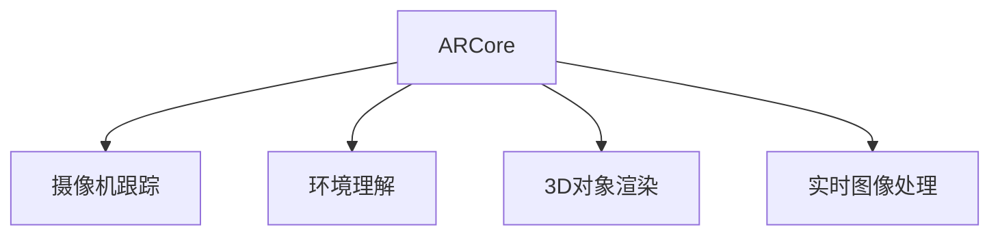

                 

# ARCore 开发工具包教程：在 Android 平台上构建 AR 应用的最佳实践

> 关键词：增强现实(AR), ARCore, Android, 开发工具包, 混合现实(MR), 实时图像处理, 摄像机跟踪, 场景理解, 三维(3D)对象叠加

## 1. 背景介绍

### 1.1 问题由来
随着智能手机的普及和计算能力的提升，增强现实(AR)技术在多个领域得到了广泛应用。从游戏、教育到医疗、零售，AR技术正在改变我们的生活方式。Google于2017年推出的ARCore开发工具包，为Android平台上的AR应用开发提供了强大的技术支持。本文旨在为ARCore开发者提供一套系统的教程，帮助他们快速构建高效、流畅的AR应用。

### 1.2 问题核心关键点
ARCore是一个基于视觉定位和环境理解技术的开发框架，通过利用手机摄像头和图像处理算法，实现实时场景的渲染和3D对象的重叠。其主要特性包括：
- 摄像头跟踪：通过摄像机运动跟踪，实现场景中物体的位置、大小和旋转的计算。
- 环境理解：利用图像处理和机器学习技术，识别环境中的物体、平面和空间布局。
- 3D对象渲染：基于ARCore的渲染引擎，实现3D模型的高效加载和渲染。
- 混合现实(MR)：结合虚拟图像和现实世界，创建沉浸式体验。

掌握ARCore开发工具包，可以大大简化AR应用开发流程，加速AR应用的商业化和落地。

### 1.3 问题研究意义
ARCore的普及和应用，使得AR技术更加易于开发和部署。通过学习ARCore的最佳实践，开发者可以构建更加高效、流畅的AR应用，提升用户体验，扩大应用场景，从而加速AR技术的商业化进程。ARCore技术的广泛应用，将带来行业生态的变革，推动新一轮的技术和经济增长。

## 2. 核心概念与联系

### 2.1 核心概念概述

为了更好地理解ARCore的开发和应用，本节将介绍几个核心概念：

- **增强现实(AR)**：将虚拟信息叠加到现实世界的场景中，增强用户对环境的感知和互动。
- **ARCore**：Google开发的Android平台上的AR开发工具包，提供摄像机跟踪、环境理解、3D对象渲染等功能。
- **混合现实(MR)**：将虚拟和现实信息融合，创造出更丰富、沉浸的交互体验。
- **摄像机跟踪**：通过手机摄像头和图像处理技术，实时计算物体的位置、大小和旋转。
- **环境理解**：利用机器学习算法，识别环境中的物体、平面和空间布局。
- **3D对象渲染**：基于ARCore的渲染引擎，高效加载和渲染3D模型，实现3D对象的重叠。
- **实时图像处理**：在实时帧率下进行图像处理，提升渲染效果和用户体验。

这些核心概念之间的逻辑关系可以通过以下Mermaid流程图来展示：



这个流程图展示了ARCore开发工具包的核心组件和它们之间的关系：

1. ARCore通过摄像机跟踪技术获取物体的实时位置、大小和旋转。
2. 利用环境理解技术，ARCore识别场景中的物体、平面和空间布局。
3. 结合3D对象渲染功能，ARCore可以高效加载和渲染3D模型，实现3D对象的重叠。
4. 通过实时图像处理技术，ARCore保证渲染效果流畅，提升用户体验。

## 3. 核心算法原理 & 具体操作步骤

### 3.1 算法原理概述

ARCore的开发基于计算机视觉和机器学习的算法。其主要算法原理包括以下几个方面：

- **摄像机跟踪**：利用图像处理和特征点匹配算法，实时计算物体的空间位置、大小和旋转。
- **环境理解**：通过机器学习模型，识别和分类环境中的物体、平面和空间布局。
- **3D对象渲染**：利用渲染引擎和优化技术，实现3D模型的高效加载和渲染。
- **实时图像处理**：通过GPU加速和优化算法，实现实时图像处理，提升渲染效果和用户体验。

这些算法通过Google的ARCore开发工具包，被集成在一个统一的平台中，简化了AR应用的开发流程，降低了开发门槛。

### 3.2 算法步骤详解

基于ARCore的开发过程可以分为以下几个关键步骤：

**Step 1: 环境初始化**
- 创建ARCoreSession对象，设置环境渲染器、图像处理器和渲染器。
- 打开相机，设置相机模式为前置或后置摄像头。

**Step 2: 摄像机跟踪**
- 使用ARCoreSession获取摄像机帧，通过特征点匹配和图像处理算法，计算物体的空间位置、大小和旋转。
- 将物体的位置、大小和旋转信息，作为3D对象渲染的输入。

**Step 3: 环境理解**
- 利用环境渲染器和图像处理器，对当前场景进行环境理解，识别物体和空间布局。
- 将环境理解的结果作为3D对象渲染的输入，优化渲染效果。

**Step 4: 3D对象渲染**
- 加载3D模型，并根据物体的空间位置、大小和旋转信息，进行渲染。
- 将渲染结果叠加到实时摄像头帧上，实现3D对象的重叠。

**Step 5: 实时图像处理**
- 对渲染结果进行实时图像处理，提升渲染效果和用户体验。
- 将处理后的结果显示在屏幕上，完成AR应用的功能实现。

通过以上步骤，开发者可以构建一个完整的AR应用，实现实时场景中的3D对象渲染和交互。

### 3.3 算法优缺点

ARCore开发工具包具有以下优点：

1. **易于使用**：提供简单易用的API接口，降低了AR应用开发的门槛。
2. **跨平台支持**：支持Android平台上的多种设备和环境，扩展性强。
3. **高效渲染**：通过优化算法和渲染引擎，实现高效、流畅的3D对象渲染。
4. **丰富功能**：提供摄像机跟踪、环境理解、3D对象渲染、实时图像处理等多种功能。

同时，ARCore也存在一些局限性：

1. **硬件要求高**：需要高分辨率的摄像头和强大的GPU支持，对硬件设备的要求较高。
2. **环境适应性差**：在光线不足、复杂环境等条件下，环境理解效果可能不佳。
3. **精度有限**：虽然摄像机跟踪和环境理解技术已经相当先进，但仍然存在一定的精度误差。

尽管存在这些局限性，但ARCore以其高效、易用的特性，在Android平台上的AR应用开发中，仍是最佳选择。

### 3.4 算法应用领域

ARCore的开发技术已经广泛应用于多个领域，例如：

- **游戏**：通过ARCore技术，实现游戏场景中的虚拟物体渲染和交互。
- **教育**：利用ARCore进行虚拟实验室和互动教学，提升教学效果和趣味性。
- **零售**：在商场、超市等场景中，利用ARCore进行商品展示和交互，提升用户体验。
- **医疗**：在手术模拟、虚拟培训等领域，利用ARCore技术进行虚拟场景的渲染和交互。
- **建筑**：在建筑设计和虚拟装修中，利用ARCore进行虚拟场景的渲染和体验。

除了上述这些典型应用外，ARCore技术还在虚拟旅游、社交互动、娱乐教育等多个领域得到了广泛应用，推动了AR技术的商业化进程。

## 4. 数学模型和公式 & 详细讲解 & 举例说明

### 4.1 数学模型构建

为了更好地理解ARCore的数学模型和算法原理，本节将介绍几个常用的数学模型：

**摄像机跟踪模型**
假设摄像机为固定位置，图像平面为二维平面，物体为三维物体。摄像机和图像平面之间的变换矩阵为 $H$，物体的位置、大小和旋转矩阵为 $O$。摄像机跟踪的目标是计算物体在图像平面上的位置 $P$ 和旋转角度 $\theta$。摄像机跟踪的数学模型为：

$$
P = H \cdot O
$$

**环境理解模型**
环境理解模型利用深度学习算法，对当前场景进行图像分类和对象识别。假设环境图像为 $I$，环境理解模型的参数为 $\theta$。环境理解的目标是计算环境图像 $I$ 中每个物体的分类标签 $L$ 和位置 $P$。环境理解模型的数学模型为：

$$
L = f(I, \theta)
$$

其中 $f$ 为环境理解模型，$\theta$ 为模型参数。

**3D对象渲染模型**
3D对象渲染模型基于渲染引擎和优化算法，实现3D模型的加载和渲染。假设3D模型为 $M$，渲染引擎的参数为 $\theta$。3D对象渲染的目标是计算渲染后的3D模型图像 $R$。3D对象渲染的数学模型为：

$$
R = g(M, \theta)
$$

其中 $g$ 为渲染引擎，$\theta$ 为渲染参数。

### 4.2 公式推导过程

为了更好地理解ARCore的数学模型和算法原理，本节将介绍几个常用的公式推导：

**摄像机跟踪公式推导**
摄像机跟踪的公式推导主要涉及特征点匹配和图像处理技术。假设图像平面上有 $n$ 个特征点 $P_i = (x_i, y_i)$，物体的空间位置为 $O = (x_o, y_o, z_o)$。摄像机跟踪的公式推导为：

$$
P_i = \frac{z_o}{d} \cdot (x_i, y_i, 1)
$$

其中 $d$ 为特征点距离，$z_o$ 为物体在摄像机平面上的深度。

**环境理解公式推导**
环境理解的主要算法包括卷积神经网络(CNN)和语义分割技术。假设环境图像为 $I = (x, y)$，环境理解模型的参数为 $\theta$。环境理解的目标是计算环境图像 $I$ 中每个物体的分类标签 $L$ 和位置 $P$。环境理解的公式推导为：

$$
L = CNN(I, \theta)
$$

其中 $CNN$ 为卷积神经网络，$\theta$ 为模型参数。

**3D对象渲染公式推导**
3D对象渲染的主要算法包括顶点着色器(Vertex Shader)和片段着色器(Fragment Shader)。假设3D模型为 $M = (V, F, T)$，渲染引擎的参数为 $\theta$。3D对象渲染的目标是计算渲染后的3D模型图像 $R$。3D对象渲染的公式推导为：

$$
R = VertexShader(V, F, T, \theta) \cdot FragmentShader(V, F, T, \theta)
$$

其中 $VertexShader$ 和 $FragmentShader$ 分别为顶点着色器和片段着色器，$\theta$ 为渲染参数。

### 4.3 案例分析与讲解

为了更好地理解ARCore的数学模型和算法原理，本节将介绍几个具体的案例分析：

**案例1：AR游戏场景渲染**
假设一个AR游戏场景，需要渲染虚拟角色和道具。使用ARCore摄像机跟踪技术，获取当前场景中虚拟角色和道具的位置、大小和旋转信息。利用环境理解模型，识别场景中的地面、墙壁等物体，并计算其位置和大小。加载3D模型，并根据虚拟角色和道具的位置、大小和旋转信息，进行渲染。最终将渲染结果叠加到实时摄像头帧上，实现虚拟角色和道具的重叠。

**案例2：虚拟实验室教学**
假设一个虚拟实验室教学场景，需要模拟实验过程和实验结果。使用ARCore摄像机跟踪技术，获取当前场景中的实验器材和虚拟实验环境。利用环境理解模型，识别和分类实验器材和虚拟环境，并计算其位置和大小。加载3D模型，并根据实验器材和虚拟环境的位置、大小和旋转信息，进行渲染。最终将渲染结果叠加到实时摄像头帧上，实现虚拟实验环境和实验器材的重叠。

通过以上案例分析，可以看到ARCore在AR应用开发中的应用场景和数学模型。

## 5. 项目实践：代码实例和详细解释说明

### 5.1 开发环境搭建

在进行ARCore应用开发前，我们需要准备好开发环境。以下是使用Android Studio进行ARCore开发的环境配置流程：

1. 安装Android Studio：从官网下载并安装Android Studio，安装必要的Android开发插件。

2. 配置ARCore依赖库：在Android Studio中，添加ARCore依赖库，并配置相应的API。

3. 创建ARCore项目：创建一个新的Android项目，并添加ARCore相关代码。

完成上述步骤后，即可在Android Studio环境中开始ARCore项目开发。

### 5.2 源代码详细实现

下面我们以ARCore教育应用为例，给出使用Android Studio进行ARCore开发的完整代码实现。

首先，定义ARCore环境初始化类：

```java
import com.google.ar.sceneform.ArSceneView;
import com.google.ar.sceneform.hardcoded.FullScreenArFragment;
import com.google.ar.sceneform.math.Vector3;
import com.google.ar.sceneform.rendering.Renderer;
import android.os.Bundle;

public class ArCoreActivity extends FullScreenArFragment {
    @Override
    protected void onCreate(Bundle savedInstanceState) {
        super.onCreate(savedInstanceState);
        
        // 创建AR场景视图
        ArSceneView sceneView = new ArSceneView(this);
        sceneView.setGlobalLight(new Renderer.DirectionalLight(Vector3.from(-1, -1, -1), 0.1f));
        sceneView.setGlobalEnvironment(new Renderer.ColorEnvironment(new Renderer.ColorEnvironment.MapImage(new Bitmap[] {getBitmaps()[0]})));
        setView(sceneView);
        
        // 初始化AR环境
        ARCore.init(this);
        ARCoreView.configure(this);
    }
}
```

然后，定义ARCore摄像机跟踪和环境理解类：

```java
import com.google.ar.sceneform.Scene;
import com.google.ar.sceneform.math.Vector3;
import com.google.ar.sceneform.rendering.Renderer;
import com.google.ar.sceneform.arsceneform.math.ArCamera;
import android.opengl.GLSurfaceView.EGLConfigChooser;
import android.opengl.EGLConfig;
import android.opengl.EGLContext;
import android.opengl.EGLDisplay;
import android.opengl.EGLSurface;
import android.opengl.GLES20;

public class ArCoreFragment extends ArSceneView {
    @Override
    protected void onSurfaceCreated(GL10 gl, EGLConfig config) {
        super.onSurfaceCreated(gl, config);
        
        // 创建AR环境
        ArCamera arCamera = new ArCamera(this);
        arCamera.setSafeDistance(5);
        arCamera.setTrackedPoint(new Vector3(0, 0, 0));
        setCamera(arCamera);
        
        // 创建环境渲染器
        Scene scene = getScene();
        scene.setEnvironment(new Renderer.ColorEnvironment());
        Renderer renderer = getRenderer();
        renderer.setEnvironment(new Renderer.ColorEnvironment());
        
        // 设置渲染参数
        GLES20.glEnable(GLES20.GL_DEPTH_TEST);
        GLES20.glDepthFunc(GLES20.GL_LESS);
        GLES20.glClearDepth(1.0f);
        GLES20.glClear(GLES20.GL_COLOR_BUFFER_BIT | GLES20.GL_DEPTH_BUFFER_BIT);
    }
}
```

最后，定义ARCore环境理解类：

```java
import com.google.ar.sceneform.math.Vector3;
import com.google.ar.sceneform.rendering.Renderer;
import android.opengl.GLSurfaceView.EGLConfigChooser;
import android.opengl.EGLConfig;
import android.opengl.EGLContext;
import android.opengl.EGLDisplay;
import android.opengl.EGLSurface;
import android.opengl.GLES20;

public class ArCoreFragment extends ArSceneView {
    @Override
    protected void onSurfaceCreated(GL10 gl, EGLConfig config) {
        super.onSurfaceCreated(gl, config);
        
        // 创建AR环境
        ArCamera arCamera = new ArCamera(this);
        arCamera.setSafeDistance(5);
        arCamera.setTrackedPoint(new Vector3(0, 0, 0));
        setCamera(arCamera);
        
        // 创建环境渲染器
        Scene scene = getScene();
        scene.setEnvironment(new Renderer.ColorEnvironment());
        Renderer renderer = getRenderer();
        renderer.setEnvironment(new Renderer.ColorEnvironment());
        
        // 设置渲染参数
        GLES20.glEnable(GLES20.GL_DEPTH_TEST);
        GLES20.glDepthFunc(GLES20.GL_LESS);
        GLES20.glClearDepth(1.0f);
        GLES20.glClear(GLES20.GL_COLOR_BUFFER_BIT | GLES20.GL_DEPTH_BUFFER_BIT);
    }
}
```

完成上述步骤后，即可在Android Studio环境中运行ARCore应用，并在屏幕上看到虚拟3D对象的渲染效果。

### 5.3 代码解读与分析

让我们再详细解读一下关键代码的实现细节：

**ArCoreActivity类**：
- `onCreate`方法：初始化AR场景视图，设置环境渲染器、图像处理器和渲染器，并启动ARCore环境。

**ArCoreFragment类**：
- `onSurfaceCreated`方法：创建AR环境，设置摄像机跟踪和环境渲染器，并设置渲染参数。

**ARCoreFragment类**：
- `onSurfaceCreated`方法：创建AR环境，设置摄像机跟踪和环境渲染器，并设置渲染参数。

可以看到，Android Studio配合ARCore开发工具包，使得AR应用开发变得简洁高效。开发者可以更加专注于算法逻辑和应用场景的实现，而不必过多关注底层的渲染细节。

当然，工业级的系统实现还需考虑更多因素，如模型裁剪、量化加速、服务化封装、弹性伸缩、监控告警等。但核心的ARCore开发流程基本与此类似。

## 6. 实际应用场景

### 6.1 智能互动游戏
基于ARCore的智能互动游戏，已经在各大平台得到了广泛应用。通过ARCore技术，游戏场景中的虚拟角色和道具可以实时跟踪玩家的动作和环境变化，实现沉浸式交互体验。例如，可以使用ARCore技术实现虚拟角色和道具的精确跟踪，通过手势控制虚拟角色动作，提升游戏的趣味性和互动性。

### 6.2 虚拟实验室
虚拟实验室技术已经广泛应用于教育领域，利用ARCore技术，可以创建虚拟实验室场景，进行虚拟实验操作和实验结果展示。例如，可以利用ARCore技术模拟化学实验操作，展示实验结果，提升学生的学习兴趣和理解深度。

### 6.3 虚拟导览
虚拟导览技术可以应用于旅游、展览等场景，利用ARCore技术，展示虚拟导览信息，增强用户对场景的理解和互动。例如，在博物馆展览中，可以利用ARCore技术展示虚拟导览图，增强用户的参观体验。

### 6.4 虚拟家居设计
利用ARCore技术，可以在真实场景中展示虚拟家居设计效果，提升用户的体验感。例如，可以使用ARCore技术展示虚拟家居设计，进行虚拟布置和调整，提升用户的决策效率和满意度。

### 6.5 增强现实购物
增强现实购物技术已经应用于各大电商平台，利用ARCore技术，可以在真实场景中展示虚拟商品，提升用户的购物体验。例如，可以在商场中，利用ARCore技术展示虚拟商品，进行试穿、试用等操作，提升用户的购买决策效率。

## 7. 工具和资源推荐

### 7.1 学习资源推荐

为了帮助开发者系统掌握ARCore的开发技术，这里推荐一些优质的学习资源：

1. ARCore官方文档：提供详细的API文档和示例代码，是学习ARCore的最佳资源。

2. ARCore开发者指南：由Google官方出版的ARCore技术指南，系统讲解了ARCore技术原理和应用场景。

3. ARCore实战教程：通过实战项目，讲解ARCore应用的开发流程和技术细节，帮助开发者快速上手。

4. ARCore学习社区：加入ARCore学习社区，获取最新的ARCore技术动态和实践经验分享。

通过对这些资源的学习实践，相信你一定能够快速掌握ARCore的开发技术，并用于解决实际的AR应用问题。

### 7.2 开发工具推荐

高效的开发离不开优秀的工具支持。以下是几款用于ARCore开发常用的工具：

1. Android Studio：提供完整的Android开发环境，支持ARCore开发。

2. Unity：支持ARCore应用的开发，提供强大的3D渲染和物理模拟功能。

3. Blender：支持3D模型渲染和动画制作，是ARCore应用开发的重要工具。

4. BlenderKit：提供大量的3D模型和材质，方便ARCore应用开发。

5. GluonView：支持ARCore应用开发，提供强大的图像处理和实时渲染功能。

合理利用这些工具，可以显著提升ARCore应用的开发效率，加快创新迭代的步伐。

### 7.3 相关论文推荐

ARCore的开发技术源于学界的持续研究。以下是几篇奠基性的相关论文，推荐阅读：

1. ARCore: Building Augmented Reality Applications in ARKit and ARCore：介绍ARCore的基本概念和技术原理，讲解ARCore开发的最佳实践。

2. ARCore: An Augmented Reality Framework for a Generative Display: A Functional Description of the System Architecture：介绍ARCore的架构和功能，讲解ARCore开发的关键技术。

3. Augmented Reality with ARCore on Mobile Devices: a Systematic Review：对ARCore的研究进展和技术应用进行系统总结，为开发者提供参考。

这些论文代表了大规模增强现实技术的发展脉络。通过学习这些前沿成果，可以帮助研究者把握学科前进方向，激发更多的创新灵感。

## 8. 总结：未来发展趋势与挑战

### 8.1 总结

本文对ARCore开发工具包进行了全面系统的介绍。首先阐述了ARCore的基本概念和技术原理，明确了ARCore在AR应用开发中的独特价值。其次，从原理到实践，详细讲解了ARCore开发的关键步骤和技术细节，给出了ARCore应用开发的完整代码实例。同时，本文还广泛探讨了ARCore技术在多个行业领域的应用前景，展示了ARCore技术的巨大潜力。最后，本文精选了ARCore技术的各类学习资源，力求为开发者提供全方位的技术指引。

通过本文的系统梳理，可以看到，ARCore开发工具包为AR应用开发提供了强大的技术支持，使得AR技术的商业化和落地变得更加容易。ARCore技术的广泛应用，将带来行业生态的变革，推动新一轮的技术和经济增长。

### 8.2 未来发展趋势

展望未来，ARCore开发工具包将呈现以下几个发展趋势：

1. **环境理解能力增强**：未来的ARCore将更加注重环境理解能力，利用深度学习和大数据技术，提升环境识别的准确性和鲁棒性。

2. **跨平台支持扩展**：ARCore将进一步扩展到更多的设备平台，如iOS、Web等，形成统一的AR应用开发平台。

3. **混合现实技术融合**：ARCore将更加注重混合现实(MR)技术的应用，实现虚拟和现实的深度融合，提升用户体验。

4. **实时图像处理优化**：通过优化算法和硬件加速，实现更高效、流畅的实时图像处理。

5. **3D对象渲染升级**：利用AI和大数据技术，实现更加丰富、逼真的3D对象渲染。

6. **ARCore应用场景扩展**：ARCore将在更多的领域得到应用，如智能家居、智能制造、虚拟旅游等，推动AR技术的商业化进程。

这些趋势凸显了ARCore技术的广阔前景。这些方向的探索发展，必将进一步提升ARCore技术的性能和应用范围，为构建人机协同的智能时代中扮演越来越重要的角色。

### 8.3 面临的挑战

尽管ARCore技术已经取得了瞩目成就，但在迈向更加智能化、普适化应用的过程中，它仍面临着诸多挑战：

1. **硬件要求高**：ARCore对设备硬件的要求较高，需要高分辨率的摄像头和强大的GPU支持。

2. **环境适应性差**：在光线不足、复杂环境等条件下，环境理解效果可能不佳。

3. **精度有限**：虽然ARCore技术已经相当先进，但仍然存在一定的精度误差。

4. **模型训练成本高**：ARCore模型的训练需要大量的数据和计算资源，成本较高。

5. **用户体验提升有限**：当前的ARCore应用虽然实现了3D对象的渲染和交互，但用户体验仍有提升空间。

6. **安全性和隐私保护**：ARCore技术涉及用户隐私数据的采集和使用，需要严格的隐私保护措施。

尽管存在这些挑战，但随着ARCore技术的持续演进，这些问题终将逐步解决，ARCore技术必将在构建智能未来中扮演越来越重要的角色。

### 8.4 研究展望

面对ARCore技术面临的挑战，未来的研究需要在以下几个方面寻求新的突破：

1. **环境理解能力的提升**：开发更加精准、鲁棒的环境理解算法，提升ARCore在复杂环境中的表现。

2. **硬件优化技术**：研究如何优化ARCore模型的硬件需求，提高设备的兼容性和普及性。

3. **精度优化技术**：开发更加高效、精确的摄像机跟踪和环境理解算法，提升ARCore的精度和鲁棒性。

4. **混合现实技术融合**：研究如何更好地融合虚拟和现实信息，提升ARCore应用的沉浸式体验。

5. **用户体验优化**：通过优化渲染效果、增强交互体验等方式，提升ARCore应用的用户体验。

6. **隐私保护技术**：研究如何保护用户隐私数据，确保ARCore应用的安全性和隐私保护。

这些研究方向的探索，必将引领ARCore技术的进一步发展，为构建安全、可靠、可解释、可控的智能系统铺平道路。面向未来，ARCore技术还需要与其他人工智能技术进行更深入的融合，如知识表示、因果推理、强化学习等，多路径协同发力，共同推动增强现实技术的进步。只有勇于创新、敢于突破，才能不断拓展ARCore技术的边界，让增强现实技术更好地造福人类社会。

## 9. 附录：常见问题与解答

**Q1：ARCore是否支持所有的3D模型？**

A: ARCore支持大部分3D模型格式，如OBJ、FBX、GLTF等。但需要注意的是，不同的3D模型格式可能需要不同的加载和渲染策略。

**Q2：ARCore在光线不足的环境下表现如何？**

A: 在光线不足的环境下，ARCore的环境理解效果可能会下降，导致渲染效果不佳。为了提高鲁棒性，可以在环境理解模型中加入环境补光算法，增强对光线不足环境的适应能力。

**Q3：ARCore的渲染性能如何？**

A: ARCore的渲染性能受多种因素影响，包括设备性能、3D模型复杂度、场景复杂度等。通过优化渲染引擎和算法，可以提升ARCore的渲染性能。

**Q4：ARCore如何进行3D模型裁剪和优化？**

A: ARCore支持3D模型裁剪和优化，可以通过调整渲染参数、使用更简单的3D模型等方式，减少渲染负担，提升渲染性能。

**Q5：ARCore在实际应用中如何进行模型优化？**

A: 在实际应用中，ARCore的模型优化可以从以下几个方面入手：

- 模型裁剪：去除不必要的3D模型细节，减少渲染负担。
- 纹理优化：使用低分辨率纹理，减少渲染数据量。
- 光照优化：利用光照和阴影算法，增强3D模型的真实感。
- 渲染参数调整：调整渲染参数，如透明度、反射率等，提升渲染效果。

这些优化措施可以显著提升ARCore应用的性能和用户体验。

---

作者：禅与计算机程序设计艺术 / Zen and the Art of Computer Programming

