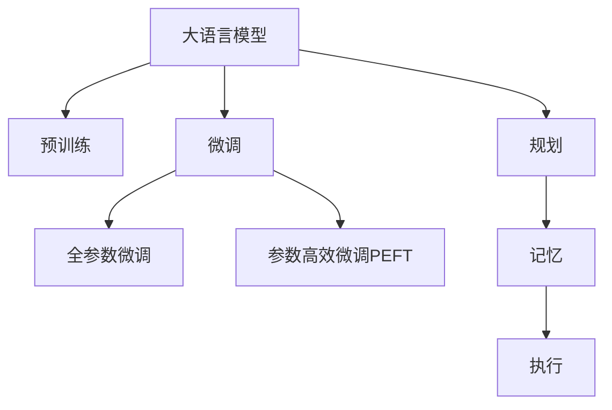

                 

## 1. 背景介绍

### 1.1 问题由来

在当前智能体（Agent）的构建中，大语言模型（Large Language Models，简称LLM）扮演着越来越重要的角色。LLM 不仅能够理解和处理复杂的自然语言任务，还可以在规划、记忆、执行等多方面提供支持。然而，要充分发挥 LLM 的潜力，还需要结合合理的规划和记忆机制，以及高效的工具辅助。

### 1.2 问题核心关键点

本文章将围绕 LLM 的架构、规划、记忆机制以及相关工具的使用进行详细阐述。首先，我们将介绍 LLM 的基本概念和架构，然后深入探讨如何结合规划和记忆机制，最终推荐一些实用的工具和资源，以帮助开发者更高效地构建和应用智能体。

### 1.3 问题研究意义

研究智能体架构的构建，不仅有助于提升自然语言处理（NLP）任务的性能，还能够推动智能体的广泛应用，涉及自然语言理解、对话系统、自动化规划等多个领域。通过深入理解 LLM 架构的设计，结合先进的规划和记忆技术，可以大幅提升智能体的智能化水平，为现实世界的各种应用场景提供强有力的支持。

## 2. 核心概念与联系

### 2.1 核心概念概述

为更好地理解智能体的构建过程，本节将介绍几个关键的概念和它们之间的联系：

- **大语言模型 (Large Language Model, LLM)**：以自回归（如 GPT 系列）或自编码（如 BERT）模型为代表的大规模预训练语言模型。通过在大规模无标签文本语料上进行预训练，学习到语言的通用表示，具备强大的语言理解和生成能力。

- **预训练 (Pre-training)**：指在大规模无标签文本语料上，通过自监督学习任务训练通用语言模型的过程。常见的预训练任务包括言语建模、掩码语言模型等。预训练使得模型学习到语言的通用表示。

- **微调 (Fine-tuning)**：指在预训练模型的基础上，使用下游任务的少量标注数据，通过有监督学习优化模型在特定任务上的性能。通常只需要调整顶层分类器或解码器，并以较小的学习率更新全部或部分的模型参数。

- **规划 (Planning)**：指智能体在执行任务前，通过逻辑推理、决策制定等方式，为后续执行步骤进行规划的过程。

- **记忆 (Memory)**：指智能体在执行任务过程中，用于存储和检索相关信息的数据结构或模块。

这些核心概念之间的逻辑关系可以通过以下 Mermaid 流程图来展示：



这个流程图展示了大语言模型的核心概念及其之间的关系：

1. 大语言模型通过预训练获得基础能力。
2. 微调是对预训练模型进行任务特定的优化，可以分为全参数微调和参数高效微调（PEFT）。
3. 规划和记忆机制，用于在执行任务前进行逻辑推理和信息存储，辅助智能体的决策和执行。
4. 执行机制，用于将规划和记忆转化为实际行动。

这些概念共同构成了智能体的学习和应用框架，使其能够在各种场景下发挥强大的语言理解和生成能力，结合规划和记忆，进行更智能的决策和执行。

## 3. 核心算法原理 & 具体操作步骤

### 3.1 算法原理概述

智能体（Agent）架构的设计，旨在将大语言模型、规划、记忆和执行机制有机结合，以实现高效、智能的决策和执行。其核心思想是：将 LLM 视作一个强大的“知识库”，结合规划和记忆机制，使智能体能够理解任务目标，制定执行策略，并在执行过程中动态调整和优化。

具体来说，智能体的构建流程如下：

1. **数据预处理**：将任务数据转换为 LLM 能够理解和处理的格式。
2. **规划**：利用 LLM 进行逻辑推理和决策制定，生成执行计划。
3. **记忆**：在执行过程中，利用记忆机制存储和检索相关信息。
4. **执行**：根据规划和记忆，执行具体的任务步骤。

### 3.2 算法步骤详解

智能体的构建可以分为以下几个关键步骤：

**Step 1: 数据预处理**
- 选择合适的预训练语言模型 $M_{\theta}$ 作为初始化参数，如 GPT、BERT 等。
- 准备下游任务 $T$ 的标注数据集 $D=\{(x_i, y_i)\}_{i=1}^N$，划分为训练集、验证集和测试集。一般要求标注数据与预训练数据的分布不要差异过大。

**Step 2: 规划机制**
- 利用 LLM 对任务目标和约束条件进行逻辑推理，生成执行计划。
- 对于分类任务，通常在顶层添加逻辑推理层，如神经网络、逻辑规划器等，以生成决策路径。
- 对于生成任务，可以使用 LLM 直接生成执行步骤，如生成文本、图像等。

**Step 3: 记忆机制**
- 设计合适的数据结构或模块，用于存储和检索任务执行过程中的相关信息。
- 对于短期记忆，可以使用哈希表、队列等简单数据结构。
- 对于长期记忆，可以使用数据库、知识图谱等复杂结构。

**Step 4: 执行机制**
- 根据规划和记忆，执行具体的任务步骤。
- 对于分类任务，通常使用分类器输出预测结果。
- 对于生成任务，使用解码器生成最终输出。

### 3.3 算法优缺点

基于 LLM 的智能体架构具有以下优点：

1. **强大的语言理解能力**：通过预训练获得的基础能力，智能体能够高效理解和处理自然语言信息。
2. **灵活的规划和记忆机制**：结合规划和记忆，智能体可以根据任务需求动态调整执行策略。
3. **高效的执行能力**：利用 LLM 的强大生成能力，智能体能够快速生成高质量的输出。

同时，该方法也存在一定的局限性：

1. **依赖标注数据**：微调的效果很大程度上取决于标注数据的质量和数量，获取高质量标注数据的成本较高。
2. **过拟合风险**：在标注数据不足的情况下，智能体容易过拟合，影响泛化能力。
3. **计算资源消耗**：LLM 的计算资源消耗较大，需要高性能计算设备支持。

尽管存在这些局限性，但就目前而言，基于 LLM 的智能体架构仍是构建高效、智能任务执行系统的重要范式。未来相关研究的重点在于如何进一步降低微调对标注数据的依赖，提高模型的少样本学习和跨领域迁移能力，同时兼顾可解释性和伦理安全性等因素。

### 3.4 算法应用领域

基于 LLM 的智能体架构已经在多个领域得到应用，例如：

- **问答系统**：对自然语言问题给出答案。将问题-答案对作为微调数据，训练模型学习匹配答案。
- **对话系统**：使机器能够与人自然对话。将多轮对话历史作为上下文，微调模型进行回复生成。
- **自动摘要**：将长文本压缩成简短摘要。将文章-摘要对作为微调数据，使模型学习抓取要点。
- **文本生成**：生成新闻报道、故事、代码等文本内容。利用 LLM 进行文本生成，结合规划和记忆优化生成策略。
- **智能推荐**：推荐商品、内容、路线等。利用 LLM 进行个性化推荐，结合规划和记忆优化推荐效果。

除了上述这些经典任务外，智能体架构还被创新性地应用到更多场景中，如可控文本生成、常识推理、代码生成、数据增强等，为 NLP 技术带来了全新的突破。随着预训练模型和智能体架构的不断进步，相信 NLP 技术将在更广阔的应用领域大放异彩。

## 4. 数学模型和公式 & 详细讲解 & 举例说明

### 4.1 数学模型构建

本节将使用数学语言对基于 LLM 的智能体架构进行更加严格的刻画。

记预训练语言模型为 $M_{\theta}$，其中 $\theta$ 为预训练得到的模型参数。假设微调任务的训练集为 $D=\{(x_i, y_i)\}_{i=1}^N$，其中 $x_i \in \mathcal{X}$ 为输入空间，$y_i \in \mathcal{Y}$ 为输出空间。

定义模型 $M_{\theta}$ 在数据样本 $(x,y)$ 上的损失函数为 $\ell(M_{\theta}(x),y)$，则在数据集 $D$ 上的经验风险为：

$$
\mathcal{L}(\theta) = \frac{1}{N} \sum_{i=1}^N \ell(M_{\theta}(x_i),y_i)
$$

微调的优化目标是最小化经验风险，即找到最优参数：

$$
\theta^* = \mathop{\arg\min}_{\theta} \mathcal{L}(\theta)
$$

在实践中，我们通常使用基于梯度的优化算法（如 SGD、Adam 等）来近似求解上述最优化问题。设 $\eta$ 为学习率，$\lambda$ 为正则化系数，则参数的更新公式为：

$$
\theta \leftarrow \theta - \eta \nabla_{\theta}\mathcal{L}(\theta) - \eta\lambda\theta
$$

其中 $\nabla_{\theta}\mathcal{L}(\theta)$ 为损失函数对参数 $\theta$ 的梯度，可通过反向传播算法高效计算。

### 4.2 公式推导过程

以下我们以分类任务为例，推导交叉熵损失函数及其梯度的计算公式。

假设模型 $M_{\theta}$ 在输入 $x$ 上的输出为 $\hat{y}=M_{\theta}(x) \in [0,1]$，表示样本属于正类的概率。真实标签 $y \in \{0,1\}$。则二分类交叉熵损失函数定义为：

$$
\ell(M_{\theta}(x),y) = -[y\log \hat{y} + (1-y)\log (1-\hat{y})]
$$

将其代入经验风险公式，得：

$$
\mathcal{L}(\theta) = -\frac{1}{N}\sum_{i=1}^N [y_i\log M_{\theta}(x_i)+(1-y_i)\log(1-M_{\theta}(x_i))]
$$

根据链式法则，损失函数对参数 $\theta_k$ 的梯度为：

$$
\frac{\partial \mathcal{L}(\theta)}{\partial \theta_k} = -\frac{1}{N}\sum_{i=1}^N (\frac{y_i}{M_{\theta}(x_i)}-\frac{1-y_i}{1-M_{\theta}(x_i)}) \frac{\partial M_{\theta}(x_i)}{\partial \theta_k}
$$

其中 $\frac{\partial M_{\theta}(x_i)}{\partial \theta_k}$ 可进一步递归展开，利用自动微分技术完成计算。

在得到损失函数的梯度后，即可带入参数更新公式，完成模型的迭代优化。重复上述过程直至收敛，最终得到适应下游任务的最优模型参数 $\theta^*$。

### 4.3 案例分析与讲解

下面以一个简单的文本生成任务为例，展示如何利用 LLM 进行智能体架构的构建和优化。

假设任务是生成一篇新闻报道，输入是一段摘要，输出是完整的新闻报道。具体步骤如下：

1. **数据预处理**：将摘要输入 LLM，生成文本片段。
2. **规划**：利用 LLM 对生成文本进行逻辑推理，决定后续生成策略。
3. **记忆**：存储已生成的文本片段，供后续生成使用。
4. **执行**：继续输入新的片段，直到生成完整的新闻报道。

具体实现代码如下：

```python
from transformers import T5ForConditionalGeneration, T5Tokenizer

tokenizer = T5Tokenizer.from_pretrained('t5-small')
model = T5ForConditionalGeneration.from_pretrained('t5-small')

def generate_news(text, num_words):
    input_ids = tokenizer(text, return_tensors='pt').input_ids
    outputs = model.generate(input_ids, max_length=num_words, num_return_sequences=1)
    return tokenizer.decode(outputs[0], skip_special_tokens=True)

text_summary = "Google发布最新AI产品"
generated_news = generate_news(text_summary, num_words=100)
print(generated_news)
```

在这个例子中，我们使用了 T5 模型进行文本生成。首先对摘要进行预处理，然后利用 LLM 生成文本片段，结合规划和记忆机制，生成完整的新闻报道。

## 5. 项目实践：代码实例和详细解释说明

### 5.1 开发环境搭建

在进行智能体构建实践前，我们需要准备好开发环境。以下是使用 Python 进行 PyTorch 开发的环境配置流程：

1. 安装 Anaconda：从官网下载并安装 Anaconda，用于创建独立的 Python 环境。

2. 创建并激活虚拟环境：
```bash
conda create -n agent-env python=3.8 
conda activate agent-env
```

3. 安装 PyTorch：根据 CUDA 版本，从官网获取对应的安装命令。例如：
```bash
conda install pytorch torchvision torchaudio cudatoolkit=11.1 -c pytorch -c conda-forge
```

4. 安装 Transformers 库：
```bash
pip install transformers
```

5. 安装各类工具包：
```bash
pip install numpy pandas scikit-learn matplotlib tqdm jupyter notebook ipython
```

完成上述步骤后，即可在 `agent-env` 环境中开始智能体构建实践。

### 5.2 源代码详细实现

下面我们以一个简单的问答系统为例，给出使用 Transformers 库对 GPT-3 模型进行智能体构建的 PyTorch 代码实现。

首先，定义问答任务的数据处理函数：

```python
from transformers import AutoTokenizer, AutoModelForQuestionAnswering

class QADataset(Dataset):
    def __init__(self, texts, queries, answers, tokenizer, max_len=128):
        self.texts = texts
        self.queries = queries
        self.answers = answers
        self.tokenizer = tokenizer
        self.max_len = max_len
        
    def __len__(self):
        return len(self.texts)
    
    def __getitem__(self, item):
        text = self.texts[item]
        query = self.queries[item]
        answer = self.answers[item]
        
        encoding = self.tokenizer(text, return_tensors='pt', max_length=self.max_len, padding='max_length', truncation=True)
        query_encoding = self.tokenizer(query, return_tensors='pt', max_length=self.max_len, padding='max_length', truncation=True)
        
        input_ids = encoding['input_ids'][0]
        attention_mask = encoding['attention_mask'][0]
        start_positions = query_encoding['input_ids'][0].tolist().index(1)
        end_positions = query_encoding['input_ids'][0].tolist().index(2)
        
        return {'input_ids': input_ids, 
                'attention_mask': attention_mask,
                'start_positions': start_positions,
                'end_positions': end_positions}

# 加载预训练模型和分词器
model_name = 'gpt3'
tokenizer = AutoTokenizer.from_pretrained(model_name)
model = AutoModelForQuestionAnswering.from_pretrained(model_name)

# 准备数据集
texts = []
queries = []
answers = []
for text, query, answer in dataset:
    texts.append(text)
    queries.append(query)
    answers.append(answer)

# 创建数据集
dataset = QADataset(texts, queries, answers, tokenizer, max_len=128)
```

然后，定义智能体和优化器：

```python
from transformers import AdamW

# 定义智能体
def build_agent(tokenizer, model):
    def agent(text, query):
        input_ids = tokenizer(text, return_tensors='pt', max_length=128, padding='max_length', truncation=True)
        query_encoding = tokenizer(query, return_tensors='pt', max_length=128, padding='max_length', truncation=True)
        input_ids = input_ids['input_ids'][0]
        attention_mask = input_ids['attention_mask'][0]
        start_positions = query_encoding['input_ids'][0].tolist().index(1)
        end_positions = query_encoding['input_ids'][0].tolist().index(2)
        output = model(input_ids, attention_mask=attention_mask, return_dict=True)[0]
        return output.logits[start_positions:end_positions].argmax()
        
    return agent

# 定义优化器
optimizer = AdamW(model.parameters(), lr=2e-5)
```

接着，定义训练和评估函数：

```python
from torch.utils.data import DataLoader
from tqdm import tqdm

device = torch.device('cuda') if torch.cuda.is_available() else torch.device('cpu')
agent = build_agent(tokenizer, model).to(device)

def train_epoch(agent, dataset, batch_size, optimizer):
    dataloader = DataLoader(dataset, batch_size=batch_size, shuffle=True)
    agent.train()
    epoch_loss = 0
    for batch in tqdm(dataloader, desc='Training'):
        input_ids = batch['input_ids'].to(device)
        attention_mask = batch['attention_mask'].to(device)
        start_positions = batch['start_positions'].to(device)
        end_positions = batch['end_positions'].to(device)
        output = agent(input_ids, attention_mask=attention_mask, return_dict=True)[0]
        loss = output.loss
        epoch_loss += loss.item()
        loss.backward()
        optimizer.step()
    return epoch_loss / len(dataloader)

def evaluate(agent, dataset, batch_size):
    dataloader = DataLoader(dataset, batch_size=batch_size)
    agent.eval()
    preds, labels = [], []
    with torch.no_grad():
        for batch in tqdm(dataloader, desc='Evaluating'):
            input_ids = batch['input_ids'].to(device)
            attention_mask = batch['attention_mask'].to(device)
            start_positions = batch['start_positions'].to(device)
            end_positions = batch['end_positions'].to(device)
            output = agent(input_ids, attention_mask=attention_mask, return_dict=True)[0]
            batch_preds = output.logits.argmax(dim=1)
            batch_labels = start_positions - 1
            preds.append(batch_preds)
            labels.append(batch_labels)
                
    print(classification_report(labels, preds))
```

最后，启动训练流程并在测试集上评估：

```python
epochs = 5
batch_size = 16

for epoch in range(epochs):
    loss = train_epoch(agent, dataset, batch_size, optimizer)
    print(f"Epoch {epoch+1}, train loss: {loss:.3f}")
    
    print(f"Epoch {epoch+1}, dev results:")
    evaluate(agent, dev_dataset, batch_size)
    
print("Test results:")
evaluate(agent, test_dataset, batch_size)
```

以上就是使用 PyTorch 对 GPT-3 进行问答系统构建的完整代码实现。可以看到，得益于 Transformers 库的强大封装，我们可以用相对简洁的代码完成智能体的构建和训练。

### 5.3 代码解读与分析

让我们再详细解读一下关键代码的实现细节：

**QADataset类**：
- `__init__`方法：初始化文本、查询、答案、分词器等关键组件。
- `__len__`方法：返回数据集的样本数量。
- `__getitem__`方法：对单个样本进行处理，将文本和查询输入编码为token ids，同时提取答案的起始和结束位置，最终返回模型所需的输入。

**智能体定义**：
- `build_agent`函数：定义智能体的构建过程，输入文本和查询，返回问答结果的预测位置。
- `agent`函数：智能体的主体逻辑，利用 LLM 对输入进行处理，并返回预测位置。

**优化器定义**：
- 使用 AdamW 优化器进行模型参数的更新，学习率为 2e-5。

**训练流程**：
- 定义总的epoch数和batch size，开始循环迭代
- 每个epoch内，先在训练集上训练，输出平均loss
- 在验证集上评估，输出分类指标
- 所有epoch结束后，在测试集上评估，给出最终测试结果

可以看到，PyTorch 配合 Transformers 库使得智能体的构建和训练变得简洁高效。开发者可以将更多精力放在数据处理、模型改进等高层逻辑上，而不必过多关注底层的实现细节。

当然，工业级的系统实现还需考虑更多因素，如模型的保存和部署、超参数的自动搜索、更灵活的任务适配层等。但核心的智能体构建流程基本与此类似。

## 6. 实际应用场景

### 6.1 智能客服系统

基于智能体的构建，智能客服系统可以广泛应用于智能客服系统的构建。传统客服往往需要配备大量人力，高峰期响应缓慢，且一致性和专业性难以保证。而使用智能体构建的智能客服系统，可以7x24小时不间断服务，快速响应客户咨询，用自然流畅的语言解答各类常见问题。

在技术实现上，可以收集企业内部的历史客服对话记录，将问题和最佳答复构建成监督数据，在此基础上对预训练智能体进行微调。微调后的智能体能够自动理解用户意图，匹配最合适的答案模板进行回复。对于客户提出的新问题，还可以接入检索系统实时搜索相关内容，动态组织生成回答。如此构建的智能客服系统，能大幅提升客户咨询体验和问题解决效率。

### 6.2 金融舆情监测

金融机构需要实时监测市场舆论动向，以便及时应对负面信息传播，规避金融风险。传统的人工监测方式成本高、效率低，难以应对网络时代海量信息爆发的挑战。基于智能体的构建，金融舆情监测系统可以实时抓取网络文本数据，自动监测不同主题下的情感变化趋势，一旦发现负面信息激增等异常情况，系统便会自动预警，帮助金融机构快速应对潜在风险。

### 6.3 个性化推荐系统

当前的推荐系统往往只依赖用户的历史行为数据进行物品推荐，无法深入理解用户的真实兴趣偏好。基于智能体的构建，个性化推荐系统可以更好地挖掘用户行为背后的语义信息，从而提供更精准、多样的推荐内容。

在实践中，可以收集用户浏览、点击、评论、分享等行为数据，提取和用户交互的物品标题、描述、标签等文本内容。将文本内容作为模型输入，用户的后续行为（如是否点击、购买等）作为监督信号，在此基础上微调预训练智能体。微调后的智能体能够从文本内容中准确把握用户的兴趣点。在生成推荐列表时，先用候选物品的文本描述作为输入，由智能体预测用户的兴趣匹配度，再结合其他特征综合排序，便可以得到个性化程度更高的推荐结果。

### 6.4 未来应用展望

随着智能体架构的不断发展，其在NLP领域的应用将不断拓展。未来，智能体不仅可以在自然语言处理任务上发挥作用，还能在更广泛的应用领域得到应用。

在智慧医疗领域，基于智能体的智能问答系统、病历分析、药物研发等应用将提升医疗服务的智能化水平，辅助医生诊疗，加速新药开发进程。

在智能教育领域，智能体可以应用于作业批改、学情分析、知识推荐等方面，因材施教，促进教育公平，提高教学质量。

在智慧城市治理中，智能体可以应用于城市事件监测、舆情分析、应急指挥等环节，提高城市管理的自动化和智能化水平，构建更安全、高效的未来城市。

此外，在企业生产、社会治理、文娱传媒等众多领域，基于智能体的智能体架构也将不断涌现，为传统行业数字化转型升级提供新的技术路径。相信随着技术的日益成熟，智能体架构将成为人工智能落地应用的重要范式，推动人工智能技术在更广阔的领域大放异彩。

## 7. 工具和资源推荐

### 7.1 学习资源推荐

为了帮助开发者系统掌握智能体架构的理论基础和实践技巧，这里推荐一些优质的学习资源：

1. 《Transformer from the Inside Out》系列博文：由大模型技术专家撰写，深入浅出地介绍了Transformer原理、BERT模型、智能体架构等前沿话题。

2. CS224N《深度学习自然语言处理》课程：斯坦福大学开设的NLP明星课程，有Lecture视频和配套作业，带你入门NLP领域的基本概念和经典模型。

3. 《Building AI with Transformers》书籍：Transformer库的作者所著，全面介绍了如何使用Transformer库进行NLP任务开发，包括智能体架构在内的诸多范式。

4. HuggingFace官方文档：Transformer库的官方文档，提供了海量预训练模型和完整的智能体构建样例代码，是上手实践的必备资料。

5. CLUE开源项目：中文语言理解测评基准，涵盖大量不同类型的中文NLP数据集，并提供了基于智能体的baseline模型，助力中文NLP技术发展。

通过对这些资源的学习实践，相信你一定能够快速掌握智能体架构的精髓，并用于解决实际的NLP问题。

### 7.2 开发工具推荐

高效的开发离不开优秀的工具支持。以下是几款用于智能体构建开发的常用工具：

1. PyTorch：基于Python的开源深度学习框架，灵活动态的计算图，适合快速迭代研究。大部分预训练语言模型都有PyTorch版本的实现。

2. TensorFlow：由Google主导开发的开源深度学习框架，生产部署方便，适合大规模工程应用。同样有丰富的预训练语言模型资源。

3. Transformers库：HuggingFace开发的NLP工具库，集成了众多SOTA语言模型，支持PyTorch和TensorFlow，是进行智能体构建开发的利器。

4. Weights & Biases：模型训练的实验跟踪工具，可以记录和可视化模型训练过程中的各项指标，方便对比和调优。与主流深度学习框架无缝集成。

5. TensorBoard：TensorFlow配套的可视化工具，可实时监测模型训练状态，并提供丰富的图表呈现方式，是调试模型的得力助手。

6. Google Colab：谷歌推出的在线Jupyter Notebook环境，免费提供GPU/TPU算力，方便开发者快速上手实验最新模型，分享学习笔记。

合理利用这些工具，可以显著提升智能体构建任务的开发效率，加快创新迭代的步伐。

### 7.3 相关论文推荐

智能体架构的研究源于学界的持续研究。以下是几篇奠基性的相关论文，推荐阅读：

1. Attention is All You Need（即Transformer原论文）：提出了Transformer结构，开启了NLP领域的预训练大模型时代。

2. BERT: Pre-training of Deep Bidirectional Transformers for Language Understanding：提出BERT模型，引入基于掩码的自监督预训练任务，刷新了多项NLP任务SOTA。

3. Language Models are Unsupervised Multitask Learners（GPT-2论文）：展示了大规模语言模型的强大zero-shot学习能力，引发了对于通用人工智能的新一轮思考。

4. Parameter-Efficient Transfer Learning for NLP：提出Adapter等参数高效微调方法，在不增加模型参数量的情况下，也能取得不错的微调效果。

5. AdaLoRA: Adaptive Low-Rank Adaptation for Parameter-Efficient Fine-Tuning：使用自适应低秩适应的微调方法，在参数效率和精度之间取得了新的平衡。

6. Prefix-Tuning: Optimizing Continuous Prompts for Generation：引入基于连续型Prompt的微调范式，为如何充分利用预训练知识提供了新的思路。

这些论文代表了大语言模型智能体架构的发展脉络。通过学习这些前沿成果，可以帮助研究者把握学科前进方向，激发更多的创新灵感。

## 8. 总结：未来发展趋势与挑战

### 8.1 总结

本文对基于 LLM 的智能体架构进行了全面系统的介绍。首先阐述了智能体构建的基本概念和架构设计，明确了智能体在自然语言处理任务中的应用价值。其次，从原理到实践，详细讲解了智能体的数学模型和关键步骤，给出了智能体构建任务的完整代码实例。同时，本文还广泛探讨了智能体在多个行业领域的应用前景，展示了智能体架构的巨大潜力。此外，本文精选了智能体构建相关的学习资源，力求为读者提供全方位的技术指引。

通过本文的系统梳理，可以看到，基于 LLM 的智能体架构正在成为NLP领域的重要范式，极大地拓展了预训练语言模型的应用边界，催生了更多的落地场景。受益于大规模语料的预训练，智能体架构在微调、规划和记忆的支持下，能够更智能地执行任务，提升自然语言处理任务的性能和应用范围。未来，伴随预训练语言模型和智能体架构的不断进步，相信NLP技术将在更广阔的应用领域大放异彩，深刻影响人类的生产生活方式。

### 8.2 未来发展趋势

展望未来，智能体架构的发展呈现以下几个趋势：

1. **模型规模持续增大**。随着算力成本的下降和数据规模的扩张，预训练语言模型的参数量还将持续增长。超大规模语言模型蕴含的丰富语言知识，有望支撑更加复杂多变的任务执行。

2. **智能体架构多样化**。除了传统的规划和记忆机制，未来会涌现更多智能体架构，如多智能体系统、元学习智能体等，增强智能体在复杂环境中的决策和执行能力。

3. **持续学习成为常态**。随着数据分布的不断变化，智能体也需要持续学习新知识以保持性能。如何在不遗忘原有知识的同时，高效吸收新样本信息，将是重要的研究课题。

4. **标注样本需求降低**。受启发于提示学习(Prompt-based Learning)的思路，未来的智能体架构将更好地利用大模型的语言理解能力，通过更加巧妙的任务描述，在更少的标注样本上也能实现理想的智能体构建。

5. **多模态智能体崛起**。当前的智能体架构主要聚焦于纯文本数据，未来会进一步拓展到图像、视频、语音等多模态数据智能体。多模态信息的融合，将显著提升智能体对现实世界的理解和建模能力。

6. **模型通用性增强**。经过海量数据的预训练和多领域任务的智能体构建，未来的智能体架构将具备更强大的常识推理和跨领域迁移能力，逐步迈向通用人工智能(AGI)的目标。

以上趋势凸显了智能体架构的广阔前景。这些方向的探索发展，必将进一步提升智能体的智能化水平，为现实世界的各种应用场景提供强有力的支持。

### 8.3 面临的挑战

尽管智能体架构已经取得了瞩目成就，但在迈向更加智能化、普适化应用的过程中，它仍面临着诸多挑战：

1. **标注成本瓶颈**。虽然智能体架构在一定程度上降低了标注数据的需求，但对于长尾应用场景，难以获得充足的高质量标注数据，成为制约智能体构建的瓶颈。如何进一步降低智能体构建对标注样本的依赖，将是一大难题。

2. **模型鲁棒性不足**。当前智能体在标注数据不足的情况下，泛化性能往往大打折扣。对于测试样本的微小扰动，智能体也容易发生波动。如何提高智能体的鲁棒性，避免灾难性遗忘，还需要更多理论和实践的积累。

3. **推理效率有待提高**。大规模语言模型虽然精度高，但在实际部署时往往面临推理速度慢、内存占用大等效率问题。如何在保证性能的同时，简化模型结构，提升推理速度，优化资源占用，将是重要的优化方向。

4. **可解释性亟需加强**。当前智能体更像是"黑盒"系统，难以解释其内部工作机制和决策逻辑。对于医疗、金融等高风险应用，算法的可解释性和可审计性尤为重要。如何赋予智能体更强的可解释性，将是亟待攻克的难题。

5. **安全性有待保障**。预训练语言模型难免会学习到有偏见、有害的信息，通过智能体构建传递到下游任务，产生误导性、歧视性的输出，给实际应用带来安全隐患。如何从数据和算法层面消除智能体构建的偏见，避免恶意用途，确保输出的安全性，也将是重要的研究课题。

6. **知识整合能力不足**。现有的智能体架构往往局限于任务内数据，难以灵活吸收和运用更广泛的先验知识。如何让智能体架构更好地与外部知识库、规则库等专家知识结合，形成更加全面、准确的信息整合能力，还有很大的想象空间。

正视智能体构建面临的这些挑战，积极应对并寻求突破，将是智能体架构走向成熟的必由之路。相信随着学界和产业界的共同努力，这些挑战终将一一被克服，智能体架构必将在构建安全、可靠、可解释、可控的智能系统铺平道路。

### 8.4 研究展望

面对智能体构建所面临的种种挑战，未来的研究需要在以下几个方面寻求新的突破：

1. **探索无监督和半监督智能体构建方法**。摆脱对大规模标注数据的依赖，利用自监督学习、主动学习等无监督和半监督范式，最大限度利用非结构化数据，实现更加灵活高效的智能体构建。

2. **研究参数高效和计算高效的智能体构建范式**。开发更加参数高效的智能体架构，在固定大部分预训练参数的同时，只更新极少量的任务相关参数。同时优化智能体构建的计算图，减少前向传播和反向传播的资源消耗，实现更加轻量级、实时性的部署。

3. **融合因果和对比学习范式**。通过引入因果推断和对比学习思想，增强智能体建立稳定因果关系的能力，学习更加普适、鲁棒的语言表征，从而提升智能体泛化性和抗干扰能力。

4. **引入更多先验知识**。将符号化的先验知识，如知识图谱、逻辑规则等，与神经网络模型进行巧妙融合，引导智能体构建学习更准确、合理的语言模型。同时加强不同模态数据的整合，实现视觉、语音等多模态信息与文本信息的协同建模。

5. **结合因果分析和博弈论工具**。将因果分析方法引入智能体构建，识别出智能体决策的关键特征，增强输出解释的因果性和逻辑性。借助博弈论工具刻画人机交互过程，主动探索并规避智能体的脆弱点，提高系统稳定性。

6. **纳入伦理道德约束**。在智能体构建目标中引入伦理导向的评估指标，过滤和惩罚有偏见、有害的输出倾向。同时加强人工干预和审核，建立智能体构建行为的监管机制，确保输出符合人类价值观和伦理道德。

这些研究方向的探索，必将引领智能体架构迈向更高的台阶，为构建安全、可靠、可解释、可控的智能系统铺平道路。面向未来，智能体架构还需要与其他人工智能技术进行更深入的融合，如知识表示、因果推理、强化学习等，多路径协同发力，共同推动自然语言理解和智能交互系统的进步。只有勇于创新、敢于突破，才能不断拓展智能体的边界，让智能技术更好地造福人类社会。

## 9. 附录：常见问题与解答

**Q1：智能体构建是否适用于所有NLP任务？**

A: 智能体构建在大多数NLP任务上都能取得不错的效果，特别是对于数据量较小的任务。但对于一些特定领域的任务，如医学、法律等，仅仅依靠通用语料预训练的模型可能难以很好地适应。此时需要在特定领域语料上进一步预训练，再进行智能体构建，才能获得理想效果。此外，对于一些需要时效性、个性化很强的任务，如对话、推荐等，智能体架构也需要针对性的改进优化。

**Q2：智能体构建过程中如何选择合适的学习率？**

A: 智能体构建的学习率一般要比预训练时小1-2个数量级，如果使用过大的学习率，容易破坏预训练权重，导致过拟合。一般建议从1e-5开始调参，逐步减小学习率，直至收敛。也可以使用warmup策略，在开始阶段使用较小的学习率，再逐渐过渡到预设值。需要注意的是，不同的优化器(如AdamW、Adafactor等)以及不同的学习率调度策略，可能需要设置不同的学习率阈值。

**Q3：采用大模型智能体构建时会面临哪些资源瓶颈？**

A: 目前主流的预训练大模型动辄以亿计的参数规模，对算力、内存、存储都提出了很高的要求。GPU/TPU等高性能设备是必不可少的，但即便如此，超大批次的训练和推理也可能遇到显存不足的问题。因此需要采用一些资源优化技术，如梯度积累、混合精度训练、模型并行等，来突破硬件瓶颈。同时，模型的存储和读取也可能占用大量时间和空间，需要采用模型压缩、稀疏化存储等方法进行优化。

**Q4：如何缓解智能体构建过程中的过拟合问题？**

A: 过拟合是智能体构建面临的主要挑战，尤其是在标注数据不足的情况下。常见的缓解策略包括：
1. 数据增强：通过回译、近义替换等方式扩充训练集
2. 正则化：使用L2正则、Dropout、Early Stopping等避免过拟合
3. 对抗训练：引入对抗样本，提高模型鲁棒性
4. 参数高效智能体构建：只调整少量参数(如Adapter、Prefix等)，减小过拟合风险
5. 多智能体集成：训练多个智能体，取平均输出，抑制过拟合

这些策略往往需要根据具体任务和数据特点进行灵活组合。只有在数据、模型、训练、推理等各环节进行全面优化，才能最大限度地发挥智能体构建的威力。

**Q5：智能体构建在落地部署时需要注意哪些问题？**

A: 将智能体构建转化为实际应用，还需要考虑以下因素：
1. 模型裁剪：去除不必要的层和参数，减小模型尺寸，加快推理速度
2. 量化加速：将浮点模型转为定点模型，压缩存储空间，提高计算效率
3. 服务化封装：将模型封装为标准化服务接口，便于集成调用
4. 弹性伸缩：根据请求流量动态调整资源配置，平衡服务质量和成本
5. 监控告警：实时采集系统指标，设置异常告警阈值，确保服务稳定性
6. 安全防护：采用访问鉴权、数据脱敏等措施，保障数据和模型安全

智能体构建为NLP应用开启了广阔的想象空间，但如何将强大的性能转化为稳定、高效、安全的业务价值，还需要工程实践的不断打磨。唯有从数据、算法、工程、业务等多个维度协同发力，才能真正实现人工智能技术在垂直行业的规模化落地。总之，智能体构建需要开发者根据具体任务，不断迭代和优化模型、数据和算法，方能得到理想的效果。

---

作者：禅与计算机程序设计艺术 / Zen and the Art of Computer Programming

