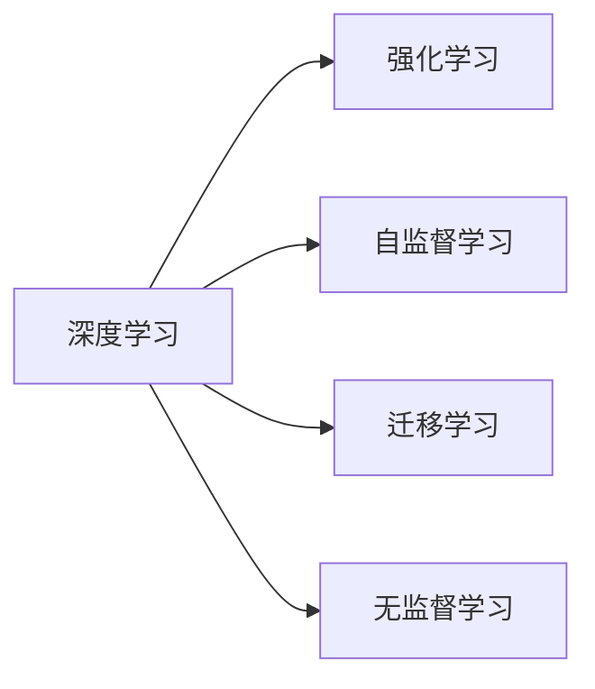

                 

## 1. 背景介绍

Andrej Karpathy，这位来自斯坦福大学的教授、计算机视觉领域的权威，同时也是人工智能领域的先锋，他对AI的未来有着深刻而独到的见解。在过去数十年间，Karpathy一直站在技术创新的前沿，探索AI技术的边界。本文将基于Karpathy的一系列访谈、演讲和论文，深入探讨AI未来的可能方向，给读者一个全面的AI未来视角。

## 2. 核心概念与联系

### 2.1 核心概念概述

在AI的探索之旅中，有许多关键概念塑造了它的发展轨迹。以下是几个最为核心的概念，它们共同构成了AI的框架：

- **深度学习**：一种模仿人类大脑神经网络的算法，通过多层非线性变换，实现了复杂数据的建模和预测。
- **强化学习**：一种通过与环境交互，优化行为策略的学习方式，广泛应用于机器人控制、游戏AI等领域。
- **自监督学习**：无需标注数据，通过最大化模型预测的上下文一致性，实现知识抽取和表示学习。
- **迁移学习**：利用已有知识，在新任务上快速适应的学习策略，广泛应用于自然语言处理和计算机视觉。
- **无监督学习**：在没有标签的情况下，从数据中自动发现模式和结构的学习方式。

这些概念之间存在着紧密的联系，如图中所示：



深度学习是所有这些方法的基础，而自监督、迁移和无监督学习则是深度学习的重要补充，共同构建了AI的强大能力。强化学习则专注于行为决策的优化，为AI提供了动态适应环境的能力。

## 3. 核心算法原理 & 具体操作步骤

### 3.1 算法原理概述

Karpathy对AI的深刻理解，源于他对深度学习算法原理的透彻把握。深度学习的核心在于通过多层神经网络的非线性变换，从输入数据中学习到复杂的特征表示，从而实现对数据的理解和预测。以下是深度学习的一些核心原理：

- **前向传播**：输入数据经过多层非线性变换，生成预测输出。
- **反向传播**：根据预测输出与实际输出的误差，反向计算梯度，更新模型参数。
- **损失函数**：衡量预测输出与实际输出之间的差异，常用的有交叉熵、均方误差等。
- **优化算法**：如梯度下降、Adam等，用于调整模型参数以最小化损失函数。

这些原理构成了深度学习的核心框架，使得AI系统能够处理复杂的数据，进行高效的预测和决策。

### 3.2 算法步骤详解

深度学习的训练过程通常包括以下步骤：

1. **数据准备**：收集和预处理数据，将其转化为模型可以处理的格式。
2. **模型构建**：选择合适的神经网络架构，定义模型的输入、输出和参数。
3. **前向传播**：将输入数据输入模型，计算预测输出。
4. **损失计算**：根据预测输出和实际输出，计算损失值。
5. **反向传播**：计算损失函数对模型参数的梯度，更新模型参数。
6. **迭代更新**：重复上述步骤，直到模型收敛或达到预设的迭代次数。

以Karpathy在计算机视觉中的研究为例，他经常使用卷积神经网络(CNN)来处理图像数据。CNN通过卷积层、池化层和全连接层，实现了对图像特征的有效提取和表示。

### 3.3 算法优缺点

深度学习在处理复杂数据和进行高精度预测方面有着显著优势，但也存在一些不足：

- **数据需求大**：深度学习需要大量的标注数据进行训练，数据获取和标注成本较高。
- **计算资源消耗高**：深度学习模型通常具有亿级别的参数，训练和推理时需要大量的计算资源。
- **模型复杂度高**：深度学习模型结构复杂，难以解释其内部工作机制。

Karpathy认为，尽管存在这些挑战，但深度学习仍然是AI的核心驱动力。未来，需要通过算法创新和硬件优化，克服这些挑战，进一步提升AI的性能。

### 3.4 算法应用领域

深度学习在多个领域得到了广泛应用：

- **计算机视觉**：如图像分类、目标检测、图像生成等任务。
- **自然语言处理**：如机器翻译、文本生成、问答系统等。
- **语音识别**：如自动语音识别、语音合成等。
- **推荐系统**：如电商推荐、音乐推荐等。

Karpathy的研究涵盖了计算机视觉和自然语言处理等多个领域，为AI技术在这些关键领域的发展做出了重要贡献。

## 4. 数学模型和公式 & 详细讲解 & 举例说明

### 4.1 数学模型构建

Karpathy对数学模型的构建有着独到的见解。他常使用卷积神经网络来处理图像数据，其数学模型如下：

$$
h = \sigma(W_1 z + b_1)
$$

$$
h = \sigma(W_2 h + b_2)
$$

$$
y = softmax(W_3 h + b_3)
$$

其中，$z$ 为输入图像，$h$ 为卷积层的特征表示，$y$ 为最终预测输出。$\sigma$ 为激活函数，$W$ 和 $b$ 分别为卷积核和偏置项。

### 4.2 公式推导过程

以图像分类为例，Karpathy推导了深度学习模型的分类过程。假设模型的输出为 $y_i$，其中 $i$ 表示第 $i$ 个类别的概率，模型最终的预测结果为 $y_i$ 最大的类别。具体推导如下：

- **前向传播**：将输入图像 $z$ 通过多层卷积和池化操作，生成特征表示 $h$。
- **分类层**：将特征表示 $h$ 输入全连接层，得到预测结果 $y$。
- **损失计算**：使用交叉熵损失函数计算预测结果与真实标签之间的差异。
- **反向传播**：根据损失函数对模型参数进行梯度下降更新。

### 4.3 案例分析与讲解

Karpathy曾使用深度学习技术，成功训练了一个图像分类器，实现了对各种物体的高精度识别。具体步骤如下：

1. **数据收集**：收集大量图像数据，并进行预处理，包括图像缩放、归一化等操作。
2. **模型构建**：选择卷积神经网络作为模型架构，并定义输入、输出和参数。
3. **训练模型**：使用随机梯度下降优化算法，在训练集上进行模型训练。
4. **验证模型**：在验证集上评估模型性能，调整模型参数。
5. **测试模型**：在测试集上测试模型，评估最终性能。

Karpathy通过这些步骤，成功构建了一个高效准确的图像分类器，展示了深度学习在计算机视觉领域的应用潜力。

## 5. 项目实践：代码实例和详细解释说明

### 5.1 开发环境搭建

Karpathy常用PyTorch作为深度学习框架，进行模型的开发和训练。以下是搭建PyTorch开发环境的步骤：

1. **安装Python**：确保Python版本为3.6或更高。
2. **安装PyTorch**：使用pip安装，如 `pip install torch torchvision torchaudio`。
3. **安装其他依赖**：安装Numpy、Pandas、Matplotlib等常用库。
4. **配置开发环境**：设置Python环境变量，确保开发环境中存在必要的库和工具。

### 5.2 源代码详细实现

以下是使用PyTorch实现图像分类的代码：

```python
import torch
import torch.nn as nn
import torch.optim as optim
from torchvision import datasets, transforms

# 定义卷积神经网络
class Net(nn.Module):
    def __init__(self):
        super(Net, self).__init__()
        self.conv1 = nn.Conv2d(3, 32, 3)
        self.pool = nn.MaxPool2d(2, 2)
        self.conv2 = nn.Conv2d(32, 64, 3)
        self.fc1 = nn.Linear(64 * 4 * 4, 256)
        self.fc2 = nn.Linear(256, 10)
    
    def forward(self, x):
        x = self.pool(nn.functional.relu(self.conv1(x)))
        x = self.pool(nn.functional.relu(self.conv2(x)))
        x = x.view(-1, 64 * 4 * 4)
        x = nn.functional.relu(self.fc1(x))
        x = self.fc2(x)
        return nn.functional.softmax(x, dim=1)

# 数据预处理
transform = transforms.Compose([transforms.ToTensor(), transforms.Normalize((0.5,), (0.5,))])

train_dataset = datasets.CIFAR10('data', train=True, download=True, transform=transform)
test_dataset = datasets.CIFAR10('data', train=False, download=True, transform=transform)

# 定义模型和优化器
net = Net()
optimizer = optim.SGD(net.parameters(), lr=0.001, momentum=0.9)
criterion = nn.CrossEntropyLoss()

# 训练模型
for epoch in range(2):
    running_loss = 0.0
    for i, data in enumerate(train_loader, 0):
        inputs, labels = data
        optimizer.zero_grad()
        outputs = net(inputs)
        loss = criterion(outputs, labels)
        loss.backward()
        optimizer.step()
        running_loss += loss.item()
        if i % 2000 == 1999:
            print(f'Epoch {epoch+1}, loss: {running_loss/20000:.4f}')
            running_loss = 0.0

# 测试模型
correct = 0
total = 0
with torch.no_grad():
    for data in test_loader:
        images, labels = data
        outputs = net(images)
        _, predicted = torch.max(outputs.data, 1)
        total += labels.size(0)
        correct += (predicted == labels).sum().item()

print(f'Accuracy: {(100 * correct / total):.2f}%')
```

### 5.3 代码解读与分析

上述代码中，定义了一个简单的卷积神经网络，用于图像分类任务。使用SGD优化算法进行模型训练，交叉熵损失函数进行损失计算。代码的核心在于模型的定义和训练过程。

**模型定义**：使用PyTorch的nn.Module类定义了一个包含卷积、池化和全连接层的卷积神经网络。

**数据预处理**：使用torchvision库加载CIFAR-10数据集，并进行归一化等预处理操作。

**训练过程**：在训练集上进行前向传播、损失计算和反向传播，更新模型参数。使用SGD优化算法进行优化。

**测试过程**：在测试集上进行前向传播，计算分类准确率。

## 6. 实际应用场景

Karpathy的研究不仅限于理论研究，他的工作在实际应用中也有着广泛的影响。以下是他的一些实际应用场景：

### 6.1 自动驾驶

Karpathy曾参与开发了特斯拉的自动驾驶系统，该系统通过深度学习技术，实现了对复杂交通环境的感知和决策。系统通过摄像头和传感器收集数据，使用卷积神经网络进行图像识别和特征提取，实现对交通标志、行人、车辆等目标的识别，从而做出安全和高效的驾驶决策。

### 6.2 游戏AI

Karpathy在视频游戏AI领域也有着重要贡献。他使用深度学习技术，训练了多个游戏AI模型，使其能够进行复杂的任务，如角色控制、环境推理等。这些AI模型在游戏竞技、模拟训练等领域得到了广泛应用。

### 6.3 医学影像分析

Karpathy在医学影像分析领域的研究，使得深度学习技术在疾病诊断和影像分析中得到了应用。他使用深度学习模型，对医学影像进行分类和分割，辅助医生进行疾病诊断和手术规划。

## 7. 工具和资源推荐

### 7.1 学习资源推荐

- **《深度学习》书籍**：由Ian Goodfellow等著，全面介绍了深度学习的基本概念和核心算法。
- **DeepLearning.AI课程**：Andrew Ng教授开设的深度学习课程，涵盖深度学习的基础知识和高级技术。
- **arXiv论文库**：全球最大的学术论文库，包含大量前沿的AI研究论文。

### 7.2 开发工具推荐

- **PyTorch**：灵活易用的深度学习框架，支持动态图和静态图。
- **TensorFlow**：强大的深度学习框架，支持分布式训练和部署。
- **TensorBoard**：用于可视化模型训练过程和结果的强大工具。
- **Jupyter Notebook**：支持数据处理、模型训练和可视化等操作的交互式编程环境。

### 7.3 相关论文推荐

- **ImageNet大规模视觉识别挑战赛**：Karpathy在该比赛中提出的RNN+CNN模型，实现了对大规模图像分类任务的高精度识别。
- **DeepMind AlphaGo**：Karpathy参与了AlphaGo的开发，该系统使用深度学习技术，实现了对围棋游戏的智能化。
- **Hierarchical Attention Networks for Document Classification**：Karpathy的研究论文，提出了层次化注意力网络，实现了对文档分类的高效处理。

## 8. 总结：未来发展趋势与挑战

### 8.1 研究成果总结

Karpathy在深度学习领域的研究成果丰硕，涉及图像识别、自然语言处理、游戏AI等多个方向。他的工作不仅推动了AI技术的发展，还为多个实际应用场景提供了技术支持。

### 8.2 未来发展趋势

Karpathy对AI未来的发展趋势有着深刻的洞察：

- **多模态学习**：未来的AI将更加注重多模态数据的学习，如视觉、语音、文本等多模态信息的融合，提升系统的理解和生成能力。
- **模型解释性**：AI系统的可解释性将成为未来研究的重要方向，使得系统的决策过程更加透明和可信。
- **泛化能力**：未来的AI系统将更加注重泛化能力，能够在不同的环境和场景中，稳定、高效地进行预测和决策。

### 8.3 面临的挑战

尽管AI技术在多个领域得到了广泛应用，但仍面临以下挑战：

- **数据隐私**：AI系统需要大量的数据进行训练，但数据隐私和安全问题成为限制因素。
- **计算资源**：深度学习模型需要大量的计算资源进行训练和推理，如何降低计算成本是一个重要问题。
- **模型鲁棒性**：AI系统容易受到对抗样本和环境变化的干扰，提高模型的鲁棒性是未来的一个重要研究方向。

### 8.4 研究展望

面对未来，Karpathy提出了以下研究方向：

- **对抗学习**：研究如何增强模型的鲁棒性，抵御对抗样本攻击。
- **模型压缩**：研究如何降低模型的计算和存储成本，提高模型效率。
- **多模态融合**：研究如何融合多模态数据，提升系统的理解和生成能力。

通过这些研究方向的探索，Karpathy相信未来的AI技术将更加智能、可靠和高效，为人类带来更多的便利和创新。

## 9. Andrej Karpathy谈AI的未来

Andrej Karpathy对AI的未来有着深刻的洞察和独到的见解。他认为，未来的AI将更加注重数据隐私、计算效率和模型鲁棒性，同时融合多模态数据，提升系统的理解和生成能力。他坚信，通过不断的技术创新和优化，AI将更好地服务于人类，推动社会的进步和发展。

**作者**：禅与计算机程序设计艺术 / Zen and the Art of Computer Programming

