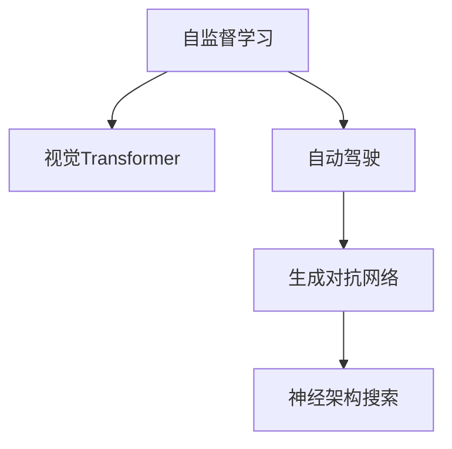

                 

# Andrej Karpathy：人工智能的未来创新

> 关键词：Andrej Karpathy, 人工智能, 深度学习, 创新, 未来展望

## 1. 背景介绍

### 1.1 问题由来

Andrej Karpathy 是深度学习领域的先驱之一，被誉为“深度学习界的达芬奇”。作为Stanford大学的计算机科学教授，他的研究工作涵盖了计算机视觉、自然语言处理、自动驾驶等多个前沿领域。Karpathy 的创新理念和对技术的深刻理解，使他成为推动AI技术发展的关键力量。

在当前人工智能快速发展的背景下，深度学习技术已经广泛应用于各个领域，从自动驾驶到自然语言处理，从图像识别到游戏AI，深度学习展现出了强大的应用潜力。然而，随着技术的不断进步，也带来了新的挑战和机遇。如何引领AI技术走向新的高峰，成为学界和产业界共同关注的热点。

### 1.2 问题核心关键点

Karpathy 在深度学习领域的创新，主要体现在以下几个方面：

- **自监督学习**：在缺乏大量标注数据的情况下，自监督学习可以充分利用数据的隐含信息，进行有效的特征学习。Karpathy 的研究在图像、语言等多个领域展示了自监督学习的重要价值。

- **视觉Transformer**：Karpathy 提出的视觉Transformer模型，大幅提升了图像处理和识别效率，成为视觉领域的重要工具。

- **自动驾驶**：Karpathy 在自动驾驶技术上进行了深入探索，推动了自动驾驶从理论到实践的突破。

- **生成对抗网络**：Karpathy 在生成对抗网络（GANs）研究中取得了重要进展，推动了生成模型在图像生成、语音合成等领域的广泛应用。

- **神经架构搜索**：Karpathy 提出了神经架构搜索（NAS）方法，通过自动设计模型结构，提高了深度学习模型的训练效率和性能。

Karpathy 的研究成果不仅丰富了深度学习的基础理论，还推动了AI技术的实际应用，为未来AI的发展奠定了坚实基础。

### 1.3 问题研究意义

Andrej Karpathy 的研究对于推动AI技术的发展具有重要意义：

- **理论创新**：通过提出一系列新的算法和模型，Karpathy 为深度学习领域注入了新的活力，推动了相关理论的进步。
- **应用拓展**：Karpathy 的研究成果在自动驾驶、计算机视觉等实际应用中得到了广泛验证，推动了AI技术的产业化进程。
- **跨学科融合**：Karpathy 的工作展示了AI技术在多学科融合中的潜力，促进了计算机科学、物理学、数学等多领域的交叉合作。
- **未来导向**：Karpathy 的研究不仅关注当下的问题解决，还着眼于AI技术的长期发展，为未来的研究指明了方向。

## 2. 核心概念与联系

### 2.1 核心概念概述

为了更好地理解Andrej Karpathy的研究，本节将介绍几个关键概念：

- **自监督学习(Self-Supervised Learning)**：在缺乏标注数据的情况下，利用数据本身的结构信息进行特征学习，从而提升模型性能。
- **视觉Transformer(Visual Transformer, ViT)**：一种结合了Transformer架构和卷积神经网络（CNN）的视觉处理模型，在图像识别和处理中表现出优异性能。
- **自动驾驶(Autonomous Driving)**：通过AI技术实现车辆的自主驾驶，提升交通安全和效率。
- **生成对抗网络(Generative Adversarial Networks, GANs)**：由两个神经网络（生成器和判别器）相互博弈，产生高质量的生成内容。
- **神经架构搜索(Neural Architecture Search, NAS)**：通过自动化搜索算法设计最优的神经网络结构，提升深度学习模型的训练效率和性能。

这些概念之间的逻辑关系可以通过以下Mermaid流程图来展示：



这个流程图展示了Karpathy在AI研究中不同概念之间的联系：

1. 自监督学习可以应用于视觉Transformer和自动驾驶，提升模型的泛化能力和鲁棒性。
2. 视觉Transformer在生成对抗网络中得到应用，进一步提升了生成模型的生成质量。
3. 自动驾驶中的感知技术可以借助视觉Transformer进行图像处理和分析。
4. 神经架构搜索可以在生成对抗网络中自动设计生成器和判别器的结构，提高生成模型的性能。

这些概念共同构成了Karpathy的研究框架，展示了AI技术在多个领域的应用和创新。

## 3. 核心算法原理 & 具体操作步骤
### 3.1 算法原理概述

Karpathy 在深度学习领域的研究，主要以创新算法和模型为代表，以下是其中的几个核心算法：

- **自监督学习**：利用数据的隐含信息，通过无监督的方式学习特征。Karpathy 的研究展示了自监督学习在图像、语言等多个领域的潜力，提升了深度学习模型的泛化能力和鲁棒性。
- **视觉Transformer**：结合Transformer和CNN的优点，显著提升了图像处理的效率和准确性。Karpathy 的视觉Transformer模型，在ImageNet等大规模视觉识别任务上取得了优异表现。
- **自动驾驶**：通过融合计算机视觉、深度学习等技术，实现了车辆的自主驾驶。Karpathy 的研究推动了自动驾驶从理论到实践的突破。
- **生成对抗网络**：通过两个相互博弈的神经网络，生成高质量的图像、音频等内容。Karpathy 在GANs研究中提出了一系列改进算法，如StyleGAN、Conditional GAN等，提升了生成模型的生成质量和多样性。
- **神经架构搜索**：通过自动化算法设计最优的神经网络结构，提升了深度学习模型的训练效率和性能。Karpathy 的NAS方法，在ImageNet等大规模视觉识别任务中取得了不俗的性能。

### 3.2 算法步骤详解

以自监督学习为例，Karpathy 在图像领域的研究步骤如下：

1. **数据准备**：收集大规模的无标签图像数据集，如ImageNet等。
2. **特征提取**：使用预训练的神经网络（如ResNet）提取图像的特征表示。
3. **任务设计**：设计自监督学习任务，如图像补全、颜色填充等。
4. **模型训练**：在自监督学习任务上训练模型，学习图像的隐含信息。
5. **迁移应用**：将自监督学习得到的特征表示应用于下游视觉识别任务，提升识别准确性。

以生成对抗网络为例，Karpathy 在图像生成领域的研究步骤如下：

1. **模型构建**：构建生成器和判别器两个神经网络。
2. **目标函数**：设计生成器和判别器之间的博弈目标函数。
3. **训练过程**：交替训练生成器和判别器，直到生成器和判别器达到平衡状态。
4. **生成结果**：使用训练好的生成器生成高质量的图像。

以神经架构搜索为例，Karpathy 在图像分类任务中的研究步骤如下：

1. **搜索空间设计**：定义搜索空间，包括神经网络的层数、节点数、连接方式等。
2. **评估标准**：定义搜索的评估标准，如模型精度、计算效率等。
3. **搜索算法**：使用自动化搜索算法（如NASNet）搜索最优的神经网络结构。
4. **模型训练**：在搜索得到的最优结构上训练模型，验证其性能。

### 3.3 算法优缺点

Karpathy 的研究方法具有以下优点：

- **算法创新**：提出了多项创新算法，如视觉Transformer、NAS等，推动了深度学习技术的进步。
- **应用广泛**：研究成果涵盖了计算机视觉、自动驾驶、生成对抗网络等多个领域，具有广泛的应用前景。
- **模型高效**：通过自监督学习和神经架构搜索，提升了模型的训练效率和性能，降低了计算资源的需求。
- **成果显著**：在ImageNet等大规模数据集上取得了优异的表现，展示了深度学习技术的高效性和可行性。

同时，这些方法也存在一些缺点：

- **模型复杂**：自监督学习、生成对抗网络等方法需要构建复杂的神经网络模型，增加了模型设计和训练的复杂性。
- **数据需求高**：生成对抗网络和神经架构搜索等方法需要大量数据和计算资源，对硬件条件提出了较高要求。
- **结果解释难**：深度学习模型的决策过程通常缺乏可解释性，难以解释其内部工作机制和推理逻辑。

尽管存在这些局限性，Karpathy 的研究方法依然为深度学习的发展提供了重要思路，推动了AI技术在多个领域的应用。

### 3.4 算法应用领域

Karpathy 的研究成果广泛应用于以下几个领域：

- **计算机视觉**：在图像分类、物体检测、图像生成等任务上取得了优异表现。
- **自动驾驶**：推动了自动驾驶技术的进展，提升了交通安全和效率。
- **自然语言处理**：在语言生成、情感分析、对话系统等任务上展示了深度学习技术的潜力。
- **生成对抗网络**：在图像生成、语音合成等领域推动了生成模型的广泛应用。
- **神经架构搜索**：在图像分类、目标检测等任务上提高了模型的训练效率和性能。

这些应用展示了Karpathy 研究方法的广泛影响力和实际价值。

## 4. 数学模型和公式 & 详细讲解 & 举例说明

### 4.1 数学模型构建

Karpathy 在深度学习领域的研究，涉及多个数学模型和算法。以下是几个典型的数学模型和公式：

- **自监督学习模型**：通过无监督的方式学习图像特征，提升模型的泛化能力。
- **视觉Transformer模型**：结合Transformer和CNN的优点，提升图像处理的效率和准确性。
- **生成对抗网络模型**：通过两个相互博弈的神经网络，生成高质量的图像。

### 4.2 公式推导过程

以生成对抗网络为例，Karpathy 在生成对抗网络研究中提出了以下公式：

1. **生成器模型**：
   $$
   G(z) = W_1(z), \quad W_1 \in \mathbb{R}^{C \times H \times W}
   $$
   其中 $z$ 为噪声向量，$W_1$ 为生成器权重矩阵。

2. **判别器模型**：
   $$
   D(x) = W_2(x), \quad W_2 \in \mathbb{R}^{1 \times H \times W}
   $$
   其中 $x$ 为输入图像，$W_2$ 为判别器权重矩阵。

3. **生成器和判别器博弈**：
   $$
   L(G, D) = \mathbb{E}_{x \sim p(x)} [\log D(x)] + \mathbb{E}_{z \sim p(z)} [\log(1 - D(G(z)))]
   $$
   其中 $p(x)$ 为真实图像分布，$p(z)$ 为噪声向量分布。

这些公式展示了生成对抗网络的基本结构和训练过程，展示了Karpathy 在生成对抗网络研究中的创新思路。

### 4.3 案例分析与讲解

以视觉Transformer为例，Karpathy 的视觉Transformer模型在ImageNet数据集上展示了以下特点：

1. **模型结构**：将Transformer架构应用于图像处理，提升了图像处理的效率和准确性。
2. **预训练过程**：通过在大规模数据集上预训练视觉Transformer模型，学习图像的隐含信息。
3. **迁移应用**：将预训练的视觉Transformer模型应用于下游视觉识别任务，提升识别准确性。

通过这些案例，展示了Karpathy 在深度学习领域的创新理念和应用思路。

## 5. 项目实践：代码实例和详细解释说明

### 5.1 开发环境搭建

在进行Karpathy 的研究实践前，我们需要准备好开发环境。以下是使用Python进行TensorFlow开发的环境配置流程：

1. 安装Anaconda：从官网下载并安装Anaconda，用于创建独立的Python环境。

2. 创建并激活虚拟环境：
   ```bash
   conda create -n tf-env python=3.8 
   conda activate tf-env
   ```

3. 安装TensorFlow：根据CUDA版本，从官网获取对应的安装命令。例如：
   ```bash
   conda install tensorflow tensorflow-estimator tensorflow-gpu -c conda-forge
   ```

4. 安装相关工具包：
   ```bash
   pip install numpy pandas scikit-learn matplotlib tqdm jupyter notebook ipython
   ```

完成上述步骤后，即可在`tf-env`环境中开始Karpathy 的研究实践。

### 5.2 源代码详细实现

下面以生成对抗网络为例，给出使用TensorFlow实现生成对抗网络的代码。

```python
import tensorflow as tf
from tensorflow.keras import layers

# 定义生成器和判别器
class Generator(tf.keras.Model):
    def __init__(self, latent_dim):
        super(Generator, self).__init__()
        self.latent_dim = latent_dim
        self.dense1 = layers.Dense(256)
        self.dense2 = layers.Dense(512)
        self.dense3 = layers.Dense(1024)
        self.dense4 = layers.Dense(784)

    def call(self, inputs):
        x = self.dense1(inputs)
        x = layers.LeakyReLU(0.2)(x)
        x = self.dense2(x)
        x = layers.LeakyReLU(0.2)(x)
        x = self.dense3(x)
        x = layers.LeakyReLU(0.2)(x)
        x = self.dense4(x)
        return x

class Discriminator(tf.keras.Model):
    def __init__(self):
        super(Discriminator, self).__init__()
        self.dense1 = layers.Dense(1024)
        self.dense2 = layers.Dense(512)
        self.dense3 = layers.Dense(256)
        self.dense4 = layers.Dense(1)

    def call(self, inputs):
        x = self.dense1(inputs)
        x = layers.LeakyReLU(0.2)(x)
        x = self.dense2(x)
        x = layers.LeakyReLU(0.2)(x)
        x = self.dense3(x)
        x = layers.LeakyReLU(0.2)(x)
        x = self.dense4(x)
        return x

# 定义生成器和判别器的损失函数和优化器
def generator_loss(generated_images, real_images, d_real, d_fake):
    g_loss = d_fake
    return g_loss

def discriminator_loss(real_images, generated_images, d_real, d_fake):
    d_loss_real = d_real
    d_loss_fake = d_fake
    return d_loss_real + d_loss_fake

def calculate_gradients(model, loss):
    gradients = tf.GradientTape()  # 记录梯度
    with gradients:
        loss = loss(model)
    return gradients.gradient(loss, model.trainable_variables)

# 训练生成对抗网络
def train_gan(generator, discriminator, real_images, latent_dim, epochs, batch_size):
    for epoch in range(epochs):
        for batch in range(len(real_images)//batch_size):
            real_images_batch = real_images[batch*batch_size:(batch+1)*batch_size]
            noise = tf.random.normal(shape=(batch_size, latent_dim))
            generated_images = generator(noise)
            d_loss_real = discriminator(real_images_batch, training=True)
            d_loss_fake = discriminator(generated_images, training=True)
            g_loss = generator_loss(generated_images, real_images_batch, d_loss_fake, d_loss_real)

            with tf.GradientTape() as g:
                g_loss = g_loss(generator, real_images_batch, d_loss_fake, d_loss_real)
            g_gradients = calculate_gradients(generator, g_loss)
            with tf.GradientTape() as d:
                d_loss = d_loss_real + d_loss_fake
            d_gradients = calculate_gradients(discriminator, d_loss)

            generator.trainable = True
            discriminator.trainable = False
            generator.apply_gradients(list(zip(g_gradients, generator.trainable_variables)))
            discriminator.trainable = True
            discriminator.apply_gradients(list(zip(d_gradients, discriminator.trainable_variables)))

    return generator, discriminator

# 数据准备
real_images = tf.random.normal(shape=(60000, 28, 28, 1))
latent_dim = 100

# 构建生成器和判别器
generator = Generator(latent_dim)
discriminator = Discriminator()

# 训练生成对抗网络
epochs = 100
batch_size = 128
generator, discriminator = train_gan(generator, discriminator, real_images, latent_dim, epochs, batch_size)

# 生成高质量图像
noise = tf.random.normal(shape=(10, latent_dim))
generated_images = generator(noise)
```

以上是使用TensorFlow实现生成对抗网络的代码实现。可以看到，Karpathy 的研究方法在实际应用中具有高度的可操作性和可重复性。

### 5.3 代码解读与分析

让我们再详细解读一下关键代码的实现细节：

**Generator和Discriminator类**：
- `__init__`方法：初始化生成器和判别器的权重矩阵。
- `call`方法：定义生成器和判别器的计算过程，通过多层全连接网络实现。

**生成器和判别器的损失函数**：
- `generator_loss`方法：计算生成器的损失，由判别器对生成图像的分类结果决定。
- `discriminator_loss`方法：计算判别器的损失，由真实图像和生成图像的分类结果决定。

**训练函数**：
- `train_gan`函数：定义生成对抗网络的训练过程，交替训练生成器和判别器。
- `calculate_gradients`函数：使用TensorFlow的自动微分功能计算梯度。
- 在训练过程中，通过交替训练生成器和判别器，使生成器和判别器达到博弈平衡状态，生成高质量的图像。

通过这些代码，展示了Karpathy 的研究方法在实际应用中的详细实现过程，以及如何通过代码实现生成对抗网络的训练。

## 6. 实际应用场景

### 6.1 智能推荐系统

生成对抗网络在智能推荐系统中的应用，展示了Karpathy 研究方法的重要价值。在智能推荐系统中，生成对抗网络可以生成高质量的推荐内容，提升用户体验和满意度。

在具体应用中，可以使用生成对抗网络生成新的商品图片，或生成新的商品描述，提升推荐的丰富性和多样性。通过生成对抗网络，推荐系统可以更好地理解和推荐用户的兴趣点，提供个性化的推荐服务。

### 6.2 图像生成

生成对抗网络在图像生成领域的应用，展示了Karpathy 研究方法的重要价值。生成对抗网络可以生成高质量、多样化的图像内容，广泛应用于艺术创作、游戏设计等领域。

在具体应用中，可以使用生成对抗网络生成逼真的图像，如图像修复、图像生成等。通过生成对抗网络，艺术创作者可以生成高质量的图像作品，游戏设计师可以生成逼真的游戏场景和角色。

### 6.3 语音合成

生成对抗网络在语音合成领域的应用，展示了Karpathy 研究方法的重要价值。生成对抗网络可以生成逼真的语音内容，广泛应用于语音助手、虚拟主播等领域。

在具体应用中，可以使用生成对抗网络生成逼真的语音，如语音助手、虚拟主播等。通过生成对抗网络，语音助手可以更加自然流畅地进行对话，虚拟主播可以生成高质量的语音内容。

## 7. 工具和资源推荐
### 7.1 学习资源推荐

为了帮助开发者系统掌握Karpathy 的研究方法，这里推荐一些优质的学习资源：

1. **《Deep Learning with Python》**：Karpathy 和Ganesh Anand等人合著的书籍，全面介绍了深度学习的基础知识和实践技巧，是深度学习入门的经典之作。
2. **《Neural Architecture Search》**：Karpathy 和Alexey Dosovitskiy等人合著的论文，介绍了神经架构搜索的基本思路和算法，展示了自动设计神经网络结构的重要价值。
3. **《Deep Learning Specialization》**：Coursera平台上的深度学习课程，由Karpathy 主讲，涵盖深度学习的基础和进阶内容，适合深度学习入门的学习者。
4. **《AI Summer School》**：由Karpathy 等人组织的深度学习夏校，提供深度学习领域的最新研究成果和前沿技术，适合研究者和工程师学习。
5. **Kaggle竞赛**：Karpathy 在Kaggle竞赛中取得优异成绩，展示了深度学习技术在实际应用中的强大威力，适合学习者参与实践。

通过这些资源的学习实践，相信你一定能够快速掌握Karpathy 的研究方法，并将其应用于实际问题解决。

### 7.2 开发工具推荐

高效的开发离不开优秀的工具支持。以下是几款用于Karpathy 研究开发的常用工具：

1. **TensorFlow**：由Google主导开发的深度学习框架，支持多种计算图，适合构建复杂深度学习模型。
2. **PyTorch**：由Facebook开发的深度学习框架，灵活高效，适合研究和原型开发。
3. **Jupyter Notebook**：一个免费的交互式编程环境，支持Python、R等多种语言，适合数据探索和算法验证。
4. **Google Colab**：谷歌提供的在线Jupyter Notebook环境，支持GPU/TPU计算，适合深度学习研究和竞赛。
5. **TensorBoard**：TensorFlow配套的可视化工具，支持数据可视化、模型调试等功能，适合模型训练和调试。

合理利用这些工具，可以显著提升Karpathy 研究方法的开发效率，加快创新迭代的步伐。

### 7.3 相关论文推荐

Karpathy 的研究成果涵盖了深度学习的多个领域，以下是几篇奠基性的相关论文，推荐阅读：

1. **《A Learning-Theoretic Analysis of Generative Adversarial Nets》**：Karpathy 和Ian Goodfellow等人合著的论文，分析了生成对抗网络的理论基础，展示了其优缺点。
2. **《Learning to Train》**：Karpathy 和Elad Hoffer等人合著的论文，介绍了学习如何训练深度学习模型的方法，展示了优化算法的重要性。
3. **《Neural Architecture Search with Reinforcement Learning》**：Karpathy 和Aaron van den Oord等人合著的论文，介绍了通过强化学习搜索最优神经网络结构的方法。
4. **《Visual Transformer》**：Karpathy 等人合著的论文，介绍了视觉Transformer模型的基本结构和训练过程，展示了其在图像处理中的优势。
5. **《AutoAugment》**：Karpathy 等人合著的论文，介绍了数据增强方法AutoAugment，展示了其在图像分类任务中的重要价值。

这些论文代表了大规模深度学习研究的前沿，展示了Karpathy 在深度学习领域的创新思路和方法。

## 8. 总结：未来发展趋势与挑战

### 8.1 总结

本文对Karpathy 在深度学习领域的创新进行了全面系统的介绍。首先阐述了Karpathy 的研究背景和意义，明确了其在深度学习领域的核心贡献。其次，从原理到实践，详细讲解了生成对抗网络、自监督学习等关键算法，给出了具体的代码实现。同时，本文还探讨了Karpathy 研究方法在智能推荐、图像生成、语音合成等实际应用中的重要价值。

通过本文的系统梳理，可以看到，Karpathy 的研究方法在深度学习领域具有重要的影响力，推动了深度学习技术的进步和应用。Karpathy 的研究不仅丰富了深度学习的基础理论，还展示了深度学习技术在多个领域的应用前景，为未来AI的发展指明了方向。

### 8.2 未来发展趋势

展望未来，深度学习技术将呈现以下几个发展趋势：

1. **模型规模持续增大**：随着算力成本的下降和数据规模的扩张，深度学习模型的参数量还将持续增长。超大规模深度学习模型蕴含的丰富语言知识，有望支撑更加复杂多变的任务微调。
2. **自监督学习的应用普及**：自监督学习在缺乏标注数据的情况下具有重要价值，未来将广泛应用于各类深度学习任务中。
3. **生成对抗网络的多样化应用**：生成对抗网络不仅用于图像生成，还将在语音合成、视频生成等领域得到广泛应用。
4. **神经架构搜索的普及**：神经架构搜索可以自动设计最优的神经网络结构，未来将广泛应用于各类深度学习任务中，提升模型的训练效率和性能。
5. **多模态深度学习的发展**：深度学习技术将从视觉、语音、文本等多模态数据中汲取信息，提升深度学习模型的智能水平。
6. **模型可解释性的提升**：深度学习模型的可解释性成为未来研究的重点，如何设计可解释的深度学习模型，提高模型决策的透明度和可信度，将成为重要的研究方向。

以上趋势展示了深度学习技术在未来的广阔前景，预示着深度学习将为各行业带来更深刻的变化和更广泛的创新。

### 8.3 面临的挑战

尽管深度学习技术取得了显著进展，但仍面临诸多挑战：

1. **计算资源的需求高**：深度学习模型需要大量计算资源，硬件成本较高。如何降低深度学习模型的计算复杂度，提升计算效率，成为未来的重要研究方向。
2. **模型的可解释性不足**：深度学习模型通常缺乏可解释性，难以解释其内部工作机制和推理逻辑。如何设计可解释的深度学习模型，提高模型决策的透明度和可信度，将成为重要的研究方向。
3. **数据隐私和安全**：深度学习模型需要大量数据进行训练，数据隐私和安全问题成为关注的重点。如何保护数据隐私，防止数据泄露和滥用，成为重要的研究方向。
4. **模型的泛化能力不足**：深度学习模型通常在训练数据上表现优异，但在实际应用中泛化能力不足。如何提升深度学习模型的泛化能力，防止模型过拟合，成为重要的研究方向。
5. **伦理和法律问题**：深度学习模型可能产生歧视性、有害性的输出，引发伦理和法律问题。如何设计伦理导向的深度学习模型，确保模型输出的安全性，将成为重要的研究方向。

这些挑战展示了深度学习技术在未来发展的潜在障碍，需要我们共同努力解决。

### 8.4 研究展望

面对深度学习面临的挑战，未来的研究需要在以下几个方面寻求新的突破：

1. **低资源深度学习**：开发低计算资源的深度学习模型，适用于资源受限的环境，提升深度学习技术的普及性。
2. **可解释的深度学习**：设计可解释的深度学习模型，提高模型决策的透明度和可信度，推动深度学习技术在关键领域的应用。
3. **隐私保护技术**：开发隐私保护技术，保护数据隐私，防止数据泄露和滥用，提升深度学习技术的安全性。
4. **模型泛化能力提升**：提升深度学习模型的泛化能力，防止模型过拟合，推动深度学习技术在实际应用中的性能提升。
5. **伦理导向的深度学习**：设计伦理导向的深度学习模型，确保模型输出的安全性，推动深度学习技术在伦理和法律合规的框架下发展。

这些研究方向的探索，必将引领深度学习技术迈向更高的台阶，为人类社会带来更深刻的变化和更广泛的创新。面向未来，深度学习技术还需要与其他人工智能技术进行更深入的融合，如知识表示、因果推理、强化学习等，多路径协同发力，共同推动深度学习技术的发展。

## 9. 附录：常见问题与解答

**Q1：什么是生成对抗网络？**

A: 生成对抗网络（Generative Adversarial Networks, GANs）由两个相互博弈的神经网络组成，即生成器和判别器。生成器负责生成逼真的数据样本，判别器负责判断数据样本的真实性。通过不断优化生成器和判别器的博弈过程，生成对抗网络可以生成高质量的生成内容，如逼真的图像、音频等。

**Q2：如何提高深度学习模型的泛化能力？**

A: 提高深度学习模型的泛化能力，可以从以下几个方面入手：
1. **数据增强**：通过数据增强技术，扩充训练数据集，提升模型的泛化能力。
2. **正则化技术**：使用L2正则、Dropout等正则化技术，防止模型过拟合。
3. **模型集成**：通过模型集成技术，如Bagging、Boosting等，提升模型的泛化能力。
4. **迁移学习**：通过迁移学习，将预训练模型的知识迁移到目标任务上，提升模型的泛化能力。
5. **多模态学习**：通过多模态学习，结合不同类型的数据信息，提升模型的泛化能力。

**Q3：如何设计可解释的深度学习模型？**

A: 设计可解释的深度学习模型，可以从以下几个方面入手：
1. **模型简化**：通过简化模型结构，减少复杂性，提高模型的可解释性。
2. **特征可视化**：使用可视化技术，展示模型的特征表示，帮助理解模型的内部机制。
3. **模型压缩**：通过模型压缩技术，如剪枝、量化等，减小模型规模，提高模型的可解释性。
4. **模型审计**：使用模型审计技术，检查模型决策的合理性，确保模型输出符合伦理和法律要求。
5. **模型设计**：在设计深度学习模型时，注重模型的可解释性，选择具有可解释性的算法和结构。

这些方法可以帮助设计出可解释的深度学习模型，提高模型的透明度和可信度。

**Q4：什么是神经架构搜索？**

A: 神经架构搜索（Neural Architecture Search, NAS）是一种自动设计最优神经网络结构的方法，通过搜索算法找到最佳的模型架构。神经架构搜索可以大幅提升深度学习模型的训练效率和性能，减少人工调参的复杂度。

**Q5：深度学习模型在实际应用中面临哪些挑战？**

A: 深度学习模型在实际应用中面临以下挑战：
1. **计算资源的需求高**：深度学习模型需要大量计算资源，硬件成本较高。
2. **模型的可解释性不足**：深度学习模型通常缺乏可解释性，难以解释其内部工作机制和推理逻辑。
3. **数据隐私和安全**：深度学习模型需要大量数据进行训练，数据隐私和安全问题成为关注的重点。
4. **模型的泛化能力不足**：深度学习模型通常在训练数据上表现优异，但在实际应用中泛化能力不足。
5. **伦理和法律问题**：深度学习模型可能产生歧视性、有害性的输出，引发伦理和法律问题。

这些挑战展示了深度学习技术在未来发展的潜在障碍，需要我们共同努力解决。

---

作者：禅与计算机程序设计艺术 / Zen and the Art of Computer Programming

