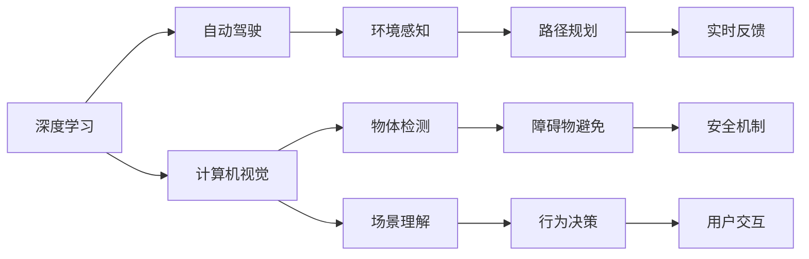

                 

# Andrej Karpathy：人工智能的未来发展规划

> 关键词：Andrej Karpathy, 人工智能, 深度学习, 自动驾驶, 计算机视觉, 未来规划

## 1. 背景介绍

Andrej Karpathy 是斯坦福大学的计算机科学教授，同时也是 Facebook AI 研究院的主任，专注于深度学习和计算机视觉领域的研究。他不仅在学术界有着重要影响力，在工业界也取得了显著的成果。Karpathy 在自动驾驶和计算机视觉领域的贡献，使得他成为当下最炙手可热的人工智能专家之一。

在最近的一次演讲中，Andrej Karpathy 分享了关于人工智能未来发展规划的一些思考和见解。本文将详细介绍 Karpathy 对于人工智能领域的未来发展的看法，为读者提供关于 AI 技术发展的深刻洞见。

## 2. 核心概念与联系

### 2.1 核心概念概述

在 Karpathy 的演讲中，他强调了以下几个核心概念：

- **深度学习**：一种基于多层神经网络的机器学习技术，广泛应用于计算机视觉、自然语言处理等领域。
- **自动驾驶**：通过计算机视觉、深度学习和传感器技术，使车辆能够自主导航和驾驶。
- **计算机视觉**：使计算机能够“看”和理解图像和视频的技术。
- **未来规划**：AI 技术在多个领域的未来应用和发展趋势。

这些概念之间的逻辑关系可以通过以下 Mermaid 流程图来展示：



这个流程图展示了深度学习在自动驾驶和计算机视觉中的应用，以及这些技术的未来发展方向。

### 2.2 核心概念原理和架构

#### 2.2.1 深度学习原理

深度学习通过多层神经网络来学习数据的抽象表示，每个神经元可以提取输入数据的特征，并传递到下一层，最终输出预测结果。其核心在于利用反向传播算法来训练模型，通过调整权重来最小化预测误差。

#### 2.2.2 自动驾驶架构

自动驾驶系统由感知、决策和执行三个主要部分组成。感知模块通过摄像头、雷达等传感器获取周围环境信息；决策模块利用计算机视觉和深度学习技术进行环境理解和路径规划；执行模块通过控制系统和电机来执行决策结果。

#### 2.2.3 计算机视觉框架

计算机视觉框架通常包含图像预处理、特征提取、物体检测、场景理解等多个模块。其中，卷积神经网络(CNN)是最常用的深度学习模型，广泛应用于图像分类、目标检测等任务。

## 3. 核心算法原理 & 具体操作步骤

### 3.1 算法原理概述

Karpathy 在演讲中指出，未来的人工智能发展将更加注重数据的利用和算法的创新。他强调了以下几点：

- **数据的重要性**：高质量的数据是深度学习成功的关键。
- **算法的创新**：新的算法和技术将不断涌现，推动AI的发展。
- **跨领域融合**：AI 技术将在更多领域得到应用，如自动驾驶、医疗、金融等。

### 3.2 算法步骤详解

Karpathy 描述了自动驾驶和计算机视觉技术的开发步骤：

1. **数据采集**：收集大量有标注的图像和视频数据，用于训练和验证模型。
2. **模型训练**：使用深度学习算法训练模型，学习环境感知、物体检测等任务。
3. **模型优化**：通过调整网络结构、优化损失函数等手段，提升模型性能。
4. **集成和测试**：将多个模块集成到自动驾驶系统中，并进行全面测试，确保系统稳定性和安全性。

### 3.3 算法优缺点

#### 3.3.1 优点

- **高效性**：深度学习模型能够自动提取特征，提高处理效率。
- **泛化能力**：通过大量数据训练，模型能够泛化到新的场景和数据。
- **可解释性**：部分深度学习模型（如GNN）具备较好的可解释性，便于理解决策过程。

#### 3.3.2 缺点

- **数据依赖**：高质量的数据是深度学习成功的前提，数据获取成本较高。
- **计算资源需求**：深度学习模型通常需要较大的计算资源和存储空间。
- **过拟合风险**：模型容易过拟合训练数据，导致泛化能力不足。

### 3.4 算法应用领域

Karpathy 认为，深度学习在多个领域都有广泛应用，以下是几个主要应用领域：

- **自动驾驶**：通过计算机视觉和深度学习技术，实现车辆自主导航和驾驶。
- **医疗诊断**：利用深度学习对医学影像进行分析和诊断，提高疾病早期发现率。
- **金融分析**：通过深度学习进行股票预测、风险评估等金融任务。
- **自然语言处理**：利用深度学习进行机器翻译、语音识别、情感分析等任务。
- **机器人技术**：通过深度学习实现机器人视觉感知和动作控制。

## 4. 数学模型和公式 & 详细讲解 & 举例说明

### 4.1 数学模型构建

Karpathy 在演讲中介绍了自动驾驶系统的数学模型：

- **环境感知**：使用卷积神经网络(CNN)对摄像头拍摄的图像进行预处理和特征提取。
- **物体检测**：利用YOLO等目标检测算法，识别并定位路面上的人和车辆。
- **路径规划**：通过图搜索算法，找到从起点到终点的最优路径。
- **行为决策**：利用强化学习算法，优化驾驶策略，避免障碍物。

### 4.2 公式推导过程

以物体检测为例，Karpathy 给出了目标检测模型的计算过程：

- **输入图像**：输入一张 $H \times W$ 的图像。
- **特征提取**：通过卷积层和池化层，提取图像特征，得到 $N \times F$ 的特征图。
- **目标检测**：利用回归损失函数，预测目标的边界框和置信度。
- **非极大值抑制**：通过非极大值抑制算法，去除重叠的边界框，得到最终的检测结果。

### 4.3 案例分析与讲解

Karpathy 以自动驾驶为例，介绍了深度学习在实际应用中的具体案例：

- **环境感知**：使用多摄像头和雷达传感器，获取周围环境信息。
- **物体检测**：通过YOLO算法，实时检测和跟踪车辆、行人等障碍物。
- **路径规划**：通过A*算法，找到最优路径，避免障碍物和交通信号。
- **行为决策**：通过强化学习，优化驾驶策略，实现自动驾驶。

## 5. 项目实践：代码实例和详细解释说明

### 5.1 开发环境搭建

在进行自动驾驶和计算机视觉项目开发前，需要先准备好开发环境。以下是使用Python进行PyTorch开发的环境配置流程：

1. 安装Anaconda：从官网下载并安装Anaconda，用于创建独立的Python环境。

2. 创建并激活虚拟环境：
```bash
conda create -n pytorch-env python=3.8 
conda activate pytorch-env
```

3. 安装PyTorch：根据CUDA版本，从官网获取对应的安装命令。例如：
```bash
conda install pytorch torchvision torchaudio cudatoolkit=11.1 -c pytorch -c conda-forge
```

4. 安装Transformers库：
```bash
pip install transformers
```

5. 安装各类工具包：
```bash
pip install numpy pandas scikit-learn matplotlib tqdm jupyter notebook ipython
```

完成上述步骤后，即可在`pytorch-env`环境中开始项目实践。

### 5.2 源代码详细实现

这里以自动驾驶中的物体检测为例，给出使用Transformers库对YOLO模型进行训练的PyTorch代码实现。

```python
from transformers import YOLOObjectDetector
from torch.utils.data import DataLoader
import torch

# 加载YOLO模型
model = YOLOObjectDetector.from_pretrained('yolov3')

# 准备数据集
dataset = Dataset()  # 自定义数据集，包含图像和标注信息

# 训练和验证数据集分割
train_dataset, val_dataset = split_dataset(dataset, train_ratio=0.8)

# 设置训练参数
optimizer = torch.optim.Adam(model.parameters(), lr=1e-4)
scheduler = torch.optim.lr_scheduler.StepLR(optimizer, step_size=10, gamma=0.1)

# 定义损失函数
loss_fn = torch.nn.BCELoss()

# 训练模型
for epoch in range(num_epochs):
    for batch in DataLoader(train_dataset, batch_size=16):
        inputs, targets = batch
        optimizer.zero_grad()
        outputs = model(inputs)
        loss = loss_fn(outputs, targets)
        loss.backward()
        optimizer.step()
        scheduler.step()

# 在验证集上评估模型
val_loss = evaluate(model, val_dataset)
print(f'Validation Loss: {val_loss:.4f}')
```

### 5.3 代码解读与分析

让我们再详细解读一下关键代码的实现细节：

- **YOLOObjectDetector类**：自定义YOLO模型类，继承自Transformers库中的通用模型类。
- **Dataset类**：自定义数据集类，包含图像和标注信息，用于模型训练和验证。
- **split_dataset函数**：将数据集按照指定比例划分为训练集和验证集。
- **Adam优化器和StepLR学习率调度器**：用于优化模型参数和学习率调整。
- **BCELoss损失函数**：用于计算模型的预测输出和真实标签之间的交叉熵损失。
- **evaluate函数**：在验证集上评估模型性能，返回平均损失值。

## 6. 实际应用场景

### 6.1 自动驾驶系统

自动驾驶系统是Karpathy 演讲中的一个重要应用场景。通过深度学习和计算机视觉技术，自动驾驶车辆能够自主导航和驾驶，大大提高了交通效率和安全性。

在实际应用中，自动驾驶系统通常包含以下模块：

- **感知模块**：通过摄像头、雷达等传感器，获取周围环境信息。
- **决策模块**：利用深度学习模型进行环境理解和路径规划，制定最优驾驶策略。
- **执行模块**：通过控制系统和电机，实现车辆移动和转向。

Karpathy 强调，自动驾驶系统的安全性是关键，需要在模型训练和系统设计中充分考虑。

### 6.2 计算机视觉应用

计算机视觉技术在图像处理、目标检测、场景理解等方面有着广泛应用。Karpathy 介绍了几个典型的计算机视觉应用场景：

- **物体检测**：通过YOLO、Faster R-CNN等算法，实时检测和跟踪对象。
- **图像分类**：利用CNN模型，对图像进行分类和标注。
- **图像生成**：通过生成对抗网络(GAN)，生成逼真的图像。

### 6.3 医疗影像分析

在医疗影像分析中，深度学习被广泛应用于疾病诊断和图像分割。Karpathy 提到，通过大规模标注数据的训练，深度学习模型可以显著提高疾病的早期发现率。

## 7. 工具和资源推荐

### 7.1 学习资源推荐

为了帮助开发者系统掌握深度学习和计算机视觉技术，Karpathy 推荐了一些优质的学习资源：

1. **Deep Learning Specialization**：由 Andrew Ng 教授讲授的Coursera深度学习课程，涵盖深度学习的基础理论和实践应用。
2. **CS231n: Convolutional Neural Networks for Visual Recognition**：斯坦福大学计算机视觉课程，介绍了深度学习在计算机视觉中的应用。
3. **Hands-On Machine Learning with Scikit-Learn, Keras, and TensorFlow**：Aurélien Géron 所著的深度学习入门书籍，详细介绍了TensorFlow和Scikit-Learn的使用方法。
4. **Deep Learning with PyTorch**：Eli Stevens 所著的深度学习入门书籍，介绍了PyTorch的开发方法和实战技巧。
5. **Fast.ai**：由 Jeremy Howard 和 Rachel Thomas 创建的学习平台，提供深度学习和计算机视觉的在线课程和实战项目。

### 7.2 开发工具推荐

高效的深度学习开发离不开优秀的工具支持。以下是几款用于深度学习和计算机视觉开发的常用工具：

1. **PyTorch**：基于Python的开源深度学习框架，灵活动态的计算图，适合快速迭代研究。大部分深度学习模型都有PyTorch版本的实现。
2. **TensorFlow**：由Google主导开发的开源深度学习框架，生产部署方便，适合大规模工程应用。同样有丰富的深度学习模型资源。
3. **Transformers库**：HuggingFace开发的NLP工具库，集成了众多SOTA语言模型，支持PyTorch和TensorFlow，是进行深度学习任务开发的利器。
4. **Weights & Biases**：模型训练的实验跟踪工具，可以记录和可视化模型训练过程中的各项指标，方便对比和调优。与主流深度学习框架无缝集成。
5. **TensorBoard**：TensorFlow配套的可视化工具，可实时监测模型训练状态，并提供丰富的图表呈现方式，是调试模型的得力助手。
6. **Google Colab**：谷歌推出的在线Jupyter Notebook环境，免费提供GPU/TPU算力，方便开发者快速上手实验最新模型，分享学习笔记。

### 7.3 相关论文推荐

深度学习和计算机视觉领域的快速发展离不开学术界的持续研究。以下是几篇奠基性的相关论文，推荐阅读：

1. **ImageNet Classification with Deep Convolutional Neural Networks**：Alex Krizhevsky等人在2012年提出的卷积神经网络模型，为深度学习在图像分类中的应用奠定了基础。
2. **Rethinking the Inception Architecture for Computer Vision**：Google Brain团队在2015年提出的Inception模型，进一步提升了深度学习在图像处理中的性能。
3. **You Only Look Once: Unified, Real-Time Object Detection**：Joseph Redmon等人在2016年提出的YOLO算法，实现了实时目标检测和跟踪。
4. **Playing Atari with Deep Reinforcement Learning**：DeepMind团队在2013年提出的基于深度强化学习的Atari游戏解决方案，展示了深度学习的强大潜力。
5. **Improved Techniques for Training GANs**：Ian Goodfellow等人在2014年提出的生成对抗网络，开创了深度学习在图像生成领域的新纪元。
6. **Learning Transferable Visual Models from Natural Scenes and Instances**：Andrew Ng等人在2014年提出的通过大规模无监督学习进行图像分类的算法，进一步推动了深度学习的发展。

## 8. 总结：未来发展趋势与挑战

### 8.1 总结

本文详细介绍了Andrej Karpathy在人工智能领域的未来发展规划。Karpathy 强调了深度学习、自动驾驶和计算机视觉技术的重要性，并探讨了其在实际应用中的前景和挑战。通过本文的系统梳理，可以看到，深度学习和大模型在未来的人工智能应用中具有广阔的前景和潜力。

### 8.2 未来发展趋势

Karpathy 认为，未来的人工智能将呈现以下几个发展趋势：

1. **深度学习模型的发展**：模型规模将持续增大，参数量将进一步增加，性能将进一步提升。
2. **自动驾驶技术的进步**：自动驾驶系统将更加智能化和可靠，安全性将得到进一步保障。
3. **计算机视觉的突破**：图像处理和目标检测技术将取得更大的突破，生成对抗网络将应用于更多领域。
4. **跨领域应用**：深度学习和计算机视觉技术将在更多领域得到应用，如医疗、金融、机器人等。
5. **AI伦理和安全**：AI伦理和安全问题将受到更多关注，研究者将致力于开发更安全、可解释的AI系统。

### 8.3 面临的挑战

尽管深度学习和计算机视觉技术在多个领域取得了显著成就，但在迈向更加智能化、普适化应用的过程中，仍面临诸多挑战：

1. **数据依赖**：高质量的数据是深度学习成功的前提，数据获取成本较高。
2. **计算资源需求**：深度学习模型通常需要较大的计算资源和存储空间。
3. **过拟合风险**：模型容易过拟合训练数据，导致泛化能力不足。
4. **安全性问题**：AI技术在实际应用中可能面临安全性问题，需要加强安全防护。
5. **可解释性不足**：深度学习模型的决策过程缺乏可解释性，难以对其推理逻辑进行分析和调试。

### 8.4 研究展望

未来，深度学习和计算机视觉技术需要在以下几个方面进行深入研究：

1. **数据获取和标注**：探索如何利用无监督和半监督学习技术，减少对标注数据的依赖。
2. **模型优化和压缩**：开发参数高效和计算高效的深度学习模型，提升模型性能和推理效率。
3. **多模态融合**：将视觉、语音、文本等多种模态数据进行融合，提升系统综合能力。
4. **跨领域应用**：研究深度学习在更多领域的应用，推动AI技术的产业化发展。
5. **伦理和安全**：研究AI伦理和安全问题，开发可解释、可控的AI系统。

这些研究方向的探索，将推动深度学习和计算机视觉技术在各个领域的发展，为人类的生产和生活带来深远影响。

## 9. 附录：常见问题与解答

**Q1：深度学习模型是否适用于所有领域？**

A: 深度学习模型在处理图像、语音、文本等结构化数据方面具有显著优势，但在非结构化数据处理和实时系统中的应用仍需进一步研究。

**Q2：自动驾驶技术面临哪些挑战？**

A: 自动驾驶技术面临的挑战包括环境感知、路径规划、行为决策等方面。需要解决传感器融合、高精度定位、鲁棒性等问题。

**Q3：计算机视觉技术在实际应用中面临哪些问题？**

A: 计算机视觉技术在实际应用中面临的问题包括数据获取、模型训练、模型部署等方面。需要解决数据标注成本高、模型推理效率低等问题。

**Q4：AI伦理和安全问题如何解决？**

A: AI伦理和安全问题需要通过数据治理、算法透明、用户隐私保护等方面进行解决。需要加强对AI系统的监管和控制。

**Q5：未来AI技术的发展方向是什么？**

A: 未来AI技术的发展方向包括深度学习模型的进一步发展、跨领域应用的拓展、AI伦理和安全的保障等方面。需要从技术和伦理等多个角度进行研究。

通过本文的系统梳理，我们可以看到Andrej Karpathy对于人工智能未来的发展规划，为我们提供了一个清晰的视角，有助于理解AI技术的发展方向和挑战。希望这篇技术博客文章能够对读者在深度学习和计算机视觉领域的学习和实践有所帮助。

---

作者：禅与计算机程序设计艺术 / Zen and the Art of Computer Programming

