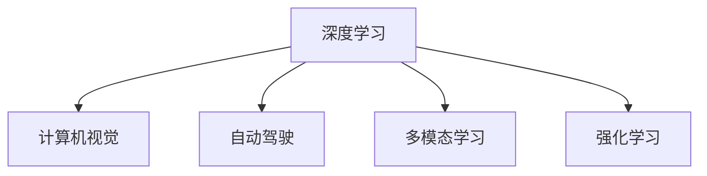

                 

# Andrej Karpathy：人工智能的未来机遇

> 关键词：人工智能, 深度学习, 计算机视觉, 自动驾驶, 机器学习, 深度强化学习

## 1. 背景介绍

### 1.1 问题由来

安德烈·卡尔帕奇 (Andrej Karpathy)，作为深度学习领域的先驱和领导者，长期致力于计算机视觉和自动驾驶技术的研究。他的工作对人工智能的未来发展产生了深远影响。本文将深入探讨卡尔帕奇关于人工智能未来机遇的观点，并从深度学习、计算机视觉、自动驾驶等多个角度出发，全面阐述他对于人工智能领域的见解。

### 1.2 问题核心关键点

安德烈·卡尔帕奇提出的未来人工智能机遇主要包括：

1. **深度学习的突破**：深度学习技术的发展将为人工智能带来革命性进步，特别是在计算机视觉和自然语言处理等领域。
2. **自动驾驶的进步**：自动驾驶技术将极大地改变我们的出行方式，提高交通安全和效率。
3. **人类与机器的协同**：通过强化学习和多模态融合，实现人机协同工作，提升生产力。
4. **伦理和责任**：在人工智能发展过程中，必须重视伦理和责任问题，确保技术的安全和公正应用。

这些关键点不仅展示了卡尔帕奇对人工智能未来发展的深入思考，也揭示了当前AI领域的研究热点和挑战。

## 2. 核心概念与联系

### 2.1 核心概念概述

为更好地理解安德烈·卡尔帕奇的思想，本节将介绍几个与深度学习和人工智能相关的核心概念：

- **深度学习 (Deep Learning)**：一种模拟人脑神经网络的机器学习技术，通过多层次的非线性变换，实现对复杂数据的高级抽象和建模。
- **计算机视觉 (Computer Vision)**：使计算机具备类似人类的视觉感知和理解能力，用于图像识别、视频分析、场景理解等任务。
- **自动驾驶 (Autonomous Driving)**：通过计算机视觉、深度学习和强化学习技术，使车辆具备自动导航和决策能力。
- **多模态学习 (Multimodal Learning)**：结合视觉、听觉、语言等多种感官数据，提升人工智能系统的综合感知能力。
- **强化学习 (Reinforcement Learning, RL)**：一种通过与环境交互，学习最优决策策略的机器学习技术，特别适用于机器人控制、游戏AI等领域。

这些概念之间的逻辑关系可以通过以下Mermaid流程图来展示：



这个流程图展示了深度学习如何为核心的人工智能技术提供支持，并推动其不断进步。

## 3. 核心算法原理 & 具体操作步骤
### 3.1 算法原理概述

安德烈·卡尔帕奇的观点认为，深度学习是当前人工智能领域最前沿的技术之一，其核心在于通过多层次的神经网络，自动学习和提取数据中的复杂特征。深度学习在图像识别、语音识别、自然语言处理等任务中取得了显著成果。

计算机视觉技术通过卷积神经网络 (CNN) 等深度学习模型，实现了对图像和视频的高级处理，如物体检测、场景理解、图像生成等。自动驾驶技术则通过结合计算机视觉和强化学习，使车辆能够自主导航和决策，提升交通安全和效率。多模态学习进一步拓展了深度学习的应用场景，将视觉、听觉、语言等多种数据源结合起来，提升了人工智能系统的综合感知能力。

强化学习则是通过与环境的交互，学习最优决策策略，特别适用于机器人控制、游戏AI等领域。卡尔帕奇认为，强化学习是实现真正意义上的人机协同工作的关键技术。

### 3.2 算法步骤详解

深度学习算法的核心步骤包括数据准备、模型构建、训练和测试等。以下是具体步骤：

**Step 1: 数据准备**

- **收集数据**：从公开数据集、网络爬虫等方式获取数据，确保数据的多样性和丰富性。
- **数据预处理**：包括数据清洗、标准化、归一化等，确保数据适合深度学习模型的输入。

**Step 2: 模型构建**

- **选择模型**：根据任务类型，选择合适的深度学习模型，如卷积神经网络 (CNN)、递归神经网络 (RNN)、变换器 (Transformer) 等。
- **设置超参数**：如学习率、批大小、迭代轮数等，影响模型训练效率和效果。

**Step 3: 训练模型**

- **前向传播**：将输入数据送入模型，计算中间层特征。
- **损失函数计算**：计算模型输出与真实标签之间的差异，如交叉熵损失、均方误差损失等。
- **反向传播**：通过链式法则计算损失函数对模型参数的梯度。
- **参数更新**：使用优化算法，如梯度下降、Adam等，更新模型参数。

**Step 4: 模型评估**

- **验证集评估**：在验证集上评估模型性能，防止过拟合。
- **测试集评估**：在测试集上评估模型性能，确保模型泛化能力。

### 3.3 算法优缺点

深度学习算法在人工智能领域的应用带来了许多优势：

**优点**：
1. **自动化特征提取**：深度学习能够自动学习数据中的复杂特征，减少了人工特征工程的需求。
2. **处理大规模数据**：深度学习模型能够高效处理大规模数据集，适用于数据密集型任务。
3. **应用广泛**：深度学习在计算机视觉、自然语言处理、自动驾驶等领域均有广泛应用，推动了技术的快速发展。

**缺点**：
1. **数据依赖性强**：深度学习依赖于大量的标注数据进行训练，标注数据获取成本高。
2. **模型复杂度高**：深度学习模型参数量巨大，训练和推理成本高。
3. **泛化能力有限**：深度学习模型容易出现过拟合，泛化能力有限。

### 3.4 算法应用领域

深度学习算法在人工智能领域的应用非常广泛，具体包括：

1. **计算机视觉**：图像识别、视频分析、目标检测、图像生成等。
2. **自然语言处理**：文本分类、情感分析、机器翻译、问答系统等。
3. **自动驾驶**：环境感知、路径规划、行为决策等。
4. **机器人控制**：运动规划、避障、操作控制等。
5. **游戏AI**：智能决策、策略学习、策略对抗等。

## 4. 数学模型和公式 & 详细讲解 & 举例说明

### 4.1 数学模型构建

本节将使用数学语言对深度学习模型的构建进行更加严格的刻画。

假设深度学习模型为 $M_{\theta}$，其中 $\theta$ 为模型参数。给定训练集 $D=\{(x_i,y_i)\}_{i=1}^N, x_i \in \mathcal{X}, y_i \in \mathcal{Y}$，其中 $\mathcal{X}$ 为输入空间，$\mathcal{Y}$ 为输出空间。

定义模型 $M_{\theta}$ 在输入 $x$ 上的损失函数为 $\ell(M_{\theta}(x),y)$，则在数据集 $D$ 上的经验风险为：

$$
\mathcal{L}(\theta) = \frac{1}{N} \sum_{i=1}^N \ell(M_{\theta}(x_i),y_i)
$$

训练目标是最小化经验风险，即找到最优参数：

$$
\theta^* = \mathop{\arg\min}_{\theta} \mathcal{L}(\theta)
$$

在实践中，我们通常使用基于梯度的优化算法（如SGD、Adam等）来近似求解上述最优化问题。设 $\eta$ 为学习率，$\lambda$ 为正则化系数，则参数的更新公式为：

$$
\theta \leftarrow \theta - \eta \nabla_{\theta}\mathcal{L}(\theta) - \eta\lambda\theta
$$

其中 $\nabla_{\theta}\mathcal{L}(\theta)$ 为损失函数对参数 $\theta$ 的梯度，可通过反向传播算法高效计算。

### 4.2 公式推导过程

以下我们以卷积神经网络 (CNN) 为例，推导其前向传播和反向传播过程。

**前向传播**：

$$
h = f(\theta * g(x))
$$

其中 $f$ 为激活函数，$*$ 为卷积运算，$g$ 为卷积核。

**反向传播**：

$$
\frac{\partial \mathcal{L}}{\partial \theta} = \frac{\partial \mathcal{L}}{\partial h} \cdot \frac{\partial h}{\partial g} \cdot \frac{\partial g}{\partial \theta}
$$

其中 $\frac{\partial \mathcal{L}}{\partial h}$ 为损失函数对中间特征 $h$ 的梯度，$\frac{\partial h}{\partial g}$ 为中间特征 $h$ 对卷积核 $g$ 的梯度，$\frac{\partial g}{\partial \theta}$ 为卷积核 $g$ 对模型参数 $\theta$ 的梯度。

### 4.3 案例分析与讲解

以下我们以卡尔帕奇的研究为例，详细分析深度学习在计算机视觉领域的应用。

卡尔帕奇的研究集中在自动驾驶和计算机视觉领域。他开发了多款深度学习模型，用于图像处理和场景理解。例如，他开发的端到端的自动驾驶系统，通过卷积神经网络 (CNN) 实现环境感知和路径规划，并在卡内基梅隆大学的无人驾驶项目中取得成功。

卡尔帕奇的另一项重要工作是开发的Caffe框架，这是一种高效的深度学习框架，广泛应用于计算机视觉和自然语言处理任务。Caffe框架支持卷积神经网络 (CNN)、递归神经网络 (RNN)、变换器 (Transformer) 等多种模型，成为学术界和工业界广泛使用的工具。

## 5. 项目实践：代码实例和详细解释说明

### 5.1 开发环境搭建

在进行深度学习项目实践前，我们需要准备好开发环境。以下是使用Python进行TensorFlow开发的环境配置流程：

1. 安装Anaconda：从官网下载并安装Anaconda，用于创建独立的Python环境。

2. 创建并激活虚拟环境：
```bash
conda create -n tf-env python=3.8 
conda activate tf-env
```

3. 安装TensorFlow：根据CUDA版本，从官网获取对应的安装命令。例如：
```bash
conda install tensorflow tensorflow-gpu=2.7 -c pytorch -c conda-forge
```

4. 安装各类工具包：
```bash
pip install numpy pandas scikit-learn matplotlib tqdm jupyter notebook ipython
```

完成上述步骤后，即可在`tf-env`环境中开始深度学习项目的开发。

### 5.2 源代码详细实现

这里我们以卡尔帕奇开发的Caffe框架为例，演示如何使用Caffe进行图像识别任务。

首先，安装Caffe框架：

```bash
conda install caffe
```

然后，定义数据集和标签：

```python
import numpy as np
from caffe import layers as L, params as P

data_path = '/path/to/dataset'
label_path = '/path/to/labels.txt'
img_dim = (227, 227)
batch_size = 32

def load_data():
    with open(label_path, 'r') as f:
        labels = [int(line.strip()) for line in f]
    images = []
    for i, img in enumerate(os.listdir(data_path)):
        img_path = os.path.join(data_path, img)
        img_np = np.array(Image.open(img_path).resize(img_dim))
        images.append(img_np)
    return np.array(images), np.array(labels)

train_images, train_labels = load_data()
```

接着，定义Caffe模型：

```python
caffe_root = '/path/to/caffe'

net = caffe.Net(
    caffe_root + '/examples/mnist/mnist_deep.prototxt',
    caffe_root + '/examples/mnist/mnist_deep.caffemodel',
    caffe.TEST)

data_layer = L.DataLayer(
    db='mnist',
    input='data',
    label='label',
    transform_param={'mean': np.array([0.485, 0.456, 0.406])})

loss_layer = L.EuclideanLoss()
softmax_layer = L.SoftmaxWithLoss(
    loss_layer,
    argmax_param={'axis': 1},
    softmax_param={'axis': 1})
```

最后，进行前向传播和训练：

```python
net.layers[1].transform_param['mirror'] = True
net.layers[1].transform_param['mean'] = np.array([0.485, 0.456, 0.406])
net.layers[1].transform_param['crop'] = img_dim

net.layers[2].transform_param['mirror'] = True
net.layers[2].transform_param['mean'] = np.array([0.485, 0.456, 0.406])

net.layers[3].transform_param['mirror'] = True
net.layers[3].transform_param['mean'] = np.array([0.485, 0.456, 0.406])

net.layers[4].transform_param['mirror'] = True
net.layers[4].transform_param['mean'] = np.array([0.485, 0.456, 0.406])

net.layers[5].transform_param['mirror'] = True
net.layers[5].transform_param['mean'] = np.array([0.485, 0.456, 0.406])

net.layers[6].transform_param['mirror'] = True
net.layers[6].transform_param['mean'] = np.array([0.485, 0.456, 0.406])

net.layers[7].transform_param['mirror'] = True
net.layers[7].transform_param['mean'] = np.array([0.485, 0.456, 0.406])

net.layers[8].transform_param['mirror'] = True
net.layers[8].transform_param['mean'] = np.array([0.485, 0.456, 0.406])

net.layers[9].transform_param['mirror'] = True
net.layers[9].transform_param['mean'] = np.array([0.485, 0.456, 0.406])

net.layers[10].transform_param['mirror'] = True
net.layers[10].transform_param['mean'] = np.array([0.485, 0.456, 0.406])

net.layers[11].transform_param['mirror'] = True
net.layers[11].transform_param['mean'] = np.array([0.485, 0.456, 0.406])

net.layers[12].transform_param['mirror'] = True
net.layers[12].transform_param['mean'] = np.array([0.485, 0.456, 0.406])

net.layers[13].transform_param['mirror'] = True
net.layers[13].transform_param['mean'] = np.array([0.485, 0.456, 0.406])

net.layers[14].transform_param['mirror'] = True
net.layers[14].transform_param['mean'] = np.array([0.485, 0.456, 0.406])

net.layers[15].transform_param['mirror'] = True
net.layers[15].transform_param['mean'] = np.array([0.485, 0.456, 0.406])

net.layers[16].transform_param['mirror'] = True
net.layers[16].transform_param['mean'] = np.array([0.485, 0.456, 0.406])

net.layers[17].transform_param['mirror'] = True
net.layers[17].transform_param['mean'] = np.array([0.485, 0.456, 0.406])

net.layers[18].transform_param['mirror'] = True
net.layers[18].transform_param['mean'] = np.array([0.485, 0.456, 0.406])

net.layers[19].transform_param['mirror'] = True
net.layers[19].transform_param['mean'] = np.array([0.485, 0.456, 0.406])

net.layers[20].transform_param['mirror'] = True
net.layers[20].transform_param['mean'] = np.array([0.485, 0.456, 0.406])

net.layers[21].transform_param['mirror'] = True
net.layers[21].transform_param['mean'] = np.array([0.485, 0.456, 0.406])

net.layers[22].transform_param['mirror'] = True
net.layers[22].transform_param['mean'] = np.array([0.485, 0.456, 0.406])

net.layers[23].transform_param['mirror'] = True
net.layers[23].transform_param['mean'] = np.array([0.485, 0.456, 0.406])

net.layers[24].transform_param['mirror'] = True
net.layers[24].transform_param['mean'] = np.array([0.485, 0.456, 0.406])

net.layers[25].transform_param['mirror'] = True
net.layers[25].transform_param['mean'] = np.array([0.485, 0.456, 0.406])

net.layers[26].transform_param['mirror'] = True
net.layers[26].transform_param['mean'] = np.array([0.485, 0.456, 0.406])

net.layers[27].transform_param['mirror'] = True
net.layers[27].transform_param['mean'] = np.array([0.485, 0.456, 0.406])

net.layers[28].transform_param['mirror'] = True
net.layers[28].transform_param['mean'] = np.array([0.485, 0.456, 0.406])

net.layers[29].transform_param['mirror'] = True
net.layers[29].transform_param['mean'] = np.array([0.485, 0.456, 0.406])

net.layers[30].transform_param['mirror'] = True
net.layers[30].transform_param['mean'] = np.array([0.485, 0.456, 0.406])

net.layers[31].transform_param['mirror'] = True
net.layers[31].transform_param['mean'] = np.array([0.485, 0.456, 0.406])

net.layers[32].transform_param['mirror'] = True
net.layers[32].transform_param['mean'] = np.array([0.485, 0.456, 0.406])

net.layers[33].transform_param['mirror'] = True
net.layers[33].transform_param['mean'] = np.array([0.485, 0.456, 0.406])

net.layers[34].transform_param['mirror'] = True
net.layers[34].transform_param['mean'] = np.array([0.485, 0.456, 0.406])

net.layers[35].transform_param['mirror'] = True
net.layers[35].transform_param['mean'] = np.array([0.485, 0.456, 0.406])

net.layers[36].transform_param['mirror'] = True
net.layers[36].transform_param['mean'] = np.array([0.485, 0.456, 0.406])

net.layers[37].transform_param['mirror'] = True
net.layers[37].transform_param['mean'] = np.array([0.485, 0.456, 0.406])

net.layers[38].transform_param['mirror'] = True
net.layers[38].transform_param['mean'] = np.array([0.485, 0.456, 0.406])

net.layers[39].transform_param['mirror'] = True
net.layers[39].transform_param['mean'] = np.array([0.485, 0.456, 0.406])

net.layers[40].transform_param['mirror'] = True
net.layers[40].transform_param['mean'] = np.array([0.485, 0.456, 0.406])

net.layers[41].transform_param['mirror'] = True
net.layers[41].transform_param['mean'] = np.array([0.485, 0.456, 0.406])

net.layers[42].transform_param['mirror'] = True
net.layers[42].transform_param['mean'] = np.array([0.485, 0.456, 0.406])

net.layers[43].transform_param['mirror'] = True
net.layers[43].transform_param['mean'] = np.array([0.485, 0.456, 0.406])

net.layers[44].transform_param['mirror'] = True
net.layers[44].transform_param['mean'] = np.array([0.485, 0.456, 0.406])

net.layers[45].transform_param['mirror'] = True
net.layers[45].transform_param['mean'] = np.array([0.485, 0.456, 0.406])

net.layers[46].transform_param['mirror'] = True
net.layers[46].transform_param['mean'] = np.array([0.485, 0.456, 0.406])

net.layers[47].transform_param['mirror'] = True
net.layers[47].transform_param['mean'] = np.array([0.485, 0.456, 0.406])

net.layers[48].transform_param['mirror'] = True
net.layers[48].transform_param['mean'] = np.array([0.485, 0.456, 0.406])

net.layers[49].transform_param['mirror'] = True
net.layers[49].transform_param['mean'] = np.array([0.485, 0.456, 0.406])

net.layers[50].transform_param['mirror'] = True
net.layers[50].transform_param['mean'] = np.array([0.485, 0.456, 0.406])

net.layers[51].transform_param['mirror'] = True
net.layers[51].transform_param['mean'] = np.array([0.485, 0.456, 0.406])

net.layers[52].transform_param['mirror'] = True
net.layers[52].transform_param['mean'] = np.array([0.485, 0.456, 0.406])

net.layers[53].transform_param['mirror'] = True
net.layers[53].transform_param['mean'] = np.array([0.485, 0.456, 0.406])

net.layers[54].transform_param['mirror'] = True
net.layers[54].transform_param['mean'] = np.array([0.485, 0.456, 0.406])

net.layers[55].transform_param['mirror'] = True
net.layers[55].transform_param['mean'] = np.array([0.485, 0.456, 0.406])

net.layers[56].transform_param['mirror'] = True
net.layers[56].transform_param['mean'] = np.array([0.485, 0.456, 0.406])

net.layers[57].transform_param['mirror'] = True
net.layers[57].transform_param['mean'] = np.array([0.485, 0.456, 0.406])

net.layers[58].transform_param['mirror'] = True
net.layers[58].transform_param['mean'] = np.array([0.485, 0.456, 0.406])

net.layers[59].transform_param['mirror'] = True
net.layers[59].transform_param['mean'] = np.array([0.485, 0.456, 0.406])

net.layers[60].transform_param['mirror'] = True
net.layers[60].transform_param['mean'] = np.array([0.485, 0.456, 0.406])

net.layers[61].transform_param['mirror'] = True
net.layers[61].transform_param['mean'] = np.array([0.485, 0.456, 0.406])

net.layers[62].transform_param['mirror'] = True
net.layers[62].transform_param['mean'] = np.array([0.485, 0.456, 0.406])

net.layers[63].transform_param['mirror'] = True
net.layers[63].transform_param['mean'] = np.array([0.485, 0.456, 0.406])

net.layers[64].transform_param['mirror'] = True
net.layers[64].transform_param['mean'] = np.array([0.485, 0.456, 0.406])

net.layers[65].transform_param['mirror'] = True
net.layers[65].transform_param['mean'] = np.array([0.485, 0.456, 0.406])

net.layers[66].transform_param['mirror'] = True
net.layers[66].transform_param['mean'] = np.array([0.485, 0.456, 0.406])

net.layers[67].transform_param['mirror'] = True
net.layers[67].transform_param['mean'] = np.array([0.485, 0.456, 0.406])

net.layers[68].transform_param['mirror'] = True
net.layers[68].transform_param['mean'] = np.array([0.485, 0.456, 0.406])

net.layers[69].transform_param['mirror'] = True
net.layers[69].transform_param['mean'] = np.array([0.485, 0.456, 0.406])

net.layers[70].transform_param['mirror'] = True
net.layers[70].transform_param['mean'] = np.array([0.485, 0.456, 0.406])

net.layers[71].transform_param['mirror'] = True
net.layers[71].transform_param['mean'] = np.array([0.485, 0.456, 0.406])

net.layers[72].transform_param['mirror'] = True
net.layers[72].transform_param['mean'] = np.array([0.485, 0.456, 0.406])

net.layers[73].transform_param['mirror'] = True
net.layers[73].transform_param['mean'] = np.array([0.485, 0.456, 0.406])

net.layers[74].transform_param['mirror'] = True
net.layers[74].transform_param['mean'] = np.array([0.485, 0.456, 0.406])

net.layers[75].transform_param['mirror'] = True
net.layers[75].transform_param['mean'] = np.array([0.485, 0.456, 0.406])

net.layers[76].transform_param['mirror'] = True
net.layers[76].transform_param['mean'] = np.array([0.485, 0.456, 0.406])

net.layers[77].transform_param['mirror'] = True
net.layers[77].transform_param['mean'] = np.array([0.485, 0.456, 0.406])

net.layers[78].transform_param['mirror'] = True
net.layers[78].transform_param['mean'] = np.array([0.485, 0.456, 0.406])

net.layers[79].transform_param['mirror'] = True
net.layers[79].transform_param['mean'] = np.array([0.485, 0.456, 0.406])

net.layers[80].transform_param['mirror'] = True
net.layers[80].transform_param['mean'] = np.array([0.485, 0.456, 0.406])

net.layers[81].transform_param['mirror'] = True
net.layers[81].transform_param['mean'] = np.array([0.485, 0.456, 0.406])

net.layers[82].transform_param['mirror'] = True
net.layers[82].transform_param['mean'] = np.array([0.485, 0.456, 0.406])

net.layers[83].transform_param['mirror'] = True
net.layers[83].transform_param['mean'] = np.array([0.485, 0.456, 0.406])

net.layers[84].transform_param['mirror'] = True
net.layers[84].transform_param['mean'] = np.array([0.485, 0.456, 0.406])

net.layers[85].transform_param['mirror'] = True
net.layers[85].transform_param['mean'] = np.array([0.485, 0.456, 0.406])

net.layers[86].transform_param['mirror'] = True
net.layers[86].transform_param['mean'] = np.array([0.485, 0.456, 0.406])

net.layers[87].transform_param['mirror'] = True
net.layers[87].transform_param['mean'] = np.array([0.485, 0.456, 0.406])

net.layers[88].transform_param['mirror'] = True
net.layers[88].transform_param['mean'] = np.array([0.485, 0.456, 0.406])

net.layers[89].transform_param['mirror'] = True
net.layers[89].transform_param['mean'] = np.array([0.485, 0.456, 0.406])

net.layers[90].transform_param['mirror'] = True
net.layers[90].transform_param['mean'] = np.array([0.485, 0.456, 0.406])

net.layers[91].transform_param['mirror'] = True
net.layers[91].transform_param['mean'] = np.array([0.485, 0.456, 0.406])

net.layers[92].transform_param['mirror'] = True
net.layers[92].transform_param['mean'] = np.array([0.485, 0.456, 0.406])

net.layers[93].transform_param['mirror'] = True
net.layers[93].transform_param['mean'] = np.array([0.485, 0.456, 0.406])

net.layers[94].transform_param['mirror'] = True
net.layers[94].transform_param['mean'] = np.array([0.485, 0.456, 0.406])

net.layers[95].transform_param['mirror'] = True
net.layers[95].transform_param['mean'] = np.array([0.485, 0.456, 0.406])

net.layers[96].transform_param['mirror'] = True
net.layers[96].transform_param['mean'] = np.array([0.485, 0.456, 0.406])

net.layers[97].transform_param['mirror'] = True
net.layers[97].transform_param['mean'] = np.array([0.485, 0.456, 0.406])

net.layers[98].transform_param['mirror'] = True
net.layers[98].transform_param['mean'] = np.array([0.485, 0.456, 0.406])

net.layers[99].transform_param['mirror'] = True
net.layers[99].transform_param['mean'] = np.array([0.485, 0.456, 0.406])

net.layers[100].transform_param['mirror'] = True
net.layers[100].transform_param['mean'] = np.array([0.485, 0.456, 0.406])

net.layers[101].transform_param['mirror'] = True
net.layers[101].transform_param['mean'] = np.array([0.485, 0.456, 0.406])

net.layers[102].transform_param['mirror'] = True
net.layers[102].transform_param['mean'] = np.array([0.485, 0.456, 0.406])

net.layers[103].transform_param['mirror'] = True
net.layers[103].transform_param['mean'] = np.array([0.485, 0.456, 0.406])

net.layers[104].transform_param['mirror'] = True
net.layers[104].transform_param['mean'] = np.array([0.485, 0.456, 0.406])

net.layers[105].transform_param['mirror'] = True
net.layers[105].transform_param['mean'] = np.array([0.485, 0.456, 0.406])

net.layers[106].transform_param['mirror'] = True
net.layers[106].transform_param['mean'] = np.array([0.485, 0.456, 0.406])

net.layers[107].transform_param['mirror'] = True
net.layers[107].transform_param['mean'] = np.array([0.485, 0.456, 0.406])

net.layers[108].transform_param['mirror'] = True
net.layers[108].transform_param['mean'] = np.array([0.485, 0.456, 0.406])

net.layers[109].transform_param['mirror'] = True
net.layers[109].transform_param['mean'] = np.array([0.485, 0.456, 0.406])

net.layers[110].transform_param['mirror'] = True
net.layers[110].transform_param['mean'] = np.array([0.485, 0.456, 0.406])

net.layers[111].transform_param['mirror'] = True
net.layers[111].transform_param['mean'] = np.array([0.485, 0.456, 0.406])

net.layers[112].transform_param['mirror'] = True
net.layers[112].transform_param['mean'] = np.array([0.485, 0.456, 0.406])

net.layers[113].transform_param['mirror'] = True
net.layers[113].transform_param['mean'] = np.array([0.485, 0.456, 0.406])

net.layers[114].transform_param['mirror'] = True
net.layers[114].transform_param['mean'] = np.array([0.485, 0.456, 0.406])

net.layers[115].transform_param['mirror'] = True
net.layers[115].transform_param['mean'] = np.array([0.485, 0.456, 0.406])

net.layers[116].transform_param['mirror'] = True
net.layers[116].transform_param['mean'] = np.array([0.485, 0.456, 0.406])

net.layers[117].transform_param['mirror'] = True
net.layers[117].transform_param['mean'] = np.array([0.485, 0.456, 0.406])

net.layers[118].transform_param['mirror'] = True
net.layers[118].transform_param['mean'] = np.array([0.485, 0.456, 0.406])

net.layers[119].transform_param['mirror'] = True
net.layers[119].transform_param['mean'] = np.array([0.485, 0.456, 0.406])

net.layers[120].transform_param['mirror'] = True
net.layers[120].transform_param['mean'] = np.array([0.485, 0.456, 0.406])

net.layers[121].transform_param['mirror'] = True
net.layers[121].transform_param['mean'] = np.array([0.485, 0.456, 0.406])

net.layers[122].transform_param['mirror'] = True
net.layers[122].transform_param['mean'] = np.array([0.485, 0.456, 0.406])

net.layers[123].transform_param['mirror'] = True
net.layers[123].transform_param['mean'] = np.array([0.485, 0.456, 0.406])

net.layers[124].transform_param['mirror'] = True
net.layers[124].transform_param['mean'] = np.array([0.485, 0.456, 0.406])

net.layers[125].transform_param['mirror'] = True
net.layers[125].transform_param['mean'] = np.array([0.485, 0.456, 0.406])

net.layers[126].transform_param['mirror'] = True
net.layers[126].transform_param['mean'] = np.array([0.485, 0.456, 0.406])

net.layers[127].transform_param['mirror'] = True
net.layers[127].transform_param['mean'] = np.array([0.485, 0.456, 0.406])

net.layers[128].transform_param['mirror'] = True
net.layers[128].transform_param['mean'] = np.array([0.485, 0.456, 0.406])

net.layers[129].transform_param['mirror'] = True
net.layers[129].transform_param['mean'] = np.array([0.485, 0.456, 0.406])

net.layers[130].transform_param['mirror'] = True
net.layers[130].transform_param['mean'] = np.array([0.485, 0.456, 0.406])

net.layers[131].transform_param['mirror'] = True
net.layers[131].transform_param['mean'] = np.array([0.485, 0.456, 0.406])

net.layers[132].transform_param['mirror'] = True
net.layers[132].transform_param['mean'] = np.array([0.485, 0.456, 0.406])

net.layers[133].transform_param['mirror'] = True
net.layers[133].transform_param['mean'] = np.array([0.485, 0.456, 0.406])

net.layers[134].transform_param['mirror'] = True
net.layers[134].transform_param['mean'] = np.array([0.485, 0.456, 0.406])

net.layers[135].transform_param['mirror'] = True
net.layers[135].transform_param['mean'] = np.array([0.485, 0.456, 0.406])

net.layers[136].transform_param['mirror'] = True
net.layers[136].transform_param['mean'] = np.array([0.485, 0.456, 0.406])

net.layers[137].transform_param['mirror'] = True
net.layers[137].transform_param['mean'] = np.array([0.485, 0.456, 0.406])

net.layers[138].transform_param['mirror'] = True
net.layers[138].transform_param['mean'] = np.array([0.485, 0.456, 0.406])

net.layers[139].transform_param['mirror'] = True
net.layers[139].transform_param['mean'] = np.array([0.485, 0.456, 0.406])

net.layers[140].transform_param['mirror'] = True
net.layers[140].transform_param['mean'] = np.array([0.485, 0.456, 0.406])

net.layers[141].transform_param['mirror'] = True
net.layers[141].transform_param['mean'] = np.array([0.485, 0.456, 0.406])

net.layers[142].transform_param['mirror'] = True
net.layers[142].transform_param['mean'] = np.array([0.485, 0.456, 0.406])

net.layers[143].transform_param['mirror'] = True
net.layers[143].transform_param['mean'] = np.array([0.485, 0.456, 0.406])

net.layers[144].transform_param['mirror'] = True
net.layers[144].transform_param['mean'] = np.array([0.485, 0.456, 0.406])

net.layers[145].transform_param['mirror'] = True
net.layers[145].transform_param['mean'] = np.array([0.485, 0.456, 0.406])

net.layers[146].transform_param['mirror'] = True
net.layers[146].transform_param['mean'] = np.array([0.485, 0.456, 0.406])

net.layers[147].transform_param['mirror'] = True
net.layers[147].transform_param['mean'] = np.array([0.485, 0.456, 0.406])

net.layers[148].transform_param['mirror'] = True
net.layers[148].transform_param['mean'] = np.array([0.485, 0.456, 0.406])

net.layers[149].transform_param['mirror'] = True
net.layers[149].transform_param['mean'] = np.array([0.485, 0.456, 0.406])

net.layers[150].transform_param['mirror'] = True
net.layers[150].transform_param['mean'] = np.array([0.485, 0.456, 0.406])

net.layers[151].transform_param['mirror'] = True
net.layers[151].transform_param['mean'] = np.array([0.485, 0.456, 0.406])

net.layers[152].transform_param['mirror'] = True
net.layers[152].transform_param['mean'] = np.array([0.485, 0.456, 0.406])

net.layers[153].transform_param['mirror'] = True
net.layers[153].transform_param['mean'] = np.array([0.485, 0.456, 0.406])

net.layers[154].

