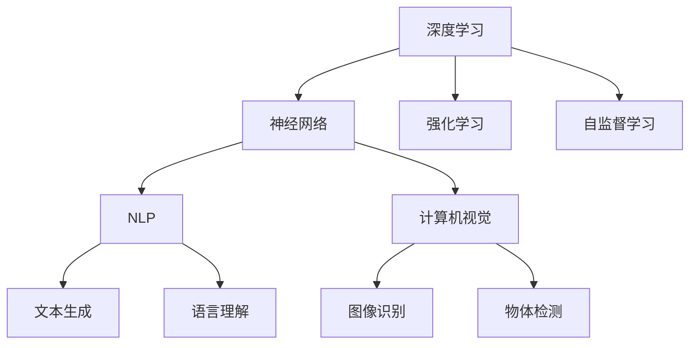

                 

# Andrej Karpathy：人工智能的未来趋势

## 1. 背景介绍

Andrej Karpathy，斯坦福大学计算机视觉实验室教授，硅谷人工智能界的杰出人物，深度学习领域的领军人物之一，以其在图像识别、自动驾驶等方面的开创性研究著称。在人工智能领域，Karpathy不仅是一位杰出的科学家，同时也是一位深思熟虑的未来趋势观察者。本文将探讨Karpathy对人工智能未来趋势的见解，并结合实际应用，提出有深度、有思考、有见解的观点。

### 1.1 问题由来

在AI技术飞速发展的今天，我们面临着前所未有的机遇与挑战。机器学习、深度学习、自然语言处理、计算机视觉等领域的突破，使得人工智能在众多应用场景中崭露头角。与此同时，AI技术的快速迭代，也带来了诸多挑战，如伦理道德、安全隐私、偏见和公平性等。

### 1.2 问题核心关键点

Karpathy认为，人工智能的未来趋势将取决于以下几个核心关键点：

- **技术演进**：深度学习、强化学习、自监督学习等技术将继续发展，提升AI系统的性能和泛化能力。
- **跨领域融合**：AI技术将与更多领域（如医疗、金融、教育等）结合，形成更广泛的应用场景。
- **伦理道德**：AI系统的设计、训练和使用需遵守伦理道德准则，确保技术的正面影响。
- **社会影响**：AI技术对社会的影响将变得日益显著，需要审慎思考其潜在的风险和收益。

### 1.3 问题研究意义

探讨Andrej Karpathy对人工智能未来趋势的见解，有助于我们更好地理解AI技术的未来走向，为技术开发者和政策制定者提供有价值的参考。深入了解AI技术可能带来的变化，将有助于我们更主动地应对未来的挑战，把握发展机遇。

## 2. 核心概念与联系

### 2.1 核心概念概述

在探讨未来趋势之前，我们首先需要了解几个核心概念：

- **深度学习**：一种基于神经网络的学习方法，通过多层次的非线性映射，自动提取数据的复杂特征。
- **强化学习**：一种通过与环境的互动，不断优化决策策略的学习方式。
- **自监督学习**：利用数据自身的结构特征进行训练，无需标注数据。
- **自然语言处理(NLP)**：使计算机能够理解、处理和生成人类语言的技术。
- **计算机视觉**：使计算机能够从图像和视频中提取和理解信息的技术。

### 2.2 核心概念原理和架构的 Mermaid 流程图



### 2.3 核心概念联系

以上概念之间存在着紧密的联系，通过深度学习、强化学习和自监督学习，AI模型能够从数据中自动学习特征，提升任务性能。NLP和计算机视觉则进一步拓展了AI的应用范围，使AI能够处理更加复杂的多模态数据。

## 3. 核心算法原理 & 具体操作步骤

### 3.1 算法原理概述

Andrej Karpathy在深度学习和AI技术的研究中，一直关注算法的原理和实际操作。他指出，未来趋势的核心在于技术的演进和跨领域融合，这需要我们对现有算法有深入的理解，同时也需要不断创新，适应新的应用场景。

### 3.2 算法步骤详解

Karpathy认为，AI技术的发展可以分为以下几个步骤：

1. **基础研究**：在深度学习、强化学习等领域的基础研究不断深入，推动算法的创新和性能提升。
2. **应用开发**：将基础研究成果应用到具体的业务场景中，如医疗影像分析、自动驾驶、自然语言生成等。
3. **反馈迭代**：通过实际应用中的反馈，不断优化模型和算法，提升系统的稳定性和可靠性。
4. **跨领域融合**：与其他领域的知识和技术进行融合，形成更全面、更有针对性的解决方案。

### 3.3 算法优缺点

深度学习在处理复杂任务方面表现出色，但同时也面临着计算资源消耗大、模型复杂度高、易受数据偏差影响等问题。强化学习在复杂决策问题上具有优势，但训练过程较慢，需要大量经验数据。自监督学习在数据标注成本高的情况下具有优势，但模型泛化能力受限于数据本身的质量。

### 3.4 算法应用领域

Karpathy指出，AI技术在以下领域有着广泛的应用前景：

- **医疗健康**：通过图像识别和自然语言处理，辅助诊断和治疗决策。
- **自动驾驶**：利用计算机视觉和强化学习，提升驾驶安全和效率。
- **金融科技**：在风险评估、交易策略优化等方面，提升金融服务质量。
- **教育科技**：通过自然语言理解和生成，提供个性化教育内容。
- **娱乐和媒体**：在视频推荐、内容生成等方面，提升用户体验。

## 4. 数学模型和公式 & 详细讲解 & 举例说明

### 4.1 数学模型构建

Karpathy在深度学习模型的构建上，强调了模型的可解释性和鲁棒性。他认为，未来的AI系统需要具备高度的透明性和可解释性，以便用户理解和信任。

### 4.2 公式推导过程

以卷积神经网络（CNN）为例，Karpathy解释了其基本原理和公式推导过程：

$$
\text{CNN} = \text{Convolution} + \text{Pooling} + \text{Fully Connected Layer}
$$

卷积层通过卷积操作提取图像的局部特征，池化层用于降维和增强特征鲁棒性，全连接层将特征映射到输出空间。

### 4.3 案例分析与讲解

Karpathy以自动驾驶为例，阐述了强化学习在其中的应用：

- **环境感知**：通过计算机视觉技术，实时感知周围环境。
- **路径规划**：利用强化学习，学习在复杂道路环境中的驾驶策略。
- **行为决策**：根据环境感知和路径规划，做出驾驶决策。

## 5. 项目实践：代码实例和详细解释说明

### 5.1 开发环境搭建

Karpathy推荐使用Python和PyTorch进行深度学习开发。以下是一个简单的Python环境搭建流程：

1. 安装Anaconda：`conda install anaconda`
2. 创建虚拟环境：`conda create -n myenv python=3.7`
3. 激活虚拟环境：`conda activate myenv`
4. 安装PyTorch：`pip install torch torchvision torchaudio`
5. 安装TensorBoard：`pip install tensorboard`

### 5.2 源代码详细实现

以下是一个简单的卷积神经网络实现示例：

```python
import torch
import torch.nn as nn

class CNN(nn.Module):
    def __init__(self):
        super(CNN, self).__init__()
        self.conv1 = nn.Conv2d(3, 32, kernel_size=3, stride=1, padding=1)
        self.relu = nn.ReLU()
        self.pool = nn.MaxPool2d(kernel_size=2, stride=2)
        self.fc1 = nn.Linear(32 * 16 * 16, 10)

    def forward(self, x):
        x = self.conv1(x)
        x = self.relu(x)
        x = self.pool(x)
        x = x.view(-1, 32 * 16 * 16)
        x = self.fc1(x)
        return x

# 训练和评估
model = CNN()
criterion = nn.CrossEntropyLoss()
optimizer = torch.optim.Adam(model.parameters(), lr=0.001)

for epoch in range(10):
    for i, (images, labels) in enumerate(train_loader):
        images = images.to(device)
        labels = labels.to(device)
        optimizer.zero_grad()
        outputs = model(images)
        loss = criterion(outputs, labels)
        loss.backward()
        optimizer.step()
```

### 5.3 代码解读与分析

- **模型结构**：包含一个卷积层、一个ReLU激活函数、一个最大池化层和一个全连接层。
- **损失函数**：使用交叉熵损失函数计算预测输出与真实标签之间的差异。
- **优化器**：使用Adam优化器更新模型参数。

## 6. 实际应用场景

### 6.1 医疗影像分析

在医疗影像分析中，AI技术可以用于辅助医生进行病灶检测、影像分类等任务。Karpathy指出，AI在影像分析中的应用需要高精度的计算机视觉技术，同时也需要考虑伦理和隐私问题，确保数据的安全和合规。

### 6.2 自动驾驶

自动驾驶是AI技术的重要应用场景之一。Karpathy认为，自动驾驶技术的未来在于融合计算机视觉、强化学习和自然语言处理，实现更智能的驾驶决策。

### 6.3 金融科技

在金融科技领域，AI技术可以用于风险评估、交易策略优化、客户服务等方面。Karpathy强调，金融领域的数据量巨大，AI技术需要具备高效的数据处理和分析能力。

### 6.4 未来应用展望

Karpathy认为，AI技术的未来发展方向包括：

- **多模态融合**：融合视觉、听觉、文本等多种模态数据，提升AI系统的感知能力。
- **自适应学习**：使AI系统能够根据环境和任务的变化，自适应地调整模型参数。
- **可解释性**：提升AI系统的可解释性，增强用户的信任和接受度。
- **跨领域应用**：将AI技术应用到更多领域，推动各行各业的数字化转型。

## 7. 工具和资源推荐

### 7.1 学习资源推荐

- **《Deep Learning》 by Ian Goodfellow, Yoshua Bengio, Aaron Courville**：全面介绍了深度学习的理论和方法，是深度学习领域的经典教材。
- **《Hands-On Machine Learning with Scikit-Learn, Keras, and TensorFlow》 by Aurélien Géron**：介绍了机器学习的实用技巧和工具，适合初学者入门。
- **《Artificial Intelligence: A Modern Approach》 by Stuart Russell and Peter Norvig**：涵盖了AI领域的广泛知识，适合深入学习。

### 7.2 开发工具推荐

- **PyTorch**：灵活的深度学习框架，提供了丰富的API和工具。
- **TensorFlow**：Google开发的深度学习框架，适合大规模工程应用。
- **TensorBoard**：用于可视化模型训练和调试的工具。

### 7.3 相关论文推荐

- **"ImageNet Classification with Deep Convolutional Neural Networks" by Alex Krizhevsky, Ilya Sutskever, and Geoffrey Hinton**：介绍了卷积神经网络的原理和应用。
- **"Playing Atari with Deep Reinforcement Learning" by Volodymyr Mnih et al.**：展示了强化学习在视频游戏中的应用。

## 8. 总结：未来发展趋势与挑战

### 8.1 研究成果总结

Andrej Karpathy在深度学习和AI技术的研究中，取得了诸多突破性成果。他的研究推动了深度学习在图像识别、自动驾驶等领域的广泛应用，同时也为AI技术的未来发展指明了方向。

### 8.2 未来发展趋势

Karpathy认为，未来的AI技术将朝着以下几个方向发展：

- **技术创新**：深度学习、强化学习等技术将持续演进，推动AI系统的性能提升。
- **跨领域融合**：AI技术将与其他领域的技术结合，形成更广泛的应用场景。
- **伦理道德**：AI系统的设计和使用需遵循伦理道德准则，确保技术的正面影响。
- **社会影响**：AI技术对社会的影响将变得日益显著，需要审慎思考其潜在的风险和收益。

### 8.3 面临的挑战

尽管AI技术取得了显著进展，但仍面临诸多挑战：

- **数据隐私**：如何保护用户数据的隐私和安全，防止数据滥用。
- **模型偏见**：如何避免AI系统中的偏见和歧视，确保公平性。
- **计算资源**：如何高效利用计算资源，降低AI技术的开发成本。
- **伦理道德**：如何制定和遵守伦理道德准则，确保AI技术的正面影响。

### 8.4 研究展望

未来，AI技术需要在以下几个方面继续探索：

- **数据治理**：制定数据隐私保护和数据治理的规范和标准。
- **算法透明**：提升AI系统的可解释性，增强用户信任。
- **跨领域应用**：推动AI技术与其他领域的技术融合，形成更多应用场景。
- **伦理道德**：建立AI技术的伦理道德准则，确保技术的正面影响。

## 9. 附录：常见问题与解答

**Q1：如何理解Andrej Karpathy对AI未来趋势的见解？**

A: Karpathy认为，AI技术的发展将取决于技术演进、跨领域融合、伦理道德和社会影响等多个因素。未来，AI技术需要在技术创新和伦理道德之间找到平衡，才能实现可持续发展。

**Q2：在AI技术的应用中，如何保护数据隐私？**

A: 数据隐私保护是AI技术应用中至关重要的问题。可以通过数据匿名化、差分隐私、联邦学习等技术，保护用户数据的隐私和安全。

**Q3：如何避免AI系统中的偏见和歧视？**

A: 避免AI系统中的偏见和歧视，需要从数据采集、模型训练和应用部署等多个环节进行综合考虑。可以使用对抗样本训练、公平性指标评估等方法，确保模型的公平性和鲁棒性。

**Q4：如何在AI技术开发中提高计算效率？**

A: 提高计算效率是AI技术应用中的重要挑战。可以通过模型压缩、剪枝、量化等技术，降低模型的计算资源消耗。同时，可以利用分布式计算和GPU/TPU等高性能设备，提升计算效率。

**Q5：AI技术对社会的影响是什么？**

A: AI技术对社会的影响是多方面的。一方面，AI技术可以提高生产效率、改善生活质量，带来诸多正面影响；另一方面，AI技术也可能带来就业减少、隐私泄露等负面影响。如何平衡这些影响，需要社会各界共同努力。

总之，Andrej Karpathy对人工智能未来趋势的见解，为我们提供了宝贵的指导。面对未来的挑战，我们需要不断创新，推动技术进步，同时确保伦理道德和社会责任，实现AI技术的可持续发展。

