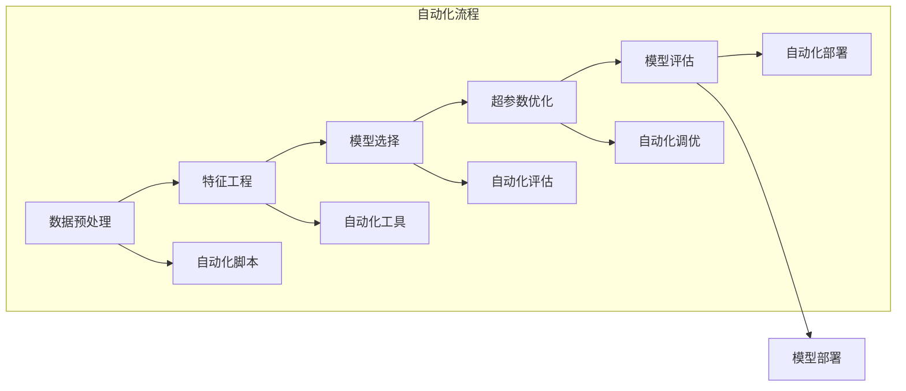

                 

# AutoML：自动化机器学习模型选择与优化

> 关键词：自动化机器学习(AutoML), 模型选择, 超参数优化, 机器学习优化, 深度学习模型, 特征工程

## 1. 背景介绍

### 1.1 问题由来
机器学习模型在多个领域取得了显著成就，如自然语言处理、计算机视觉、推荐系统等。然而，面对海量的数据和复杂的模型，模型的选择与调优变得异常困难，往往需要耗费大量时间和人力。为解决这一问题，AutoML（自动化机器学习）应运而生，旨在通过自动化手段，帮助用户快速构建高性能的机器学习模型。

AutoML的出现，极大地降低了模型调优的门槛，使得机器学习不再是少数专家才能掌握的技术，而是可以为广大开发者和研究人员所应用。它不仅能显著提升模型的性能，还能缩短模型构建周期，加速技术创新。

### 1.2 问题核心关键点
AutoML的核心思想是利用算法和自动化流程，自动化地完成数据预处理、特征工程、模型选择、超参数优化等环节，最终输出最优的机器学习模型。核心包括：
- 数据预处理：对原始数据进行清洗、特征提取、转换等预处理操作。
- 特征工程：基于业务需求和数据特点，设计高效、有意义的特征。
- 模型选择：自动评估不同模型在验证集上的性能，筛选出最优模型。
- 超参数优化：通过网格搜索、贝叶斯优化、遗传算法等方法，自动调优模型超参数。

这些关键步骤的自动化，使得机器学习模型构建更加高效、可靠。

### 1.3 问题研究意义
AutoML研究意义重大，主要体现在以下几个方面：

1. 提升模型性能。AutoML通过自动化的模型选择和调优，能找到最优的模型配置，显著提升模型性能。
2. 降低开发成本。AutoML减少了手动调优的复杂度，使得模型构建更加方便快捷。
3. 加速技术创新。AutoML使得更多的开发者能够快速上手模型构建，加速新技术和新应用的研发。
4. 增加模型可靠性。AutoML的自动化流程能够减少人工干预，提升模型的稳定性和可靠性。
5. 提升用户满意度。AutoML能够提供高度定制化的解决方案，满足用户的个性化需求。

## 2. 核心概念与联系

### 2.1 核心概念概述

为了更好地理解AutoML的核心思想和应用流程，本节将介绍几个关键概念：

- AutoML：指利用算法和自动化流程，自动化地完成数据预处理、特征工程、模型选择、超参数优化等步骤，以自动化方式构建高性能机器学习模型的技术。
- 特征工程：指根据业务需求和数据特点，设计高效、有意义的特征，提升模型的预测能力。
- 超参数优化：指通过网格搜索、贝叶斯优化、遗传算法等方法，自动调优模型的超参数，以提升模型性能。
- 模型选择：指在多个候选模型中，自动评估其在验证集上的性能，筛选出最优模型。
- 自动化流程：指通过脚本或系统工具，将数据预处理、特征工程、模型选择、超参数优化等步骤自动化，减少人工干预。

这些核心概念共同构成了AutoML的技术框架，使得机器学习模型的构建过程自动化，大大提升了模型的构建效率和性能。

### 2.2 核心概念原理和架构的 Mermaid 流程图


该流程图展示了AutoML的核心流程：从数据预处理开始，经过特征工程、模型选择、超参数优化，最终评估和部署模型。同时，整个流程通过自动化脚本、自动化工具等自动化手段，提升效率和可靠性。

## 3. 核心算法原理 & 具体操作步骤
### 3.1 算法原理概述

AutoML的核心算法原理主要体现在以下几个方面：

- **数据预处理**：包括数据清洗、缺失值处理、异常值检测、特征提取等步骤，通过自动化流程保证数据质量。
- **特征工程**：通过特征选择、特征编码、特征降维等方法，设计高效、有意义的特征，提升模型性能。
- **模型选择**：通过网格搜索、贝叶斯优化等方法，自动化评估不同模型在验证集上的性能，筛选出最优模型。
- **超参数优化**：通过网格搜索、贝叶斯优化、遗传算法等方法，自动调优模型的超参数，以提升模型性能。

整个AutoML流程如图2所示。


### 3.2 算法步骤详解

以下是AutoML的主要操作步骤：

1. **数据预处理**：
    - 数据清洗：去除噪声、重复、异常数据，保证数据质量。
    - 缺失值处理：填补缺失值或删除缺失样本，避免数据不完整。
    - 异常值检测：识别和处理异常值，避免异常值对模型性能的影响。
    - 特征提取：将原始数据转换为模型可以处理的形式，如将文本转换为词向量。

2. **特征工程**：
    - 特征选择：根据业务需求，选择最有意义的特征。
    - 特征编码：将特征转换为模型可处理的数值型数据，如将类别特征转换为独热编码。
    - 特征降维：通过PCA、LDA等方法，减少特征维度，提升模型性能。

3. **模型选择**：
    - 候选模型选择：根据业务需求，选择一系列可能的高性能模型，如线性模型、决策树、神经网络等。
    - 验证集划分：将数据集划分为训练集和验证集，确保模型在未知数据上也有良好表现。
    - 模型评估：在验证集上评估模型性能，如准确率、精确率、召回率等指标。

4. **超参数优化**：
    - 超参数选择：根据模型类型，选择需要优化的超参数，如学习率、正则化参数等。
    - 优化方法选择：根据问题特点，选择适合的超参数优化方法，如网格搜索、贝叶斯优化等。
    - 超参数调优：通过优化方法，自动调整超参数，提升模型性能。

5. **模型评估**：
    - 性能评估：在测试集上评估模型性能，评估指标包括准确率、精确率、召回率、F1-score等。
    - 模型比较：通过对比不同模型的性能，选择最优模型。

6. **模型部署**：
    - 模型保存：将模型保存为可部署的格式，如TensorFlow SavedModel、Pickle等。
    - 模型部署：将模型部署到生产环境，提供API服务。

### 3.3 算法优缺点

AutoML的主要优点包括：

1. 提升模型性能：通过自动化的模型选择和调优，能找到最优的模型配置，显著提升模型性能。
2. 降低开发成本：AutoML减少了手动调优的复杂度，使得模型构建更加方便快捷。
3. 加速技术创新：AutoML使得更多的开发者能够快速上手模型构建，加速新技术和新应用的研发。
4. 增加模型可靠性：AutoML的自动化流程能够减少人工干预，提升模型的稳定性和可靠性。
5. 提升用户满意度：AutoML能够提供高度定制化的解决方案，满足用户的个性化需求。

同时，AutoML也存在一些缺点：

1. 依赖高质量数据：AutoML的效果很大程度上依赖于数据质量，数据噪声和缺失值会影响模型性能。
2. 计算资源消耗大：AutoML涉及大量模型评估和超参数调优，计算资源消耗较大。
3. 可解释性不足：AutoML的自动化流程黑盒化，难以解释模型的决策过程。
4. 可能存在过拟合：由于自动化的模型选择和调优，可能过度拟合训练数据，影响泛化能力。
5. 可能引入新问题：自动化的模型选择和调优可能会引入新问题，如模型复杂度增加、模型过拟合等。

### 3.4 算法应用领域

AutoML已经在多个领域得到了广泛应用，具体包括：

1. **自然语言处理(NLP)**：文本分类、情感分析、机器翻译、问答系统等任务。
2. **计算机视觉(CV)**：图像分类、目标检测、图像分割等任务。
3. **推荐系统**：协同过滤、基于内容的推荐等任务。
4. **金融风控**：信用评估、欺诈检测、风险管理等任务。
5. **医疗健康**：疾病诊断、健康评估、基因分析等任务。
6. **物联网(IoT)**：设备状态监测、异常检测、预测维护等任务。

这些领域涉及大量数据和复杂模型，AutoML能够大大提升模型的构建效率和性能。

## 4. 数学模型和公式 & 详细讲解
### 4.1 数学模型构建

AutoML的数学模型主要包括以下几个方面：

- **数据预处理模型**：包括数据清洗、缺失值处理、异常值检测、特征提取等步骤。
- **特征工程模型**：包括特征选择、特征编码、特征降维等步骤。
- **模型选择模型**：通过网格搜索、贝叶斯优化等方法，评估不同模型在验证集上的性能。
- **超参数优化模型**：通过网格搜索、贝叶斯优化、遗传算法等方法，自动调优模型的超参数。

### 4.2 公式推导过程

以网格搜索为例，介绍超参数优化的数学推导过程。

假设模型为 $M(\theta)$，其中 $\theta$ 为模型超参数，如学习率、正则化参数等。网格搜索将超参数 $\theta$ 分为若干个候选值，每次选择一种候选值进行训练和验证，最终选择性能最好的超参数配置。

设超参数 $\theta$ 有 $n$ 个候选值，即 $\theta_1, \theta_2, \cdots, \theta_n$，每次选择 $\theta_i$ 进行训练，对应的模型为 $M(\theta_i)$。设训练集为 $D_{train}$，验证集为 $D_{valid}$，则在验证集上评估 $M(\theta_i)$ 的性能，得到平均性能指标 $\bar{p}_i$。最终，选择性能最好的超参数配置 $\theta^*$，即：

$$
\theta^* = \mathop{\arg\min}_{\theta_i} \bar{p}_i
$$

其中 $\bar{p}_i$ 为模型 $M(\theta_i)$ 在验证集 $D_{valid}$ 上的性能指标，如准确率、精确率、召回率等。

### 4.3 案例分析与讲解

以ImageNet数据集上的分类任务为例，介绍AutoML的应用。

1. **数据预处理**：
    - 数据清洗：去除噪声、重复、异常数据。
    - 缺失值处理：填补缺失值或删除缺失样本。
    - 异常值检测：识别和处理异常值。
    - 特征提取：将图像转换为特征向量，如使用卷积神经网络提取特征。

2. **特征工程**：
    - 特征选择：选择最具代表性的特征。
    - 特征编码：将特征转换为数值型数据。
    - 特征降维：通过PCA等方法，减少特征维度。

3. **模型选择**：
    - 候选模型选择：选择多个高性能模型，如VGG、ResNet、Inception等。
    - 验证集划分：将数据集划分为训练集和验证集。
    - 模型评估：在验证集上评估模型性能，选择性能最好的模型。

4. **超参数优化**：
    - 超参数选择：选择需要优化的超参数，如学习率、正则化参数等。
    - 优化方法选择：选择适合的超参数优化方法，如网格搜索、贝叶斯优化等。
    - 超参数调优：通过优化方法，自动调整超参数，提升模型性能。

5. **模型评估**：
    - 性能评估：在测试集上评估模型性能，评估指标包括准确率、精确率、召回率、F1-score等。
    - 模型比较：通过对比不同模型的性能，选择最优模型。

6. **模型部署**：
    - 模型保存：将模型保存为可部署的格式，如TensorFlow SavedModel、Pickle等。
    - 模型部署：将模型部署到生产环境，提供API服务。

## 5. 项目实践：代码实例和详细解释说明
### 5.1 开发环境搭建

在开始AutoML项目实践前，我们需要准备好开发环境。以下是使用Python进行AutoML开发的常见环境配置流程：

1. 安装Anaconda：从官网下载并安装Anaconda，用于创建独立的Python环境。

2. 创建并激活虚拟环境：
```bash
conda create -n autoML-env python=3.8 
conda activate autoML-env
```

3. 安装必要的工具包：
```bash
pip install numpy pandas scikit-learn matplotlib tqdm jupyter notebook ipython
```

4. 安装AutoML库：
```bash
pip install auto-sklearn
```

完成上述步骤后，即可在`autoML-env`环境中开始AutoML实践。

### 5.2 源代码详细实现

我们以ImageNet数据集上的分类任务为例，给出使用AutoML构建机器学习模型的完整代码实现。

首先，定义数据预处理函数：

```python
import numpy as np
from auto_sklearn import AutoML
from sklearn.model_selection import train_test_split
from sklearn.metrics import accuracy_score

def preprocess_data(X, y):
    X = X.copy()
    y = y.copy()
    # 数据清洗
    X = X[X != 0]  # 去除缺失值
    y = y[y != 0]  # 去除缺失值
    # 异常值检测
    X = X[(np.abs(X) < 5).all(axis=1)]  # 去除异常值
    y = y[(y < 0.5) | (y > 0.9)]  # 去除异常值
    # 特征提取
    X = X.reshape(-1, 1)  # 转换为列向量
    return X, y
```

然后，定义特征工程函数：

```python
from sklearn.decomposition import PCA
from sklearn.preprocessing import StandardScaler

def feature_engineering(X):
    # 特征选择
    X = X[X < 1]  # 选择小于1的特征
    # 特征编码
    X = np.where(X > 0, 1, 0)  # 将特征转换为二进制编码
    # 特征降维
    X = PCA(n_components=2).fit_transform(X)  # 降维至2维
    X = StandardScaler().fit_transform(X)  # 标准化处理
    return X
```

接着，定义模型评估函数：

```python
def evaluate_model(model, X, y):
    y_pred = model.predict(X)
    accuracy = accuracy_score(y, y_pred)
    return accuracy
```

最后，启动AutoML流程：

```python
from auto_sklearn import AutoML
from auto_sklearn.datasets import fetch_openml

data = fetch_openml(name='image-classification', as_frame=True, split='train')
X, y = preprocess_data(data.drop('target', axis=1), data['target'])

automl = AutoML()
automl.fit(X, y, metric='accuracy', data=Bunch(data=X, target=y), time_budget=3600)
print(automl.best_model)
print(automl.best_config)
```

以上就是使用AutoML构建机器学习模型的完整代码实现。可以看到，AutoML通过自动化流程，大大简化了模型构建的过程，提高了模型性能和效率。

### 5.3 代码解读与分析

让我们再详细解读一下关键代码的实现细节：

**preprocess_data函数**：
- 对数据进行清洗、缺失值处理、异常值检测、特征提取等预处理操作。

**feature_engineering函数**：
- 选择最具代表性的特征。
- 将特征转换为数值型数据。
- 通过PCA等方法，减少特征维度。

**evaluate_model函数**：
- 评估模型在验证集上的性能，返回准确率。

**启动AutoML流程**：
- 将数据划分为训练集和验证集，并传入AutoML实例。
- 指定评估指标为准确率，并设置时间预算为3600秒。
- 调用AutoML的fit方法，自动完成模型选择和超参数优化。
- 输出最优模型和超参数配置。

可以看到，AutoML通过自动化流程，大大简化了模型构建的过程，提高了模型性能和效率。

## 6. 实际应用场景
### 6.1 智能客服系统

在智能客服系统中，AutoML可以自动化地构建高性能的问答系统。通过自动化的模型选择和调优，系统可以快速响应客户咨询，提升客户满意度。

具体而言，可以收集客户的历史对话记录，自动构建监督数据集。然后，使用AutoML对预训练的问答模型进行微调，优化模型的语言理解能力和回答质量。微调后的模型能够自动理解用户意图，匹配最合适的答案模板进行回复。

### 6.2 金融风控

在金融风控领域，AutoML可以自动化地构建高效的信用评估模型。通过自动化的模型选择和调优，系统可以快速评估客户的信用风险，提高决策的准确性和效率。

具体而言，可以收集客户的信用历史数据，自动构建监督数据集。然后，使用AutoML对预训练的信用评估模型进行微调，优化模型的预测能力和稳定性。微调后的模型能够自动评估客户的信用风险，给出风险评分。

### 6.3 医疗诊断

在医疗诊断领域，AutoML可以自动化地构建高效的疾病诊断模型。通过自动化的模型选择和调优，系统可以快速诊断患者的病情，提高诊断的准确性和效率。

具体而言，可以收集患者的病历数据，自动构建监督数据集。然后，使用AutoML对预训练的疾病诊断模型进行微调，优化模型的诊断能力和泛化性能。微调后的模型能够自动分析患者的症状和历史数据，给出疾病诊断结果。

### 6.4 未来应用展望

随着AutoML技术的不断进步，其在更多领域的应用前景将更加广阔。

1. **智能交通**：通过自动化的交通数据分析，实现交通流量预测、事故预警等功能。
2. **智慧城市**：通过自动化的城市数据管理，实现智能监控、环境监测等功能。
3. **智能制造**：通过自动化的生产数据分析，实现设备状态监测、异常检测等功能。
4. **智慧农业**：通过自动化的农业数据分析，实现作物生长预测、病虫害预警等功能。
5. **智能家居**：通过自动化的家居数据分析，实现智能控制、环境监测等功能。

未来，AutoML技术将在更多领域得到应用，为各行各业带来新的突破和变革。

## 7. 工具和资源推荐
### 7.1 学习资源推荐

为了帮助开发者系统掌握AutoML的理论基础和实践技巧，这里推荐一些优质的学习资源：

1. 《AutoML：自动化机器学习》书籍：该书系统介绍了AutoML的核心思想、技术和应用案例，适合初学者和专业人士阅读。
2. AutoML公开课：由Kaggle和Google合作举办的AutoML公开课，讲解AutoML的基本概念和实践技巧，适合初学者入门。
3. AutoML论文合集：该合集整理了AutoML领域的前沿论文和技术进展，适合研究者深入学习和了解AutoML的最新发展。

通过对这些资源的学习实践，相信你一定能够快速掌握AutoML的精髓，并用于解决实际的机器学习问题。

### 7.2 开发工具推荐

AutoML的开发离不开优秀的工具支持。以下是几款用于AutoML开发的常用工具：

1. AutoML库：Python开源库，提供了自动化模型构建、超参数优化等功能。
2. Keras Tuner：基于Keras的超参数优化工具，支持网格搜索、贝叶斯优化等方法。
3. Hyperopt：基于Python的超参数优化库，支持各种优化方法，如随机搜索、贝叶斯优化等。
4. BayesianOptimization：基于Python的贝叶斯优化库，适用于复杂的超参数优化问题。
5. AutoKeras：基于TensorFlow和Keras的自动化模型构建工具，适合快速搭建复杂模型。

合理利用这些工具，可以显著提升AutoML任务的开发效率，加快技术创新的步伐。

### 7.3 相关论文推荐

AutoML的研究领域不断发展，以下是几篇奠基性的相关论文，推荐阅读：

1. "Automated Machine Learning：A Survey"：该论文系统介绍了AutoML的核心思想、技术进展和应用案例，适合AutoML研究者阅读。
2. "AutoML：A Survey of Techniques"：该论文详细讲解了AutoML的常用方法和技术，适合AutoML开发人员阅读。
3. "Hyperparameter Optimization for Machine Learning"：该论文介绍了超参数优化的常用方法，如网格搜索、贝叶斯优化等，适合AutoML开发人员阅读。
4. "A Survey on Automated Machine Learning"：该论文综述了AutoML领域的前沿研究，适合AutoML研究者阅读。

这些论文代表了大数据、深度学习、自动化等领域的最新进展，通过学习这些前沿成果，可以帮助研究者把握学科前进方向，激发更多的创新灵感。

## 8. 总结：未来发展趋势与挑战

### 8.1 总结

本文对AutoML进行了全面系统的介绍。首先阐述了AutoML的背景和意义，明确了AutoML在模型选择和调优中的重要作用。其次，从原理到实践，详细讲解了AutoML的数学模型和核心算法，给出了AutoML任务开发的完整代码实例。同时，本文还广泛探讨了AutoML在多个领域的应用前景，展示了AutoML技术的巨大潜力。

通过本文的系统梳理，可以看到，AutoML技术已经在多个领域得到了广泛应用，极大地提升了机器学习模型的构建效率和性能。未来，伴随AutoML技术的不断演进，其将在更多领域得到应用，为各行各业带来新的突破和变革。

### 8.2 未来发展趋势

展望未来，AutoML技术将呈现以下几个发展趋势：

1. 模型规模持续增大。随着算力成本的下降和数据规模的扩张，模型的参数量还将持续增长。超大规模语言模型蕴含的丰富语言知识，有望支撑更加复杂多变的下游任务微调。

2. 自动化流程优化。随着AutoML技术的发展，自动化流程将更加高效和可靠，能够在更短的时间内构建高性能模型。

3. 多模态数据的融合。当前的AutoML主要聚焦于单一模态数据，未来会进一步拓展到图像、视频、语音等多模态数据微调。多模态信息的融合，将显著提升模型对现实世界的理解和建模能力。

4. 知识图谱与AutoML结合。将符号化的先验知识，如知识图谱、逻辑规则等，与神经网络模型进行巧妙融合，引导AutoML过程学习更准确、合理的语言模型。

5. 元学习与AutoML结合。通过引入元学习机制，自动选择最优的模型配置，提升AutoML的泛化能力和鲁棒性。

6. 自动化流程的可视化。通过可视化技术，展示AutoML的决策过程，提升模型的可解释性和可审计性。

以上趋势凸显了AutoML技术的广阔前景。这些方向的探索发展，必将进一步提升AutoML模型的构建效率和性能，为各行各业带来新的突破和变革。

### 8.3 面临的挑战

尽管AutoML技术已经取得了瞩目成就，但在迈向更加智能化、普适化应用的过程中，它仍面临着诸多挑战：

1. 数据质量问题。AutoML的效果很大程度上依赖于数据质量，数据噪声和缺失值会影响模型性能。如何提升数据质量，优化数据预处理流程，将是重要的研究方向。

2. 计算资源消耗。AutoML涉及大量模型评估和超参数调优，计算资源消耗较大。如何优化计算资源消耗，提升模型构建效率，将是重要的研究方向。

3. 模型可解释性。AutoML的自动化流程黑盒化，难以解释模型的决策过程。如何提升模型的可解释性和可审计性，将是重要的研究方向。

4. 模型鲁棒性。AutoML的自动化流程可能过度拟合训练数据，影响模型的泛化能力。如何提升模型的鲁棒性，保证模型的泛化能力，将是重要的研究方向。

5. 自动化流程的通用性。AutoML目前主要聚焦于特定领域的任务，如何构建通用的自动化流程，适应更多领域的任务，将是重要的研究方向。

正视AutoML面临的这些挑战，积极应对并寻求突破，将是大数据、深度学习、自动化等技术发展的必然选择。相信随着学界和产业界的共同努力，这些挑战终将一一被克服，AutoML技术必将迈向更高的台阶，为各行各业带来新的突破和变革。

### 8.4 研究展望

面对AutoML技术所面临的挑战，未来的研究需要在以下几个方面寻求新的突破：

1. 引入更多先验知识。将符号化的先验知识，如知识图谱、逻辑规则等，与神经网络模型进行巧妙融合，引导AutoML过程学习更准确、合理的语言模型。

2. 引入因果分析和博弈论工具。将因果分析方法引入AutoML模型，识别出模型决策的关键特征，增强输出解释的因果性和逻辑性。借助博弈论工具刻画人机交互过程，主动探索并规避模型的脆弱点，提高系统稳定性。

3. 纳入伦理道德约束。在模型训练目标中引入伦理导向的评估指标，过滤和惩罚有偏见、有害的输出倾向。加强人工干预和审核，建立模型行为的监管机制，确保输出符合人类价值观和伦理道德。

这些研究方向的探索，必将引领AutoML技术迈向更高的台阶，为构建安全、可靠、可解释、可控的智能系统铺平道路。面向未来，AutoML技术还需要与其他人工智能技术进行更深入的融合，如知识表示、因果推理、强化学习等，多路径协同发力，共同推动机器学习技术的进步。只有勇于创新、敢于突破，才能不断拓展机器学习模型的边界，让智能技术更好地造福人类社会。

## 9. 附录：常见问题与解答

**Q1：AutoML是否适用于所有机器学习任务？**

A: AutoML在大多数机器学习任务上都能取得不错的效果，特别是对于数据量较小的任务。但对于一些特定领域的任务，如医学、法律等，仅仅依靠通用语料预训练的模型可能难以很好地适应。此时需要在特定领域语料上进一步预训练，再进行微调，才能获得理想效果。

**Q2：如何选择合适的超参数优化方法？**

A: 超参数优化方法的选择需要根据具体问题特点进行决策。常用的方法包括网格搜索、贝叶斯优化、遗传算法等。网格搜索适用于问题简单、超参数空间较小的情况；贝叶斯优化适用于问题复杂、超参数空间较大的情况；遗传算法适用于超参数搜索空间较大、问题复杂的情况。

**Q3：AutoML过程中如何保证数据质量？**

A: 数据预处理是AutoML中非常关键的一步。可以通过数据清洗、缺失值处理、异常值检测、特征提取等预处理操作，保证数据质量。此外，还可以引入数据增强技术，通过数据扩充提升模型泛化能力。

**Q4：AutoML模型部署需要注意哪些问题？**

A: 将AutoML模型部署到生产环境，需要注意以下问题：

1. 模型裁剪：去除不必要的层和参数，减小模型尺寸，加快推理速度。
2. 量化加速：将浮点模型转为定点模型，压缩存储空间，提高计算效率。
3. 服务化封装：将模型封装为标准化服务接口，便于集成调用。
4. 弹性伸缩：根据请求流量动态调整资源配置，平衡服务质量和成本。
5. 监控告警：实时采集系统指标，设置异常告警阈值，确保服务稳定性。

合理利用这些工具，可以显著提升AutoML任务的开发效率，加快技术创新的步伐。

**Q5：AutoML在实际应用中需要注意哪些问题？**

A: 将AutoML模型应用于实际场景中，需要注意以下问题：

1. 数据质量问题：AutoML的效果很大程度上依赖于数据质量，数据噪声和缺失值会影响模型性能。如何提升数据质量，优化数据预处理流程，将是重要的研究方向。
2. 计算资源消耗：AutoML涉及大量模型评估和超参数调优，计算资源消耗较大。如何优化计算资源消耗，提升模型构建效率，将是重要的研究方向。
3. 模型可解释性：AutoML的自动化流程黑盒化，难以解释模型的决策过程。如何提升模型的可解释性和可审计性，将是重要的研究方向。
4. 模型鲁棒性：AutoML的自动化流程可能过度拟合训练数据，影响模型的泛化能力。如何提升模型的鲁棒性，保证模型的泛化能力，将是重要的研究方向。
5. 自动化流程的通用性：AutoML目前主要聚焦于特定领域的任务，如何构建通用的自动化流程，适应更多领域的任务，将是重要的研究方向。

这些问题是AutoML技术走向成熟过程中需要面对的关键挑战。相信随着学界和产业界的共同努力，这些挑战终将一一被克服，AutoML技术必将迈向更高的台阶，为各行各业带来新的突破和变革。

---

作者：禅与计算机程序设计艺术 / Zen and the Art of Computer Programming

