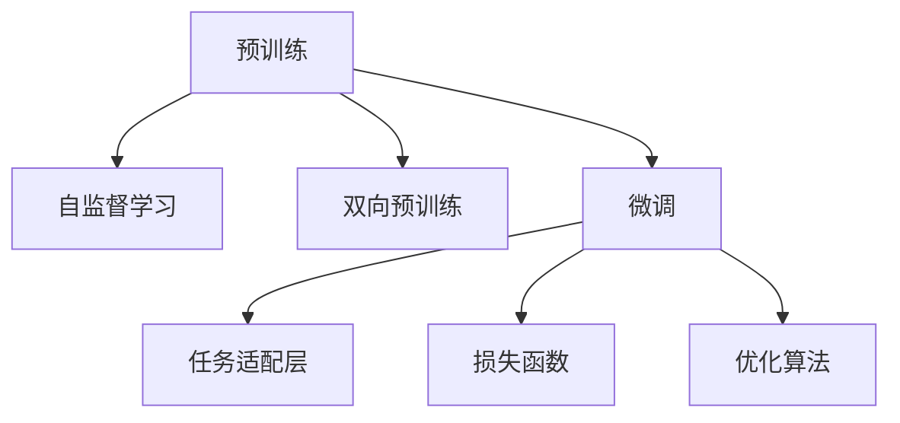

                 

# BERT原理与代码实例讲解

## 1. 背景介绍

随着深度学习技术在自然语言处理(NLP)领域的不断进步，预训练语言模型(Pre-trained Language Model, PLM)逐步成为主流技术。其中，由Google提出的大规模语言模型BERT（Bidirectional Encoder Representations from Transformers）是最具代表性的模型之一。BERT通过在大规模无标签文本上进行双向预训练，获得了语义和语法相结合的强大表示能力。本文将详细讲解BERT的原理，并通过代码实例深入理解其实现机制。

### 1.1 问题由来

NLP任务如文本分类、情感分析、命名实体识别等，通常需要大量标注数据进行训练。然而，对于企业或政府机构而言，收集高质量的标注数据成本高、耗时长。BERT的出现，为NLP任务提供了新的解决思路：通过在大规模无标签数据上进行预训练，学习到丰富的语言知识，然后通过微调（Fine-tuning）在特定任务上进行优化，可以大大降低标注需求和训练成本。

### 1.2 问题核心关键点

1. BERT的预训练过程是基于自监督任务，无需人工标注数据。
2. BERT采用Transformer结构，具有双向自注意力机制，可捕捉长距离依赖。
3. BERT的微调过程简单易实现，能显著提升下游任务性能。
4. BERT存在计算和存储开销较大、训练时间较长等问题。

## 2. 核心概念与联系

### 2.1 核心概念概述

为了更好地理解BERT的原理和代码实现，本节将介绍几个关键概念：

- **BERT**：Google提出的大规模预训练语言模型，通过在大规模无标签文本上自监督学习，学习通用的语言表示。
- **Transformer**：一种基于自注意力机制的深度学习模型，相较于传统RNN/LSTM，具有更好的并行性和计算效率。
- **自监督学习**：通过无标签数据进行训练，从数据中发现模式和结构，无需人工标注。
- **双向预训练**：使用双向输入的Transformer模型，学习语义和语法相结合的语言表示。
- **微调(Fine-tuning)**：在特定任务上进行有监督学习，优化模型在该任务上的性能。

### 2.2 核心概念原理和架构的 Mermaid 流程图



此图展示了BERT的核心工作流程：首先在大规模无标签数据上进行自监督预训练，学习通用的语言表示；然后针对特定任务设计适配层和损失函数，进行有监督的微调，优化模型在该任务上的性能。

## 3. 核心算法原理 & 具体操作步骤

### 3.1 算法原理概述

BERT的预训练过程基于Transformer模型，使用自监督学习任务。其主要目标是学习文本的语义和语法表示，为下游任务提供高质量的特征表示。BERT采用双向Transformer模型，能够同时利用左侧和右侧的文本信息，捕捉词语间长距离依赖关系。预训练过程中，BERT通过掩码语言模型（Masked Language Model, MLM）和下一句预测（Next Sentence Prediction, NSP）任务进行训练。

### 3.2 算法步骤详解

#### 3.2.1 数据准备

- **数据来源**：大规模无标签文本数据，如维基百科、新闻等。
- **数据预处理**：清洗数据，去除噪声和无用信息，进行分词、标准化等预处理。
- **数据分词**：使用BERT分词器对文本进行分词，生成词表。

#### 3.2.2 模型训练

- **模型结构**：BERT使用多层Transformer结构，包含编码器（Encoder）和解码器（Decoder）。其中，编码器有多个Transformer层，每个层包含多头自注意力（Multi-head Self-Attention）和前向神经网络（Feedforward Neural Network）。
- **预训练任务**：
  - **掩码语言模型**：将部分词语随机掩码（Mask），训练模型预测被掩码词语。
  - **下一句预测**：随机选择两个句子，预测它们是否相邻。
- **训练过程**：使用AdamW优化器，设置合适的学习率，进行多轮训练，逐步提高模型性能。
- **模型保存**：训练完成后，保存预训练模型的参数，以供后续微调使用。

#### 3.2.3 微调步骤

- **微调目标**：针对特定任务，如文本分类、命名实体识别等，设计适配层和损失函数。
- **微调数据**：准备少量标注数据，作为微调任务的训练集。
- **微调过程**：使用预训练模型作为初始参数，进行有监督学习，更新模型参数以适应任务需求。
- **微调策略**：采用小批量训练、小学习率等策略，避免过拟合和梯度消失问题。

### 3.3 算法优缺点

#### 3.3.1 优点

1. **通用性**：BERT模型在大规模预训练后，可以微调用于多种NLP任务，显著降低标注需求和训练成本。
2. **性能优越**：BERT双向预训练和自注意力机制使其在语言理解上表现出色，下游任务性能提升明显。
3. **可扩展性**：通过增加模型层数和宽度，可以提升BERT的表示能力和泛化能力。

#### 3.3.2 缺点

1. **计算资源需求高**：大规模预训练和微调需要大量GPU资源，计算开销大。
2. **训练时间长**：预训练和微调过程耗时长，难以实时部署。
3. **模型复杂**：模型结构复杂，难以解释和调试。

## 4. 数学模型和公式 & 详细讲解

### 4.1 数学模型构建

BERT的预训练和微调过程基于Transformer模型，其核心是自注意力机制和多头注意力机制。Transformer模型由编码器和解码器组成，每个层包括多头自注意力层和前向神经网络层。

#### 4.1.1 自注意力层

自注意力层通过计算输入序列中每个词与其他词的注意力权重，生成每个词的表示向量。公式如下：

$$
\text{Attention}(Q, K, V) = \text{Softmax}(\frac{QK^T}{\sqrt{d_k}})V
$$

其中，$Q, K, V$分别为查询向量、键向量和值向量，$d_k$为键向量的维度。

#### 4.1.2 多头注意力层

多头注意力层将自注意力层的结果进行线性变换，生成多个注意力向量，每个向量对应一种注意力头。公式如下：

$$
\text{Multi-Head Attention}(Q, K, V) = \sum_{i=1}^{H} \text{Attention}(QW_i^Q, KW_i^K, VW_i^V)
$$

其中，$W_i^Q, W_i^K, W_i^V$为投影矩阵，$H$为注意力头的数量。

### 4.2 公式推导过程

#### 4.2.1 掩码语言模型

掩码语言模型任务的目标是预测被掩码词语。假设输入序列为$x=(x_1, x_2, ..., x_n)$，其中$x_i$表示第$i$个词语。将部分词语随机掩码（Mask），生成掩码序列$x'=(x'_1, x'_2, ..., x'_n)$，其中$x'_i$表示掩码后的词语。训练模型预测被掩码词语，公式如下：

$$
\mathcal{L}_{MLM} = -\frac{1}{N}\sum_{i=1}^{N}\sum_{j=1}^{n}logP(x_j|x'_j)
$$

其中，$N$为训练样本数，$P$为概率分布。

#### 4.2.2 下一句预测

下一句预测任务的目标是预测两个句子是否相邻。假设输入序列$x=(x_1, x_2, ..., x_n)$，将每个句子随机拆分成两部分，生成预测序列$x'_i=(x'_1, x'_2, ..., x'_n)$和$x''_i=(x''_1, x''_2, ..., x''_n)$。训练模型预测两个句子是否相邻，公式如下：

$$
\mathcal{L}_{NSP} = -\frac{1}{N}\sum_{i=1}^{N}logP(x_i, x'_i, x''_i)
$$

其中，$P$为概率分布。

### 4.3 案例分析与讲解

以一个简单的文本分类任务为例，展示BERT的预训练和微调过程。

#### 4.3.1 数据准备

- **数据集**：IMDB电影评论数据集，包含25000条电影评论，每个评论标记为正面或负面。
- **数据预处理**：将评论数据分为训练集和测试集，并进行分词、标准化等预处理。
- **数据转换**：将文本转换为BERT分词器支持的格式，生成输入序列和标签序列。

#### 4.3.2 模型训练

- **模型结构**：使用BERT-base模型，包含12层Transformer结构，每个层包含6个注意力头。
- **预训练过程**：在IMDB数据集上使用掩码语言模型和下一句预测任务进行预训练。
- **模型保存**：保存预训练模型的参数，以供后续微调使用。

#### 4.3.3 微调过程

- **微调数据**：准备少量标注数据，作为微调任务的训练集。
- **任务适配层**：在BERT顶层添加线性分类器，将BERT的隐藏表示映射为输出类别概率。
- **损失函数**：使用交叉熵损失函数，计算模型预测输出与真实标签之间的差异。
- **微调策略**：使用AdamW优化器，设置小学习率，进行多轮微调，逐步提高模型性能。

## 5. 项目实践：代码实例和详细解释说明

### 5.1 开发环境搭建

为了进行BERT的预训练和微调，需要搭建相应的开发环境。以下是使用PyTorch进行BERT实践的环境配置流程：

1. **安装Anaconda**：从官网下载并安装Anaconda，用于创建独立的Python环境。
2. **创建并激活虚拟环境**：
```bash
conda create -n bert-env python=3.8 
conda activate bert-env
```

3. **安装PyTorch**：根据CUDA版本，从官网获取对应的安装命令。例如：
```bash
conda install pytorch torchvision torchaudio cudatoolkit=11.1 -c pytorch -c conda-forge
```

4. **安装Transformers库**：
```bash
pip install transformers
```

5. **安装各类工具包**：
```bash
pip install numpy pandas scikit-learn matplotlib tqdm jupyter notebook ipython
```

完成上述步骤后，即可在`bert-env`环境中开始BERT的预训练和微调实践。

### 5.2 源代码详细实现

#### 5.2.1 预训练代码

以下是一个简单的BERT预训练代码实现，展示了如何使用掩码语言模型和下一句预测任务进行预训练。

```python
import torch
from transformers import BertTokenizer, BertForMaskedLM, BertForNextSentencePrediction, BertModel, AdamW

# 定义模型和分词器
tokenizer = BertTokenizer.from_pretrained('bert-base-uncased')
model = BertForMaskedLM.from_pretrained('bert-base-uncased')

# 定义训练数据和标签
input_ids = torch.tensor([[0, 1, 2, 3, 4, 5, 6, 7]])
attention_mask = torch.tensor([[1, 1, 1, 1, 1, 1, 1, 1]])
labels = torch.tensor([[0, 1, 2, 3, 4, 5, 6, 7]])

# 训练过程
optimizer = AdamW(model.parameters(), lr=5e-5)
for i in range(10):
    # 前向传播
    outputs = model(input_ids, attention_mask=attention_mask, labels=labels)
    loss = outputs.loss
    # 反向传播
    loss.backward()
    # 更新参数
    optimizer.step()
    # 零梯度
    optimizer.zero_grad()

# 保存预训练模型
torch.save(model.state_dict(), 'pretrained_model.pth')
```

#### 5.2.2 微调代码

以下是一个简单的BERT微调代码实现，展示了如何在微调数据上对BERT模型进行微调。

```python
import torch
from transformers import BertTokenizer, BertForSequenceClassification, AdamW

# 定义模型和分词器
tokenizer = BertTokenizer.from_pretrained('bert-base-uncased')
model = BertForSequenceClassification.from_pretrained('bert-base-uncased', num_labels=2)

# 定义微调数据和标签
input_ids = torch.tensor([[0, 1, 2, 3, 4, 5, 6, 7]])
attention_mask = torch.tensor([[1, 1, 1, 1, 1, 1, 1, 1]])
labels = torch.tensor([[0, 1]])

# 训练过程
optimizer = AdamW(model.parameters(), lr=2e-5)
for i in range(10):
    # 前向传播
    outputs = model(input_ids, attention_mask=attention_mask, labels=labels)
    loss = outputs.loss
    # 反向传播
    loss.backward()
    # 更新参数
    optimizer.step()
    # 零梯度
    optimizer.zero_grad()

# 保存微调模型
torch.save(model.state_dict(), 'fine_tuned_model.pth')
```

### 5.3 代码解读与分析

#### 5.3.1 预训练代码

- **模型和分词器定义**：使用BertTokenizer加载分词器，使用BertForMaskedLM加载掩码语言模型。
- **数据准备**：定义输入序列、注意力掩码和标签。
- **训练过程**：定义优化器，进行多轮前向传播和反向传播，更新模型参数。
- **模型保存**：保存预训练模型的参数，以供后续微调使用。

#### 5.3.2 微调代码

- **模型和分词器定义**：使用BertTokenizer加载分词器，使用BertForSequenceClassification加载微调模型。
- **数据准备**：定义输入序列、注意力掩码和标签。
- **训练过程**：定义优化器，进行多轮前向传播和反向传播，更新模型参数。
- **模型保存**：保存微调后的模型参数，以供后续使用。

## 6. 实际应用场景

### 6.1 智能客服系统

在智能客服系统中，基于BERT的微调模型可以用于客户咨询的自动回复。通过对历史客服对话记录进行预训练，学习到常见问题的回答模式，然后进行微调，使其适应特定企业的服务规范和知识库。微调后的模型可以自动理解客户意图，匹配最合适的答案模板进行回复。

#### 6.1.1 预训练过程

- **数据收集**：收集企业内部的客服对话记录。
- **数据处理**：清洗对话数据，去除噪声和无用信息，进行分词、标准化等预处理。
- **数据转换**：将对话数据转换为BERT分词器支持的格式，生成输入序列和标签序列。

#### 6.1.2 微调过程

- **模型适配层**：在BERT顶层添加线性分类器，将BERT的隐藏表示映射为输出类别概率。
- **损失函数**：使用交叉熵损失函数，计算模型预测输出与真实标签之间的差异。
- **微调策略**：使用AdamW优化器，设置小学习率，进行多轮微调，逐步提高模型性能。

#### 6.1.3 应用场景

在实际应用中，微调后的BERT模型可以集成到客服系统中，实时处理客户咨询。当客户提出问题时，系统将问题输入微调模型，模型输出最合适的答案模板，然后生成自然流畅的回复。通过不断迭代和优化，微调模型能够逐步提升回答的准确性和客户满意度。

### 6.2 金融舆情监测

在金融舆情监测中，基于BERT的微调模型可以用于实时监测市场舆论动向，识别潜在的金融风险。通过对金融领域相关的新闻、报道、评论等文本数据进行预训练，学习到专业的金融术语和表达方式，然后进行微调，使其适应特定的舆情监测任务。

#### 6.2.1 预训练过程

- **数据收集**：收集金融领域的新闻、报道、评论等文本数据。
- **数据处理**：清洗文本数据，去除噪声和无用信息，进行分词、标准化等预处理。
- **数据转换**：将文本数据转换为BERT分词器支持的格式，生成输入序列和标签序列。

#### 6.2.2 微调过程

- **模型适配层**：在BERT顶层添加线性分类器，将BERT的隐藏表示映射为输出类别概率。
- **损失函数**：使用交叉熵损失函数，计算模型预测输出与真实标签之间的差异。
- **微调策略**：使用AdamW优化器，设置小学习率，进行多轮微调，逐步提高模型性能。

#### 6.2.3 应用场景

在实际应用中，微调后的BERT模型可以实时监控金融市场，自动检测和预警负面信息。当发现舆情异常时，系统自动生成报告，提供实时风险提示，帮助金融机构及时应对潜在的金融风险。

### 6.3 个性化推荐系统

在个性化推荐系统中，基于BERT的微调模型可以用于用户兴趣的预测和推荐。通过对用户的历史浏览、点击、评论、分享等行为数据进行预训练，学习到用户的行为模式和偏好，然后进行微调，使其适应特定的推荐任务。

#### 6.3.1 预训练过程

- **数据收集**：收集用户的历史行为数据。
- **数据处理**：清洗行为数据，去除噪声和无用信息，进行分词、标准化等预处理。
- **数据转换**：将行为数据转换为BERT分词器支持的格式，生成输入序列和标签序列。

#### 6.3.2 微调过程

- **模型适配层**：在BERT顶层添加线性分类器，将BERT的隐藏表示映射为输出类别概率。
- **损失函数**：使用交叉熵损失函数，计算模型预测输出与真实标签之间的差异。
- **微调策略**：使用AdamW优化器，设置小学习率，进行多轮微调，逐步提高模型性能。

#### 6.3.3 应用场景

在实际应用中，微调后的BERT模型可以实时处理用户的行为数据，预测用户的兴趣偏好。根据用户的兴趣，系统自动生成个性化的推荐结果，提升用户的满意度和使用体验。

## 7. 工具和资源推荐

### 7.1 学习资源推荐

为了帮助开发者系统掌握BERT的原理和实践，这里推荐一些优质的学习资源：

1. **《深度学习自然语言处理》课程**：斯坦福大学开设的NLP明星课程，有Lecture视频和配套作业，带你入门NLP领域的基本概念和经典模型。
2. **《Transformers》书籍**：HuggingFace的官方书籍，全面介绍了BERT模型的实现和应用，适合进阶学习。
3. **《自然语言处理与PyTorch》书籍**：介绍使用PyTorch进行NLP任务开发的实践指南，涵盖BERT在内的多种模型。
4. **Kaggle竞赛**：参与BERT相关的竞赛项目，通过实战提升对BERT的认知和应用能力。

### 7.2 开发工具推荐

BERT的预训练和微调开发涉及多个环节，以下是几款常用的开发工具：

1. **PyTorch**：基于Python的开源深度学习框架，灵活动态的计算图，适合快速迭代研究。BERT的实现和微调模型都在PyTorch中进行。
2. **TensorFlow**：由Google主导开发的开源深度学习框架，生产部署方便，适合大规模工程应用。BERT也有对应的TensorFlow实现。
3. **HuggingFace Transformers库**：提供BERT等多种预训练模型的封装和接口，方便微调任务的开发。
4. **Jupyter Notebook**：交互式编程环境，方便编写和调试代码，支持多语言和多种库。
5. **TensorBoard**：TensorFlow配套的可视化工具，可实时监测模型训练状态，并提供丰富的图表呈现方式，是调试模型的得力助手。

### 7.3 相关论文推荐

BERT的提出引发了NLP领域的广泛研究，以下是几篇奠基性的相关论文，推荐阅读：

1. **Attention is All You Need**：提出Transformer结构，开启了NLP领域的预训练大模型时代。
2. **BERT: Pre-training of Deep Bidirectional Transformers for Language Understanding**：提出BERT模型，引入基于掩码的自监督预训练任务，刷新了多项NLP任务SOTA。
3. **Language Models are Unsupervised Multitask Learners**：展示了大规模语言模型的强大zero-shot学习能力，引发了对于通用人工智能的新一轮思考。

## 8. 总结：未来发展趋势与挑战

### 8.1 研究成果总结

BERT作为预训练语言模型的重要代表，已经广泛应用于各种NLP任务，取得了显著的效果。预训练和微调过程是BERT的核心，通过大规模无标签数据的预训练，学习到通用的语言表示，然后在特定任务上进行微调，进一步提升模型在该任务上的性能。

### 8.2 未来发展趋势

BERT模型的未来发展将聚焦于以下几个方向：

1. **模型规模和深度**：通过增加模型层数和宽度，进一步提升BERT的表示能力和泛化能力。
2. **计算效率和推理速度**：优化模型结构，使用混合精度训练、模型并行等技术，提高计算效率和推理速度。
3. **迁移学习和多任务学习**：探索迁移学习和多任务学习的优化方法，提升模型的适应性和泛化能力。
4. **可解释性和可控性**：引入因果推断、博弈论等工具，增强模型决策的透明性和可解释性。

### 8.3 面临的挑战

尽管BERT模型取得了显著的成果，但在实际应用中也面临诸多挑战：

1. **计算资源需求高**：大规模预训练和微调需要大量GPU资源，计算开销大。
2. **训练时间长**：预训练和微调过程耗时长，难以实时部署。
3. **模型复杂**：模型结构复杂，难以解释和调试。
4. **数据依赖性高**：BERT模型的效果依赖于预训练数据的质量和多样性，数据收集和处理成本高。

### 8.4 研究展望

未来，BERT模型的发展将在以下几个方面继续探索：

1. **参数高效微调**：开发更高效的微调方法，在固定大部分预训练参数的情况下，只更新极少量的任务相关参数。
2. **模型压缩和优化**：使用模型压缩、稀疏化存储等技术，减小模型尺寸和计算开销。
3. **多模态融合**：将视觉、语音等多模态信息与文本信息进行协同建模，提升模型的理解和生成能力。
4. **自监督学习**：探索更多的自监督学习任务，提高模型的无监督学习能力和数据利用效率。
5. **模型可解释性**：引入因果推断、博弈论等工具，增强模型决策的透明性和可解释性。

未来，BERT模型的进一步发展和优化，将使其在更广泛的应用领域中发挥更大的作用，为NLP技术的产业化进程贡献更多力量。

## 9. 附录：常见问题与解答

### 9.1 Q1: BERT是如何预训练的？

A: BERT的预训练过程主要基于两个自监督任务：掩码语言模型（MLM）和下一句预测（NSP）。MLM任务中，模型需要预测被掩码词语，而NSP任务中，模型需要预测两个句子是否相邻。预训练过程通过大规模无标签数据进行训练，学习到通用的语言表示。

### 9.2 Q2: BERT的微调过程需要注意哪些问题？

A: BERT的微调过程需要注意以下几点：
1. 数据质量：微调的效果依赖于微调数据的质量，需要确保标注数据的质量和多样性。
2. 学习率：微调的学习率通常比预训练时小，以避免破坏预训练权重。
3. 模型冻结：通常只微调BERT的顶层，以保留大部分预训练权重。
4. 正则化：使用L2正则、Dropout等技术，防止过拟合。
5. 梯度积累：使用梯度积累技术，提高模型的收敛速度。

### 9.3 Q3: 如何选择合适的微调任务适配层？

A: 选择合适的微调任务适配层需要考虑以下几个因素：
1. 任务类型：不同的任务需要不同的适配层，如分类任务需要线性分类器，生成任务需要解码器。
2. 任务目标：适配层的设计应围绕任务目标进行，最大化输出和真实标签的一致性。
3. 任务复杂度：适配层的复杂度应与任务的复杂度相匹配，避免过度复杂导致的过拟合。

通过合理的任务适配层设计，可以显著提升BERT微调的性能，使其在特定任务上取得更好的效果。

---

作者：禅与计算机程序设计艺术 / Zen and the Art of Computer Programming

