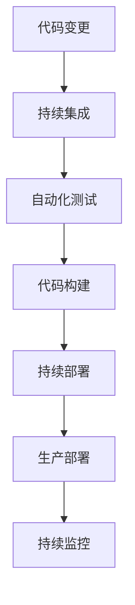

                 

# CI/CD管道：自动化软件交付流程

> 关键词：CI/CD, DevOps, 软件交付, 自动化, 持续集成, 持续部署, 代码质量, 系统可靠性, 部署效率

## 1. 背景介绍

在现代软件开发中，软件的交付流程变得越来越复杂，需求变更频繁，代码规模不断增大，各个环节（如代码编写、测试、部署等）也越来越依赖于人工干预。这种模式下，代码错误、功能缺陷、部署延迟等问题层出不穷，严重影响了软件交付的速度和质量。为了应对这一挑战，DevOps范式应运而生，强调开发和运维的无缝融合，通过自动化工具和流程实现软件交付的自动化和持续性。

其中，持续集成（Continuous Integration, CI）和持续部署（Continuous Deployment, CD）是DevOps中的两个核心实践。持续集成通过自动化测试和代码集成，及时发现和修复代码问题，确保软件在发布前符合预定的质量标准；持续部署则进一步扩展到自动化部署和回滚，实现从开发到部署的全程自动化。

CI/CD管道（Pipeline）是将持续集成和持续部署的流程整合在一起的自动化软件交付工具。它通过构建、测试、部署等各个环节的自动化，将软件的构建和部署过程变得快速、可靠和高效。

## 2. 核心概念与联系

### 2.1 核心概念概述

为了深入理解CI/CD管道的工作原理和架构，本节将介绍几个密切相关的核心概念：

- 持续集成（CI）：指在软件开发过程中，将代码的变更频繁集成到主干分支，并通过自动化测试保证代码质量。常见工具包括Jenkins、GitLab CI等。
- 持续部署（CD）：指将通过CI过程验证的代码自动部署到生产环境，以实现软件交付的自动化和快速发布。常见工具包括Jenkins、GitLab CI、Travis CI等。
- DevOps：指将开发和运维的流程、工具和人员无缝融合，通过持续交付实现软件快速、可靠、高效地发布。DevOps的核心理念包括自动化、持续交付、持续监控等。
- 自动化：指通过编写脚本或使用自动化工具，减少人工干预，实现流程的自动化，提高效率和一致性。常见的自动化工具包括Ansible、Chef、Puppet等。
- 管道（Pipeline）：指将持续集成和持续部署的各个环节连接起来的自动化流程，包括代码提交、编译、测试、部署等步骤，形成一个闭环的自动化流水线。

这些核心概念之间的逻辑关系可以通过以下Mermaid流程图来展示：



这个流程图展示了一个基本的CI/CD管道流程：代码变更触发持续集成，通过自动化测试后进入代码构建，构建后的代码进入持续部署，最终部署到生产环境并持续监控。

## 3. 核心算法原理 & 具体操作步骤
### 3.1 算法原理概述

CI/CD管道的核心思想是通过自动化工具和流程，将软件的构建、测试、部署等各个环节串联起来，形成一个闭环的自动化流水线。其基本原理可以概括为以下几个步骤：

1. 代码变更：开发者提交代码变更到版本控制系统，如Git、SVN等。
2. 持续集成：通过自动化脚本和工具，如Jenkins、GitLab CI等，对提交的代码进行编译和测试，确保代码质量。
3. 代码构建：通过构建工具，如Maven、Gradle等，对代码进行编译、打包等操作。
4. 持续部署：通过自动化部署工具，如Jenkins、Ansible等，将构建后的代码部署到生产环境。
5. 生产部署：将经过测试和构建的代码部署到生产服务器上，完成软件的发布。
6. 持续监控：通过监控工具，如Prometheus、Grafana等，对部署后的系统进行实时监控和报警，及时发现和修复问题。

这些步骤通过自动化工具和脚本连接起来，形成一个持续的交付流程。开发者在提交代码变更后，可以立即看到测试结果和部署反馈，快速发现和修复问题，提高软件交付的速度和质量。

### 3.2 算法步骤详解

以下是CI/CD管道中各个步骤的具体实现细节：

**Step 1: 代码变更**

- 开发者将代码提交到版本控制系统，如Git，触发CI/CD管道的第一步。
- 通过配置文件或API，通知CI/CD管道工具获取最新代码变更。

**Step 2: 持续集成**

- 在CI/CD管道工具上配置自动化测试脚本，如Jenkins、GitLab CI等。
- 脚本从版本控制系统拉取最新代码变更，进行编译和测试，确保代码质量。
- 测试结果以报告形式展示，开发者可以立即看到测试通过与否。

**Step 3: 代码构建**

- 配置自动化构建工具，如Maven、Gradle等，对代码进行编译、打包等操作。
- 构建工具生成可部署的包，如JAR、WAR等。
- 将构建后的代码包存储在分布式文件系统或镜像仓库中，便于后续部署。

**Step 4: 持续部署**

- 配置自动化部署工具，如Jenkins、Ansible等，将构建后的代码包部署到生产环境。
- 部署工具对生产服务器进行配置，安装依赖，启动应用程序。
- 部署后的代码通过配置文件或API通知CI/CD管道工具。

**Step 5: 生产部署**

- 将部署后的代码部署到生产环境，完成软件的发布。
- 生产部署工具对生产服务器进行配置，安装依赖，启动应用程序。
- 部署后的代码通过配置文件或API通知CI/CD管道工具。

**Step 6: 持续监控**

- 配置自动化监控工具，如Prometheus、Grafana等，对部署后的系统进行实时监控和报警。
- 监控工具采集生产服务器的性能指标，如CPU、内存、请求响应时间等。
- 监控工具对异常情况进行告警，及时发现和修复问题。

### 3.3 算法优缺点

CI/CD管道通过自动化流程提高了软件交付的速度和质量，但也存在一些缺点：

**优点：**

1. 提高交付速度：自动化流程减少了人工干预，加快了软件的构建、测试和部署速度。
2. 提升软件质量：持续集成和自动化测试保证了代码质量，减少了手工测试中的遗漏。
3. 增强稳定性：持续监控及时发现和修复问题，提高了系统的稳定性。
4. 降低成本：自动化流程减少了人工测试和部署的成本。

**缺点：**

1. 复杂性高：CI/CD管道的配置和维护复杂，需要较高的技术水平。
2. 依赖环境：CI/CD管道的运行依赖于各种自动化工具和环境，一旦环境出现问题，可能导致流程中断。
3. 兼容性差：不同开发团队之间的代码和工具可能存在兼容性问题。
4. 风险集中：一旦CI/CD管道配置不当，可能导致灾难性故障。

尽管存在这些缺点，但CI/CD管道的自动化流程仍然是现代软件开发中不可或缺的一部分。未来的研究将更多地关注简化配置、提高兼容性和可靠性，以进一步提高软件交付的效率和质量。

### 3.4 算法应用领域

CI/CD管道广泛应用于软件开发、金融、电商、教育等众多领域，以下是几个典型的应用场景：

**软件开发**

- 持续集成和自动化测试保证了代码质量，减少了手工测试中的遗漏。
- 持续部署和自动化部署实现了软件的快速发布。
- 持续监控确保了系统的稳定性和性能。

**金融**

- 金融领域对数据安全和系统稳定性要求较高，CI/CD管道确保了软件交付的快速和可靠。
- 自动化流程减少了手工测试和部署的工作量，提高了工作效率。
- 持续监控对交易系统的稳定性和数据安全提供了保障。

**电商**

- 电商平台的业务逻辑复杂，依赖于大量的后台系统和第三方服务。
- 通过CI/CD管道实现服务的快速发布和回滚，保证了业务的连续性和稳定性。
- 持续监控对系统的性能和可用性进行了实时监控和报警，提高了用户体验。

**教育**

- 教育领域对教学资源的更新频率较高，需要快速、可靠的软件发布。
- 通过CI/CD管道实现教学资源的快速部署和回滚，保证了教学的连续性和稳定性。
- 持续监控对教学系统的稳定性和数据安全提供了保障。

除了这些应用场景外，CI/CD管道还在医疗、制造、能源等多个领域得到广泛应用，推动了各行各业的信息化和数字化转型。

## 4. 数学模型和公式 & 详细讲解 & 举例说明

### 4.1 数学模型构建

本节将使用数学语言对CI/CD管道的工作流程进行更加严格的刻画。

**数学模型定义**

- 设 $V$ 为代码变更集合，$S$ 为测试脚本集合，$B$ 为代码构建工具集合，$D$ 为部署工具集合，$M$ 为监控工具集合。
- 定义代码变更函数 $f:V \rightarrow S$，将代码变更映射到测试脚本。
- 定义测试函数 $g:S \rightarrow \{0,1\}$，将测试结果映射到是否通过。
- 定义代码构建函数 $h:V \rightarrow B$，将代码变更映射到构建工具。
- 定义代码构建函数 $j:B \rightarrow \{0,1\}$，将构建结果映射到是否成功。
- 定义部署函数 $k:V \rightarrow D$，将代码变更映射到部署工具。
- 定义部署函数 $l:D \rightarrow \{0,1\}$，将部署结果映射到是否成功。
- 定义监控函数 $m:V \rightarrow M$，将代码变更映射到监控工具。
- 定义监控函数 $n:M \rightarrow \{0,1\}$，将监控结果映射到是否正常。

**模型目标函数**

- 定义CI/CD管道的目标函数 $F:V \rightarrow [0,1]$，表示代码变更的成功率。
- 目标函数 $F$ 的定义如下：

$$
F(v) = \begin{cases}
1, & \text{如果 } g(f(v)) = 1 \text{ 且 } j(h(v)) = 1 \text{ 且 } l(k(v)) = 1 \text{ 且 } n(m(v)) = 1 \\
0, & \text{如果 } g(f(v)) = 0 \text{ 或 } j(h(v)) = 0 \text{ 或 } l(k(v)) = 0 \text{ 或 } n(m(v)) = 0 \\
\end{cases}
$$

### 4.2 公式推导过程

以下我们以一个简单的示例来推导CI/CD管道的目标函数。

假设代码变更函数 $f(v)$ 将代码变更 $v$ 映射到测试脚本 $s$，测试函数 $g(s)$ 将测试结果映射到是否通过，代码构建函数 $h(v)$ 将代码变更 $v$ 映射到构建工具 $b$，构建函数 $j(b)$ 将构建结果映射到是否成功，部署函数 $k(v)$ 将代码变更 $v$ 映射到部署工具 $d$，部署函数 $l(d)$ 将部署结果映射到是否成功，监控函数 $m(v)$ 将代码变更 $v$ 映射到监控工具 $m$，监控函数 $n(m)$ 将监控结果映射到是否正常。

此时，代码变更的成功率 $F(v)$ 可以通过以下公式计算：

$$
F(v) = g(f(v)) \times j(h(v)) \times l(k(v)) \times n(m(v))
$$

这个公式说明了代码变更的成功率是由测试结果、构建结果、部署结果和监控结果共同决定的。

在实际应用中，可能需要对不同的环节进行加权处理，以保证CI/CD管道的整体效果。例如，对于测试环节，可以通过调整测试脚本的复杂度来控制测试时间，从而影响测试结果的权重。

### 4.3 案例分析与讲解

下面以一个简单的示例来说明CI/CD管道的工作流程：

**示例：电商平台的订单系统**

- 代码变更：开发者在Git上提交了新的订单处理逻辑。
- 持续集成：CI/CD管道触发自动化测试脚本，对代码进行测试。
- 代码构建：构建工具Maven对代码进行编译和打包。
- 持续部署：部署工具Jenkins将构建后的代码部署到生产环境。
- 生产部署：订单系统在生产服务器上部署完成。
- 持续监控：监控工具Prometheus采集订单系统的性能指标，对异常情况进行告警。

通过这个示例，可以看到CI/CD管道的各个环节是如何相互协作，确保订单系统的快速、可靠、高效地交付。

## 5. 项目实践：代码实例和详细解释说明
### 5.1 开发环境搭建

在进行CI/CD管道实践前，我们需要准备好开发环境。以下是使用Python进行Jenkins自动化脚本的开发环境配置流程：

1. 安装Jenkins：从官网下载并安装Jenkins，建议安装最新版本，以获得最新的功能和支持。
2. 安装Jenkins插件：Jenkins支持多种插件，如Maven、Gradle、Git等，需要根据项目需求进行安装。
3. 安装Python：Jenkins运行需要Python解释器，可以从官网下载并安装Python 3.x版本。
4. 安装Jenkins所需依赖：安装Jenkins所需的依赖库，如pip、pipenv、virtualenv等。
5. 配置环境变量：配置Jenkins所需的环境变量，如JAVA_HOME、PATH、PYTHON_HOME等。
6. 启动Jenkins：启动Jenkins服务器，通过Web界面进行配置和管理。

完成上述步骤后，即可在Jenkins上开始CI/CD管道的实践。

### 5.2 源代码详细实现

下面以一个简单的示例来说明如何在Jenkins上实现CI/CD管道：

首先，我们需要在Jenkins上创建一个项目，并配置项目的构建、测试和部署等各个环节：

**创建项目**

- 在Jenkins上创建一个新的项目，填写项目名称、描述等基本信息。
- 配置项目的源代码管理，选择Git仓库，填写仓库地址和分支。

**配置构建步骤**

- 在项目的构建步骤中，添加Maven或Gradle等构建工具，配置构建命令和构建参数。
- 通过构建步骤将代码构建为可部署的包。

**配置测试步骤**

- 在项目的测试步骤中，添加自动化测试脚本，如JUnit、Selenium等。
- 通过测试步骤验证代码变更的质量。

**配置部署步骤**

- 在项目的部署步骤中，添加Ansible或Jenkins Pipeline等部署工具。
- 通过部署步骤将构建后的代码部署到生产环境。

**配置监控步骤**

- 在项目的监控步骤中，添加Prometheus或Grafana等监控工具。
- 通过监控步骤实时监控和报警生产服务器的性能指标。

**示例代码**

```python
from jenkins import Jenkins

def build_code():
    # 代码构建命令
    build_command = 'mvn clean install'
    jenkins = Jenkins('http://localhost:8080', username='root', password='root')
    jenkins.build_job('project-name', params={'build_command': build_command})

def test_code():
    # 测试命令
    test_command = 'java -jar test.jar'
    jenkins = Jenkins('http://localhost:8080', username='root', password='root')
    jenkins.build_job('project-name', params={'test_command': test_command})

def deploy_code():
    # 部署命令
    deploy_command = 'ansible-playbook deploy.yml'
    jenkins = Jenkins('http://localhost:8080', username='root', password='root')
    jenkins.build_job('project-name', params={'deploy_command': deploy_command})

def monitor_code():
    # 监控命令
    monitor_command = 'prometheus'
    jenkins = Jenkins('http://localhost:8080', username='root', password='root')
    jenkins.build_job('project-name', params={'monitor_command': monitor_command})
```

### 5.3 代码解读与分析

让我们再详细解读一下关键代码的实现细节：

**Jenkins的API**

- Jenkins提供了丰富的API，可以用于自动化脚本的编写和执行。API包括对项目、构建、测试、部署等各个环节的配置和管理。
- Jenkins API支持多种编程语言，包括Python、Java等。

**代码构建**

- 通过Jenkins API，我们可以在项目的构建步骤中添加Maven或Gradle等构建工具。
- 构建命令和参数通过Jenkins的构建接口传递，Jenkins会自动执行构建命令，生成可部署的包。

**代码测试**

- 通过Jenkins API，我们可以在项目的测试步骤中添加自动化测试脚本。
- 测试命令和参数通过Jenkins的测试接口传递，Jenkins会自动执行测试脚本，生成测试报告。

**代码部署**

- 通过Jenkins API，我们可以在项目的部署步骤中添加Ansible或Jenkins Pipeline等部署工具。
- 部署命令和参数通过Jenkins的部署接口传递，Jenkins会自动执行部署命令，将构建后的代码部署到生产环境。

**代码监控**

- 通过Jenkins API，我们可以在项目的监控步骤中添加Prometheus或Grafana等监控工具。
- 监控命令和参数通过Jenkins的监控接口传递，Jenkins会自动执行监控命令，实时监控和报警生产服务器的性能指标。

## 6. 实际应用场景

### 6.1 智能客服系统

基于CI/CD管道的智能客服系统，可以快速部署和更新，确保客户咨询的及时性和准确性。

在技术实现上，可以收集客户的历史咨询记录，将其作为监督数据，对预训练模型进行微调。通过CI/CD管道，将微调后的模型快速部署到生产环境，实现智能客服的实时响应。同时，通过监控工具实时监控系统性能，及时发现和修复问题。

### 6.2 金融舆情监测

金融舆情监测系统需要对大量的新闻、评论、数据进行实时分析，以确保市场数据的准确性和及时性。

在技术实现上，可以收集金融领域的相关数据，通过CI/CD管道进行实时分析。通过自动化脚本和工具，对数据进行清洗、处理和分析，生成实时报告。同时，通过监控工具实时监控系统性能，及时发现和修复问题。

### 6.3 个性化推荐系统

个性化推荐系统需要快速响应用户的实时请求，提供个性化的推荐内容。

在技术实现上，可以通过CI/CD管道快速更新推荐模型。通过自动化脚本和工具，对用户的行为数据进行实时分析，生成个性化推荐结果。同时，通过监控工具实时监控系统性能，及时发现和修复问题。

### 6.4 未来应用展望

随着CI/CD管道的不断发展和完善，其应用领域将会更加广泛，涉及各个垂直行业。未来，CI/CD管道将在以下几个方面得到更多应用：

- 医疗：实现医疗系统的快速部署和更新，提升医疗服务质量。
- 教育：实现教育资源的快速部署和更新，提高教育效果。
- 制造：实现制造系统的快速部署和更新，提升生产效率。
- 能源：实现能源系统的快速部署和更新，提高能源管理水平。

CI/CD管道的持续集成和持续部署机制，将成为各行各业信息化的重要组成部分，推动数字经济的发展。

## 7. 工具和资源推荐
### 7.1 学习资源推荐

为了帮助开发者系统掌握CI/CD管道的理论基础和实践技巧，这里推荐一些优质的学习资源：

1. 《DevOps实践指南》：这是一本介绍DevOps实践的书籍，涵盖了持续集成、持续部署、持续监控等方面的内容，适合初学者和进阶开发者阅读。
2. Jenkins官方文档：Jenkins官方文档提供了详细的配置和使用指南，帮助开发者快速上手Jenkins的开发和部署。
3. GitLab CI文档：GitLab CI官方文档提供了丰富的配置和使用示例，适合开发者快速上手CI/CD管道的开发和部署。
4. Ansible官方文档：Ansible官方文档提供了详细的配置和使用指南，帮助开发者快速上手Ansible的部署和自动化。
5. Docker官方文档：Docker官方文档提供了详细的容器化部署和使用指南，帮助开发者快速上手容器化的部署和自动化。

通过对这些资源的学习实践，相信你一定能够快速掌握CI/CD管道的精髓，并用于解决实际的开发和部署问题。

### 7.2 开发工具推荐

高效的开发离不开优秀的工具支持。以下是几款用于CI/CD管道开发的常用工具：

1. Jenkins：基于Web的自动化开源工具，支持持续集成、持续部署和持续监控，广泛应用于软件开发和IT运维。
2. GitLab CI：GitLab社区开发的支持持续集成和持续部署的工具，支持多种配置方式和插件，广泛应用于软件开发和IT运维。
3. Travis CI：基于云平台的持续集成和持续部署工具，支持多种编程语言和框架，广泛应用于软件开发和IT运维。
4. Ansible：基于Python的开源自动化工具，支持自动化部署和管理，广泛应用于IT运维和DevOps。
5. Docker：基于容器的自动化部署工具，支持分布式容器编排和调度，广泛应用于软件开发和IT运维。

合理利用这些工具，可以显著提升CI/CD管道的开发效率，加快创新迭代的步伐。

### 7.3 相关论文推荐

CI/CD管道的不断发展源于学界的持续研究。以下是几篇奠基性的相关论文，推荐阅读：

1. "Continuous Integration: A Survey"：这篇论文总结了持续集成的理论和实践，介绍了持续集成的历史、现状和未来方向。
2. "Continuous Deployment: A Survey"：这篇论文总结了持续部署的理论和实践，介绍了持续部署的历史、现状和未来方向。
3. "Continuous Integration and Continuous Deployment: A Survey"：这篇论文总结了持续集成和持续部署的理论和实践，介绍了持续集成和持续部署的历史、现状和未来方向。
4. "CI/CD: A Survey"：这篇论文总结了CI/CD的理论和实践，介绍了CI/CD的历史、现状和未来方向。
5. "CI/CD: A Survey of Current Practices and Future Directions"：这篇论文总结了CI/CD的当前实践和未来方向，介绍了CI/CD的历史、现状和未来方向。

这些论文代表了大规模集成部署的演进，可以帮助研究者把握学科前进方向，激发更多的创新灵感。

## 8. 总结：未来发展趋势与挑战

### 8.1 研究成果总结

本文对CI/CD管道的自动化软件交付流程进行了全面系统的介绍。首先阐述了CI/CD管道的研究背景和意义，明确了其在新时代软件交付中的重要性。其次，从原理到实践，详细讲解了CI/CD管道的数学模型和核心步骤，给出了CI/CD管道的完整代码实例。同时，本文还广泛探讨了CI/CD管道在智能客服、金融舆情、个性化推荐等多个领域的应用前景，展示了CI/CD管道的巨大潜力。此外，本文精选了CI/CD管道的各类学习资源，力求为读者提供全方位的技术指引。

通过本文的系统梳理，可以看到，CI/CD管道作为DevOps的核心实践，已经成功推动了软件交付的自动化和持续化。它通过构建、测试、部署等各个环节的自动化，将软件的构建和部署过程变得快速、可靠和高效。CI/CD管道在各个垂直行业的应用，正在不断拓展其应用边界，推动数字经济的发展。

### 8.2 未来发展趋势

展望未来，CI/CD管道的发展将呈现以下几个趋势：

1. 云原生CI/CD：随着云原生技术的不断发展，云平台原生支持CI/CD将成为主流趋势。云原生CI/CD具有更好的扩展性和灵活性，能够更好地支持微服务架构和DevOps实践。
2. 自动化测试和部署：未来的CI/CD管道将更多地采用自动化测试和部署工具，如JUnit、Selenium、Ansible等，以提高测试和部署的效率和质量。
3. 容器化部署：未来的CI/CD管道将更多地采用容器化部署工具，如Docker、Kubernetes等，以提高部署的稳定性和可靠性。
4. 多环境部署：未来的CI/CD管道将支持多环境部署，包括开发、测试、生产等多个环境，以提高系统的灵活性和可扩展性。
5. 持续集成和持续部署：未来的CI/CD管道将更多地采用持续集成和持续部署的范式，实现软件的快速交付和持续优化。

这些趋势凸显了CI/CD管道在数字化转型中的重要作用，CI/CD管道的持续集成和持续部署机制，将成为各行各业信息化的重要组成部分，推动数字经济的发展。

### 8.3 面临的挑战

尽管CI/CD管道已经取得了显著成效，但在迈向更加智能化、普适化应用的过程中，它仍面临一些挑战：

1. 配置复杂性：CI/CD管道的配置和维护复杂，需要较高的技术水平。如何简化配置，降低维护成本，是未来的研究重点。
2. 系统兼容性：不同开发团队之间的代码和工具可能存在兼容性问题。如何实现跨团队、跨环境的兼容性，是未来的研究方向。
3. 安全性和稳定性：CI/CD管道的运行依赖于各种自动化工具和环境，一旦环境出现问题，可能导致灾难性故障。如何提高系统的安全性和稳定性，是未来的研究重点。
4. 监控和告警：CI/CD管道的实时监控和告警需要准确、及时，以便快速发现和修复问题。如何提高监控和告警的效率和准确性，是未来的研究方向。
5. 资源优化：CI/CD管道的运行依赖于大量的计算资源和存储资源，如何优化资源使用，降低成本，是未来的研究重点。

尽管存在这些挑战，但CI/CD管道的自动化流程仍然是现代软件开发中不可或缺的一部分。未来的研究需要在简化配置、提高兼容性、提升安全性和稳定性、优化资源使用等方面进行持续优化和改进，以进一步提高CI/CD管道的效率和质量。

### 8.4 研究展望

面对CI/CD管道所面临的种种挑战，未来的研究需要在以下几个方面寻求新的突破：

1. 探索无监督和半监督CI/CD方法：摆脱对大规模标注数据的依赖，利用自监督学习、主动学习等无监督和半监督范式，最大限度利用非结构化数据，实现更加灵活高效的CI/CD。
2. 研究参数高效和计算高效的CI/CD范式：开发更加参数高效的CI/CD方法，在固定大部分预训练参数的同时，只更新极少量的任务相关参数。同时优化CI/CD管道的计算图，减少前向传播和反向传播的资源消耗，实现更加轻量级、实时性的部署。
3. 引入因果分析和博弈论工具：将因果分析方法引入CI/CD管道，识别出CI/CD管道决策的关键特征，增强输出解释的因果性和逻辑性。借助博弈论工具刻画人机交互过程，主动探索并规避CI/CD管道的脆弱点，提高系统稳定性。
4. 纳入伦理道德约束：在CI/CD管道的目标函数中引入伦理导向的评估指标，过滤和惩罚有害的输出倾向。加强人工干预和审核，建立CI/CD管道的监管机制，确保输出符合人类价值观和伦理道德。

这些研究方向将引领CI/CD管道技术迈向更高的台阶，为构建安全、可靠、可解释、可控的智能系统铺平道路。面向未来，CI/CD管道需要与其他人工智能技术进行更深入的融合，如知识表示、因果推理、强化学习等，多路径协同发力，共同推动自然语言理解和智能交互系统的进步。只有勇于创新、敢于突破，才能不断拓展CI/CD管道的边界，让智能技术更好地造福人类社会。

## 9. 附录：常见问题与解答

**Q1：CI/CD管道是否适用于所有软件开发项目？**

A: CI/CD管道适用于大部分软件开发项目，尤其是大规模、复杂、迭代频繁的项目。但对于一些小型、简单、不频繁更新的项目，CI/CD管道的引入可能带来不必要的复杂性和开销。因此，开发者需要根据具体情况，决定是否引入CI/CD管道。

**Q2：如何选择合适的CI/CD工具？**

A: 选择合适的CI/CD工具需要考虑多个因素，包括项目规模、技术栈、团队规模等。常见的CI/CD工具有Jenkins、GitLab CI、Travis CI等。建议选择主流的CI/CD工具，并根据项目需求进行配置和扩展。

**Q3：CI/CD管道的配置复杂性如何降低？**

A: 降低CI/CD管道的配置复杂性是未来的研究重点之一。常见的解决方案包括：
1. 简化配置：使用可视化配置工具，如Jenkins Pipeline、Jenkins Groovy API等，减少手动配置的复杂性。
2. 模板化配置：使用模板化配置文件，如Jenkinsfile、Dockerfile等，简化配置过程。
3. 自动化配置：使用自动化配置工具，如Jenkins Pipeline、Jenkinsfile等，自动生成配置文件。

**Q4：如何提高CI/CD管道的安全性和稳定性？**

A: 提高CI/CD管道的安全性和稳定性是未来的研究重点之一。常见的解决方案包括：
1. 加强访问控制：使用访问控制机制，限制对CI/CD管道的访问权限，防止未经授权的访问。
2. 增强监控告警：使用监控工具，如Prometheus、Grafana等，实时监控CI/CD管道的运行状态，及时发现和修复问题。
3. 定期备份和恢复：定期备份CI/CD管道的配置和数据，以便在出现问题时快速恢复。
4. 持续优化和改进：持续优化和改进CI/CD管道的配置和工具，提高其安全性和稳定性。

**Q5：如何优化CI/CD管道的资源使用？**

A: 优化CI/CD管道的资源使用是未来的研究重点之一。常见的解决方案包括：
1. 资源池化：将CI/CD管道的资源进行池化管理，提高资源的利用率和灵活性。
2. 资源共享：使用共享资源，如容器化工具、数据库等，减少资源的使用和维护成本。
3. 资源复用：复用已经构建和测试的代码，减少重复工作。
4. 资源监控：实时监控CI/CD管道的资源使用情况，及时调整资源分配。

这些方案可以帮助开发者在实际项目中更好地应用CI/CD管道，提升软件交付的速度和质量。

---

作者：禅与计算机程序设计艺术 / Zen and the Art of Computer Programming

