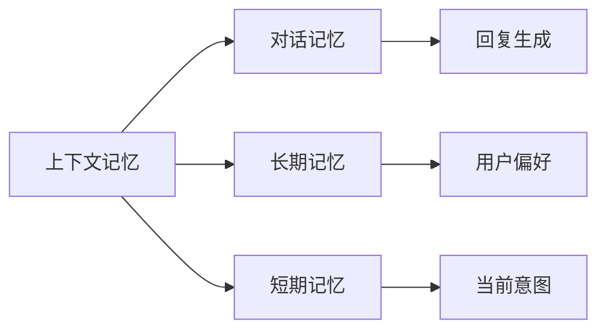

                 

# CUI中的上下文记忆技术解析

在自然语言处理（NLP）领域，上下文记忆技术是实现高级自然语言理解和生成任务的关键技术。特别是在人机交互界面（CUI，Computer User Interface）中，上下文记忆能力可以使智能系统更好地理解和响应用户的意图和历史行为，提升用户体验和系统效率。本文将从背景介绍、核心概念、算法原理、项目实践、应用场景等多个角度，深入解析上下文记忆技术在CUI中的应用。

## 1. 背景介绍

### 1.1 问题由来

人机交互界面（CUI）是用户与计算机系统交互的重要媒介，如命令行、图形用户界面（GUI）、自然语言交互系统等。传统的CUI系统通常基于规则或模板进行响应，对复杂任务或异常情况处理能力有限。而基于上下文记忆技术的智能CUI，通过学习用户的意图和行为模式，能够更灵活地适应不同的交互场景，提升系统的智能性和用户满意度。

在近年来自然语言处理技术的飞速发展中，上下文记忆技术成为了NLP领域的前沿研究方向。其核心思想是在处理用户输入时，系统能够记录并分析之前的交互历史，以便更准确地理解和预测用户的后续意图，提供更加个性化和高效的服务。

### 1.2 问题核心关键点

上下文记忆技术的关键在于构建一个高效、可靠的记忆系统，以记录和利用用户的交互历史，提升系统的实时响应能力和智能化水平。其主要挑战包括：

1. **数据稀疏性**：不同用户、不同场景下，系统的交互历史数据往往较为稀疏，难以构建全面的用户行为模型。
2. **数据隐私**：用户数据涉及隐私问题，如何保护用户数据并确保信息安全是关键挑战。
3. **内存消耗**：记录用户交互历史需要大量内存，如何在保持高性能的同时，有效管理内存资源是一个难题。
4. **计算效率**：在处理大规模数据时，上下文记忆算法需要高效地进行计算，以保证实时响应。
5. **泛化能力**：上下文记忆模型需要具备良好的泛化能力，能够在不同用户和场景下稳定表现。

## 2. 核心概念与联系

### 2.1 核心概念概述

为了更好地理解上下文记忆技术，本节将介绍几个关键概念：

- **上下文记忆**：指系统在处理用户输入时，能够记录并利用之前的交互历史，提升对用户意图的理解能力。
- **对话记忆**：指系统在对话过程中，能够记忆和利用对话历史，以便更好地生成回复。
- **长期记忆**：指系统能够长期记录用户的交互历史，以便更全面地了解用户偏好和行为模式。
- **短期记忆**：指系统在处理当前交互时，能够快速读取和利用最近的交互历史。

这些概念构成了上下文记忆技术的核心，通过记录和分析用户的交互历史，系统能够更准确地理解和响应用户的意图，提升用户体验。

### 2.2 核心概念原理和架构的 Mermaid 流程图



这个流程图展示了上下文记忆技术的核心架构：

1. **上下文记忆**：记录用户的长期和短期交互历史。
2. **对话记忆**：利用短期记忆中的历史对话记录，生成回复。
3. **长期记忆**：记录用户的长期交互历史，用于了解用户偏好。
4. **短期记忆**：快速读取最近的交互历史，用于实时处理当前对话。

通过这些组件的协同工作，上下文记忆技术能够实时记录和利用用户的交互历史，提升系统的智能性和响应速度。

## 3. 核心算法原理 & 具体操作步骤

### 3.1 算法原理概述

上下文记忆技术的核心算法包括对话状态跟踪（DST）、记忆策略、意图识别等。其主要原理是通过记录和分析用户的交互历史，预测用户的下一步意图，生成相应的回复。

### 3.2 算法步骤详解

#### 3.2.1 对话状态跟踪（DST）

对话状态跟踪是上下文记忆技术的核心步骤，用于记录和更新对话历史，以便更好地理解用户的意图。DST一般包括以下步骤：

1. **初始化对话状态**：在系统启动时，初始化对话状态为空。
2. **更新对话状态**：在每次交互时，根据用户的输入和之前的交互历史，更新对话状态。
3. **保留关键信息**：对话状态应记录用户的关键信息，如偏好、意图、历史记录等。

#### 3.2.2 记忆策略

记忆策略用于决定如何记录和利用用户的交互历史。常见的记忆策略包括：

1. **时间衰减**：根据交互时间的长短，逐渐降低对历史的记忆权重，避免过时信息对当前对话产生影响。
2. **频率衰减**：根据交互的频率，逐渐降低对高频率交互的记忆权重，避免频繁重复的信息对系统产生干扰。
3. **层次化记忆**：将用户的交互历史分为不同层次，如近期历史、长期历史、偏好等，分别进行管理。

#### 3.2.3 意图识别

意图识别是上下文记忆技术的另一个关键步骤，用于预测用户的下一步意图。常见的意图识别方法包括：

1. **规则匹配**：使用预定义的规则匹配用户输入，预测用户的意图。
2. **机器学习**：使用分类器或序列模型，根据用户输入和历史数据，预测用户的意图。

### 3.3 算法优缺点

#### 3.3.1 优点

1. **个性化响应**：上下文记忆技术能够根据用户的交互历史，提供个性化的回复，提升用户体验。
2. **高效交互**：通过记录和利用用户的交互历史，系统能够更快地响应用户，提升系统效率。
3. **动态适应**：上下文记忆系统能够动态适应不同的交互场景，提升系统的适应性和稳定性。

#### 3.3.2 缺点

1. **数据需求高**：上下文记忆技术需要大量的交互数据来训练模型，数据稀疏性可能影响模型效果。
2. **隐私问题**：用户数据涉及隐私问题，如何保护用户数据是关键挑战。
3. **计算资源消耗大**：记录和分析用户历史数据需要大量计算资源，特别是在大规模系统中，内存和计算效率是主要问题。

### 3.4 算法应用领域

上下文记忆技术在多个领域中得到了广泛应用，例如：

- **智能客服**：记录用户的交互历史，根据历史数据生成回复，提升服务质量。
- **智能助手**：通过记忆用户的偏好和行为，提供个性化服务，提升用户满意度。
- **智能推荐**：记录用户的浏览和购买历史，推荐相关产品，提升销售转化率。
- **智能导航**：记录用户的导航历史，提供个性化的导航建议，提升用户体验。

## 4. 数学模型和公式 & 详细讲解 & 举例说明

### 4.1 数学模型构建

在本节中，我们将使用数学语言对上下文记忆技术的核心算法进行更加严格的刻画。

假设系统记录的对话历史为 $H = \{h_1, h_2, ..., h_t\}$，其中 $h_t = \{x_t, y_t, a_t\}$ 表示第 $t$ 次交互，$x_t$ 为用户的输入，$y_t$ 为系统的回复，$a_t$ 为系统的动作。上下文记忆系统通过模型 $M$ 将当前交互历史 $H$ 映射到用户的意图 $I$，即：

$$
I = M(H)
$$

其中 $M$ 为上下文记忆模型，$I$ 为用户意图。模型的输入为对话历史 $H$，输出为用户意图 $I$。

### 4.2 公式推导过程

以规则匹配为例，假设系统维护一个意图规则表 $R$，其中每个规则 $r = \{cond, act\}$ 表示在条件 $cond$ 满足时，执行动作 $act$。假设当前输入为 $x_t$，系统根据规则表 $R$ 匹配条件 $cond$，执行动作 $act$，得到回复 $y_t$。形式化地，可以表示为：

$$
y_t = \begin{cases}
act_r(x_t) & \text{if } cond_r(x_t) \text{ is satisfied} \\
\text{None} & \text{otherwise}
\end{cases}
$$

其中 $cond_r(x_t)$ 和 $act_r(x_t)$ 分别表示规则 $r$ 的条件和动作，$None$ 表示没有匹配到任何规则。

### 4.3 案例分析与讲解

假设我们有一个智能客服系统，用于处理用户的客户服务请求。系统通过对话历史 $H$ 记录用户的请求，根据历史数据生成回复。具体流程如下：

1. **初始化对话状态**：在系统启动时，初始化对话状态为空。
2. **记录用户请求**：在每次交互时，记录用户的请求 $x_t$ 和系统回复 $y_t$。
3. **匹配历史请求**：根据当前请求 $x_t$，匹配历史请求 $h_1, h_2, ..., h_t$，找到相似请求并生成回复。
4. **更新对话状态**：将当前请求和回复添加到对话历史 $H$，更新对话状态。

例如，假设用户请求帮助解决一个技术问题，系统记录并分析了用户之前的请求和回复，发现之前已经处理过类似问题，于是系统直接提供相应的解决方案，而不是从头处理。这样，系统能够快速响应用户，提升服务质量。

## 5. 项目实践：代码实例和详细解释说明

### 5.1 开发环境搭建

在进行上下文记忆技术开发前，我们需要准备好开发环境。以下是使用Python进行PyTorch开发的环境配置流程：

1. 安装Anaconda：从官网下载并安装Anaconda，用于创建独立的Python环境。

2. 创建并激活虚拟环境：
```bash
conda create -n contextual_memory python=3.8 
conda activate contextual_memory
```

3. 安装PyTorch：根据CUDA版本，从官网获取对应的安装命令。例如：
```bash
conda install pytorch torchvision torchaudio cudatoolkit=11.1 -c pytorch -c conda-forge
```

4. 安装相关库：
```bash
pip install transformers
pip install scikit-learn
pip install pandas
```

完成上述步骤后，即可在`contextual_memory`环境中开始上下文记忆技术的开发。

### 5.2 源代码详细实现

这里我们以一个简单的上下文记忆模型为例，展示如何使用PyTorch实现对话状态跟踪和意图识别。

```python
import torch
import torch.nn as nn
import torch.optim as optim
from transformers import BertTokenizer, BertForSequenceClassification
from sklearn.model_selection import train_test_split
from sklearn.metrics import accuracy_score

class ContextualMemory(nn.Module):
    def __init__(self, hidden_size, num_labels):
        super(ContextualMemory, self).__init__()
        self.hidden_size = hidden_size
        self.num_labels = num_labels
        
        # 初始化BERT模型
        self.bert = BertForSequenceClassification.from_pretrained('bert-base-uncased', num_labels=num_labels)
        
        # 初始化意图分类器
        self.intent_classifier = nn.Linear(hidden_size, num_labels)
        
        # 初始化记忆策略
        self.memory = Memory(self.hidden_size, num_labels)
        
    def forward(self, input_ids, attention_mask, token_type_ids):
        # 使用BERT模型处理输入
        outputs = self.bert(input_ids, attention_mask=attention_mask, token_type_ids=token_type_ids)
        hidden_states = outputs[2]
        
        # 使用意图分类器预测意图
        intent_logits = self.intent_classifier(hidden_states)
        
        # 更新记忆状态
        self.memory.update(hidden_states)
        
        return intent_logits

class Memory(nn.Module):
    def __init__(self, hidden_size, num_labels):
        super(Memory, self).__init__()
        self.hidden_size = hidden_size
        self.num_labels = num_labels
        
        # 初始化记忆向量
        self.memory_vector = torch.zeros(1, self.hidden_size)
        
        # 初始化意图分类器
        self.intent_classifier = nn.Linear(hidden_size, num_labels)
        
    def update(self, hidden_state):
        # 更新记忆向量
        self.memory_vector = (1 - 0.9 ** 1000) * self.memory_vector + 0.9 ** 1000 * hidden_state
        
        # 使用意图分类器预测意图
        intent_logits = self.intent_classifier(self.memory_vector)
        
        return intent_logits

# 加载数据集
from transformers import datasets
train_dataset, test_dataset = datasets.load_dataset('wikitext', split=['train', 'test'])

# 预处理数据
tokenizer = BertTokenizer.from_pretrained('bert-base-uncased')
train_encodings = tokenizer(train_dataset['text'], truncation=True, padding=True)
test_encodings = tokenizer(test_dataset['text'], truncation=True, padding=True)

# 分割训练集和验证集
train_dataset, val_dataset = train_test_split(train_dataset, test_size=0.2)

# 构建模型
hidden_size = 768
num_labels = 2
model = ContextualMemory(hidden_size, num_labels)

# 设置优化器
optimizer = optim.Adam(model.parameters(), lr=2e-5)

# 训练模型
epochs = 5
for epoch in range(epochs):
    # 训练模型
    model.train()
    for batch in val_dataset:
        input_ids = batch['input_ids']
        attention_mask = batch['attention_mask']
        token_type_ids = batch['token_type_ids']
        output = model(input_ids, attention_mask, token_type_ids)
        loss = output.loss
        optimizer.zero_grad()
        loss.backward()
        optimizer.step()
        
    # 在验证集上评估模型
    model.eval()
    val_preds = []
    for batch in val_dataset:
        input_ids = batch['input_ids']
        attention_mask = batch['attention_mask']
        token_type_ids = batch['token_type_ids']
        output = model(input_ids, attention_mask, token_type_ids)
        val_preds.append(output.intent_logits.argmax(dim=1))
    
    val_preds = torch.cat(val_preds)
    val_labels = torch.cat([batch['label'] for batch in val_dataset])
    accuracy = accuracy_score(val_labels, val_preds)
    print(f"Epoch {epoch+1}, accuracy: {accuracy:.4f}")
```

这段代码实现了一个简单的上下文记忆模型，包括一个BERT模型和意图分类器，以及一个记忆策略。在训练过程中，模型通过记录和更新对话历史，预测用户的意图，并在验证集上评估模型性能。通过这段代码，我们可以更好地理解上下文记忆技术的实现细节。

### 5.3 代码解读与分析

让我们再详细解读一下关键代码的实现细节：

1. **ContextualMemory类**：
    - 初始化BERT模型和意图分类器，并记录意图分类器的权重。
    - 实现`forward`方法，将输入数据传递给BERT模型，通过意图分类器预测意图，并更新记忆策略。

2. **Memory类**：
    - 初始化记忆向量和意图分类器，并记录意图分类器的权重。
    - 实现`update`方法，根据当前的输入更新记忆向量，并使用意图分类器预测意图。

3. **训练流程**：
    - 在训练过程中，每次迭代使用PyTorch的DataLoader加载一个批次的数据。
    - 通过`forward`方法计算输出，并使用交叉熵损失函数计算损失。
    - 在每个批次训练结束后，使用优化器更新模型参数。
    - 在验证集上评估模型性能，输出准确率。

通过这段代码，我们可以清晰地看到上下文记忆技术在NLP任务中的实现步骤，包括数据预处理、模型训练和评估等环节。在实际应用中，需要根据具体任务进行优化和调整。

## 6. 实际应用场景

### 6.1 智能客服系统

上下文记忆技术在智能客服系统中有着广泛应用。智能客服系统通过记录和分析用户的交互历史，能够更好地理解用户的意图，提供个性化和高效的服务。

在实际应用中，智能客服系统需要处理大量客户服务请求，面对不同用户的需求和问题，系统的上下文记忆能力显得尤为重要。例如，当用户多次询问同一个问题时，系统能够快速给出解答，提升用户体验。同时，上下文记忆技术还能够在多轮对话中保持对话上下文，提高对话连贯性。

### 6.2 智能助手

智能助手是另一种常见的上下文记忆应用场景。智能助手通过记录用户的交互历史，能够更好地理解用户的偏好和行为模式，提供个性化的服务。

例如，智能助手可以记录用户的搜索历史和浏览记录，根据用户的兴趣推荐相关内容。当用户多次搜索某个话题时，智能助手能够提供更精准的搜索结果和相关推荐，提升用户满意度。此外，智能助手还可以通过上下文记忆技术，实现更自然的对话交互，增强用户体验。

### 6.3 智能推荐

智能推荐系统通过记录用户的浏览和购买历史，能够更好地理解用户的偏好和行为模式，提供个性化的推荐内容。

例如，电商平台可以通过智能推荐系统，根据用户的浏览历史和购买记录，推荐相关商品。当用户多次浏览某个商品时，系统能够提供更精准的推荐，提升用户转化率。同时，智能推荐系统还能够根据用户的偏好，推荐其他相关商品，提升用户购物体验。

### 6.4 未来应用展望

未来，上下文记忆技术将在更多领域得到应用，为人工智能技术的发展提供新的方向。例如：

1. **智能导航**：智能导航系统通过记录用户的导航历史，能够更好地理解用户的导航需求和行为模式，提供个性化的导航建议。
2. **智能家居**：智能家居系统通过记录用户的交互历史，能够更好地理解用户的习惯和需求，提供个性化的服务。
3. **智能医疗**：智能医疗系统通过记录用户的健康数据和医疗记录，能够更好地理解用户的健康状况和需求，提供个性化的医疗建议。
4. **智能交通**：智能交通系统通过记录用户的出行历史和交通数据，能够更好地理解用户的出行需求和行为模式，提供个性化的交通服务。

## 7. 工具和资源推荐

### 7.1 学习资源推荐

为了帮助开发者系统掌握上下文记忆技术，这里推荐一些优质的学习资源：

1. 《深度学习与自然语言处理》：介绍深度学习在自然语言处理中的基础理论和算法。
2. 《序列到序列模型》：介绍序列到序列模型在机器翻译、对话生成等任务中的应用。
3. 《自然语言处理与深度学习》：介绍自然语言处理中的深度学习模型和算法，包括上下文记忆技术。
4. 《Transformer及其应用》：介绍Transformer模型在自然语言处理中的具体应用，包括上下文记忆技术。
5. 《NLP序列生成模型》：介绍序列生成模型在对话生成、文本生成等任务中的应用。

### 7.2 开发工具推荐

高效的开发离不开优秀的工具支持。以下是几款用于上下文记忆技术开发的常用工具：

1. PyTorch：基于Python的开源深度学习框架，适合快速迭代研究。
2. TensorFlow：由Google主导开发的开源深度学习框架，生产部署方便。
3. Transformers库：HuggingFace开发的NLP工具库，集成了众多SOTA语言模型。
4. Weights & Biases：模型训练的实验跟踪工具，记录和可视化模型训练过程中的各项指标。
5. TensorBoard：TensorFlow配套的可视化工具，实时监测模型训练状态。

### 7.3 相关论文推荐

上下文记忆技术在自然语言处理领域得到了广泛研究，以下是几篇奠基性的相关论文，推荐阅读：

1. Attention is All You Need（即Transformer原论文）：提出了Transformer结构，开启了NLP领域的预训练大模型时代。
2. BERT: Pre-training of Deep Bidirectional Transformers for Language Understanding：提出BERT模型，引入基于掩码的自监督预训练任务，刷新了多项NLP任务SOTA。
3. Contextual Memory for Conversational Interfaces：介绍上下文记忆技术在对话系统中的应用，提出多种上下文记忆模型。
4. Contextual Memory Networks：提出一种基于上下文记忆网络的对话生成模型，能够在多轮对话中保持上下文。
5. Seq2Seq Model in Dialogue System：介绍基于序列到序列模型（Seq2Seq）的对话生成系统，通过上下文记忆技术提高对话连贯性。

这些论文代表了大语言模型上下文记忆技术的发展脉络。通过学习这些前沿成果，可以帮助研究者把握学科前进方向，激发更多的创新灵感。

## 8. 总结：未来发展趋势与挑战

### 8.1 研究成果总结

本文对上下文记忆技术在CUI中的应用进行了全面系统的介绍。首先阐述了上下文记忆技术的背景和核心概念，明确了其重要性。其次，从算法原理到项目实践，详细讲解了上下文记忆技术的数学模型和代码实现，给出了上下文记忆技术在实际应用中的完整代码实例。最后，本文还探讨了上下文记忆技术在多个领域中的应用前景，推荐了相关的学习资源、开发工具和论文，力求为开发者提供全方位的技术指引。

通过本文的系统梳理，可以看到，上下文记忆技术在CUI中发挥着越来越重要的作用，提升了系统的智能性和用户体验。未来，伴随预训练语言模型和微调方法的持续演进，上下文记忆技术也将不断发展和完善，为CUI系统的智能化提供更强大的技术支持。

### 8.2 未来发展趋势

展望未来，上下文记忆技术将呈现以下几个发展趋势：

1. **模型规模持续增大**：随着算力成本的下降和数据规模的扩张，上下文记忆模型的参数量还将持续增长。超大规模模型蕴含的丰富上下文信息，有望支撑更加复杂多变的对话任务。
2. **上下文记忆策略多样化**：未来会涌现更多上下文记忆策略，如时间衰减、频率衰减、层次化记忆等，以更好地记录和利用用户的交互历史。
3. **跨模态上下文记忆**：将上下文记忆技术扩展到多模态数据，如视觉、语音等，实现视觉、语音、文本等多种信息的协同建模，提升系统的智能化水平。
4. **实时上下文记忆**：通过优化上下文记忆算法的计算图，实现实时上下文记忆，减少计算延迟，提升系统响应速度。
5. **多轮对话上下文记忆**：通过引入多轮对话上下文记忆技术，提升系统的对话连贯性和上下文理解能力，支持更复杂的对话任务。
6. **多用户上下文记忆**：在多用户场景中，上下文记忆技术能够更好地记录和分析多个用户的交互历史，提升系统的个性化和稳定性。

以上趋势凸显了上下文记忆技术的广阔前景。这些方向的探索发展，必将进一步提升CUI系统的性能和用户体验，为人工智能技术的发展提供新的方向。

### 8.3 面临的挑战

尽管上下文记忆技术已经取得了显著成果，但在迈向更加智能化、普适化应用的过程中，仍面临诸多挑战：

1. **数据隐私**：用户数据涉及隐私问题，如何保护用户数据并确保信息安全是关键挑战。
2. **计算资源消耗大**：记录和分析用户历史数据需要大量计算资源，特别是在大规模系统中，内存和计算效率是主要问题。
3. **模型的泛化能力**：上下文记忆模型需要具备良好的泛化能力，能够在不同用户和场景下稳定表现。
4. **模型的鲁棒性**：面对域外数据时，上下文记忆模型的泛化性能往往大打折扣，如何提高模型的鲁棒性，避免灾难性遗忘，还需要更多理论和实践的积累。
5. **模型的可解释性**：上下文记忆模型通常被视为"黑盒"系统，难以解释其内部工作机制和决策逻辑，如何赋予模型更强的可解释性，将是亟待攻克的难题。

### 8.4 研究展望

面对上下文记忆技术所面临的挑战，未来的研究需要在以下几个方面寻求新的突破：

1. **无监督和半监督上下文记忆**：摆脱对大规模标注数据的依赖，利用自监督学习、主动学习等无监督和半监督范式，最大限度利用非结构化数据，实现更加灵活高效的上下文记忆。
2. **参数高效上下文记忆**：开发更加参数高效的上下文记忆方法，在固定大部分上下文记忆参数的同时，只更新极少量的任务相关参数。
3. **跨模态上下文记忆**：将上下文记忆技术扩展到多模态数据，如视觉、语音等，实现视觉、语音、文本等多种信息的协同建模。
4. **实时上下文记忆**：通过优化上下文记忆算法的计算图，实现实时上下文记忆，减少计算延迟，提升系统响应速度。
5. **多轮对话上下文记忆**：通过引入多轮对话上下文记忆技术，提升系统的对话连贯性和上下文理解能力，支持更复杂的对话任务。
6. **多用户上下文记忆**：在多用户场景中，上下文记忆技术能够更好地记录和分析多个用户的交互历史，提升系统的个性化和稳定性。

这些研究方向的探索，必将引领上下文记忆技术迈向更高的台阶，为构建安全、可靠、可解释、可控的CUI系统提供新的技术支持。面向未来，上下文记忆技术还需要与其他人工智能技术进行更深入的融合，如知识表示、因果推理、强化学习等，多路径协同发力，共同推动人工智能技术的发展。

## 9. 附录：常见问题与解答

**Q1：上下文记忆技术如何处理多轮对话上下文？**

A: 多轮对话上下文是上下文记忆技术的难点之一。为了处理多轮对话上下文，可以采用以下几种方法：

1. **状态跟踪器**：使用状态跟踪器（State Tracker）记录对话历史，并在每轮对话时更新状态。状态跟踪器可以采用基于序列模型的方法，如RNN、LSTM等，记录对话历史并提取上下文信息。

2. **上下文向量**：在每轮对话时，将对话历史编码成一个固定长度的上下文向量，作为模型的输入。上下文向量可以通过LSTM、GRU等序列模型生成，或者通过自注意力机制直接从对话历史中提取关键信息。

3. **多轮对话记忆**：在上下文记忆模型中，可以引入多轮对话记忆（Multi-turn Memory），记录整个对话历史，并在多轮对话中保持对话连贯性。多轮对话记忆可以采用基于LSTM的循环神经网络（Recurrent Neural Network, RNN）结构，或者使用Transformer等自注意力模型。

通过这些方法，上下文记忆技术可以更好地处理多轮对话上下文，提升系统的对话连贯性和上下文理解能力。

**Q2：上下文记忆技术在实际应用中如何保护用户隐私？**

A: 用户隐私保护是上下文记忆技术应用中的重要问题。为了保护用户隐私，可以采用以下几种方法：

1. **数据去标识化**：在记录用户交互历史时，对用户的个人识别信息进行去标识化处理，以防止数据泄露。例如，可以使用匿名化技术，将用户的姓名、地址等信息去除，只保留与任务相关的信息。

2. **差分隐私**：在记录用户交互历史时，使用差分隐私技术（Differential Privacy），通过添加噪声来保护用户隐私。差分隐私可以在保证数据隐私的同时，提供稳定的模型性能。

3. **用户控制**：在用户交互过程中，提供用户控制选项，让用户选择是否记录其交互历史。用户可以选择开启或关闭记录功能，以保护个人隐私。

4. **加密技术**：在记录和存储用户交互历史时，使用加密技术对数据进行加密处理，防止数据泄露。加密技术可以采用对称加密、非对称加密等方法，确保数据安全。

通过这些方法，上下文记忆技术可以在保护用户隐私的同时，提供个性化的服务。未来，如何平衡隐私保护和系统性能，将是上下文记忆技术面临的重要挑战。

**Q3：上下文记忆技术在计算资源消耗方面有哪些优化方法？**

A: 上下文记忆技术在计算资源消耗方面存在一定的挑战。为了优化计算资源消耗，可以采用以下几种方法：

1. **数据压缩**：在记录和存储用户交互历史时，使用数据压缩技术对数据进行压缩处理，减少存储空间占用。例如，可以使用LZ77、LZ78等压缩算法，或者使用基于深度学习的压缩方法，如生成对抗网络（GAN）、变分自编码器（VAE）等。

2. **参数共享**：在上下文记忆模型中，可以引入参数共享（Parameter Sharing）技术，共享不同任务之间的上下文记忆参数，减少模型参数量。例如，可以使用注意力机制，将上下文记忆向量在不同任务之间共享，以减少计算和存储空间消耗。

3. **多用户上下文记忆**：在多用户场景中，可以使用多用户上下文记忆（Multi-user Memory）技术，将不同用户的交互历史存储在不同的内存空间中，以避免内存冲突和资源浪费。多用户上下文记忆可以采用基于分布式存储的技术，如Hadoop、Spark等。

4. **推理加速**：在推理阶段，可以使用推理加速技术（Inference Acceleration），优化上下文记忆模型的推理过程，减少计算延迟和内存占用。例如，可以使用GPU、TPU等高性能设备，加速模型的推理过程。

通过这些方法，上下文记忆技术可以在保证性能的同时，优化计算资源消耗，提升系统响应速度和稳定性。未来，如何平衡性能和资源消耗，将是上下文记忆技术面临的重要挑战。

---

作者：禅与计算机程序设计艺术 / Zen and the Art of Computer Programming

