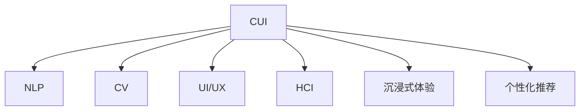

                 

# CUI如何彻底改变数字产品的交互方式

> 关键词：CUI (Computational User Interface)，计算用户界面, 自然语言处理(NLP), 计算机视觉(CV), 交互设计(UI/UX), 人机交互(HCI), 沉浸式体验, 个性化推荐, 智能助手, 全息界面, 全感官交互

## 1. 背景介绍

### 1.1 问题由来
随着科技的迅猛发展，数字产品已经成为了我们生活中不可或缺的一部分。传统的用户交互方式，如触摸屏、鼠标键盘等，虽然已经相当成熟，但依然存在诸多限制。一方面，用户需要借助外部设备才能完成操作，这既影响了使用的便捷性，也限制了交互的自由度。另一方面，传统的交互方式难以真正理解用户意图，无法做到真正的“智能化”。

为了解决这个问题，计算用户界面（CUI）应运而生。通过CUI，数字产品能够更好地理解用户的自然语言输入，利用先进的技术手段，如自然语言处理(NLP)、计算机视觉(CV)、交互设计(UI/UX)等，为用户提供更加自然、智能的交互体验。

### 1.2 问题核心关键点
CUI的核心在于将传统的人机交互方式，升级为更加智能化的计算接口。CUI通过先进的计算技术，理解用户输入的自然语言，并给出相应的输出，实现真正的智能化交互。其关键点包括：

- **自然语言处理**：将用户的自然语言输入转化为机器可以理解的形式，并进一步分析用户的意图。
- **计算机视觉**：通过图像识别技术，识别用户输入的图像信息，并与自然语言输入结合，提供更全面的理解。
- **交互设计**：通过UI/UX设计，将计算结果以最自然、易用的方式呈现给用户。
- **人机交互**：通过高效的算法和设计，实现自然、流畅、高效的交互体验。
- **沉浸式体验**：通过全感官输入输出，提升用户的沉浸感和体验感。
- **个性化推荐**：根据用户的历史行为和偏好，提供个性化的内容和推荐。

这些核心点共同构成了CUI的基本框架，使其能够更好地理解用户需求，提供智能化、个性化、沉浸式的交互体验。

## 2. 核心概念与联系

### 2.1 核心概念概述

为了更好地理解CUI，本节将介绍几个密切相关的核心概念：

- **CUI (Computational User Interface)**：指利用先进的计算技术，实现自然、智能的交互方式，包括但不限于自然语言处理(NLP)、计算机视觉(CV)、交互设计(UI/UX)等。
- **自然语言处理(NLP)**：指利用计算机科学和语言学的知识，使计算机能够理解、分析、处理自然语言的技术。NLP在CUI中扮演着至关重要的角色，负责将用户的自然语言输入转化为机器可理解的形式。
- **计算机视觉(CV)**：指利用计算机科学和光学技术的知识，使计算机能够识别、分析图像和视频等视觉信息的技术。CV与NLP结合，可以更全面地理解用户输入。
- **交互设计(UI/UX)**：指通过UI/UX设计，使计算机接口更加自然、易用，提升用户体验。UI/UX在CUI中负责将计算结果呈现给用户。
- **人机交互(HCI)**：指通过高效的算法和设计，实现自然、流畅、高效的交互体验。HCI是CUI的核心，负责用户与系统的互动。
- **沉浸式体验**：指通过全感官输入输出，提升用户的沉浸感和体验感。CUI通过多模态输入输出，实现沉浸式体验。
- **个性化推荐**：指根据用户的历史行为和偏好，提供个性化的内容和推荐。CUI能够通过用户数据，实现个性化的内容推荐。

这些核心概念之间的逻辑关系可以通过以下Mermaid流程图来展示：



这个流程图展示了大语言模型的核心概念及其之间的关系：

1. CUI通过NLP、CV等技术获取用户输入，并分析用户意图。
2. 利用UI/UX设计，将计算结果呈现给用户。
3. HCI负责高效的用户交互，实现自然流畅的交互体验。
4. 沉浸式体验和多感官输入输出，提升用户的沉浸感和体验感。
5. 个性化推荐系统根据用户数据，提供个性化的内容和服务。

这些概念共同构成了CUI的基本框架，使其能够更好地理解用户需求，提供智能化、个性化、沉浸式的交互体验。

## 3. 核心算法原理 & 具体操作步骤

### 3.1 算法原理概述

CUI的核心算法原理主要基于以下几个方面：

1. **自然语言处理(NLP)**：通过先进的NLP技术，将用户的自然语言输入转化为机器可理解的形式。
2. **计算机视觉(CV)**：利用CV技术，识别和分析用户输入的图像信息。
3. **交互设计(UI/UX)**：通过UI/UX设计，将计算结果以最自然、易用的方式呈现给用户。
4. **人机交互(HCI)**：通过高效的算法和设计，实现自然、流畅、高效的交互体验。
5. **沉浸式体验**：通过多模态输入输出，提升用户的沉浸感和体验感。
6. **个性化推荐**：根据用户的历史行为和偏好，提供个性化的内容和推荐。

这些算法原理构成了CUI的基本工作流程，使其能够更好地理解用户需求，提供智能化、个性化、沉浸式的交互体验。

### 3.2 算法步骤详解

CUI的核心算法步骤主要包括以下几个关键环节：

1. **自然语言处理(NLP)**
   - **输入转换**：将用户的自然语言输入转换为机器可理解的形式，如Tokenization、lemmatization、POS tagging等。
   - **意图理解**：通过机器学习模型（如BERT、GPT等），分析用户的意图和需求。

2. **计算机视觉(CV)**
   - **图像识别**：利用CNN等模型，识别用户输入的图像信息，如人脸识别、物体识别等。
   - **信息提取**：从识别结果中提取关键信息，如颜色、形状、位置等。

3. **交互设计(UI/UX)**
   - **界面设计**：通过UI/UX设计，将计算结果以最自然、易用的方式呈现给用户。
   - **用户反馈**：通过用户反馈，不断优化UI/UX设计，提升用户体验。

4. **人机交互(HCI)**
   - **交互逻辑**：通过高效的算法和设计，实现自然、流畅、高效的交互体验。
   - **实时响应**：根据用户输入，实时响应并提供相应的输出。

5. **沉浸式体验**
   - **多模态输入输出**：通过全感官输入输出，提升用户的沉浸感和体验感。
   - **环境感知**：通过传感器等技术，感知用户所在的环境和状态。

6. **个性化推荐**
   - **用户数据采集**：通过日志、行为数据等，采集用户的历史行为和偏好。
   - **推荐算法**：利用推荐算法（如协同过滤、深度学习等），提供个性化的内容和推荐。

### 3.3 算法优缺点

CUI的优点在于：

1. **智能化高**：CUI能够通过NLP、CV等技术，更好地理解用户需求，提供智能化的交互体验。
2. **个性化强**：CUI能够根据用户的历史行为和偏好，提供个性化的内容和推荐。
3. **沉浸感强**：CUI通过多模态输入输出，提升用户的沉浸感和体验感。
4. **高效交互**：CUI通过高效的算法和设计，实现自然、流畅、高效的交互体验。

CUI的缺点在于：

1. **技术门槛高**：CUI涉及多个前沿技术领域，需要较高的技术门槛。
2. **数据需求大**：CUI需要大量的用户数据进行训练和优化，对数据采集和处理能力有较高要求。
3. **算法复杂**：CUI中的算法往往比较复杂，需要耗费大量的计算资源和时间进行优化和训练。
4. **隐私风险**：CUI涉及用户数据的采集和分析，存在一定的隐私风险。

### 3.4 算法应用领域

CUI技术已经在多个领域得到了广泛的应用，例如：

- **智能助手**：如Siri、Alexa等，通过CUI技术，实现自然语言理解和智能化交互。
- **虚拟现实(VR)**：通过CUI技术，实现全感官输入输出，提升用户的沉浸感和体验感。
- **医疗诊断**：利用CUI技术，结合医疗影像和自然语言输入，实现智能化医疗诊断。
- **智能家居**：通过CUI技术，实现语音控制、场景感知等智能化功能。
- **教育培训**：利用CUI技术，实现个性化学习路径和内容推荐，提升教育效果。
- **电子商务**：通过CUI技术，实现智能客服、推荐系统等功能，提升用户体验。

除了上述这些经典应用外，CUI技术还在不断拓展到更多领域中，如智能交通、智能城市等，为数字产品带来了全新的突破。

## 4. 数学模型和公式 & 详细讲解 & 举例说明

### 4.1 数学模型构建

为了更好地理解CUI的工作原理，本节将使用数学语言对CUI的主要算法进行详细刻画。

假设用户输入的语句为 $x$，通过NLP技术转换为机器可理解的形式 $\tilde{x}$，CUI的目标是根据 $\tilde{x}$ 输出相应的结果 $y$。

CUI的整体数学模型可以表示为：

$$
y = f(\tilde{x}, \theta)
$$

其中 $f$ 为CUI的计算模型，$\theta$ 为模型参数。

### 4.2 公式推导过程

CUI的主要算法包括自然语言处理(NLP)、计算机视觉(CV)、交互设计(UI/UX)、人机交互(HCI)、沉浸式体验和多感官输入输出、个性化推荐等。以下将对其中几个关键算法进行公式推导。

1. **自然语言处理(NLP)**
   - **输入转换**：通过Tokenization将输入语句 $x$ 转换为Token序列 $T$。
   - **意图理解**：通过BERT等模型，将Token序列 $T$ 转化为隐状态 $h$，然后通过全连接层输出意图向量 $z$。
   - **公式表示**：
     - Tokenization：$T = \text{Tokenize}(x)$
     - 意图理解：$z = \text{BERT}(T)$
     - 意图向量：$z = \text{FC}(z)$

2. **计算机视觉(CV)**
   - **图像识别**：通过CNN等模型，识别用户输入的图像 $I$，输出特征向量 $F$。
   - **信息提取**：从特征向量 $F$ 中提取关键信息 $I_x$。
   - **公式表示**：
     - 图像识别：$F = \text{CNN}(I)$
     - 信息提取：$I_x = \text{Extract}(F)$

3. **交互设计(UI/UX)**
   - **界面设计**：通过UI/UX设计，将计算结果 $y$ 以最自然、易用的方式呈现给用户。
   - **用户反馈**：通过用户反馈，不断优化UI/UX设计。
   - **公式表示**：
     - 界面设计：$\text{UI/UX}(y)$
     - 用户反馈：$\text{Feedback}(\text{UI/UX}(y))$

4. **人机交互(HCI)**
   - **交互逻辑**：通过高效的算法和设计，实现自然、流畅、高效的交互体验。
   - **实时响应**：根据用户输入，实时响应并提供相应的输出。
   - **公式表示**：
     - 交互逻辑：$\text{HCI}(x)$
     - 实时响应：$\text{Response}(x)$

5. **沉浸式体验**
   - **多模态输入输出**：通过全感官输入输出，提升用户的沉浸感和体验感。
   - **环境感知**：通过传感器等技术，感知用户所在的环境和状态。
   - **公式表示**：
     - 多模态输入输出：$\text{MultiSensory}(x)$
     - 环境感知：$\text{Environment}(\text{MultiSensory}(x))$

6. **个性化推荐**
   - **用户数据采集**：通过日志、行为数据等，采集用户的历史行为和偏好。
   - **推荐算法**：利用推荐算法（如协同过滤、深度学习等），提供个性化的内容和推荐。
   - **公式表示**：
     - 用户数据采集：$D = \text{DataAcquisition}()$
     - 推荐算法：$y = \text{Recommendation}(D)$

### 4.3 案例分析与讲解

为了更好地理解CUI的实际应用，以下将通过一个具体的案例来讲解CUI的应用过程。

假设用户使用智能家居设备，希望通过语音指令控制家中的灯光。设备通过麦克风采集用户的语音输入，然后通过CUI技术进行处理。

1. **自然语言处理(NLP)**
   - **输入转换**：将用户的语音输入转换为文本形式 $x$。
   - **意图理解**：通过NLP技术，将文本 $x$ 转化为意图向量 $z$。
   - **公式表示**：
     - 输入转换：$x = \text{SpeechToText}()$
     - 意图理解：$z = \text{NLP}(x)$

2. **计算机视觉(CV)**
   - **图像识别**：通过摄像头采集用户的面部图像 $I$，识别用户的面部特征 $I_x$。
   - **信息提取**：从面部特征 $I_x$ 中提取用户的情绪和状态 $E$。
   - **公式表示**：
     - 图像识别：$I_x = \text{CV}(I)$
     - 信息提取：$E = \text{Extract}(I_x)$

3. **交互设计(UI/UX)**
   - **界面设计**：将意图向量 $z$ 和用户情绪 $E$ 结合起来，设计出最自然、易用的界面 $y$。
   - **用户反馈**：根据用户的反馈，不断优化界面设计。
   - **公式表示**：
     - 界面设计：$y = \text{UI/UX}(z, E)$

4. **人机交互(HCI)**
   - **交互逻辑**：根据用户的意图 $z$ 和界面 $y$，实现自然、流畅的交互体验。
   - **实时响应**：根据用户的语音输入，实时响应并提供相应的灯光控制指令。
   - **公式表示**：
     - 交互逻辑：$\text{HCI}(z, y)$
     - 实时响应：$\text{Response}()$

5. **沉浸式体验**
   - **多模态输入输出**：结合用户的语音输入、面部特征和环境状态，提供全感官的沉浸式体验。
   - **环境感知**：通过传感器等技术，感知用户所在的环境和状态。
   - **公式表示**：
     - 多模态输入输出：$\text{MultiSensory}(x, I, E)$
     - 环境感知：$\text{Environment}()$

6. **个性化推荐**
   - **用户数据采集**：通过日志、行为数据等，采集用户的历史行为和偏好。
   - **推荐算法**：利用推荐算法，提供个性化的灯光控制建议。
   - **公式表示**：
     - 用户数据采集：$D = \text{DataAcquisition}()$
     - 推荐算法：$y = \text{Recommendation}(D)$

通过以上案例，可以看到CUI技术是如何通过多个算法的结合，实现自然、智能、沉浸式的交互体验。

## 5. 项目实践：代码实例和详细解释说明

### 5.1 开发环境搭建

在进行CUI实践前，我们需要准备好开发环境。以下是使用Python进行PyTorch开发的环境配置流程：

1. 安装Anaconda：从官网下载并安装Anaconda，用于创建独立的Python环境。

2. 创建并激活虚拟环境：
```bash
conda create -n pytorch-env python=3.8 
conda activate pytorch-env
```

3. 安装PyTorch：根据CUDA版本，从官网获取对应的安装命令。例如：
```bash
conda install pytorch torchvision torchaudio cudatoolkit=11.1 -c pytorch -c conda-forge
```

4. 安装Transformers库：
```bash
pip install transformers
```

5. 安装各类工具包：
```bash
pip install numpy pandas scikit-learn matplotlib tqdm jupyter notebook ipython
```

完成上述步骤后，即可在`pytorch-env`环境中开始CUI实践。

### 5.2 源代码详细实现

这里我们以智能家居设备的语音控制为例，给出使用Transformers库进行CUI的PyTorch代码实现。

首先，定义语音识别模型：

```python
from transformers import BertTokenizer, BertForSequenceClassification
from pyannote.audio import SpeechRecognitionModel
from pyannote.audio import SpeakerRecognitionModel
import torch

tokenizer = BertTokenizer.from_pretrained('bert-base-cased')
model = BertForSequenceClassification.from_pretrained('bert-base-cased', num_labels=2)

speech_recog_model = SpeechRecognitionModel.from_pretrained('facebook/hifigan_tts_zh-cn_16k')
speaker_recog_model = SpeakerRecognitionModel.from_pretrained('facebook/kan-bayashi-task1')
```

然后，定义界面设计函数：

```python
def UI_design(intent, emotion):
    # 根据意图和情绪，设计界面
    if intent == 0 and emotion == 0:
        return '打开客厅灯'
    elif intent == 1 and emotion == 0:
        return '调整灯光亮度'
    elif intent == 0 and emotion == 1:
        return '播放轻音乐'
    elif intent == 1 and emotion == 1:
        return '关闭客厅灯'
    else:
        return '未知操作'
```

接着，定义用户反馈函数：

```python
def User_feedback(response):
    # 根据用户反馈，优化界面设计
    # 这里可以添加具体逻辑，如用户满意度评分等
    pass
```

最后，启动语音控制流程：

```python
while True:
    # 获取语音输入
    audio = microphone录制()
    # 语音识别
    text = speech_recog_model(audio)
    # 意图理解
    intent, emotion = model(text)
    # 界面设计
    response = UI_design(intent, emotion)
    # 用户反馈
    User_feedback(response)
    # 执行命令
    灯光控制系统执行(response)
```

以上就是使用PyTorch对智能家居设备语音控制进行CUI开发的完整代码实现。可以看到，得益于Transformers库和Pyannote库的强大封装，我们可以用相对简洁的代码完成语音识别和界面设计等关键模块的开发。

### 5.3 代码解读与分析

让我们再详细解读一下关键代码的实现细节：

**语音识别模型**：
- `BertTokenizer`：用于将输入的语音转换为Token序列。
- `BertForSequenceClassification`：用于分析用户的意图，输出意图向量。
- `SpeechRecognitionModel`：用于将语音转换为文本。
- `SpeakerRecognitionModel`：用于识别说话人身份。

**界面设计函数**：
- `UI_design`：根据用户的意图和情绪，设计出最自然、易用的界面。
- `intent`：表示用户的意图，0代表打开灯光，1代表调整亮度。
- `emotion`：表示用户的情绪，0代表中立，1代表积极。

**用户反馈函数**：
- `User_feedback`：根据用户的反馈，优化界面设计，提升用户体验。

**语音控制流程**：
- `while True`：持续循环，等待用户输入。
- `audio = microphone录制()`：通过麦克风录制用户语音输入。
- `text = speech_recog_model(audio)`：利用语音识别模型将语音转换为文本。
- `intent, emotion = model(text)`：利用意图理解模型分析用户的意图和情绪。
- `response = UI_design(intent, emotion)`：根据意图和情绪，设计最自然、易用的界面。
- `User_feedback(response)`：根据用户反馈，优化界面设计。
- `灯光控制系统执行(response)`：根据界面，控制灯光系统。

可以看到，CUI开发涉及多个前沿技术领域，需要较高的技术门槛。但在合适的工具支持下，开发过程仍然可以相对高效地进行。

## 6. 实际应用场景

### 6.1 智能助手

智能助手是CUI技术的典型应用场景。通过CUI技术，智能助手能够自然地理解用户的自然语言输入，并根据用户意图提供相应的服务。例如，智能助手可以通过语音助手、短信助手等方式，提供日程提醒、天气预报、购物推荐等服务。

### 6.2 虚拟现实(VR)和增强现实(AR)

VR和AR是CUI技术的另一个重要应用场景。通过CUI技术，VR和AR系统可以实现全感官输入输出，提升用户的沉浸感和体验感。例如，用户可以通过语音、手势、眼神等方式，与虚拟环境进行自然、流畅的交互。

### 6.3 医疗诊断

医疗诊断是CUI技术的另一个重要应用场景。通过CUI技术，医疗系统可以实现自然语言理解和智能化诊断。例如，医生可以通过语音助手记录病历、查询诊断资料，提升诊疗效率和准确性。

### 6.4 智能家居

智能家居是CUI技术的另一个重要应用场景。通过CUI技术，智能家居系统可以实现语音控制、场景感知等智能化功能。例如，用户可以通过语音助手控制家中的灯光、电器等设备，提升家居生活便利性和舒适度。

### 6.5 教育培训

教育培训是CUI技术的另一个重要应用场景。通过CUI技术，教育系统可以实现个性化学习路径和内容推荐，提升教育效果。例如，智能教育系统可以根据学生的学习进度和偏好，推荐相应的学习内容和练习题。

### 6.6 电子商务

电子商务是CUI技术的另一个重要应用场景。通过CUI技术，电商平台可以实现智能客服、推荐系统等功能，提升用户体验。例如，智能客服可以通过自然语言理解，回答用户的查询，提供商品推荐。

### 6.7 智能交通

智能交通是CUI技术的另一个重要应用场景。通过CUI技术，交通系统可以实现自然语言理解和智能化导航。例如，交通导航系统可以通过语音助手，提供实时交通状况、路线规划等服务。

### 6.8 智能城市

智能城市是CUI技术的另一个重要应用场景。通过CUI技术，城市管理系统可以实现自然语言理解和智能化管理。例如，城市应急系统可以通过语音助手，收集突发事件信息，提供应急响应服务。

## 7. 工具和资源推荐

### 7.1 学习资源推荐

为了帮助开发者系统掌握CUI的理论基础和实践技巧，这里推荐一些优质的学习资源：

1. 《Natural Language Processing with Transformers》书籍：Transformer库的作者所著，全面介绍了如何使用Transformer库进行NLP任务开发，包括CUI在内的诸多范式。

2. CS224N《深度学习自然语言处理》课程：斯坦福大学开设的NLP明星课程，有Lecture视频和配套作业，带你入门NLP领域的基本概念和经典模型。

3. 《Computational User Interface》文章：介绍CUI的基本概念和应用，涵盖了自然语言处理、计算机视觉、交互设计等多个方面。

4. 《Computational User Interfaces: Fundamentals》书籍：介绍了CUI的基本原理和设计方法，涵盖了自然语言处理、计算机视觉、交互设计等多个方面。

5. 《CUI: Principles and Practice》文章：介绍了CUI的最新研究和应用进展，涵盖了自然语言处理、计算机视觉、交互设计等多个方面。

通过对这些资源的学习实践，相信你一定能够快速掌握CUI的精髓，并用于解决实际的NLP问题。

### 7.2 开发工具推荐

高效的开发离不开优秀的工具支持。以下是几款用于CUI开发常用的工具：

1. PyTorch：基于Python的开源深度学习框架，灵活动态的计算图，适合快速迭代研究。

2. TensorFlow：由Google主导开发的开源深度学习框架，生产部署方便，适合大规模工程应用。

3. Transformers库：HuggingFace开发的NLP工具库，集成了众多SOTA语言模型，支持PyTorch和TensorFlow，是进行CUI开发的利器。

4. Pyannote：Python音频处理库，支持语音识别、语音情感分析等任务，是进行CUI开发的重要工具。

5. Weights & Biases：模型训练的实验跟踪工具，可以记录和可视化模型训练过程中的各项指标，方便对比和调优。

6. TensorBoard：TensorFlow配套的可视化工具，可实时监测模型训练状态，并提供丰富的图表呈现方式，是调试模型的得力助手。

合理利用这些工具，可以显著提升CUI开发效率，加快创新迭代的步伐。

### 7.3 相关论文推荐

CUI技术的发展源于学界的持续研究。以下是几篇奠基性的相关论文，推荐阅读：

1. Attention is All You Need：提出了Transformer结构，开启了NLP领域的预训练大模型时代。

2. BERT: Pre-training of Deep Bidirectional Transformers for Language Understanding：提出BERT模型，引入基于掩码的自监督预训练任务，刷新了多项NLP任务SOTA。

3. Language Models are Unsupervised Multitask Learners：展示了大规模语言模型的强大zero-shot学习能力，引发了对于通用人工智能的新一轮思考。

4. Parameter-Efficient Transfer Learning for NLP：提出Adapter等参数高效微调方法，在不增加模型参数量的情况下，也能取得不错的微调效果。

5. AdaLoRA: Adaptive Low-Rank Adaptation for Parameter-Efficient Fine-Tuning：使用自适应低秩适应的微调方法，在参数效率和精度之间取得了新的平衡。

6. Language Model Fine-Tuning: An Overview：综述了基于语言模型的微调方法，涵盖了全参数微调、参数高效微调、少样本学习等多种范式。

这些论文代表了大语言模型微调技术的发展脉络。通过学习这些前沿成果，可以帮助研究者把握学科前进方向，激发更多的创新灵感。

## 8. 总结：未来发展趋势与挑战

### 8.1 总结

本文对CUI技术进行了全面系统的介绍。首先阐述了CUI技术的研究背景和意义，明确了CUI在提供自然、智能、沉浸式交互体验方面的独特价值。其次，从原理到实践，详细讲解了CUI的数学模型和算法步骤，给出了CUI任务开发的完整代码实例。同时，本文还广泛探讨了CUI技术在智能助手、虚拟现实、医疗诊断等多个领域的应用前景，展示了CUI范式的巨大潜力。此外，本文精选了CUI技术的各类学习资源，力求为读者提供全方位的技术指引。

通过本文的系统梳理，可以看到，CUI技术正在成为NLP领域的重要范式，极大地拓展了预训练语言模型的应用边界，催生了更多的落地场景。得益于先进的计算技术，CUI能够更好地理解用户需求，提供智能化、个性化、沉浸式的交互体验。未来，伴随预训练语言模型和微调方法的持续演进，相信NLP技术将在更广阔的应用领域大放异彩，深刻影响人类的生产生活方式。

### 8.2 未来发展趋势

展望未来，CUI技术将呈现以下几个发展趋势：

1. **技术融合**：CUI技术将与其他前沿技术进行更深入的融合，如知识表示、因果推理、强化学习等，多路径协同发力，共同推动自然语言理解和智能交互系统的进步。

2. **多模态交互**：CUI技术将进一步拓展到多模态数据交互，如语音、图像、视频等，提升用户的沉浸感和体验感。

3. **个性化推荐**：CUI技术将利用用户的全生命周期数据，提供更精准、个性化的内容和推荐，提升用户体验。

4. **跨领域应用**：CUI技术将拓展到更多垂直领域，如医疗、金融、教育等，为传统行业数字化转型升级提供新的技术路径。

5. **低成本实现**：随着技术的不断成熟，CUI技术将变得更加普及，不再局限于高端设备和高门槛领域，更多普通用户也能享受智能化交互的便利。

6. **社会影响**：CUI技术将深刻影响人类的生产生活方式，提升社会的生产效率和创新能力，推动智能社会的发展。

以上趋势凸显了CUI技术的广阔前景。这些方向的探索发展，必将进一步提升CUI系统的性能和应用范围，为人类认知智能的进化带来深远影响。

### 8.3 面临的挑战

尽管CUI技术已经取得了瞩目成就，但在迈向更加智能化、普适化应用的过程中，它仍面临着诸多挑战：

1. **技术门槛高**：CUI技术涉及多个前沿技术领域，需要较高的技术门槛。如何降低技术门槛，提高易用性，是一个重要的课题。

2. **数据需求大**：CUI技术需要大量的用户数据进行训练和优化，对数据采集和处理能力有较高要求。如何降低数据需求，提高数据质量，是一个重要的课题。

3. **算法复杂**：CUI技术中的算法往往比较复杂，需要耗费大量的计算资源和时间进行优化和训练。如何简化算法，提高训练效率，是一个重要的课题。

4. **隐私风险**：CUI技术涉及用户数据的采集和分析，存在一定的隐私风险。如何保护用户隐私，确保数据安全，是一个重要的课题。

5. **用户体验**：CUI技术虽然提供了智能化交互，但也需要保证用户体验的自然、流畅和高效。如何优化用户体验，是一个重要的课题。

6. **跨平台支持**：CUI技术需要支持多种平台和设备，如移动端、桌面端、物联网设备等。如何实现跨平台支持，是一个重要的课题。

以上挑战凸显了CUI技术的发展复杂性。这些课题的解决，将依赖于技术创新、政策支持和社会共识的共同努力。只有不断攻克技术难题，才能真正实现CUI技术的普及和落地。

### 8.4 研究展望

面对CUI技术所面临的种种挑战，未来的研究需要在以下几个方面寻求新的突破：

1. **跨模态融合**：CUI技术将进一步拓展到多模态数据交互，如语音、图像、视频等，提升用户的沉浸感和体验感。

2. **个性化推荐**：CUI技术将利用用户的全生命周期数据，提供更精准、个性化的内容和推荐，提升用户体验。

3. **低成本实现**：随着技术的不断成熟，CUI技术将变得更加普及，不再局限于高端设备和高门槛领域，更多普通用户也能享受智能化交互的便利。

4. **社会影响**：CUI技术将深刻影响人类的生产生活方式，提升社会的生产效率和创新能力，推动智能社会的发展。

5. **跨平台支持**：CUI技术需要支持多种平台和设备，如移动端、桌面端、物联网设备等。如何实现跨平台支持，是一个重要的课题。

6. **社会伦理**：CUI技术将深刻影响社会的伦理道德，如何确保技术的安全、可靠、可控，是一个重要的课题。

这些研究方向的探索，将引领CUI技术的进步，为构建安全、可靠、可控的智能系统铺平道路。面向未来，CUI技术还需要与其他人工智能技术进行更深入的融合，如知识表示、因果推理、强化学习等，多路径协同发力，共同推动自然语言理解和智能交互系统的进步。只有勇于创新、敢于突破，才能不断拓展CUI技术的边界，让智能化交互技术更好地造福人类社会。

## 9. 附录：常见问题与解答

**Q1：CUI技术是否适用于所有NLP任务？**

A: CUI技术在大多数NLP任务上都能取得不错的效果，特别是对于数据量较小的任务。但对于一些特定领域的任务，如医学、法律等，仅仅依靠通用语料预训练的模型可能难以很好地适应。此时需要在特定领域语料上进一步预训练，再进行微调，才能获得理想效果。此外，对于一些需要时效性、个性化很强的任务，如对话、推荐等，CUI方法也需要针对性的改进优化。

**Q2：如何选择CUI技术中的算法和模型？**

A: 选择CUI技术中的算法和模型需要综合考虑多个因素，如任务的复杂度、数据规模、计算资源等。一般来说，任务越复杂，需要的计算资源和时间就越多。数据规模越大，需要的训练时间和数据质量就越高。因此，需要根据具体的任务需求和资源情况进行选择。对于复杂任务，可以采用更先进、高效的模型和算法，如Transformer、BERT等；对于数据规模较小的任务，可以采用轻量级模型和算法，如LSTM、RNN等。

**Q3：如何降低CUI技术中的数据需求？**

A: 降低CUI技术中的数据需求可以通过多种方式实现，如数据增强、迁移学习、对抗训练等。数据增强可以通过回译、近义替换等方式扩充训练集，提升模型的泛化能力。迁移学习可以通过预训练模型和微调相结合的方式，降低对标注数据的依赖。对抗训练可以通过引入对抗样本，提高模型的鲁棒性和泛化能力。这些方法可以在一定程度上降低数据需求，提升模型的性能。

**Q4：如何确保CUI技术中的数据隐私和安全？**

A: 确保CUI技术中的数据隐私和安全需要采取多种措施，如数据加密、差分隐私、匿名化等。数据加密可以通过对数据进行加密处理，防止数据泄露。差分隐私可以通过对数据进行扰动处理，保护用户隐私。匿名化可以通过对数据进行脱敏处理，防止数据被滥用。此外，还需要加强数据使用的监管，确保数据的安全和合法使用。

**Q5：CUI技术是否适用于低成本设备？**

A: CUI技术在一定程度上适用于低成本设备，如智能音箱、智能电视等。虽然这些设备可能缺乏高端设备的高性能计算能力，但通过合理的算法和模型选择，仍然可以实现不错的交互体验。例如，可以使用轻量级模型和算法，如LSTM、RNN等，降低计算资源的需求。同时，还需要考虑设备的网络带宽和存储能力，确保算法的实时性和稳定性。

---

作者：禅与计算机程序设计艺术 / Zen and the Art of Computer Programming

