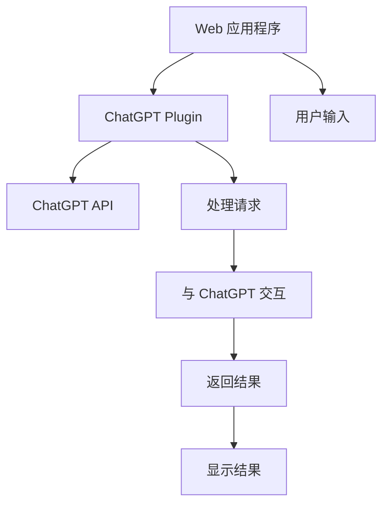

                 

# ChatGPT Plugin 介绍

> 关键词：ChatGPT, OpenAI, API, Python, 插件开发, 自然语言处理(NLP), 应用程序接口(API), 插件设计, 应用程序集成

## 1. 背景介绍

在人工智能迅速发展的今天，ChatGPT 已经成为了自然语言处理（Natural Language Processing, NLP）领域的翘楚。OpenAI 开发的 GPT-3 模型在多种任务上表现出色，如文本生成、翻译、问答等，展现了强大的语言理解和生成能力。然而，ChatGPT 的主要应用场景仍然是 Web 应用程序和独立的客户端应用，用户需要访问特定的 URL 或直接运行应用程序才能与其互动。

这种模式限制了 ChatGPT 在企业内部的集成和个性化定制，难以满足不同业务场景的多样化需求。为了解决这一问题，OpenAI 开发了 ChatGPT Plugin，使得开发者可以将 ChatGPT 的功能无缝集成到现有的应用系统中，如企业内的聊天室、客户服务平台等，实现更灵活、更高效的人机交互体验。

## 2. 核心概念与联系

### 2.1 核心概念概述

ChatGPT Plugin 是指将 ChatGPT 的 API 接口嵌入到其他应用程序中，使用户能够在现有应用界面内直接与 ChatGPT 进行互动的插件技术。通过这种技术，开发者可以在不改变现有系统架构的前提下，轻松集成 ChatGPT 的对话能力，提供更丰富、更个性化的人机交互体验。

### 2.2 核心概念原理和架构的 Mermaid 流程图



上述 Mermaid 图展示了 ChatGPT Plugin 的核心架构：

1. **Web 应用程序**：用户通过访问的应用程序，发起与 ChatGPT 的交互请求。
2. **ChatGPT Plugin**：这是应用程序和 ChatGPT 的桥梁，负责将用户的输入请求转换为对 ChatGPT API 的调用，并将 ChatGPT 的响应结果返回给应用程序。
3. **ChatGPT API**：OpenAI 提供的 API 接口，用于处理用户输入和返回对话结果。
4. **用户输入**：用户在应用程序中输入的问题或请求。
5. **处理请求**：ChatGPT Plugin 对用户输入进行解析和预处理，形成对 ChatGPT API 的调用请求。
6. **与 ChatGPT 交互**：ChatGPT Plugin 通过调用 ChatGPT API，获取 ChatGPT 的响应结果。
7. **返回结果**：ChatGPT Plugin 将 ChatGPT 的响应结果返回给应用程序。
8. **显示结果**：应用程序将 ChatGPT 的响应结果展示给用户。

## 3. 核心算法原理 & 具体操作步骤

### 3.1 算法原理概述

ChatGPT Plugin 的工作原理基于 OpenAI 提供的 ChatGPT API，通过将用户的输入转换为对 API 的调用请求，将 ChatGPT 的输出展示给用户。整个流程可以分为四个主要步骤：

1. **输入处理**：将用户的输入请求进行解析和预处理，形成对 ChatGPT API 的调用请求。
2. **API 调用**：向 ChatGPT API 发送请求，获取 ChatGPT 的响应结果。
3. **结果处理**：对 ChatGPT 的响应结果进行后处理，提取有用信息。
4. **输出展示**：将处理后的结果展示给用户。

### 3.2 算法步骤详解

下面是 ChatGPT Plugin 开发的具体操作步骤：

#### 步骤 1：准备开发环境

1. **创建虚拟环境**：在开发机上使用 Python 创建虚拟环境，以便于管理第三方库和依赖。
   ```bash
   python -m venv chatbot-env
   source chatbot-env/bin/activate
   ```

2. **安装相关库**：安装必要的库，如 requests、flask、jsonlib 等。
   ```bash
   pip install requests flask jsonlib
   ```

#### 步骤 2：配置 ChatGPT API

1. **获取 API 密钥**：访问 OpenAI 官网，申请 ChatGPT API 的访问密钥。
2. **设置配置文件**：创建配置文件，存储 API 密钥和端点。
   ```python
   {
       "api_key": "your_api_key_here",
       "api_endpoint": "https://api.openai.com/v1/engines/davinci-codex"
   }
   ```

#### 步骤 3：编写插件代码

1. **创建 Flask 应用**：使用 Flask 框架创建 Web 应用，接收用户输入并调用 ChatGPT API。
   ```python
   from flask import Flask, request, jsonify
   from jsonlib import load
   import requests
   
   app = Flask(__name__)
   
   @app.route('/chat', methods=['POST'])
   def chat():
       input_text = request.json.get('input')
       response = call_chatgpt(input_text)
       return jsonify(response)
   
   def call_chatgpt(input_text):
       config = load('config.json')
       headers = {'Authorization': f'Bearer {config["api_key"]}'}
       url = config["api_endpoint"]
       payload = {'prompt': input_text}
       response = requests.post(url, headers=headers, json=payload)
       return response.json()
   
   if __name__ == "__main__":
       app.run(debug=True)
   ```

#### 步骤 4：测试和部署

1. **本地测试**：在本地运行 Flask 应用，检查 ChatGPT Plugin 是否能够正确处理用户输入并返回结果。
2. **部署应用**：将 Flask 应用部署到服务器或云平台，使其能够被访问。

### 3.3 算法优缺点

ChatGPT Plugin 的优点在于其灵活性和易用性。通过简单的 API 调用，开发者可以轻松集成 ChatGPT 的对话能力，而不必深入了解 ChatGPT 的内部机制。此外，ChatGPT Plugin 适用于多种应用场景，如客户服务、智能客服、企业内部沟通等，可以大大提升应用的人机交互体验。

然而，ChatGPT Plugin 也存在一些缺点：

1. **依赖外部服务**：ChatGPT Plugin 依赖 OpenAI 提供的 API 服务，一旦 API 服务不可用，插件也将无法正常工作。
2. **API 调用限制**：OpenAI 的 API 服务对每日请求次数有限制，超额请求需要额外付费。
3. **缺乏控制**：ChatGPT 的输出完全依赖 API 服务，开发者难以对其输出进行精确控制，特别是在处理敏感信息时。

### 3.4 算法应用领域

ChatGPT Plugin 可以广泛应用于多个领域，如：

1. **客户服务**：集成到企业内部的客服系统中，提供即时的客户支持。
2. **智能客服**：作为智能客服的核心组件，提高客户服务效率和质量。
3. **内部沟通**：集成到企业内部的内部沟通工具中，提升团队协作效率。
4. **教育培训**：集成到在线教育平台中，提供智能化的辅助教学功能。
5. **健康咨询**：集成到健康咨询系统中，提供个性化的健康建议。

## 4. 数学模型和公式 & 详细讲解

### 4.1 数学模型构建

ChatGPT Plugin 的数学模型主要涉及两个方面：用户输入的处理和 ChatGPT API 的调用。对于用户输入的处理，通常使用简单的字符串处理和解析技术；对于 API 调用，则主要涉及 HTTP 请求和响应的处理。

### 4.2 公式推导过程

假设用户的输入为 $X$，API 调用返回的输出为 $Y$，则 ChatGPT Plugin 的基本处理流程可以表示为：

$$
Y = f(X, \theta)
$$

其中 $\theta$ 表示 ChatGPT Plugin 的参数，包括 API 密钥、端点等。在具体的实现中，$X$ 通常为 JSON 格式的用户输入请求，$Y$ 为 ChatGPT API 返回的 JSON 格式的响应结果。

### 4.3 案例分析与讲解

以下是一个简单的例子，展示如何使用 ChatGPT Plugin 进行对话：

1. **用户输入**：用户在应用中输入问题，如 "我最近感觉疲劳，怎么改善？"
2. **插件处理**：ChatGPT Plugin 将问题转换为 JSON 格式的请求，并发送给 ChatGPT API。
3. **API 调用**：ChatGPT API 接收到请求后，调用 GPT-3 模型生成回答。
4. **返回结果**：ChatGPT Plugin 将 API 返回的回答转换为应用界面上的回答，如 "建议您保持充足的睡眠和良好的饮食习惯，适当进行锻炼。"

## 5. 项目实践：代码实例和详细解释说明

### 5.1 开发环境搭建

1. **安装 Python 和虚拟环境**：在开发机上安装 Python 和 virtualenv 工具，创建虚拟环境。
   ```bash
   python -m pip install virtualenv
   python -m venv chatbot-env
   source chatbot-env/bin/activate
   ```

2. **安装相关库**：安装必要的库，如 Flask、requests 等。
   ```bash
   pip install flask requests jsonlib
   ```

### 5.2 源代码详细实现

1. **创建 Flask 应用**：使用 Flask 框架创建 Web 应用，接收用户输入并调用 ChatGPT API。
   ```python
   from flask import Flask, request, jsonify
   from jsonlib import load
   import requests
   
   app = Flask(__name__)
   
   @app.route('/chat', methods=['POST'])
   def chat():
       input_text = request.json.get('input')
       response = call_chatgpt(input_text)
       return jsonify(response)
   
   def call_chatgpt(input_text):
       config = load('config.json')
       headers = {'Authorization': f'Bearer {config["api_key"]}'}
       url = config["api_endpoint"]
       payload = {'prompt': input_text}
       response = requests.post(url, headers=headers, json=payload)
       return response.json()
   
   if __name__ == "__main__":
       app.run(debug=True)
   ```

2. **配置 ChatGPT API**：创建配置文件，存储 API 密钥和端点。
   ```json
   {
       "api_key": "your_api_key_here",
       "api_endpoint": "https://api.openai.com/v1/engines/davinci-codex"
   }
   ```

3. **测试和部署**：在本地运行 Flask 应用，检查 ChatGPT Plugin 是否能够正确处理用户输入并返回结果。部署应用至服务器或云平台。

### 5.3 代码解读与分析

1. **Flask 应用**：使用 Flask 框架创建 Web 应用，接收 POST 请求，将用户输入发送给 ChatGPT API 并返回结果。
2. **API 调用**：通过 requests 库发送 POST 请求，调用 ChatGPT API 的 /engines/davinci-codex 端点，获取响应结果。
3. **结果处理**：将 API 返回的 JSON 格式结果转换为应用界面上的回答。

### 5.4 运行结果展示

1. **本地测试**：在本地运行 Flask 应用，可以通过访问 localhost:5000/chat，并发送 POST 请求，获取 ChatGPT 的响应结果。
2. **部署应用**：将 Flask 应用部署至服务器或云平台，使其能够被访问，并通过 HTTP 接口接收用户输入和获取 ChatGPT 的响应结果。

## 6. 实际应用场景

### 6.1 智能客服系统

ChatGPT Plugin 可以集成到智能客服系统中，提供即时的客户支持。通过在客服系统中添加 ChatGPT Plugin，可以大幅提升客户服务效率和质量。例如，客户可以在客服界面直接与 ChatGPT 互动，获取常见问题的解答，减少人工客服的负担。

### 6.2 企业内部沟通工具

ChatGPT Plugin 可以集成到企业内部的沟通工具中，提供智能化的沟通功能。例如，员工可以在内部沟通工具中直接与 ChatGPT 互动，获取工作相关的信息或进行知识共享。

### 6.3 在线教育平台

ChatGPT Plugin 可以集成到在线教育平台中，提供智能化的辅助教学功能。例如，学生可以在学习平台中直接与 ChatGPT 互动，获取学习相关的问答或建议，提升学习效果。

## 7. 工具和资源推荐

### 7.1 学习资源推荐

1. **OpenAI 文档**：OpenAI 提供的 ChatGPT API 文档，详细介绍了 API 的调用方式和参数设置。
2. **Flask 文档**：Flask 框架的官方文档，介绍了 Flask 的基本用法和开发实践。
3. **Python 编程指南**：Python 编程语言的基础教程和进阶指南，帮助开发者掌握 Python 的基本语法和开发技巧。
4. **JSON 解析库**：介绍 JSON 格式的数据解析方法，帮助开发者处理 API 返回的 JSON 数据。

### 7.2 开发工具推荐

1. **PyCharm**：一款流行的 Python IDE，提供了丰富的开发工具和调试功能。
2. **GitHub**：代码托管平台，提供了丰富的代码仓库和协作工具。
3. **Jupyter Notebook**：交互式编程工具，适用于数据分析和模型开发。
4. **Docker**：容器化技术，用于应用程序的打包和部署。

### 7.3 相关论文推荐

1. **"Neural Machine Translation by Jointly Learning to Align and Translate"**：OpenAI 团队发表的论文，介绍了 GPT-3 模型的架构和训练方法。
2. **"Attention is All You Need"**：Transformer 模型的原论文，介绍了 Transformer 模型的基本原理和应用。
3. **"Programming Language Understanding via Transfer Learning of Language Models"**：介绍了使用大语言模型进行编程语言理解的方法。

## 8. 总结：未来发展趋势与挑战

### 8.1 总结

本文介绍了 ChatGPT Plugin 的原理和实现方法，展示了其灵活性和易用性。ChatGPT Plugin 使得开发者能够将 ChatGPT 的对话能力无缝集成到现有的应用系统中，提供更丰富、更个性化的人机交互体验。通过具体的代码实现和案例分析，本文帮助读者理解了 ChatGPT Plugin 的开发流程和应用场景。

### 8.2 未来发展趋势

ChatGPT Plugin 的未来发展趋势主要包括以下几个方面：

1. **多语言支持**：ChatGPT Plugin 将支持更多语言，满足全球化应用的需求。
2. **多模态融合**：ChatGPT Plugin 将支持图像、音频等多模态数据的处理，提升人机交互的丰富性。
3. **隐私保护**：ChatGPT Plugin 将加强隐私保护功能，确保用户数据的安全。
4. **个性化定制**：ChatGPT Plugin 将提供更丰富的配置选项，满足不同应用场景的需求。
5. **低延迟优化**：ChatGPT Plugin 将优化 API 调用和数据传输，提升实时性。

### 8.3 面临的挑战

ChatGPT Plugin 在未来的发展过程中，将面临以下挑战：

1. **API 调用限制**：OpenAI 的 API 调用限制将影响 ChatGPT Plugin 的性能。
2. **成本问题**：API 调用超额收费将增加 ChatGPT Plugin 的成本。
3. **安全性问题**：ChatGPT Plugin 需要加强数据安全和隐私保护，避免数据泄露和安全威胁。
4. **性能优化**：需要优化 API 调用的延迟和响应时间，提升用户体验。
5. **多语言支持**：ChatGPT Plugin 需要支持多种语言，提升国际化的能力。

### 8.4 研究展望

未来的研究方向包括：

1. **低延迟优化**：优化 API 调用的延迟和响应时间，提升实时性。
2. **多语言支持**：开发支持多种语言的多语言版本。
3. **安全性增强**：加强数据安全和隐私保护，避免数据泄露和安全威胁。
4. **API 调用优化**：优化 API 调用方式，避免超额收费。
5. **个性化定制**：提供更丰富的配置选项，满足不同应用场景的需求。

## 9. 附录：常见问题与解答

### Q1: ChatGPT Plugin 如何与现有应用系统集成？

A: ChatGPT Plugin 可以采用 HTTP API 的形式与现有应用系统集成。开发者可以将 ChatGPT Plugin 的接口地址和请求方式暴露给现有应用系统，使现有应用系统能够通过 HTTP POST 请求调用 ChatGPT Plugin，实现与 ChatGPT 的互动。

### Q2: ChatGPT Plugin 是否有开源版本？

A: 目前 OpenAI 提供的 ChatGPT Plugin 是商业化的服务，没有开源版本。开发者可以通过使用 OpenAI 提供的 API 接口实现类似的功能，但需要支付相应的 API 调用费用。

### Q3: ChatGPT Plugin 是否支持多语言？

A: 目前 ChatGPT Plugin 主要支持英语，开发者可以通过调用 OpenAI 提供的多种语言版本的 API 接口，实现多语言支持。

### Q4: ChatGPT Plugin 的 API 调用限制如何？

A: OpenAI 的 API 调用限制将影响 ChatGPT Plugin 的性能。开发者需要关注 OpenAI 的 API 调用规则和限制，避免超出限制导致无法正常工作。

### Q5: ChatGPT Plugin 是否有性能优化的方法？

A: ChatGPT Plugin 可以通过以下方法进行性能优化：

1. **缓存 API 调用结果**：缓存 API 调用结果，避免重复请求。
2. **异步请求**：使用异步请求方式，提高 API 调用的并发性能。
3. **负载均衡**：使用负载均衡技术，分散 API 调用的压力。

---

作者：禅与计算机程序设计艺术 / Zen and the Art of Computer Programming

