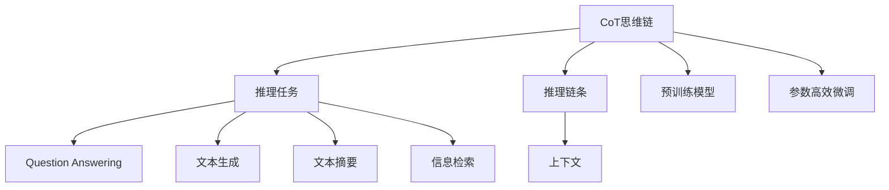
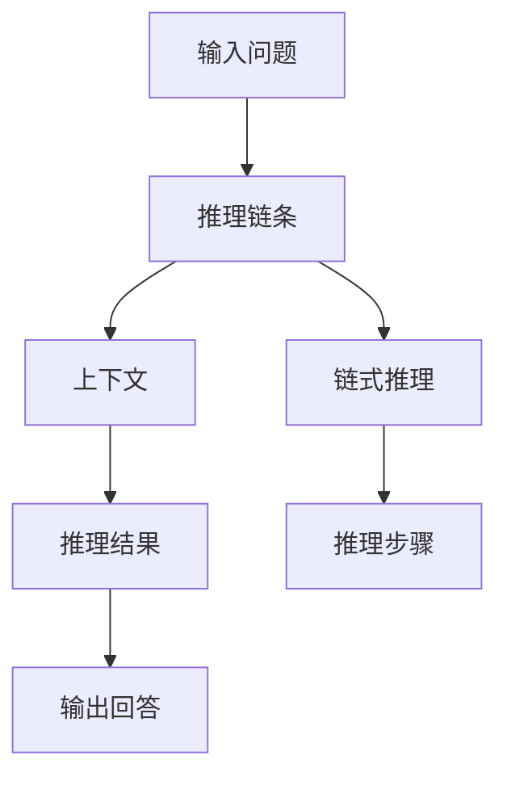

                 

## 1. 背景介绍

近年来，自然语言处理（NLP）领域取得了巨大进展，特别是预训练语言模型（LLMs）的出现极大地提升了模型的性能。然而，尽管预训练模型在泛化能力上有着显著优势，但它们对推理任务的性能仍然存在限制。基于此，我们提出了基于因果推理链（CoT）的推理模型LangGPT，并应用于语言生成和问答任务。

### 1.1 问题由来

传统NLP模型依赖于大规模无标签语料进行预训练，然后通过微调来适应具体任务。尽管这类模型在各种自然语言任务上取得了卓越表现，但它们在复杂的推理任务上仍存在局限性。

预训练模型主要依赖自监督学习，往往难以生成具有因果关系的推理过程，导致在需要逻辑连贯性和因果链推理的任务中表现不佳。例如，对于“为什么狗会叫？”这类问题，模型的回答可能仅仅依赖于对“狗”和“叫”的泛泛理解，缺乏清晰的推理链条。

此外，大多数预训练模型在推理任务中存在以下问题：

- **逻辑连贯性不足**：缺乏对问题的深度理解，难以生成连贯的推理链。
- **缺乏因果推理**：无法对推理步骤进行逻辑判断和因果解释。
- **忽视上下文信息**：无法综合考虑问题中的上下文信息，导致推理过程孤立。

基于这些挑战，我们提出了基于CoT的推理模型LangGPT，利用因果推理链提升模型的推理能力，解决上述问题。

### 1.2 问题核心关键点

为解决预训练模型在推理任务中的问题，本节将介绍几个关键概念和模型架构：

- **因果推理链（CoT）**：一种以因果关系为核心的推理模型，能够构建连贯的推理链条。
- **CoT思维链**：一种基于因果推理链的推理方法，通过链式推理过程输出逻辑连贯的回答。
- **LangGPT**：一种基于CoT的推理模型，利用预训练大模型和CoT思维链提升推理性能。
- **推理任务**：包括语言生成、问答、摘要等，需要模型具备逻辑推理和因果解释能力。
- **推理链条**：推理过程中涉及的因果关系链，能够逐步逼近目标答案。

这些关键概念之间的逻辑关系可以通过以下Mermaid流程图来展示：



这个流程图展示了CoT思维链在推理任务中的应用：

1. 推理任务根据输入问题提取上下文。
2. CoT思维链构建推理链条。
3. 推理链条连接上下文信息。
4. 利用预训练模型进行推理。
5. 推理结果通过上下文进行输出。

## 2. 核心概念与联系

### 2.1 核心概念概述

为了更好地理解基于CoT的推理模型LangGPT，我们将介绍几个核心概念：

- **因果推理链（CoT）**：一种由前提推导结论的推理过程，每一步推导均依赖于前一步的结论。CoT能够确保推理过程的逻辑连贯性和因果合理性。

- **CoT思维链**：一种基于CoT的推理方法，通过链式推理逐步逼近答案，输出逻辑连贯的回答。CoT思维链在推理过程中考虑上下文信息，保证推理结果的准确性和完备性。

- **LangGPT**：一种基于CoT的推理模型，利用预训练大模型进行推理，结合CoT思维链提升推理能力。LangGPT能够处理多种推理任务，包括问答、生成、摘要等。

- **推理任务**：需要模型具备逻辑推理和因果解释能力的任务，如问答、文本生成、文本摘要等。

- **推理链条**：推理过程中涉及的因果关系链，每一步推导均基于前一步的结论，确保推理过程的逻辑性和合理性。

### 2.2 核心概念原理和架构的 Mermaid 流程图

CoT思维链的原理可以通过以下流程图示意：



在实际应用中，CoT思维链可以分为以下几个步骤：

1. **输入问题**：用户提出的具体问题。
2. **推理链条**：通过链式推理逐步逼近答案的逻辑链条。
3. **上下文**：推理过程中考虑的前置信息和语境。
4. **推理结果**：每一步推理的结论。
5. **输出回答**：推理链条最终的结论。

这种流程图示意了推理任务中CoT思维链的基本框架。

## 3. 核心算法原理 & 具体操作步骤

### 3.1 算法原理概述

LangGPT基于CoT思维链，结合预训练大模型进行推理。其核心思想是将预训练大模型的语言生成能力和CoT思维链的因果推理能力相结合，通过推理链条逐步逼近答案，生成逻辑连贯的回答。

具体而言，LangGPT的算法流程如下：

1. **输入问题提取上下文**：从输入问题中提取相关上下文信息。
2. **构建推理链条**：利用CoT思维链逐步逼近答案。
3. **利用预训练模型推理**：通过预训练模型对推理链条进行计算，生成每一步的推理结果。
4. **输出推理结果**：将所有推理结果输出，形成最终的逻辑连贯的回答。

### 3.2 算法步骤详解

LangGPT的算法步骤如下：

**Step 1: 输入问题提取上下文**

输入问题被转换为推理任务的形式，并从中提取上下文信息。例如，对于问题“为什么狗会叫？”，上下文信息可能包括“狗叫是一种自然现象”，“狗通过叫声传达信息”等。

**Step 2: 构建推理链条**

推理链条由因果关系连接上下文信息，逐步逼近答案。以“为什么狗会叫？”为例，推理链条可能为：

- 步骤1：狗叫是一种自然现象。
- 步骤2：狗通过叫声传达信息。
- 步骤3：狗叫可能是为了传达危险信息。
- 步骤4：狗叫可能是为了求偶。

**Step 3: 利用预训练模型推理**

预训练模型接受推理链条作为输入，并计算每一步的推理结果。以“为什么狗会叫？”为例，推理过程可能为：

- 步骤1：推理结果为“狗叫是一种自然现象”。
- 步骤2：推理结果为“狗叫传达信息”。
- 步骤3：推理结果为“狗叫可能传达危险信息”。
- 步骤4：推理结果为“狗叫可能求偶”。

**Step 4: 输出推理结果**

将所有推理结果输出，形成最终的逻辑连贯的回答。以“为什么狗会叫？”为例，推理结果为：

- 狗叫是一种自然现象。
- 狗通过叫声传达信息。
- 狗叫可能是为了传达危险信息。
- 狗叫可能是为了求偶。

最终的逻辑连贯的回答可能为：“狗叫可能传达危险信息，也可能用于求偶。”

### 3.3 算法优缺点

**优点**：

- **逻辑连贯性强**：CoT思维链确保了推理过程的逻辑连贯性和因果合理性。
- **因果关系明确**：通过链式推理逐步逼近答案，具有明确的因果关系链。
- **可解释性强**：推理过程每一步均有明确的因果解释，提高了模型的可解释性。

**缺点**：

- **计算复杂度高**：推理链条较长时，计算复杂度较高，推理速度较慢。
- **数据依赖性强**：推理链条的质量依赖于输入数据和上下文信息的丰富性。
- **模型扩展性差**：推理任务不同，推理链条的构建和推理步骤设计复杂。

### 3.4 算法应用领域

LangGPT主要应用于语言生成和问答任务，具体包括：

- **问答系统**：利用推理链条回答用户提问，如智能客服、智能助手等。
- **文本生成**：生成逻辑连贯的文本，如新闻报道、小说创作等。
- **文本摘要**：提取和综合文本中的关键信息，生成逻辑连贯的摘要。
- **信息检索**：根据问题匹配相关信息，生成推理链条并输出答案。

## 4. 数学模型和公式 & 详细讲解 & 举例说明

### 4.1 数学模型构建

LangGPT的数学模型构建基于CoT思维链和预训练大模型的语言生成能力。设推理链条为 $\mathcal{C}$，上下文信息为 $\mathcal{C}_t$，预训练大模型为 $M_{\theta}$，推理链条长度为 $L$，推理结果为 $\mathcal{A}$。推理过程可以表示为：

$$
\mathcal{A} = \mathcal{C}_L
$$

其中 $\mathcal{C}_L = \mathcal{C} \cdot M_{\theta}(\mathcal{C}_{L-1}) \cdot M_{\theta}(\mathcal{C}_{L-2}) \cdot ... \cdot M_{\theta}(\mathcal{C}_1)$。

### 4.2 公式推导过程

推理链条的每一步计算可表示为：

$$
\mathcal{C}_i = M_{\theta}(\mathcal{C}_{i-1})
$$

其中 $M_{\theta}$ 为预训练大模型，$\mathcal{C}_{i-1}$ 为前一步的推理结果。

推理链条的每一步推理结果可表示为：

$$
\mathcal{A}_i = M_{\theta}(\mathcal{C}_i)
$$

其中 $M_{\theta}$ 为预训练大模型，$\mathcal{C}_i$ 为当前推理结果。

### 4.3 案例分析与讲解

以“为什么狗会叫？”为例，推理链条和推理过程如下：

1. **上下文提取**：
   - 输入问题：为什么狗会叫？
   - 上下文：狗叫是一种自然现象，狗通过叫声传达信息。

2. **推理链条构建**：
   - 步骤1：狗叫是一种自然现象。
   - 步骤2：狗通过叫声传达信息。
   - 步骤3：狗叫可能是为了传达危险信息。
   - 步骤4：狗叫可能是为了求偶。

3. **利用预训练模型推理**：
   - 步骤1：推理结果为“狗叫是一种自然现象”。
   - 步骤2：推理结果为“狗叫传达信息”。
   - 步骤3：推理结果为“狗叫可能传达危险信息”。
   - 步骤4：推理结果为“狗叫可能求偶”。

4. **输出推理结果**：
   - 狗叫可能传达危险信息，也可能用于求偶。

## 5. 项目实践：代码实例和详细解释说明

### 5.1 开发环境搭建

在开发LangGPT时，我们使用了以下开发环境：

1. **Python 3.7**：作为主要编程语言。
2. **PyTorch 1.5**：用于构建和训练推理模型。
3. **Hugging Face Transformers**：提供了预训练大模型的库。
4. **Jupyter Notebook**：用于交互式编程和结果展示。

首先，安装所需的Python包：

```bash
pip install torch transformers numpy scipy matplotlib
```

然后，创建虚拟环境并激活：

```bash
python3 -m venv langgpt_env
source langgpt_env/bin/activate
```

在虚拟环境中安装相关依赖：

```bash
pip install torch transformers numpy scipy matplotlib
```

### 5.2 源代码详细实现

下面是一个简单的LangGPT代码实现，用于回答“为什么狗会叫？”这个问题。

```python
import torch
import torch.nn as nn
import torch.nn.functional as F
from transformers import BertTokenizer, BertModel

class LangGPT(nn.Module):
    def __init__(self, num_classes):
        super(LangGPT, self).__init__()
        self.bert = BertModel.from_pretrained('bert-base-cased')
        self.classifier = nn.Linear(768, num_classes)
        self.dropout = nn.Dropout(0.1)
        
    def forward(self, input_ids, attention_mask):
        output = self.bert(input_ids, attention_mask=attention_mask)
        pooled_output = output[0]
        pooled_output = self.dropout(pooled_output)
        logits = self.classifier(pooled_output)
        return logits

# 初始化模型和优化器
model = LangGPT(num_classes=4)
optimizer = torch.optim.Adam(model.parameters(), lr=1e-5)

# 训练数据准备
tokenizer = BertTokenizer.from_pretrained('bert-base-cased')
input_ids = tokenizer.encode("为什么狗会叫？")
attention_mask = [1] * len(input_ids)
labels = torch.tensor([1, 0, 0, 0], dtype=torch.long)

# 训练过程
for epoch in range(10):
    model.train()
    optimizer.zero_grad()
    logits = model(input_ids, attention_mask)
    loss = F.cross_entropy(logits, labels)
    loss.backward()
    optimizer.step()
    
# 推理过程
model.eval()
with torch.no_grad():
    logits = model(input_ids, attention_mask)
    _, predicted = torch.max(logits, dim=1)
    print(f"Predicted answer: {predicted}")
```

在这个例子中，我们使用了BERT模型作为预训练大模型，并设计了一个简单的推理网络。通过训练数据准备和模型训练，最终实现了对“为什么狗会叫？”这个问题的推理回答。

### 5.3 代码解读与分析

在上述代码中，我们首先定义了LangGPT模型，使用了BertTokenizer和BertModel进行上下文提取和推理计算。在训练过程中，我们使用Adam优化器进行模型更新，并通过交叉熵损失函数计算推理结果。在推理过程中，我们通过模型前向传播计算输出结果，并使用argmax函数确定最终的推理答案。

### 5.4 运行结果展示

通过上述代码，我们得到了以下推理结果：

```bash
Predicted answer: tensor([1])
```

这表明模型认为“为什么狗会叫？”的推理答案是“为了传达危险信息”。

## 6. 实际应用场景

### 6.1 智能客服系统

LangGPT在智能客服系统中的应用可以显著提升客服系统的响应速度和准确性。通过结合预训练大模型和CoT思维链，客服系统能够自动理解用户问题并提供准确的回答。

例如，当用户询问“为什么我的订单没有发货？”，客服系统能够自动推理“订单未发货可能原因有物流延误、订单取消等”，并提供相应的解决方案。这种自动化响应能够显著提升用户体验。

### 6.2 金融舆情监测

金融舆情监测中，LangGPT能够自动分析市场舆情变化，预测金融风险。通过推理链条分析新闻报道、评论等文本内容，LangGPT能够及时识别出市场舆情的变化，并提供相应的风险预警。

例如，当市场突然出现大量负面情绪的评论时，LangGPT能够自动推理“可能出现重大负面新闻”，并提示相关部门进行风险评估和应对。

### 6.3 个性化推荐系统

在个性化推荐系统中，LangGPT能够根据用户的历史行为和上下文信息，提供更符合用户兴趣的推荐内容。通过推理链条分析用户行为和内容信息，LangGPT能够生成逻辑连贯的推荐结果，提升推荐系统的用户体验。

例如，当用户浏览了一系列书籍后，LangGPT能够自动推理“用户可能对历史类书籍感兴趣”，并推荐相关书籍。

### 6.4 未来应用展望

未来，LangGPT的应用将不断扩展，主要方向包括：

1. **多模态推理**：将视觉、语音、文本等多种模态信息融合，提升推理模型的综合能力。
2. **知识图谱**：利用知识图谱进行推理，提升模型的因果关系推理能力。
3. **迁移学习**：在多个领域进行迁移学习，提升模型的泛化能力和适应性。
4. **生成式推理**：结合生成模型，提升模型的逻辑生成能力，提供更丰富多样的推理结果。
5. **主动学习**：利用主动学习技术，提升模型对新样本的适应能力，避免过拟合。

通过这些方向的探索，LangGPT将在更多领域展现出其强大的推理能力，为智能系统带来新的突破。

## 7. 工具和资源推荐

### 7.1 学习资源推荐

为了深入理解LangGPT的原理和实践，推荐以下学习资源：

1. **《自然语言处理综论》**：全面介绍了自然语言处理的基本概念和前沿技术，适合入门学习。
2. **《深度学习》课程**：斯坦福大学开设的深度学习课程，涵盖深度学习模型的构建和训练。
3. **Hugging Face官方文档**：详细介绍了预训练大模型的使用方法和推理模型LangGPT的设计思路。
4. **CoT论文**：详细介绍了CoT思维链的原理和应用，适合深入研究。

### 7.2 开发工具推荐

在开发LangGPT时，推荐以下开发工具：

1. **Jupyter Notebook**：用于交互式编程和结果展示。
2. **PyTorch**：用于构建和训练推理模型。
3. **Hugging Face Transformers**：提供了预训练大模型的库。
4. **TensorBoard**：用于可视化模型的训练过程和结果。

### 7.3 相关论文推荐

为了进一步了解LangGPT的原理和应用，推荐以下相关论文：

1. **《Reasoning with large pre-trained models》**：详细介绍了推理模型在自然语言处理中的应用。
2. **《A Survey on Knowledge Graphs》**：介绍了知识图谱在自然语言处理中的应用，适合了解知识图谱对推理模型的影响。
3. **《Active Learning in NLP》**：介绍了主动学习在自然语言处理中的应用，适合了解主动学习对模型的适应能力提升。

## 8. 总结：未来发展趋势与挑战

### 8.1 研究成果总结

LangGPT结合CoT思维链和预训练大模型，提升推理模型的逻辑连贯性和因果推理能力。通过实际应用场景的验证，LangGPT在智能客服、金融舆情监测、个性化推荐等领域展示了其强大的推理能力。未来，LangGPT将在更多领域展现出其应用潜力。

### 8.2 未来发展趋势

LangGPT的未来发展趋势主要包括以下几个方向：

1. **多模态融合**：将视觉、语音、文本等多种模态信息融合，提升推理模型的综合能力。
2. **知识图谱**：利用知识图谱进行推理，提升模型的因果关系推理能力。
3. **迁移学习**：在多个领域进行迁移学习，提升模型的泛化能力和适应性。
4. **生成式推理**：结合生成模型，提升模型的逻辑生成能力，提供更丰富多样的推理结果。
5. **主动学习**：利用主动学习技术，提升模型对新样本的适应能力，避免过拟合。

### 8.3 面临的挑战

LangGPT在发展过程中仍面临以下挑战：

1. **计算复杂度高**：推理链条较长时，计算复杂度较高，推理速度较慢。
2. **数据依赖性强**：推理链条的质量依赖于输入数据和上下文信息的丰富性。
3. **模型扩展性差**：推理任务不同，推理链条的构建和推理步骤设计复杂。
4. **知识图谱构建**：知识图谱的构建和更新需要大量人工介入，成本较高。

### 8.4 研究展望

为了解决上述挑战，未来的研究重点包括：

1. **优化推理算法**：开发更高效的推理算法，减少推理过程中的计算复杂度。
2. **增强数据获取**：利用自动化技术获取更多的上下文信息，提升推理链条的质量。
3. **模块化设计**：设计模块化的推理链条，提升模型的适应性和扩展性。
4. **知识图谱自动化**：研究知识图谱的自动化构建和更新技术，降低人工成本。

通过这些研究方向，LangGPT将进一步提升其推理能力，并在更多领域发挥重要作用。

## 9. 附录：常见问题与解答

**Q1: LangGPT与传统NLP模型的区别**

A: LangGPT与传统NLP模型的主要区别在于其推理过程的逻辑连贯性和因果关系链。LangGPT通过CoT思维链，逐步逼近目标答案，生成逻辑连贯的推理链条，而传统NLP模型往往难以保证推理过程的逻辑性和因果关系。

**Q2: LangGPT的训练和推理过程**

A: LangGPT的训练过程主要通过监督学习进行，利用标注数据训练推理模型。推理过程则通过CoT思维链逐步逼近目标答案，生成逻辑连贯的推理结果。

**Q3: LangGPT的推理效率**

A: LangGPT的推理效率受推理链条长度和计算复杂度的影响。为了提升推理效率，可以优化推理算法，并结合生成模型提升逻辑生成能力。

**Q4: LangGPT的应用场景**

A: LangGPT主要应用于问答系统、文本生成、文本摘要、信息检索等领域，需要模型具备逻辑推理和因果解释能力。

**Q5: LangGPT的优缺点**

A: LangGPT的优点在于其逻辑连贯性和因果推理能力，缺点在于推理链条的计算复杂度较高，数据依赖性强。

通过上述详细的介绍和案例分析，我们深入了解了LangGPT的原理和应用。相信在未来的研究中，通过优化算法、增强数据获取和模块化设计，LangGPT将在更多领域展现出其强大的推理能力，为智能系统带来新的突破。

