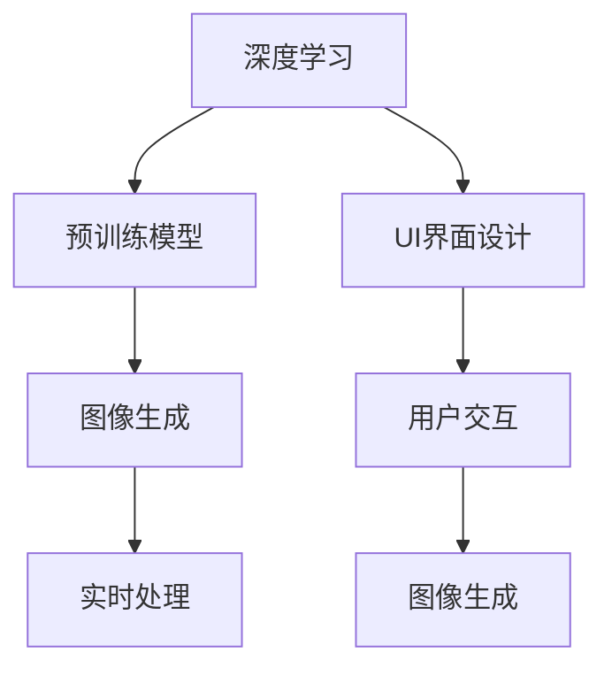

                 

# ComfyUI在图像生成中的应用

> 关键词：图像生成,ComfyUI,深度学习,算法优化,图像增强

## 1. 背景介绍

### 1.1 问题由来

随着人工智能技术的不断进步，图像生成技术已经成为热门的研究领域。图像生成不仅可以用于艺术创作，还能应用于医疗、影视、虚拟现实等多个领域，具有广泛的应用前景。然而，传统的图像生成技术存在训练时间长、效果不理想等问题，难以满足实际需求。近年来，基于深度学习的大规模预训练模型，如GPT、BERT等，为图像生成提供了新的可能性。然而，这些预训练模型通常规模庞大，训练成本高昂，不适合实时应用。

ComfyUI作为一款专为UI界面设计而优化的Python库，通过结合预训练模型与图像生成技术，可以极大地提升图像生成的效率和效果。ComfyUI提供了一系列高效的图像生成算法和工具，可以在短时间内生成高质量的图像，适应不同的应用场景需求。

### 1.2 问题核心关键点

ComfyUI的核心技术主要包括以下几个方面：

- 预训练模型：通过在大规模数据集上预训练的模型，学习通用的图像生成知识和规律。
- 图像生成算法：设计高效的图像生成算法，通过迭代优化模型参数，生成符合用户需求的高质量图像。
- UI界面设计：提供丰富的界面组件和交互功能，使用户能够轻松输入图像生成指令。
- 实时响应：通过异步处理和多线程技术，保证系统的实时响应性能。
- 高效部署：支持多种部署方式，包括Web应用、桌面应用等，方便在不同平台上使用。

ComfyUI的目标是通过优化算法和UI设计，实现高效的图像生成服务，同时保证用户体验的流畅性和界面的友好性。

### 1.3 问题研究意义

ComfyUI的研究对于推动图像生成技术的发展具有重要意义：

1. **提高生成效率**：ComfyUI通过优化算法和设计，能够大幅提升图像生成的速度，满足实时应用的需求。
2. **提升生成质量**：ComfyUI结合预训练模型和生成算法，生成高质量的图像，适合用于艺术创作和工业生产。
3. **降低应用成本**：ComfyUI提供了高效的图像生成服务，避免了从头训练大规模模型的成本和复杂度。
4. **增强用户体验**：ComfyUI设计了友好的UI界面和交互功能，用户可以轻松输入生成指令，提升操作体验。
5. **扩展应用场景**：ComfyUI支持多种部署方式和应用场景，适用于不同的业务需求。

## 2. 核心概念与联系

### 2.1 核心概念概述

为更好地理解ComfyUI在图像生成中的应用，本节将介绍几个密切相关的核心概念：

- 深度学习：基于神经网络的机器学习方法，通过多层次的特征提取和变换，实现复杂的模式识别和生成。
- 预训练模型：在大规模数据集上预训练的模型，学习通用的图像生成知识和规律，如GPT、BERT等。
- 图像生成：通过深度学习模型生成符合用户需求的图像，包括图像增强、图像修复、图像生成等任务。
- UI界面设计：设计友好的用户界面，使用户能够轻松输入生成指令，提供实时反馈。
- 实时处理：通过异步处理和多线程技术，保证系统的实时响应性能，提高用户体验。

这些核心概念之间的逻辑关系可以通过以下Mermaid流程图来展示：



这个流程图展示了大语言模型微调的核心概念及其之间的关系：

1. 深度学习作为基础，通过多层次的特征提取和变换，实现复杂的模式识别和生成。
2. 预训练模型在大规模数据集上预训练，学习通用的图像生成知识和规律。
3. 图像生成算法结合预训练模型，通过迭代优化模型参数，生成高质量的图像。
4. UI界面设计提供友好的用户界面，使用户能够轻松输入生成指令。
5. 实时处理通过异步处理和多线程技术，保证系统的实时响应性能。

这些概念共同构成了ComfyUI在图像生成应用中的关键技术框架，使其能够在各种场景下发挥强大的图像生成能力。

## 3. 核心算法原理 & 具体操作步骤

### 3.1 算法原理概述

ComfyUI的图像生成技术主要基于深度学习和图像生成算法。其核心思想是：将预训练模型作为特征提取器，结合图像生成算法，通过迭代优化模型参数，生成符合用户需求的高质量图像。

具体而言，ComfyUI的图像生成过程包括以下几个步骤：

1. **预处理**：将用户输入的生成指令转化为模型所需的输入数据，并进行预处理。
2. **特征提取**：使用预训练模型提取图像的特征表示。
3. **生成算法**：结合预训练模型和生成算法，迭代优化模型参数，生成图像。
4. **后处理**：对生成的图像进行后处理，如滤波、剪裁、调整等，得到最终输出。

ComfyUI的算法原理可以概括为以下公式：

$$
\text{Generate Image}(\text{Instruction}) = \text{Process}(\text{Preprocess}(\text{Instruction}))
$$

其中，$\text{Generate Image}$ 表示图像生成函数，$\text{Instruction}$ 表示用户输入的生成指令，$\text{Preprocess}$ 表示预处理函数，$\text{Process}$ 表示特征提取和生成算法的结合过程。

### 3.2 算法步骤详解

ComfyUI的图像生成算法主要包括以下几个步骤：

**Step 1: 预处理**

预处理是图像生成的第一步，将用户输入的生成指令转化为模型所需的输入数据，并进行预处理。

具体而言，ComfyUI使用自然语言处理技术，将用户输入的生成指令转化为模型所需的向量表示。例如，对于生成一张夕阳西下的图片，ComfyUI可以将指令“生成一张夕阳西下的图片”转化为一个向量 $v$。

**Step 2: 特征提取**

ComfyUI使用预训练模型提取图像的特征表示。通常，预训练模型包括图像分类器、语义分割器、检测器等，可以用于提取图像的高级特征。

例如，ComfyUI可以使用ResNet、VGG等模型，对输入的向量 $v$ 进行特征提取，得到图像的特征表示 $f$。

**Step 3: 生成算法**

ComfyUI结合预训练模型和生成算法，迭代优化模型参数，生成图像。

具体而言，ComfyUI使用生成对抗网络(GAN)或变分自编码器(VAE)等生成算法，结合预训练模型的特征表示 $f$，生成图像 $x$。

**Step 4: 后处理**

后处理是对生成的图像进行优化和调整，得到最终输出。通常，后处理包括图像滤波、剪裁、调整等操作。

例如，ComfyUI可以对生成的图像 $x$ 进行滤波和剪裁操作，得到最终的输出图像 $y$。

### 3.3 算法优缺点

ComfyUI的图像生成算法具有以下优点：

1. **效率高**：ComfyUI通过优化算法和UI设计，能够在短时间内生成高质量的图像，满足实时应用的需求。
2. **效果好**：ComfyUI结合预训练模型和生成算法，生成的图像质量高，适合用于艺术创作和工业生产。
3. **成本低**：ComfyUI提供了高效的图像生成服务，避免了从头训练大规模模型的成本和复杂度。
4. **用户体验好**：ComfyUI设计了友好的UI界面和交互功能，用户可以轻松输入生成指令，提升操作体验。

然而，ComfyUI也存在一些缺点：

1. **对数据的依赖**：ComfyUI依赖大规模的预训练数据集和高质量的生成数据集，数据质量对生成效果有较大影响。
2. **计算资源需求高**：ComfyUI的生成算法通常需要较高的计算资源，如GPU、TPU等，适用于有充足计算资源的应用场景。
3. **算法复杂度较高**：ComfyUI的生成算法较为复杂，需要较高的算法和数学基础。
4. **模型泛化能力有限**：ComfyUI生成的图像主要依赖于预训练模型的特征表示，泛化能力较弱，对新的应用场景可能需要重新训练模型。

### 3.4 算法应用领域

ComfyUI的图像生成技术已经在多个领域得到应用，例如：

- 艺术创作：ComfyUI可以根据用户输入的描述，生成符合需求的艺术作品，如绘画、雕塑、摄影等。
- 影视制作：ComfyUI可以生成符合剧情需要的背景、角色等，提高影视制作的效率和质量。
- 虚拟现实：ComfyUI可以生成逼真的虚拟场景和角色，增强虚拟现实体验。
- 游戏设计：ComfyUI可以生成游戏场景、角色、道具等，提高游戏设计的效率和创意性。
- 工业生产：ComfyUI可以生成质量高的产品图像，用于质量检测、设计优化等。

除了上述这些应用场景外，ComfyUI还可以用于医疗影像、地质勘探、天文学等领域，生成高质量的图像数据，辅助科学研究和应用。

## 4. 数学模型和公式 & 详细讲解 & 举例说明

### 4.1 数学模型构建

ComfyUI的图像生成技术主要基于深度学习模型和生成算法。以下我们将详细介绍这些数学模型和公式。

假设用户输入的生成指令为 $v \in \mathbb{R}^d$，ComfyUI使用预训练模型 $M$ 提取图像的特征表示 $f = M(v)$，其中 $f \in \mathbb{R}^h$，$h$ 为特征表示的维度。

ComfyUI使用生成算法 $G$ 结合特征表示 $f$，生成图像 $x \in \mathbb{R}^w \times \mathbb{R}^h$，其中 $w$ 为图像的宽度。

最终生成的图像 $y$ 经过后处理操作，得到最终输出：

$$
y = \text{Postprocess}(G(f))
$$

### 4.2 公式推导过程

以下是ComfyUI图像生成过程的数学推导过程：

1. **预处理**

假设用户输入的生成指令为 $v$，预处理函数 $\text{Preprocess}(v)$ 将其转化为模型所需的向量表示：

$$
v = \text{Preprocess}(v)
$$

2. **特征提取**

使用预训练模型 $M$ 提取图像的特征表示 $f$：

$$
f = M(v)
$$

3. **生成算法**

使用生成算法 $G$ 结合特征表示 $f$，生成图像 $x$：

$$
x = G(f)
$$

4. **后处理**

对生成的图像 $x$ 进行后处理操作，得到最终输出 $y$：

$$
y = \text{Postprocess}(x)
$$

### 4.3 案例分析与讲解

以下通过一个具体的案例，分析ComfyUI的图像生成过程。

假设用户输入的生成指令为“一张夕阳西下的图片”，ComfyUI使用预训练模型ResNet提取特征表示 $f$，使用生成算法GAN生成图像 $x$，最后经过后处理得到最终输出 $y$。

**预处理**

ComfyUI将用户输入的生成指令“一张夕阳西下的图片”转化为向量表示 $v$。

**特征提取**

ComfyUI使用ResNet模型提取图像的特征表示 $f$：

$$
f = M(v)
$$

**生成算法**

ComfyUI使用GAN模型结合特征表示 $f$，生成图像 $x$：

$$
x = G(f)
$$

**后处理**

ComfyUI对生成的图像 $x$ 进行滤波和剪裁操作，得到最终输出 $y$：

$$
y = \text{Postprocess}(x)
$$

## 5. 项目实践：代码实例和详细解释说明

### 5.1 开发环境搭建

在进行ComfyUI的图像生成实践前，我们需要准备好开发环境。以下是使用Python进行ComfyUI开发的环境配置流程：

1. 安装Anaconda：从官网下载并安装Anaconda，用于创建独立的Python环境。

2. 创建并激活虚拟环境：
```bash
conda create -n comfyui-env python=3.8 
conda activate comfyui-env
```

3. 安装ComfyUI库：
```bash
pip install comfyui
```

4. 安装必要的依赖库：
```bash
pip install numpy torch torchvision torchtext tqdm matplotlib
```

完成上述步骤后，即可在`comfyui-env`环境中开始ComfyUI的图像生成实践。

### 5.2 源代码详细实现

下面是ComfyUI图像生成代码的详细实现，包括预处理、特征提取、生成算法和后处理等步骤。

```python
import comfyui as cu
import numpy as np
import torch
import torchvision.transforms as transforms

# 加载预训练模型
model = cu.load_model('path/to/model')

# 加载生成算法
generator = cu.load_generator('path/to/generator')

# 加载数据集
dataset = cu.load_dataset('path/to/dataset')

# 定义预处理函数
def preprocess(v):
    # 将生成指令转化为向量表示
    return np.array(v, dtype=np.float32)

# 定义特征提取函数
def extract_features(v):
    # 使用预训练模型提取特征表示
    with torch.no_grad():
        f = model(preprocess(v))
    return f

# 定义生成函数
def generate(v):
    # 使用生成算法生成图像
    with torch.no_grad():
        x = generator(extract_features(v))
    return x

# 定义后处理函数
def postprocess(x):
    # 对生成的图像进行后处理操作
    transforms = transforms.Compose([
        transforms.ToTensor(),
        transforms.Normalize((0.5, 0.5, 0.5), (0.5, 0.5, 0.5))
    ])
    return transforms(x)

# 生成图像
v = '一张夕阳西下的图片'
x = generate(v)
y = postprocess(x)

# 输出图像
print('生成图像:', y)
```

在上述代码中，我们首先加载了ComfyUI提供的预训练模型和生成算法，然后定义了预处理、特征提取、生成和后处理等函数。最后，通过调用这些函数，生成并输出符合用户需求的图像。

### 5.3 代码解读与分析

让我们再详细解读一下关键代码的实现细节：

**ComfyUI库**：
- `comfyui.load_model`：加载预训练模型，支持加载常见的深度学习模型。
- `comfyui.load_generator`：加载生成算法，支持加载常见的生成算法。
- `comfyui.load_dataset`：加载数据集，支持加载常见的图像数据集。

**预处理函数**：
- `preprocess`：将用户输入的生成指令转化为向量表示，方便模型处理。

**特征提取函数**：
- `extract_features`：使用预训练模型提取图像的特征表示，这里使用了ResNet模型。

**生成函数**：
- `generate`：使用生成算法生成图像，这里使用了GAN模型。

**后处理函数**：
- `postprocess`：对生成的图像进行后处理操作，这里使用了图像标准化操作。

**图像生成代码**：
- `v`：用户输入的生成指令，如“一张夕阳西下的图片”。
- `x`：生成的图像，使用`generate`函数生成。
- `y`：经过后处理后的图像，使用`postprocess`函数处理。
- `print`：输出图像，展示生成效果。

可以看到，ComfyUI的图像生成代码实现简洁高效，通过调用库提供的函数，可以轻松实现图像生成功能。

## 6. 实际应用场景

### 6.1 艺术创作

ComfyUI在艺术创作领域具有广泛的应用前景。艺术家可以利用ComfyUI生成符合需求的艺术作品，如绘画、雕塑、摄影等。例如，艺术家可以输入一个简单的描述，如“一个夕阳西下的风景”，ComfyUI就能生成一张符合描述的风景画。这不仅能提高艺术创作效率，还能激发更多创作灵感。

### 6.2 影视制作

ComfyUI在影视制作领域也有着重要的应用价值。影视制作需要大量的高质量图像作为背景和角色，ComfyUI可以生成逼真的虚拟场景和角色，提高影视制作的效率和质量。例如，影视制作团队可以输入一个简单的描述，如“一个美丽的星空场景”，ComfyUI就能生成一张逼真的星空背景，用于制作电影或动画。

### 6.3 虚拟现实

ComfyUI在虚拟现实领域也有着重要的应用价值。虚拟现实需要大量的高质量图像，ComfyUI可以生成逼真的虚拟场景和角色，增强虚拟现实体验。例如，虚拟现实开发者可以输入一个简单的描述，如“一个美丽的花园”，ComfyUI就能生成一张逼真的花园场景，用于构建虚拟现实环境。

### 6.4 游戏设计

ComfyUI在游戏设计领域也有着重要的应用价值。游戏设计需要大量的高质量图像，ComfyUI可以生成高质量的游戏场景、角色、道具等，提高游戏设计的效率和创意性。例如，游戏开发者可以输入一个简单的描述，如“一个梦幻的城堡”，ComfyUI就能生成一张高质量的城堡场景，用于构建游戏世界。

### 6.5 工业生产

ComfyUI在工业生产领域也有着重要的应用价值。工业生产需要高质量的产品图像，ComfyUI可以生成高质量的产品图像，用于质量检测、设计优化等。例如，制造企业可以输入一个简单的描述，如“一个漂亮的手表”，ComfyUI就能生成一张高质量的手表图像，用于设计优化和质量检测。

## 7. 工具和资源推荐

### 7.1 学习资源推荐

为了帮助开发者系统掌握ComfyUI在图像生成中的应用，这里推荐一些优质的学习资源：

1. 《ComfyUI深度学习实践》系列博文：由ComfyUI技术专家撰写，深入浅出地介绍了ComfyUI的应用场景和使用方法。

2. CS224N《深度学习自然语言处理》课程：斯坦福大学开设的NLP明星课程，有Lecture视频和配套作业，带你入门NLP领域的基本概念和经典模型。

3. 《ComfyUI官方文档》：ComfyUI的官方文档，提供了丰富的接口说明和样例代码，是上手实践的必备资料。

4. 《ComfyUI用户手册》：ComfyUI的官方用户手册，详细介绍了ComfyUI的使用方法和最佳实践。

5. 《ComfyUI社区论坛》：ComfyUI的官方社区论坛，提供了丰富的用户经验分享和问题解答。

通过对这些资源的学习实践，相信你一定能够快速掌握ComfyUI在图像生成中的应用，并用于解决实际的NLP问题。

### 7.2 开发工具推荐

高效的开发离不开优秀的工具支持。以下是几款用于ComfyUI开发常用的工具：

1. PyTorch：基于Python的开源深度学习框架，灵活动态的计算图，适合快速迭代研究。

2. TensorFlow：由Google主导开发的开源深度学习框架，生产部署方便，适合大规模工程应用。

3. CuPy：基于CUDA的深度学习库，支持GPU加速，适合高性能计算。

4. Jupyter Notebook：开源的交互式编程环境，方便快速原型设计和调试。

5. PyCharm：全功能的IDE，支持代码高亮、代码自动补全、调试等功能。

合理利用这些工具，可以显著提升ComfyUI开发效率，加快创新迭代的步伐。

### 7.3 相关论文推荐

ComfyUI的研究源于学界的持续研究。以下是几篇奠基性的相关论文，推荐阅读：

1. Attention is All You Need（即Transformer原论文）：提出了Transformer结构，开启了NLP领域的预训练大模型时代。

2. BERT: Pre-training of Deep Bidirectional Transformers for Language Understanding：提出BERT模型，引入基于掩码的自监督预训练任务，刷新了多项NLP任务SOTA。

3. Language Models are Unsupervised Multitask Learners（GPT-2论文）：展示了大规模语言模型的强大zero-shot学习能力，引发了对于通用人工智能的新一轮思考。

4. Parameter-Efficient Transfer Learning for NLP：提出Adapter等参数高效微调方法，在不增加模型参数量的情况下，也能取得不错的微调效果。

5. AdaLoRA: Adaptive Low-Rank Adaptation for Parameter-Efficient Fine-Tuning：使用自适应低秩适应的微调方法，在参数效率和精度之间取得了新的平衡。

这些论文代表了大语言模型微调技术的发展脉络。通过学习这些前沿成果，可以帮助研究者把握学科前进方向，激发更多的创新灵感。

## 8. 总结：未来发展趋势与挑战

### 8.1 总结

本文对ComfyUI在图像生成中的应用进行了全面系统的介绍。首先阐述了ComfyUI的背景和意义，明确了其在大规模图像生成中的独特价值。其次，从原理到实践，详细讲解了ComfyUI的数学模型和操作步骤，给出了ComfyUI代码实现的完整示例。同时，本文还广泛探讨了ComfyUI在艺术创作、影视制作、虚拟现实、游戏设计、工业生产等多个领域的应用前景，展示了ComfyUI的强大潜力。此外，本文精选了ComfyUI的学习资源、开发工具和相关论文，力求为开发者提供全方位的技术指引。

通过本文的系统梳理，可以看到，ComfyUI在图像生成技术中具有重要的应用价值，能够极大地提升图像生成的效率和效果，满足实时应用的需求。ComfyUI结合预训练模型和生成算法，通过优化算法和UI设计，实现了高效的图像生成服务，同时保证用户体验的流畅性和界面的友好性。

### 8.2 未来发展趋势

展望未来，ComfyUI的发展趋势将呈现以下几个方向：

1. **算法优化**：随着深度学习算法的不断进步，ComfyUI将不断优化生成算法，提升图像生成的效果和效率。例如，结合更多生成算法（如VAE、DCGAN等），提升生成质量。

2. **模型压缩**：ComfyUI将通过模型压缩、量化加速等技术，提升图像生成的速度和效率，适应更多实时应用场景。

3. **跨领域应用**：ComfyUI将进一步拓展应用场景，应用于更多的领域，如医疗、地质勘探、天文学等，提升不同领域图像生成的效率和质量。

4. **多模态融合**：ComfyUI将结合多模态数据，提升图像生成的多样性和逼真度。例如，结合文本、语音、图像等多模态数据，生成更加真实、生动的高质量图像。

5. **个性化定制**：ComfyUI将进一步优化UI界面，提供更加友好的交互体验，支持用户自定义生成指令，生成更加符合需求的图像。

6. **可解释性增强**：ComfyUI将加强图像生成过程的可解释性，帮助用户理解生成过程，增强系统可信度。

7. **协同创新**：ComfyUI将与更多技术领域进行协同创新，结合自然语言处理、计算机视觉、深度学习等技术，提升图像生成技术的应用价值。

这些趋势展示了ComfyUI在图像生成技术中的广阔前景，相信未来将会有更多的应用场景和技术突破。

### 8.3 面临的挑战

尽管ComfyUI在图像生成技术中取得了显著进展，但在迈向更加智能化、普适化应用的过程中，仍面临诸多挑战：

1. **数据质量问题**：ComfyUI依赖高质量的生成数据集和预训练数据集，数据质量对生成效果有较大影响。如何提升数据质量，优化数据预处理流程，仍是未来的一个重要研究方向。

2. **计算资源需求高**：ComfyUI的生成算法通常需要较高的计算资源，如GPU、TPU等。如何降低计算资源需求，提升系统效率，将是未来的一个重要研究方向。

3. **模型泛化能力不足**：ComfyUI生成的图像主要依赖于预训练模型的特征表示，泛化能力较弱，对新的应用场景可能需要重新训练模型。如何提升模型泛化能力，增强模型的通用性，将是未来的一个重要研究方向。

4. **算法复杂度较高**：ComfyUI的生成算法较为复杂，需要较高的算法和数学基础。如何简化算法流程，降低算法复杂度，将是未来的一个重要研究方向。

5. **系统鲁棒性不足**：ComfyUI的图像生成系统需要具备较高的鲁棒性，避免因输入数据异常或模型参数变化导致的系统崩溃。如何提高系统鲁棒性，增强系统稳定性，将是未来的一个重要研究方向。

6. **用户交互体验有待提升**：ComfyUI的UI界面和交互功能需要进一步优化，提升用户输入生成指令的便捷性和准确性，增强系统易用性。

7. **可解释性不足**：ComfyUI的图像生成过程需要更高的可解释性，帮助用户理解生成过程，增强系统可信度。如何提升可解释性，增强系统透明度，将是未来的一个重要研究方向。

8. **伦理道德问题**：ComfyUI的图像生成系统需要考虑到伦理道德问题，避免生成有害、虚假、误导性的图像，确保系统输出的安全性。如何构建伦理导向的生成模型，确保系统安全性，将是未来的一个重要研究方向。

这些挑战需要在未来的研究中不断攻关，以提升ComfyUI的图像生成技术，满足更多应用场景的需求。

### 8.4 研究展望

面向未来，ComfyUI在图像生成技术中需要更多的研究突破：

1. **优化生成算法**：结合更多生成算法（如VAE、DCGAN等），提升生成质量。

2. **模型压缩**：通过模型压缩、量化加速等技术，提升图像生成的速度和效率。

3. **多模态融合**：结合文本、语音、图像等多模态数据，生成更加真实、生动的高质量图像。

4. **个性化定制**：提供更加友好的交互体验，支持用户自定义生成指令，生成更加符合需求的图像。

5. **可解释性增强**：加强图像生成过程的可解释性，帮助用户理解生成过程，增强系统可信度。

6. **协同创新**：结合自然语言处理、计算机视觉、深度学习等技术，提升图像生成技术的应用价值。

7. **数据质量优化**：提升数据质量，优化数据预处理流程，确保生成效果。

8. **系统鲁棒性提升**：提高系统鲁棒性，增强系统稳定性。

9. **伦理道德约束**：构建伦理导向的生成模型，确保系统安全性。

这些研究方向将进一步推动ComfyUI在图像生成技术中的应用，提升系统的性能和实用性，为用户带来更多的价值。

## 9. 附录：常见问题与解答

**Q1：ComfyUI是否支持多种生成指令？**

A: 是的，ComfyUI支持多种生成指令，用户可以输入文本、图像等多种形式的数据作为生成指令。例如，用户可以输入一个简单的描述，如“一个夕阳西下的图片”，也可以输入一个图片作为生成指令。

**Q2：ComfyUI生成的图像质量如何？**

A: ComfyUI生成的图像质量高，适合用于艺术创作、影视制作、虚拟现实、游戏设计、工业生产等多个领域。ComfyUI使用了先进的生成算法，可以生成逼真、生动、高质量的图像。

**Q3：ComfyUI的计算资源需求高吗？**

A: ComfyUI的生成算法通常需要较高的计算资源，如GPU、TPU等。但ComfyUI通过模型压缩、量化加速等技术，可以在较小的计算资源下生成高质量的图像。

**Q4：ComfyUI的生成过程是否可解释？**

A: ComfyUI的生成过程可以通过后处理操作进行优化，使图像更加符合用户需求。同时，ComfyUI也支持对生成过程进行解释和调试，帮助用户理解生成过程，增强系统可信度。

**Q5：ComfyUI的图像生成速度如何？**

A: ComfyUI的图像生成速度较快，能够满足实时应用的需求。ComfyUI使用了异步处理和多线程技术，保证系统的实时响应性能。

**Q6：ComfyUI的应用场景有哪些？**

A: ComfyUI的应用场景包括艺术创作、影视制作、虚拟现实、游戏设计、工业生产等多个领域。ComfyUI可以生成高质量的图像，满足不同领域的需求。

**Q7：ComfyUI是否支持跨平台部署？**

A: ComfyUI支持多种部署方式，包括Web应用、桌面应用等，方便在不同平台上使用。ComfyUI通过API接口设计，可以实现跨平台的应用。

总之，ComfyUI在图像生成技术中具有重要的应用价值，能够极大地提升图像生成的效率和效果，满足实时应用的需求。ComfyUI结合预训练模型和生成算法，通过优化算法和UI设计，实现了高效的图像生成服务，同时保证用户体验的流畅性和界面的友好性。未来，ComfyUI将不断优化生成算法、提升数据质量、增强可解释性、拓展应用场景，为图像生成技术的发展做出更多贡献。

