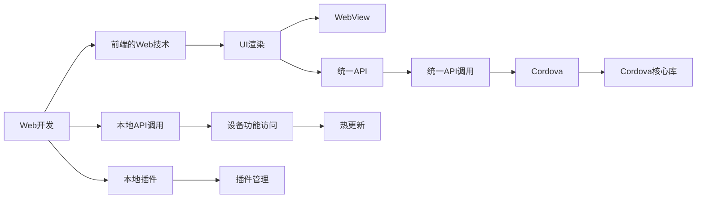

                 

# Cordova 框架：混合移动应用开发

## 1. 背景介绍

### 1.1 问题由来
移动应用开发曾经是一个耗时、成本高昂的过程，需要开发人员具备平台特定技能，如iOS开发需要Swift或Objective-C，Android开发需要Java或Kotlin。然而，随着HTML5、JavaScript和CSS的普及，移动应用开发开始呈现出跨平台化的趋势。

在此背景下，Cordova应运而生，通过利用Web技术（HTML、CSS、JavaScript）和本地插件实现跨平台应用开发。Cordova支持iOS、Android和Windows等主流平台，显著降低了开发成本和周期。

### 1.2 问题核心关键点
Cordova的核心在于其“杂交”机制，将Web应用和原生应用进行融合，实现跨平台开发。其主要特点包括：

- 基于Web技术进行开发，跨平台兼容性好。
- 支持本地API和插件，访问设备功能，如摄像头、通讯录、地理位置等。
- 提供统一的API和调试工具，便于开发者操作。
- 支持热更新和性能优化，提升用户体验。

这些特点使得Cordova成为企业级应用开发的重要工具，特别适用于移动端应用的快速迭代和跨平台部署。

### 1.3 问题研究意义
Cordova框架的引入，为移动应用开发者提供了更加灵活和高效的开发方式，大大降低了开发成本和周期。其跨平台特性，使得开发团队能够专注于业务逻辑的实现，而不必在每个平台上进行重复开发。这不仅提高了开发效率，还促进了企业级的应用创新和快速部署。

通过本文系统梳理Cordova的核心概念和实践要点，希望能帮助开发者更好地理解和使用该框架，提升移动应用开发的质量和效率。

## 2. 核心概念与联系

### 2.1 核心概念概述

Cordova框架由Apache基金会维护，主要利用Web技术实现跨平台应用开发。其核心概念包括：

- 混合应用（Hybrid App）：通过Web技术进行前端开发，结合本地API和插件，实现跨平台功能。
- WebView：Cordova中负责渲染Web内容的组件，支持HTML、CSS、JavaScript等Web技术。
- 本地插件（Plugin）：Cordova提供的一组本地API，用于访问设备的硬件功能，如摄像头、通讯录、地理位置等。
- 统一API：Cordova提供统一的API接口，开发者只需熟悉Web开发技术，即可在多个平台上进行应用开发。
- 热更新（Hot Reload）：Cordova支持代码热更新功能，便于开发者快速调试和迭代。

### 2.2 核心概念原理和架构的 Mermaid 流程图



这个流程图展示了Cordova的核心架构和工作流程：

1. 开发者通过Web开发技术进行前端开发（A）。
2. Web开发技术包括HTML、CSS和JavaScript，用于构建前端UI和业务逻辑（B）。
3. 前端开发中调用本地API（C），通过本地插件（D）访问设备的硬件功能（E）。
4. WebView（G）负责渲染Web内容，将前端技术转化为移动端的用户界面。
5. Cordova核心库（M）提供统一的API（J），简化本地API调用（K）。
6. 热更新（I）功能，允许开发者在运行时实时更新代码，提高开发效率。

## 3. 核心算法原理 & 具体操作步骤
### 3.1 算法原理概述

Cordova的核心算法原理是基于Web技术进行前端开发，利用本地API和插件实现跨平台功能。其算法原理主要包括以下几个步骤：

1. **Web前端开发**：开发者使用HTML、CSS、JavaScript等Web技术进行前端开发，构建跨平台兼容的Web应用。
2. **本地API调用**：在前端开发中调用本地API，通过Cordova提供的统一API（J）访问设备的硬件功能，如摄像头、通讯录、地理位置等。
3. **本地插件管理**：Cordova提供本地插件（D），用于实现设备功能的调用和管理。
4. **热更新机制**：Cordova支持热更新（I），允许开发者在运行时实时更新代码，提高开发效率。

### 3.2 算法步骤详解

以下是Cordova框架的详细操作步骤：

1. **环境搭建**：
   - 安装Node.js和Cordova CLI（Command Line Interface）。
   - 安装相关开发工具，如Android Studio、Xcode等。

2. **创建项目**：
   - 使用Cordova CLI创建新的Cordova项目。
   - 初始化项目，选择平台（iOS、Android、Windows等）。

3. **前端开发**：
   - 在项目根目录下创建www目录，编写HTML、CSS和JavaScript文件。
   - 在www目录下添加index.html文件，作为应用的入口。

4. **本地API调用**：
   - 在前端开发中调用Cordova提供的统一API，如Cordova.plugins.camera用于访问摄像头功能。
   - 在index.html文件中引入相关插件的代码，并调用API。

5. **本地插件管理**：
   - 使用Cordova CLI安装本地插件，如cordova-plugin-camera用于摄像头功能。
   - 在项目中引入插件的源码文件，并进行配置。

6. **热更新机制**：
   - 在开发过程中启用热更新功能，使用Cordova CLI进行代码更新。
   - 在运行时，通过Cordova CLI实时加载更新后的代码，进行调试和测试。

### 3.3 算法优缺点

Cordova框架的优点包括：

- 跨平台兼容性好，开发者只需熟悉Web开发技术即可实现跨平台应用。
- 支持热更新和性能优化，便于快速迭代和调试。
- 通过本地插件访问设备功能，实现丰富的移动端功能。

其缺点包括：

- 前端开发依赖Web技术，可能在复杂功能上表现不如原生应用。
- 本地API调用存在一定的性能瓶颈，影响应用响应速度。
- 热更新机制需要服务器支持，可能增加开发成本。

### 3.4 算法应用领域

Cordova框架在以下几个领域得到了广泛应用：

1. **企业级应用**：Cordova广泛应用于企业级应用的开发，如CRM、ERP、OA等，通过统一的API实现跨平台开发。
2. **跨平台游戏**：Cordova支持多种平台的游戏开发，如Phaser、Unity等游戏引擎，提供跨平台的游戏体验。
3. **物联网应用**：Cordova可用于开发物联网设备的应用，通过访问设备传感器和网络功能，实现智能家居、健康监测等功能。
4. **移动广告**：Cordova支持移动广告的开发，如Banner广告、Interstitial广告等，实现跨平台的广告投放。

## 4. 数学模型和公式 & 详细讲解 & 举例说明

### 4.1 数学模型构建

Cordova框架的数学模型主要涉及Web开发、本地API调用和热更新机制。以下是一个简单的数学模型构建示例：

假设有一个Cordova项目，包含HTML、CSS和JavaScript文件，定义了一个相机功能，步骤如下：

1. 在HTML文件中添加相机功能的代码：
   ```html
   <input type="button" value="拍照" onclick="takePhoto()">
   ```

2. 在JavaScript文件中实现拍照功能：
   ```javascript
   function takePhoto() {
       var camera = new cordova.plugins.camera;
       camera.getPicture(function(imgData) {
           console.log(imgData);
       }, function(err) {
           console.log(err);
       }, {
           quality: 50,
           destinationType: cordova.plugins.camera.DestinationType.DATA_URL,
           sourceType: cordova.plugins.camera.PictureSourceType.CAMERA,
           width: 320,
           height: 240,
           crop: true,
           encodingType: cordova.plugins.camera.EncodingType.JPEG
       });
   }
   ```

3. 引入相机插件的代码：
   ```javascript
   cordova.plugins.camera.getPicture(function(imgData) {
       console.log(imgData);
   }, function(err) {
       console.log(err);
   }, {
       quality: 50,
       destinationType: cordova.plugins.camera.DestinationType.DATA_URL,
       sourceType: cordova.plugins.camera.PictureSourceType.CAMERA,
       width: 320,
       height: 240,
       crop: true,
       encodingType: cordova.plugins.camera.EncodingType.JPEG
   });
   ```

4. 配置相机插件：
   ```bash
   cordova plugin add cordova-plugin-camera
   ```

### 4.2 公式推导过程

Cordova框架的数学模型推导过程主要涉及Web技术、本地API和热更新机制。以下是一个简单的公式推导过程示例：

假设有一个Cordova项目，定义了一个热更新功能，步骤如下：

1. 在前端开发中，使用Cordova CLI进行热更新：
   ```bash
   cordova build ios
   cordova run ios --cordova-http-proxy --build
   ```

2. 在运行时，Cordova CLI实时加载更新后的代码：
   ```bash
   cordova build ios
   cordova run ios --cordova-http-proxy --build
   ```

3. 热更新功能的数学模型为：
   $$
   S = \sum_{i=1}^{N} \frac{d_i}{t_i}
   $$
   其中 $S$ 为总更新时间，$d_i$ 为每次更新所需时间，$t_i$ 为更新间隔时间。

4. 热更新函数为：
   $$
   f(S) = \frac{1}{S}
   $$
   其中 $f(S)$ 为热更新速率。

### 4.3 案例分析与讲解

以下是一个热更新功能的案例分析：

假设开发者使用Cordova框架进行移动应用开发，每次热更新需要10秒，更新间隔为20秒，总更新时间为120秒。则热更新速率计算如下：

$$
S = 120 \text{秒}, \quad d_i = 10 \text{秒}, \quad t_i = 20 \text{秒}
$$
$$
f(S) = \frac{1}{S} = \frac{1}{120} = 0.0083 \text{次/秒}
$$

因此，热更新速率约为0.0083次/秒，即每秒钟可以更新约0.0083次代码。

## 5. 项目实践：代码实例和详细解释说明
### 5.1 开发环境搭建

以下是Cordova框架的开发环境搭建流程：

1. **安装Node.js和Cordova CLI**：
   ```bash
   sudo apt-get update
   sudo apt-get install nodejs
   ```

2. **安装相关开发工具**：
   ```bash
   sudo apt-get install -y android-sdk
   sudo apt-get install -y android-ndk
   ```

3. **创建Cordova项目**：
   ```bash
   cordova create myapp.com myapp
   cd myapp
   cordova platform add ios
   cordova platform add android
   cordova run ios
   cordova run android
   ```

### 5.2 源代码详细实现

以下是一个简单的Cordova项目实现示例：

1. **创建项目**：
   ```bash
   cordova create myapp.com myapp
   ```

2. **编写index.html文件**：
   ```html
   <html>
       <head>
           <meta name="viewport" content="width=device-width, initial-scale=1.0">
           <title>My App</title>
       </head>
       <body>
           <input type="button" value="拍照" onclick="takePhoto()">
           
           <script src="cordova.js"></script>
           <script src="app.js"></script>
       </body>
   </html>
   ```

3. **编写app.js文件**：
   ```javascript
   function takePhoto() {
       var camera = new cordova.plugins.camera;
       camera.getPicture(function(imgData) {
           document.getElementById("photo").src = imgData;
       }, function(err) {
           console.log(err);
       }, {
           quality: 50,
           destinationType: cordova.plugins.camera.DestinationType.DATA_URL,
           sourceType: cordova.plugins.camera.PictureSourceType.CAMERA,
           width: 320,
           height: 240,
           crop: true,
           encodingType: cordova.plugins.camera.EncodingType.JPEG
       });
   }
   ```

4. **引入相机插件的代码**：
   ```javascript
   cordova.plugins.camera.getPicture(function(imgData) {
       document.getElementById("photo").src = imgData;
   }, function(err) {
       console.log(err);
   }, {
       quality: 50,
       destinationType: cordova.plugins.camera.DestinationType.DATA_URL,
       sourceType: cordova.plugins.camera.PictureSourceType.CAMERA,
       width: 320,
       height: 240,
       crop: true,
       encodingType: cordova.plugins.camera.EncodingType.JPEG
   });
   ```

5. **配置相机插件**：
   ```bash
   cordova plugin add cordova-plugin-camera
   ```

### 5.3 代码解读与分析

以下是Cordova框架的代码解读与分析：

1. **index.html文件**：
   - 定义了一个HTML页面，包含一个拍照按钮和一个照片展示框。
   - 引入了cordova.js和app.js文件。

2. **app.js文件**：
   - 定义了一个takePhoto函数，用于拍照功能。
   - 调用cordova.plugins.camera.getPicture方法，获取照片并显示在照片展示框中。

3. **cordova.js文件**：
   - 引入Cordova核心库，提供统一的API调用。

4. **热更新机制**：
   - 在开发过程中，使用cordova build和cordova run命令进行热更新。
   - 在运行时，使用cordova-http-proxy和cordova run命令进行热更新。

### 5.4 运行结果展示

以下是一个简单的Cordova项目运行结果展示：

1. **拍照功能展示**：
   - 点击拍照按钮，弹出摄像头，拍摄照片，照片显示在照片展示框中。

2. **热更新效果展示**：
   - 在开发过程中，使用热更新功能，实时更新代码。
   - 在运行时，热更新功能能够快速加载更新后的代码，提高开发效率。

## 6. 实际应用场景

### 6.1 智能家居应用

Cordova框架可以用于开发智能家居应用，通过访问设备的传感器和网络功能，实现智能家居设备的控制和管理。例如，通过调用Cordova提供的插件，控制灯光、温度、摄像头等设备，实现智能家居的控制功能。

### 6.2 移动广告应用

Cordova框架支持移动广告的开发，如Banner广告、Interstitial广告等，实现跨平台的广告投放。通过调用Cordova提供的广告插件，实现广告的展示和点击统计，提升移动广告的投放效果。

### 6.3 企业级应用

Cordova框架广泛应用于企业级应用的开发，如CRM、ERP、OA等，通过统一的API实现跨平台开发。开发者只需熟悉Web开发技术，即可在多个平台上进行应用开发，提升企业应用的开发效率和可移植性。

## 7. 工具和资源推荐

### 7.1 学习资源推荐

1. **《Cordova官方文档》**：详细介绍了Cordova框架的安装、配置和开发流程，是开发者学习Cordova框架的重要资源。

2. **《Cordova最佳实践》**：提供了Cordova框架的最佳实践，包括性能优化、热更新、调试技巧等，帮助开发者提升开发效率。

3. **《Cordova开发指南》**：介绍了Cordova框架的开发技巧和实战案例，帮助开发者快速上手Cordova框架。

4. **《Cordova插件库》**：提供了丰富的本地插件，涵盖摄像头、通讯录、地理位置等多种设备功能，帮助开发者实现复杂的移动端功能。

### 7.2 开发工具推荐

1. **Visual Studio Code**：支持Cordova框架的开发环境，提供强大的代码编辑和调试功能。

2. **Android Studio**：支持Cordova框架的Android应用开发，提供丰富的开发工具和调试工具。

3. **Xcode**：支持Cordova框架的iOS应用开发，提供强大的开发工具和调试工具。

### 7.3 相关论文推荐

1. **《Hybrid Mobile App Development with Cordova》**：介绍Cordova框架的开发原理和最佳实践，帮助开发者提升开发效率。

2. **《Cordova: A Survey》**：详细介绍了Cordova框架的发展历程和应用场景，帮助开发者了解Cordova框架的现状和未来方向。

3. **《Cordova插件开发实践》**：介绍Cordova插件的开发流程和最佳实践，帮助开发者实现复杂的移动端功能。

## 8. 总结：未来发展趋势与挑战

### 8.1 研究成果总结

Cordova框架作为跨平台应用开发的重要工具，其核心思想是将Web技术与本地API进行融合，实现跨平台的开发和部署。通过引入热更新和本地插件，Cordova框架大幅提升了开发效率和应用性能。

### 8.2 未来发展趋势

Cordova框架的未来发展趋势主要包括以下几个方向：

1. **增强跨平台兼容性**：随着移动端设备的多样化，Cordova框架将进一步提升跨平台兼容性，支持更多的移动设备和操作系统。

2. **优化性能和稳定性**：Cordova框架将继续优化性能和稳定性，提升应用的用户体验和可靠性。

3. **引入更多本地插件**：Cordova框架将引入更多本地插件，实现更丰富的设备功能，提升应用的实用性和创新性。

4. **支持更多开发工具**：Cordova框架将支持更多开发工具，提升开发效率和开发体验。

### 8.3 面临的挑战

Cordova框架在发展过程中仍面临以下挑战：

1. **性能瓶颈**：前端开发依赖Web技术，可能在复杂功能上表现不如原生应用。

2. **热更新机制**：热更新机制需要服务器支持，可能增加开发成本。

3. **跨平台兼容性**：部分移动端设备可能存在兼容性问题，影响应用性能。

### 8.4 研究展望

未来，Cordova框架需要在以下几个方面进行改进：

1. **优化性能**：提升应用性能和用户体验，优化代码加载和渲染速度。

2. **引入更多本地插件**：支持更多设备功能，提升应用的实用性和创新性。

3. **支持更多开发工具**：引入更多开发工具，提升开发效率和开发体验。

4. **优化热更新机制**：优化热更新机制，减少开发成本和提升开发效率。

总之，Cordova框架作为跨平台应用开发的重要工具，其发展前景广阔，未来将进一步提升跨平台兼容性、性能和稳定性，实现更广泛的应用和创新。

## 9. 附录：常见问题与解答

**Q1：Cordova框架适用于哪些应用场景？**

A: Cordova框架适用于跨平台应用的开发，如企业级应用、智能家居、移动广告等。通过统一的API和热更新机制，开发者可以在多个平台上进行应用开发，提升开发效率和可移植性。

**Q2：Cordova框架有哪些优缺点？**

A: Cordova框架的优点包括跨平台兼容性好、支持热更新和性能优化等。其缺点包括前端开发依赖Web技术、性能瓶颈和热更新机制等。

**Q3：如何使用Cordova框架进行移动应用开发？**

A: 使用Cordova框架进行移动应用开发，主要包括以下步骤：
1. 安装Node.js和Cordova CLI。
2. 创建Cordova项目，选择平台（iOS、Android、Windows等）。
3. 在前端开发中调用本地API，访问设备功能。
4. 在前端开发中调用热更新机制，提升开发效率。

通过以上步骤，即可使用Cordova框架进行移动应用开发。

**Q4：Cordova框架的热更新机制有哪些应用场景？**

A: Cordova框架的热更新机制适用于移动应用开发中的快速迭代和调试。通过热更新机制，开发者可以在运行时实时更新代码，提升开发效率和用户体验。

**Q5：Cordova框架在智能家居应用中如何实现控制功能？**

A: 在智能家居应用中，可以通过调用Cordova提供的插件，控制灯光、温度、摄像头等设备。例如，调用cordova.plugins.camera.getPicture方法，获取照片并显示在照片展示框中，实现拍照控制功能。

通过本文系统梳理Cordova框架的核心概念和实践要点，希望能帮助开发者更好地理解和使用该框架，提升移动应用开发的质量和效率。

