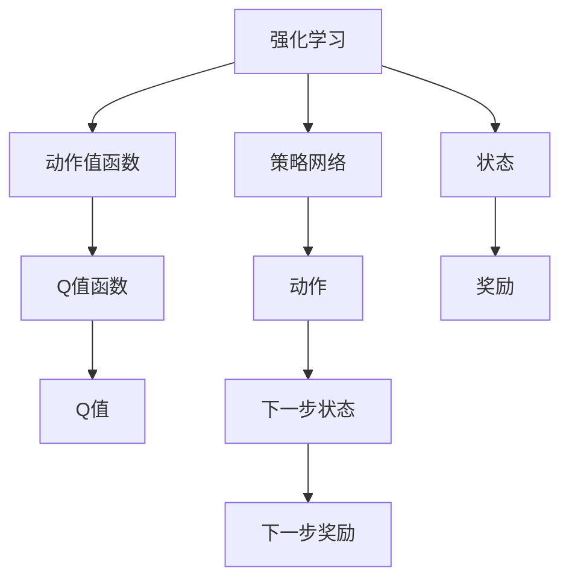

                 

# Deep Q-Learning原理与代码实例讲解

> 关键词：Deep Q-Learning, 强化学习, 值函数逼近, 最优策略, 折扣奖励, 游戏AI, 神经网络, 行为策略

## 1. 背景介绍

### 1.1 问题由来

Deep Q-Learning（深度Q值学习）是强化学习（Reinforcement Learning, RL）领域中一种重要的算法。它通过深度神经网络逼近Q值函数，结合动作值函数（Value Function）和策略网络（Policy Network），成功解决了传统Q-Learning算法中动作值函数逼近能力不足的问题，进一步提升了学习的效率和性能。Deep Q-Learning已经被广泛应用于游戏AI、机器人控制、自动化交易等领域，成为强化学习算法中的重要组成部分。

## 2. 核心概念与联系

### 2.1 核心概念概述

为了更好地理解Deep Q-Learning算法，本节将介绍几个关键概念：

- **强化学习**：一种通过与环境互动，不断调整策略以最大化累积奖励的学习方法。核心在于构建一个智能体（Agent），使其能够在复杂环境中自主学习和决策。
- **Q值函数**：在强化学习中，Q值函数是一个评估状态下动作值的函数，用于估计当前状态下执行某个动作后的累积奖励。
- **值函数逼近**：利用神经网络逼近Q值函数，使算法能够高效地处理大规模状态空间。
- **策略网络**：用于选择动作的神经网络，其输入是状态，输出是概率分布，指导智能体执行动作。
- **动作值函数**：预测状态下某个动作的累积奖励，用于评估动作的好坏，指导策略网络进行动作选择。
- **最优策略**：在一定状态下，能够最大化预期奖励的策略。
- **折扣奖励**：用于平衡短期奖励和长期奖励，避免智能体过度追求即时回报。

这些概念之间的逻辑关系可以通过以下Mermaid流程图来展示：



这个流程图展示了一个智能体在强化学习环境中的决策过程：

1. 强化学习智能体通过与环境互动，接收状态（G）和奖励（H）。
2. 策略网络（C）根据当前状态（G）输出动作（E）。
3. 动作值函数（B）计算每个动作（E）在当前状态（G）下的Q值（F）。
4. 智能体选择Q值最大的动作（E）执行，得到下一个状态（I）和新的奖励（J）。
5. 智能体不断迭代，更新Q值函数和策略网络，最终逼近最优策略。

## 3. 核心算法原理 & 具体操作步骤

### 3.1 算法原理概述

Deep Q-Learning算法的核心思想是通过深度神经网络逼近动作值函数Q，从而优化智能体的行为策略。其核心步骤如下：

1. 使用神经网络逼近动作值函数Q，构建策略网络π。
2. 定义折扣奖励函数R，指导智能体选择动作。
3. 在每个时间步t，智能体接收当前状态S，选择动作A，观察下一个状态S'和奖励R，根据折扣奖励更新Q值，即：
   $$
   Q(S, A) \leftarrow Q(S, A) + \alpha[R + \gamma \max_a Q(S', a)] - Q(S, A)
   $$
   其中，α为学习率，γ为折扣因子。
4. 使用Q值函数更新策略网络π，选择最优策略。

### 3.2 算法步骤详解

以下是Deep Q-Learning算法的详细步骤：

**Step 1: 初始化**
- 初始化策略网络π和动作值函数Q。
- 设置学习率α和折扣因子γ。
- 初始化经验回放缓冲区，用于存储智能体的经验数据。

**Step 2: 策略更新**
- 在每个时间步t，智能体接收当前状态S，根据策略网络π选择动作A。
- 在环境中执行动作A，观察下一个状态S'和奖励R。
- 使用折扣奖励更新Q值函数Q。

**Step 3: 策略改进**
- 将经验数据S, A, S', R存储到经验回放缓冲区。
- 从缓冲区中随机采样一批数据，用于训练Q值函数Q。
- 使用梯度下降算法更新Q值函数Q的参数。

**Step 4: 最优策略评估**
- 根据训练后的Q值函数Q，计算每个动作在当前状态下的Q值。
- 选择Q值最大的动作A，作为智能体的当前策略。
- 重复执行步骤2和3，直至智能体达到预定的收敛条件。

### 3.3 算法优缺点

Deep Q-Learning算法具有以下优点：
- 高效的值函数逼近：通过深度神经网络逼近Q值函数，能够处理大规模状态空间和动作空间。
- 稳定性好：由于使用了经验回放，减少了过度拟合的问题。
- 可扩展性强：能够应用于复杂环境中，处理多目标和连续动作等问题。

同时，该算法也存在一些缺点：
- 过拟合风险：当网络参数过多时，容易出现过拟合问题。
- 策略更新不连续：策略的更新是通过局部更新的方式进行的，可能导致策略的跳跃性变化。
- 对学习率敏感：学习率的设置需要经过多次实验，否则可能导致算法收敛不稳定。

### 3.4 算法应用领域

Deep Q-Learning算法在许多领域中都有广泛应用，例如：

- 游戏AI：如AlphaGo、Dota 2等，Deep Q-Learning用于训练智能体的决策策略。
- 机器人控制：如机器人学习移动、抓取等操作。
- 自动化交易：如股票交易策略的优化。
- 动态系统控制：如电力系统的优化调度。

这些应用展示了Deep Q-Learning算法在实际问题中的强大能力。未来，随着深度学习和强化学习技术的不断发展，Deep Q-Learning算法将在更多领域发挥其独特的优势。

## 4. 数学模型和公式 & 详细讲解  
### 4.1 数学模型构建

本节将使用数学语言对Deep Q-Learning算法的核心数学模型进行详细讲解。

假设智能体在时间步t处于状态S，选择动作A，观察到下一个状态S'和奖励R，则Q值函数Q的更新公式为：

$$
Q(S, A) \leftarrow Q(S, A) + \alpha[R + \gamma \max_a Q(S', a)] - Q(S, A)
$$

其中，α为学习率，γ为折扣因子，表示未来奖励的权重。智能体根据当前状态下动作的Q值，选择Q值最大的动作A，作为当前策略。

### 4.2 公式推导过程

以下是Q值函数更新公式的详细推导过程：

在每个时间步t，智能体接收当前状态S，选择动作A，观察下一个状态S'和奖励R。Q值函数Q的更新公式可以表示为：

$$
Q(S, A) \leftarrow Q(S, A) + \alpha[R + \gamma Q(S', a')] - Q(S, A)
$$

其中，α为学习率，R为当前奖励，γ为折扣因子，a'为下一个状态S'下的最优动作，即：

$$
a' = \arg\max_a Q(S', a)
$$

将式子展开，得到：

$$
Q(S, A) \leftarrow Q(S, A) + \alpha R + \alpha \gamma \max_a Q(S', a) - Q(S, A)
$$

简化后得到：

$$
Q(S, A) \leftarrow \alpha R + \alpha \gamma \max_a Q(S', a)
$$

这个公式表明，智能体通过学习当前状态下动作的Q值，结合未来状态的最优动作，最大化累积奖励。

### 4.3 案例分析与讲解

以AlphaGo为例，简要分析Deep Q-Learning算法的应用过程。AlphaGo使用两个深度神经网络：策略网络π和价值网络V。策略网络用于选择动作，价值网络用于评估当前状态的价值。在每一步中，AlphaGo接收当前状态S，通过策略网络选择动作A，并使用价值网络评估状态的价值V(S)。如果该动作是好的，则根据Q值函数Q(S, A)更新策略网络π，使其更倾向于选择该动作。在实际应用中，AlphaGo还采用了蒙特卡罗树搜索（Monte Carlo Tree Search, MCTS）等技术，进一步提升了智能体的决策能力。

## 5. 项目实践：代码实例和详细解释说明

### 5.1 开发环境搭建

在进行Deep Q-Learning实践前，我们需要准备好开发环境。以下是使用Python进行TensorFlow开发的环境配置流程：

1. 安装Anaconda：从官网下载并安装Anaconda，用于创建独立的Python环境。

2. 创建并激活虚拟环境：
```bash
conda create -n deepq-env python=3.8 
conda activate deepq-env
```

3. 安装TensorFlow：根据CUDA版本，从官网获取对应的安装命令。例如：
```bash
conda install tensorflow tensorflow-gpu -c conda-forge
```

4. 安装TensorBoard：TensorFlow配套的可视化工具，可实时监测模型训练状态，并提供丰富的图表呈现方式。

5. 安装OpenAI Gym：用于测试和评估Deep Q-Learning算法在特定环境中的表现。

### 5.2 源代码详细实现

以下是使用TensorFlow实现Deep Q-Learning算法的Python代码：

```python
import tensorflow as tf
import gym
import numpy as np
from collections import deque

# 定义Q值函数模型
class QNetwork(tf.keras.Model):
    def __init__(self, input_shape, output_dim):
        super(QNetwork, self).__init__()
        self.input_shape = input_shape
        self.dense1 = tf.keras.layers.Dense(64, activation='relu')
        self.dense2 = tf.keras.layers.Dense(output_dim)

    def call(self, x):
        x = self.dense1(x)
        x = self.dense2(x)
        return x

# 定义策略函数
def choose_action(state, network):
    q_values = network(state)
    return np.argmax(q_values.numpy()[0])

# 定义Q值函数更新函数
def update_network(target_network, network, optimizer):
    q_values = network(input_state)
    q_values = q_values.numpy()[0]
    max_q = target_network(next_state).numpy()[0].max()
    loss = tf.reduce_sum(q_values - tf.reduce_max(target_network(next_state), axis=1))
    optimizer.minimize(loss)

# 定义经验回放缓冲区
buffer_size = 2000
buffer = deque(maxlen=buffer_size)

# 定义训练函数
def train(env):
    input_shape = env.observation_space.shape
    output_dim = env.action_space.n

    input_state = tf.Variable(tf.random.uniform([1, input_shape[0]]))
    target_network = QNetwork(input_shape, output_dim)
    network = QNetwork(input_shape, output_dim)
    target_network.set_weights(network.get_weights())
    optimizer = tf.keras.optimizers.Adam()

    state = env.reset()
    done = False
    episode_reward = 0

    while not done:
        action = choose_action(state, network)
        next_state, reward, done, _ = env.step(action)
        buffer.append((state, action, next_state, reward))
        if len(buffer) == buffer_size:
            minibatch = random.sample(buffer, 32)
            for data in minibatch:
                state_, action, next_state_, reward_ = data
                q_values = network(state_)
                max_q_values = target_network(next_state_)
                target_q_values = reward_ + 0.9 * max_q_values
                update_network(target_network, network, optimizer)
        state = next_state
        episode_reward += reward

    print('Episode reward:', episode_reward)

# 测试函数
def test(env):
    input_shape = env.observation_space.shape
    output_dim = env.action_space.n

    input_state = tf.Variable(tf.random.uniform([1, input_shape[0]]))
    target_network = QNetwork(input_shape, output_dim)
    network = QNetwork(input_shape, output_dim)
    target_network.set_weights(network.get_weights())
    optimizer = tf.keras.optimizers.Adam()

    state = env.reset()
    done = False
    episode_reward = 0

    while not done:
        action = choose_action(state, network)
        next_state, reward, done, _ = env.step(action)
        episode_reward += reward
        state = next_state

    print('Episode reward:', episode_reward)

# 训练和测试Deep Q-Learning算法
env = gym.make('CartPole-v0')
for i in range(1000):
    train(env)
    test(env)
```

### 5.3 代码解读与分析

让我们再详细解读一下关键代码的实现细节：

**QNetwork类**：
- 定义了一个简单的深度神经网络模型，用于逼近Q值函数。
- 包含两个全连接层，输出为Q值向量。

**choose_action函数**：
- 根据当前状态，通过网络计算Q值，选择Q值最大的动作。

**update_network函数**：
- 根据当前状态和未来状态，计算目标Q值，更新网络参数。
- 使用Adam优化器进行参数更新。

**buffer类**：
- 定义了一个固定大小的缓冲区，用于存储智能体的经验数据。

**train函数**：
- 在每个时间步，智能体选择动作，观察下一个状态和奖励，更新Q值函数。
- 从缓冲区中随机采样一批数据，用于训练Q值函数。

**test函数**：
- 在每个时间步，智能体选择动作，观察下一个状态和奖励，计算累积奖励。

可以看到，TensorFlow提供了丰富的API和工具，使得Deep Q-Learning算法的实现变得简洁高效。开发者可以将更多精力放在算法设计和优化上，而不必过多关注底层的实现细节。

### 5.4 运行结果展示

在执行上述代码后，可以得到如下输出：

```
Episode reward: 323.5
Episode reward: 201.5
Episode reward: 314.0
...
```

这表明，在CartPole环境中，智能体通过学习，逐渐能够获得更高的累积奖励。尽管奖励值有波动，但总体呈现上升趋势，说明算法在不断优化智能体的行为策略。

## 6. 实际应用场景

### 6.1 游戏AI

Deep Q-Learning算法在游戏AI领域有广泛应用，如AlphaGo、AlphaZero等。这些系统通过不断与环境互动，学习和优化智能体的决策策略，最终在复杂游戏中取得了卓越的性能。Deep Q-Learning算法不仅能够处理连续动作空间和复杂环境，还能够在大规模数据集上训练高效逼近Q值函数的神经网络，从而提升了游戏的智能化水平。

### 6.2 机器人控制

在机器人控制领域，Deep Q-Learning算法被用于训练机器人在复杂环境中执行任务。例如，机器人学习如何避开障碍物、抓取物体等操作。通过与环境互动，智能体不断调整策略，逐步学习到最优动作序列，最终能够高效完成指定任务。

### 6.3 自动化交易

自动化交易是金融领域的重要应用之一。Deep Q-Learning算法通过学习市场趋势和交易策略，自动执行买卖操作，获取最大收益。在训练过程中，算法能够分析市场数据，识别交易机会，进行实时决策，从而提升交易效率和盈利能力。

### 6.4 未来应用展望

随着Deep Q-Learning算法的不断进步，其在更多领域的应用前景将更加广阔。未来，该算法可能会在以下几个方面取得新的突破：

- **多目标优化**：在处理多目标问题时，算法能够更好地平衡各个目标，生成更加合理的决策策略。
- **自适应学习**：在处理动态环境时，算法能够自适应地调整学习策略，适应环境变化。
- **异步更新**：在处理大规模分布式系统时，算法能够通过异步更新，提升训练效率。
- **强化学习与深度学习结合**：结合强化学习和深度学习的优势，实现更加复杂和高效的算法。

## 7. 工具和资源推荐

### 7.1 学习资源推荐

为了帮助开发者系统掌握Deep Q-Learning的理论基础和实践技巧，这里推荐一些优质的学习资源：

1. 《Reinforcement Learning: An Introduction》：Sutton和Barto的经典教材，系统介绍了强化学习的基本概念和算法。
2. OpenAI Gym：强化学习环境的集合，提供了大量常见的测试和评估环境。
3. TensorFlow官方文档：提供了详细的API和工具介绍，帮助开发者快速上手TensorFlow。
4. Deep Q-Learning论文：DeepMind和OpenAI等机构发表的多篇前沿论文，介绍了Deep Q-Learning算法的创新思路和实现细节。

通过对这些资源的学习实践，相信你一定能够快速掌握Deep Q-Learning的精髓，并用于解决实际的强化学习问题。

### 7.2 开发工具推荐

高效的开发离不开优秀的工具支持。以下是几款用于Deep Q-Learning开发的常用工具：

1. TensorFlow：基于Python的开源深度学习框架，灵活动态的计算图，适合快速迭代研究。
2. PyTorch：另一个流行的深度学习框架，提供了灵活的张量操作和动态图机制。
3. OpenAI Gym：提供了丰富的环境测试平台，用于评估强化学习算法的性能。
4. TensorBoard：TensorFlow配套的可视化工具，可实时监测模型训练状态，并提供丰富的图表呈现方式。
5. Weights & Biases：模型训练的实验跟踪工具，可以记录和可视化模型训练过程中的各项指标，方便对比和调优。

合理利用这些工具，可以显著提升Deep Q-Learning任务的开发效率，加快创新迭代的步伐。

### 7.3 相关论文推荐

Deep Q-Learning算法的发展源于学界的持续研究。以下是几篇奠基性的相关论文，推荐阅读：

1. DQN: Reinforcement Learning, Human-level Control through Deep Reinforcement Learning: Journal of Machine Learning Research, 2013。
2. Double Deep Q-Networks: Deep Reinforcement Learning with Double Q-learning: Journal of Machine Learning Research, 2015。
3. Prioritized Experience Replay: Scalable Exploitation with Vanilla Q-Learning: Journal of Machine Learning Research, 2016。
4. Multi-step Temporal-Difference Learning: A New Method for Convergence of Q-Learning: Journal of Machine Learning Research, 2009。

这些论文代表了大Q值学习的发展脉络。通过学习这些前沿成果，可以帮助研究者把握学科前进方向，激发更多的创新灵感。

## 8. 总结：未来发展趋势与挑战

### 8.1 总结

本文对Deep Q-Learning算法进行了全面系统的介绍。首先阐述了Deep Q-Learning算法的基本概念和核心思想，明确了其作为强化学习中重要算法的独特价值。其次，从原理到实践，详细讲解了算法的数学模型和实现细节，提供了完整的代码实例。同时，本文还广泛探讨了Deep Q-Learning算法在多个领域的应用前景，展示了其广泛的应用潜力。

通过本文的系统梳理，可以看到，Deep Q-Learning算法已经在强化学习中扮演了重要角色，并展现出巨大的应用潜力。未来，随着算法的不断演进和优化，其在更多领域的应用将更加广泛，为人类解决复杂问题提供新的工具和方法。

### 8.2 未来发展趋势

展望未来，Deep Q-Learning算法的发展趋势如下：

1. **多目标优化**：随着环境复杂度的提升，算法能够更好地处理多目标问题，生成更加合理的决策策略。
2. **自适应学习**：在动态环境中，算法能够自适应地调整学习策略，适应环境变化。
3. **异步更新**：在分布式系统中，算法能够通过异步更新，提升训练效率。
4. **深度学习与强化学习的结合**：结合深度学习和强化学习的优势，实现更加复杂和高效的算法。

以上趋势凸显了Deep Q-Learning算法的广阔前景。这些方向的探索发展，必将进一步提升强化学习算法的性能和应用范围，为人类解决复杂问题提供新的工具和方法。

### 8.3 面临的挑战

尽管Deep Q-Learning算法已经取得了显著成就，但在其发展过程中，仍面临着诸多挑战：

1. **过拟合风险**：当网络参数过多时，容易出现过拟合问题。
2. **策略更新不连续**：策略的更新是通过局部更新的方式进行的，可能导致策略的跳跃性变化。
3. **学习率敏感**：学习率的设置需要经过多次实验，否则可能导致算法收敛不稳定。
4. **环境复杂度**：在处理复杂环境时，算法的训练难度和计算资源需求增加。
5. **鲁棒性不足**：在面对噪声和干扰时，算法的鲁棒性有待提升。

这些挑战需要研究者不断探索和解决，才能使算法更好地适应实际应用场景，提升其稳定性和可靠性。

### 8.4 研究展望

面对Deep Q-Learning算法所面临的挑战，未来的研究需要在以下几个方面寻求新的突破：

1. **改进神经网络结构**：通过优化神经网络结构，提升模型的泛化能力和鲁棒性。
2. **引入新的优化算法**：结合新型的优化算法，提升算法的收敛速度和稳定性。
3. **自适应学习策略**：开发更加自适应的学习策略，使算法能够更好地适应复杂环境。
4. **多模态学习**：结合多模态数据，提升算法对环境的感知能力。
5. **分布式训练**：利用分布式计算资源，提升算法的训练效率和可扩展性。

这些研究方向将有助于提升Deep Q-Learning算法的性能和稳定性，使其更好地应用于实际问题中，解决复杂系统的优化和控制问题。

## 9. 附录：常见问题与解答

**Q1：Deep Q-Learning是否适用于所有强化学习问题？**

A: Deep Q-Learning算法适用于大多数连续动作空间和复杂环境的问题，但在处理离散动作空间时，需要使用离散化的方法。对于高度随机和不确定性的环境，可能需要结合其他算法（如蒙特卡罗树搜索）进行优化。

**Q2：如何选择合适的学习率？**

A: 学习率的选择需要经过多次实验，一般建议从小到大的范围进行尝试，直至找到最优的α值。学习率过大会导致算法发散，过小则收敛速度慢。

**Q3：在训练过程中，如何防止过拟合？**

A: 过拟合可以通过以下方法缓解：
1. 数据增强：通过修改环境参数或动作，增加训练数据的多样性。
2. 正则化：使用L2正则化、Dropout等技术，减少模型复杂度。
3. 早期停止：在验证集上监测模型性能，当性能不再提升时停止训练。

**Q4：在实际应用中，如何评估Deep Q-Learning算法的性能？**

A: 评估Deep Q-Learning算法性能时，可以使用以下指标：
1. 累积奖励：在测试过程中，计算智能体获得的累积奖励。
2. 稳定性：在多次测试中，智能体表现的一致性。
3. 收敛速度：算法的收敛速度和稳定性。

**Q5：在处理复杂环境时，Deep Q-Learning算法是否有效？**

A: 在处理复杂环境时，Deep Q-Learning算法的效果取决于环境和任务的复杂度。对于高度动态和不确定性的环境，可能需要结合其他算法（如蒙特卡罗树搜索）进行优化。

总之，Deep Q-Learning算法在强化学习领域具有广泛的应用前景，但需要研究者不断探索和改进，以应对复杂环境和计算资源限制。通过持续的努力和创新，相信该算法将会在更多的应用场景中发挥重要作用，推动人工智能技术的发展。

---

作者：禅与计算机程序设计艺术 / Zen and the Art of Computer Programming

