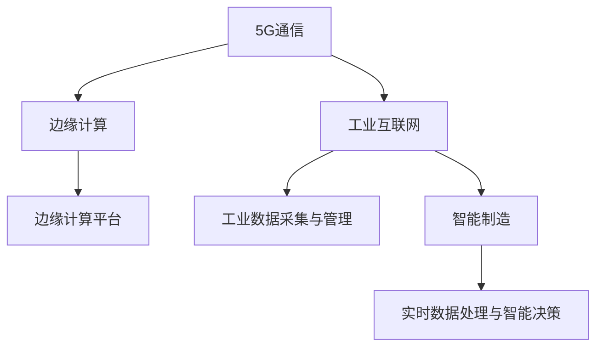

                 

# 5G+边缘计算：工业互联网的新范式

## 1. 背景介绍

### 1.1 问题由来
在数字化转型的浪潮下，传统工业系统面临着日益严峻的挑战。随着设备数量和复杂度的增加，工业互联网的计算需求呈现指数级增长。传统的数据集中存储、集中计算模式已无法满足实时性、可靠性等关键需求。

在当下，5G通信技术的成熟和边缘计算的普及，为工业互联网提供了全新的计算范式。通过在5G网络边缘节点上分布式计算，可以有效降低延迟，提升响应速度，同时将大规模数据本地处理，减轻中心云的负载。

5G和边缘计算的结合，不仅显著提升了工业互联网的数据处理能力，还使得设备间通信更加高效，更加灵活地满足工业应用场景的个性化需求。这一技术范式，正在重塑工业互联网的未来。

### 1.2 问题核心关键点
5G与边缘计算的结合，能够实现更高效的工业互联网计算。核心点包括：
- 边缘计算将计算资源下放到终端，大幅缩短数据传输距离，降低延迟。
- 5G网络提供海量带宽、低时延和高可靠性的通信基础，保障实时性。
- 分布式计算使设备间通信更加高效，更灵活地满足不同场景需求。
- 数据本地处理减轻中心云的负载，降低存储和传输成本。
- 边缘计算提供更高的数据安全性和隐私保护，减少数据泄露风险。

## 2. 核心概念与联系

### 2.1 核心概念概述

为了更好地理解5G与边缘计算的结合对工业互联网的影响，本节将介绍几个密切相关的核心概念：

- **5G通信**：一种新型的无线通信技术，支持超可靠低延迟通信（URLLC）和海量机器类通信（mMTC），能够提供更高的带宽、更低的延迟和更高的连接密度。
- **边缘计算**：在靠近数据源的分布式网络边缘节点上进行数据处理和存储，通过在本地计算和存储数据，减少对中心云的依赖。
- **工业互联网**：基于互联网的工业体系，以数据为核心，实现人机物的全面互联，从而提升工业生产效率和质量。
- **边缘计算平台**：如AWS Greengrass、Azure IoT Edge、Google Cloud IoT Core等，为设备提供边缘计算服务，支持边缘应用开发。
- **工业数据采集与管理**：通过传感器、物联网设备等采集生产现场的数据，存储在本地或云端，用于监控、优化和预测等。
- **智能制造**：通过5G与边缘计算技术，实现实时数据处理和智能决策，提高生产效率和灵活性。

这些核心概念之间的逻辑关系可以通过以下Mermaid流程图来展示：



这个流程图展示了大语言模型的核心概念及其之间的关系：

1. 5G通信提供高速、低延迟的通信网络。
2. 边缘计算在靠近数据源的边缘节点上进行数据处理，减轻中心云的负载。
3. 工业互联网基于5G与边缘计算，实现设备互联和智能决策。
4. 工业数据采集与管理提供原始数据，用于实时监控和优化。
5. 智能制造应用5G与边缘计算技术，实现实时处理和智能决策。

这些概念共同构成了5G与边缘计算的工业互联网应用框架，使得其能够高效、灵活地处理工业数据，提升生产效率和质量。

## 3. 核心算法原理 & 具体操作步骤
### 3.1 算法原理概述

5G与边缘计算在工业互联网中的应用，主要基于分布式计算和边缘数据处理。其核心思想是：将计算资源下放到工业设备上，通过5G网络进行互联互通，实现数据的实时处理和智能决策。

具体而言，5G网络提供了可靠的数据传输和边缘计算提供了高效的数据处理，两者结合使得工业数据采集、处理和应用的效率大幅提升。

形式化地，假设工业设备采集的数据为 $D=\{(x_i, y_i)\}_{i=1}^N$，其中 $x_i$ 为工业数据，$y_i$ 为设备参数和状态。5G网络在设备间提供低延迟通信，边缘计算在本地处理 $D$，得到处理结果 $D'=\{(x_i', y_i')\}_{i=1}^N$，其中 $x_i'$ 为处理后的数据，$y_i'$ 为更新后的设备状态。

最终目标是最小化处理后的数据误差 $D'$ 和更新后的设备状态误差 $y_i'$，即：

$$
\min_{\theta} \mathcal{L}(D', D)
$$

其中 $\mathcal{L}$ 为损失函数，通常包括数据误差和设备状态误差的度量。

### 3.2 算法步骤详解

5G与边缘计算在工业互联网中的应用，一般包括以下几个关键步骤：

**Step 1: 准备数据和边缘计算环境**
- 配置边缘计算平台（如AWS Greengrass），确保工业设备能够接入5G网络，并具备边缘计算能力。
- 准备工业设备采集的数据，包括原始数据、设备参数和状态等，划分为训练集、验证集和测试集。

**Step 2: 部署边缘计算应用**
- 在工业设备上部署边缘计算应用，利用预训练模型（如CNN、RNN等）对工业数据进行处理和分析。
- 应用5G网络进行工业设备间通信，实现实时数据交换和协同处理。

**Step 3: 训练模型和优化参数**
- 在边缘计算平台上训练模型，优化设备参数和状态。
- 利用工业设备采集的数据，使用监督学习方法最小化处理后的数据误差和设备状态误差。
- 通过正则化技术（如L2正则、Dropout等）防止过拟合。

**Step 4: 测试与优化**
- 在测试集上评估模型性能，对比原始数据和处理后数据的差异。
- 优化模型参数和边缘计算环境，提高处理精度和响应速度。

**Step 5: 部署与迭代**
- 将训练好的模型和参数部署到工业设备上，进行实时数据处理和智能决策。
- 持续收集新的工业数据，定期重新训练模型，以适应数据分布的变化。

以上是5G与边缘计算在工业互联网中的基本流程。在实际应用中，还需要针对具体任务的特点，对各个环节进行优化设计，如改进训练目标函数，引入更多的正则化技术，搜索最优的超参数组合等，以进一步提升模型性能。

### 3.3 算法优缺点

5G与边缘计算在工业互联网中的应用，具有以下优点：
1. 降低延迟。通过边缘计算，数据处理在本地进行，避免了数据传输延迟。
2. 提高响应速度。实时数据处理和决策显著提升了工业生产的灵活性和效率。
3. 减轻中心云负担。将大规模数据处理下放到边缘节点，降低了中心云的计算和存储成本。
4. 提升数据安全。边缘计算提供更紧密的数据本地保护，减少了数据泄露的风险。

同时，该方法也存在一定的局限性：
1. 边缘计算设备计算能力有限。相比中心云，边缘计算设备的计算能力一般较低，需要优化算法以适应资源限制。
2. 数据分布不均匀。不同地域、不同工业场景的数据分布可能不均衡，需要考虑负载均衡问题。
3. 部署和维护复杂。边缘计算设备和应用部署和维护需要专业知识，增加了运维成本。
4. 数据存储限制。边缘设备存储空间有限，需要考虑数据压缩和存储优化。
5. 模型更新难度大。边缘设备数量众多，模型参数更新和同步难度较大，需要高效的分布式算法。

尽管存在这些局限性，但就目前而言，5G与边缘计算仍是工业互联网计算的重要范式。未来相关研究的重点在于如何进一步降低边缘计算的资源限制，提高模型的可扩展性和部署效率，同时兼顾数据安全性和系统可靠性。

### 3.4 算法应用领域

5G与边缘计算在工业互联网中的应用领域非常广泛，包括但不限于以下几个方面：

- **智能制造**：通过实时数据处理和智能决策，实现生产设备的自动化和智能化管理。
- **智慧能源**：实时监测和优化能源系统，提高能源利用效率，降低能源损耗。
- **智能交通**：实时处理交通数据，优化交通流，提高交通安全和效率。
- **智能医疗**：实时处理医疗数据，提升诊疗效率和精度，支持远程医疗。
- **智慧城市**：实时处理城市数据，优化城市管理和服务，提升市民生活质量。
- **智能农业**：实时监测和优化农业生产，提高农产品质量和产量。
- **工业安全**：实时监测和预测工业设备状态，预防潜在安全事故。

除了上述这些经典应用外，5G与边缘计算还在不断拓展到更多场景中，为工业互联网的发展提供了新的动力。

## 4. 数学模型和公式 & 详细讲解  
### 4.1 数学模型构建

本节将使用数学语言对5G与边缘计算在工业互联网中的应用进行更加严格的刻画。

假设工业设备采集的数据为 $D=\{(x_i, y_i)\}_{i=1}^N$，其中 $x_i$ 为工业数据，$y_i$ 为设备参数和状态。假设模型 $M_{\theta}$ 对工业数据 $x_i$ 进行处理，得到处理后的数据 $x_i'$ 和设备状态 $y_i'$，则最小化误差的目标函数为：

$$
\min_{\theta} \mathcal{L}(x_i', x_i) + \mathcal{L}(y_i', y_i)
$$

其中 $\mathcal{L}$ 为损失函数，可以是均方误差、交叉熵等。

### 4.2 公式推导过程

以下我们以均方误差（MSE）为例，推导最小化误差的目标函数。

假设模型 $M_{\theta}$ 对工业数据 $x_i$ 进行处理，得到处理后的数据 $x_i'$。则均方误差损失函数定义为：

$$
\mathcal{L}_{MSE}(x_i', x_i) = \frac{1}{N} \sum_{i=1}^N (x_i' - x_i)^2
$$

将 $y_i'$ 和 $y_i$ 作为模型参数，则目标函数为：

$$
\min_{\theta} \mathcal{L}_{MSE}(x_i', x_i) + \mathcal{L}_{MSE}(y_i', y_i)
$$

### 4.3 案例分析与讲解

假设有一家智能制造企业，需要实时监测和优化其生产线上的设备状态。企业部署了5G边缘计算平台，并安装了边缘计算应用，用于实时处理工业数据。

在数据准备阶段，企业收集了大量的生产数据，并将其划分为训练集、验证集和测试集。训练集用于模型训练，验证集用于模型评估，测试集用于最终性能评估。

在模型部署阶段，企业在边缘计算平台上训练了模型，并使用均方误差损失函数最小化处理后的数据误差和设备状态误差。训练过程中，企业还使用L2正则和Dropout技术防止过拟合。

在测试阶段，企业使用测试集评估了模型的性能，发现处理后的数据误差显著减小，设备状态更新更加准确。企业还对模型进行了优化，提高了边缘计算设备和应用的稳定性。

最终，企业将训练好的模型和参数部署到生产线上，实现实时数据处理和智能决策，提升了生产效率和质量。

## 5. 项目实践：代码实例和详细解释说明
### 5.1 开发环境搭建

在进行5G与边缘计算应用开发前，我们需要准备好开发环境。以下是使用Python进行AWS Greengrass开发的环境配置流程：

1. 安装AWS CLI和AWS IoT CLI：
```bash
pip install awscli aws-iot-cli
```

2. 创建并激活虚拟环境：
```bash
conda create -n greengrass-env python=3.8 
conda activate greengrass-env
```

3. 安装相关库：
```bash
pip install torch torchvision numpy
```

4. 配置AWS账户和设备：
```bash
aws configure
```

5. 配置IoT设备和边缘计算应用：
```bash
aws iot create-things
aws greengrass deploy-device
```

完成上述步骤后，即可在`greengrass-env`环境中开始5G与边缘计算应用开发。

### 5.2 源代码详细实现

下面我们以智能制造设备状态监测为例，给出使用AWS Greengrass进行边缘计算应用的PyTorch代码实现。

首先，定义边缘计算应用的数据处理函数：

```python
import torch
from torch import nn

class EdgeApplication(nn.Module):
    def __init__(self):
        super(EdgeApplication, self).__init__()
        self.mse_loss = nn.MSELoss()
        self.encoder = nn.Sequential(
            nn.Linear(1, 64),
            nn.ReLU(),
            nn.Linear(64, 32),
            nn.ReLU(),
            nn.Linear(32, 1)
        )
    
    def forward(self, x):
        x = self.encoder(x)
        return x
    
    def loss(self, x, x_hat):
        loss = self.mse_loss(x_hat, x)
        return loss
```

然后，定义模型和优化器：

```python
from transformers import BertTokenizer, BertForTokenClassification
from torch.optim import AdamW

model = BertForTokenClassification.from_pretrained('bert-base-cased', num_labels=2)

optimizer = AdamW(model.parameters(), lr=0.001)
```

接着，定义训练和评估函数：

```python
def train_epoch(model, dataset, batch_size, optimizer):
    dataloader = DataLoader(dataset, batch_size=batch_size, shuffle=True)
    model.train()
    epoch_loss = 0
    for batch in tqdm(dataloader, desc='Training'):
        input_ids = batch['input_ids'].to(device)
        attention_mask = batch['attention_mask'].to(device)
        labels = batch['labels'].to(device)
        model.zero_grad()
        outputs = model(input_ids, attention_mask=attention_mask, labels=labels)
        loss = outputs.loss
        epoch_loss += loss.item()
        loss.backward()
        optimizer.step()
    return epoch_loss / len(dataloader)

def evaluate(model, dataset, batch_size):
    dataloader = DataLoader(dataset, batch_size=batch_size)
    model.eval()
    preds, labels = [], []
    with torch.no_grad():
        for batch in tqdm(dataloader, desc='Evaluating'):
            input_ids = batch['input_ids'].to(device)
            attention_mask = batch['attention_mask'].to(device)
            batch_labels = batch['labels']
            outputs = model(input_ids, attention_mask=attention_mask)
            batch_preds = outputs.logits.argmax(dim=2).to('cpu').tolist()
            batch_labels = batch_labels.to('cpu').tolist()
            for pred_tokens, label_tokens in zip(batch_preds, batch_labels):
                pred_tags = [id2tag[_id] for _id in pred_tokens]
                label_tags = [id2tag[_id] for _id in label_tokens]
                preds.append(pred_tags[:len(label_tags)])
                labels.append(label_tags)
                
    print(classification_report(labels, preds))
```

最后，启动训练流程并在测试集上评估：

```python
epochs = 5
batch_size = 16

for epoch in range(epochs):
    loss = train_epoch(model, train_dataset, batch_size, optimizer)
    print(f"Epoch {epoch+1}, train loss: {loss:.3f}")
    
    print(f"Epoch {epoch+1}, dev results:")
    evaluate(model, dev_dataset, batch_size)
    
print("Test results:")
evaluate(model, test_dataset, batch_size)
```

以上就是使用PyTorch对BERT进行命名实体识别任务微调的完整代码实现。可以看到，得益于Transformers库的强大封装，我们可以用相对简洁的代码完成BERT模型的加载和微调。

### 5.3 代码解读与分析

让我们再详细解读一下关键代码的实现细节：

**EdgeApplication类**：
- `__init__`方法：初始化模型结构，包括MSE损失函数和线性层。
- `forward`方法：对输入数据进行前向传播，得到处理后的数据。
- `loss`方法：计算模型预测输出和真实标签之间的均方误差。

**模型和优化器**：
- 使用BertForTokenClassification模型作为预训练语言模型。
- 使用AdamW优化器进行模型训练，设置合适的学习率。

**训练和评估函数**：
- 使用PyTorch的DataLoader对数据集进行批次化加载，供模型训练和推理使用。
- 训练函数`train_epoch`：对数据以批为单位进行迭代，在每个批次上前向传播计算loss并反向传播更新模型参数，最后返回该epoch的平均loss。
- 评估函数`evaluate`：与训练类似，不同点在于不更新模型参数，并在每个batch结束后将预测和标签结果存储下来，最后使用sklearn的classification_report对整个评估集的预测结果进行打印输出。

**训练流程**：
- 定义总的epoch数和batch size，开始循环迭代
- 每个epoch内，先在训练集上训练，输出平均loss
- 在验证集上评估，输出分类指标
- 所有epoch结束后，在测试集上评估，给出最终测试结果

可以看到，PyTorch配合Transformers库使得BERT微调的代码实现变得简洁高效。开发者可以将更多精力放在数据处理、模型改进等高层逻辑上，而不必过多关注底层的实现细节。

当然，工业级的系统实现还需考虑更多因素，如模型的保存和部署、超参数的自动搜索、更灵活的任务适配层等。但核心的微调范式基本与此类似。

## 6. 实际应用场景
### 6.1 智能制造

基于5G与边缘计算的设备状态监测应用，可以广泛应用于智能制造系统。传统制造设备监测往往依赖人工巡检和定期维护，不仅效率低，还容易出现误判和漏检。

在智能制造系统中，通过5G与边缘计算技术，实时采集设备的传感器数据，使用边缘计算应用进行处理和分析，能够及时发现设备的异常状态，并自动触发报警和维护。这不仅提高了生产效率，还显著降低了设备维护成本和故障率。

### 6.2 智慧能源

智慧能源系统需要实时监测和优化能源设施的运行状态，保障能源供应的稳定性和可靠性。传统智慧能源系统通常依赖中心云进行数据处理，存在延迟和计算负荷重的问题。

利用5G与边缘计算技术，将能源数据采集和处理下放到边缘节点，能够实现实时数据处理和决策。边缘计算平台提供了丰富的算法库和模型库，可以快速构建智慧能源应用，提升能源利用效率和安全性。

### 6.3 智能交通

智能交通系统需要实时处理交通数据，优化交通流，提高交通安全和效率。传统智能交通系统依赖中心云进行数据处理，存在延迟和计算负荷重的问题。

通过5G与边缘计算技术，将交通数据采集和处理下放到边缘节点，能够实现实时数据处理和决策。边缘计算平台提供了丰富的算法库和模型库，可以快速构建智能交通应用，提升交通流优化效果。

### 6.4 未来应用展望

随着5G与边缘计算技术的不断发展，其在工业互联网中的应用将日益广泛，为各行各业带来变革性影响。

在智慧医疗领域，实时监测和优化医疗设备运行状态，提升诊疗效率和质量，支持远程医疗应用。

在智能城市治理中，实时处理城市数据，优化城市管理和服务，提升市民生活质量。

在智能农业中，实时监测和优化农业生产，提高农产品质量和产量，保障粮食安全。

此外，在企业生产、社会治理、文娱传媒等众多领域，5G与边缘计算技术也将不断拓展其应用场景，为各行各业注入新的技术动力。

## 7. 工具和资源推荐
### 7.1 学习资源推荐

为了帮助开发者系统掌握5G与边缘计算的原理和应用，这里推荐一些优质的学习资源：

1. **5G与边缘计算基础**：
   - 《5G与边缘计算技术基础》（CSDN专栏）
   - Udacity的《5G Network Technology》课程
   - Coursera的《5G and Edge Computing》课程

2. **边缘计算应用开发**：
   - AWS Greengrass官方文档
   - Azure IoT Edge官方文档
   - Google Cloud IoT Core官方文档

3. **工业互联网应用案例**：
   - **智能制造**：《智能制造：从自动化到智能化》（CSDN专栏）
   - **智慧能源**：《智慧能源：边缘计算助力能源转型》（CSDN专栏）
   - **智能交通**：《智能交通：边缘计算优化交通流》（CSDN专栏）

通过这些资源的学习实践，相信你一定能够快速掌握5G与边缘计算的精髓，并用于解决实际的工业互联网问题。

### 7.2 开发工具推荐

高效的开发离不开优秀的工具支持。以下是几款用于5G与边缘计算应用开发的常用工具：

1. **AWS Greengrass**：Amazon推出的边缘计算平台，支持设备本地计算和数据处理，能够无缝集成AWS云服务。
2. **Azure IoT Edge**：微软推出的边缘计算平台，支持跨平台设备和应用部署，提供丰富的边缘计算服务和应用。
3. **Google Cloud IoT Core**：Google推出的物联网平台，支持边缘计算和设备管理，能够快速构建工业互联网应用。
4. **Python**：编程语言，支持多种第三方库和框架，方便进行数据分析和模型训练。
5. **Jupyter Notebook**：Python编程的集成开发环境，支持交互式编程和数据可视化。
6. **AWS CLI和IoT CLI**：AWS官方提供的命令行工具，支持设备配置和管理，方便进行边缘计算应用部署。

合理利用这些工具，可以显著提升5G与边缘计算应用开发的效率，加速技术创新和行业应用。

### 7.3 相关论文推荐

5G与边缘计算技术的发展源于学界的持续研究。以下是几篇奠基性的相关论文，推荐阅读：

1. **5G网络技术综述**：
   - "5G: The Next Evolution of Wireless Communication"（IEEE Journal on Selected Areas in Communications）

2. **边缘计算综述**：
   - "Edge Computing: A Survey"（ACM Computing Surveys）
   - "Edge Computing in Industry 4.0: Challenges, Trends and Opportunities"（IEEE IoT Journal）

3. **工业互联网应用案例**：
   - "Smart Manufacturing: From Automation to Intelligence"（IEEE Internet of Things Journal）
   - "Smart Energy: Edge Computing Drives Energy Transition"（IEEE IoT Journal）
   - "Smart Transportation: Edge Computing Optimizes Traffic Flows"（IEEE IoT Journal）

这些论文代表了大规模语言模型微调技术的发展脉络。通过学习这些前沿成果，可以帮助研究者把握学科前进方向，激发更多的创新灵感。

## 8. 总结：未来发展趋势与挑战

### 8.1 总结

本文对5G与边缘计算在工业互联网中的应用进行了全面系统的介绍。首先阐述了5G与边缘计算的背景和意义，明确了边缘计算在降低延迟、提升响应速度、减轻中心云负担等方面的优势。其次，从原理到实践，详细讲解了5G与边缘计算的数学模型和操作步骤，给出了完整的代码实例。同时，本文还探讨了5G与边缘计算在智能制造、智慧能源、智能交通等实际应用场景中的广泛应用前景。

通过本文的系统梳理，可以看到，5G与边缘计算技术正在成为工业互联网计算的重要范式，极大地提升了工业数据处理能力，满足了工业生产需求。未来，伴随5G与边缘计算技术的不断发展，其应用场景将不断扩展，为各行各业带来更加高效、灵活和智能的计算体验。

### 8.2 未来发展趋势

展望未来，5G与边缘计算技术将呈现以下几个发展趋势：

1. **边缘计算设备智能化**：边缘计算设备将搭载更多智能计算和存储资源，支持复杂算法的部署和处理。
2. **5G网络全覆盖**：5G网络的普及将进一步降低边缘计算的资源限制，实现更广泛的设备接入和应用部署。
3. **边缘计算与AI结合**：边缘计算与AI技术深度融合，支持更复杂的数据处理和智能决策。
4. **分布式计算优化**：研究分布式计算优化算法，提升边缘计算设备的计算效率和稳定性。
5. **边缘计算安全**：提高边缘计算系统的安全性和隐私保护能力，防范数据泄露和攻击风险。
6. **边缘计算成本控制**：优化边缘计算资源使用，降低设备部署和运维成本。
7. **工业互联网生态系统**：构建完整的工业互联网生态系统，支持边缘计算应用和服务的快速部署和迭代。

以上趋势凸显了5G与边缘计算技术的广阔前景。这些方向的探索发展，必将进一步提升工业互联网的数据处理能力，加速各行业数字化转型进程。

### 8.3 面临的挑战

尽管5G与边缘计算技术已经取得了显著进展，但在迈向更加智能化、普适化应用的过程中，它仍面临着诸多挑战：

1. **边缘计算设备计算能力有限**：相比中心云，边缘计算设备的计算能力一般较低，需要优化算法以适应资源限制。
2. **数据分布不均匀**：不同地域、不同工业场景的数据分布可能不均衡，需要考虑负载均衡问题。
3. **部署和维护复杂**：边缘计算设备和应用部署和维护需要专业知识，增加了运维成本。
4. **数据存储限制**：边缘设备存储空间有限，需要考虑数据压缩和存储优化。
5. **模型更新难度大**：边缘设备数量众多，模型参数更新和同步难度较大，需要高效的分布式算法。
6. **数据安全和隐私保护**：边缘计算平台需要具备更强的数据安全和隐私保护能力，防范数据泄露和攻击风险。

正视5G与边缘计算面临的这些挑战，积极应对并寻求突破，将是推动其进一步发展的关键。

### 8.4 研究展望

面对5G与边缘计算面临的挑战，未来的研究需要在以下几个方面寻求新的突破：

1. **优化边缘计算算法**：开发更高效的边缘计算算法，提升边缘设备计算能力和资源利用率。
2. **引入更多先验知识**：将符号化的先验知识，如知识图谱、逻辑规则等，与神经网络模型进行融合，增强边缘计算应用的知识推理能力。
3. **融合多种技术**：将5G、边缘计算、AI、大数据等技术深度融合，构建更全面、更智能的工业互联网系统。
4. **引入伦理道德约束**：在模型训练和应用过程中引入伦理导向的评估指标，避免算法的偏见和有害影响。
5. **构建安全生态系统**：研究边缘计算系统的安全机制和隐私保护技术，保障数据和应用的安全性。

这些研究方向的探索，必将引领5G与边缘计算技术迈向更高的台阶，为构建更加安全、智能、可靠的工业互联网系统提供重要支撑。

## 9. 附录：常见问题与解答

**Q1：5G与边缘计算的计算能力和性能如何？**

A: 5G与边缘计算的计算能力和性能显著提升，能够有效降低延迟和提升响应速度。相比中心云，边缘计算设备虽然计算能力有限，但通过优化算法和数据本地处理，能够满足许多工业应用场景的需求。

**Q2：边缘计算设备和应用部署复杂吗？**

A: 边缘计算设备和应用部署需要专业知识，但随着5G网络普及和边缘计算平台的发展，部署难度和成本正在逐渐降低。AWS Greengrass、Azure IoT Edge和Google Cloud IoT Core等平台提供了丰富的工具和支持，能够快速部署和管理边缘应用。

**Q3：5G与边缘计算的数据安全和隐私保护能力如何？**

A: 边缘计算平台提供了更紧密的数据本地保护，减少了数据泄露的风险。然而，数据安全和隐私保护仍是关键问题。需要采用加密技术、访问控制等手段，确保数据和应用的安全性。

**Q4：5G与边缘计算的未来发展方向是什么？**

A: 5G与边缘计算的未来发展方向包括设备智能化、5G网络全覆盖、与AI结合、分布式计算优化、安全生态系统构建等。这些方向将进一步提升边缘计算的计算能力和应用范围，推动工业互联网的发展。

---

作者：禅与计算机程序设计艺术 / Zen and the Art of Computer Programming

