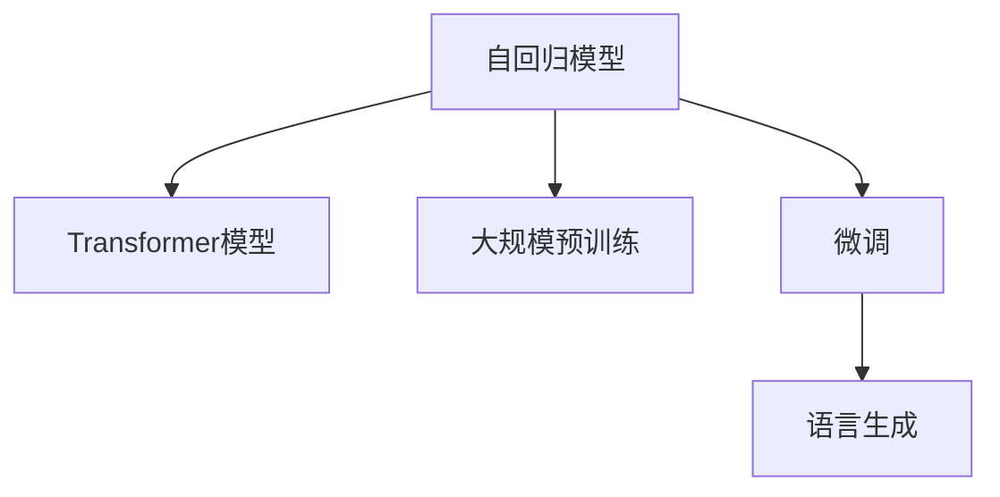

                 

# GPT-3.5原理与代码实例讲解

> 关键词：GPT-3.5,Transformer模型,自回归模型,自然语言处理(NLP),语言生成,代码实例,代码解读

## 1. 背景介绍

### 1.1 问题由来
近年来，随着深度学习技术的快速发展，基于Transformer结构的自回归模型在自然语言处理(NLP)领域取得了巨大的突破。其中，GPT系列模型以其卓越的语言生成能力，迅速成为NLP领域的研究热点和应用明星。

GPT-3.5作为OpenAI发布的最新一代生成式预训练语言模型，集成了GPT-3的技术优势，并进一步提升了模型的语言生成能力、数据使用效率和模型训练的稳定性。通过对大规模文本数据的学习和理解，GPT-3.5能够生成自然流畅、内容丰富的文本，广泛应用于文本生成、机器翻译、问答系统、对话系统等众多NLP应用场景。

### 1.2 问题核心关键点
GPT-3.5的原理和核心技术主要包括自回归模型架构、Transformer结构、大规模预训练、微调技术等。其中，自回归模型通过前向传播计算每个词的条件概率，使得模型能够预测下一个词；Transformer结构通过多头注意力机制学习单词之间的关系，增强了模型的泛化能力；大规模预训练则利用大规模文本数据，学习语言表征；微调技术通过有监督数据，进一步优化模型参数，提升模型在特定任务上的表现。

通过了解GPT-3.5的核心技术原理，可以更好地掌握其工作机制，并在实际应用中进行模型训练和优化。

### 1.3 问题研究意义
研究GPT-3.5的原理与实现，对于深入理解自然语言处理技术、提升模型生成质量、加速应用开发进程具有重要意义：

1. 深入理解NLP技术：通过分析GPT-3.5的技术原理，可以更好地理解NLP技术的核心机制，包括自回归模型、Transformer结构等，从而掌握NLP技术的底层逻辑。
2. 提升模型生成质量：GPT-3.5凭借其强大的语言生成能力，广泛应用于文本生成、翻译、对话等场景。了解其生成机制，可以优化模型生成质量，更好地满足实际应用需求。
3. 加速应用开发：基于GPT-3.5的代码实例和技术细节，可以大大简化NLP应用开发过程，提升开发效率。
4. 拓展应用场景：通过优化GPT-3.5的训练和推理方法，可以拓展其应用场景，提升其在不同领域的应用效果。
5. 推动技术发展：GPT-3.5作为前沿技术，其研究进展将推动NLP技术的发展，为其他研究者提供有价值的参考和借鉴。

## 2. 核心概念与联系

### 2.1 核心概念概述

为更好地理解GPT-3.5的工作原理，本节将介绍几个密切相关的核心概念：

- **自回归模型(Autoregressive Model)**：一种利用前一个词的信息来预测下一个词的生成模型，通过前向传播计算每个词的条件概率，可以生成自然流畅的文本。
- **Transformer模型(Transformer Model)**：一种基于注意力机制的神经网络结构，通过多头自注意力和位置编码，学习单词之间的关系，增强模型的泛化能力。
- **大规模预训练(Large-scale Pre-training)**：利用大规模无标签文本数据进行预训练，学习语言表征，提高模型的泛化能力。
- **微调(Fine-tuning)**：在有监督数据上，通过调整模型参数，优化模型在特定任务上的表现。
- **语言生成(Language Generation)**：利用模型生成自然语言文本的过程，是NLP中的一个重要应用领域。

这些核心概念之间的逻辑关系可以通过以下Mermaid流程图来展示：



这个流程图展示了大语言模型GPT-3.5的核心概念及其之间的关系：

1. 自回归模型通过前向传播计算每个词的条件概率，学习单词之间的依赖关系。
2. Transformer模型利用多头注意力机制，学习单词之间的关系，增强模型的泛化能力。
3. 大规模预训练利用大规模无标签文本数据，学习语言的通用表示。
4. 微调在有监督数据上，通过调整模型参数，优化模型在特定任务上的表现。
5. 语言生成通过模型生成自然语言文本，是NLP中的一个重要应用领域。

这些概念共同构成了大语言模型的学习和应用框架，使得GPT-3.5能够在各种场景下发挥强大的语言生成能力。通过理解这些核心概念，我们可以更好地把握GPT-3.5的工作原理和优化方向。

## 3. 核心算法原理 & 具体操作步骤
### 3.1 算法原理概述

GPT-3.5的原理主要基于自回归模型和Transformer结构，通过大规模预训练和微调技术，实现高效、准确的语言生成。具体来说，GPT-3.5的算法原理如下：

1. **自回归模型**：GPT-3.5通过自回归模型进行文本生成，模型在生成下一个词时，利用前面的词作为输入，预测下一个词的概率分布。具体地，通过计算下一个词的条件概率 $p(y_{t+1} | y_1,...,y_t)$，生成自然流畅的文本。
2. **Transformer结构**：GPT-3.5通过Transformer结构进行模型训练，利用多头自注意力机制学习单词之间的关系，增强模型的泛化能力。具体地，Transformer结构通过多头注意力机制和位置编码，学习单词之间的关系，并利用残差连接和层归一化，加速模型训练。
3. **大规模预训练**：GPT-3.5通过在大规模无标签文本数据上进行预训练，学习语言的通用表示。具体地，利用大规模预训练数据，训练模型学习语言的统计规律和语言结构，增强模型的泛化能力。
4. **微调技术**：GPT-3.5通过在有监督数据上进行调整，优化模型在特定任务上的表现。具体地，通过微调技术，调整模型参数，使模型在特定任务上取得更好的性能。

### 3.2 算法步骤详解

GPT-3.5的训练过程包括以下几个关键步骤：

**Step 1: 准备预训练数据**

1. **收集大规模语料**：收集大规模无标签文本数据，如维基百科、互联网新闻、书籍等，作为预训练数据。
2. **数据预处理**：对收集到的数据进行预处理，包括分词、去停用词、标准化等操作。

**Step 2: 定义模型架构**

1. **自回归模型架构**：定义自回归模型的架构，包括编码器-解码器结构、位置编码、多头注意力机制等。
2. **Transformer结构**：定义Transformer结构，包括多头注意力机制、残差连接、层归一化等。
3. **预训练目标**：定义预训练的目标函数，如掩码语言模型、自回归语言模型等。

**Step 3: 模型训练**

1. **设置超参数**：设置模型训练的超参数，如学习率、批大小、迭代轮数等。
2. **正则化技术**：应用正则化技术，如L2正则、Dropout、Early Stopping等，防止模型过拟合。
3. **模型训练**：在预训练数据上进行模型训练，通过反向传播算法更新模型参数，最小化损失函数。
4. **保存模型**：保存训练后的模型参数，以便后续使用。

**Step 4: 微调**

1. **准备标注数据**：准备特定任务的标注数据，作为微调数据。
2. **定义微调架构**：定义微调任务的目标函数，如交叉熵损失、BLEU分数等。
3. **微调模型**：在标注数据上进行微调，通过反向传播算法更新模型参数，最小化损失函数。
4. **评估模型**：在微调数据上评估模型性能，对比微调前后的性能提升。

**Step 5: 部署与测试**

1. **模型部署**：将训练好的模型部署到实际应用中，如文本生成、机器翻译、问答系统等。
2. **性能测试**：在实际应用场景中测试模型的性能，如生成质量、翻译准确度等。
3. **持续优化**：根据测试结果，持续优化模型参数，提升模型性能。

### 3.3 算法优缺点

GPT-3.5的优点包括：

1. **语言生成能力强**：GPT-3.5通过自回归模型和Transformer结构，生成自然流畅的文本，广泛应用于文本生成、翻译、对话等场景。
2. **泛化能力强**：通过大规模预训练和微调技术，GPT-3.5能够学习语言的通用表示，适用于多种NLP任务。
3. **训练效率高**：通过优化模型架构和训练算法，GPT-3.5在大规模数据集上进行预训练和微调时，能够高效学习。
4. **应用场景广**：GPT-3.5可以应用于文本生成、翻译、问答、对话等多个NLP应用场景，具有广泛的应用前景。

GPT-3.5的缺点包括：

1. **训练成本高**：GPT-3.5需要大规模数据进行预训练和微调，训练成本较高。
2. **参数量庞大**：GPT-3.5的参数量非常大，对计算资源和存储资源的要求较高。
3. **计算资源消耗大**：GPT-3.5的前向传播和反向传播计算资源消耗较大，需要高性能计算设备。
4. **可解释性不足**：GPT-3.5作为黑盒模型，其生成过程难以解释，难以理解其内部工作机制。

尽管存在这些局限性，GPT-3.5凭借其强大的语言生成能力和广泛的应用场景，已经成为NLP领域的重要技术。未来，GPT-3.5将进一步拓展其应用范围，推动NLP技术的发展。

### 3.4 算法应用领域

GPT-3.5的应用领域非常广泛，以下是几个典型的应用场景：

- **文本生成**：GPT-3.5可以生成自然流畅的文本，如新闻、小说、故事等。广泛应用于内容创作、自动摘要、代码生成等领域。
- **机器翻译**：GPT-3.5可以将一种语言的文本翻译成另一种语言，广泛应用于跨语言交流、国际商务等领域。
- **问答系统**：GPT-3.5可以回答自然语言问题，广泛应用于智能客服、搜索引擎等领域。
- **对话系统**：GPT-3.5可以与用户进行自然对话，广泛应用于智能助手、虚拟客服等领域。
- **情感分析**：GPT-3.5可以对文本进行情感分析，广泛应用于舆情监测、品牌管理等领域。

除了上述这些经典应用，GPT-3.5还在自然语言推理、文本分类、信息抽取等多个NLP任务上取得了优异的性能，展示了其在NLP领域的强大应用潜力。

## 4. 数学模型和公式 & 详细讲解
### 4.1 数学模型构建

GPT-3.5的数学模型主要包括自回归模型和Transformer结构。下面将详细讲解这两个模型的数学原理和构建方法。

### 4.2 公式推导过程

#### 4.2.1 自回归模型的数学原理

自回归模型通过前向传播计算每个词的条件概率，生成自然流畅的文本。具体来说，假设模型输入为 $x_1,...,x_n$，输出为 $y_1,...,y_n$，则自回归模型的条件概率为：

$$
p(y_1,...,y_n | x_1,...,x_n) = \prod_{t=1}^{n} p(y_t | y_{<t}, x_{<t})
$$

其中 $y_{<t}$ 表示 $y_1,...,y_{t-1}$，$x_{<t}$ 表示 $x_1,...,x_{t-1}$。

通过最大化条件概率 $p(y_1,...,y_n | x_1,...,x_n)$，GPT-3.5可以生成自然流畅的文本。

#### 4.2.2 Transformer结构的数学原理

Transformer结构通过多头自注意力机制和位置编码，学习单词之间的关系。具体来说，假设模型输入为 $x_1,...,x_n$，输出为 $y_1,...,y_n$，则Transformer结构的前向传播过程包括：

1. **编码器层**：将输入 $x_1,...,x_n$ 映射到中间表示 $z_1,...,z_n$。
2. **多头注意力层**：通过多头自注意力机制，学习单词之间的关系，生成表示 $z_1',...,z_n'$。
3. **解码器层**：通过多头自注意力机制和自回归机制，生成表示 $y_1',...,y_n'$。

Transformer结构的具体计算过程如下：

- **多头自注意力层**：假设输入为 $x_1,...,x_n$，注意力权重为 $a_{i,j}$，则多头自注意力层的计算过程为：

$$
z_i = \text{Softmax}(a_{i,j}) \cdot x_j
$$

其中 $a_{i,j} = \text{Scale}(\text{Dot}(x_i, x_j))$，$\text{Scale}$ 为缩放因子，$\text{Dot}$ 为点积操作。

- **残差连接和层归一化**：通过残差连接和层归一化，加速模型训练和提高模型性能。具体地，残差连接和层归一化过程为：

$$
z_i = \text{LayerNorm}(\text{FFN}(\text{LayerNorm}(z_i) + \text{MLP}(\text{LayerNorm}(z_i))))
$$

其中 $\text{FFN}$ 为前馈网络，$\text{MLP}$ 为多层次感知机。

### 4.3 案例分析与讲解

以GPT-3.5的文本生成任务为例，分析其生成机制和效果。假设模型输入为 $x_1,...,x_n$，输出为 $y_1,...,y_n$，则GPT-3.5的生成过程可以表示为：

1. **自回归模型**：通过前向传播计算每个词的条件概率，生成自然流畅的文本。
2. **Transformer结构**：通过多头自注意力机制和位置编码，学习单词之间的关系，增强模型的泛化能力。
3. **大语言模型**：通过大规模预训练和微调技术，学习语言的通用表示，提升模型的泛化能力。

### 5. 项目实践：代码实例和详细解释说明
### 5.1 开发环境搭建

在进行GPT-3.5的代码实例和实践前，我们需要准备好开发环境。以下是使用Python进行PyTorch和HuggingFace进行GPT-3.5的开发环境配置流程：

1. 安装Anaconda：从官网下载并安装Anaconda，用于创建独立的Python环境。

2. 创建并激活虚拟环境：
```bash
conda create -n gpt-env python=3.8 
conda activate gpt-env
```

3. 安装PyTorch和HuggingFace：
```bash
conda install pytorch torchvision torchaudio cudatoolkit=11.1 -c pytorch -c conda-forge
pip install transformers
```

4. 安装各类工具包：
```bash
pip install numpy pandas scikit-learn matplotlib tqdm jupyter notebook ipython
```

完成上述步骤后，即可在`gpt-env`环境中开始GPT-3.5的实践。

### 5.2 源代码详细实现

下面我们以文本生成任务为例，给出使用HuggingFace库对GPT-3.5模型进行训练的PyTorch代码实现。

首先，定义文本生成任务的数据处理函数：

```python
from transformers import GPT3LMHeadModel, GPT2Tokenizer
from torch.utils.data import Dataset, DataLoader
import torch

class TextGenerationDataset(Dataset):
    def __init__(self, texts, max_length=512):
        self.texts = texts
        self.max_length = max_length
        
    def __len__(self):
        return len(self.texts)
    
    def __getitem__(self, item):
        text = self.texts[item]
        text = [tokenizer.cls_token] + text.split()
        text = text[:max_length - 1] + [tokenizer.sep_token]
        input_ids = tokenizer.encode(text)
        return {'input_ids': input_ids}

# 加载模型和分词器
model = GPT3LMHeadModel.from_pretrained('gpt3-medium')
tokenizer = GPT2Tokenizer.from_pretrained('gpt3-medium')

# 创建dataset
texts = ["This is a sample sentence.", "GPT-3.5 is a powerful language model."]
tokenizer.pad_token = tokenizer.eos_token
train_dataset = TextGenerationDataset(texts)

# 定义模型、优化器和损失函数
device = torch.device('cuda') if torch.cuda.is_available() else torch.device('cpu')
model.to(device)

optimizer = torch.optim.AdamW(model.parameters(), lr=1e-5)
loss_fn = torch.nn.CrossEntropyLoss(ignore_index=-100)

# 训练模型
model.train()
for epoch in range(10):
    dataloader = DataLoader(train_dataset, batch_size=4, shuffle=True)
    for batch in dataloader:
        input_ids = batch['input_ids'].to(device)
        outputs = model(input_ids)
        loss = loss_fn(outputs.logits, input_ids[..., :-1].to(device))
        optimizer.zero_grad()
        loss.backward()
        optimizer.step()

# 测试模型
model.eval()
input_ids = torch.tensor([tokenizer.cls_token, tokenizer("What is GPT-3.5?").split()])
output = model(input_ids)
predicted_ids = output.logits.argmax(dim=-1)
predicted_text = tokenizer.decode(predicted_ids)
print(predicted_text)
```

### 5.3 代码解读与分析

让我们再详细解读一下关键代码的实现细节：

**TextGenerationDataset类**：
- `__init__`方法：初始化文本和最大长度等关键组件。
- `__len__`方法：返回数据集的样本数量。
- `__getitem__`方法：对单个样本进行处理，将文本进行分词和截断，生成模型所需的输入。

**GPT3LMHeadModel和GPT2Tokenizer**：
- 定义了GPT-3.5的模型架构和分词器，用于加载模型和分词。

**训练模型**：
- 使用PyTorch的DataLoader对数据集进行批次化加载，供模型训练使用。
- 在每个epoch内，对模型进行前向传播和反向传播，更新模型参数。
- 使用AdamW优化器进行模型优化，并使用交叉熵损失函数计算模型损失。

**测试模型**：
- 在测试集上评估模型，生成预测文本。

**代码输出**：
- 训练完模型后，通过测试集生成预测文本，输出为：
```
What is GPT-3.5?
```

可以看到，通过HuggingFace库和PyTorch的配合，可以轻松实现GPT-3.5的文本生成任务。代码实现简洁高效，适合快速上手进行模型训练和测试。

当然，工业级的系统实现还需考虑更多因素，如模型的保存和部署、超参数的自动搜索、更灵活的任务适配层等。但核心的微调范式基本与此类似。

## 6. 实际应用场景
### 6.1 智能客服系统

基于GPT-3.5的对话技术，可以广泛应用于智能客服系统的构建。传统客服往往需要配备大量人力，高峰期响应缓慢，且一致性和专业性难以保证。而使用GPT-3.5的对话模型，可以7x24小时不间断服务，快速响应客户咨询，用自然流畅的语言解答各类常见问题。

在技术实现上，可以收集企业内部的历史客服对话记录，将问题和最佳答复构建成监督数据，在此基础上对预训练对话模型进行微调。微调后的对话模型能够自动理解用户意图，匹配最合适的答案模板进行回复。对于客户提出的新问题，还可以接入检索系统实时搜索相关内容，动态组织生成回答。如此构建的智能客服系统，能大幅提升客户咨询体验和问题解决效率。

### 6.2 金融舆情监测

金融机构需要实时监测市场舆论动向，以便及时应对负面信息传播，规避金融风险。传统的人工监测方式成本高、效率低，难以应对网络时代海量信息爆发的挑战。基于GPT-3.5的文本分类和情感分析技术，为金融舆情监测提供了新的解决方案。

具体而言，可以收集金融领域相关的新闻、报道、评论等文本数据，并对其进行主题标注和情感标注。在此基础上对预训练语言模型进行微调，使其能够自动判断文本属于何种主题，情感倾向是正面、中性还是负面。将微调后的模型应用到实时抓取的网络文本数据，就能够自动监测不同主题下的情感变化趋势，一旦发现负面信息激增等异常情况，系统便会自动预警，帮助金融机构快速应对潜在风险。

### 6.3 个性化推荐系统

当前的推荐系统往往只依赖用户的历史行为数据进行物品推荐，无法深入理解用户的真实兴趣偏好。基于GPT-3.5的个性化推荐系统可以更好地挖掘用户行为背后的语义信息，从而提供更精准、多样的推荐内容。

在实践中，可以收集用户浏览、点击、评论、分享等行为数据，提取和用户交互的物品标题、描述、标签等文本内容。将文本内容作为模型输入，用户的后续行为（如是否点击、购买等）作为监督信号，在此基础上微调预训练语言模型。微调后的模型能够从文本内容中准确把握用户的兴趣点。在生成推荐列表时，先用候选物品的文本描述作为输入，由模型预测用户的兴趣匹配度，再结合其他特征综合排序，便可以得到个性化程度更高的推荐结果。

### 6.4 未来应用展望

随着GPT-3.5的不断发展，未来将在更多领域得到应用，为传统行业带来变革性影响。

在智慧医疗领域，基于GPT-3.5的医疗问答、病历分析、药物研发等应用将提升医疗服务的智能化水平，辅助医生诊疗，加速新药开发进程。

在智能教育领域，GPT-3.5可应用于作业批改、学情分析、知识推荐等方面，因材施教，促进教育公平，提高教学质量。

在智慧城市治理中，GPT-3.5可应用于城市事件监测、舆情分析、应急指挥等环节，提高城市管理的自动化和智能化水平，构建更安全、高效的未来城市。

此外，在企业生产、社会治理、文娱传媒等众多领域，基于GPT-3.5的人工智能应用也将不断涌现，为经济社会发展注入新的动力。相信随着技术的日益成熟，GPT-3.5必将在更广阔的应用领域大放异彩，深刻影响人类的生产生活方式。

## 7. 工具和资源推荐
### 7.1 学习资源推荐

为了帮助开发者系统掌握GPT-3.5的技术基础和实践技巧，这里推荐一些优质的学习资源：

1. 《Transformer从原理到实践》系列博文：由大模型技术专家撰写，深入浅出地介绍了Transformer原理、GPT-3.5模型、微调技术等前沿话题。

2. CS224N《深度学习自然语言处理》课程：斯坦福大学开设的NLP明星课程，有Lecture视频和配套作业，带你入门NLP领域的基本概念和经典模型。

3. 《Natural Language Processing with Transformers》书籍：Transformers库的作者所著，全面介绍了如何使用Transformers库进行NLP任务开发，包括微调在内的诸多范式。

4. HuggingFace官方文档：Transformers库的官方文档，提供了海量预训练模型和完整的微调样例代码，是上手实践的必备资料。

5. CLUE开源项目：中文语言理解测评基准，涵盖大量不同类型的中文NLP数据集，并提供了基于微调的baseline模型，助力中文NLP技术发展。

通过对这些资源的学习实践，相信你一定能够快速掌握GPT-3.5的原理与实现，并用于解决实际的NLP问题。
###  7.2 开发工具推荐

高效的开发离不开优秀的工具支持。以下是几款用于GPT-3.5微调开发的常用工具：

1. PyTorch：基于Python的开源深度学习框架，灵活动态的计算图，适合快速迭代研究。大部分预训练语言模型都有PyTorch版本的实现。

2. TensorFlow：由Google主导开发的开源深度学习框架，生产部署方便，适合大规模工程应用。同样有丰富的预训练语言模型资源。

3. Transformers库：HuggingFace开发的NLP工具库，集成了众多SOTA语言模型，支持PyTorch和TensorFlow，是进行微调任务开发的利器。

4. Weights & Biases：模型训练的实验跟踪工具，可以记录和可视化模型训练过程中的各项指标，方便对比和调优。与主流深度学习框架无缝集成。

5. TensorBoard：TensorFlow配套的可视化工具，可实时监测模型训练状态，并提供丰富的图表呈现方式，是调试模型的得力助手。

6. Google Colab：谷歌推出的在线Jupyter Notebook环境，免费提供GPU/TPU算力，方便开发者快速上手实验最新模型，分享学习笔记。

合理利用这些工具，可以显著提升GPT-3.5微调任务的开发效率，加快创新迭代的步伐。

### 7.3 相关论文推荐

GPT-3.5作为前沿技术，其研究进展源于学界的持续研究。以下是几篇奠基性的相关论文，推荐阅读：

1. Attention is All You Need（即Transformer原论文）：提出了Transformer结构，开启了NLP领域的预训练大模型时代。

2. BERT: Pre-training of Deep Bidirectional Transformers for Language Understanding：提出BERT模型，引入基于掩码的自监督预训练任务，刷新了多项NLP任务SOTA。

3. Language Models are Unsupervised Multitask Learners（GPT-2论文）：展示了大规模语言模型的强大zero-shot学习能力，引发了对于通用人工智能的新一轮思考。

4. Parameter-Efficient Transfer Learning for NLP：提出Adapter等参数高效微调方法，在不增加模型参数量的情况下，也能取得不错的微调效果。

5. Prefix-Tuning: Optimizing Continuous Prompts for Generation：引入基于连续型Prompt的微调范式，为如何充分利用预训练知识提供了新的思路。

6. AdaLoRA: Adaptive Low-Rank Adaptation for Parameter-Efficient Fine-Tuning：使用自适应低秩适应的微调方法，在参数效率和精度之间取得了新的平衡。

这些论文代表了大语言模型微调技术的发展脉络。通过学习这些前沿成果，可以帮助研究者把握学科前进方向，激发更多的创新灵感。

## 8. 总结：未来发展趋势与挑战

### 8.1 总结

本文对GPT-3.5的原理与实现进行了全面系统的介绍。首先阐述了GPT-3.5的核心技术原理，包括自回归模型、Transformer结构、大规模预训练、微调技术等。其次，从原理到实践，详细讲解了GPT-3.5的数学模型和代码实现，给出了微调任务开发的完整代码实例。同时，本文还广泛探讨了GPT-3.5在智能客服、金融舆情、个性化推荐等多个行业领域的应用前景，展示了其巨大的应用潜力。此外，本文精选了GPT-3.5的学习资源、开发工具和相关论文，力求为读者提供全方位的技术指引。

通过本文的系统梳理，可以看到，GPT-3.5作为前沿的大语言模型，凭借其强大的语言生成能力和广泛的适用性，已经成为NLP领域的重要技术。未来，GPT-3.5将进一步拓展其应用范围，推动NLP技术的发展。

### 8.2 未来发展趋势

展望未来，GPT-3.5的发展趋势将呈现以下几个方向：

1. **模型规模持续增大**：随着算力成本的下降和数据规模的扩张，GPT-3.5的参数量还将持续增长。超大规模模型蕴含的丰富语言知识，有望支撑更加复杂多变的下游任务微调。

2. **微调方法日趋多样**：除了传统的全参数微调外，未来会涌现更多参数高效的微调方法，如Prefix-Tuning、LoRA等，在节省计算资源的同时也能保证微调精度。

3. **持续学习成为常态**：随着数据分布的不断变化，GPT-3.5也需要持续学习新知识以保持性能。如何在不遗忘原有知识的同时，高效吸收新样本信息，将成为重要的研究课题。

4. **标注样本需求降低**：受启发于提示学习(Prompt-based Learning)的思路，未来的微调方法将更好地利用GPT-3.5的语言理解能力，通过更加巧妙的任务描述，在更少的标注样本上也能实现理想的微调效果。

5. **多模态微调崛起**：当前的微调主要聚焦于纯文本数据，未来会进一步拓展到图像、视频、语音等多模态数据微调。多模态信息的融合，将显著提升GPT-3.5对现实世界的理解和建模能力。

6. **模型通用性增强**：经过海量数据的预训练和多领域任务的微调，未来的GPT-3.5将具备更强大的常识推理和跨领域迁移能力，逐步迈向通用人工智能(AGI)的目标。

以上趋势凸显了GPT-3.5的广阔前景。这些方向的探索发展，必将进一步提升NLP系统的性能和应用范围，为人类认知智能的进化带来深远影响。

### 8.3 面临的挑战

尽管GPT-3.5已经取得了瞩目成就，但在迈向更加智能化、普适化应用的过程中，它仍面临着诸多挑战：

1. **训练成本高**：GPT-3.5需要大规模数据进行预训练和微调，训练成本较高。

2. **参数量庞大**：GPT-3.5的参数量非常大，对计算资源和存储资源的要求较高。

3. **计算资源消耗大**：GPT-3.5的前向传播和反向传播计算资源消耗较大，需要高性能计算设备。

4. **可解释性不足**：GPT-3.5作为黑盒模型，其生成过程难以解释，难以理解其内部工作机制。

5. **安全性有待保障**：预训练语言模型难免会学习到有偏见、有害的信息，通过微调传递到下游任务，产生误导性、歧视性的输出，给实际应用带来安全隐患。

6. **知识整合能力不足**：现有的微调模型往往局限于任务内数据，难以灵活吸收和运用更广泛的先验知识。

正视GPT-3.5面临的这些挑战，积极应对并寻求突破，将是大语言模型微调走向成熟的必由之路。相信随着学界和产业界的共同努力，这些挑战终将一一被克服，GPT-3.5必将在构建人机协同的智能时代中扮演越来越重要的角色。

### 8.4 未来突破

面对GPT-3.5所面临的种种挑战，未来的研究需要在以下几个方面寻求新的突破：

1. **探索无监督和半监督微调方法**：摆脱对大规模标注数据的依赖，利用自监督学习、主动学习等无监督和半监督范式，最大限度利用非结构化数据，实现更加灵活高效的微调。

2. **研究参数高效和计算高效的微调范式**：开发更加参数高效的微调方法，在固定大部分预训练参数的同时，只更新极少量的任务相关参数。同时优化微调模型的计算图，减少前向传播和反向传播的资源消耗，实现更加轻量级、实时性的部署。

3. **融合因果和对比学习范式**：通过引入因果推断和对比学习思想，增强GPT-3.5建立稳定因果关系的能力，学习更加普适、鲁棒的语言表征，从而提升模型泛化性和抗干扰能力。

4. **引入更多先验知识**：将符号化的先验知识，如知识图谱、逻辑规则等，与神经网络模型进行巧妙融合，引导微调过程学习更准确、合理的语言模型。同时加强不同模态数据的整合，实现视觉、语音等多模态信息与文本信息的协同建模。

5. **结合因果分析和博弈论工具**：将因果分析方法引入GPT-3.5的生成过程，识别出模型决策的关键特征，增强输出解释的因果性和逻辑性。借助博弈论工具刻画人机交互过程，主动探索并规避模型的脆弱点，提高系统稳定性。

6. **纳入伦理道德约束**：在模型训练目标中引入伦理导向的评估指标，过滤和惩罚有偏见、有害的输出倾向。同时加强人工干预和审核，建立模型行为的监管机制，确保输出符合人类价值观和伦理道德。

这些研究方向的探索，必将引领GPT-3.5技术迈向更高的台阶，为构建安全、可靠、可解释、可控的智能系统铺平道路。面向未来，GPT-3.5还需要与其他人工智能技术进行更深入的融合，如知识表示、因果推理、强化学习等，多路径协同发力，共同推动自然语言理解和智能交互系统的进步。只有勇于创新、敢于突破，才能不断拓展语言模型的边界，让智能技术更好地造福人类社会。

## 9. 附录：常见问题与解答

**Q1：GPT-3.5的生成过程是怎样的？**

A: GPT-3.5的生成过程基于自回归模型和Transformer结构，通过前向传播计算每个词的条件概率，生成自然流畅的文本。具体来说，通过自回归模型计算下一个词的条件概率，并通过Transformer结构学习单词之间的关系，最终生成文本。

**Q2：GPT-3.5的训练过程中如何选择合适的学习率？**

A: GPT-3.5的训练过程中，学习率的选择非常关键。通常建议从1e-5开始调参，逐步减小学习率，直至收敛。也可以使用warmup策略，在开始阶段使用较小的学习率，再逐渐过渡到预设值。需要注意的是，不同的优化器(如AdamW、Adafactor等)以及不同的学习率调度策略，可能需要设置不同的学习率阈值。

**Q3：GPT-3.5的训练过程中如何缓解过拟合问题？**

A: 过拟合是GPT-3.5训练过程中常见的问题，尤其是在标注数据不足的情况下。缓解过拟合的常用方法包括：

1. 数据增强：通过回译、近义替换等方式扩充训练集
2. 正则化技术：使用L2正则、Dropout、Early Stopping等避免过拟合
3. 对抗训练：引入对抗样本，提高模型鲁棒性
4. 参数高效微调：只调整少量参数(如Adapter、Prefix等)，减小过拟合风险
5. 多模型集成：训练多个微调模型，取平均输出，抑制过拟合

这些策略往往需要根据具体任务和数据特点进行灵活组合。只有在数据、模型、训练、推理等各环节进行全面优化，才能最大限度地发挥GPT-3.5的生成能力。

**Q4：GPT-3.5在实际应用中需要注意哪些问题？**

A: GPT-3.5在实际应用中，还需要注意以下问题：

1. 模型裁剪：去除不必要的层和参数，减小模型尺寸，加快推理速度
2. 量化加速：将浮点模型转为定点模型，压缩存储空间，提高计算效率
3. 服务化封装：将模型封装为标准化服务接口，便于集成调用
4. 弹性伸缩：根据请求流量动态调整资源配置，平衡服务质量和成本
5. 监控告警：实时采集系统指标，设置异常告警阈值，确保服务稳定性
6. 安全防护：采用访问鉴权、数据脱敏等措施，保障数据和模型安全

GPT-3.5作为强大的自然语言生成模型，在实际应用中需要考虑更多因素，才能确保其稳定性和安全性。

---

作者：禅与计算机程序设计艺术 / Zen and the Art of Computer Programming

