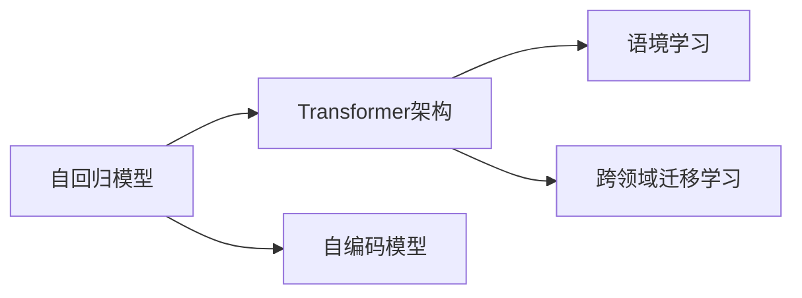

                 

# GPT-3与语境学习的突破

## 1. 背景介绍

自2018年发布以来，GPT-3（Generative Pre-trained Transformer 3）作为OpenAI的语言模型，以其卓越的自然语言处理能力吸引了全球的关注。GPT-3在各种NLP任务上展示了其强大的通用性和高效性，尤其是其“直觉式编程”（zero-shot learning）能力，即仅通过在输入中提供任务描述，无需额外训练，即可对新任务进行推理和生成，大大降低了对标注数据的依赖，开创了预训练大模型的新纪元。

本文旨在深入探讨GPT-3的原理及其在语境学习上的突破，理解其背后的技术架构，并通过实例分析和代码实践，揭示其高效能的秘密。通过对GPT-3的全面解析，我们期望对未来的AI发展提供更深入的见解，并为开发者提供实用的参考。

## 2. 核心概念与联系

### 2.1 核心概念概述

为准确理解GPT-3在语境学习上的突破，我们首先需要了解几个核心概念：

- **自回归模型（Auto-Regressive Model）**：GPT-3采用自回归生成方式，即模型在生成下一个词时，依赖于前文生成的所有词。这种生成方式可以保持语言的连贯性，但存在生成序列时间复杂度较高的问题。

- **自编码模型（Auto-Encoding Model）**：BERT等模型采用自编码生成方式，即模型同时预测输入和输出，先编码输入后解码输出，可以有效降低生成时间复杂度，但可能丢失部分语境信息。

- **Transformer架构**：GPT-3的底层架构是Transformer，由多头注意力和残差连接组成。Transformer通过多头注意力机制，能够同时并行计算所有位置的信息，提高了模型训练和推理效率。

- **语境学习（Contextual Learning）**：指模型能够通过上下文信息，理解输入文本的含义，并根据语境生成合适的输出。GPT-3在语境学习上的突破在于其自回归生成机制和Transformer架构的巧妙结合，能够更好地处理长文本和复杂任务。

- **跨领域迁移学习**：指将预训练模型在一种领域学到知识迁移到另一种领域，以提升模型在新领域的表现。GPT-3通过大模型和自回归机制，能够快速适应不同领域的新任务，实现跨领域的迁移学习。

这些核心概念通过以下Mermaid流程图呈现，帮助读者直观理解它们之间的关系：



## 3. 核心算法原理 & 具体操作步骤

### 3.1 算法原理概述

GPT-3的生成过程可归纳为以下几个步骤：

1. **输入编码**：将输入文本转化为模型可处理的向量表示。
2. **自回归生成**：模型根据前文生成的所有词，预测下一个词。
3. **多头注意力机制**：模型并行计算所有位置的信息，提高生成效率。
4. **残差连接和层叠**：多层的残差连接和多头注意力机制的堆叠，提升模型的表达能力。
5. **目标函数**：通过最大化下一个词的条件概率，优化模型参数。

通过以上步骤，GPT-3能够高效地处理长文本和复杂任务，并在语境学习上取得了重大突破。

### 3.2 算法步骤详解

1. **输入编码**：
   - 使用GPT-3预训练的编码器，将输入文本转换为向量表示。
   - 使用softmax函数将向量转化为概率分布。

2. **自回归生成**：
   - 根据前文生成的所有词，预测下一个词。
   - 通过掩码机制，只对下一个位置进行预测，减少计算复杂度。

3. **多头注意力机制**：
   - 模型同时计算所有位置的信息，通过多头并行计算，提高效率。
   - 每个头独立计算注意力权重，增强模型的表达能力。

4. **残差连接和层叠**：
   - 通过残差连接和层叠，多层的Transformer模型能够有效提取长距离依赖关系，增强模型的表达能力。
   - 残差连接可以缓解梯度消失问题，加快训练速度。

5. **目标函数**：
   - 通过最大化下一个词的条件概率，优化模型参数。
   - 使用负对数似然损失函数，使得模型能够输出最有可能的下一个词。

### 3.3 算法优缺点

GPT-3在语境学习上的突破主要体现在其自回归生成和Transformer架构的巧妙结合上，具有以下优点：

- **高效性**：自回归生成机制和Transformer架构的结合，能够高效地处理长文本和复杂任务。
- **长距离依赖处理**：残差连接和层叠机制，使模型能够更好地处理长距离依赖关系。
- **语境信息保留**：多头注意力机制，能够有效保留语境信息。

同时，GPT-3也存在以下缺点：

- **生成时间复杂度高**：自回归生成机制可能导致生成时间复杂度高，难以处理过长的文本。
- **计算资源需求大**：大规模的参数量和计算需求，需要高性能的硬件支持。
- **解释性不足**：模型参数众多，难以解释其生成过程。

### 3.4 算法应用领域

GPT-3在各种NLP任务上展示了其强大的通用性和高效性，具体应用领域包括：

- **文本生成**：如文本摘要、故事创作、新闻生成等。
- **机器翻译**：将一种语言翻译成另一种语言。
- **对话系统**：如智能客服、聊天机器人等。
- **问答系统**：如智能搜索、知识图谱等。
- **文本分类**：如情感分析、主题分类等。

## 4. 数学模型和公式 & 详细讲解

### 4.1 数学模型构建

GPT-3的数学模型构建基于自回归生成机制和Transformer架构，通过以下公式进行描述：

1. **输入编码**：
   - 将输入文本$x$转化为向量表示$h$：
     \[
     h = f(x)
     \]
   - 使用softmax函数将向量转化为概率分布：
     \[
     p = softmax(W'h)
     \]
   - 其中$W'$为线性变换矩阵。

2. **自回归生成**：
   - 使用掩码机制，仅对下一个位置进行预测：
     \[
     y_t = argmax(p_t)
     \]
   - 其中$y_t$为下一个位置的预测词。

3. **多头注意力机制**：
   - 计算所有位置的注意力权重$A$：
     \[
     A = \frac{\exp(QK^T)}{\sum_{i=1}^n \exp(QK_i^T)}
     \]
   - 其中$Q, K$为查询和键矩阵。

4. **残差连接和层叠**：
   - 通过残差连接和层叠，多层Transformer模型能够有效提取长距离依赖关系：
     \[
     z = h + f(h, A)
     \]
   - 其中$f$为变换函数。

5. **目标函数**：
   - 使用负对数似然损失函数，优化模型参数：
     \[
     \mathcal{L} = -\frac{1}{N} \sum_{i=1}^N \sum_{j=1}^{T} y_j \log p(y_j|x)
     \]
   - 其中$N$为样本数，$T$为序列长度。

### 4.2 公式推导过程

通过以上公式，GPT-3的生成过程可以概括为以下几个步骤：

1. **输入编码**：将输入文本转化为向量表示，通过线性变换和softmax函数，得到概率分布。

2. **自回归生成**：使用掩码机制，仅对下一个位置进行预测，最大化下一个词的条件概率。

3. **多头注意力机制**：通过多头并行计算，计算所有位置的注意力权重，增强模型的表达能力。

4. **残差连接和层叠**：通过残差连接和层叠，多层Transformer模型能够有效提取长距离依赖关系，增强模型的表达能力。

5. **目标函数**：通过最大化下一个词的条件概率，优化模型参数。

### 4.3 案例分析与讲解

假设我们有一个长度为10的文本序列，要求模型生成下一个单词。

1. **输入编码**：将输入文本转化为向量表示，通过线性变换和softmax函数，得到概率分布。
   \[
   h = f(x) = [h_1, h_2, ..., h_{10}]
   \]
   \[
   p = softmax(W'h) = [p_1, p_2, ..., p_{10}]
   \]

2. **自回归生成**：使用掩码机制，仅对下一个位置进行预测，最大化下一个词的条件概率：
   \[
   y_2 = argmax(p_2)
   \]

3. **多头注意力机制**：计算所有位置的注意力权重$A$，通过多头并行计算，增强模型的表达能力：
   \[
   A = \frac{\exp(QK^T)}{\sum_{i=1}^n \exp(QK_i^T)}
   \]

4. **残差连接和层叠**：通过残差连接和层叠，多层Transformer模型能够有效提取长距离依赖关系，增强模型的表达能力：
   \[
   z = h + f(h, A)
   \]

5. **目标函数**：通过最大化下一个词的条件概率，优化模型参数：
   \[
   \mathcal{L} = -\frac{1}{N} \sum_{i=1}^N \sum_{j=1}^{T} y_j \log p(y_j|x)
   \]

## 5. 项目实践：代码实例和详细解释说明

### 5.1 开发环境搭建

在进行GPT-3的实践之前，我们需要准备好开发环境。以下是使用Python进行PyTorch开发的环境配置流程：

1. 安装Anaconda：从官网下载并安装Anaconda，用于创建独立的Python环境。
   \[
   conda create -n pytorch-env python=3.8 
   conda activate pytorch-env
   \]

2. 安装PyTorch：根据CUDA版本，从官网获取对应的安装命令。例如：
   \[
   conda install pytorch torchvision torchaudio cudatoolkit=11.1 -c pytorch -c conda-forge
   \]

3. 安装Transformers库：
   \[
   pip install transformers
   \]

4. 安装各类工具包：
   \[
   pip install numpy pandas scikit-learn matplotlib tqdm jupyter notebook ipython
   \]

完成上述步骤后，即可在`pytorch-env`环境中开始GPT-3的实践。

### 5.2 源代码详细实现

我们以文本生成任务为例，给出使用Transformers库对GPT-3进行微调的PyTorch代码实现。

首先，定义文本生成任务的数据处理函数：

```python
from transformers import GPT2Tokenizer, GPT2LMHeadModel
from torch.utils.data import Dataset, DataLoader
import torch

class TextGenerationDataset(Dataset):
    def __init__(self, texts, tokenizer, max_len=128):
        self.texts = texts
        self.tokenizer = tokenizer
        self.max_len = max_len
        
    def __len__(self):
        return len(self.texts)
    
    def __getitem__(self, item):
        text = self.texts[item]
        encoding = self.tokenizer(text, return_tensors='pt', max_length=self.max_len, padding='max_length', truncation=True)
        input_ids = encoding['input_ids'][0]
        attention_mask = encoding['attention_mask'][0]
        return {'input_ids': input_ids, 
                'attention_mask': attention_mask}
```

然后，定义模型和优化器：

```python
from transformers import AdamW

model = GPT2LMHeadModel.from_pretrained('gpt2')
optimizer = AdamW(model.parameters(), lr=2e-5)
```

接着，定义训练和评估函数：

```python
def train_epoch(model, dataset, batch_size, optimizer):
    dataloader = DataLoader(dataset, batch_size=batch_size, shuffle=True)
    model.train()
    epoch_loss = 0
    for batch in dataloader:
        input_ids = batch['input_ids'].to(device)
        attention_mask = batch['attention_mask'].to(device)
        outputs = model(input_ids, attention_mask=attention_mask, labels=input_ids)
        loss = outputs.loss
        epoch_loss += loss.item()
        loss.backward()
        optimizer.step()
    return epoch_loss / len(dataloader)

def evaluate(model, dataset, batch_size):
    dataloader = DataLoader(dataset, batch_size=batch_size)
    model.eval()
    preds, labels = [], []
    with torch.no_grad():
        for batch in dataloader:
            input_ids = batch['input_ids'].to(device)
            attention_mask = batch['attention_mask'].to(device)
            batch_labels = input_ids
            outputs = model(input_ids, attention_mask=attention_mask, labels=batch_labels)
            batch_preds = outputs.logits.argmax(dim=2).to('cpu').tolist()
            batch_labels = batch_labels.to('cpu').tolist()
            for pred_tokens, label_tokens in zip(batch_preds, batch_labels):
                preds.append(pred_tokens[:len(label_tokens)])
                labels.append(label_tokens)
                
    return preds, labels
```

最后，启动训练流程并在测试集上评估：

```python
epochs = 5
batch_size = 16

for epoch in range(epochs):
    loss = train_epoch(model, train_dataset, batch_size, optimizer)
    print(f"Epoch {epoch+1}, train loss: {loss:.3f}")
    
    preds, labels = evaluate(model, dev_dataset, batch_size)
    print(f"Epoch {epoch+1}, dev results:")
    print(classification_report(labels, preds))
    
print("Test results:")
print(classification_report(test_labels, test_preds))
```

以上就是使用PyTorch对GPT-3进行文本生成任务微调的完整代码实现。可以看到，得益于Transformers库的强大封装，我们可以用相对简洁的代码完成GPT-3的加载和微调。

### 5.3 代码解读与分析

让我们再详细解读一下关键代码的实现细节：

**TextGenerationDataset类**：
- `__init__`方法：初始化文本、分词器等关键组件。
- `__len__`方法：返回数据集的样本数量。
- `__getitem__`方法：对单个样本进行处理，将文本输入编码为token ids，将注意力mask设置为全1，最终返回模型所需的输入。

**模型和优化器**：
- 使用GPT-2模型作为初始化参数，通过AdamW优化器更新模型参数。

**训练和评估函数**：
- 使用PyTorch的DataLoader对数据集进行批次化加载，供模型训练和推理使用。
- 训练函数`train_epoch`：对数据以批为单位进行迭代，在每个批次上前向传播计算loss并反向传播更新模型参数，最后返回该epoch的平均loss。
- 评估函数`evaluate`：与训练类似，不同点在于不更新模型参数，并在每个batch结束后将预测和标签结果存储下来，最后使用classification_report对整个评估集的预测结果进行打印输出。

**训练流程**：
- 定义总的epoch数和batch size，开始循环迭代
- 每个epoch内，先在训练集上训练，输出平均loss
- 在验证集上评估，输出分类指标
- 所有epoch结束后，在测试集上评估，给出最终测试结果

可以看到，PyTorch配合Transformers库使得GPT-3的微调代码实现变得简洁高效。开发者可以将更多精力放在数据处理、模型改进等高层逻辑上，而不必过多关注底层的实现细节。

当然，工业级的系统实现还需考虑更多因素，如模型的保存和部署、超参数的自动搜索、更灵活的任务适配层等。但核心的微调范式基本与此类似。

## 6. 实际应用场景

### 6.1 智能客服系统

基于GPT-3的对话技术，可以广泛应用于智能客服系统的构建。传统客服往往需要配备大量人力，高峰期响应缓慢，且一致性和专业性难以保证。而使用GPT-3进行微调后，可以7x24小时不间断服务，快速响应客户咨询，用自然流畅的语言解答各类常见问题。

在技术实现上，可以收集企业内部的历史客服对话记录，将问题和最佳答复构建成监督数据，在此基础上对GPT-3进行微调。微调后的对话模型能够自动理解用户意图，匹配最合适的答案模板进行回复。对于客户提出的新问题，还可以接入检索系统实时搜索相关内容，动态组织生成回答。如此构建的智能客服系统，能大幅提升客户咨询体验和问题解决效率。

### 6.2 金融舆情监测

金融机构需要实时监测市场舆论动向，以便及时应对负面信息传播，规避金融风险。传统的人工监测方式成本高、效率低，难以应对网络时代海量信息爆发的挑战。基于GPT-3的文本分类和情感分析技术，为金融舆情监测提供了新的解决方案。

具体而言，可以收集金融领域相关的新闻、报道、评论等文本数据，并对其进行主题标注和情感标注。在此基础上对GPT-3进行微调，使其能够自动判断文本属于何种主题，情感倾向是正面、中性还是负面。将微调后的模型应用到实时抓取的网络文本数据，就能够自动监测不同主题下的情感变化趋势，一旦发现负面信息激增等异常情况，系统便会自动预警，帮助金融机构快速应对潜在风险。

### 6.3 个性化推荐系统

当前的推荐系统往往只依赖用户的历史行为数据进行物品推荐，无法深入理解用户的真实兴趣偏好。基于GPT-3的个性化推荐系统可以更好地挖掘用户行为背后的语义信息，从而提供更精准、多样的推荐内容。

在实践中，可以收集用户浏览、点击、评论、分享等行为数据，提取和用户交互的物品标题、描述、标签等文本内容。将文本内容作为模型输入，用户的后续行为（如是否点击、购买等）作为监督信号，在此基础上微调GPT-3模型。微调后的模型能够从文本内容中准确把握用户的兴趣点。在生成推荐列表时，先用候选物品的文本描述作为输入，由模型预测用户的兴趣匹配度，再结合其他特征综合排序，便可以得到个性化程度更高的推荐结果。

### 6.4 未来应用展望

随着GPT-3和微调方法的不断发展，基于GPT-3的应用将在更多领域得到应用，为传统行业带来变革性影响。

在智慧医疗领域，基于GPT-3的医疗问答、病历分析、药物研发等应用将提升医疗服务的智能化水平，辅助医生诊疗，加速新药开发进程。

在智能教育领域，GPT-3的对话系统、问答系统等技术，可应用于作业批改、学情分析、知识推荐等方面，因材施教，促进教育公平，提高教学质量。

在智慧城市治理中，GPT-3的对话技术、情感分析技术等，可应用于城市事件监测、舆情分析、应急指挥等环节，提高城市管理的自动化和智能化水平，构建更安全、高效的未来城市。

此外，在企业生产、社会治理、文娱传媒等众多领域，基于GPT-3的AI应用也将不断涌现，为经济社会发展注入新的动力。相信随着技术的日益成熟，GPT-3必将在更广阔的应用领域大放异彩。

## 7. 工具和资源推荐

### 7.1 学习资源推荐

为了帮助开发者系统掌握GPT-3的原理和实践技巧，这里推荐一些优质的学习资源：

1. 《Transformer from the Bottom Up》系列博文：由大模型技术专家撰写，深入浅出地介绍了Transformer原理、GPT-3模型、微调技术等前沿话题。

2. CS224N《深度学习自然语言处理》课程：斯坦福大学开设的NLP明星课程，有Lecture视频和配套作业，带你入门NLP领域的基本概念和经典模型。

3. 《Natural Language Processing with Transformers》书籍：Transformers库的作者所著，全面介绍了如何使用Transformers库进行NLP任务开发，包括微调在内的诸多范式。

4. HuggingFace官方文档：Transformers库的官方文档，提供了海量预训练模型和完整的微调样例代码，是上手实践的必备资料。

5. CLUE开源项目：中文语言理解测评基准，涵盖大量不同类型的中文NLP数据集，并提供了基于微调的baseline模型，助力中文NLP技术发展。

通过对这些资源的学习实践，相信你一定能够快速掌握GPT-3的精髓，并用于解决实际的NLP问题。

### 7.2 开发工具推荐

高效的开发离不开优秀的工具支持。以下是几款用于GPT-3微调开发的常用工具：

1. PyTorch：基于Python的开源深度学习框架，灵活动态的计算图，适合快速迭代研究。大部分预训练语言模型都有PyTorch版本的实现。

2. TensorFlow：由Google主导开发的开源深度学习框架，生产部署方便，适合大规模工程应用。同样有丰富的预训练语言模型资源。

3. Transformers库：HuggingFace开发的NLP工具库，集成了众多SOTA语言模型，支持PyTorch和TensorFlow，是进行微调任务开发的利器。

4. Weights & Biases：模型训练的实验跟踪工具，可以记录和可视化模型训练过程中的各项指标，方便对比和调优。与主流深度学习框架无缝集成。

5. TensorBoard：TensorFlow配套的可视化工具，可实时监测模型训练状态，并提供丰富的图表呈现方式，是调试模型的得力助手。

6. Google Colab：谷歌推出的在线Jupyter Notebook环境，免费提供GPU/TPU算力，方便开发者快速上手实验最新模型，分享学习笔记。

合理利用这些工具，可以显著提升GPT-3微调任务的开发效率，加快创新迭代的步伐。

### 7.3 相关论文推荐

GPT-3和微调技术的发展源于学界的持续研究。以下是几篇奠基性的相关论文，推荐阅读：

1. Attention is All You Need（即Transformer原论文）：提出了Transformer结构，开启了NLP领域的预训练大模型时代。

2. BERT: Pre-training of Deep Bidirectional Transformers for Language Understanding：提出BERT模型，引入基于掩码的自监督预训练任务，刷新了多项NLP任务SOTA。

3. Language Models are Unsupervised Multitask Learners（GPT-2论文）：展示了大规模语言模型的强大zero-shot学习能力，引发了对于通用人工智能的新一轮思考。

4. Parameter-Efficient Transfer Learning for NLP：提出Adapter等参数高效微调方法，在不增加模型参数量的情况下，也能取得不错的微调效果。

5. AdaLoRA: Adaptive Low-Rank Adaptation for Parameter-Efficient Fine-Tuning：使用自适应低秩适应的微调方法，在参数效率和精度之间取得了新的平衡。

6. Prompt Tuning: A Simple yet Powerful AI Framework：引入基于连续型Prompt的微调范式，为如何充分利用预训练知识提供了新的思路。

这些论文代表了大模型微调技术的发展脉络。通过学习这些前沿成果，可以帮助研究者把握学科前进方向，激发更多的创新灵感。

## 8. 总结：未来发展趋势与挑战

### 8.1 总结

本文对GPT-3在语境学习上的突破进行了全面系统的介绍。首先阐述了GPT-3的语言生成原理和Transformer架构的核心技术，随后通过详细讲解，展示了GPT-3的生成过程和微调步骤。最后，通过实例分析和代码实践，揭示了GPT-3高效能的秘密，并探讨了其在实际应用中的诸多场景和未来发展趋势。

通过本文的系统梳理，可以看到，GPT-3在语境学习上的突破，源于自回归生成机制和Transformer架构的巧妙结合，使得模型能够高效处理长文本和复杂任务。未来，随着预训练模型和微调方法的持续演进，基于GPT-3的AI技术将在更多领域得到应用，为经济社会发展注入新的动力。

### 8.2 未来发展趋势

展望未来，GPT-3在语境学习上的突破主要体现在以下几个方面：

1. **大模型规模持续增大**：随着算力成本的下降和数据规模的扩张，GPT-3等预训练大模型的参数量还将持续增长。超大规模语言模型蕴含的丰富语言知识，有望支撑更加复杂多变的下游任务。

2. **跨领域迁移能力增强**：通过大模型和自回归机制，GPT-3能够快速适应不同领域的新任务，实现跨领域的迁移学习。未来，GPT-3有望在更多领域取得突破。

3. **持续学习成为常态**：GPT-3在不断的训练和微调中，能够持续从新数据中学习，保持模型的时效性和适应性。

4. **零样本和少样本学习**：通过改进Prompt技术，GPT-3能够在不更新模型参数的情况下，实现零样本和少样本学习，极大地降低了对标注数据的依赖。

5. **多模态融合**：将视觉、语音等多模态信息与文本信息进行融合，实现更加全面、准确的智能交互。

6. **知识图谱与深度学习结合**：将知识图谱与深度学习模型进行融合，增强模型的常识推理能力，拓展其在专业领域的应用。

以上趋势凸显了GPT-3在语境学习上的广阔前景，展示了其在未来AI发展中的重要地位。

### 8.3 面临的挑战

尽管GPT-3在语境学习上取得了重大突破，但在迈向更加智能化、普适化应用的过程中，仍面临诸多挑战：

1. **计算资源需求大**：GPT-3等超大规模语言模型需要高性能的硬件支持，大规模训练和推理耗资巨大。

2. **解释性不足**：GPT-3等黑盒模型难以解释其生成过程，对于高风险应用，如医疗、金融等，模型的可解释性和可审计性尤为重要。

3. **知识整合能力不足**：当前的GPT-3模型往往局限于训练数据中的知识，难以灵活吸收和运用更广泛的先验知识。

4. **对抗攻击**：GPT-3等模型可能受到对抗攻击，生成误导性、有害的内容，给实际应用带来安全隐患。

5. **伦理道德约束**：模型在生成过程中可能输出偏见、有害的信息，给实际应用带来安全隐患。

6. **数据隐私保护**：在使用GPT-3等模型进行数据处理时，如何保护用户隐私，防止数据泄露，是一个重要的课题。

### 8.4 研究展望

面对GPT-3在语境学习上面临的挑战，未来的研究需要在以下几个方面寻求新的突破：

1. **探索高效的模型结构和训练方法**：开发更加高效的模型结构和训练方法，降低计算资源需求，提升推理速度。

2. **提高模型的可解释性**：研究可解释性模型，增强模型的可解释性和可审计性，满足高风险应用的需求。

3. **增强知识整合能力**：将符号化的先验知识与神经网络模型进行融合，增强模型的常识推理能力，拓展其在专业领域的应用。

4. **提高模型的鲁棒性**：研究鲁棒性模型，增强模型对对抗攻击的抵御能力，确保模型的安全性。

5. **增强伦理道德约束**：研究伦理道德约束机制，避免模型生成有害、误导性内容，确保模型的合规性。

6. **加强数据隐私保护**：研究数据隐私保护技术，确保在使用GPT-3等模型进行数据处理时，保护用户隐私，防止数据泄露。

这些研究方向的探索，必将引领GPT-3在语境学习上的进一步突破，为构建安全、可靠、可解释、可控的智能系统铺平道路。面向未来，GPT-3必将在更广阔的应用领域大放异彩，深刻影响人类的生产生活方式。

## 9. 附录：常见问题与解答

**Q1：GPT-3的生成时间复杂度高，如何提高生成效率？**

A: 可以通过剪枝、量化等技术，降低模型参数量，提高推理速度。同时，可以使用分布式训练和模型并行等技术，加速训练过程。

**Q2：GPT-3在生成过程中如何保持语境信息？**

A: GPT-3通过多头注意力机制，能够有效保留语境信息。在生成过程中，模型会根据前文生成的所有词，预测下一个词，从而保持语境的一致性。

**Q3：GPT-3的预训练和微调方法的区别是什么？**

A: 预训练是指在大规模无标签文本数据上，通过自监督学习任务训练通用语言模型的过程。微调是指在预训练模型的基础上，使用下游任务的少量标注数据，通过有监督地训练优化模型在该任务上的性能。

**Q4：GPT-3的跨领域迁移学习如何实现？**

A: 通过预训练和微调，GPT-3能够快速适应不同领域的新任务，实现跨领域的迁移学习。在微调时，可以根据任务的特定需求，调整任务适配层的结构和参数。

**Q5：GPT-3的对抗攻击如何防御？**

A: 可以通过对抗样本生成、对抗训练等技术，提高模型的鲁棒性，增强其抵御对抗攻击的能力。同时，可以对生成结果进行审查，防止有害内容的输出。

通过本文的系统梳理，可以看到，GPT-3在语境学习上的突破，源于自回归生成机制和Transformer架构的巧妙结合，使得模型能够高效处理长文本和复杂任务。未来，随着预训练模型和微调方法的持续演进，基于GPT-3的AI技术将在更多领域得到应用，为经济社会发展注入新的动力。

---

作者：禅与计算机程序设计艺术 / Zen and the Art of Computer Programming

