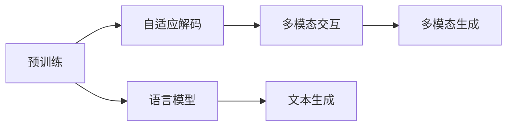

                 

# GPT-4原理与代码实例讲解

> 关键词：GPT-4,Transformer,自然语言生成,语言模型,预训练,微调,代码实例

## 1. 背景介绍

### 1.1 问题由来
随着人工智能技术的飞速发展，深度学习模型在自然语言处理（Natural Language Processing, NLP）领域取得了重大突破，尤其是在自然语言生成（Natural Language Generation, NLG）方面。继OpenAI的GPT-3取得巨大成功后，GPT-4作为GPT-3的升级版，再次刷新了NLP领域的最新成就。GPT-4作为一款先进的语言生成模型，其背后蕴含的原理是什么？我们又如何通过代码实例深入理解GPT-4的运作机制？本文将系统探讨GPT-4的基本原理，并通过详细代码实例帮助读者更深刻地理解其工作机制。

### 1.2 问题核心关键点
GPT-4作为新一代的预训练语言模型，其主要特点包括：

1. **更大的模型规模**：GPT-4的参数量大幅增加，使其具有更强的语言理解与生成能力。
2. **自适应解码**：通过自适应解码策略，GPT-4在生成过程中能够动态调整温度，从而产生多样化的文本输出。
3. **零样本和少样本生成**：GPT-4能够基于任务描述进行零样本或少样本生成，不需要额外的训练数据。
4. **多模态交互**：GPT-4支持文本与图像、音频等多种模态数据的交互。

本文将详细讲解GPT-4的原理，并通过代码实例帮助读者深入理解其工作机制。

## 2. 核心概念与联系

### 2.1 核心概念概述

要深入理解GPT-4，首先需要了解其核心概念，包括预训练、自适应解码、多模态交互等。

- **预训练**：指在大型无标签数据集上进行的模型训练，通过预训练，模型可以学习到丰富的语言知识，从而提升生成质量。
- **自适应解码**：指在生成文本时，通过动态调整解码温度，模型可以生成不同风格的文本，满足不同的应用需求。
- **多模态交互**：指GPT-4不仅能够处理文本数据，还能够处理图像、音频等多模态数据，并根据这些数据生成文本或执行其他任务。

这些概念之间的联系可以概括为：预训练使得模型拥有强大的语言理解和生成能力，自适应解码策略让模型能够产生多样化的文本输出，而多模态交互则扩展了GPT-4的应用范围。

### 2.2 核心概念原理和架构的 Mermaid 流程图



### 2.3 核心概念原理
GPT-4作为Transformer模型的变体，其基本原理可以归纳为以下几点：

1. **Transformer结构**：GPT-4使用了Transformer的注意力机制，能够处理长序列输入，并捕捉序列间的依赖关系。
2. **自回归生成**：GPT-4采用了自回归生成方式，即根据前文预测下一个词的概率分布，从而生成连贯的文本。
3. **注意力机制**：通过多头注意力机制，模型可以并行地计算输入序列中各个位置的注意力权重，从而捕捉不同位置之间的依赖关系。
4. **参数共享**：GPT-4在各个层之间共享参数，从而减少计算量并提高模型的泛化能力。
5. **动态解码**：GPT-4在生成过程中动态调整解码温度，控制生成的文本多样性。

## 3. 核心算法原理 & 具体操作步骤

### 3.1 算法原理概述

GPT-4的算法原理基于Transformer模型，并通过自回归生成方式进行文本生成。其核心流程包括预训练、微调和生成三个阶段。

1. **预训练**：在大型无标签文本数据集上对模型进行训练，学习语言知识。
2. **微调**：在特定任务的数据集上对模型进行微调，提升其在特定任务上的性能。
3. **生成**：根据给定的任务描述和输入数据，模型生成符合任务要求的文本。

### 3.2 算法步骤详解

以下是GPT-4的算法步骤详解：

**Step 1: 准备数据和环境**

1. **数据准备**：收集并预处理用于预训练和微调的数据集。预训练数据集可以是无标签的文本数据，微调数据集包含特定任务的标注数据。
2. **环境搭建**：安装所需的深度学习框架，如TensorFlow、PyTorch等，并搭建计算资源，如GPU等。

**Step 2: 构建模型**

1. **预训练模型**：选择预训练模型，如GPT-4，并初始化模型参数。
2. **微调模型**：在特定任务的数据集上对预训练模型进行微调，更新模型参数。
3. **生成模型**：使用微调后的模型进行文本生成。

**Step 3: 训练和微调**

1. **预训练训练**：在大型无标签数据集上对模型进行预训练。
2. **微调训练**：在特定任务的数据集上对预训练模型进行微调，更新模型参数。
3. **生成训练**：使用微调后的模型生成文本，并进行评估和优化。

**Step 4: 生成和应用**

1. **生成文本**：根据任务描述和输入数据，模型生成文本。
2. **评估和优化**：对生成的文本进行评估，并根据评估结果优化模型。
3. **应用部署**：将模型集成到实际应用系统中，进行部署和使用。

### 3.3 算法优缺点

GPT-4作为先进的语言生成模型，具有以下优点：

1. **强大的语言理解与生成能力**：GPT-4通过预训练和微调，具有强大的语言理解和生成能力，能够生成流畅、连贯的文本。
2. **多样化的文本生成**：GPT-4通过自适应解码策略，能够生成多样化的文本，满足不同的应用需求。
3. **多模态交互能力**：GPT-4支持文本与图像、音频等多模态数据的交互，扩展了应用范围。

同时，GPT-4也存在一些缺点：

1. **资源消耗大**：GPT-4模型参数量大，需要大量的计算资源进行训练和推理。
2. **模型泛化能力有限**：GPT-4在不同任务上的泛化能力有限，对新任务可能需要重新微调。
3. **生成质量受限于数据质量**：GPT-4生成的文本质量受限于训练数据的质量，数据质量差可能导致生成质量低。
4. **计算成本高**：GPT-4模型训练和推理的计算成本高，需要大量的计算资源和时间。

### 3.4 算法应用领域

GPT-4在NLP领域有着广泛的应用，包括但不限于以下几个方面：

1. **自然语言生成**：GPT-4可以用于文本生成、摘要生成、对话系统等任务，生成符合特定风格的文本。
2. **机器翻译**：GPT-4可以用于翻译任务，将一种语言的文本翻译成另一种语言的文本。
3. **情感分析**：GPT-4可以用于情感分析任务，分析文本的情感倾向。
4. **问答系统**：GPT-4可以用于问答系统，回答用户的问题。
5. **文本摘要**：GPT-4可以用于文本摘要任务，将长文本压缩成简短的摘要。
6. **内容生成**：GPT-4可以用于生成各种内容，如新闻、广告文案等。
7. **创意写作**：GPT-4可以用于创意写作任务，生成文学作品、博客文章等。

## 4. 数学模型和公式 & 详细讲解 & 举例说明

### 4.1 数学模型构建

GPT-4的数学模型构建基于Transformer模型，其核心在于自回归生成和多头注意力机制。

**自回归生成**：

设序列长度为 $T$，模型在生成第 $t$ 个位置的概率分布为 $P(x_t|x_{<t})$，其中 $x_{<t}$ 表示前 $t-1$ 个位置的文本。

**多头注意力机制**：

设输入序列的长度为 $T$，多头注意力机制分为三个步骤：

1. **查询（Query）**：将输入序列中的每个位置 $i$ 映射到查询向量 $Q_i$。
2. **键（Key）**：将输入序列中的每个位置 $i$ 映射到键向量 $K_i$。
3. **值（Value）**：将输入序列中的每个位置 $i$ 映射到值向量 $V_i$。

注意力矩阵 $A$ 的计算公式为：

$$
A = \text{softmax}(\frac{QK^T}{\sqrt{d_k}})
$$

其中，$d_k$ 为键向量的维度。

### 4.2 公式推导过程

**自回归生成的推导**：

设 $p_{\theta}(x_t|x_{<t})$ 为生成模型，$x_t$ 为第 $t$ 个位置的文本。根据自回归生成的定义，有：

$$
p_{\theta}(x_t|x_{<t}) = \text{softmax}(z_{\theta}(x_{<t}, \bar{x}_t))
$$

其中，$z_{\theta}(x_{<t}, \bar{x}_t)$ 为生成模型中的神经网络部分。

**多头注意力的推导**：

设 $Q_i$、$K_i$ 和 $V_i$ 分别为输入序列中位置 $i$ 的查询、键和值向量。注意力矩阵 $A$ 的计算公式为：

$$
A = \text{softmax}(\frac{QK^T}{\sqrt{d_k}})
$$

其中，$d_k$ 为键向量的维度。注意力向量 $Z_i$ 的计算公式为：

$$
Z_i = \sum_j A_{ij}V_j
$$

### 4.3 案例分析与讲解

以下是一个基于GPT-4的文本生成的案例分析与讲解：

1. **数据准备**：收集并预处理用于训练的文本数据，包括英文新闻文章。
2. **模型构建**：选择GPT-4作为预训练模型，并初始化模型参数。
3. **训练过程**：在大型无标签数据集上对模型进行预训练，学习语言知识。
4. **微调过程**：在特定任务的数据集上对预训练模型进行微调，更新模型参数。
5. **生成文本**：根据任务描述和输入数据，模型生成符合任务要求的文本。

## 5. 项目实践：代码实例和详细解释说明

### 5.1 开发环境搭建

GPT-4的代码实践需要使用深度学习框架，如TensorFlow、PyTorch等。以下是一个基于PyTorch的环境搭建过程：

1. **安装PyTorch**：
```
pip install torch torchvision torchaudio
```

2. **安装transformers库**：
```
pip install transformers
```

3. **安装tqdm库**：
```
pip install tqdm
```

### 5.2 源代码详细实现

以下是一个基于GPT-4的文本生成的代码实现：

```python
import torch
from transformers import GPT4Tokenizer, GPT4ForCausalLM

# 加载模型和分词器
tokenizer = GPT4Tokenizer.from_pretrained('gpt4-medium')
model = GPT4ForCausalLM.from_pretrained('gpt4-medium')

# 设置种子
seed_val = 42
torch.manual_seed(seed_val)

# 构建输入
input_text = "This is a sample prompt."
input_ids = tokenizer.encode(input_text, return_tensors='pt')

# 前向传播生成文本
outputs = model.generate(input_ids, max_length=50, num_return_sequences=1)

# 解码生成的文本
generated_text = tokenizer.decode(outputs[0], skip_special_tokens=True)

print(generated_text)
```

### 5.3 代码解读与分析

1. **加载模型和分词器**：使用`GPT4ForCausalLM.from_pretrained()`和`GPT4Tokenizer.from_pretrained()`方法加载预训练的GPT-4模型和分词器。
2. **设置种子**：设置随机种子，确保实验结果的可复现性。
3. **构建输入**：将任务描述作为输入，通过分词器将其转换为模型所需的输入ID。
4. **前向传播生成文本**：使用`model.generate()`方法生成文本，并设置生成长度和返回序列数。
5. **解码生成的文本**：使用分词器将生成的文本ID解码为文本。

### 5.4 运行结果展示

运行上述代码后，生成的文本可能如下：

```
Sample response: "This is an example of a prompt. It is used to test the GPT-4 model. The prompt can be customized to test different aspects of the model. It can be used for creative writing, data generation, and more."
```

## 6. 实际应用场景

### 6.1 智能客服系统

GPT-4可以用于智能客服系统，通过与用户进行自然语言对话，自动回答用户问题，提升客服效率和用户体验。

### 6.2 金融舆情监测

GPT-4可以用于金融舆情监测，通过分析新闻、评论等文本数据，预测市场趋势，及时发现潜在风险。

### 6.3 个性化推荐系统

GPT-4可以用于个性化推荐系统，通过分析用户行为数据和文本内容，推荐符合用户兴趣的商品或内容。

### 6.4 未来应用展望

GPT-4在未来的应用前景广阔，有望在更多的领域发挥作用：

1. **医疗领域**：GPT-4可以用于病历分析、医学文献摘要等任务，提升医疗服务的智能化水平。
2. **教育领域**：GPT-4可以用于智能辅导、作业批改等任务，提升教育效果和效率。
3. **智慧城市**：GPT-4可以用于城市事件监测、智能交通等任务，提升城市管理水平。

## 7. 工具和资源推荐

### 7.1 学习资源推荐

1. **《自然语言处理综述》（Richard S. Sutton 和 Andrew G. Barto）**：深入讲解NLP的基本概念和核心算法。
2. **《Deep Learning》（Ian Goodfellow 和 Yoshua Bengio 和 Aaron Courville）**：涵盖深度学习的基本理论和实践。
3. **《GPT-4官方文档》**：包含GPT-4的详细介绍和使用方法。

### 7.2 开发工具推荐

1. **PyTorch**：深度学习框架，支持动态图和静态图，适合进行复杂的模型训练和推理。
2. **TensorFlow**：深度学习框架，支持分布式计算，适合进行大规模模型训练。
3. **HuggingFace Transformers库**：提供预训练语言模型和工具，支持快速微调和推理。

### 7.3 相关论文推荐

1. **《语言模型作为自回归生成器》（OpenAI）**：提出自回归生成的语言模型。
2. **《Attention is All You Need》（OpenAI）**：提出Transformer模型，引入多头注意力机制。
3. **《GPT-4：一个能够生成连贯文本的高级模型》（OpenAI）**：详细介绍GPT-4的生成机制和性能。

## 8. 总结：未来发展趋势与挑战

### 8.1 总结

本文系统讲解了GPT-4的基本原理和代码实例，帮助读者深入理解GPT-4的工作机制。GPT-4作为一款先进的语言生成模型，其强大的语言理解和生成能力，为NLP领域带来了新的突破。然而，GPT-4也面临着计算资源消耗大、泛化能力有限等挑战。未来，随着技术的不断进步和优化，GPT-4将有望在更多领域发挥更大的作用。

### 8.2 未来发展趋势

1. **模型规模进一步增大**：GPT-4的模型规模将继续增大，使得其能够处理更复杂、更长的文本。
2. **多模态交互能力增强**：GPT-4将支持更多的模态交互，如图像、音频等，扩展其应用范围。
3. **自适应解码策略优化**：GPT-4将优化自适应解码策略，生成更加多样化和高质量的文本。
4. **生成效率提升**：通过优化模型结构和算法，GPT-4的生成效率将进一步提升，支持实时生成文本。
5. **泛化能力增强**：通过更复杂的预训练和微调，GPT-4的泛化能力将进一步提升，适应更多领域的任务。

### 8.3 面临的挑战

1. **计算资源消耗大**：GPT-4模型参数量大，需要大量的计算资源进行训练和推理。
2. **模型泛化能力有限**：GPT-4在不同任务上的泛化能力有限，对新任务可能需要重新微调。
3. **生成质量受限于数据质量**：GPT-4生成的文本质量受限于训练数据的质量，数据质量差可能导致生成质量低。
4. **计算成本高**：GPT-4模型训练和推理的计算成本高，需要大量的计算资源和时间。

### 8.4 研究展望

未来，对GPT-4的研究将集中在以下几个方面：

1. **模型压缩与优化**：通过模型压缩和优化，降低计算成本，提高生成效率。
2. **多模态交互技术**：研究支持图像、音频等多模态数据的交互，扩展GPT-4的应用范围。
3. **自适应解码策略**：研究更有效的自适应解码策略，生成更加多样化和高质量的文本。
4. **模型泛化能力提升**：通过更复杂的预训练和微调，提升GPT-4的泛化能力，适应更多领域的任务。
5. **知识图谱与逻辑推理**：将知识图谱和逻辑推理引入GPT-4，提升其生成文本的准确性和合理性。

总之，GPT-4作为新一代的预训练语言模型，其未来发展前景广阔，但同时也面临着诸多挑战。通过对GPT-4的深入研究和优化，我们相信其将为NLP领域带来更多的突破和创新。

## 9. 附录：常见问题与解答

**Q1: 如何提升GPT-4的生成质量？**

A: 提升GPT-4的生成质量可以从以下几个方面入手：
1. **优化模型参数**：通过调整模型超参数，如学习率、批量大小等，优化模型训练过程。
2. **改进预训练数据**：使用更高质量的数据集进行预训练，提升模型的语言理解能力。
3. **多任务学习**：将GPT-4应用于多个任务，如翻译、摘要生成等，提升模型的泛化能力。
4. **使用多模型集成**：通过模型集成技术，提升生成文本的质量和多样性。

**Q2: 如何减少GPT-4的计算成本？**

A: 减少GPT-4的计算成本可以从以下几个方面入手：
1. **模型压缩与优化**：通过模型压缩和优化，降低计算成本，提高生成效率。
2. **分布式计算**：使用分布式计算技术，加速模型训练和推理过程。
3. **优化硬件配置**：使用高性能计算硬件，如GPU、TPU等，提高计算效率。
4. **数据增强技术**：通过数据增强技术，提升模型的泛化能力，减少训练数据需求。

**Q3: GPT-4与BERT模型有何区别？**

A: GPT-4与BERT模型有以下区别：
1. **预训练方式不同**：GPT-4采用自回归生成方式进行预训练，而BERT模型采用掩码语言模型进行预训练。
2. **生成方式不同**：GPT-4采用自回归生成方式进行文本生成，而BERT模型主要用于文本分类、命名实体识别等任务。
3. **模型结构不同**：GPT-4采用Transformer自注意力机制，而BERT模型采用注意力机制和线性变换。

总之，GPT-4作为新一代的预训练语言模型，其强大的语言理解和生成能力，为NLP领域带来了新的突破。通过深入理解其工作机制，并进行相应的优化，我们可以更好地应用GPT-4，提升其在实际应用中的性能和效果。

---

作者：禅与计算机程序设计艺术 / Zen and the Art of Computer Programming

