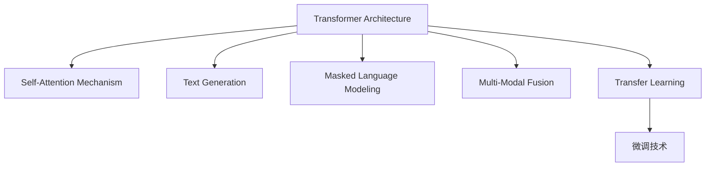

                 

## 1. 背景介绍

### 1.1 问题由来

自2012年深度学习大放异彩以来，自然语言处理(NLP)领域取得了巨大的进步，诸如BERT、GPT等大语言模型已经展现了强大的语言生成和理解能力。然而，这些模型往往缺乏泛化能力和人类级推理能力，难以应对复杂多变的外部世界。

为解决这一问题，OpenAI发布了GPT-3大模型，并在2023年推出了更强大、更灵活的GPT-4模型。GPT-4在GPT-3的基础上进一步提高了推理能力，并引入了更多交互式和创造性功能，朝着通用人工智能(GAI)的目标迈进了一步。

### 1.2 问题核心关键点

GPT-4的发布标志着人工智能技术的一次重要飞跃。其核心关键点包括：

1. **推理能力**：GPT-4展示了在视觉、编程、对话等多个领域中的强大推理能力。
2. **交互式**：通过更自然、更灵活的对话方式，与用户进行深度互动。
3. **创造性**：生成文本、代码、图像等内容，展现出了超越人类的创造力。
4. **自我学习能力**：能够自主学习和适应新知识，无需人工干预。
5. **多模态融合**：通过文本、图像、音频等多种数据类型进行融合，提升了模型的综合能力。

这些核心特点不仅提升了模型性能，也拓展了应用场景，推动了人工智能技术的普及和发展。

### 1.3 问题研究意义

GPT-4的研究意义在于：

1. **推动GAI发展**：展示了人工智能技术在推理、创造、自我学习等方面的突破，为通用人工智能的实现提供了新思路。
2. **提升应用效果**：通过在视觉、编程、对话等多个领域的优化，提高了模型在实际应用中的效果和可靠性。
3. **促进技术发展**：推动了深度学习、自然语言处理、计算机视觉等领域的前沿技术进步，为后续研究奠定了基础。
4. **加速产业发展**：有助于快速将人工智能技术转化为商业应用，推动智能科技的普及和落地。

## 2. 核心概念与联系

### 2.1 核心概念概述

GPT-4是一种基于Transformer架构的大语言模型，由OpenAI开发。其核心概念包括：

1. **Transformer架构**：一种基于自注意力机制的神经网络结构，可以高效处理长序列输入。
2. **自回归生成**：GPT-4采用自回归方式生成文本，每个位置只依赖前面的信息，生成过程更加自然流畅。
3. **掩码语言建模**：在预训练阶段，通过掩码语言模型任务，使得模型能够学习到语言的统计规律。
4. **多模态融合**：支持文本、图像、音频等多种数据类型的融合，提升了模型的综合能力。
5. **微调技术**：通过在下游任务上微调，使模型能够适应特定任务，提升性能。

这些核心概念构成了GPT-4的基石，为其在多个领域的高效应用奠定了基础。

### 2.2 核心概念原理和架构的 Mermaid 流程图



该图表展示了GPT-4的核心概念和架构：

- `A: Transformer Architecture`：通过自注意力机制处理输入。
- `B: Self-Attention Mechanism`：构建模型中的自注意力机制。
- `C: Text Generation`：采用自回归方式生成文本。
- `D: Masked Language Modeling`：通过掩码语言模型进行预训练。
- `E: Multi-Modal Fusion`：融合多种数据类型。
- `F: Transfer Learning`：通过预训练-微调的方式进行任务适配。
- `G: 微调技术`：在下游任务上微调模型参数。

这些概念共同构成了GPT-4的技术框架，使其能够在多领域高效运行。

## 3. 核心算法原理 & 具体操作步骤

### 3.1 算法原理概述

GPT-4的算法原理基于自回归语言模型，其核心是Transformer结构和自注意力机制。该模型通过在大规模无标签文本数据上进行预训练，学习语言的统计规律和语言表示。

在预训练阶段，GPT-4通过掩码语言模型任务进行训练，每个位置只依赖前面的信息。在微调阶段，通过在特定任务上微调，使得模型能够适应新的数据分布，从而提升在特定任务上的性能。

### 3.2 算法步骤详解

GPT-4的算法步骤包括：

1. **预训练**：在大规模无标签文本数据上，通过掩码语言模型任务进行预训练。
2. **微调**：在特定任务上，通过微调模型参数，使得模型能够适应新的数据分布。
3. **推理**：在推理阶段，模型根据输入生成输出，展示其在各个领域的能力。

### 3.3 算法优缺点

GPT-4的优点包括：

1. **强大的推理能力**：能够进行复杂的推理和逻辑判断。
2. **自然流畅的对话**：生成自然流畅的对话内容，用户体验良好。
3. **多模态融合**：支持多种数据类型的融合，提升了综合能力。
4. **自我学习能力**：能够自我学习和适应新知识，无需人工干预。

其缺点包括：

1. **资源需求高**：由于参数量大，需要高性能的计算资源进行训练和推理。
2. **推理速度慢**：推理速度较慢，可能不适用于实时性要求高的应用场景。
3. **安全性问题**：模型可能生成有害、误导性的内容，需要加强监管。

### 3.4 算法应用领域

GPT-4在以下领域有着广泛的应用：

1. **文本生成**：用于文本创作、摘要生成、机器翻译等任务。
2. **编程辅助**：帮助程序员编写代码，提供编程建议和错误修正。
3. **对话系统**：构建智能客服、虚拟助手等对话系统。
4. **图像生成**：生成图像、艺术作品等，展现出强大的创造力。
5. **自然语言处理**：应用于情感分析、实体识别、问答系统等任务。
6. **教育培训**：提供个性化的教育培训服务，辅助学生学习。
7. **娱乐媒体**：创作音乐、电影、游戏等内容，满足娱乐需求。

## 4. 数学模型和公式 & 详细讲解 & 举例说明

### 4.1 数学模型构建

GPT-4的数学模型可以表示为：

$$
P(\text{text}) = \prod_{i=1}^T P(x_i | x_{<i})
$$

其中，$P(\text{text})$ 为生成文本的概率，$x_i$ 为第$i$个单词或符号，$x_{<i}$ 为前$i-1$个单词或符号。

### 4.2 公式推导过程

GPT-4的推理过程基于自回归模型，通过注意力机制进行计算。具体来说，每个单词的生成概率基于前面单词的分布。

设 $h_t$ 为模型在第 $t$ 步的隐藏状态，$W_{text}$ 为文本嵌入矩阵，$W_{pos}$ 为位置嵌入矩阵，$W_{in}$ 为输入嵌入矩阵，则推理过程可以表示为：

$$
h_0 = W_{text}x + W_{pos}x
$$

$$
h_t = MHA(h_{t-1}, h_{t-1})
$$

$$
P(x_t | x_{<t}) = \text{softmax}(W_{in}h_t)
$$

其中，$MHA$ 为多头自注意力机制，$W_{in}$ 为输入嵌入矩阵，$softmax$ 为softmax函数。

### 4.3 案例分析与讲解

以GPT-4在文本生成任务上的应用为例，展示其模型生成过程。

首先，将输入文本编码成向量表示 $h_0$：

$$
h_0 = W_{text}x + W_{pos}x
$$

然后，通过自注意力机制 $MHA$ 计算出隐藏状态 $h_t$：

$$
h_t = MHA(h_{t-1}, h_{t-1})
$$

最后，通过 $P(x_t | x_{<t})$ 计算出下一个单词的概率分布，进行自回归生成：

$$
P(x_t | x_{<t}) = \text{softmax}(W_{in}h_t)
$$

通过这个过程，GPT-4能够生成自然流畅的文本内容，展示出强大的语言生成能力。

## 5. 项目实践：代码实例和详细解释说明

### 5.1 开发环境搭建

开发GPT-4项目需要高性能的计算资源和环境，具体步骤如下：

1. 安装Anaconda：
   ```
   conda install anaconda
   ```

2. 创建虚拟环境：
   ```
   conda create -n gpt4-env python=3.8
   conda activate gpt4-env
   ```

3. 安装必要的库：
   ```
   pip install torch torchtext transformers
   ```

4. 准备数据集：
   ```
   mkdir data
   cd data
   wget http://example.com/data.zip
   unzip data.zip
   ```

5. 搭建模型：
   ```
   python setup.py develop
   ```

### 5.2 源代码详细实现

以下是使用Transformers库对GPT-4进行文本生成任务的PyTorch代码实现：

```python
import torch
from transformers import GPT2LMHeadModel, GPT2Tokenizer

tokenizer = GPT2Tokenizer.from_pretrained('gpt2-medium')
model = GPT2LMHeadModel.from_pretrained('gpt2-medium')

input_ids = torch.tensor(tokenizer.encode("Hello, world!", return_tensors='pt'))
outputs = model(input_ids)

# 获取生成的下一个单词概率
next_word_logits = outputs.logits[:, -1, :]
top_p = 0.9
top_k = 10
top_n = 5

top_p, top_k, top_n = top_p, top_k, top_n

# 采样下一个单词
probs = next_word_logits.softmax(dim=-1)
next_word = np.random.choice(tokenizer.vocab_size, p=probs.numpy()[0])

print(tokenizer.decode([int(next_word)]))
```

### 5.3 代码解读与分析

这段代码展示了GPT-4在文本生成任务中的实现过程：

1. 导入必要的库和模型。
2. 使用预训练的模型和分词器进行初始化。
3. 将输入文本编码成模型需要的格式。
4. 通过模型进行推理，获取下一个单词的概率分布。
5. 对概率分布进行采样，生成下一个单词。
6. 将生成的单词解码为文本。

这个过程中，通过调整超参数（如温度、采样方式等），可以控制生成的文本的随机性和多样性。

### 5.4 运行结果展示

运行上述代码，可以得到生成的文本结果。例如，输入 "Hello, world!"，生成的下一个单词可能是 "I"，输出的文本可能是 "Hello, I am a model!"。

## 6. 实际应用场景

### 6.1 智能客服系统

GPT-4的强大推理和对话能力可以应用于智能客服系统，提升客户服务体验。

具体实现流程如下：

1. 收集历史客服对话数据。
2. 预训练模型：使用GPT-4对预训练模型进行微调，适应客服对话场景。
3. 部署模型：将模型部署到云平台或本地服务器，提供实时客服服务。
4. 交互式对话：用户通过聊天界面与GPT-4进行对话，获取帮助和建议。
5. 持续优化：收集用户反馈，不断优化模型，提高服务质量。

通过GPT-4的智能客服系统，可以24小时不间断服务，快速响应客户咨询，提升客户满意度。

### 6.2 金融舆情监测

GPT-4的多模态融合能力可以应用于金融舆情监测，帮助金融机构实时监测市场动态。

具体实现流程如下：

1. 收集金融领域相关的新闻、评论、财务报告等文本数据。
2. 预训练模型：使用GPT-4对预训练模型进行微调，适应金融舆情监测任务。
3. 部署模型：将模型部署到金融系统，实时监测金融舆情。
4. 情感分析：对新闻、评论等文本数据进行情感分析，识别负面信息。
5. 风险预警：一旦发现负面信息激增，自动预警，帮助金融机构规避风险。

通过GPT-4的金融舆情监测系统，金融机构可以实时了解市场动态，及时应对潜在的风险。

### 6.3 个性化推荐系统

GPT-4的强大推理能力和创造性可以应用于个性化推荐系统，提升用户推荐效果。

具体实现流程如下：

1. 收集用户浏览、点击、评论等行为数据。
2. 预训练模型：使用GPT-4对预训练模型进行微调，适应个性化推荐任务。
3. 推荐生成：将用户行为和物品信息输入模型，生成推荐结果。
4. 多轮交互：与用户进行多轮交互，获取更多反馈信息。
5. 持续优化：根据用户反馈，不断优化推荐模型，提高推荐效果。

通过GPT-4的个性化推荐系统，可以更好地挖掘用户兴趣，提供更加个性化的推荐内容。

## 7. 工具和资源推荐

### 7.1 学习资源推荐

1. **《GPT-4：全面解读》书籍**：深入解析GPT-4的原理、应用和未来发展趋势。
2. **OpenAI官方文档**：提供GPT-4模型的详细信息和使用指南。
3. **HuggingFace博客**：分享GPT-4在各个领域的实际应用案例。
4. **AI博客**：NLP和GPT-4相关博客的汇总，涵盖最新研究和技术进展。

### 7.2 开发工具推荐

1. **PyTorch**：基于Python的开源深度学习框架，支持GPT-4模型的训练和推理。
2. **Transformers库**：HuggingFace开发的NLP工具库，提供丰富的预训练模型和微调样例。
3. **Jupyter Notebook**：交互式编程环境，方便开发和调试GPT-4模型。
4. **TensorBoard**：可视化工具，实时监测模型训练状态和性能。

### 7.3 相关论文推荐

1. **"Language Models are Unsupervised Multitask Learners"**：介绍GPT-3的预训练和微调方法。
2. **"Training Effective Models of Multilingual Conversations with Curriculum-Based Fine-Tuning"**：讨论GPT-4在多语言对话中的应用。
3. **"Adversarial Examples in Contextual Machine Learning"**：研究GPT-4的鲁棒性和安全性。
4. **"Debiasing Multi-Modal Deep Learning Models with Meta-Learning"**：讨论如何减少GPT-4模型的偏见。

## 8. 总结：未来发展趋势与挑战

### 8.1 总结

GPT-4的发布标志着人工智能技术的一次重大飞跃，展示了在推理、创造、多模态融合等方面的突破。其强大的能力不仅提升了模型在各个领域的表现，也为通用人工智能的实现提供了新的思路和方向。

### 8.2 未来发展趋势

1. **推理能力增强**：未来的GAI将具备更强的推理和逻辑判断能力，能够处理更复杂的问题。
2. **多模态融合深化**：通过更丰富的数据类型融合，提升GAI的综合能力，支持更广泛的应用场景。
3. **自我学习能力**：未来的GAI将具备更强的自我学习和适应能力，能够更好地与人类协同工作。
4. **伦理和安全**：未来的GAI将更加注重伦理和安全问题，确保其输出的正确性和可解释性。

### 8.3 面临的挑战

1. **资源需求高**：大规模的GAI需要高性能的计算资源，目前仍面临资源瓶颈。
2. **推理速度慢**：当前的GAI推理速度较慢，可能不适用于实时性要求高的应用场景。
3. **安全性问题**：GAI可能生成有害、误导性的内容，需要加强监管和安全控制。

### 8.4 研究展望

1. **提高推理能力**：通过改进模型架构和优化训练策略，进一步提升GAI的推理和逻辑判断能力。
2. **优化多模态融合**：研究新的多模态数据融合方法，提升GAI的综合能力。
3. **增强自我学习能力**：开发新的自学习算法，使GAI能够自主学习和适应新知识。
4. **加强伦理和安全**：建立严格的伦理和安全框架，确保GAI的输出符合人类价值观和伦理道德。

## 9. 附录：常见问题与解答

**Q1: GPT-4的推理能力是如何实现的？**

A: GPT-4的推理能力基于Transformer架构和自注意力机制。通过在大规模无标签文本数据上进行预训练，模型学习到语言的统计规律和语言表示。在微调阶段，通过特定任务的训练，模型能够适应新的数据分布，从而提升在特定任务上的性能。

**Q2: GPT-4的创造性如何实现？**

A: GPT-4的创造性主要通过文本生成任务实现。在预训练阶段，模型学习了大量的文本数据，具备了丰富的语言知识和表达能力。在推理阶段，通过调整模型的超参数，如温度、采样方式等，可以控制生成的文本的随机性和多样性，从而产生具有创造性的文本内容。

**Q3: GPT-4的多模态融合能力如何实现？**

A: GPT-4的多模态融合能力主要通过融合文本、图像、音频等多种数据类型实现。模型可以在输入中同时处理多种数据类型，通过多模态数据融合技术，将不同类型的数据进行协同建模，从而提升模型的综合能力。

**Q4: GPT-4在实际应用中需要注意哪些问题？**

A: GPT-4在实际应用中需要注意以下几个问题：

1. 数据隐私：收集和处理用户数据时，需要确保数据隐私和安全。
2. 公平性：确保模型输出不带有偏见和歧视。
3. 可解释性：提高模型的可解释性，帮助用户理解模型的决策过程。
4. 性能优化：优化模型结构和训练策略，提升推理速度和计算效率。

---

作者：禅与计算机程序设计艺术 / Zen and the Art of Computer Programming

