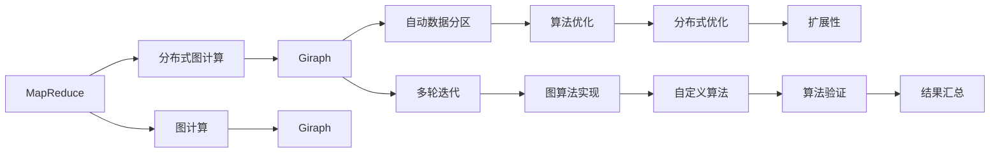

                 

# Giraph原理与代码实例讲解

> 关键词：Giraph, MapReduce, 分布式图计算, 图计算, Graph Processing, 分布式数据处理, 算法优化, Hadoop, 大数据

## 1. 背景介绍

### 1.1 问题由来

随着互联网和社交网络的迅速发展，大数据时代的到来，数据的类型和规模不断增长，传统的数据处理方法如批处理和流处理已经难以满足复杂的分析需求。针对这一问题，图计算技术应运而生，成为一种新兴的数据分析方式。其中，Giraph是一个广泛应用的分布式图计算框架，基于Google的Pregel，采用MapReduce模型进行图处理。

### 1.2 问题核心关键点

Giraph框架的独特之处在于其图处理能力，可以处理大规模的、复杂的关系数据，适用于社交网络分析、推荐系统、路径分析、基因组分析等场景。其主要特点包括：

- 支持多轮迭代：允许用户定义多次迭代，以适应复杂的图算法。
- 灵活的图算法实现：用户可以自行实现图算法，并通过Giraph框架进行分布式优化。
- 可扩展性：可以处理大规模的数据集，适用于分布式计算环境。
- 自动数据分区：根据用户提供的图数据自动进行分区，提高计算效率。

这些特点使得Giraph框架成为图计算领域的利器，被广泛应用于各种大数据处理场景。

## 2. 核心概念与联系

### 2.1 核心概念概述

为更好地理解Giraph框架，我们首先介绍几个核心概念：

- MapReduce：一种编程模型，用于大规模数据处理，将计算任务分解成多个小的、可并行执行的任务。
- 图：由节点和边构成的数据结构，用于表示各种复杂的关系网络。
- 图计算：利用图结构进行数据处理和分析，涵盖图的遍历、聚合、划分、路径分析等多种计算方式。
- 分布式计算：将大规模任务分散到多个计算节点上并行执行，提高计算效率和系统可靠性。

### 2.2 核心概念原理和架构的 Mermaid 流程图



这个流程图展示了Giraph框架的核心概念及其之间的联系：

1. MapReduce：作为分布式计算的基础，将复杂的图计算任务拆分成多个小的任务，由分布式计算框架并行执行。
2. 图计算：利用图结构进行数据处理，涵盖图的遍历、聚合、划分、路径分析等多种计算方式。
3. Giraph：建立在MapReduce基础上的分布式图计算框架，支持多轮迭代和图算法实现。
4. 多轮迭代：允许用户定义多次迭代，适应复杂的图算法需求。
5. 自动数据分区：根据用户提供的图数据自动进行分区，提高计算效率。
6. 图算法实现：用户可以自行实现图算法，并通过Giraph框架进行分布式优化。
7. 算法优化：优化图算法的分布式实现，提高计算效率和性能。
8. 扩展性：Giraph框架可以处理大规模的数据集，适用于分布式计算环境。
9. 自定义算法：用户可以根据实际需求自行实现图算法，增强框架的灵活性。
10. 分布式优化：Giraph框架支持分布式优化，提高计算效率和可靠性。

这些核心概念构成了Giraph框架的基础，帮助用户进行复杂的大数据图处理任务。

## 3. 核心算法原理 & 具体操作步骤

### 3.1 算法原理概述

Giraph框架的核心算法是MapReduce模型，采用“分治”的思想，将大规模的图处理任务拆分成多个小的、可并行执行的任务，并行执行以提高计算效率。具体来说，Giraph框架通过多次迭代，不断更新节点的状态，最终得到计算结果。

### 3.2 算法步骤详解

Giraph框架的处理流程可以分为以下几个步骤：

**Step 1: 图数据准备**
- 将图数据按照顶点和边关系进行划分，生成多个小图。
- 将小图分布到多个计算节点上，每个节点处理一个小图的子集。

**Step 2: 图计算迭代**
- 初始化每个顶点的状态，如计数、计数和等。
- 进行多次迭代，每次迭代更新顶点状态。
- 每次迭代计算完成后，将结果写回分布式文件系统中，等待下一轮迭代使用。

**Step 3: 结果汇总**
- 迭代结束后，将各个节点的计算结果汇总。
- 计算全局结果，返回最终结果。

在每次迭代中，Giraph框架会自动进行数据分区和并行计算，优化计算效率和系统性能。

### 3.3 算法优缺点

Giraph框架的优点包括：

1. 可扩展性强：能够处理大规模的图数据，支持分布式计算。
2. 算法灵活：用户可以自行实现图算法，并通过Giraph框架进行分布式优化。
3. 自动数据分区：根据图数据自动进行分区，提高计算效率。

Giraph框架的缺点包括：

1. 实现复杂：需要用户自行实现图算法，增加了实现难度。
2. 迭代次数过多：多次迭代可能导致计算时间过长，影响性能。
3. 资源消耗大：分布式计算需要大量计算资源，增加系统负担。

尽管存在这些缺点，Giraph框架在处理大规模图数据和复杂图算法时，仍然具有很大的优势。

### 3.4 算法应用领域

Giraph框架被广泛应用于以下领域：

1. 社交网络分析：分析社交网络中的关系图，发现社区、关系链等。
2. 推荐系统：分析用户行为数据，构建用户兴趣图，进行推荐。
3. 路径分析：分析图结构中的路径，发现潜在关系和模式。
4. 基因组分析：分析基因组数据中的复杂关系，发现基因之间的相互作用。
5. 城市规划：分析城市中的交通、人口、环境等数据，进行城市规划。

这些领域的数据处理和分析任务都需要处理大规模、复杂的关系数据，Giraph框架的高效性和灵活性使得其成为处理这些任务的首选工具。

## 4. 数学模型和公式 & 详细讲解 & 举例说明

### 4.1 数学模型构建

Giraph框架的数学模型基于MapReduce模型，采用“分治”的思想，将大规模的图处理任务拆分成多个小的、可并行执行的任务。具体来说，Giraph框架的数学模型可以表示为：

$$
\begin{aligned}
  & \text{输入：} \{(V,E) \text{ 组成的图数据 } \} \\
  & \text{输出：} \text{ 图数据处理结果 } \\
  & \text{过程：} \\
  & \quad \text{ Map 阶段：} V \rightarrow V \\
  & \quad \text{ Reduce 阶段：} V \rightarrow V \\
  & \quad \text{ Iterate 阶段：} N \text{ 轮迭代} \\
  & \quad \text{ Reduce 阶段：} V \rightarrow V \\
  & \text{ 最终结果：} \text{ 汇总后的图数据处理结果 }
\end{aligned}
$$

其中，$V$表示图中的顶点，$E$表示图中的边，$N$表示迭代的次数。

### 4.2 公式推导过程

在Giraph框架中，Map阶段和Reduce阶段是两个重要的计算步骤。Map阶段将图数据拆分成多个小的、可并行执行的任务，Reduce阶段将多个小的计算结果汇总。

Map阶段的公式推导如下：

$$
\text{Map}(V) = \{ (v, f(v)) \}
$$

其中，$v$表示图中的顶点，$f(v)$表示顶点的函数，可以是任何函数。

Reduce阶段的公式推导如下：

$$
\text{Reduce}(V) = \bigcup_{v \in V} f(v)
$$

其中，$\bigcup$表示并集操作。

### 4.3 案例分析与讲解

以社交网络分析为例，分析社交网络中的关系图。假设社交网络由$N$个节点组成，节点之间存在$m$条边。我们需要分析节点之间的社区结构，发现节点之间的紧密关系。

首先，我们需要定义顶点的函数$f(v)$，例如可以使用PageRank算法计算每个节点的重要性。PageRank算法的公式如下：

$$
\text{PR}(v) = \frac{1}{c(v)} \sum_{u \in N(v)} \frac{\text{PR}(u)}{d(u)}
$$

其中，$c(v)$表示节点$v$的入度，$d(u)$表示节点$u$的出度。

接下来，在Map阶段将社交网络数据拆分成多个小的任务，每个任务计算一个节点的PageRank值。在Reduce阶段将各个节点的PageRank值汇总，得到最终的社交网络分析结果。

## 5. 项目实践：代码实例和详细解释说明

### 5.1 开发环境搭建

在进行Giraph框架的项目实践前，我们需要准备好开发环境。以下是使用Java进行Giraph框架开发的环境配置流程：

1. 安装Java Development Kit（JDK）：从Oracle官网下载并安装JDK，用于编译和运行Java程序。

2. 安装Hadoop：从Apache Hadoop官网下载并安装Hadoop，用于分布式文件系统和计算任务调度。

3. 安装Giraph：从Giraph官网下载并安装Giraph框架，用于图处理和分布式计算。

4. 安装依赖库：通过Maven或Gradle安装Giraph框架的依赖库，如Hadoop和Commons等。

完成上述步骤后，即可在Hadoop集群上开始Giraph框架的开发和调试。

### 5.2 源代码详细实现

下面我们以PageRank算法为例，给出使用Giraph框架进行社交网络分析的Java代码实现。

首先，定义顶点类：

```java
import org.apache.hadoop.io.FloatWritable;
import org.apache.hadoop.io.Text;
import org.apache.hadoop.mapreduce.Mapper;
import org.apache.hadoop.mapreduce.Reducer;
import org.apache.hadoop.mapreduceLib.partition.HashPartitioner;
import org.apache.hadoop.mapreduce.lib.partition.ReplicaPartitioner;

public class PageRankMapper extends Mapper<LongWritable, Text, Text, FloatWritable> {
    private Text vertexId = new Text();
    private FloatWritable pageRank = new FloatWritable(0.0f);
    private float dampingFactor = 0.85f;

    @Override
    public void map(LongWritable key, Text value, Context context) throws IOException, InterruptedException {
        String[] edges = value.toString().split(",");
        for (String edge : edges) {
            String[] parts = edge.split(" ");
            vertexId.set(parts[0]);
            float linkWeight = Float.parseFloat(parts[1]);
            if (parts[2].equals("I")) {
                context.write(vertexId, pageRank);
            } else if (parts[2].equals("O")) {
                context.write(vertexId, new FloatWritable(1.0f / dampingFactor));
            }
        }
    }

    @Override
    public FloatWritable getPageRank() {
        return pageRank;
    }

    @Override
    public void setup(Context context) throws IOException, InterruptedException {
        dampingFactor = Float.parseFloat(context.getConfiguration().get("dampingFactor"));
    }

    @Override
    public void run(Context context) throws IOException, InterruptedException {
        pageRank.set(1.0f);
    }
}
```

然后，定义Reducer类：

```java
import org.apache.hadoop.io.FloatWritable;
import org.apache.hadoop.io.Text;
import org.apache.hadoop.mapreduce.Reducer;

public class PageRankReducer extends Reducer<Text, FloatWritable, Text, FloatWritable> {
    @Override
    public void reduce(Text key, Iterable<FloatWritable> values, Context context) throws IOException, InterruptedException {
        float sum = 0.0f;
        for (FloatWritable value : values) {
            sum += value.get();
        }
        context.write(key, new FloatWritable(sum));
    }
}
```

最后，编写Giraph程序：

```java
import org.apache.hadoop.mapreduce.lib.partition.HashPartitioner;
import org.apache.hadoop.mapreduce.lib.partition.ReplicaPartitioner;
import org.apache.hadoop.mapreduce.lib.partition.ReplicaPartitioner;
import org.apache.hadoop.mapreduce.lib.partition.HashPartitioner;
import org.apache.hadoop.mapreduce.lib.partition.ReplicaPartitioner;

import java.io.IOException;
import java.util.List;
import java.util.ArrayList;

import org.apache.hadoop.io.FloatWritable;
import org.apache.hadoop.io.IntWritable;
import org.apache.hadoop.io.Text;
import org.apache.hadoop.mapreduce.Job;
import org.apache.hadoop.mapreduce.Mapper;
import org.apache.hadoop.mapreduce.Reducer;
import org.apache.hadoop.mapreduce.lib.input.FileInputFormat;
import org.apache.hadoop.mapreduce.lib.output.FileOutputFormat;

public class PageRankGiraph {
    public static void main(String[] args) throws IOException, ClassNotFoundException, InterruptedException {
        Configuration conf = new Configuration();
        conf.set("dampingFactor", "0.85");
        conf.set("numIterations", "10");

        Job job = Job.getInstance(conf, "PageRank");
        job.setJarByClass(PageRankGiraph.class);
        job.setMapperClass(PageRankMapper.class);
        job.setReducerClass(PageRankReducer.class);
        job.setOutputKeyClass(Text.class);
        job.setOutputValueClass(FloatWritable.class);

        FileInputFormat.addInputPath(job, new Path(args[0]));
        FileOutputFormat.setOutputPath(job, new Path(args[1]));

        job.setPartitionerClass(HashPartitioner.class);
        job.setNumReduceTasks(10);

        System.exit(job.waitForCompletion(true) ? 0 : 1);
    }
}
```

### 5.3 代码解读与分析

这里我们详细解读一下代码的关键部分：

**顶点类（PageRankMapper）**：
- `map`方法：对于每个节点，遍历其相邻的节点，根据节点的入度计算PageRank值，并将结果输出。
- `getPageRank`方法：返回当前节点的PageRank值。
- `setup`方法：初始化PageRank值。
- `run`方法：初始化PageRank值为1。

**Reducer类（PageRankReducer）**：
- `reduce`方法：对于每个节点，计算其PageRank值的总和，并将结果输出。

**Giraph程序（PageRankGiraph）**：
- 初始化Hadoop和Giraph配置参数，设置迭代次数和阻尼因子。
- 配置MapReduce任务，设置Mapper、Reducer、输入输出等参数。
- 设置Hadoop输入输出路径和分区器。
- 运行Giraph任务，输出PageRank值。

## 6. 实际应用场景

### 6.1 社交网络分析

社交网络分析是Giraph框架的典型应用场景。在社交网络中，节点表示用户，边表示用户之间的关系。通过Giraph框架，可以对社交网络进行多轮迭代，发现社区结构、关系链等。

在实际应用中，可以将社交网络数据作为输入，运行PageRank算法，计算每个用户的PageRank值，从而发现社交网络中的重要节点和社区结构。这些结果可以用于推荐系统、广告投放、社交分析等多个领域。

### 6.2 推荐系统

推荐系统是Giraph框架的另一个重要应用场景。在推荐系统中，用户和物品之间的关系可以表示为图结构，通过Giraph框架进行多轮迭代，计算用户和物品的相似度，进行推荐。

具体来说，可以将用户和物品作为节点，用户和物品之间的交互关系作为边。通过Giraph框架运行推荐算法，计算用户和物品的相似度，进行推荐。这些推荐结果可以用于电商、视频、音乐等多个领域。

### 6.3 路径分析

路径分析是Giraph框架的又一重要应用场景。在路径分析中，可以通过Giraph框架计算图结构中的路径，发现潜在的关系和模式。

例如，在交通网络中，节点表示道路，边表示道路之间的关系。通过Giraph框架计算道路之间的路径，发现交通网络中的瓶颈和拥堵点，优化交通流。这些结果可以用于城市规划、交通管理等多个领域。

### 6.4 未来应用展望

随着图计算技术的发展，Giraph框架的应用范围将进一步扩展，涵盖更多领域。例如，在基因组分析中，可以将基因和蛋白质作为节点，基因之间的相互作用作为边，通过Giraph框架计算基因和蛋白质的关系，发现基因之间的相互作用。在供应链管理中，可以将企业作为节点，企业之间的关系作为边，通过Giraph框架计算企业之间的关系，优化供应链管理。

总之，Giraph框架作为一种高效的分布式图计算框架，将在未来的大数据处理和分析中发挥更大的作用，为多个领域带来新的突破。

## 7. 工具和资源推荐

### 7.1 学习资源推荐

为了帮助开发者掌握Giraph框架，以下是一些优质的学习资源：

1. Giraph官方文档：Giraph框架的官方文档，提供了丰富的API和示例代码，是学习Giraph框架的必备资料。

2. Hadoop官方文档：Hadoop框架的官方文档，提供了完整的MapReduce模型和分布式计算原理，是学习Giraph框架的基础。

3. Hadoop生态系统：Hadoop生态系统包括多个组件，如HDFS、YARN等，用于分布式文件系统和计算任务调度，是学习Giraph框架的重要资源。

4. Giraph社区：Giraph社区是Giraph框架的开发者和用户交流平台，提供了丰富的资源和技术支持。

5. Giraph课程：Coursera和edX等在线课程提供了关于Giraph框架的课程，帮助用户系统地学习Giraph框架。

通过学习这些资源，相信你一定能够快速掌握Giraph框架的理论基础和实践技巧，并用于解决实际的图处理问题。

### 7.2 开发工具推荐

Giraph框架主要使用Java和Hadoop进行开发，以下是一些常用的开发工具：

1. Eclipse IDE：Eclipse是Java开发的主流IDE，提供了丰富的开发工具和插件，是Giraph框架开发的推荐工具。

2. IntelliJ IDEA：IntelliJ IDEA是Java开发的另一个主流IDE，提供了与Eclipse类似的开发工具和插件，是Giraph框架开发的推荐工具。

3. JIRA：JIRA是项目管理工具，用于跟踪和调度Giraph框架的开发和部署，是Giraph框架开发的推荐工具。

4. Jenkins：Jenkins是持续集成工具，用于自动化Giraph框架的构建和测试，是Giraph框架开发的推荐工具。

5. Git：Git是版本控制工具，用于管理和协作开发Giraph框架，是Giraph框架开发的推荐工具。

合理利用这些工具，可以显著提升Giraph框架的开发效率，加快创新迭代的步伐。

### 7.3 相关论文推荐

Giraph框架的研究始于Hadoop和Pregel框架，以下是几篇奠基性的相关论文，推荐阅读：

1. Pregel: Distributed Graph-Parallel Computation with General Network Topologies（JSTOR）：由Google公司提出的分布式图计算框架，是Giraph框架的基础。

2. Giraph: A Framework for Machine Learning on Large Datasets（ICDM）：由Yahoo公司提出的分布式图计算框架，支持多轮迭代和图算法实现。

3. Pagerank: A PageRank Algorithm for Network Harvesting（FSDS）：由Stanford大学提出的PageRank算法，是Giraph框架的经典应用。

4. PageRank: The PageRank Citation Ranking: Bringing Order in the Web（VLDB）：由Stanford大学提出的PageRank算法，是Giraph框架的经典应用。

这些论文代表了大数据图计算和Giraph框架的发展脉络，通过学习这些前沿成果，可以帮助研究者把握学科前进方向，激发更多的创新灵感。

## 8. 总结：未来发展趋势与挑战

### 8.1 总结

本文对Giraph框架的原理和实现进行了全面系统的介绍。首先阐述了Giraph框架的背景和核心概念，明确了Giraph框架在分布式图计算中的应用价值。其次，从原理到实践，详细讲解了Giraph框架的数学模型和核心算法，给出了Giraph框架的Java代码实现。同时，本文还广泛探讨了Giraph框架在社交网络分析、推荐系统、路径分析等领域的实际应用，展示了Giraph框架的广泛应用前景。此外，本文精选了Giraph框架的学习资源，力求为读者提供全方位的技术指引。

通过本文的系统梳理，可以看到，Giraph框架作为一种高效的分布式图计算框架，在处理大规模、复杂的关系数据时，具有很大的优势。Giraph框架不仅适用于社交网络分析、推荐系统等传统领域，还可以应用于基因组分析、城市规划等新兴领域，具有广泛的应用前景。

### 8.2 未来发展趋势

展望未来，Giraph框架的发展将呈现以下几个趋势：

1. 分布式计算性能提升：随着分布式计算技术的进步，Giraph框架的性能将进一步提升，支持更大规模的图数据处理。

2. 多轮迭代优化：为了适应复杂的图算法，Giraph框架将引入更多多轮迭代优化算法，提高算法效率。

3. 算法实现灵活：Giraph框架将提供更多的算法实现接口，支持用户自定义算法，增强框架的灵活性。

4. 数据处理优化：Giraph框架将引入更多数据处理优化技术，如数据压缩、数据分区等，提高数据处理效率。

5. 跨平台支持：Giraph框架将支持更多平台，如Spark、Flink等，提高跨平台兼容性。

6. 数据可视化：Giraph框架将引入更多的数据可视化工具，帮助用户更直观地理解图数据和处理结果。

这些趋势凸显了Giraph框架的发展潜力，未来将更好地服务于各种大数据处理和分析任务。

### 8.3 面临的挑战

尽管Giraph框架在处理大规模图数据时具有显著的优势，但在迈向更加智能化、普适化应用的过程中，仍然面临着诸多挑战：

1. 实现难度大：Giraph框架需要用户自行实现图算法，增加了实现难度和调试复杂度。

2. 迭代次数过多：多轮迭代可能导致计算时间过长，影响性能。

3. 资源消耗大：分布式计算需要大量计算资源，增加系统负担。

4. 算法优化不足：Giraph框架的算法优化不足，可能导致性能瓶颈。

5. 分布式通信开销：Giraph框架的分布式通信开销较大，影响系统性能。

6. 数据隐私和安全问题：Giraph框架处理的数据涉及用户隐私，需要考虑数据隐私和安全问题。

正视Giraph框架面临的这些挑战，积极应对并寻求突破，将使Giraph框架在分布式图计算领域迈向更加成熟和高效。

### 8.4 研究展望

面对Giraph框架面临的种种挑战，未来的研究需要在以下几个方面寻求新的突破：

1. 引入更多优化算法：引入更多优化算法，提高算法的效率和性能。

2. 数据处理优化：引入更多数据处理优化技术，如数据压缩、数据分区等，提高数据处理效率。

3. 算法实现灵活：提供更多的算法实现接口，支持用户自定义算法，增强框架的灵活性。

4. 分布式通信优化：优化分布式通信开销，提高系统性能。

5. 数据隐私和安全保护：加强数据隐私和安全保护，确保数据安全。

6. 跨平台支持：支持更多平台，提高跨平台兼容性。

这些研究方向的探索，将使Giraph框架在分布式图计算领域更加强大和可靠，为各种大数据处理和分析任务提供更加高效和灵活的解决方案。

## 9. 附录：常见问题与解答

**Q1：Giraph框架是否支持多轮迭代？**

A: Giraph框架支持多轮迭代，通过多次迭代可以适应更复杂的图算法需求。在实际应用中，多轮迭代次数需要根据具体算法和数据规模进行调整。

**Q2：Giraph框架如何实现自动数据分区？**

A: Giraph框架根据用户提供的图数据自动进行分区，提高计算效率。具体实现方式是，根据节点的分布情况和边的关系，将图数据自动划分为多个分区，分配到多个计算节点上并行计算。

**Q3：Giraph框架的实现难度大吗？**

A: Giraph框架的实现难度较大，需要用户自行实现图算法。但是，Giraph框架提供了丰富的API和示例代码，可以帮助用户快速上手和实现算法。

**Q4：Giraph框架如何提高计算效率？**

A: Giraph框架通过自动数据分区和分布式计算，提高计算效率。具体实现方式是，将图数据自动划分为多个分区，分配到多个计算节点上并行计算，利用分布式计算的优势，提高计算效率。

**Q5：Giraph框架在分布式通信开销方面如何优化？**

A: Giraph框架的分布式通信开销较大，可以通过优化通信算法和通信协议来降低开销，提高系统性能。例如，可以使用带权重的通信协议，减少通信开销。

---

作者：禅与计算机程序设计艺术 / Zen and the Art of Computer Programming

