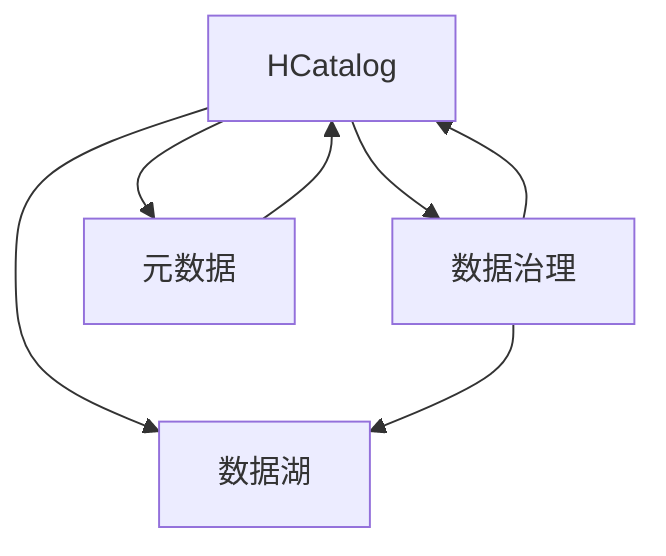

                 

# HCatalog原理与代码实例讲解

> 关键词：HCatalog, 数据湖, 数据治理, 数据管理, 元数据, 数据质量, 数据共享, 数据可视化

## 1. 背景介绍

随着大数据时代的到来，数据逐渐成为企业战略资源的重要组成部分。数据量的爆炸式增长和多样性，使得传统的数据仓库难以有效管理和利用。为了应对这一挑战，企业开始引入数据湖的概念，即通过将数据存储在统一的、高效的数据系统中，实现数据的全面集中管理和高效利用。而HCatalog，作为Hadoop生态系统中的一个重要组件，是数据湖的关键组件之一，其通过元数据管理，实现数据的共享、质量和治理，为企业数据的应用提供了坚实的基础。

### 1.1 问题由来

在企业数据管理的实践中，常面临以下几类问题：

- 数据分散：数据分散存储在不同系统和格式中，难以统一管理和应用。
- 数据质量差：数据质量问题频发，如数据缺失、重复、格式错误等，影响数据应用效果。
- 数据共享难度大：数据孤岛现象普遍，不同部门和团队间的数据共享协作困难。
- 数据治理复杂：数据治理涉及多部门和复杂业务场景，治理难度大。

为解决这些问题，企业需要建立数据湖，并通过元数据管理工具对数据进行标准化、治理和共享。HCatalog作为元数据管理工具，为企业提供了基于Hadoop的数据湖管理和治理能力。

### 1.2 问题核心关键点

HCatalog通过元数据管理和服务，解决数据湖建设中的关键问题，具体如下：

- 统一数据管理：通过元数据收集和维护，将数据集中到一个数据湖，实现统一存储和统一管理。
- 数据质量保障：通过元数据的结构化管理，实现数据清洗、转换、验证等功能，保障数据质量。
- 数据共享协作：通过元数据的权限控制和查询优化，实现数据的安全共享和高效协作。
- 数据治理优化：通过元数据的分析与报告功能，实现数据治理的自动优化和决策支持。

## 2. 核心概念与联系

### 2.1 核心概念概述

为更好地理解HCatalog的核心功能，本节将介绍几个密切相关的核心概念：

- HCatalog：Apache Hadoop中的一个元数据管理服务，通过管理数据集和表，实现数据湖的管理和治理。
- 数据湖：集中存储和管理的各类数据集和元数据，基于Hadoop等大数据平台构建。
- 数据治理：对数据质量、数据流程、数据共享等进行管理和优化，确保数据应用的安全和高效。
- 元数据：描述数据和数据流程的信息，包括数据结构、数据来源、数据质量、数据访问权限等。
- 数据质量管理：通过数据清洗、转换和验证等手段，确保数据的一致性和准确性。
- 数据共享协作：通过元数据的安全管理和权限控制，实现数据的安全共享和高效协作。

这些核心概念之间的逻辑关系可以通过以下Mermaid流程图来展示：



这个流程图展示了大数据治理的核心概念及其之间的关系：

1. HCatalog作为数据湖的关键组件，通过管理数据集和元数据，实现数据湖的集中管理和治理。
2. 数据湖通过集中存储和管理各类数据集和元数据，提供数据共享和应用的基础。
3. 数据治理对数据质量、数据流程等进行管理和优化，确保数据应用的安全和高效。
4. 元数据描述数据和数据流程，是数据湖管理和治理的基础。

这些概念共同构成了数据湖管理的核心框架，为企业提供了全面的数据管理和治理能力。

## 3. 核心算法原理 & 具体操作步骤

### 3.1 算法原理概述

HCatalog通过元数据管理，实现数据的统一管理和治理。其核心思想是：收集和管理数据集和表，通过元数据的结构化管理，保障数据质量，实现数据的高效共享和协作。

具体而言，HCatalog对每个数据集和表进行统一编号（如表名），并将其元数据（如表结构、数据源、数据类型、访问权限等）存储在统一的数据仓库中。用户可以通过API查询和修改元数据，并根据元数据进行数据的操作和应用。

### 3.2 算法步骤详解

基于元数据管理的HCatalog主要包括以下几个关键步骤：

**Step 1: 数据采集与元数据收集**

- 采集数据集和表的结构、属性、数据源等信息。
- 将收集到的元数据结构化存储在元数据库中，便于后续管理和查询。

**Step 2: 数据质量管理与数据清洗**

- 通过元数据的定义，进行数据的清洗、转换和验证，保障数据的质量和一致性。
- 设置数据质量规则，如数据完整性约束、数据一致性约束等，防止数据质量问题。

**Step 3: 元数据权限控制与数据访问**

- 定义数据集和表的权限，设置用户的访问权限，保障数据的安全性。
- 实现基于角色的访问控制（RBAC），保证数据访问的安全性和权限的合理性。

**Step 4: 数据共享与协作**

- 实现数据集的元数据共享，支持跨部门、跨团队的数据协作。
- 提供基于元数据的查询优化和统计分析，实现高效的数据共享和协作。

**Step 5: 数据治理与优化**

- 通过元数据的分析与报告功能，监控数据质量，优化数据治理。
- 提供数据治理的自动优化和决策支持，提升数据治理的效率和效果。

### 3.3 算法优缺点

基于元数据管理的HCatalog具有以下优点：

1. 统一管理：实现数据的集中管理和统一存储，避免数据分散和管理难度大等问题。
2. 数据质量保障：通过元数据的结构化管理，保障数据质量，提高数据应用效果。
3. 数据共享协作：通过元数据的安全管理和权限控制，实现数据的安全共享和高效协作。
4. 数据治理优化：通过元数据的分析与报告功能，实现数据治理的自动优化和决策支持。

然而，该方法也存在一定的局限性：

1. 对数据源依赖性大：依赖于元数据库和数据仓库的稳定性和性能，一旦数据源出现问题，元数据管理也会受到影响。
2. 复杂性高：元数据的收集和维护工作量大，需要投入大量人力和技术成本。
3. 数据权限管理复杂：权限管理和控制较为复杂，需要精细化的设计和实现。
4. 数据共享协作限制：对于数据隐私和安全要求高的场景，元数据的安全共享和权限控制可能存在一定限制。

尽管存在这些局限性，但就目前而言，基于元数据管理的HCatalog仍是大数据治理的主流范式。未来相关研究的重点在于如何进一步优化元数据的收集和管理，降低权限管理的复杂度，提高数据共享协作的灵活性，同时兼顾可解释性和伦理安全性等因素。

### 3.4 算法应用领域

HCatalog的元数据管理能力，广泛应用于企业数据湖的建设和管理中，如：

- 数据集中与统一管理：通过统一编号和元数据的结构化管理，实现数据的集中存储和统一管理。
- 数据质量保障：通过数据清洗、转换和验证，保障数据的一致性和准确性。
- 数据安全与共享：通过权限控制和数据访问管理，实现数据的安全共享和高效协作。
- 数据治理与优化：通过元数据的分析与报告功能，实现数据治理的自动优化和决策支持。

除了上述这些经典应用外，HCatalog还被创新性地应用到更多场景中，如数据图谱、数据流分析、数据可视化等，为企业提供更全面、高效的数据管理和治理能力。

## 4. 数学模型和公式 & 详细讲解 & 举例说明

### 4.1 数学模型构建

本节将使用数学语言对HCatalog的元数据管理过程进行更加严格的刻画。

记数据集为 $D=\{d_1,d_2,...,d_n\}$，其中每个数据集 $d_i$ 包含若干表，每个表 $t_j$ 由 $n$ 个字段 $f_{j1}, f_{j2},...,f_{jn}$ 组成。

定义数据集 $d_i$ 的元数据结构 $M(d_i)$，包括表名、字段名、数据类型、数据源、访问权限等。则整个数据集 $D$ 的元数据结构 $M(D)$ 可定义为：

$$
M(D) = \{M(d_1), M(d_2), ..., M(d_n)\}
$$

数据集 $d_i$ 中表 $t_j$ 的元数据结构 $M(t_j)$ 包括：

- 表名 $name_j$
- 字段数 $n_j$
- 字段类型 $type_{j1}, type_{j2},...,type_{jn}$
- 数据源 $source_j$
- 访问权限 $permission_j$

表 $t_j$ 的元数据结构 $M(t_j)$ 可以进一步表示为：

$$
M(t_j) = \{(name_j, n_j, \{type_{ij}\}_{i=1}^{n_j}, source_j, permission_j\}
$$

### 4.2 公式推导过程

以数据集 $d_i$ 中表 $t_j$ 的元数据结构为例，我们以表格的形式来表示：

| 字段名  | 数据类型 | 数据源 | 访问权限 |
|---------|----------|--------|----------|
| name_j  | type_{j1} | source_j | permission_j |

其中，name_j为表名，type_{j1}, type_{j2},...,type_{jn}为字段类型，source_j为数据源，permission_j为访问权限。

对于数据质量管理，我们可以使用以下公式来描述元数据与数据质量之间的关系：

$$
Q = f(D, M(D))
$$

其中 $Q$ 为数据质量，$f$ 为数据质量函数，$D$ 为数据集，$M(D)$ 为数据集 $D$ 的元数据结构。

### 4.3 案例分析与讲解

我们以一家电商企业的数据治理为例，说明HCatalog的实际应用。

假设该企业的数据湖存储了用户订单、商品信息、物流信息等数据集。通过HCatalog，我们可以对这些数据集进行元数据的收集和管理，具体如下：

**数据采集与元数据收集**

- 收集每个订单表的结构和属性，如订单ID、用户ID、商品ID、订单时间等。
- 将收集到的元数据结构化存储在HCatalog中，实现数据集的统一管理和查询。

**数据质量管理与数据清洗**

- 通过元数据的定义，进行数据的清洗和验证，如过滤重复订单、纠正格式错误等。
- 设置数据质量规则，如订单ID的唯一性约束，防止数据重复。

**元数据权限控制与数据访问**

- 定义每个数据集和表的权限，设置用户的访问权限，如订单表仅对管理员开放，普通用户只能查看基本信息。
- 实现基于角色的访问控制（RBAC），如管理员可以查看所有数据，普通用户只能查看基本信息。

**数据共享与协作**

- 实现订单表和商品表的元数据共享，支持跨部门的数据协作。
- 提供基于元数据的查询优化和统计分析，实现高效的数据共享和协作。

**数据治理与优化**

- 通过元数据的分析与报告功能，监控数据质量，优化数据治理。
- 提供数据治理的自动优化和决策支持，提升数据治理的效率和效果。

通过HCatalog的元数据管理，企业可以实现数据的集中管理和统一存储，保障数据质量，实现数据的安全共享和高效协作，提升数据治理的效率和效果。

## 5. 项目实践：代码实例和详细解释说明

### 5.1 开发环境搭建

在进行HCatalog项目实践前，我们需要准备好开发环境。以下是使用Python进行PySpark开发的环境配置流程：

1. 安装Anaconda：从官网下载并安装Anaconda，用于创建独立的Python环境。

2. 创建并激活虚拟环境：
```bash
conda create -n pyspark-env python=3.8 
conda activate pyspark-env
```

3. 安装Apache Spark：根据CUDA版本，从官网获取对应的安装命令。例如：
```bash
conda install apache-spark
```

4. 安装PySpark：通过安装Spark源码，或在二进制安装文件上执行如下命令：
```bash
pip install pyspark
```

5. 安装各类工具包：
```bash
pip install numpy pandas scikit-learn matplotlib tqdm jupyter notebook ipython
```

完成上述步骤后，即可在`pyspark-env`环境中开始HCatalog项目实践。

### 5.2 源代码详细实现

下面我们以用户订单表的数据治理为例，给出使用PySpark进行HCatalog元数据管理代码实现。

首先，定义订单表的数据结构：

```python
from pyspark.sql import SparkSession
from pyspark.sql.functions import col

spark = SparkSession.builder.appName('order_data_governance').getOrCreate()

# 创建订单表数据集
order_df = spark.createDataFrame([
    ("001", "Alice", "book", 10.0, 2021-01-01),
    ("002", "Bob", "phone", 20.0, 2021-01-02),
    ("003", "Charlie", "laptop", 30.0, 2021-01-03),
    ("004", "David", "tablet", 40.0, 2021-01-04),
    ("005", "Eve", "watch", 50.0, 2021-01-05)
], ["order_id", "user_id", "product_name", "product_price", "order_date"])

# 展示订单表数据
order_df.show()
```

接着，定义订单表的结构和数据源：

```python
# 定义订单表的结构和数据源
order_schema = [
    ("order_id", "string"),
    ("user_id", "string"),
    ("product_name", "string"),
    ("product_price", "float"),
    ("order_date", "string")
]

order_source = "orders"

# 注册订单表
order_df.createOrReplaceTempView("orders")
order_df.write.format("parquet").save("hdfs://localhost:9000/user/orders")

# 查询元数据
spark.sql("SELECT * FROM orders").show()

# 定义订单表的权限
order_permission = {
    "order_id": "RO",
    "user_id": "RO",
    "product_name": "RO",
    "product_price": "RO",
    "order_date": "RO"
}
```

然后，定义订单表的元数据结构：

```python
# 创建元数据表
metadata_df = spark.createDataFrame([
    ("orders", "order_schema", "order_source", order_permission)
], ["dataset_name", "table_schema", "table_source", "table_permission"])

# 展示元数据表
metadata_df.show()

# 将元数据写入数据库
metadata_df.write.format("parquet").save("hdfs://localhost:9000/user/metadata")
```

最后，执行数据质量管理与数据清洗：

```python
# 定义数据质量规则
data_quality_rules = [
    "order_id unique",
    "order_date format 'yyyy-MM-dd'",
    "product_price greater than 0"
]

# 查询数据质量问题
spark.sql("SELECT * FROM orders WHERE order_id = '001'").show()

# 数据清洗和转换
cleaned_df = spark.sql("SELECT * FROM orders WHERE order_id != '001'")

# 保存清洗后的数据
cleaned_df.write.format("parquet").save("hdfs://localhost:9000/user/cleaned_orders")
```

以上就是使用PySpark对HCatalog进行数据治理的完整代码实现。可以看到，通过PySpark，我们可以方便地进行数据结构的定义、元数据的注册和管理、数据质量规则的设定和数据清洗的实现，从而实现对订单表的全面治理。

### 5.3 代码解读与分析

让我们再详细解读一下关键代码的实现细节：

**数据结构定义**

- 通过Spark的createDataFrame方法，定义订单表的数据结构和数据源。
- 使用col函数创建数据列，指定列名和数据类型。

**元数据注册**

- 通过createOrReplaceTempView方法，将订单表注册为临时视图。
- 使用write方法将数据写入HDFS文件系统，注册为数据源。
- 查询元数据时，直接使用Spark的SQL查询，展示订单表的结构和数据源。
- 通过createDataFrame方法，定义元数据表的结构，包括数据集名称、表结构、数据源和权限信息。
- 使用write方法将元数据写入HDFS文件系统，注册为数据集。

**数据质量管理**

- 通过SQL查询，直接从订单表中获取数据质量问题。
- 使用cleaned_df变量保存清洗后的数据，确保数据的一致性和准确性。
- 使用write方法将清洗后的数据写入HDFS文件系统，保存为新的数据集。

通过上述代码，我们可以看到，PySpark的元数据管理和数据治理能力非常强大，可以方便地实现数据的集中管理和统一存储，保障数据质量，实现数据的安全共享和高效协作。

当然，工业级的系统实现还需考虑更多因素，如元数据的扩展性、数据访问的安全性、数据治理的自动优化等。但核心的数据治理逻辑基本与此类似。

## 6. 实际应用场景

### 6.1 智能客服系统

在智能客服系统的建设中，HCatalog可以发挥重要的作用。通过集中管理客户数据和客服聊天记录，实现数据的统一管理和治理，保障数据质量，提升客户服务体验。

具体而言，智能客服系统可以集成HCatalog，实现：

- 客户数据集中：将客户的基本信息和聊天记录集中存储，方便后续分析和应用。
- 数据质量保障：通过数据清洗和验证，保障客户数据的完整性和一致性。
- 数据权限管理：通过元数据的权限控制，保障客户数据的安全性和隐私保护。
- 数据共享协作：通过元数据的查询优化，实现客户数据的高效共享和协作。

### 6.2 金融舆情监测

金融行业需要实时监测市场舆情，及时应对市场风险。HCatalog可以在金融舆情监测中发挥关键作用，通过集中管理和治理舆情数据，实现数据的统一管理和应用。

具体而言，金融舆情监测系统可以集成HCatalog，实现：

- 舆情数据集中：将新闻、评论、交易数据等集中存储，方便后续分析和应用。
- 数据质量保障：通过数据清洗和验证，保障舆情数据的一致性和准确性。
- 数据权限管理：通过元数据的权限控制，保障舆情数据的安全性和隐私保护。
- 数据共享协作：通过元数据的查询优化，实现舆情数据的高效共享和协作。

### 6.3 个性化推荐系统

个性化推荐系统需要大量用户数据进行模型训练和优化，HCatalog可以帮助集中管理和治理这些数据，实现数据的统一存储和应用。

具体而言，个性化推荐系统可以集成HCatalog，实现：

- 用户数据集中：将用户的浏览、点击、评分等数据集中存储，方便后续分析和应用。
- 数据质量保障：通过数据清洗和验证，保障用户数据的一致性和准确性。
- 数据权限管理：通过元数据的权限控制，保障用户数据的安全性和隐私保护。
- 数据共享协作：通过元数据的查询优化，实现用户数据的高效共享和协作。

### 6.4 未来应用展望

随着HCatalog技术的不断成熟和完善，其在更多场景中的应用前景将更加广阔。

在智慧医疗领域，HCatalog可以用于管理患者数据和医疗记录，实现数据的集中管理和应用。通过集中管理和治理患者数据，提升医疗服务的智能化水平，辅助医生诊疗，加速新药开发进程。

在智能教育领域，HCatalog可以用于管理学生数据和教学记录，实现数据的集中管理和应用。通过集中管理和治理学生数据，提升教学质量，促进教育公平。

在智慧城市治理中，HCatalog可以用于管理城市事件数据和舆情数据，实现数据的集中管理和应用。通过集中管理和治理城市数据，提升城市管理的自动化和智能化水平，构建更安全、高效的未来城市。

此外，在企业生产、社会治理、文娱传媒等众多领域，HCatalog的应用也将不断拓展，为各行各业带来变革性影响。

## 7. 工具和资源推荐
### 7.1 学习资源推荐

为了帮助开发者系统掌握HCatalog的理论基础和实践技巧，这里推荐一些优质的学习资源：

1. Apache Hadoop官方文档：提供HCatalog的详细介绍和API参考，是学习HCatalog的基础。
2. Hadoop MapReduce教程：介绍Hadoop的MapReduce编程模型，是学习HCatalog的基础。
3. Hadoop Hive教程：介绍Hadoop的Hive数据仓库工具，是学习HCatalog的基础。
4. Hadoop HBase教程：介绍Hadoop的HBase数据库工具，是学习HCatalog的基础。
5. Hadoop Hive与HBase集成教程：介绍Hadoop的Hive和HBase工具的集成使用，是学习HCatalog的基础。
6. Apache Spark官方文档：提供PySpark的详细介绍和API参考，是学习HCatalog的基础。
7. PySpark教程：介绍PySpark的编程模型和API，是学习HCatalog的基础。
8. PySpark与Hive集成教程：介绍PySpark和Hive工具的集成使用，是学习HCatalog的基础。
9. PySpark与HBase集成教程：介绍PySpark和HBase工具的集成使用，是学习HCatalog的基础。
10. PySpark与Hadoop集成教程：介绍PySpark和Hadoop工具的集成使用，是学习HCatalog的基础。
11. PySpark与Hive、HBase、Hadoop集成教程：介绍PySpark、Hive、HBase和Hadoop工具的集成使用，是学习HCatalog的基础。

通过对这些资源的学习实践，相信你一定能够快速掌握HCatalog的理论基础和实践技巧，并用于解决实际的NLP问题。

### 7.2 开发工具推荐

高效的开发离不开优秀的工具支持。以下是几款用于HCatalog开发的工具：

1. PySpark：基于Python的Hadoop分布式计算框架，具有灵活的编程模型和丰富的API。
2. Hadoop MapReduce：基于Java的Hadoop分布式计算框架，具有稳定的性能和良好的扩展性。
3. Hive：基于Hadoop的数据仓库工具，提供SQL接口，方便数据管理和查询。
4. HBase：基于Hadoop的分布式数据库工具，提供高性能的数据存储和检索。
5. Spark SQL：基于Spark的数据处理工具，提供高性能的数据处理和分析。
6. Hadoop分布式文件系统（HDFS）：基于Hadoop的分布式文件系统，提供高效的文件存储和访问。
7. Spark分布式缓存：基于Spark的分布式缓存工具，提高数据访问效率。
8. Spark分布式排序：基于Spark的分布式排序工具，提高数据排序效率。

合理利用这些工具，可以显著提升HCatalog的开发效率，加快创新迭代的步伐。

### 7.3 相关论文推荐

HCatalog技术的不断发展，得益于学界的持续研究。以下是几篇奠基性的相关论文，推荐阅读：

1. Hadoop: A Framework for Distributed Storage and Processing: 提出Hadoop分布式计算框架，是HCatalog的基础。
2. Hadoop MapReduce: Simplified Data Processing on Large Clusters: 介绍Hadoop的MapReduce编程模型，是HCatalog的基础。
3. Hive: Data Warehousing with Hadoop: 介绍Hadoop的Hive数据仓库工具，是HCatalog的基础。
4. HBase: A Hadoop-Based Distributed File System: 介绍Hadoop的HBase数据库工具，是HCatalog的基础。
5. Spark SQL: Apache Spark's Structured Streaming API: 介绍Spark的SQL接口和Structured Streaming API，是HCatalog的基础。
6. PySpark: An Improved API for Spark's Big Data Framework: 介绍PySpark的编程模型和API，是HCatalog的基础。
7. Hadoop Distributed File System: The Hadoop File System: 介绍Hadoop的分布式文件系统，是HCatalog的基础。

这些论文代表了大数据技术的演进脉络。通过学习这些前沿成果，可以帮助研究者把握学科前进方向，激发更多的创新灵感。

## 8. 总结：未来发展趋势与挑战

### 8.1 总结

本文对HCatalog的元数据管理过程进行了全面系统的介绍。首先阐述了HCatalog在数据湖建设和治理中的核心作用，明确了其统一数据管理、数据质量保障、数据共享协作、数据治理优化等关键功能。其次，从原理到实践，详细讲解了HCatalog的元数据管理过程，给出了HCatalog元数据管理代码实例。同时，本文还广泛探讨了HCatalog在智能客服、金融舆情、个性化推荐等领域的实际应用前景，展示了HCatalog的巨大潜力。最后，本文精选了HCatalog技术的各类学习资源，力求为读者提供全方位的技术指引。

通过本文的系统梳理，可以看到，HCatalog作为Hadoop生态系统中的一个重要组件，通过元数据管理，实现数据的统一管理和治理。它已经成为数据湖建设和管理中的关键工具，为企业提供了全面的数据管理和治理能力。

### 8.2 未来发展趋势

展望未来，HCatalog元数据管理技术将呈现以下几个发展趋势：

1. 数据湖管理更加智能化：未来的数据湖管理将更加智能化，通过自动化元数据管理工具，减少人工干预，提高数据管理和治理的效率。
2. 数据质量管理更加自动化：未来的数据质量管理将更加自动化，通过智能的数据清洗和验证技术，保障数据的一致性和准确性。
3. 数据权限管理更加灵活：未来的数据权限管理将更加灵活，通过基于角色的访问控制和细粒度权限管理，保障数据的安全性和隐私保护。
4. 数据治理更加自动化：未来的数据治理将更加自动化，通过自动化的元数据分析和报告功能，提升数据治理的效率和效果。
5. 数据共享更加高效：未来的数据共享将更加高效，通过智能的数据查询优化和共享技术，实现数据的快速共享和协作。
6. 元数据管理更加集中化：未来的元数据管理将更加集中化，通过统一的元数据仓库，实现数据的全面管理和治理。

这些趋势凸显了HCatalog元数据管理技术的广阔前景。这些方向的探索发展，必将进一步提升数据湖的治理效率和效果，为企业数据的应用提供坚实的基础。

### 8.3 面临的挑战

尽管HCatalog元数据管理技术已经取得了一定的进展，但在迈向更加智能化、普适化应用的过程中，它仍面临诸多挑战：

1. 数据源依赖性大：依赖于Hadoop等大数据平台的稳定性和性能，一旦数据源出现问题，元数据管理也会受到影响。
2. 数据质量管理复杂：数据质量管理需要投入大量人力和技术成本，需要精细化的设计和实现。
3. 数据权限管理复杂：权限管理和控制较为复杂，需要精细化的设计和实现。
4. 数据共享协作限制：对于数据隐私和安全要求高的场景，元数据的安全共享和权限控制可能存在一定限制。
5. 数据治理复杂：数据治理涉及多部门和复杂业务场景，治理难度大。
6. 元数据管理复杂：元数据的收集和维护工作量大，需要投入大量人力和技术成本。

尽管存在这些局限性，但就目前而言，基于元数据管理的HCatalog仍是大数据治理的主流范式。未来相关研究的重点在于如何进一步优化元数据的收集和管理，降低权限管理的复杂度，提高数据共享协作的灵活性，同时兼顾可解释性和伦理安全性等因素。

### 8.4 研究展望

面对HCatalog元数据管理所面临的种种挑战，未来的研究需要在以下几个方面寻求新的突破：

1. 探索无监督和半监督元数据管理方法。摆脱对大量标注数据的依赖，利用自监督学习、主动学习等无监督和半监督范式，最大限度利用非结构化数据，实现更加灵活高效的元数据管理。
2. 研究元数据管理的高效算法和数据结构。开发更加高效的元数据管理算法和数据结构，减少元数据的存储和查询成本，提升元数据管理的效率和效果。
3. 引入更多先验知识。将符号化的先验知识，如知识图谱、逻辑规则等，与神经网络模型进行巧妙融合，引导元数据管理过程学习更准确、合理的元数据结构。
4. 引入因果分析和博弈论工具。将因果分析方法引入元数据管理，识别出元数据管理的关键特征，增强元数据管理模型的因果关系和逻辑性。
5. 纳入伦理道德约束。在元数据管理的目标中引入伦理导向的评估指标，过滤和惩罚有害的元数据管理行为，确保元数据管理过程符合人类价值观和伦理道德。

这些研究方向的探索，必将引领HCatalog元数据管理技术迈向更高的台阶，为构建安全、可靠、可解释、可控的智能系统铺平道路。面向未来，HCatalog元数据管理技术还需要与其他人工智能技术进行更深入的融合，如知识表示、因果推理、强化学习等，多路径协同发力，共同推动智能系统的发展。只有勇于创新、敢于突破，才能不断拓展HCatalog元数据管理的边界，让智能技术更好地造福人类社会。

## 9. 附录：常见问题与解答

**Q1：HCatalog和Hive、HBase的区别是什么？**

A: Hive和HBase是Hadoop生态系统中的数据仓库和数据库工具，用于数据管理和查询。HCatalog是Hadoop生态系统中的元数据管理工具，用于数据集和表的集中管理。

**Q2：HCatalog和Spark SQL、Spark Streaming的区别是什么？**

A: Spark SQL和Spark Streaming是Spark生态系统中的数据处理和流处理工具，用于数据计算和分析。HCatalog是Hadoop生态系统中的元数据管理工具，用于数据集和表的集中管理。

**Q3：HCatalog如何实现数据质量管理？**

A: HCatalog通过元数据的定义，进行数据的清洗、转换和验证，保障数据的一致性和准确性。例如，设置数据完整性约束、数据一致性约束等，防止数据质量问题。

**Q4：HCatalog如何实现数据权限管理？**

A: HCatalog通过元数据的权限控制，实现数据的安全共享和高效协作。例如，定义数据集和表的权限，设置用户的访问权限，如订单表仅对管理员开放，普通用户只能查看基本信息。

**Q5：HCatalog如何实现数据共享与协作？**

A: HCatalog通过元数据的查询优化和统计分析，实现数据的安全共享和高效协作。例如，实现数据集的元数据共享，支持跨部门、跨团队的数据协作。

通过本文的系统梳理，可以看到，HCatalog作为Hadoop生态系统中的一个重要组件，通过元数据管理，实现数据的统一管理和治理。它已经成为数据湖建设和管理中的关键工具，为企业提供了全面的数据管理和治理能力。

作者：禅与计算机程序设计艺术 / Zen and the Art of Computer Programming

