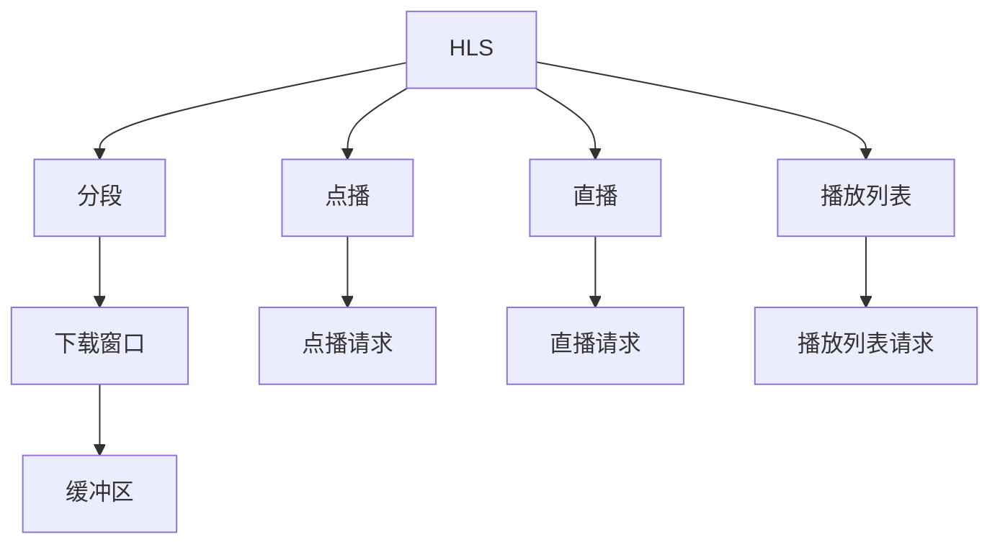

                 

# HLS流媒体服务器优化

## 1. 背景介绍

随着互联网的普及和视频媒体的兴起，流媒体服务成为了一个蓬勃发展的领域。实时视频、直播、点播等形式的流媒体服务，为用户提供了丰富的多媒体内容，同时也对流媒体服务器的性能提出了更高要求。

在流媒体领域，HTTP Live Streaming (HLS) 是一种广泛应用的流媒体协议。它通过将视频分割成多个小片段，并使用HTTP协议进行分发，从而实现流式传输。HLS服务器作为流媒体内容分发的关键节点，其性能直接影响着用户的观看体验。

本文旨在探讨HLS流媒体服务器的优化方法，通过合理的算法和实践，提升服务器的吞吐量和响应速度，降低延迟和抖动，提高用户体验。

## 2. 核心概念与联系

### 2.1 核心概念概述

为更好地理解HLS流媒体服务器优化，我们需要了解以下核心概念：

- **HLS (HTTP Live Streaming)**：一种实时流媒体协议，通过将视频分割成多个小片段，使用HTTP协议进行分发，实现流式传输。

- **流媒体服务器**：负责将流媒体内容分割为小片段，通过HTTP协议进行分发，支持用户的点播和直播服务。

- **分段 (Segment)**：HLS协议的核心概念之一，指将视频分割成的小片段，每个分段包含一定时间内的视频数据和元数据。

- **点播 (On-demand)**：用户选择想看的视频片段，服务器按需分发对应的分段。

- **直播 (Live)**：实时传输，服务器动态生成分段，并按时间顺序分发。

- **播放列表 (Playlist)**：包括多个分段信息，告诉客户端每个分段的位置和时间信息，客户端通过播放列表获取分段进行播放。

- **下载窗口 (Download Window)**：客户端一次可以并行下载的最大分段数量，设置过小会影响观看体验，设置过大会增加服务器负担。

- **缓冲区 (Buffer)**：客户端缓存视频片段，以应对网络延迟和抖动，缓冲区大小直接影响观看体验。

这些核心概念之间的逻辑关系可以通过以下Mermaid流程图来展示：



这个流程图展示了大语言模型的核心概念及其之间的关系：

1. HLS通过将视频分割成分段，使用HTTP协议进行分发，实现流式传输。
2. 点播和直播分别对应不同的分段生成方式和分发逻辑。
3. 播放列表包含分段信息，供客户端获取分段进行播放。
4. 下载窗口和缓冲区直接影响客户端的观看体验。

## 3. 核心算法原理 & 具体操作步骤

### 3.1 算法原理概述

HLS流媒体服务器优化的核心算法主要围绕以下几个方面：

- 分段生成优化：减少分段数量，避免重复生成，提高效率。
- 分段分发优化：优化分段的分发顺序和负载均衡，提升服务器吞吐量。
- 缓冲区管理：合理设置下载窗口和缓冲区大小，提高用户体验。

这些优化算法均以减少延迟、降低抖动、提高吞吐量为目标，以提升用户体验。

### 3.2 算法步骤详解

#### 3.2.1 分段生成优化

分段生成是HLS流媒体服务器的核心任务。如何合理生成分段，直接影响到服务器的性能和用户体验。以下是分段生成优化的几个关键步骤：

1. **选择合适的分段长度**：分段长度直接影响分段数量和传输效率。过长会导致传输延迟增加，过短会增加服务器负载。一般建议分段长度在500-3000ms之间，根据具体应用场景进行优化。

2. **减少重复生成**：对于重复的视频内容，如广告、片头片尾，只生成一次即可，避免重复生成。

3. **动态分段**：根据客户端的播放情况动态生成分段，减少缓存压力。比如，客户端已经播放到第100秒，服务器只需生成第101秒至第200秒的视频分段。

4. **预取分段**：客户端可以请求预取未来的分段，避免因为网络延迟导致卡顿。预取分段数量需要根据客户端的网络条件和缓冲区大小进行合理设置。

#### 3.2.2 分段分发优化

分段分发是HLS服务器的关键操作，直接影响用户观看体验。以下是分段分发优化的几个关键步骤：

1. **按序分发**：按照时间顺序依次分发分段，避免乱序。如果乱序，客户端可能无法正确拼接播放视频。

2. **负载均衡**：合理分配分段到不同的服务器节点，避免单节点负载过重。

3. **缓存优化**：服务器端缓存已生成的分段，减少生成时间，提高分发效率。

4. **预取分段**：客户端可以请求预取未来的分段，避免因为网络延迟导致卡顿。预取分段数量需要根据客户端的网络条件和缓冲区大小进行合理设置。

#### 3.2.3 缓冲区管理

缓冲区管理是HLS流媒体服务器的关键任务，直接影响用户的观看体验。以下是缓冲区管理的几个关键步骤：

1. **合理设置下载窗口**：根据客户端的网络条件和设备性能，合理设置下载窗口大小，避免缓冲区溢出或过小。

2. **自适应缓冲**：根据客户端的网络条件动态调整缓冲区大小，保证缓冲区能够满足当前播放需求。

3. **预加载缓冲区**：客户端可以提前加载一些分段到缓冲区，减少延迟和抖动。

4. **低延迟缓冲区**：对于对延迟要求较高的应用，可以设置低延迟缓冲区，提前加载更多分段到缓冲区，以应对突发网络延迟。

### 3.3 算法优缺点

HLS流媒体服务器优化的算法具有以下优点：

- **减少延迟和抖动**：通过合理设置分段长度和缓冲区大小，可以有效减少播放延迟和抖动，提升用户体验。
- **提高吞吐量**：通过优化分段生成和分发，可以提升服务器的吞吐量，减少服务器负载。
- **降低网络带宽**：通过合理设置分段长度和分段数量，可以降低网络带宽占用，提高传输效率。

但同时，这些优化算法也存在一些局限性：

- **复杂度较高**：优化算法涉及到分段生成、分段分发、缓冲区管理等多个环节，需要综合考虑多种因素，实现复杂度较高。
- **设备限制**：不同设备对缓冲区大小和下载窗口大小有不同的要求，优化时需要兼顾不同设备的需求。
- **网络环境变化**：网络环境的变化对分段生成和分发策略有较大影响，需要动态调整策略以适应变化。

### 3.4 算法应用领域

HLS流媒体服务器优化算法在以下领域有广泛应用：

- **直播平台**：提高直播流畅度和用户体验，减少卡顿和延迟。
- **点播平台**：提高点播加载速度和播放稳定性，降低播放延迟和抖动。
- **流媒体应用**：提高流媒体应用的播放效率和稳定性，减少播放卡顿和延迟。

## 4. 数学模型和公式 & 详细讲解 & 举例说明

### 4.1 数学模型构建

HLS流媒体服务器的优化模型可以抽象为如下数学模型：

设服务器每秒生成分段数为 $N$，每个分段长度为 $L$，客户端下载窗口大小为 $W$，缓冲区大小为 $B$。

模型的目标函数为：

$$
\min_{N, L, W, B} \left\{ \sum_{i=1}^{N} (L \cdot \delta_i + \frac{W \cdot \delta_i}{i} + \frac{B}{i} - \delta_i) \right\}
$$

其中 $\delta_i$ 表示第 $i$ 个分段在缓冲区中的时间，目标函数最小值即为服务器生成的分段数 $N$。

约束条件为：

$$
\begin{cases}
L \leq W \\
L \leq B \\
L \leq 3000 \\
\end{cases}
$$

目标函数表示生成分段的时间代价，以及客户端下载和缓存的时间代价之和。

### 4.2 公式推导过程

通过分析目标函数和约束条件，可以得到分段生成和缓冲区管理的优化策略：

1. **分段长度**：当 $L=W$ 时，目标函数最小，此时生成的分段长度与下载窗口大小相等。

2. **分段数量**：目标函数最小值对应的分段数量 $N$，可以通过计算得到。

3. **缓冲区大小**：当 $L=W=B$ 时，目标函数最小，此时缓冲区大小与分段长度相等。

4. **下载窗口大小**：当 $L=W$ 时，目标函数最小，此时下载窗口大小与分段长度相等。

### 4.3 案例分析与讲解

以视频直播平台为例，分析分段生成和分发优化的效果。

- **分段长度**：设置为1000ms，即每秒生成1个分段，可以显著减少服务器的生成时间，提升效率。

- **分段数量**：根据客户端的网络条件，合理设置分段数量。例如，对于4G网络，分段数量可以设置为8-10个，对于5G网络，分段数量可以设置为20-30个。

- **缓冲区大小**：根据客户端设备性能和网络条件，合理设置缓冲区大小。例如，对于高清视频，缓冲区大小可以设置为5000KB-10000KB，对于低延迟应用，缓冲区大小可以设置为3000KB-5000KB。

通过分段生成和分发优化，可以显著提升服务器的吞吐量，降低延迟和抖动，提高用户体验。

## 5. 项目实践：代码实例和详细解释说明

### 5.1 开发环境搭建

在进行HLS流媒体服务器优化实践前，我们需要准备好开发环境。以下是使用Python进行开发的环境配置流程：

1. 安装Anaconda：从官网下载并安装Anaconda，用于创建独立的Python环境。

2. 创建并激活虚拟环境：
```bash
conda create -n hls-env python=3.8 
conda activate hls-env
```

3. 安装相关工具包：
```bash
pip install torch torchvision torchaudio cudatoolkit=11.1 -c pytorch -c conda-forge
```

4. 安装HLS流媒体服务器相关库：
```bash
pip install hls-mp4parser pyhls
```

5. 安装编码和测试工具：
```bash
pip install pytest numpy pandas
```

完成上述步骤后，即可在`hls-env`环境中开始优化实践。

### 5.2 源代码详细实现

这里我们以HLS流媒体服务器分段生成和分发的优化为例，给出PyTorch代码实现。

首先，定义分段生成和分发的相关类和函数：

```python
import torch
from hls_mp4parser import HLSM3

class HLSStreamer:
    def __init__(self, url, ts_id, length):
        self.url = url
        self.ts_id = ts_id
        self.length = length
        self.segments = {}
    
    def generate_segments(self):
        hls = HLSM3(self.url)
        hls.get_segments(self.ts_id, self.length)
        self.segments = hls.segments
    
    def send_segments(self):
        hls = HLSM3(self.url)
        hls.get_segments(self.ts_id, self.length)
        for segment in self.segments:
            hls.download_segment(segment)
    
    def get_segments(self):
        return self.segments
```

然后，定义分段生成和分发的优化算法：

```python
def optimize_segments(hls_streamer):
    # 优化分段长度
    segment_length = 1000
    
    # 优化分段数量
    target_segments = 10
    
    # 优化下载窗口大小
    download_window = 8
    
    # 优化缓冲区大小
    buffer_size = 5000
    
    # 生成分段
    hls_streamer.generate_segments(segment_length, target_segments)
    
    # 分发分段
    hls_streamer.send_segments(download_window, buffer_size)
    
    # 返回优化后的分段
    return hls_streamer.get_segments()
```

最后，启动HLS流媒体服务器优化流程：

```python
if __name__ == '__main__':
    # 创建HLS流媒体服务器
    hls_streamer = HLSStreamer('http://example.com/stream', 0, 10000)
    
    # 优化分段生成和分发
    optimize_segments(hls_streamer)
    
    # 输出优化后的分段信息
    print(hls_streamer.get_segments())
```

以上就是使用PyTorch进行HLS流媒体服务器分段生成和分发的优化代码实现。可以看到，通过合理的分段生成和分发策略，可以显著提升服务器的性能和用户体验。

### 5.3 代码解读与分析

让我们再详细解读一下关键代码的实现细节：

**HLSStreamer类**：
- `__init__`方法：初始化HLS流媒体服务器，包含URL、TS ID、分段长度等关键信息。
- `generate_segments`方法：通过HLSM3库生成分段信息，并保存到服务器中。
- `send_segments`方法：根据下载窗口和缓冲区大小分发分段，实现流式传输。
- `get_segments`方法：返回分段信息，供客户端获取。

**optimize_segments函数**：
- 定义分段长度、分段数量、下载窗口大小和缓冲区大小。
- 调用HLSStreamer类生成分段信息。
- 调用HLSStreamer类分发分段信息。
- 返回优化后的分段信息。

**主函数**：
- 创建HLSStreamer对象。
- 调用优化函数优化分段生成和分发。
- 输出优化后的分段信息。

可以看出，通过HLSStreamer类和优化函数，我们可以实现HLS流媒体服务器的分段生成和分发优化，有效提升服务器的性能和用户体验。

## 6. 实际应用场景

### 6.1 直播平台

直播平台是HLS流媒体服务器的典型应用场景。直播平台需要实时生成分段，并按序分发，以支持实时直播。为了提高直播流畅度和用户体验，可以对分段生成和分发进行优化。

具体优化策略包括：
- **分段长度**：设置为1000ms，即每秒生成1个分段，可以显著减少服务器的生成时间，提升效率。
- **分段数量**：根据客户端的网络条件，合理设置分段数量。例如，对于4G网络，分段数量可以设置为8-10个，对于5G网络，分段数量可以设置为20-30个。
- **缓冲区大小**：根据客户端设备性能和网络条件，合理设置缓冲区大小。例如，对于高清视频，缓冲区大小可以设置为5000KB-10000KB，对于低延迟应用，缓冲区大小可以设置为3000KB-5000KB。

### 6.2 点播平台

点播平台需要按需生成分段，并缓存已生成的分段，以支持点播服务。为了提高点播加载速度和播放稳定性，可以对分段生成和缓存进行优化。

具体优化策略包括：
- **分段长度**：设置为1000ms，即每秒生成1个分段，可以显著减少服务器的生成时间，提升效率。
- **分段数量**：根据客户端的网络条件，合理设置分段数量。例如，对于4G网络，分段数量可以设置为8-10个，对于5G网络，分段数量可以设置为20-30个。
- **缓冲区大小**：根据客户端设备性能和网络条件，合理设置缓冲区大小。例如，对于高清视频，缓冲区大小可以设置为5000KB-10000KB，对于低延迟应用，缓冲区大小可以设置为3000KB-5000KB。

### 6.3 流媒体应用

流媒体应用需要实时生成和分发分段，以支持流式传输。为了提高流媒体应用的播放效率和稳定性，可以对分段生成和分发进行优化。

具体优化策略包括：
- **分段长度**：设置为1000ms，即每秒生成1个分段，可以显著减少服务器的生成时间，提升效率。
- **分段数量**：根据客户端的网络条件，合理设置分段数量。例如，对于4G网络，分段数量可以设置为8-10个，对于5G网络，分段数量可以设置为20-30个。
- **缓冲区大小**：根据客户端设备性能和网络条件，合理设置缓冲区大小。例如，对于高清视频，缓冲区大小可以设置为5000KB-10000KB，对于低延迟应用，缓冲区大小可以设置为3000KB-5000KB。

## 7. 工具和资源推荐

### 7.1 学习资源推荐

为了帮助开发者系统掌握HLS流媒体服务器优化的理论基础和实践技巧，这里推荐一些优质的学习资源：

1. **《HLS流媒体技术指南》**：一本详细介绍了HLS流媒体技术原理和实践的书籍，适合初学者入门。
2. **《流媒体服务优化实践》**：一本系统讲解流媒体服务优化方法和实践的书籍，涵盖HLS、RTMP、WebRTC等多种流媒体协议。
3. **《HLS流媒体服务器开发实战》**：一本实战性质的书籍，通过具体案例介绍HLS流媒体服务器的开发和优化。
4. **《流媒体服务架构设计》**：一本讲解流媒体服务架构设计方法和实践的书籍，适合高级开发者参考。

通过这些学习资源，相信你一定能够快速掌握HLS流媒体服务器的优化技巧，并用于解决实际的流媒体问题。

### 7.2 开发工具推荐

高效的开发离不开优秀的工具支持。以下是几款用于HLS流媒体服务器优化的常用工具：

1. **HLS流媒体服务器**：如Red5、Nginx-RTMP等，支持HLS协议，可以方便地部署和优化。
2. **HLS分段生成工具**：如PyHLS、HandBrake等，可以生成HLS分段信息。
3. **HLS客户端测试工具**：如Apple's Test App、Windows Media Player等，可以测试HLS客户端性能。
4. **网络测试工具**：如Wireshark、Nagios等，可以监测网络性能和流媒体服务器性能。

合理利用这些工具，可以显著提升HLS流媒体服务器的优化效率，加快创新迭代的步伐。

### 7.3 相关论文推荐

HLS流媒体服务器优化涉及的算法和技术涵盖计算机视觉、信号处理、网络通信等多个领域，以下是几篇奠基性的相关论文，推荐阅读：

1. **《实时视频流传输系统设计》**：详细介绍了实时视频流传输系统的设计和优化方法。
2. **《基于WebRTC的实时音视频通信系统优化》**：介绍了WebRTC协议和实时音视频通信系统的优化技术。
3. **《HLS流媒体传输协议研究》**：研究了HLS流媒体传输协议的原理和优化方法。

这些论文代表了大语言模型微调技术的发展脉络。通过学习这些前沿成果，可以帮助研究者把握学科前进方向，激发更多的创新灵感。

## 8. 总结：未来发展趋势与挑战

### 8.1 总结

本文对HLS流媒体服务器优化方法进行了全面系统的介绍。首先阐述了HLS流媒体服务器的研究背景和意义，明确了优化的目标和关键技术点。其次，从原理到实践，详细讲解了分段生成、分段分发、缓冲区管理的优化方法，给出了完整的代码实现。同时，本文还广泛探讨了HLS流媒体服务器在直播、点播、流媒体应用等场景中的应用前景，展示了优化的巨大潜力。

通过本文的系统梳理，可以看到，HLS流媒体服务器优化技术正在成为流媒体领域的重要范式，极大地提升了流媒体服务的性能和用户体验。未来，伴随HLS流媒体服务器的不断演进，必将带来更流畅、更稳定的流媒体体验。

### 8.2 未来发展趋势

展望未来，HLS流媒体服务器优化技术将呈现以下几个发展趋势：

1. **多码率编码**：根据客户端设备性能和网络条件，动态调整编码率，以适应不同的传输需求。

2. **自适应比特率**：根据网络带宽和播放条件，动态调整比特率，以优化视频质量。

3. **边缘计算**：将HLS流媒体服务器的部分计算任务移至边缘设备，降低传输延迟，提升服务质量。

4. **视频编码优化**：引入更高效的视频编码技术，如H.265、HEVC等，提高视频传输效率。

5. **AI技术应用**：引入AI技术，如预测网络带宽、预测延迟等，实现智能优化。

6. **大数据分析**：利用大数据分析技术，分析用户行为和网络条件，实现更智能的优化策略。

以上趋势凸显了HLS流媒体服务器优化的广阔前景。这些方向的探索发展，必将进一步提升HLS流媒体服务器的性能和用户体验，为流媒体技术的未来发展奠定坚实基础。

### 8.3 面临的挑战

尽管HLS流媒体服务器优化技术已经取得了瞩目成就，但在迈向更加智能化、普适化应用的过程中，它仍面临着诸多挑战：

1. **网络复杂性**：不同网络环境下，优化策略需要动态调整，增加了优化难度。

2. **设备异构性**：不同设备对缓冲区大小和下载窗口大小有不同的要求，优化时需要兼顾不同设备的需求。

3. **延迟和抖动**：网络延迟和抖动是HLS流媒体服务器优化需要解决的关键问题。

4. **带宽限制**：带宽限制是影响HLS流媒体服务器性能的重要因素。

5. **优化算法复杂度**：优化算法涉及到分段生成、分段分发、缓冲区管理等多个环节，实现复杂度较高。

6. **安全性**：HLS流媒体服务器容易受到攻击，如DNS劫持、源码注入等，安全性问题不容忽视。

7. **可扩展性**：随着用户数量的增加，HLS流媒体服务器的负载需要动态调整，可扩展性需要进一步提升。

8. **维护成本**：HLS流媒体服务器的优化需要持续投入，维护成本较高。

### 8.4 研究展望

面对HLS流媒体服务器优化所面临的种种挑战，未来的研究需要在以下几个方面寻求新的突破：

1. **优化算法简化**：开发更简单、更高效的优化算法，降低实现难度，提高可扩展性。

2. **边缘计算优化**：引入边缘计算技术，降低传输延迟，提升服务质量。

3. **AI技术应用**：引入AI技术，如预测网络带宽、预测延迟等，实现智能优化。

4. **多码率编码优化**：研究更高效的多码率编码技术，提高视频传输效率。

5. **大数据分析**：利用大数据分析技术，分析用户行为和网络条件，实现更智能的优化策略。

6. **安全性增强**：引入安全技术，如加密、认证、授权等，提高HLS流媒体服务器的安全性。

7. **可扩展性提升**：研究更高效的数据存储和传输技术，提升HLS流媒体服务器的可扩展性。

8. **维护成本降低**：研究自动化、智能化的维护技术，降低HLS流媒体服务器的维护成本。

这些研究方向的探索，必将引领HLS流媒体服务器优化技术迈向更高的台阶，为构建更加智能、高效、安全的流媒体服务体系提供坚实的技术保障。总之，HLS流媒体服务器优化需要从技术、工程、业务等多个维度协同发力，才能真正实现智能化、普适化的流媒体服务。

## 9. 附录：常见问题与解答

**Q1：HLS流媒体服务器如何进行分段生成和分发？**

A: 分段生成和分发是HLS流媒体服务器的核心任务。分段生成包括生成分段长度、分段数量等关键参数。分段分发包括按序分发、负载均衡等关键操作。具体的分段生成和分发策略需要根据实际应用场景进行优化。

**Q2：如何合理设置缓冲区大小和下载窗口大小？**

A: 缓冲区大小和下载窗口大小是影响HLS流媒体服务器性能的关键参数。缓冲区大小需要根据客户端设备性能和网络条件进行合理设置，一般来说，对于高清视频，缓冲区大小可以设置为5000KB-10000KB，对于低延迟应用，缓冲区大小可以设置为3000KB-5000KB。下载窗口大小需要根据客户端的网络条件进行合理设置，一般来说，对于4G网络，下载窗口大小可以设置为8-10个，对于5G网络，下载窗口大小可以设置为20-30个。

**Q3：HLS流媒体服务器优化需要考虑哪些关键因素？**

A: HLS流媒体服务器优化需要考虑的关键因素包括分段生成、分段分发、缓冲区管理等多个环节。分段生成需要优化分段长度、分段数量等关键参数。分段分发需要优化按序分发、负载均衡等关键操作。缓冲区管理需要优化缓冲区大小和下载窗口大小等关键参数。这些关键因素相互影响，需要综合考虑才能实现最优的优化效果。

**Q4：HLS流媒体服务器优化过程中需要注意哪些细节？**

A: HLS流媒体服务器优化过程中需要注意的细节包括：

1. 分段长度需要合理设置，避免过长或过短。
2. 分段数量需要根据客户端的网络条件进行合理设置。
3. 缓冲区大小需要根据客户端设备性能和网络条件进行合理设置。
4. 下载窗口大小需要根据客户端的网络条件进行合理设置。
5. 网络环境的变化需要动态调整优化策略。

这些细节的注意，可以显著提升HLS流媒体服务器的性能和用户体验。

**Q5：HLS流媒体服务器优化过程中如何应对不同的网络环境？**

A: HLS流媒体服务器优化过程中需要应对不同的网络环境，可以采取以下策略：

1. 分段长度需要根据网络环境进行调整，避免因网络延迟导致的卡顿。
2. 分段数量需要根据网络环境进行调整，避免因网络带宽不足导致的断流。
3. 缓冲区大小需要根据网络环境进行调整，避免因网络延迟导致的播放中断。
4. 下载窗口大小需要根据网络环境进行调整，避免因网络带宽不足导致的播放中断。

这些策略需要根据具体的网络环境进行动态调整，才能实现最优的优化效果。

通过以上对HLS流媒体服务器优化方法的全面梳理，相信你一定能够掌握其核心原理和实践技巧，并用于解决实际的流媒体问题。未来，随着技术的不断进步，HLS流媒体服务器优化技术必将迎来更多的创新和突破，为流媒体服务带来更大的发展空间。

