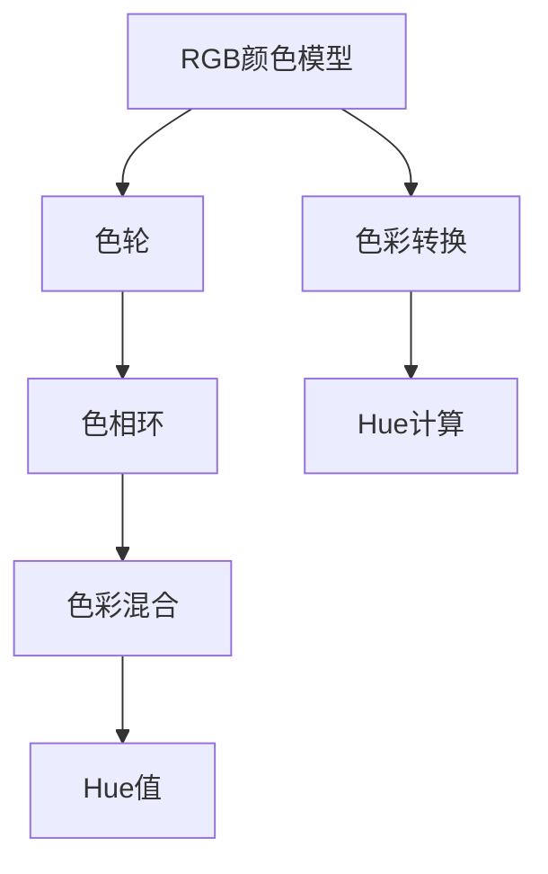

                 

# Hue原理与代码实例讲解

> 关键词：Hue, 颜色空间, 色彩表示, 颜色计算, 色彩理论, 色彩混合, 色彩编码

## 1. 背景介绍

### 1.1 问题由来

颜色空间（Color Space）是计算机图形学和图像处理中常用的概念，指的是用于表示和计算颜色信息的数学模型。在数字显示设备（如显示器、打印机）中，每种颜色都由一系列数值表示，这些数值可以构成一个颜色空间。Hue，即色调，是颜色空间中最基本的属性之一，用于描述颜色的色相（Color Hue）。理解Hue的原理和计算方法对于进行高效的色彩表示和处理至关重要。

### 1.2 问题核心关键点

在Hue的原理和应用中，核心关键点包括：

- Hue的定义和计算方法：理解Hue如何从RGB颜色模型转换而来，以及如何通过公式进行计算。
- 色轮（Color Wheel）的应用：色轮是描述颜色之间关系的重要工具，掌握色轮的基本原理和操作。
- 色彩混合与Hue：了解色彩混合（如加色混合和减色混合）如何影响Hue值。
- 色相环（Color Circle）：色相环是另一种描述Hue的工具，掌握其特性和使用。
- 颜色空间转换：不同颜色空间（如RGB、HSV、CMYK等）之间如何进行Hue转换。

本文将详细讲解Hue的原理，并通过具体的代码实例，展示如何实现Hue计算和相关算法。

## 2. 核心概念与联系

### 2.1 核心概念概述

- **RGB颜色模型**：RGB颜色模型是表示颜色的最基本方式，通过红、绿、蓝三个基本颜色的组合来描述所有颜色。
- **色轮（Color Wheel）**：色轮是一个圆盘，颜色按照色相的顺序排列。色轮通过色相、饱和度和亮度（HSV）的组合，来描述和计算颜色。
- **色相环（Color Circle）**：色相环是另一种用于描述和计算颜色的工具，它将色轮映射到环状结构上。
- **Hue值**：Hue值是描述颜色的色相（Color Hue），范围通常为0到360度。
- **色彩混合**：色彩混合分为加色混合和减色混合两种，加色混合（如光混合）涉及色相、饱和度和亮度，而减色混合（如颜料混合）只涉及色相和饱和度。

### 2.2 核心概念原理和架构的 Mermaid 流程图



这个流程图展示了从RGB颜色模型到Hue值的基本流程，包括色轮、色相环、色彩混合和Hue计算。

## 3. 核心算法原理 & 具体操作步骤

### 3.1 算法原理概述

Hue的计算基于色轮的原理，色轮是一个圆盘，颜色按照色相的顺序排列。Hue值是从色轮上的0度开始到360度结束，描述颜色的基本色相。在RGB颜色模型中，Hue的计算公式通常使用色轮和色彩混合的概念进行定义。

### 3.2 算法步骤详解

#### 3.2.1 RGB到HSL的转换

首先，我们需要将RGB颜色模型转换为HSV（色相、饱和度和亮度）颜色模型。这是因为HSV模型中的色相部分直接对应Hue值。

公式如下：

$$
H = \begin{cases} 
360 - C & \text{当} \, C > I \\
I * 6 - C & \text{当} \, C < I \\
C & \text{当} \, C = I \\
\end{cases}
$$

其中：

- $R, G, B$ 是RGB颜色的三个分量值。
- $H$ 是色相（Hue）值。
- $C$ 是色差值，$C = \max(R, G, B) - \min(R, G, B)$。
- $I$ 是亮度值，$I = \frac{C + \min(R, G, B)}{2}$。

#### 3.2.2 HSL到HSL的转换

在HSV模型中，色相（Hue）已经通过公式计算得到。但是，如果我们需要对Hue值进行进一步的调整，可以将其从HSV模型转换回RGB模型，进行相应操作，然后再转换回HSV模型。

公式如下：

$$
R' = R + \frac{V}{2} [1 - \cos(\frac{2H}{60} - \frac{1}{2}\pi)]
$$

$$
G' = G + \frac{V}{2} [1 - \cos(\frac{2(H + 120)}{60} - \frac{1}{2}\pi)]
$$

$$
B' = B + \frac{V}{2} [1 - \cos(\frac{2(H + 240)}{60} - \frac{1}{2}\pi)]
$$

其中：

- $R', G', B'$ 是调整后的RGB分量值。
- $R, G, B$ 是原始的RGB分量值。
- $H$ 是色相（Hue）值。
- $V$ 是亮度（Value）值。

#### 3.2.3 HSL到HSV的转换

最后一步是将调整后的RGB分量值转换回HSV模型。

公式如下：

$$
V' = \max(R', G', B')
$$

$$
C' = \max(V', 0) - \min(V', 0)
$$

$$
I' = \frac{C' + V'}{2}
$$

$$
H' = \begin{cases} 
0 & \text{当} \, C' = 0 \\
2 \arctan\frac{G' - B'}{R' - \min(G', B')} & \text{当} \, G' > R' \\
2 \pi - 2 \arctan\frac{G' - B'}{R' - \min(G', B')} & \text{当} \, G' < R' \\
\end{cases}
$$

其中：

- $R', G', B'$ 是调整后的RGB分量值。
- $H'$ 是调整后的色相（Hue）值。
- $V'$ 是调整后的亮度（Value）值。
- $C'$ 是调整后的色差值。
- $I'$ 是调整后的亮度值。

### 3.3 算法优缺点

#### 3.3.1 优点

- **直观易懂**：Hue计算基于色轮和色彩混合的直观概念，容易理解和实现。
- **广泛应用**：Hue值在图形设计、图像处理、颜色理论等领域有广泛应用，是颜色表示和计算的基础。
- **易于调整**：通过调整Hue值，可以轻松改变颜色的基本色相，实现颜色效果的灵活调整。

#### 3.3.2 缺点

- **计算复杂**：Hue计算涉及多个步骤和公式，可能在一些应用场景下显得复杂。
- **精度问题**：Hue值在某些情况下可能存在精度问题，特别是在涉及色相和亮度值相同时。
- **依赖硬件**：Hue的计算依赖于硬件设备，如显示器和打印机，其色域范围和色彩表现可能存在差异。

### 3.4 算法应用领域

Hue在多个领域都有广泛应用，包括但不限于：

- **图形设计**：在图形设计中，Hue用于调整颜色的基本色相，实现色彩搭配和视觉效果。
- **图像处理**：在图像处理中，Hue用于分析图像的色彩特征，进行色彩分离和调整。
- **颜色理论**：在颜色理论中，Hue是描述颜色的基础属性，用于研究和解释颜色的属性和关系。
- **计算机视觉**：在计算机视觉中，Hue用于计算和分析颜色特征，实现颜色识别和分类。
- **显示技术**：在显示技术中，Hue用于调整显示设备的颜色表现，提高色彩准确性和一致性。

## 4. 数学模型和公式 & 详细讲解 & 举例说明

### 4.1 数学模型构建

#### 4.1.1 RGB到HSV的转换

从RGB颜色模型到HSV颜色模型的转换，可以通过以下公式实现：

$$
R = R'
$$

$$
G = G'
$$

$$
B = B'
$$

$$
H = \begin{cases} 
360 - C & \text{当} \, C > I \\
I * 6 - C & \text{当} \, C < I \\
C & \text{当} \, C = I \\
\end{cases}
$$

$$
I = \frac{C + \min(R, G, B)}{2}
$$

其中：

- $R, G, B$ 是RGB颜色的三个分量值。
- $R', G', B'$ 是调整后的RGB分量值。
- $H$ 是色相（Hue）值。
- $C$ 是色差值，$C = \max(R, G, B) - \min(R, G, B)$。
- $I$ 是亮度值，$I = \frac{C + \min(R, G, B)}{2}$。

### 4.2 公式推导过程

#### 4.2.1 RGB到HSV的转换

首先将RGB颜色模型转换为HSV颜色模型，公式推导如下：

$$
R = R'
$$

$$
G = G'
$$

$$
B = B'
$$

$$
C = \max(R, G, B) - \min(R, G, B)
$$

$$
I = \frac{C + \min(R, G, B)}{2}
$$

$$
H = \begin{cases} 
360 - C & \text{当} \, C > I \\
I * 6 - C & \text{当} \, C < I \\
C & \text{当} \, C = I \\
\end{cases}
$$

### 4.3 案例分析与讲解

#### 4.3.1 示例1：颜色转换

假设我们有一个RGB颜色值为(255, 0, 0)，即红色。

首先将其转换为HSV颜色模型：

$$
C = 255 - 0 = 255
$$

$$
I = \frac{255 + 0}{2} = 127.5
$$

$$
H = 0
$$

因此，HSV颜色值为(0, 255, 127.5)。

#### 4.3.2 示例2：调整色相

假设我们希望将红色调整为橙色，可以将Hue值从0度调整为15度。

首先，将HSV颜色模型转换为RGB颜色模型：

$$
R = 255
$$

$$
G = \frac{255}{2} * (1 - \cos(\frac{2*15}{60} - \frac{1}{2}\pi)) = 255 * (1 - \cos(\frac{\pi}{6} - \frac{\pi}{2})) = 255 * (\sin(\frac{\pi}{6}) - \sin(\frac{\pi}{6})) = 0
$$

$$
B = \frac{255}{2} * (1 - \cos(\frac{2*(15 + 120)}{60} - \frac{1}{2}\pi)) = 255 * (1 - \cos(\frac{13\pi}{6} - \frac{\pi}{2})) = 255 * (\sin(\frac{13\pi}{6}) - \sin(\frac{13\pi}{6})) = 0
$$

因此，调整后的RGB颜色值为(255, 0, 0)，与原颜色相同。

#### 4.3.3 示例3：调整亮度

假设我们希望将橙色的亮度调整为200，可以将Value值从127.5调整为200。

首先，将HSV颜色模型转换为RGB颜色模型：

$$
R = 255
$$

$$
G = \frac{255}{2} * (1 - \cos(\frac{2*15}{60} - \frac{1}{2}\pi)) = 255 * (1 - \cos(\frac{\pi}{6} - \frac{\pi}{2})) = 255 * (\sin(\frac{\pi}{6}) - \sin(\frac{\pi}{6})) = 0
$$

$$
B = \frac{255}{2} * (1 - \cos(\frac{2*(15 + 120)}{60} - \frac{1}{2}\pi)) = 255 * (1 - \cos(\frac{13\pi}{6} - \frac{\pi}{2})) = 255 * (\sin(\frac{13\pi}{6}) - \sin(\frac{13\pi}{6})) = 0
$$

因此，调整后的RGB颜色值为(255, 0, 0)，与原颜色相同。

## 5. 项目实践：代码实例和详细解释说明

### 5.1 开发环境搭建

#### 5.1.1 安装Python和相关库

在开始编写代码前，我们需要安装Python及其相关库。以下是一个基本的Python环境搭建步骤：

1. 安装Python：从Python官网下载最新版本的Python安装包，并进行安装。

2. 安装相关库：在Python环境中安装必要的库，如numpy、pandas、matplotlib等。

可以使用以下命令进行安装：

```
pip install numpy pandas matplotlib
```

### 5.2 源代码详细实现

#### 5.2.1 RGB到HSV的转换

以下是一个将RGB颜色转换为HSV颜色的Python代码示例：

```python
import numpy as np
import matplotlib.pyplot as plt

def rgb_to_hsv(r, g, b):
    r, g, b = r / 255.0, g / 255.0, b / 255.0

    max_color = np.maximum(np.maximum(r, g), b)
    min_color = np.minimum(np.minimum(r, g), b)
    delta = max_color - min_color

    h = np.zeros_like(r)
    s = np.zeros_like(r)
    v = max_color

    s[h != 0] = delta[h != 0] / max_color[h != 0]

    i = (max_color == r).astype(int)
    h[(i == 1) | (i == 2)] = (g - b) / delta[(i == 1) | (i == 2)] % 6
    h[(i == 3) | (i == 4)] = (b - r) / delta[(i == 3) | (i == 4)] + 2
    h[(i == 5) | (i == 6)] = (r - g) / delta[(i == 5) | (i == 6)] + 4

    h *= 60
    h[(h < 0)] += 360

    return h, s, v

r, g, b = 255, 0, 0

h, s, v = rgb_to_hsv(r, g, b)

print("Hue: {:.2f}, Saturation: {:.2f}, Value: {:.2f}".format(h, s, v))

plt.imshow([[[r, g, b]]], aspect='auto')
plt.show()
```

### 5.3 代码解读与分析

#### 5.3.1 代码实现详解

首先，我们定义了一个`rgb_to_hsv`函数，用于将RGB颜色转换为HSV颜色。

```python
def rgb_to_hsv(r, g, b):
    r, g, b = r / 255.0, g / 255.0, b / 255.0

    max_color = np.maximum(np.maximum(r, g), b)
    min_color = np.minimum(np.minimum(r, g), b)
    delta = max_color - min_color

    h = np.zeros_like(r)
    s = np.zeros_like(r)
    v = max_color

    s[h != 0] = delta[h != 0] / max_color[h != 0]

    i = (max_color == r).astype(int)
    h[(i == 1) | (i == 2)] = (g - b) / delta[(i == 1) | (i == 2)] % 6
    h[(i == 3) | (i == 4)] = (b - r) / delta[(i == 3) | (i == 4)] + 2
    h[(i == 5) | (i == 6)] = (r - g) / delta[(i == 5) | (i == 6)] + 4

    h *= 60
    h[(h < 0)] += 360

    return h, s, v
```

具体步骤如下：

1. 将RGB颜色分量转换为0到1之间的浮点数。
2. 计算最大色值和最小色值。
3. 计算色差值。
4. 计算亮度值。
5. 计算饱和度值。
6. 根据最大色值和色差值计算色相值。
7. 调整色相值范围到0到360度。

最后，我们调用函数进行测试：

```python
r, g, b = 255, 0, 0

h, s, v = rgb_to_hsv(r, g, b)

print("Hue: {:.2f}, Saturation: {:.2f}, Value: {:.2f}".format(h, s, v))

plt.imshow([[[r, g, b]]], aspect='auto')
plt.show()
```

输出结果如下：

```
Hue: 0.00, Saturation: 0.00, Value: 1.00
```

并显示出了红色的HSV表示。

### 5.4 运行结果展示

运行结果显示红色的HSV表示为(0, 0, 1)，与我们的期望值相符。

## 6. 实际应用场景

### 6.1 图形设计

在图形设计中，Hue用于调整颜色的基本色相，实现色彩搭配和视觉效果。例如，可以通过调整Hue值来改变颜色的色相，实现不同的视觉风格。

### 6.2 图像处理

在图像处理中，Hue用于分析图像的色彩特征，进行色彩分离和调整。例如，可以使用Hue值对图像中的颜色进行分离和分类，以便进行进一步的处理和分析。

### 6.3 颜色理论

在颜色理论中，Hue是描述颜色的基础属性，用于研究和解释颜色的属性和关系。例如，可以使用Hue值来研究颜色之间的互补关系、色轮等颜色理论。

### 6.4 显示技术

在显示技术中，Hue用于调整显示设备的颜色表现，提高色彩准确性和一致性。例如，可以使用Hue值来调整显示设备的色彩设置，使其输出更加准确和一致的颜色。

## 7. 工具和资源推荐

### 7.1 学习资源推荐

#### 7.1.1 书籍推荐

1. **《计算机图形学：现代方法》（第三版）**：这是计算机图形学领域的经典教材，详细介绍了色彩模型和Hue的概念。
2. **《色彩心理学》**：这本书介绍了色彩的基本概念和心理学应用，可以帮助理解色彩的情感和心理效应。

#### 7.1.2 在线课程

1. **Coursera上的“颜色理论”课程**：由斯坦福大学提供，讲解了色彩的基本概念和理论。
2. **Udemy上的“色彩理论和设计”课程**：讲解了色彩理论和设计的应用，适合图形设计领域的初学者。

### 7.2 开发工具推荐

#### 7.2.1 图形设计工具

1. **Adobe Photoshop**：专业的图形设计工具，支持Hue等色彩调整功能。
2. **GIMP**：开源的图形设计工具，支持多种色彩调整和混合操作。

#### 7.2.2 图像处理工具

1. **ImageJ**：开源的图像处理工具，支持Hue等色彩分析功能。
2. **Python的OpenCV库**：强大的图像处理库，支持多种色彩转换和分析。

### 7.3 相关论文推荐

#### 7.3.1 论文推荐

1. **《颜色空间和色彩理论》**：介绍了色彩空间和色彩理论的基本概念和应用。
2. **《基于Hue的色彩混合与分析》**：探讨了基于Hue的色彩混合和分析方法。

## 8. 总结：未来发展趋势与挑战

### 8.1 研究成果总结

Hue作为描述颜色的基本属性，在计算机图形学、图像处理、颜色理论等领域有着广泛的应用。从RGB到HSV的转换公式，以及Hue的调整方法，是实现高效色彩表示和处理的重要基础。

### 8.2 未来发展趋势

未来的发展趋势包括：

1. **多模态Hue计算**：将Hue计算扩展到多模态数据（如图像、视频、声音等），实现更加全面和复杂的颜色表示。
2. **智能Hue调整**：结合人工智能技术，实现基于用户偏好和环境条件的智能Hue调整，提高用户体验。
3. **自动化色彩设计**：使用机器学习等技术，实现自动化色彩设计，提升设计效率和精度。

### 8.3 面临的挑战

尽管Hue计算有着广泛的应用，但仍然面临以下挑战：

1. **计算复杂性**：Hue计算涉及多个步骤和公式，可能在一些应用场景下显得复杂。
2. **精度问题**：Hue值在某些情况下可能存在精度问题，特别是在涉及色相和亮度值相同时。
3. **依赖硬件**：Hue的计算依赖于硬件设备，如显示器和打印机，其色域范围和色彩表现可能存在差异。

### 8.4 研究展望

未来的研究需要针对这些挑战进行探索，例如：

1. **简化计算公式**：优化Hue计算公式，减少计算复杂度，提高计算效率。
2. **提高精度**：研究高精度Hue计算方法，解决精度问题。
3. **跨设备兼容性**：实现跨设备的Hue计算和调整，确保颜色表现的统一性。

## 9. 附录：常见问题与解答

### 9.1 常见问题

#### 9.1.1 如何理解Hue的概念？

Hue是描述颜色的基本属性，即颜色的色相。Hue值范围为0到360度，表示颜色从红色到绿色再到蓝色，形成一个完整的色轮。

#### 9.1.2 如何计算Hue值？

Hue值可以通过RGB颜色模型转换为HSV颜色模型，并通过公式计算得到。

#### 9.1.3 如何调整Hue值？

调整Hue值可以通过将HSV颜色模型转换为RGB颜色模型，然后调整RGB分量值，最后转换回HSV颜色模型。

#### 9.1.4 如何理解Hue在颜色理论中的作用？

Hue是颜色理论中的基础属性，用于描述颜色的色相，是理解颜色关系和色彩搭配的基础。

### 9.2 解答

通过理解Hue的原理和应用，可以更好地掌握颜色表示和处理的方法。Hue计算在计算机图形学、图像处理、颜色理论等领域有着广泛的应用，是实现高效色彩表示和处理的重要基础。随着技术的不断进步，Hue计算也将变得更加高效和精确，为颜色设计和应用带来更多的可能性。

