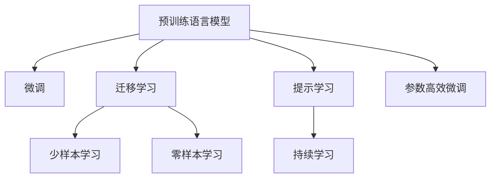

                 

# LLM 即服务：云端 AI 为大众所用

> 关键词：语言模型即服务(LLMaaS)、云端AI、预训练模型、微调、自然语言处理(NLP)、云计算平台

## 1. 背景介绍

### 1.1 问题由来
在过去十年间，人工智能技术取得了迅猛发展，其中自然语言处理(NLP)领域涌现出了一系列划时代的进展。从深度学习的崛起，到Transformer模型的发明，再到GPT系列的惊艳表现，预训练语言模型(LLMs)逐渐成为了NLP领域的核心技术。然而，尽管这些模型在论文和竞赛中表现优异，但对于广大开发者和实际用户而言，将这些模型应用于具体场景仍然存在诸多挑战：

1. **计算资源需求高**：主流的预训练语言模型通常参数量庞大，训练和推理对计算资源的需求极高，需要高性能的GPU或TPU设备。
2. **知识积累难**：预训练模型需要海量的文本数据进行训练，且训练过程需要长期持续进行，对于中小型企业而言，难以负担。
3. **应用门槛高**：预训练模型的复杂度和灵活性要求开发者具备深厚的算法和工程能力，才能进行有效的使用和定制化开发。

这些挑战限制了预训练语言模型的大规模应用，使得它们更多地被学术研究机构和大型科技公司所掌握，普通开发者和中小企业难以触及。因此，如何在保证性能的同时，降低预训练模型的应用门槛，使其真正成为大众可用的工具，成为了当前AI研究的一个重要方向。

## 2. 核心概念与联系

### 2.1 核心概念概述

为更好地理解预训练语言模型即服务(LLMaaS)的概念，本节将介绍几个关键概念及其联系：

- **预训练语言模型(LLMs)**：如BERT、GPT、T5等，通过在海量无标签文本数据上自监督学习，学习通用语言表示，具备强大的语言理解和生成能力。

- **语言模型即服务(LLMaaS)**：将预训练语言模型封装为云端服务的形式，降低应用门槛，使开发者和用户能够轻松使用。

- **微调(Fine-tuning)**：指在预训练模型的基础上，使用下游任务的少量标注数据，通过有监督地训练优化模型在特定任务上的性能。

- **迁移学习(Transfer Learning)**：指将一个领域学习到的知识，迁移应用到另一个不同但相关的领域的学习范式。大模型的预训练-微调过程即是一种典型的迁移学习方式。

- **参数高效微调(PEFT)**：指在微调过程中，只更新少量的模型参数，而固定大部分预训练权重不变，以提高微调效率，避免过拟合的方法。

- **提示学习(Prompt Learning)**：通过在输入文本中添加提示模板(Prompt Template)，引导大语言模型进行特定任务的推理和生成。可以在不更新模型参数的情况下，实现零样本或少样本学习。

- **少样本学习(Few-shot Learning)**：指在只有少量标注样本的情况下，模型能够快速适应新任务的学习方法。在大语言模型中，通常通过在输入中提供少量示例来实现，无需更新模型参数。

- **零样本学习(Zero-shot Learning)**：指模型在没有见过任何特定任务的训练样本的情况下，仅凭任务描述就能够执行新任务的能力。大语言模型通过预训练获得的广泛知识，使其能够理解任务指令并生成相应输出。

- **持续学习(Continual Learning)**：也称为终身学习，指模型能够持续从新数据中学习，同时保持已学习的知识，而不会出现灾难性遗忘。这对于保持大语言模型的时效性和适应性至关重要。

这些核心概念之间的逻辑关系可以通过以下Mermaid流程图来展示：



这个流程图展示了预训练语言模型的核心概念及其之间的关系：

1. 预训练模型通过大规模数据训练，获得语言通用表示。
2. 微调用于针对特定任务优化预训练模型。
3. 迁移学习连接预训练模型与下游任务，通过微调或提示学习实现知识迁移。
4. 少样本学习和零样本学习进一步拓展了模型的应用边界。
5. 参数高效微调和提示学习方法，提高了微调效率和灵活性。
6. 持续学习保障了模型与时俱进的能力。

这些概念共同构成了预训练语言模型即服务的应用框架，使其能够在各种场景下提供强大的语言理解和生成能力。通过理解这些核心概念，我们可以更好地把握预训练语言模型即服务的工作原理和优化方向。

## 3. 核心算法原理 & 具体操作步骤
### 3.1 算法原理概述

预训练语言模型即服务(LLMaaS)的本质是一种通过云计算平台提供的预训练模型服务。其核心思想是：将预训练语言模型封装为云端服务，用户无需关心模型训练的细节，只需通过API接口调用即可获取模型推理结果。

形式化地，假设预训练模型为 $M_{\theta}$，其中 $\theta$ 为预训练得到的模型参数。给定下游任务 $T$ 的标注数据集 $D=\{(x_i, y_i)\}_{i=1}^N$，用户调用服务API进行微调或推理的过程如下：

1. 用户上传微调数据或推理文本，服务端接收数据。
2. 服务端使用预训练模型 $M_{\theta}$ 对输入数据进行推理或微调。
3. 服务端返回推理或微调结果。

通过这种方式，预训练语言模型即服务能够提供灵活、高效、易用的AI能力，使用户能够轻松部署和使用最新的NLP技术，无需担心计算资源和知识积累的问题。

### 3.2 算法步骤详解

基于预训练语言模型即服务的算法步骤大致如下：

**Step 1: 选择合适的预训练模型和云平台**
- 选择合适的预训练语言模型 $M_{\theta}$ 作为初始化参数，如 BERT、GPT 等。
- 选择合适的云计算平台，如AWS、Google Cloud、阿里云等。

**Step 2: 注册并配置服务账户**
- 在云平台上注册新账户，获取API访问令牌。
- 配置访问权限，确保API调用能够正常进行。

**Step 3: 微调或推理API调用**
- 使用API接口调用微调或推理服务，输入任务描述或文本数据。
- 服务端使用预训练模型进行微调或推理，返回结果。

**Step 4: 结果分析和应用**
- 分析微调或推理结果，评估模型性能。
- 将结果应用于实际应用场景，如客户服务、内容推荐、数据分析等。

### 3.3 算法优缺点

预训练语言模型即服务(LLMaaS)方法具有以下优点：
1. 降低应用门槛。无需担心计算资源和模型训练，通过API接口调用即可快速上手。
2. 灵活便捷。支持多种NLP任务，包括分类、生成、匹配等，可以根据具体需求选择不同的模型和参数。
3. 服务可靠。云平台提供完善的监控、备份、更新等机制，确保服务稳定性。
4. 快速迭代。用户可以实时反馈模型效果，进行快速的模型更新和优化。

同时，该方法也存在一定的局限性：
1. 服务成本高。云平台服务费用较高，大规模调用可能增加成本。
2. 依赖网络。依赖网络通信，可能在网络不稳定时影响服务性能。
3. 缺乏控制。用户对模型的具体实现细节和参数设置难以控制，可能影响性能优化。
4. 隐私风险。用户上传的数据可能被收集和存储，存在隐私风险。

尽管存在这些局限性，但就目前而言，预训练语言模型即服务(LLMaaS)仍是NLP技术大规模应用的重要手段。未来相关研究的重点在于如何进一步优化服务性能，降低服务成本，提高模型灵活性和隐私保护。

### 3.4 算法应用领域

预训练语言模型即服务(LLMaaS)已经在NLP领域得到广泛应用，覆盖了几乎所有常见的NLP任务，例如：

- 文本分类：如情感分析、主题分类、意图识别等。通过API接口调用微调后的模型，输入文本获取分类结果。
- 命名实体识别：识别文本中的人名、地名、机构名等特定实体。调用API接口进行实体标注。
- 关系抽取：从文本中抽取实体之间的语义关系。使用API接口进行关系抽取。
- 问答系统：对自然语言问题给出答案。调用API接口进行问答。
- 机器翻译：将源语言文本翻译成目标语言。调用API接口进行翻译。
- 文本摘要：将长文本压缩成简短摘要。调用API接口进行摘要生成。
- 对话系统：使机器能够与人自然对话。调用API接口进行对话交互。

除了上述这些经典任务外，预训练语言模型即服务(LLMaaS)还被创新性地应用到更多场景中，如可控文本生成、常识推理、代码生成、数据增强等，为NLP技术带来了全新的突破。随着预训练模型和服务的不断进步，相信预训练语言模型即服务(LLMaaS)将在更广阔的应用领域大放异彩。

## 4. 数学模型和公式 & 详细讲解 & 举例说明

### 4.1 数学模型构建

本节将使用数学语言对预训练语言模型即服务(LLMaaS)的微调过程进行更加严格的刻画。

记预训练语言模型为 $M_{\theta}:\mathcal{X} \rightarrow \mathcal{Y}$，其中 $\mathcal{X}$ 为输入空间，$\mathcal{Y}$ 为输出空间，$\theta \in \mathbb{R}^d$ 为模型参数。假设微调任务的训练集为 $D=\{(x_i,y_i)\}_{i=1}^N, x_i \in \mathcal{X}, y_i \in \mathcal{Y}$。

定义模型 $M_{\theta}$ 在输入 $x$ 上的损失函数为 $\ell(M_{\theta}(x),y)$，则在数据集 $D$ 上的经验风险为：

$$
\mathcal{L}(\theta) = \frac{1}{N} \sum_{i=1}^N \ell(M_{\theta}(x_i),y_i)
$$

微调的优化目标是最小化经验风险，即找到最优参数：

$$
\theta^* = \mathop{\arg\min}_{\theta} \mathcal{L}(\theta)
$$

在实践中，我们通常使用基于梯度的优化算法（如SGD、Adam等）来近似求解上述最优化问题。设 $\eta$ 为学习率，$\lambda$ 为正则化系数，则参数的更新公式为：

$$
\theta \leftarrow \theta - \eta \nabla_{\theta}\mathcal{L}(\theta) - \eta\lambda\theta
$$

其中 $\nabla_{\theta}\mathcal{L}(\theta)$ 为损失函数对参数 $\theta$ 的梯度，可通过反向传播算法高效计算。

### 4.2 公式推导过程

以下我们以二分类任务为例，推导交叉熵损失函数及其梯度的计算公式。

假设模型 $M_{\theta}$ 在输入 $x$ 上的输出为 $\hat{y}=M_{\theta}(x) \in [0,1]$，表示样本属于正类的概率。真实标签 $y \in \{0,1\}$。则二分类交叉熵损失函数定义为：

$$
\ell(M_{\theta}(x),y) = -[y\log \hat{y} + (1-y)\log (1-\hat{y})]
$$

将其代入经验风险公式，得：

$$
\mathcal{L}(\theta) = -\frac{1}{N}\sum_{i=1}^N [y_i\log M_{\theta}(x_i)+(1-y_i)\log(1-M_{\theta}(x_i))]
$$

根据链式法则，损失函数对参数 $\theta_k$ 的梯度为：

$$
\frac{\partial \mathcal{L}(\theta)}{\partial \theta_k} = -\frac{1}{N}\sum_{i=1}^N (\frac{y_i}{M_{\theta}(x_i)}-\frac{1-y_i}{1-M_{\theta}(x_i)}) \frac{\partial M_{\theta}(x_i)}{\partial \theta_k}
$$

其中 $\frac{\partial M_{\theta}(x_i)}{\partial \theta_k}$ 可进一步递归展开，利用自动微分技术完成计算。

在得到损失函数的梯度后，即可带入参数更新公式，完成模型的迭代优化。重复上述过程直至收敛，最终得到适应下游任务的最优模型参数 $\theta^*$。

## 5. 项目实践：代码实例和详细解释说明

### 5.1 开发环境搭建

在进行预训练语言模型即服务(LLMaaS)的实践前，我们需要准备好开发环境。以下是使用Python进行服务开发的环境配置流程：

1. 安装Anaconda：从官网下载并安装Anaconda，用于创建独立的Python环境。

2. 创建并激活虚拟环境：
```bash
conda create -n llmaas-env python=3.8 
conda activate llmaas-env
```

3. 安装PyTorch：根据CUDA版本，从官网获取对应的安装命令。例如：
```bash
conda install pytorch torchvision torchaudio cudatoolkit=11.1 -c pytorch -c conda-forge
```

4. 安装Transformers库：
```bash
pip install transformers
```

5. 安装Flask和FastAPI：用于构建服务API：
```bash
pip install flask fastapi
```

6. 安装AWS SDK和Google Cloud SDK：
```bash
pip install boto3
pip install google-cloud-aiplatform
```

完成上述步骤后，即可在`llmaas-env`环境中开始服务开发和部署。

### 5.2 源代码详细实现

下面我们以微调BERT模型进行文本分类任务为例，给出使用Flask和Google Cloud AI Platform构建服务的PyTorch代码实现。

首先，定义文本分类任务的模型和损失函数：

```python
from transformers import BertForSequenceClassification, AdamW
from transformers import BertTokenizer
from torch.nn import CrossEntropyLoss
from transformers import get_linear_schedule_with_warmup

tokenizer = BertTokenizer.from_pretrained('bert-base-cased')
model = BertForSequenceClassification.from_pretrained('bert-base-cased', num_labels=2, output_attentions=False, output_hidden_states=False)

loss_fn = CrossEntropyLoss()
optimizer = AdamW(model.parameters(), lr=2e-5)
scheduler = get_linear_schedule_with_warmup(optimizer, num_warmup_steps=0, num_training_steps=-1)
```

然后，定义服务API的实现：

```python
from fastapi import FastAPI, Depends
from pydantic import BaseModel

class Item(BaseModel):
    text: str

app = FastAPI()

@app.get("/predict")
def predict(item: Item):
    inputs = tokenizer(item.text, return_tensors='pt')
    outputs = model(**inputs)
    probs = outputs.logits.softmax(dim=1)
    pred_class = probs.argmax().item()
    return {"class": pred_class}
```

最后，部署服务到Google Cloud AI Platform：

```python
# 配置环境变量
gcloud config set project PROJECT_ID
gcloud config set compute/region REGION
gcloud config set compute/machineType MACHINE_TYPE

# 构建Docker镜像
docker build -t llmaas .

# 上传镜像到GCR
gcloud builds submit --tag gcr.io/PROJECT_ID/llmaas

# 部署服务
gcloud ai-platform models create model_name --regions REGION
gcloud ai-platform versions create version_name --model model_name --origin gcr.io/PROJECT_ID/llmaas --runtime-version 2.7 --python-version 3.8 --machine-type MACHINE_TYPE --scale-tier BASIC
```

完成上述步骤后，即可通过API接口调用微调后的BERT模型进行文本分类任务。

### 5.3 代码解读与分析

让我们再详细解读一下关键代码的实现细节：

**BertForSequenceClassification**：
- `num_labels`参数：指定分类任务的标签数量，这里为2（二分类）。
- `output_attentions`和`output_hidden_states`参数：设置为False，减少内存占用和计算负担。

**Flask和FastAPI**：
- `FastAPI`：用于构建API服务，支持异步请求处理。
- `Pydantic`：用于定义API请求的数据模型，确保请求数据格式正确。

**部署服务**：
- 使用`gcloud`命令配置环境变量，并构建Docker镜像。
- 将Docker镜像上传到Google Cloud Registry（GCR）。
- 使用`gcloud`命令创建模型和服务版本，指定部署配置，并设置运行版本。

可以看到，通过Flask和FastAPI，我们可以轻松构建一个基于预训练语言模型的API服务，而Google Cloud AI Platform则提供了完善的云服务，方便用户部署、管理和监控。通过这些工具，开发者可以大大简化预训练语言模型即服务的开发和部署流程，提升工作效率。

## 6. 实际应用场景

### 6.1 智能客服系统

基于预训练语言模型即服务(LLMaaS)的对话技术，可以广泛应用于智能客服系统的构建。传统客服往往需要配备大量人力，高峰期响应缓慢，且一致性和专业性难以保证。而使用预训练语言模型即服务构建的智能客服系统，可以7x24小时不间断服务，快速响应客户咨询，用自然流畅的语言解答各类常见问题。

在技术实现上，可以收集企业内部的历史客服对话记录，将问题和最佳答复构建成监督数据，在此基础上对预训练语言模型进行微调。微调后的对话模型能够自动理解用户意图，匹配最合适的答案模板进行回复。对于客户提出的新问题，还可以接入检索系统实时搜索相关内容，动态组织生成回答。如此构建的智能客服系统，能大幅提升客户咨询体验和问题解决效率。

### 6.2 金融舆情监测

金融机构需要实时监测市场舆论动向，以便及时应对负面信息传播，规避金融风险。传统的人工监测方式成本高、效率低，难以应对网络时代海量信息爆发的挑战。基于预训练语言模型即服务(LLMaaS)的文本分类和情感分析技术，为金融舆情监测提供了新的解决方案。

具体而言，可以收集金融领域相关的新闻、报道、评论等文本数据，并对其进行主题标注和情感标注。在此基础上对预训练语言模型进行微调，使其能够自动判断文本属于何种主题，情感倾向是正面、中性还是负面。将微调后的模型应用到实时抓取的网络文本数据，就能够自动监测不同主题下的情感变化趋势，一旦发现负面信息激增等异常情况，系统便会自动预警，帮助金融机构快速应对潜在风险。

### 6.3 个性化推荐系统

当前的推荐系统往往只依赖用户的历史行为数据进行物品推荐，无法深入理解用户的真实兴趣偏好。基于预训练语言模型即服务(LLMaaS)的个性化推荐系统可以更好地挖掘用户行为背后的语义信息，从而提供更精准、多样的推荐内容。

在实践中，可以收集用户浏览、点击、评论、分享等行为数据，提取和用户交互的物品标题、描述、标签等文本内容。将文本内容作为模型输入，用户的后续行为（如是否点击、购买等）作为监督信号，在此基础上微调预训练语言模型。微调后的模型能够从文本内容中准确把握用户的兴趣点。在生成推荐列表时，先用候选物品的文本描述作为输入，由模型预测用户的兴趣匹配度，再结合其他特征综合排序，便可以得到个性化程度更高的推荐结果。

### 6.4 未来应用展望

随着预训练语言模型即服务(LLMaaS)技术的不断发展，基于微调范式将在更多领域得到应用，为传统行业带来变革性影响。

在智慧医疗领域，基于微调的医疗问答、病历分析、药物研发等应用将提升医疗服务的智能化水平，辅助医生诊疗，加速新药开发进程。

在智能教育领域，微调技术可应用于作业批改、学情分析、知识推荐等方面，因材施教，促进教育公平，提高教学质量。

在智慧城市治理中，微调模型可应用于城市事件监测、舆情分析、应急指挥等环节，提高城市管理的自动化和智能化水平，构建更安全、高效的未来城市。

此外，在企业生产、社会治理、文娱传媒等众多领域，预训练语言模型即服务(LLMaaS)的应用也将不断涌现，为经济社会发展注入新的动力。相信随着技术的日益成熟，预训练语言模型即服务(LLMaaS)必将在更广阔的应用领域大放异彩，深刻影响人类的生产生活方式。

## 7. 工具和资源推荐

### 7.1 学习资源推荐

为了帮助开发者系统掌握预训练语言模型即服务(LLMaaS)的理论基础和实践技巧，这里推荐一些优质的学习资源：

1. 《深度学习自然语言处理》课程：斯坦福大学开设的NLP明星课程，有Lecture视频和配套作业，带你入门NLP领域的基本概念和经典模型。

2. CS224N《自然语言处理与深度学习》课程：斯坦福大学开设的NLP高阶课程，深入讲解Transformer模型及其应用。

3. 《Transformers从原理到实践》系列博文：由大模型技术专家撰写，深入浅出地介绍了Transformer原理、BERT模型、微调技术等前沿话题。

4. 《Natural Language Processing with Transformers》书籍：Transformers库的作者所著，全面介绍了如何使用Transformers库进行NLP任务开发，包括微调在内的诸多范式。

5. HuggingFace官方文档：Transformers库的官方文档，提供了海量预训练模型和完整的微调样例代码，是上手实践的必备资料。

通过对这些资源的学习实践，相信你一定能够快速掌握预训练语言模型即服务(LLMaaS)的精髓，并用于解决实际的NLP问题。

### 7.2 开发工具推荐

高效的开发离不开优秀的工具支持。以下是几款用于预训练语言模型即服务(LLMaaS)开发的常用工具：

1. PyTorch：基于Python的开源深度学习框架，灵活动态的计算图，适合快速迭代研究。大部分预训练语言模型都有PyTorch版本的实现。

2. TensorFlow：由Google主导开发的开源深度学习框架，生产部署方便，适合大规模工程应用。同样有丰富的预训练语言模型资源。

3. Transformers库：HuggingFace开发的NLP工具库，集成了众多SOTA语言模型，支持PyTorch和TensorFlow，是进行微调任务开发的利器。

4. Weights & Biases：模型训练的实验跟踪工具，可以记录和可视化模型训练过程中的各项指标，方便对比和调优。与主流深度学习框架无缝集成。

5. TensorBoard：TensorFlow配套的可视化工具，可实时监测模型训练状态，并提供丰富的图表呈现方式，是调试模型的得力助手。

6. Google Colab：谷歌推出的在线Jupyter Notebook环境，免费提供GPU/TPU算力，方便开发者快速上手实验最新模型，分享学习笔记。

合理利用这些工具，可以显著提升预训练语言模型即服务(LLMaaS)的开发效率，加快创新迭代的步伐。

### 7.3 相关论文推荐

预训练语言模型即服务(LLMaaS)的发展源于学界的持续研究。以下是几篇奠基性的相关论文，推荐阅读：

1. Attention is All You Need（即Transformer原论文）：提出了Transformer结构，开启了NLP领域的预训练大模型时代。

2. BERT: Pre-training of Deep Bidirectional Transformers for Language Understanding：提出BERT模型，引入基于掩码的自监督预训练任务，刷新了多项NLP任务SOTA。

3. Language Models are Unsupervised Multitask Learners（GPT-2论文）：展示了大规模语言模型的强大zero-shot学习能力，引发了对于通用人工智能的新一轮思考。

4. Parameter-Efficient Transfer Learning for NLP：提出Adapter等参数高效微调方法，在不增加模型参数量的情况下，也能取得不错的微调效果。

5. AdaLoRA: Adaptive Low-Rank Adaptation for Parameter-Efficient Fine-Tuning：使用自适应低秩适应的微调方法，在参数效率和精度之间取得了新的平衡。

这些论文代表了大语言模型即服务(LLMaaS)的发展脉络。通过学习这些前沿成果，可以帮助研究者把握学科前进方向，激发更多的创新灵感。

## 8. 总结：未来发展趋势与挑战

### 8.1 总结

本文对预训练语言模型即服务(LLMaaS)进行了全面系统的介绍。首先阐述了预训练语言模型即服务(LLMaaS)的研究背景和意义，明确了其在降低应用门槛、提升服务灵活性方面的独特价值。其次，从原理到实践，详细讲解了预训练语言模型即服务的数学原理和关键步骤，给出了预训练语言模型即服务的完整代码实例。同时，本文还广泛探讨了预训练语言模型即服务(LLMaaS)在智能客服、金融舆情、个性化推荐等多个行业领域的应用前景，展示了预训练语言模型即服务(LLMaaS)的巨大潜力。此外，本文精选了预训练语言模型即服务(LLMaaS)的学习资源，力求为读者提供全方位的技术指引。

通过本文的系统梳理，可以看到，预训练语言模型即服务(LLMaaS)正在成为NLP技术大规模应用的重要手段，极大地拓展了预训练语言模型的应用边界，催生了更多的落地场景。得益于云计算平台提供的预训练模型和微调服务，开发者和用户能够轻松使用最新的NLP技术，无需担心计算资源和知识积累的问题。未来，伴随预训练语言模型即服务(LLMaaS)技术的不断发展，相信预训练语言模型即服务(LLMaaS)必将在更广阔的应用领域大放异彩，深刻影响人类的生产生活方式。

### 8.2 未来发展趋势

展望未来，预训练语言模型即服务(LLMaaS)将呈现以下几个发展趋势：

1. 模型规模持续增大。随着算力成本的下降和数据规模的扩张，预训练语言模型即服务(LLMaaS)的模型参数量还将持续增长。超大规模语言模型蕴含的丰富语言知识，有望支撑更加复杂多变的下游任务微调。

2. 服务性能提升。预训练语言模型即服务(LLMaaS)通过模型微调和优化，不断提升服务性能，满足更精细的应用需求。

3. 服务场景拓展。预训练语言模型即服务(LLMaaS)的应用领域将从NLP拓展到更多跨模态领域，如图像、视频、语音等，实现全面AI能力的提供。

4. 实时性增强。预训练语言模型即服务(LLMaaS)通过云平台的弹性计算和优化，能够实现毫秒级的实时响应，满足高吞吐量需求。

5. 用户接口优化。预训练语言模型即服务(LLMaaS)将提供更加灵活和易用的API接口，降低使用门槛，提升用户体验。

6. 隐私保护加强。预训练语言模型即服务(LLMaaS)将加强数据隐私保护，确保用户数据的安全和隐私。

以上趋势凸显了预训练语言模型即服务(LLMaaS)技术的广阔前景。这些方向的探索发展，必将进一步提升预训练语言模型即服务(LLMaaS)的性能和用户体验，使其成为更普适、更便捷的AI能力提供者。

### 8.3 面临的挑战

尽管预训练语言模型即服务(LLMaaS)已经取得了瞩目成就，但在迈向更加智能化、普适化应用的过程中，它仍面临着诸多挑战：

1. 计算资源瓶颈。预训练语言模型即服务(LLMaaS)依赖高性能的云计算资源，存在较大的计算成本。如何降低服务成本，提升服务效率，仍然是一个重要问题。

2. 隐私和安全风险。预训练语言模型即服务(LLMaaS)在处理用户数据时，面临数据隐私和安全风险。如何保障用户数据的安全，确保服务合规性，是预训练语言模型即服务(LLMaaS)需要面对的重大挑战。

3. 服务质量和稳定性。预训练语言模型即服务(LLMaaS)需要提供高质量、稳定可靠的服务，但云平台的网络和计算资源管理存在不确定性。如何在资源管理和服务质量间取得平衡，是预训练语言模型即服务(LLMaaS)的重要课题。

4. 算法复杂度。预训练语言模型即服务(LLMaaS)需要处理复杂的算法模型，存在较高的开发和维护成本。如何在提升服务性能的同时，降低开发门槛，是预训练语言模型即服务(LLMaaS)的重要研究方向。

5. 跨领域应用限制。尽管预训练语言模型即服务(LLMaaS)已经在NLP领域取得了成功，但在跨领域应用方面，如跨模态融合、知识表示等，仍存在较多挑战。如何突破跨领域应用的瓶颈，是预训练语言模型即服务(LLMaaS)的前进方向。

6. 伦理和法律问题。预训练语言模型即服务(LLMaaS)的广泛应用可能带来伦理和法律问题，如算法偏见、信息泄露等。如何确保算法公平、透明，符合伦理和法律要求，是预训练语言模型即服务(LLMaaS)的重要挑战。

这些挑战凸显了预训练语言模型即服务(LLMaaS)技术的应用前景和重要性，也预示着未来需要进一步的研究和改进。

### 8.4 研究展望

面对预训练语言模型即服务(LLMaaS)所面临的诸多挑战，未来的研究需要在以下几个方面寻求新的突破：

1. 探索无监督和半监督微调方法。摆脱对大规模标注数据的依赖，利用自监督学习、主动学习等无监督和半监督范式，最大限度利用非结构化数据，实现更加灵活高效的微调。

2. 研究参数高效和计算高效的微调范式。开发更加参数高效的微调方法，在固定大部分预训练参数的同时，只更新极少量的任务相关参数。同时优化微调模型的计算图，减少前向传播和反向传播的资源消耗，实现更加轻量级、实时性的部署。

3. 引入更多先验知识。将符号化的先验知识，如知识图谱、逻辑规则等，与神经网络模型进行巧妙融合，引导微调过程学习更准确、合理的语言模型。同时加强不同模态数据的整合，实现视觉、语音等多模态信息与文本信息的协同建模。

4. 结合因果分析和博弈论工具。将因果分析方法引入微调模型，识别出模型决策的关键特征，增强输出解释的因果性和逻辑性。借助博弈论工具刻画人机交互过程，主动探索并规避模型的脆弱点，提高系统稳定性。

5. 纳入伦理道德约束。在模型训练目标中引入伦理导向的评估指标，过滤和惩罚有偏见、有害的输出倾向。同时加强人工干预和审核，建立模型行为的监管机制，确保输出符合人类价值观和伦理道德。

这些研究方向的探索，必将引领预训练语言模型即服务(LLMaaS)技术迈向更高的台阶，为构建安全、可靠、可解释、可控的智能系统铺平道路。面向未来，预训练语言模型即服务(LLMaaS)技术还需要与其他人工智能技术进行更深入的融合，如知识表示、因果推理、强化学习等，多路径协同发力，共同推动自然语言理解和智能交互系统的进步。只有勇于创新、敢于突破，才能不断拓展预训练语言模型即服务(LLMaaS)的边界，让智能技术更好地造福人类社会。

## 9. 附录：常见问题与解答

**Q1：预训练语言模型即服务(LLMaaS)的优势和局限性是什么？**

A: 预训练语言模型即服务(LLMaaS)的优势在于：
1. 降低应用门槛。无需担心计算资源和模型训练，通过API接口调用即可快速上手。
2. 灵活便捷。支持多种NLP任务，包括分类、生成、匹配等，可以根据具体需求选择不同的模型和参数。
3. 服务可靠。云平台提供完善的监控、备份、更新等机制，确保服务稳定性。
4. 快速迭代。用户可以实时反馈模型效果，进行快速的模型更新和优化。

预训练语言模型即服务(LLMaaS)的局限性在于：
1. 服务成本高。云平台服务费用较高，大规模调用可能增加成本。
2. 依赖网络。依赖网络通信，可能在网络不稳定时影响服务性能。
3. 缺乏控制。用户对模型的具体实现细节和参数设置难以控制，可能影响性能优化。
4. 隐私风险。用户上传的数据可能被收集和存储，存在隐私风险。

尽管存在这些局限性，但就目前而言，预训练语言模型即服务(LLMaaS)仍是NLP技术大规模应用的重要手段。未来相关研究的重点在于如何进一步优化服务性能，降低服务成本，提高模型灵活性和隐私保护。

**Q2：预训练语言模型即服务(LLMaaS)如何构建？**

A: 预训练语言模型即服务(LLMaaS)的构建大致包括以下几个步骤：
1. 选择合适的预训练语言模型和云平台。
2. 注册并配置服务账户，获取API访问令牌。
3. 构建服务API，定义API接口和请求数据模型。
4. 部署服务到云平台，进行模型微调和优化。
5. 测试和优化服务性能，确保服务稳定可靠。

在实际应用中，还需要考虑模型的参数高效微调、提示学习等技术手段，提升服务性能和灵活性。

**Q3：预训练语言模型即服务(LLMaaS)在实际应用中需要注意哪些问题？**

A: 预训练语言模型即服务(LLMaaS)在实际应用中需要注意以下问题：
1. 模型微调和优化。需要根据具体任务选择合适的微调方法，如全参数微调、参数高效微调、提示学习等，提升模型性能。
2. 服务性能监控。需要实时监控服务状态和性能指标，及时发现和解决问题。
3. 用户数据隐私保护。需要确保用户数据的安全和隐私，避免数据泄露和滥用。
4. 服务质量保障。需要保证服务质量，确保服务稳定可靠，避免服务中断和性能波动。
5. 用户接口优化。需要设计易用、高效、灵活的API接口，提升用户体验。

合理利用这些技术手段和注意事项，可以显著提升预训练语言模型即服务(LLMaaS)的性能和用户体验。

**Q4：预训练语言模型即服务(LLMaaS)的未来发展方向是什么？**

A: 预训练语言模型即服务(LLMaaS)的未来发展方向包括：
1. 模型规模增大。随着计算资源和数据规模的扩大，预训练语言模型即服务(LLMaaS)的模型参数量还将继续增长，模型能力将进一步提升。
2. 服务性能提升。通过模型微调和优化，预训练语言模型即服务(LLMaaS)将提供更高性能、更稳定可靠的服务。
3. 服务场景拓展。预训练语言模型即服务(LLMaaS)将拓展到更多跨模态领域，如图像、视频、语音等，实现全面AI能力的提供。
4. 实时性增强。预训练语言模型即服务(LLMaaS)通过云平台的弹性计算和优化，将实现毫秒级的实时响应，满足高吞吐量需求。
5. 用户接口优化。预训练语言模型即服务(LLMaaS)将提供更加灵活和易用的API接口，降低使用门槛，提升用户体验。
6. 隐私保护加强。预训练语言模型即服务(LLMaaS)将加强数据隐私保护，确保用户数据的安全和隐私。

这些发展方向将进一步拓展预训练语言模型即服务(LLMaaS)的应用场景和技术能力，使其成为更普适、更便捷的AI能力提供者。

---

作者：禅与计算机程序设计艺术 / Zen and the Art of Computer Programming

