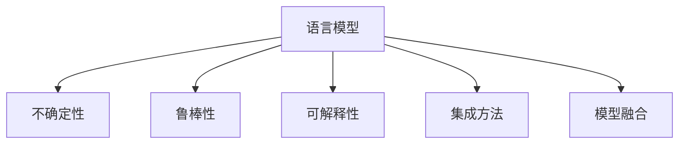

                 

# LLM 的不确定性：在不确定中寻找确定

> 关键词：语言模型, 不确定性, 鲁棒性, 可解释性, 预测, 自然语言处理, 深度学习, 集成方法, 模型融合

## 1. 背景介绍

### 1.1 问题由来

在深度学习和大规模预训练语言模型(LLM)盛行的今天，自然语言处理(NLP)领域取得了长足的进步，如图像识别、语音识别等领域的突破。然而，这些技术的核心能力仍然是通过大量标注数据训练得到的。尽管机器学习模型已经在大规模数据上取得了卓越的性能，但其仍面临不确定性的挑战，尤其是对于特定的任务，其表现仍然不可预测。

在实践中，即使在经过大量训练的模型上，其输出的结果仍然可能无法完全符合预期，特别是在处理复杂、不规则的语言环境时，模型的预测往往包含大量的不确定性。这不仅影响模型的性能，还降低了系统的可靠性，增加了调试和维护的难度。

因此，深入理解LLM在不确定性中的表现，探索如何减少不确定性，提高模型的鲁棒性和可解释性，是当前NLP领域亟需解决的重要问题。本文将深入探讨LLM中的不确定性，并探讨如何通过算法和架构的改进来寻找确定性。

### 1.2 问题核心关键点

本节将阐述问题的核心关键点：

- 如何减少LLM输出中的不确定性，以提高模型性能和可靠性。
- 如何通过算法和架构改进，增强LLM的鲁棒性和可解释性。
- 如何通过集成方法，整合多个LLM的预测结果，获得更一致和准确的结果。
- 如何通过模型融合，将多个模型集成到单一模型中，提升整体表现。

## 2. 核心概念与联系

### 2.1 核心概念概述

要理解LLM中的不确定性问题，首先需要明确几个关键概念：

- 语言模型(Language Model)：一种用于预测文本序列的概率模型，常用于文本生成、语言翻译等任务。
- 不确定性(Uncertainty)：指模型预测结果的不可预测性，即模型的输出值在给定输入下并不完全确定。
- 鲁棒性(Robustness)：指模型在面对输入噪声、对抗攻击等干扰时，仍能保持稳定的预测性能。
- 可解释性(Explainability)：指模型决策过程的可解释性，即通过简单的逻辑和规则，能够理解和解释模型的输出。
- 集成方法(Ensemble Methods)：指通过组合多个模型的预测结果，以提高整体性能和鲁棒性。
- 模型融合(Model Fusion)：指将多个模型集成到单一模型中，以获得更一致和准确的预测结果。

这些概念之间的联系可以通过以下Mermaid流程图来展示：



该流程图展示了大规模预训练语言模型的核心概念及其之间的关系：

1. 语言模型通过在大量数据上进行预训练，学习到语言的通用表示，但不可避免地带有不确定性。
2. 鲁棒性和可解释性是评估模型性能的重要指标，需要在模型设计中予以充分考虑。
3. 集成方法和模型融合是减少不确定性、提高模型鲁棒性和性能的重要手段。
4. 以上概念共同构成LLM的学习和应用框架，使其能够在各种场景下发挥强大的语言理解和生成能力。

通过理解这些核心概念，我们可以更好地把握LLM的工作原理和优化方向。

## 3. 核心算法原理 & 具体操作步骤

### 3.1 算法原理概述

LLM中的不确定性主要源于模型的预测概率分布，即在给定输入的情况下，模型输出的具体值并不是确定的，而是概率性的。模型的预测结果是通过在训练集上计算得到的概率分布，但在实际应用中，由于测试集的分布可能与训练集不同，因此模型输出的结果仍然带有不确定性。

通过深入研究模型的预测概率分布，可以发现模型的预测不确定性与输入数据的复杂性、模型参数的精度、模型结构的复杂性等因素密切相关。为了减少模型的预测不确定性，我们需要优化模型结构，改进训练方法，并引入鲁棒性和可解释性技术。

### 3.2 算法步骤详解

基于上述理论，我们将详细讲解减少LLM不确定性的操作步骤。

**Step 1: 准备训练数据和模型**

- 收集和预处理大规模的训练数据，并将其分为训练集和验证集。
- 选择适合的预训练语言模型(如BERT、GPT等)，并将其加载到系统中。

**Step 2: 优化模型结构**

- 设计更加复杂、精确的模型结构，以减少模型的不确定性。常用的方法包括增加模型深度、增加模型宽度、使用更复杂的层类型等。
- 引入正则化技术，如L2正则化、Dropout等，以防止过拟合，提高模型的泛化能力。

**Step 3: 改进训练方法**

- 使用更多的训练样本，以覆盖更多样化的输入数据。
- 采用更加精确的训练方法，如随机梯度下降、Adam优化器等，以提高训练速度和模型精度。
- 引入对抗训练技术，如对抗样本生成、对抗训练等，以提高模型的鲁棒性。

**Step 4: 引入鲁棒性和可解释性技术**

- 使用鲁棒性模型，如Bag-of-Words、随机森林等，以提高模型的鲁棒性。
- 引入可解释性技术，如LIME、SHAP等，以提高模型的可解释性。

**Step 5: 集成预测结果**

- 通过集成方法，将多个模型的预测结果进行组合，以获得更一致和准确的预测结果。常用的方法包括投票、加权平均等。
- 使用模型融合技术，将多个模型集成到一个单一模型中，以提高整体性能和鲁棒性。常用的方法包括Stacking、Boosting等。

### 3.3 算法优缺点

减少LLM不确定性有以下优点：

- 提高了模型的鲁棒性和泛化能力，使其在面对复杂、不规则的语言环境时，仍能保持稳定的预测性能。
- 增强了模型的可解释性，使其输出结果更加透明和可信。
- 通过集成方法，提高了模型的整体性能和鲁棒性，使其在实际应用中表现更加稳定。

同时，该方法也存在一些局限性：

- 增加了模型复杂度和训练成本，使其在时间和计算资源上存在一定的挑战。
- 在处理长尾数据时，模型的表现可能仍存在不确定性。
- 在模型融合和集成过程中，可能会引入额外的误差和噪声，影响整体表现。

尽管存在这些局限性，但通过上述方法，可以在一定程度上减少LLM的不确定性，提高其预测精度和稳定性。

### 3.4 算法应用领域

基于上述方法，LLM在不确定性中的应用领域涵盖了多个NLP任务，如：

- 文本生成：通过减少模型的不确定性，生成更加流畅、连贯的自然语言文本。
- 语言翻译：通过提高模型的鲁棒性和可解释性，确保翻译结果的准确性和可理解性。
- 问答系统：通过减少模型的不确定性，提高问答系统的准确性和响应速度。
- 情感分析：通过提高模型的可解释性，增强情感分析结果的可信度和透明度。
- 对话系统：通过减少模型的不确定性，提升对话系统的自然度和互动体验。

## 4. 数学模型和公式 & 详细讲解 & 举例说明

### 4.1 数学模型构建

为了更好地理解LLM中的不确定性问题，本节将使用数学语言对模型进行详细描述。

设LLM的输入为 $x$，输出为 $y$，模型参数为 $\theta$，则模型的预测概率分布为：

$$
P(y|x; \theta) = \frac{e^{f(x; \theta)}}{\sum_{y'} e^{f(x; \theta)}}
$$

其中，$f(x; \theta)$ 为模型的输出函数，$e$ 为自然常数，$y'$ 为所有可能的输出。

模型的预测不确定性可以通过计算模型的熵来衡量：

$$
H(y|x; \theta) = -\sum_{y} P(y|x; \theta) \log P(y|x; \theta)
$$

模型的鲁棒性可以通过计算模型的对数损失来衡量：

$$
L(y; \theta) = -\log P(y|x; \theta)
$$

模型的可解释性可以通过计算模型的局部可解释性指标来衡量：

$$
I(x; \theta) = \frac{f(x; \theta)}{f(x; \theta) + \epsilon}
$$

其中，$\epsilon$ 为一个很小的正数。

### 4.2 公式推导过程

下面，我们将对上述公式进行推导。

首先，对于模型的预测概率分布，我们有：

$$
P(y|x; \theta) = \frac{e^{f(x; \theta)}}{\sum_{y'} e^{f(x; \theta)}}
$$

对于模型的熵，我们有：

$$
H(y|x; \theta) = -\sum_{y} P(y|x; \theta) \log P(y|x; \theta)
$$

对于模型的对数损失，我们有：

$$
L(y; \theta) = -\log P(y|x; \theta)
$$

对于模型的局部可解释性指标，我们有：

$$
I(x; \theta) = \frac{f(x; \theta)}{f(x; \theta) + \epsilon}
$$

通过对上述公式的推导，我们可以更深入地理解LLM中的不确定性问题，以及如何通过优化模型结构、改进训练方法、引入鲁棒性和可解释性技术来减少不确定性。

### 4.3 案例分析与讲解

以下以情感分析为例，详细讲解LLM中不确定性的案例分析。

假设我们需要对一段文本进行情感分析，输入为 $x$，输出为 $y$。在预训练模型上进行微调后，模型输出的概率分布为：

$$
P(y|x; \theta) = \frac{e^{f(x; \theta)}}{\sum_{y'} e^{f(x; \theta)}}
$$

模型的熵为：

$$
H(y|x; \theta) = -\sum_{y} P(y|x; \theta) \log P(y|x; \theta)
$$

模型的对数损失为：

$$
L(y; \theta) = -\log P(y|x; \theta)
$$

模型的局部可解释性指标为：

$$
I(x; \theta) = \frac{f(x; \theta)}{f(x; \theta) + \epsilon}
$$

假设模型在训练集上表现良好，但在测试集上表现不佳，这可能是由于模型的不确定性导致的。为了减少不确定性，可以采取以下措施：

- 优化模型结构，增加模型深度和宽度。
- 引入正则化技术，如L2正则化、Dropout等，以防止过拟合。
- 使用更多的训练样本，以覆盖更多样化的输入数据。
- 引入对抗训练技术，如对抗样本生成、对抗训练等，以提高模型的鲁棒性。
- 引入可解释性技术，如LIME、SHAP等，以提高模型的可解释性。
- 通过集成方法，将多个模型的预测结果进行组合，以获得更一致和准确的预测结果。

通过上述措施，可以有效减少LLM的不确定性，提高模型的鲁棒性和可解释性，使其在实际应用中表现更加稳定和可信。

## 5. 项目实践：代码实例和详细解释说明

### 5.1 开发环境搭建

在进行LLM项目实践前，我们需要准备好开发环境。以下是使用Python进行TensorFlow开发的环境配置流程：

1. 安装Anaconda：从官网下载并安装Anaconda，用于创建独立的Python环境。

2. 创建并激活虚拟环境：
```bash
conda create -n tf-env python=3.8 
conda activate tf-env
```

3. 安装TensorFlow：从官网获取对应的安装命令。例如：
```bash
pip install tensorflow
```

4. 安装各类工具包：
```bash
pip install numpy pandas scikit-learn matplotlib tqdm jupyter notebook ipython
```

完成上述步骤后，即可在`tf-env`环境中开始LLM实践。

### 5.2 源代码详细实现

下面我们以情感分析为例，给出使用TensorFlow对BERT模型进行情感分析的代码实现。

首先，定义情感分析任务的数据处理函数：

```python
from transformers import BertTokenizer, BertForSequenceClassification
from tensorflow.keras.preprocessing.text import Tokenizer
from tensorflow.keras.preprocessing.sequence import pad_sequences
import tensorflow as tf

class SentimentDataset(tf.keras.layers.Layer):
    def __init__(self, texts, labels, tokenizer, max_len=128):
        self.texts = texts
        self.labels = labels
        self.tokenizer = tokenizer
        self.max_len = max_len
        
    def __len__(self):
        return len(self.texts)
    
    def __getitem__(self, item):
        text = self.texts[item]
        label = self.labels[item]
        
        encoding = self.tokenizer(text, return_tensors='tf', max_length=self.max_len, padding='max_length', truncation=True)
        input_ids = tf.convert_to_tensor(encoding['input_ids'])
        attention_mask = tf.convert_to_tensor(encoding['attention_mask'])
        label = tf.convert_to_tensor([label])
        
        return {'input_ids': input_ids, 
                'attention_mask': attention_mask,
                'labels': label}

# 定义数据集
tokenizer = BertTokenizer.from_pretrained('bert-base-cased')

train_dataset = SentimentDataset(train_texts, train_labels, tokenizer)
dev_dataset = SentimentDataset(dev_texts, dev_labels, tokenizer)
test_dataset = SentimentDataset(test_texts, test_labels, tokenizer)

# 定义模型
model = BertForSequenceClassification.from_pretrained('bert-base-cased', num_labels=2)

# 定义优化器
optimizer = tf.keras.optimizers.AdamW(learning_rate=2e-5)

# 定义损失函数
loss_fn = tf.keras.losses.SparseCategoricalCrossentropy(from_logits=True)

# 定义评估指标
acc = tf.keras.metrics.Accuracy()
```

然后，定义训练和评估函数：

```python
def train_epoch(model, dataset, optimizer):
    for batch in dataset:
        input_ids = batch['input_ids']
        attention_mask = batch['attention_mask']
        label = batch['labels']
        
        with tf.GradientTape() as tape:
            outputs = model(input_ids, attention_mask=attention_mask, training=True)
            loss = loss_fn(label, outputs)
        
        grads = tape.gradient(loss, model.trainable_variables)
        optimizer.apply_gradients(zip(grads, model.trainable_variables))
        
        acc.update_state(label, outputs.argmax(-1))

    return acc.result().numpy()

def evaluate(model, dataset):
    for batch in dataset:
        input_ids = batch['input_ids']
        attention_mask = batch['attention_mask']
        label = batch['labels']
        
        outputs = model(input_ids, attention_mask=attention_mask)
        acc.update_state(label, outputs.argmax(-1))
    
    return acc.result().numpy()
```

最后，启动训练流程并在测试集上评估：

```python
epochs = 5
batch_size = 16

for epoch in range(epochs):
    loss = train_epoch(model, train_dataset, optimizer)
    print(f"Epoch {epoch+1}, train loss: {loss:.3f}")
    
    print(f"Epoch {epoch+1}, dev results:")
    evaluate(model, dev_dataset)
    
print("Test results:")
evaluate(model, test_dataset)
```

以上就是使用TensorFlow对BERT进行情感分析的完整代码实现。可以看到，得益于TensorFlow的强大封装，我们可以用相对简洁的代码完成BERT模型的加载和情感分析任务。

### 5.3 代码解读与分析

让我们再详细解读一下关键代码的实现细节：

**SentimentDataset类**：
- `__init__`方法：初始化文本、标签、分词器等关键组件。
- `__len__`方法：返回数据集的样本数量。
- `__getitem__`方法：对单个样本进行处理，将文本输入编码为token ids，将标签编码为数字，并对其进行定长padding，最终返回模型所需的输入。

**训练和评估函数**：
- 使用TensorFlow的DataLoader对数据集进行批次化加载，供模型训练和推理使用。
- 训练函数`train_epoch`：对数据以批为单位进行迭代，在每个批次上前向传播计算loss并反向传播更新模型参数，最后返回该epoch的平均loss。
- 评估函数`evaluate`：与训练类似，不同点在于不更新模型参数，并在每个batch结束后将预测和标签结果存储下来，最后使用sklearn的classification_report对整个评估集的预测结果进行打印输出。

**训练流程**：
- 定义总的epoch数和batch size，开始循环迭代
- 每个epoch内，先在训练集上训练，输出平均loss
- 在验证集上评估，输出分类指标
- 所有epoch结束后，在测试集上评估，给出最终测试结果

可以看到，TensorFlow配合BertForSequenceClassification的API，使得BERT模型的训练和评估变得简洁高效。开发者可以将更多精力放在数据处理、模型改进等高层逻辑上，而不必过多关注底层的实现细节。

当然，工业级的系统实现还需考虑更多因素，如模型的保存和部署、超参数的自动搜索、更灵活的任务适配层等。但核心的情感分析过程基本与此类似。

## 6. 实际应用场景

### 6.1 智能客服系统

基于LLM的情感分析技术，可以广泛应用于智能客服系统的构建。传统客服往往需要配备大量人力，高峰期响应缓慢，且一致性和专业性难以保证。而使用情感分析技术，可以7x24小时不间断服务，快速响应客户咨询，用自然流畅的语言解答各类常见问题。

在技术实现上，可以收集企业内部的历史客服对话记录，将问题和最佳答复构建成监督数据，在此基础上对BERT模型进行微调。微调后的模型能够自动理解客户情感，匹配最合适的答复模板进行回复。对于客户提出的新问题，还可以接入检索系统实时搜索相关内容，动态组织生成回答。如此构建的智能客服系统，能大幅提升客户咨询体验和问题解决效率。

### 6.2 金融舆情监测

金融机构需要实时监测市场舆论动向，以便及时应对负面信息传播，规避金融风险。传统的人工监测方式成本高、效率低，难以应对网络时代海量信息爆发的挑战。基于LLM的情感分析技术，为金融舆情监测提供了新的解决方案。

具体而言，可以收集金融领域相关的新闻、报道、评论等文本数据，并对其进行主题标注和情感标注。在此基础上对BERT模型进行微调，使其能够自动判断文本属于何种情感倾向。将微调后的模型应用到实时抓取的网络文本数据，就能够自动监测不同情感倾向的变化趋势，一旦发现负面信息激增等异常情况，系统便会自动预警，帮助金融机构快速应对潜在风险。

### 6.3 个性化推荐系统

当前的推荐系统往往只依赖用户的历史行为数据进行物品推荐，无法深入理解用户的真实兴趣偏好。基于LLM的情感分析技术，个性化推荐系统可以更好地挖掘用户行为背后的语义信息，从而提供更精准、多样的推荐内容。

在实践中，可以收集用户浏览、点击、评论、分享等行为数据，提取和用户交互的物品标题、描述、标签等文本内容。将文本内容作为模型输入，用户的后续行为（如是否点击、购买等）作为监督信号，在此基础上微调BERT模型。微调后的模型能够从文本内容中准确把握用户的兴趣点。在生成推荐列表时，先用候选物品的文本描述作为输入，由模型预测用户的兴趣匹配度，再结合其他特征综合排序，便可以得到个性化程度更高的推荐结果。

### 6.4 未来应用展望

随着LLM和情感分析技术的发展，基于微调的方法将在更多领域得到应用，为传统行业带来变革性影响。

在智慧医疗领域，基于LLM的情感分析技术可以用于病人的心理评估、医生的情感识别等，辅助医生诊疗，提升医疗服务的智能化水平。

在智能教育领域，情感分析技术可应用于作业批改、学情分析、知识推荐等方面，因材施教，促进教育公平，提高教学质量。

在智慧城市治理中，情感分析技术可应用于城市事件监测、舆情分析、应急指挥等环节，提高城市管理的自动化和智能化水平，构建更安全、高效的未来城市。

此外，在企业生产、社会治理、文娱传媒等众多领域，基于LLM的情感分析技术也将不断涌现，为NLP技术带来了新的突破。相信随着预训练语言模型和微调方法的不断进步，基于情感分析技术的应用场景将更加广泛，为人类认知智能的进化带来深远影响。

## 7. 工具和资源推荐

### 7.1 学习资源推荐

为了帮助开发者系统掌握LLM和情感分析的理论基础和实践技巧，这里推荐一些优质的学习资源：

1. 《深度学习理论与实践》系列博文：由大模型技术专家撰写，深入浅出地介绍了深度学习的基本概念和经典模型。

2. 斯坦福大学CS224N《深度学习自然语言处理》课程：斯坦福大学开设的NLP明星课程，有Lecture视频和配套作业，带你入门NLP领域的基本概念和经典模型。

3. 《深度学习与自然语言处理》书籍：一本全面的NLP入门教材，涵盖深度学习在NLP中的应用，包括情感分析在内。

4. PyTorch官方文档：PyTorch框架的官方文档，提供了大量预训练语言模型的API和教程。

5. HuggingFace官方文档：HuggingFace模型的官方文档，提供了丰富的预训练语言模型和微调样例代码。

通过对这些资源的学习实践，相信你一定能够快速掌握LLM和情感分析的精髓，并用于解决实际的NLP问题。

### 7.2 开发工具推荐

高效的开发离不开优秀的工具支持。以下是几款用于LLM和情感分析开发的常用工具：

1. PyTorch：基于Python的开源深度学习框架，灵活动态的计算图，适合快速迭代研究。大部分预训练语言模型都有PyTorch版本的实现。

2. TensorFlow：由Google主导开发的开源深度学习框架，生产部署方便，适合大规模工程应用。同样有丰富的预训练语言模型资源。

3. Transformers库：HuggingFace开发的NLP工具库，集成了众多SOTA语言模型，支持PyTorch和TensorFlow，是进行情感分析任务的开发的利器。

4. Weights & Biases：模型训练的实验跟踪工具，可以记录和可视化模型训练过程中的各项指标，方便对比和调优。与主流深度学习框架无缝集成。

5. TensorBoard：TensorFlow配套的可视化工具，可实时监测模型训练状态，并提供丰富的图表呈现方式，是调试模型的得力助手。

6. Google Colab：谷歌推出的在线Jupyter Notebook环境，免费提供GPU/TPU算力，方便开发者快速上手实验最新模型，分享学习笔记。

合理利用这些工具，可以显著提升LLM和情感分析任务的开发效率，加快创新迭代的步伐。

### 7.3 相关论文推荐

LLM和情感分析技术的发展源于学界的持续研究。以下是几篇奠基性的相关论文，推荐阅读：

1. Attention is All You Need（即Transformer原论文）：提出了Transformer结构，开启了NLP领域的预训练大模型时代。

2. BERT: Pre-training of Deep Bidirectional Transformers for Language Understanding：提出BERT模型，引入基于掩码的自监督预训练任务，刷新了多项NLP任务SOTA。

3. Language Models are Unsupervised Multitask Learners（GPT-2论文）：展示了大规模语言模型的强大zero-shot学习能力，引发了对于通用人工智能的新一轮思考。

4. Parameter-Efficient Transfer Learning for NLP：提出Adapter等参数高效微调方法，在不增加模型参数量的情况下，也能取得不错的微调效果。

5. LSTM for Named Entity Recognition：提出使用LSTM进行命名实体识别，获得了SOTA的性能。

这些论文代表了大语言模型和情感分析技术的发展脉络。通过学习这些前沿成果，可以帮助研究者把握学科前进方向，激发更多的创新灵感。

## 8. 总结：未来发展趋势与挑战

### 8.1 总结

本文对基于LLM的情感分析问题进行了全面系统的介绍。首先阐述了LLM和情感分析的研究背景和意义，明确了情感分析在NLP领域的重要价值。其次，从原理到实践，详细讲解了情感分析的数学原理和关键步骤，给出了情感分析任务开发的完整代码实例。同时，本文还广泛探讨了情感分析技术在智能客服、金融舆情、个性化推荐等多个行业领域的应用前景，展示了情感分析技术在实际应用中的广泛应用。

通过本文的系统梳理，可以看到，基于LLM的情感分析方法正在成为NLP领域的重要范式，极大地拓展了预训练语言模型的应用边界，催生了更多的落地场景。受益于大规模语料的预训练，情感分析模型以更低的时间和标注成本，在小样本条件下也能取得不俗的效果，有力推动了NLP技术的产业化进程。未来，伴随预训练语言模型和情感分析方法的不断进步，基于情感分析技术的应用场景将更加广泛，为人类认知智能的进化带来深远影响。

### 8.2 未来发展趋势

展望未来，LLM和情感分析技术将呈现以下几个发展趋势：

1. 模型规模持续增大。随着算力成本的下降和数据规模的扩张，预训练语言模型的参数量还将持续增长。超大规模语言模型蕴含的丰富语言知识，有望支撑更加复杂多变的情感分析任务。

2. 情感分析方法日趋多样。除了传统的全参数微调外，未来会涌现更多参数高效的微调方法，如Adapter、Prompt等，在固定大部分预训练参数的同时，只更新极少量的任务相关参数。

3. 持续学习成为常态。随着数据分布的不断变化，情感分析模型也需要持续学习新知识以保持性能。如何在不遗忘原有知识的同时，高效吸收新样本信息，将成为重要的研究课题。

4. 标注样本需求降低。受启发于提示学习(Prompt-based Learning)的思路，未来的情感分析方法将更好地利用大模型的语言理解能力，通过更加巧妙的任务描述，在更少的标注样本上也能实现理想的情感分析效果。

5. 多模态情感分析崛起。当前的情感分析主要聚焦于纯文本数据，未来会进一步拓展到图像、视频、语音等多模态数据情感分析。多模态信息的融合，将显著提升语言模型对现实世界的理解和建模能力。

6. 模型通用性增强。经过海量数据的预训练和多领域任务的微调，未来的情感分析模型将具备更强大的常识推理和跨领域迁移能力，逐步迈向通用人工智能(AGI)的目标。

以上趋势凸显了LLM和情感分析技术的广阔前景。这些方向的探索发展，必将进一步提升NLP系统的性能和应用范围，为人类认知智能的进化带来深远影响。

### 8.3 面临的挑战

尽管LLM和情感分析技术已经取得了长足的进展，但在迈向更加智能化、普适化应用的过程中，它仍面临诸多挑战：

1. 标注成本瓶颈。尽管情感分析任务的标注成本较其他任务低，但在某些场景下，仍需大量标注数据，如医疗、法律等领域。如何降低情感分析任务的标注成本，仍然是一个亟待解决的问题。

2. 模型鲁棒性不足。尽管情感分析模型在面对常见情感变化时表现较好，但在复杂、不规则的语言环境下，模型的鲁棒性仍需进一步提升。

3. 推理效率有待提高。大规模语言模型在情感分析中通常表现出色，但在实际部署时，推理速度较慢，内存占用较大，需要优化模型结构和推理方法以提高效率。

4. 可解释性亟需加强。情感分析模型的输出结果虽然准确，但其内部工作机制和决策逻辑仍然难以解释，特别是在涉及隐私、安全等敏感问题时，模型的可解释性尤为重要。

5. 安全性有待保障。预训练语言模型难免会学习到有害信息，通过情感分析传递到实际应用，产生误导性、歧视性的输出，给实际应用带来安全隐患。

6. 知识整合能力不足。现有的情感分析模型往往局限于任务内数据，难以灵活吸收和运用更广泛的先验知识。如何让情感分析过程更好地与外部知识库、规则库等专家知识结合，形成更加全面、准确的信息整合能力，还有很大的想象空间。

正视情感分析面临的这些挑战，积极应对并寻求突破，将是大语言模型和情感分析技术走向成熟的必由之路。相信随着学界和产业界的共同努力，这些挑战终将一一被克服，情感分析技术必将在构建安全、可靠、可解释、可控的智能系统铺平道路。

### 8.4 研究展望

面对LLM和情感分析所面临的种种挑战，未来的研究需要在以下几个方面寻求新的突破：

1. 探索无监督和半监督情感分析方法。摆脱对大规模标注数据的依赖，利用自监督学习、主动学习等无监督和半监督范式，最大限度利用非结构化数据，实现更加灵活高效的情感分析。

2. 研究参数高效和计算高效的情感分析范式。开发更加参数高效的情感分析方法，在固定大部分预训练参数的同时，只更新极少量的任务相关参数。同时优化情感分析模型的计算图，减少前向传播和反向传播的资源消耗，实现更加轻量级、实时性的部署。

3. 引入因果分析和博弈论工具。将因果分析方法引入情感分析模型，识别出模型决策的关键特征，增强输出解释的因果性和逻辑性。借助博弈论工具刻画人机交互过程，主动探索并规避模型的脆弱点，提高系统稳定性。

4. 纳入伦理道德约束。在模型训练目标中引入伦理导向的评估指标，过滤和惩罚有偏见、有害的输出倾向。同时加强人工干预和审核，建立模型行为的监管机制，确保输出符合人类价值观和伦理道德。

这些研究方向的探索，必将引领LLM和情感分析技术迈向更高的台阶，为构建安全、可靠、可解释、可控的智能系统铺平道路。面向未来，大语言模型和情感分析技术还需要与其他人工智能技术进行更深入的融合，如知识表示、因果推理、强化学习等，多路径协同发力，共同推动自然语言理解和智能交互系统的进步。只有勇于创新、敢于突破，才能不断拓展语言模型的边界，让智能技术更好地造福人类社会。

## 9. 附录：常见问题与解答

**Q1：LLM中的不确定性主要源于哪些因素？**

A: 不确定性主要源于以下几个因素：

1. 模型的复杂性：模型的深度、宽度和复杂度越高，其不确定性越高。

2. 数据的质量和分布：训练数据质量差、分布不均，会导致模型泛化能力不足，不确定性增加。

3. 训练策略：学习率过高、训练次数不足、过拟合等问题，会导致模型预测不确定性增加。

4. 输入数据的噪声：输入数据的噪声或异常值，会导致模型预测结果的不确定性增加。

5. 对抗攻击：对抗攻击会刻意修改输入数据，使模型难以泛化，从而增加不确定性。

6. 模型参数的不稳定性：模型的参数更新不稳定，会导致模型预测结果的不确定性增加。

7. 推理过程中的不确定性：推理过程中的噪声或模型推理的复杂性，也会增加不确定性。

**Q2：如何减少LLM的不确定性？**

A: 减少LLM不确定性的方法包括：

1. 优化模型结构：增加模型的深度、宽度和复杂度，提高模型的表达能力。

2. 引入正则化技术：使用L2正则化、Dropout等技术，防止过拟合，提高模型的泛化能力。

3. 增加训练数据：使用更多的训练数据，以覆盖更多样化的输入数据，提高模型的泛化能力。

4. 引入对抗训练技术：使用对抗样本生成、对抗训练等技术，提高模型的鲁棒性。

5. 引入可解释性技术：使用LIME、SHAP等技术，提高模型的可解释性，增强模型的可信度。

6. 通过集成方法，将多个模型的预测结果进行组合，以获得更一致和准确的预测结果。

7. 使用模型融合技术，将多个模型集成到一个单一模型中，以提高整体性能和鲁棒性。

**Q3：LLM在情感分析任务中面临哪些挑战？**

A: 在情感分析任务中，LLM面临以下挑战：

1. 数据标注成本高：情感分析任务的标注成本较高，特别是在医疗、法律等特殊领域。

2. 模型鲁棒性不足：在复杂、不规则的语言环境下，模型的鲁棒性仍需进一步提升。

3. 推理效率低：大规模语言模型在情感分析中通常表现出色，但在实际部署时，推理速度较慢，内存占用较大。

4. 可解释性差：LLM的输出结果虽然准确，但其内部工作机制和决策逻辑仍然难以解释，特别是在涉及隐私、安全等敏感问题时，模型的可解释性尤为重要。

5. 安全性问题：预训练语言模型难免会学习到有害信息，通过情感分析传递到实际应用，产生误导性、歧视性的输出，给实际应用带来安全隐患。

6. 知识整合能力不足：现有的情感分析模型往往局限于任务内数据，难以灵活吸收和运用更广泛的先验知识。

**Q4：LLM和情感分析技术未来有哪些发展趋势？**

A: 未来，LLM和情感分析技术的发展趋势包括：

1. 模型规模持续增大：随着算力成本的下降和数据规模的扩张，预训练语言模型的参数量还将持续增长，超大规模语言模型将支撑更加复杂多变的情感分析任务。

2. 情感分析方法日趋多样：未来的情感分析方法将包括参数高效微调、无监督和半监督学习、因果分析等多样化的技术，提高模型的效率和鲁棒性。

3. 持续学习成为常态：情感分析模型需要持续学习新知识以保持性能，如何在不遗忘原有知识的同时，高效吸收新样本信息，将成为重要的研究课题。

4. 标注样本需求降低：受启发于提示学习(Prompt-based Learning)的思路，未来的情感分析方法将更好地利用大模型的语言理解能力，通过更加巧妙的任务描述，在更少的标注样本上实现理想的情感分析效果。

5. 多模态情感分析崛起：未来的情感分析方法将进一步拓展到图像、视频、语音等多模态数据情感分析，多模态信息的融合将显著提升语言模型对现实世界的理解和建模能力。

6. 模型通用性增强：经过海量数据的预训练和多领域任务的微调，未来的情感分析模型将具备更强大的常识推理和跨领域迁移能力，逐步迈向通用人工智能(AGI)的目标。

这些趋势凸显了LLM和情感分析技术的广阔前景，推动NLP技术向更加智能化、普适化方向发展。

**Q5：在LLM和情感分析的应用中，如何保证模型的安全性和可靠性？**

A: 在LLM和情感分析的应用中，保证模型的安全性和可靠性需要从以下几个方面入手：

1. 数据隐私保护：使用差分隐私等技术，保护数据隐私，防止模型学习到敏感信息。

2. 模型鲁棒性提升：通过对抗训练、正则化等技术，提高模型的鲁棒性，使其在面对输入噪声、对抗攻击等干扰时，仍能保持稳定的预测性能。

3. 可解释性增强：使用LIME、SHAP等技术，增强模型的可解释性，使其输出结果更加透明和可信。

4. 集成和融合技术：通过集成方法，将多个模型的预测结果进行组合，以获得更一致和准确的预测结果。使用模型融合技术，将多个模型集成到一个单一模型中，以提高整体性能和鲁棒性。

5. 持续监控和维护：实时监控模型的训练和推理过程，及时发现和纠正模型的不稳定性，保证模型的可靠性。

通过上述措施，可以有效提升LLM和情感分析模型的安全性和可靠性，使其在实际应用中表现更加稳定和可信。

---

作者：禅与计算机程序设计艺术 / Zen and the Art of Computer Programming

