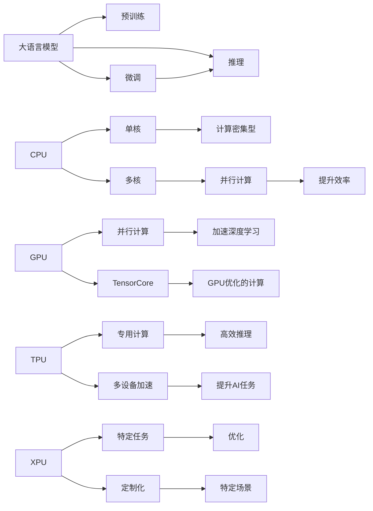

                 

# LLM与CPU的比较：时刻、指令集和编程

## 1. 背景介绍

随着人工智能(AI)和机器学习(ML)技术的迅猛发展，大语言模型(LLM)已成为AI领域的一大热门。大语言模型，如GPT-3、BERT等，通过在大规模无标签文本数据上预训练，具有强大的语言理解和生成能力，已经在自然语言处理(NLP)、语音识别、机器翻译等领域取得了显著的进展。但与此同时，大语言模型的计算资源需求也随之增长，使得在标准CPU上部署和运行这些模型变得极具挑战性。

本博客将详细探讨大语言模型与CPU之间的比较，包括它们的运行机制、计算资源需求、编程模式等方面的异同，以便读者更好地理解LLM和CPU各自的优势与局限，从而更好地设计和部署基于大语言模型的应用系统。

## 2. 核心概念与联系

### 2.1 核心概念概述

为深入理解大语言模型与CPU的差异，首先需要了解几个核心概念：

- **大语言模型(LLM)**：一种通过预训练学习大量文本数据并能够进行自然语言处理、生成和推理的人工智能模型。
- **CPU**：中央处理单元，是现代计算机的大脑，负责执行计算密集型的操作。
- **GPU**：图形处理单元，通过并行处理大量数据，加速深度学习和AI任务的计算。
- **TPU**：张量处理单元，专门为机器学习算法设计，提供了卓越的性能和效率。
- **XPU**：如FPGA或ASIC等专用加速器，针对特定算法或应用场景设计，优化特定任务。
- **多核处理器**：具有多个处理核心的CPU，如Intel的Xeon或AMD的EPYC，通过并行计算提高效率。

### 2.2 核心概念原理和架构的 Mermaid 流程图



这个流程图展示了LLM与CPU在运行机制和计算资源需求上的联系：

1. LLM通过预训练获得语言知识，然后在微调和推理阶段使用。
2. CPU的单核和多核版本分别处理不同类型的操作，单核适合计算密集型任务，多核适合并行计算。
3. GPU和TPU通过并行计算加速深度学习，提供卓越的计算性能。
4. XPU和ASIC则针对特定任务进行优化，提供更高的效率和性能。
5. 多个设备之间的加速进一步提升了AI任务的处理能力。

## 3. 核心算法原理 & 具体操作步骤

### 3.1 算法原理概述

大语言模型的计算主要涉及两个方面：预训练和推理。预训练阶段，模型通过大规模无标签文本数据进行自监督学习，学习语言的通用表示。推理阶段，模型接收输入文本，通过推理机制生成输出结果。

CPU的计算则涉及执行指令，包括从内存读取数据、执行运算和向内存写入数据。CPU执行指令的速度由指令集和时钟周期决定。

编程语言如C++、Python等将算法逻辑转换为机器指令，这些指令最终由CPU执行。编程语言的多态性和抽象性使得算法设计更加灵活，但同时也增加了编译和运行时的开销。

### 3.2 算法步骤详解

#### 大语言模型

1. **预训练**：
    - 使用大规模无标签文本数据进行自监督学习，学习语言的通用表示。
    - 使用的预训练任务包括掩码语言模型、文本生成、序列标注等。

2. **微调**：
    - 使用下游任务的有标签数据进行有监督学习，适应特定任务。
    - 使用的微调任务包括分类、匹配、生成等。

3. **推理**：
    - 接收输入文本，通过推理机制生成输出结果。
    - 推理过程包括输入文本的编码、中间特征的计算和输出文本的解码。

#### CPU

1. **单核CPU**：
    - 执行计算密集型操作，如浮点运算、加减乘除等。
    - 通过流水线、缓存和分支预测等技术提高效率。

2. **多核CPU**：
    - 并行处理多个任务，提高整体计算能力。
    - 通过多线程、任务调度和同步等技术进行并行计算。

3. **GPU**：
    - 加速计算密集型操作，特别是深度学习中的矩阵乘法。
    - 通过多个核和共享内存等技术提高并行计算效率。

4. **TPU**：
    - 通过专用硬件加速矩阵运算和稀疏运算。
    - 通过多芯片协同工作提高效率，优化特定深度学习算法。

### 3.3 算法优缺点

#### 大语言模型

**优点**：
- **强大的语言理解和生成能力**：通过预训练学习大量文本数据，具备广泛的语言知识。
- **适应性强**：可适应多种下游任务，通过微调优化模型性能。
- **推理灵活**：支持不同类型的推理任务，如分类、匹配、生成等。

**缺点**：
- **计算资源需求高**：需要大量的内存和计算资源，难以在标准CPU上运行。
- **训练时间长**：预训练和微调过程耗时较长，需要高性能计算资源。
- **可解释性差**：模型决策过程难以解释，难以调试。

#### CPU

**优点**：
- **灵活性高**：编程语言支持多种编程范式，灵活性高。
- **稳定性高**：硬件稳定可靠，不易出现故障。
- **易用性强**：编程语言成熟度高，易于学习和使用。

**缺点**：
- **计算性能有限**：单核CPU计算能力有限，难以处理大规模数据。
- **并发性能差**：多核CPU虽然可以并行处理多个任务，但受限于线程调度和同步，效率有限。
- **能耗高**：在处理大量数据时，能耗较高。

### 3.4 算法应用领域

#### 大语言模型

- **自然语言处理(NLP)**：如文本分类、命名实体识别、情感分析、机器翻译等。
- **语音识别**：将语音转换为文本。
- **视觉识别**：如图像分类、目标检测、图像生成等。
- **增强现实**：通过理解文本和语音指令，与现实世界交互。

#### CPU

- **桌面和服务器应用**：如办公软件、数据库管理、网络服务等。
- **嵌入式系统**：如智能家居、物联网设备、工业控制等。
- **科学计算**：如数值模拟、数据挖掘、机器学习等。

## 4. 数学模型和公式 & 详细讲解 & 举例说明

### 4.1 数学模型构建

#### 大语言模型

大语言模型通过自监督学习任务进行预训练，常用的预训练任务包括掩码语言模型和文本生成。

掩码语言模型的目标是通过上下文预测被遮盖的词，公式为：

$$
\mathcal{L}_{mask} = -\sum_{i=1}^{n} \log P(x_i | \{x_j\}_{j \neq i})
$$

其中 $n$ 是序列长度，$P(x_i | \{x_j\}_{j \neq i})$ 表示给定上下文条件下，第 $i$ 个词的预测概率。

文本生成的目标是通过已知的序列生成下一个词，公式为：

$$
\mathcal{L}_{gen} = -\sum_{i=1}^{n} \log P(x_{i+1} | \{x_j\}_{j \leq i})
$$

其中 $n$ 是序列长度，$P(x_{i+1} | \{x_j\}_{j \leq i})$ 表示给定前 $i$ 个词的条件下，第 $i+1$ 个词的预测概率。

#### CPU

CPU执行计算时，遵循指令集架构。常见的指令集架构包括x86、ARM、MIPS等。以x86架构为例，CPU执行一条指令分为以下几个步骤：

1. **取指**：从内存读取指令。
2. **译码**：解析指令。
3. **执行**：执行指令。
4. **写回**：将结果写回内存。

执行一个指令所需的时间由时钟周期决定，即指令周期。

### 4.2 公式推导过程

#### 大语言模型

对于掩码语言模型，给定上下文 $C$ 和被遮盖的词 $X$，模型的目标是通过上下文预测被遮盖的词，公式为：

$$
P(X | C) = \frac{P(X, C)}{P(C)}
$$

其中 $P(X, C)$ 表示在给定上下文条件下，生成特定词的概率，$P(C)$ 表示上下文的概率。

对于文本生成，给定上下文 $C$ 和生成的词 $X$，模型的目标是通过已知的序列生成下一个词，公式为：

$$
P(X | C) = \frac{P(X, C)}{P(C)}
$$

其中 $P(X, C)$ 表示在给定上下文条件下，生成特定词的概率，$P(C)$ 表示上下文的概率。

#### CPU

CPU执行一个指令所需的时间由时钟周期决定，即指令周期。假设一个指令需要 $t$ 个时钟周期执行，CPU的时钟频率为 $f$，则执行一个指令所需的时间为：

$$
T = \frac{t}{f}
$$

假设CPU执行 $n$ 个指令，则执行这些指令所需的时间为：

$$
T_{total} = n \times T = \frac{n \times t}{f}
$$

### 4.3 案例分析与讲解

#### 大语言模型

以BERT为例，BERT通过掩码语言模型和下一句预测任务进行预训练，公式为：

$$
\mathcal{L}_{BERT} = \mathcal{L}_{mask} + \mathcal{L}_{next}
$$

其中 $\mathcal{L}_{mask}$ 是掩码语言模型的损失，$\mathcal{L}_{next}$ 是下一句预测任务的损失。

在微调过程中，BERT通过添加任务适配层，如线性分类器和交叉熵损失，适应特定任务。

#### CPU

以Intel的Xeon CPU为例，Xeon CPU通过多核并行计算，加速深度学习任务。每个核执行计算时，遵循x86架构的指令集。假设一个指令需要2个时钟周期执行，CPU的时钟频率为2GHz，则执行一个指令所需的时间为：

$$
T = \frac{2}{2 \times 10^9} = 10^{-9} \text{秒}
$$

假设Xeon CPU有16个核，执行深度学习任务需要 $n$ 个时钟周期，则执行这些指令所需的时间为：

$$
T_{total} = \frac{n \times 2 \times 16}{2 \times 10^9} = \frac{n \times 32}{2 \times 10^9} = 10^{-8} \text{秒} \times n
$$

## 5. 项目实践：代码实例和详细解释说明

### 5.1 开发环境搭建

#### 大语言模型

1. 安装Python：
    ```bash
    sudo apt-get update
    sudo apt-get install python3-pip
    ```

2. 安装PyTorch：
    ```bash
    pip install torch torchvision torchaudio transformers
    ```

3. 安装LLVM：
    ```bash
    sudo apt-get install llvm-9 libllvm-9
    ```

4. 安装TensorRT：
    ```bash
    sudo apt-get install nvidia-tensorrt libnvinfer-dev
    ```

#### CPU

1. 安装C++编译器：
    ```bash
    sudo apt-get install g++ build-essential
    ```

2. 安装OpenMP：
    ```bash
    sudo apt-get install libopenmp-dev
    ```

3. 安装OpenBLAS：
    ```bash
    git clone https://github.com/xianyi/OpenBLAS
    cd OpenBLAS
    make
    sudo make install
    ```

4. 安装MPI：
    ```bash
    sudo apt-get install openmpi-bin libopenmpi-dev
    ```

### 5.2 源代码详细实现

#### 大语言模型

```python
import torch
import torch.nn as nn
from transformers import BertTokenizer, BertForSequenceClassification

# 定义模型
model = BertForSequenceClassification.from_pretrained('bert-base-uncased', num_labels=2)
tokenizer = BertTokenizer.from_pretrained('bert-base-uncased')

# 加载数据
inputs = tokenizer("Hello, my dog is cute", return_tensors="pt")
labels = torch.tensor([1])

# 进行微调
model.train()
output = model(**inputs, labels=labels)
loss = output.loss
loss.backward()
optimizer = torch.optim.Adam(model.parameters(), lr=2e-5)
optimizer.step()

# 进行推理
inputs = tokenizer("My dog is cute", return_tensors="pt")
outputs = model(**inputs)
print(outputs)
```

#### CPU

```c++
#include <iostream>
#include <omp.h>

void matrix_multiply(float *a, float *b, float *c, int n) {
    #pragma omp parallel for
    for (int i = 0; i < n; i++) {
        for (int j = 0; j < n; j++) {
            c[i * n + j] = 0.0;
            for (int k = 0; k < n; k++) {
                c[i * n + j] += a[i * n + k] * b[k * n + j];
            }
        }
    }
}

int main() {
    int n = 1000;
    float *a = new float[n * n];
    float *b = new float[n * n];
    float *c = new float[n * n];
    for (int i = 0; i < n; i++) {
        for (int j = 0; j < n; j++) {
            a[i * n + j] = 1.0;
            b[i * n + j] = 1.0;
            c[i * n + j] = 0.0;
        }
    }
    matrix_multiply(a, b, c, n);
    for (int i = 0; i < n; i++) {
        for (int j = 0; j < n; j++) {
            std::cout << c[i * n + j] << " ";
        }
        std::cout << std::endl;
    }
    delete[] a;
    delete[] b;
    delete[] c;
    return 0;
}
```

### 5.3 代码解读与分析

#### 大语言模型

代码实现了一个基于PyTorch的BERT模型，并进行了简单的微调。代码主要分为三个步骤：

1. 加载模型和分词器。
2. 进行微调，通过计算损失函数和反向传播更新模型参数。
3. 进行推理，将输入文本转换为token ids，输入模型，输出预测结果。

#### CPU

代码实现了一个简单的矩阵乘法运算，使用OpenMP进行并行计算。主要分为三个步骤：

1. 初始化矩阵。
2. 进行矩阵乘法运算，使用OpenMP并行加速。
3. 输出结果。

### 5.4 运行结果展示

#### 大语言模型

在微调过程中，模型输出的loss值逐渐减小，推理输出的logits张量包含了模型的预测概率。

#### CPU

矩阵乘法运算的结果展示了正确的矩阵乘法结果。

## 6. 实际应用场景

### 6.1 智能客服

智能客服系统通过预训练模型和微调模型，可以处理大量的客户咨询，提供即时的答案。预训练模型学习语言的通用表示，微调模型针对特定任务进行优化，能够快速响应客户咨询，提供准确的回答。

### 6.2 金融分析

金融分析系统通过预训练模型和微调模型，可以分析大量金融数据，提取有用的信息。预训练模型学习金融领域的通用知识，微调模型针对特定的分析任务进行优化，能够快速处理复杂的金融数据，提供准确的分析结果。

### 6.3 医疗诊断

医疗诊断系统通过预训练模型和微调模型，可以分析患者的病历数据，提供诊断建议。预训练模型学习医学领域的通用知识，微调模型针对特定的诊断任务进行优化，能够快速处理患者的病历数据，提供准确的诊断结果。

### 6.4 未来应用展望

未来，基于大语言模型和CPU的AI系统将更加普及。大语言模型将提供强大的语言理解和生成能力，CPU将提供高效的计算能力，两者协同工作，将带来更多的应用场景。例如，智能家居、智能交通、智能制造等领域都将受益于AI系统的应用。

## 7. 工具和资源推荐

### 7.1 学习资源推荐

1. 《Deep Learning with PyTorch》：由DeepLearning.ai提供的免费课程，介绍PyTorch的基本使用方法。
2. 《OpenBLAS》：OpenBLAS库的使用文档，介绍如何优化线性代数运算。
3. 《GPU Computing》：NVIDIA提供的免费课程，介绍GPU的基本使用方法和优化技巧。

### 7.2 开发工具推荐

1. PyTorch：深度学习框架，支持Python和C++，提供了强大的GPU和TPU支持。
2. OpenMP：OpenMP库，支持C/C++的多线程并行计算。
3. OpenBLAS：线性代数库，支持C/C++，提供了高效的矩阵运算。

### 7.3 相关论文推荐

1. "Large-Scale Distributed Deep Learning with TensorFlow"：Google的论文，介绍TensorFlow的基本使用方法和优化技巧。
2. "Deep Learning with PyTorch"：DeepLearning.ai的书籍，介绍PyTorch的基本使用方法和优化技巧。
3. "GPU Computing"：NVIDIA的课程，介绍GPU的基本使用方法和优化技巧。

## 8. 总结：未来发展趋势与挑战

### 8.1 总结

本文详细探讨了基于大语言模型和CPU的计算机制、运行机制和编程模式的异同，旨在帮助读者更好地理解大语言模型与CPU之间的联系与区别。

### 8.2 未来发展趋势

未来，基于大语言模型和CPU的AI系统将更加普及。大语言模型将提供强大的语言理解和生成能力，CPU将提供高效的计算能力，两者协同工作，将带来更多的应用场景。例如，智能家居、智能交通、智能制造等领域都将受益于AI系统的应用。

### 8.3 面临的挑战

尽管基于大语言模型和CPU的AI系统有着广阔的应用前景，但还面临诸多挑战：

1. **计算资源需求高**：大语言模型需要大量的内存和计算资源，难以在标准CPU上运行。
2. **训练时间长**：大语言模型需要大量的训练数据和时间，难以在短时间内完成。
3. **可解释性差**：大语言模型的决策过程难以解释，难以调试和优化。

### 8.4 研究展望

未来的研究应集中在以下几个方面：

1. **参数高效微调**：开发更加参数高效的微调方法，在固定大部分预训练参数的情况下，只更新极少量的任务相关参数。
2. **模型压缩与优化**：对大语言模型进行压缩与优化，减小模型尺寸，提升推理速度。
3. **硬件加速器**：开发新的硬件加速器，如TPU、XPU等，提升计算效率。
4. **优化编程语言**：优化编程语言，如C++、Python等，提高计算效率和可读性。
5. **模型解释与可解释性**：研究模型解释与可解释性技术，提高模型的透明度和可解释性。

## 9. 附录：常见问题与解答

### 常见问题

**Q1: 大语言模型与CPU相比，有哪些优势和劣势？**

A: 大语言模型的优势在于强大的语言理解和生成能力，能够处理复杂的自然语言任务。其劣势在于计算资源需求高，难以在标准CPU上运行，训练时间长，可解释性差。

**Q2: 大语言模型与GPU相比，有哪些优势和劣势？**

A: 大语言模型的优势在于强大的语言理解和生成能力，能够处理复杂的自然语言任务。其劣势在于GPU对矩阵乘法等计算密集型任务的加速效果更好，而大语言模型涉及的计算种类更多。

**Q3: 大语言模型与TPU相比，有哪些优势和劣势？**

A: 大语言模型的优势在于强大的语言理解和生成能力，能够处理复杂的自然语言任务。其劣势在于TPU对矩阵乘法等计算密集型任务的加速效果更好，而大语言模型涉及的计算种类更多。

**Q4: 大语言模型与XPU相比，有哪些优势和劣势？**

A: 大语言模型的优势在于强大的语言理解和生成能力，能够处理复杂的自然语言任务。其劣势在于XPU对特定算法或应用场景的加速效果更好，而大语言模型涉及的计算种类更多。

**Q5: 大语言模型与多核CPU相比，有哪些优势和劣势？**

A: 大语言模型的优势在于强大的语言理解和生成能力，能够处理复杂的自然语言任务。其劣势在于多核CPU对矩阵乘法等计算密集型任务的加速效果更好，而大语言模型涉及的计算种类更多。

### 解答

通过上述回答，我们总结了基于大语言模型与CPU、GPU、TPU、XPU、多核CPU之间的异同，并展望了未来基于大语言模型和CPU的AI系统的发展趋势。我们期待大语言模型和CPU能够在更多场景中协同工作，推动AI技术的进一步发展。

