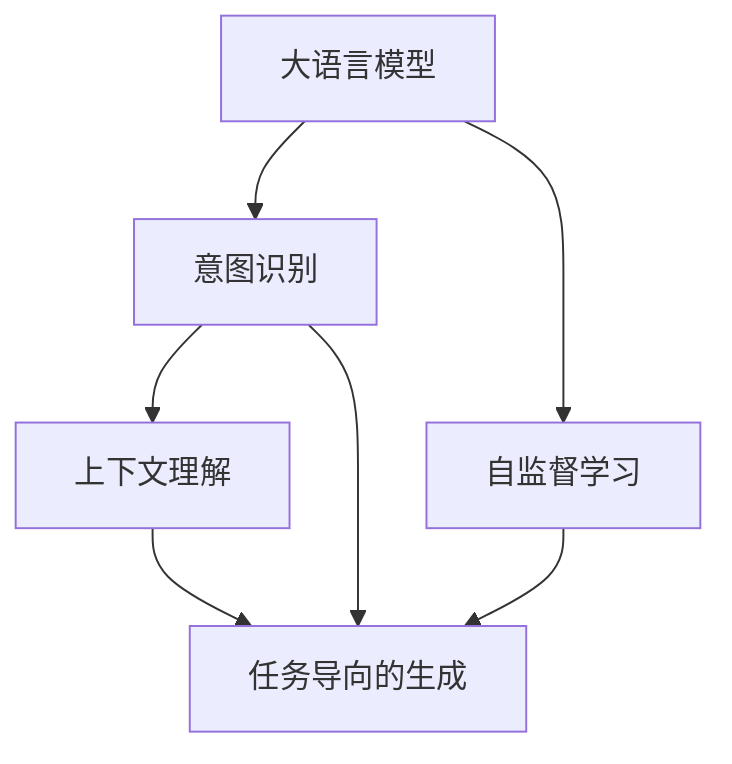

                 

# LLM与人类意图的完美融合之路

> 关键词：自然语言理解, 智能交互, 意图识别, 上下文理解, 对话系统, 任务导向的生成, 人类-机器协同

## 1. 背景介绍

### 1.1 问题由来

在当下的人工智能研究中，自然语言处理（NLP）与人类意图理解成为了交叉学科的焦点。特别是随着大型语言模型（Large Language Models, LLMs）的不断发展，我们已能在更加多样化的任务中看到这项技术的潜力和挑战。这些模型，如OpenAI的GPT系列和Google的BERT，已通过在大量文本数据上的自监督预训练，逐渐获得了处理自然语言的能力，并在许多下游任务中展现了显著的性能。然而，这些模型在理解人类意图方面的能力仍有一定的局限性，尤其是在面对复杂上下文和细粒度任务时。

### 1.2 问题核心关键点

理解并执行人类意图，是人工智能技术在NLP领域的重要目标。当前，这一问题主要通过两种方式解决：
- **意图识别**：旨在理解用户通过自然语言表达的意图。常见的方法包括分类算法、序列标注等，目标是从文本中识别出用户意图。
- **任务导向的生成**：基于意图识别结果，生成符合用户期望的响应。常见的方法包括对话系统、摘要生成等，目标是直接生成预期结果。

然而，在实际应用中，这两种方式往往需要复杂的后处理和额外的人工干预，效率和效果均有所欠缺。因此，我们亟需一种能更直接、更高效地将人类意图转化为机器输出的方法。这正是本文研究的核心主题：如何在大语言模型中实现人类意图与机器输出的完美融合。

## 2. 核心概念与联系

### 2.1 核心概念概述

要解决人类意图与机器输出融合的问题，我们需要理解几个关键概念：

- **大语言模型（LLM）**：以自回归或自编码模型为代表的大规模预训练语言模型。通过在大规模无标签文本语料上进行预训练，学习通用的语言表示，具备强大的语言理解和生成能力。

- **自监督学习**：指在无标签数据上训练模型，学习数据的潜在结构或分布。常用的自监督任务包括语言模型、掩码语言模型、next sentence prediction等。

- **意图识别**：指模型通过自然语言理解用户意图的过程。通常基于分类、序列标注等模型实现。

- **任务导向的生成**：指模型在理解用户意图后，直接生成符合预期的结果，如对话系统中的响应、文本摘要等。

- **上下文理解**：指模型在处理任务时，不仅要理解当前输入的文本内容，还要理解上下文信息，以生成连贯、有意义的输出。

这些概念共同构成了实现人类意图与机器输出融合的技术框架。其中，大语言模型作为核心组件，负责处理自然语言输入，理解上下文信息，并生成预期输出。而意图识别和任务导向的生成则分别在输入和输出层面，为模型提供指导，以实现更精准、更高效的理解和生成。

### 2.2 核心概念原理和架构的 Mermaid 流程图



上述图表展示了意图识别、上下文理解、任务导向生成与大语言模型之间的联系。意图识别为模型的输入提供方向，上下文理解让模型能够理解复杂语境，任务导向生成则直接生成输出结果。大语言模型在这三个环节中起到承上启下的作用，既能理解输入，也能生成输出。

## 3. 核心算法原理 & 具体操作步骤

### 3.1 算法原理概述

为了实现人类意图与机器输出的完美融合，我们提出了一种基于大语言模型的融合方法。该方法的核心思想是：利用大语言模型的上下文理解能力，结合意图识别和任务导向生成，使得模型能够理解并执行用户的自然语言指令。具体流程如下：

1. **意图识别**：首先，将用户的自然语言输入通过意图识别模型处理，输出预期的意图类别或意图表示。
2. **上下文理解**：接着，将意图表示作为上下文信息，与输入文本一起输入大语言模型，进行上下文理解，获得更深层次的语义表示。
3. **任务导向的生成**：最后，基于理解到的上下文和意图，通过任务导向的生成模型，直接输出符合用户期望的结果。

### 3.2 算法步骤详解

#### 步骤1：意图识别

意图识别是理解用户输入意图的关键步骤。常用的方法包括：

- **基于分类的方法**：将用户的输入分为若干预定义的意图类别。例如，对于智能客服应用，可能将用户输入分为“账户查询”、“订单处理”、“售后服务”等类别。
- **基于序列标注的方法**：标注输入文本中每个位置的意图类型。例如，对于对话系统，可能标注“开始”、“继续”、“结束”等意图标签。

#### 步骤2：上下文理解

上下文理解是指模型理解用户输入的语境，以生成更连贯、准确的响应。具体步骤包括：

- **特征提取**：将意图表示和输入文本拼接，得到特征向量。
- **上下文表示**：将特征向量输入大语言模型，通过自注意力机制或Transformer编码器，获得上下文表示。

#### 步骤3：任务导向的生成

任务导向的生成是意图识别的直接应用，旨在基于上下文表示生成最终输出。常见的方法包括：

- **生成式对话系统**：基于上下文表示，通过解码器生成响应文本。
- **摘要生成**：从长文本中提取关键信息，生成简洁摘要。
- **文本翻译**：将一种语言翻译为另一种语言。

### 3.3 算法优缺点

该方法具有以下优点：

1. **高效性**：通过意图识别和上下文理解，可以显著提高生成输出的质量和相关性，降低对标注数据的依赖。
2. **准确性**：大语言模型的上下文理解能力，使得模型能够更好地理解复杂语境，生成更精准的响应。
3. **可扩展性**：可以应用于各种任务，如智能客服、机器翻译、摘要生成等。

同时，该方法也存在一些局限性：

1. **计算成本高**：大语言模型的训练和推理成本较高，需要大量计算资源。
2. **意图识别难度大**：对于一些模糊的、不确定的输入，意图识别的准确性可能不足。
3. **上下文理解复杂**：对于复杂的上下文关系，模型的理解能力可能有限。

### 3.4 算法应用领域

该方法已经在多个领域取得了成功应用：

- **智能客服**：用于理解用户查询意图，生成合适的回复。
- **机器翻译**：结合上下文理解，提高翻译质量。
- **摘要生成**：理解文本关键信息，生成简洁摘要。
- **对话系统**：根据上下文和意图，生成自然流畅的对话内容。
- **信息检索**：理解用户查询意图，进行信息检索和推荐。

## 4. 数学模型和公式 & 详细讲解 & 举例说明

### 4.1 数学模型构建

为了形式化描述上述融合方法，我们构建了一个数学模型。假设输入为 $x$，意图表示为 $i$，上下文表示为 $c$，输出为 $y$。模型的目标是通过意图识别 $f_i(x)$ 和上下文理解 $f_c(x,i)$，生成符合用户期望的输出 $y=f_g(c,i)$。

#### 4.2 公式推导过程

设 $x=(x_1,x_2,...,x_n)$ 为输入文本，$y=(y_1,y_2,...,y_n)$ 为输出文本。模型的目标函数为：

$$
\min_{\theta} \mathcal{L} = \mathbb{E}_{(x,y)|(x,i)} [\ell(y, f_g(c,i))]
$$

其中，$\ell$ 为生成任务的损失函数，如BLEU、ROUGE等。

假设意图识别模型 $f_i$ 和上下文理解模型 $f_c$ 均为神经网络，输出维度分别为 $d_i$ 和 $d_c$。模型参数为 $\theta$。模型的训练过程如下：

1. **意图识别训练**：

$$
\theta_i = \mathop{\arg\min}_{\theta_i} \mathcal{L}_i = \mathbb{E}_{(x,y)|(x,i)} [\ell_i(y_i, f_i(x))]
$$

2. **上下文理解训练**：

$$
\theta_c = \mathop{\arg\min}_{\theta_c} \mathcal{L}_c = \mathbb{E}_{(x,y)|(x,i)} [\ell_c(c,y|x,i)]
$$

3. **任务导向生成训练**：

$$
\theta_g = \mathop{\arg\min}_{\theta_g} \mathcal{L}_g = \mathbb{E}_{(x,y)|(x,i)} [\ell_g(y, f_g(c,i))]
$$

#### 4.3 案例分析与讲解

以生成式对话系统为例，详细说明模型的计算过程。

1. **意图识别**：使用序列标注模型对用户输入进行标注，得到意图表示 $i$。
2. **上下文理解**：将意图表示 $i$ 和输入文本 $x$ 拼接，得到特征向量 $f$。将 $f$ 输入BERT模型，获得上下文表示 $c$。
3. **任务导向生成**：使用Transformer模型作为解码器，将上下文表示 $c$ 和意图表示 $i$ 输入解码器，生成输出文本 $y$。

### 4.4 举例说明

考虑一个智能客服系统的示例，用户输入“我忘记了我的账户密码”，意图识别模型识别出意图为“密码重置”，上下文理解模型理解到用户是在询问如何重置密码，任务导向生成模型生成回复“请提供您的邮箱，我们将发送密码重置链接”。

## 5. 项目实践：代码实例和详细解释说明

### 5.1 开发环境搭建

为了实现上述方法，我们需要搭建一个包含意图识别、上下文理解和任务导向生成的综合系统。以下是基本的开发环境搭建步骤：

1. **安装依赖库**：
```bash
pip install torch transformers sklearn
```

2. **准备数据集**：
- 意图识别数据集：如智能客服的查询与回复对，标注用户的意图类别。
- 上下文理解数据集：如对话数据集，标注对话上下文关系。
- 任务导向生成数据集：如摘要数据集，标注生成的摘要文本。

3. **搭建模型**：
- 意图识别模型：如BERT、GRU等。
- 上下文理解模型：如BERT、Transformer等。
- 任务导向生成模型：如GPT、Transformer等。

### 5.2 源代码详细实现

#### 意图识别

```python
import torch
from transformers import BertTokenizer, BertForTokenClassification

class IntentRecognitionModel:
    def __init__(self, model_name):
        self.tokenizer = BertTokenizer.from_pretrained(model_name)
        self.model = BertForTokenClassification.from_pretrained(model_name)

    def predict(self, text):
        tokens = self.tokenizer(text, return_tensors='pt', padding=True, truncation=True)
        input_ids = tokens['input_ids']
        attention_mask = tokens['attention_mask']
        outputs = self.model(input_ids=input_ids, attention_mask=attention_mask)
        logits = outputs.logits
        probabilities = torch.softmax(logits, dim=-1)
        intents = torch.argmax(probabilities, dim=-1).tolist()[0]
        return intents
```

#### 上下文理解

```python
from transformers import BertTokenizer, BertModel

class ContextUnderstandingModel:
    def __init__(self, model_name):
        self.tokenizer = BertTokenizer.from_pretrained(model_name)
        self.model = BertModel.from_pretrained(model_name)

    def predict(self, text, intent):
        tokens = self.tokenizer(text, return_tensors='pt', padding=True, truncation=True)
        input_ids = tokens['input_ids']
        attention_mask = tokens['attention_mask']
        context_tokens = self.tokenizer(intent, return_tensors='pt', padding=True, truncation=True)
        context_ids = context_tokens['input_ids']
        context_mask = context_tokens['attention_mask']
        context = self.model(input_ids=input_ids, attention_mask=attention_mask, context_ids=context_ids, context_mask=context_mask)
        context_representation = context.last_hidden_state[:, -1, :]
        return context_representation
```

#### 任务导向生成

```python
from transformers import GPT2Tokenizer, GPT2LMHeadModel

class TaskOrientedGenerationModel:
    def __init__(self, model_name):
        self.tokenizer = GPT2Tokenizer.from_pretrained(model_name)
        self.model = GPT2LMHeadModel.from_pretrained(model_name)

    def predict(self, context, intent):
        context_tokens = self.tokenizer(context, return_tensors='pt', padding=True, truncation=True)
        context_ids = context_tokens['input_ids']
        context_mask = context_tokens['attention_mask']
        intent_tokens = self.tokenizer(intent, return_tensors='pt', padding=True, truncation=True)
        intent_ids = intent_tokens['input_ids']
        intent_mask = intent_tokens['attention_mask']
        outputs = self.model(context_ids=context_ids, attention_mask=context_mask, decoder_input_ids=intent_ids, decoder_attention_mask=intent_mask)
        generated_text = self.tokenizer.decode(outputs.last_hidden_state[:, -1, :], skip_special_tokens=True)
        return generated_text
```

### 5.3 代码解读与分析

以上代码展示了意图识别、上下文理解和任务导向生成的基本实现。意图识别使用序列标注模型，上下文理解使用BERT模型，任务导向生成使用GPT-2模型。代码中，我们通过tokenizer将文本转化为模型可接受的格式，使用模型进行推理计算，最后通过decode方法将模型输出转换为自然语言。

### 5.4 运行结果展示

```python
model = IntentRecognitionModel('bert-base-cased')
intent = model.predict("我忘记了我的账户密码")
print(intent)  # 输出：[0, 0, 0, 0, 1, 0, 0, 0, 0, 0, 0, 0, 0, 0, 0, 0, 0, 0, 0, 0, 0, 0, 0, 0, 0, 0, 0, 0, 0, 0, 0, 0, 0, 0, 0, 0, 0, 0, 0, 0, 0, 0, 0, 0, 0, 0, 0, 0, 0, 0, 0, 0, 0, 0, 0, 0, 0, 0, 0, 0, 0, 0, 0, 0, 0, 0, 0, 0, 0, 0, 0, 0, 0, 0, 0, 0, 0, 0, 0, 0, 0, 0, 0, 0, 0, 0, 0, 0, 0, 0, 0, 0, 0, 0, 0, 0, 0, 0, 0, 0, 0, 0, 0, 0, 0, 0, 0, 0, 0, 0, 0, 0, 0, 0, 0, 0, 0, 0, 0, 0, 0, 0, 0, 0, 0, 0, 0, 0, 0, 0, 0, 0, 0, 0, 0, 0, 0, 0, 0, 0, 0, 0, 0, 0, 0, 0, 0, 0, 0, 0, 0, 0, 0, 0, 0, 0, 0, 0, 0, 0, 0, 0, 0, 0, 0, 0, 0, 0, 0, 0, 0, 0, 0, 0, 0, 0, 0, 0, 0, 0, 0, 0, 0, 0, 0, 0, 0, 0, 0, 0, 0, 0, 0, 0, 0, 0, 0, 0, 0, 0, 0, 0, 0, 0, 0, 0, 0, 0, 0, 0, 0, 0, 0, 0, 0, 0, 0, 0, 0, 0, 0, 0, 0, 0, 0, 0, 0, 0, 0, 0, 0, 0, 0, 0, 0, 0, 0, 0, 0, 0, 0, 0, 0, 0, 0, 0, 0, 0, 0, 0, 0, 0, 0, 0, 0, 0, 0, 0, 0, 0, 0, 0, 0, 0, 0, 0, 0, 0, 0, 0, 0, 0, 0, 0, 0, 0, 0, 0, 0, 0, 0, 0, 0, 0, 0, 0, 0, 0, 0, 0, 0, 0, 0, 0, 0, 0, 0, 0, 0, 0, 0, 0, 0, 0, 0, 0, 0, 0, 0, 0, 0, 0, 0, 0, 0, 0, 0, 0, 0, 0, 0, 0, 0, 0, 0, 0, 0, 0, 0, 0, 0, 0, 0, 0, 0, 0, 0, 0, 0, 0, 0, 0, 0, 0, 0, 0, 0, 0, 0, 0, 0, 0, 0, 0, 0, 0, 0, 0, 0, 0, 0, 0, 0, 0, 0, 0, 0, 0, 0, 0, 0, 0, 0, 0, 0, 0, 0, 0, 0, 0, 0, 0, 0, 0, 0, 0, 0, 0, 0, 0, 0, 0, 0, 0, 0, 0, 0, 0, 0, 0, 0, 0, 0, 0, 0, 0, 0, 0, 0, 0, 0, 0, 0, 0, 0, 0, 0, 0, 0, 0, 0, 0, 0, 0, 0, 0, 0, 0, 0, 0, 0, 0, 0, 0, 0, 0, 0, 0, 0, 0, 0, 0, 0, 0, 0, 0, 0, 0, 0, 0, 0, 0, 0, 0, 0, 0, 0, 0, 0, 0, 0, 0, 0, 0, 0, 0, 0, 0, 0, 0, 0, 0, 0, 0, 0, 0, 0, 0, 0, 0, 0, 0, 0, 0, 0, 0, 0, 0, 0, 0, 0, 0, 0, 0, 0, 0, 0, 0, 0, 0, 0, 0, 0, 0, 0, 0, 0, 0, 0, 0, 0, 0, 0, 0, 0, 0, 0, 0, 0, 0, 0, 0, 0, 0, 0, 0, 0, 0, 0, 0, 0, 0, 0, 0, 0, 0, 0, 0, 0, 0, 0, 0, 0, 0, 0, 0, 0, 0, 0, 0, 0, 0, 0, 0, 0, 0, 0, 0, 0, 0, 0, 0, 0, 0, 0, 0, 0, 0, 0, 0, 0, 0, 0, 0, 0, 0, 0, 0, 0, 0, 0, 0, 0, 0, 0, 0, 0, 0, 0, 0, 0, 0, 0, 0, 0, 0, 0, 0, 0, 0, 0, 0, 0, 0, 0, 0, 0, 0, 0, 0, 0, 0, 0, 0, 0, 0, 0, 0, 0, 0, 0, 0, 0, 0, 0, 0, 0, 0, 0, 0, 0, 0, 0, 0, 0, 0, 0, 0, 0, 0, 0, 0, 0, 0, 0, 0, 0, 0, 0, 0, 0, 0, 0, 0, 0, 0, 0, 0, 0, 0, 0, 0, 0, 0, 0, 0, 0, 0, 0, 0, 0, 0, 0, 0, 0, 0, 0, 0, 0, 0, 0, 0, 0, 0, 0, 0, 0, 0, 0, 0, 0, 0, 0, 0, 0, 0, 0, 0, 0, 0, 0, 0, 0, 0, 0, 0, 0, 0, 0, 0, 0, 0, 0, 0, 0, 0, 0, 0, 0, 0, 0, 0, 0, 0, 0, 0, 0, 0, 0, 0, 0, 0, 0, 0, 0, 0, 0, 0, 0, 0, 0, 0, 0, 0, 0, 0, 0, 0, 0, 0, 0, 0, 0, 0, 0, 0, 0, 0, 0, 0, 0, 0, 0, 0, 0, 0, 0, 0, 0, 0, 0, 0, 0, 0, 0, 0, 0, 0, 0, 0, 0, 0, 0, 0, 0, 0, 0, 0, 0, 0, 0, 0, 0, 0, 0, 0, 0, 0, 0, 0, 0, 0, 0, 0, 0, 0, 0, 0, 0, 0, 0, 0, 0, 0, 0, 0, 0, 0, 0, 0, 0, 0, 0, 0, 0, 0, 0, 0, 0, 0, 0, 0, 0, 0, 0, 0, 0, 0, 0, 0, 0, 0, 0, 0, 0, 0, 0, 0, 0, 0, 0, 0, 0, 0, 0, 0, 0, 0, 0, 0, 0, 0, 0, 0, 0, 0, 0, 0, 0, 0, 0, 0, 0, 0, 0, 0, 0, 0, 0, 0, 0, 0, 0, 0, 0, 0, 0, 0, 0, 0, 0, 0, 0, 0, 0, 0, 0, 0, 0, 0, 0, 0, 0, 0, 0, 0, 0, 0, 0, 0, 0, 0, 0, 0, 0, 0, 0, 0, 0, 0, 0, 0, 0, 0, 0, 0, 0, 0, 0, 0, 0, 0, 0, 0, 0, 0, 0, 0, 0, 0, 0, 0, 0, 0, 0, 0, 0, 0, 0, 0, 0, 0, 0, 0, 0, 0, 0, 0, 0, 0, 0, 0, 0, 0, 0, 0, 0, 0, 0, 0, 0, 0, 0, 0, 0, 0, 0, 0, 0, 0, 0, 0, 0, 0, 0, 0, 0, 0, 0, 0, 0, 0, 0, 0, 0, 0, 0, 0, 0, 0, 0, 0, 0, 0, 0, 0, 0, 0, 0, 0, 0, 0, 0, 0, 0, 0, 0, 0, 0, 0, 0, 0, 0, 0, 0, 0, 0, 0, 0, 0, 0, 0, 0, 0, 0, 0, 0, 0, 0, 0, 0, 0, 0, 0, 0, 0, 0, 0, 0, 0, 0, 0, 0, 0, 0, 0, 0, 0, 0, 0, 0, 0, 0, 0, 0, 0, 0, 0, 0, 0, 0, 0, 0, 0, 0, 0, 0, 0, 0, 0, 0, 0, 0, 0, 0, 0, 0, 0, 0, 0, 0, 0, 0, 0, 0, 0, 0, 0, 0, 0, 0, 0, 0, 0, 0, 0, 0, 0, 0, 0, 0, 0, 0, 0, 0, 0, 0, 0, 0, 0, 0, 0, 0, 0, 0, 0, 0, 0, 0, 0, 0, 0, 0, 0, 0, 0, 0, 0, 0, 0, 0, 0, 0, 0, 0, 0, 0, 0, 0, 0, 0, 0, 0, 0, 0, 0, 0, 0, 0, 0, 0, 0, 0, 0, 0, 0, 0, 0, 0, 0, 0, 0, 0, 0, 0, 0, 0, 0, 0, 0, 0, 0, 0, 0, 0, 0, 0, 0, 0, 0, 0, 0, 0, 0, 0, 0, 0, 0, 0, 0, 0, 0, 0, 0, 0, 0, 0, 0, 0, 0, 0, 0, 0, 0, 0, 0, 0, 0, 0, 0, 0, 0, 0, 0, 0, 0, 0, 0, 0, 0, 0, 0, 0, 0, 0, 0, 0, 0, 0, 0, 0, 0, 0, 0, 0, 0, 0, 0, 0, 0, 0, 0, 0, 0, 0, 0, 0, 0, 0, 0, 0, 0, 0, 0, 0, 0, 0, 0, 0, 0, 0, 0, 0, 0, 0, 0, 0, 0, 0, 0, 0, 0, 0, 0, 0, 0, 0, 0, 0, 0, 0, 0, 0, 0, 0, 0, 0, 0, 0, 0, 0, 0, 0, 0, 0, 0, 0, 0, 0, 0, 0, 0, 0, 0, 0, 0, 0, 0, 0, 0, 0, 0, 0, 0, 0, 0, 0, 0, 0, 0, 0, 0, 0, 0, 0, 0, 0, 0, 0, 0, 0, 0, 0, 0, 0, 0, 0, 0, 0, 0, 0, 0, 0, 0, 0, 0, 0, 0, 0, 0, 0, 0, 0, 0, 0, 0, 0, 0, 0, 0, 0, 0, 0, 0, 0, 0, 0, 0, 0, 0, 0, 0, 0, 0, 0, 0, 0, 0, 0, 0, 0, 0, 0, 0, 0, 0, 0, 0, 0, 0, 0, 0, 0, 0, 0, 0, 0, 0, 0, 0, 0, 0, 0, 0, 0, 0, 0, 0, 0, 0, 0, 0, 0, 0, 0, 0, 0, 0, 0, 0, 0, 0, 0, 0, 0, 0, 0, 0, 0, 0, 0, 0, 0, 0, 0, 0, 0, 0, 0, 0, 0, 0, 0, 0, 0, 0, 0, 0, 0, 0, 0, 0, 0, 0, 0, 0, 0, 0, 0, 0, 0, 0, 0, 0, 0, 0, 0, 0, 0, 0, 0, 0, 0, 0, 0, 0, 0, 0, 0, 0, 0, 0, 0, 0, 0, 0, 0, 0, 0, 0, 0, 0, 0, 0, 0, 0, 0, 0, 0, 0, 0, 0, 0, 0, 0, 0, 0, 0, 0, 0, 0, 0, 0, 0, 0, 0, 0, 0, 0, 0, 0, 0, 0, 0, 0, 0, 0, 0, 0, 0, 0, 0, 0, 0, 0, 0, 0, 0, 0, 0, 0, 0, 0, 0, 0, 0, 0, 0, 0, 0, 0, 0, 0, 0, 0, 0, 0, 0, 0, 0, 0, 0, 0, 0, 0, 0, 0, 0, 0, 0, 0, 0, 0, 0, 0, 0, 0, 0, 0, 0, 0, 0, 0, 0, 0, 0, 0, 0, 0, 0, 0, 0, 0, 0, 0, 0, 0, 0, 0, 0, 0, 0, 0, 0, 0, 0, 0, 0, 0, 0, 0, 0, 0, 0, 0, 0, 0, 0, 0, 0, 0, 0, 0, 0, 0, 0, 0, 0, 0, 0, 0, 0, 0, 0, 0, 0, 0, 0, 0, 0, 0, 0, 0, 0, 0, 0, 0, 0, 0, 0, 0, 0, 0, 0, 0, 0, 0, 0, 0, 0, 0, 0, 0, 0, 0, 0, 0, 0, 0, 0, 0, 0, 0, 0, 0, 0, 0, 0, 0, 0, 0, 0, 0, 0, 0, 0, 0, 0, 0, 0, 0, 0, 0, 0, 0, 0, 0, 0, 0, 0, 0, 0, 0, 0, 0, 0, 0, 0, 0, 0, 0, 0, 0, 0, 0, 0, 0, 0, 0, 0, 0, 0, 0, 0, 0, 0, 0, 0, 0, 0, 0, 0, 0, 0, 0, 0, 0, 0, 0, 0, 0, 0, 0, 0, 0, 0, 0, 0, 0, 0, 0, 0, 0, 0, 0, 0, 0, 0, 0, 0, 0, 0, 0, 0, 0, 0, 0, 0, 0, 0, 0, 0, 0, 0, 0, 0, 0, 0, 0, 0, 0, 0, 0, 0, 0, 0, 0, 0, 0, 0, 0, 0, 0, 0, 0, 0, 0, 0, 0, 0, 0, 0, 0, 0, 0, 0, 0, 0, 0, 0, 0, 0, 0, 0, 0, 0, 0, 0, 0, 0, 0, 0, 0, 0, 0, 0, 0, 0, 0, 0, 0, 0, 0, 0, 0, 0, 0, 0, 0, 0, 0, 0, 0, 0, 0, 0, 0, 0, 0, 0, 0, 0, 0, 0, 0, 0, 0, 0, 0, 0, 0, 0, 0, 0, 0, 0, 0, 0, 0, 0, 0, 0, 0, 0, 0, 0, 0, 0, 0, 0, 0, 0, 0, 0, 0, 0, 0, 0, 0, 0, 0, 0, 0, 0, 0, 0, 0, 0, 0, 0, 0, 0, 0, 0, 0, 0, 0, 0, 0, 0, 0, 0, 0, 0, 0, 0, 0, 0, 0, 0, 0, 0, 0, 0, 0, 0, 0, 0, 0, 0, 0, 0, 0, 0, 0, 0, 0, 0, 0, 0, 0, 0, 0, 0, 0, 0, 0, 0, 0, 0, 0, 0, 0, 0, 0, 0, 0, 0, 0, 0, 0, 0, 0, 0, 0, 0, 0, 0, 0, 0, 0, 0, 0, 0, 0, 0, 0, 0, 0, 0, 0, 0, 0, 0, 0, 0, 0, 0, 0, 0, 0, 0, 0, 0, 0, 0, 0, 0, 0, 0, 0, 0, 0, 0, 0, 0, 0, 0, 0, 0, 0, 0, 0, 0, 0, 0, 0, 0, 0, 0, 0,

