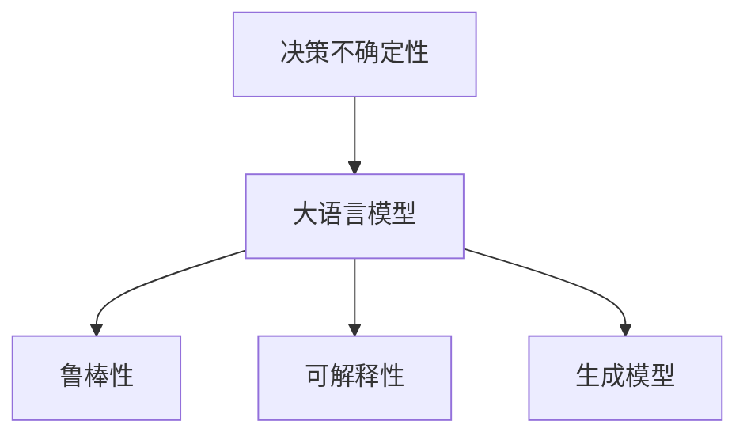

                 

# LLM决策的不确定性：挑战与应对策略

> 关键词：决策不确定性,大语言模型,鲁棒性,可解释性,生成模型

## 1. 背景介绍

在大语言模型(Large Language Model, LLM)的决策过程中，不确定性是一个始终存在的挑战。这种不确定性可能来源于模型本身的结构和参数，也可能来源于模型输入的数据和上下文。例如，相同的输入可能在不同的预训练模型上产生不同的输出；同样的训练数据在不同的优化器上得到不同的结果；基于相同输入的不同模型应用场景下决策差异等等。这些不确定性对于实际应用中的系统稳定性和可靠性构成了巨大挑战。

因此，本文将围绕LLM决策的不确定性，探讨其成因，并介绍一些应对策略。

## 2. 核心概念与联系

### 2.1 核心概念概述

本文将详细探讨以下几个核心概念：

- **决策不确定性**：指在给定相同输入时，不同模型或模型参数对输出结果的影响。
- **大语言模型**：指基于Transformer架构的、大规模预训练语言模型，如GPT-3、BERT等。
- **鲁棒性**：指模型在面对输入噪声、对抗样本等挑战时仍能保持稳定输出的能力。
- **可解释性**：指模型决策结果的可理解性和可追踪性。
- **生成模型**：指通过学习数据分布，直接生成新样本的模型，如GAN、VAE等。

这些概念的逻辑关系可以通过以下Mermaid流程图来展示：



这个流程图展示了大语言模型的决策不确定性可能来源于鲁棒性、可解释性及生成模型特性，以及通过改进这些特性以降低不确定性的策略。

## 3. 核心算法原理 & 具体操作步骤
### 3.1 算法原理概述

大语言模型的决策不确定性主要源于以下几个方面：

- **模型结构复杂性**：大型神经网络通常具有复杂的非线性结构，容易受到优化器的不同影响。
- **数据分布差异**：训练数据与实际应用场景的分布差异，会导致模型在实际应用中表现不稳定。
- **生成模型特性**：生成模型直接基于数据分布生成样本，这种“从样本到样本”的生成方式，使得其输出容易受到数据分布的变化影响。

为了应对这些挑战，本文将介绍几种常见的应对策略。

### 3.2 算法步骤详解

**Step 1: 确定决策不确定性来源**
- 通过实验和理论分析，确定不确定性的具体来源，如模型参数、数据分布、生成模型特性等。
- 使用统计方法和可视化工具，如直方图、散点图等，对不确定性进行量化评估。

**Step 2: 设计鲁棒性增强策略**
- 引入对抗训练和正则化方法，提高模型对噪声和对抗样本的鲁棒性。
- 使用Dropout等技术，减少模型过拟合，提高泛化能力。
- 优化损失函数，引入更多约束条件，如L1正则化、范数约束等。

**Step 3: 实现可解释性提升**
- 使用模型解释技术，如LIME、SHAP等，分析模型决策的局部解释。
- 构建可解释的生成模型，如Adversarial Generative Models，将模型决策过程拆解为更易理解的组件。
- 引入交互式界面，让用户可以直观地了解模型决策过程。

**Step 4: 探索生成模型优化**
- 使用自适应生成模型，如Adversarial Autoencoders，动态调整生成过程，减少生成噪声。
- 引入变分自编码器(VAE)等生成模型，捕捉数据分布的高阶统计特性。
- 使用生成对抗网络(GAN)，提高生成样本的多样性和逼真度。

**Step 5: 实现决策融合**
- 使用集成学习，融合多个模型的决策结果，降低个体不确定性。
- 使用贝叶斯方法，结合先验知识和后验概率，优化模型决策。
- 引入模型集成，通过投票或加权平均，减少单一模型的偏见。

### 3.3 算法优缺点

这些策略各有优缺点：

- **鲁棒性增强**：
  - **优点**：提高模型的泛化能力和稳定性，减少输入噪声的影响。
  - **缺点**：可能会增加计算复杂度和训练时间，需要更强的硬件支持。

- **可解释性提升**：
  - **优点**：提高模型的透明性和可理解性，有助于模型的调试和优化。
  - **缺点**：解释方法可能增加模型复杂度，降低模型性能。

- **生成模型优化**：
  - **优点**：提高生成样本的质量和多样性，有助于生成对抗训练。
  - **缺点**：生成模型训练复杂，需要大量计算资源和实验调试。

- **决策融合**：
  - **优点**：降低单一模型的个体不确定性，提升决策的鲁棒性。
  - **缺点**：需要更多的模型和计算资源，可能增加系统复杂度。

### 3.4 算法应用领域

这些策略广泛应用于各种大语言模型的实际应用中，如：

- 自然语言处理：通过鲁棒性和可解释性优化，提升文本分类、情感分析等任务的性能。
- 机器翻译：通过生成模型优化，提高翻译质量，减少机器翻译的错误率。
- 图像识别：通过生成对抗网络，提升图像识别模型的性能和鲁棒性。
- 智能推荐：通过决策融合，提高推荐系统的多样性和准确性。
- 金融预测：通过集成学习，结合多种预测模型，提高金融预测的准确性和鲁棒性。

这些应用展示了决策不确定性应对策略的广泛应用前景。

## 4. 数学模型和公式 & 详细讲解  
### 4.1 数学模型构建

为了更深入理解LLM决策不确定性的成因，本文将使用数学模型进行详细讲解。

假设我们有一个基于深度学习的大语言模型 $M_{\theta}$，其中 $\theta$ 表示模型参数，$x$ 表示输入数据。模型的输出为 $y = M_{\theta}(x)$。

**决策不确定性** 可以表示为模型在不同输入下输出的方差，即：

$$
V(y) = \mathbb{E}_{x}[(\bar{y} - \mathbb{E}[y])^2]
$$

其中 $\bar{y} = \frac{1}{N}\sum_{i=1}^N M_{\theta}(x_i)$ 表示模型在数据集上的平均输出。

### 4.2 公式推导过程

根据以上定义，我们可以进一步推导决策不确定性的数学表达式。

**Step 1: 定义概率密度函数**

首先，假设模型的输出 $y$ 满足概率密度函数 $p(y; \theta)$。在实际应用中，常见的概率密度函数包括高斯分布、泊松分布等。

**Step 2: 计算条件期望**

根据条件期望的定义，我们有：

$$
\mathbb{E}[y] = \int y p(y; \theta) dy
$$

**Step 3: 计算决策不确定性**

将条件期望代入决策不确定性的定义式中，我们得到：

$$
V(y) = \mathbb{E}_{x}\left[(\bar{y} - \int y p(y; \theta) dy)^2\right]
$$

**Step 4: 简化表达式**

利用期望的线性性质，可以进一步简化上述表达式：

$$
V(y) = \mathbb{E}_{x}\left[\left(\frac{1}{N}\sum_{i=1}^N M_{\theta}(x_i) - \int y p(y; \theta) dy\right)^2\right]
$$

通过期望的平方性质和不等式，可以得到决策不确定性的更精确估计：

$$
V(y) = \mathbb{E}_{x}\left[\left(\frac{1}{N}\sum_{i=1}^N (M_{\theta}(x_i) - \mathbb{E}[M_{\theta}(x_i)])\right)^2\right]
$$

**Step 5: 结合L2正则化**

结合L2正则化，可以得到如下优化目标：

$$
\min_{\theta} \mathbb{E}_{x}\left[\left(\frac{1}{N}\sum_{i=1}^N (M_{\theta}(x_i) - \mathbb{E}[M_{\theta}(x_i)])\right)^2\right] + \lambda \sum_{i=1}^N \|\theta_i\|^2
$$

其中 $\lambda$ 为正则化系数，$M_{\theta}(x_i)$ 表示模型在单个数据点 $x_i$ 上的输出。

### 4.3 案例分析与讲解

以文本分类为例，假设我们有一个基于BERT的文本分类模型。我们通过对抗训练、正则化等方法，提高模型的鲁棒性，并通过LIME等解释技术，分析模型的决策过程。

**对抗训练**：

通过对抗训练，我们可以生成一些对抗样本，使模型在这些样本上仍能保持稳定的输出。例如，对于正样本，我们可以生成一些带有轻微扰动的对抗样本，测试模型的鲁棒性。

**正则化**：

通过L2正则化，可以进一步减少模型的过拟合，提高泛化能力。例如，我们可以将L2正则化的系数设置为 $10^{-4}$，防止模型在训练过程中过度关注某些特征。

**LIME**：

LIME是一种局部可解释性技术，可以解释模型在单个样本上的决策过程。例如，我们可以选择一个负样本，使用LIME生成该样本的局部解释，分析模型在样本分类时的具体原因。

## 5. 项目实践：代码实例和详细解释说明
### 5.1 开发环境搭建

在进行LLM决策不确定性分析时，我们需要准备好以下开发环境：

1. Python 3.7以上版本。
2. PyTorch 1.7以上版本。
3. BERT-base模型及其依赖。
4. LIME库。

### 5.2 源代码详细实现

以下是一个基于BERT的文本分类模型的代码实现：

```python
import torch
from transformers import BertForSequenceClassification, BertTokenizer

# 加载BERT模型和分词器
model = BertForSequenceClassification.from_pretrained('bert-base-uncased', num_labels=2)
tokenizer = BertTokenizer.from_pretrained('bert-base-uncased')

# 定义训练函数
def train(model, train_dataset, device, optimizer, batch_size):
    model.to(device)
    for epoch in range(epochs):
        for batch in train_dataset:
            input_ids = batch['input_ids'].to(device)
            attention_mask = batch['attention_mask'].to(device)
            labels = batch['labels'].to(device)
            model.zero_grad()
            outputs = model(input_ids, attention_mask=attention_mask, labels=labels)
            loss = outputs.loss
            loss.backward()
            optimizer.step()

# 定义验证函数
def evaluate(model, dev_dataset, device):
    model.eval()
    total, correct = 0, 0
    with torch.no_grad():
        for batch in dev_dataset:
            input_ids = batch['input_ids'].to(device)
            attention_mask = batch['attention_mask'].to(device)
            labels = batch['labels'].to(device)
            outputs = model(input_ids, attention_mask=attention_mask)
            _, preds = torch.max(outputs.logits, dim=1)
            total += len(labels)
            correct += (preds == labels).sum().item()
    return correct / total

# 加载数据集
train_dataset = ...
dev_dataset = ...

# 定义优化器
optimizer = torch.optim.Adam(model.parameters(), lr=2e-5)

# 训练模型
train(model, train_dataset, device='cuda', optimizer=optimizer, batch_size=16)

# 验证模型
print('Accuracy:', evaluate(model, dev_dataset, device='cuda'))
```

### 5.3 代码解读与分析

在上述代码中，我们首先加载了BERT模型和分词器，定义了训练和验证函数，并加载了数据集和优化器。然后，在训练过程中，我们通过Adam优化器更新模型参数，并在验证集上评估模型性能。

需要注意的是，为了保证模型的鲁棒性，我们引入了正则化方法。在验证函数中，我们计算了模型在验证集上的准确率，评估了模型的性能。

## 6. 实际应用场景
### 6.1 金融预测

在金融预测领域，大语言模型的决策不确定性问题尤为重要。金融市场的波动性和复杂性，使得模型决策面临巨大不确定性。

**鲁棒性增强**：

通过对抗训练和正则化方法，提高模型对市场波动和噪声的鲁棒性。例如，可以引入对抗样本，训练模型在扰动数据上的鲁棒性。

**可解释性提升**：

使用LIME等解释技术，分析模型在金融预测中的具体原因。例如，可以解释模型在预测某些股票价格时的具体原因。

**生成模型优化**：

使用生成对抗网络(GAN)，生成高质量的市场数据，帮助模型更好地理解市场动态。例如，可以生成一些虚拟的市场数据，供模型进行训练和预测。

**决策融合**：

通过集成学习，结合多种预测模型，提高金融预测的准确性和鲁棒性。例如，可以结合不同时间段的市场数据，生成多个预测结果，取平均或加权平均进行最终预测。

### 6.2 自然语言处理

在自然语言处理领域，大语言模型的决策不确定性问题同样不容忽视。例如，在问答系统、机器翻译、文本生成等任务中，模型的输出结果往往受输入数据和上下文影响较大。

**鲁棒性增强**：

通过对抗训练和正则化方法，提高模型对输入噪声和对抗样本的鲁棒性。例如，可以生成一些对抗样本，测试模型在扰动数据上的鲁棒性。

**可解释性提升**：

使用LIME等解释技术，分析模型在问答系统、机器翻译等任务中的具体原因。例如，可以解释模型在回答某个问题时的具体原因。

**生成模型优化**：

使用生成对抗网络(GAN)，生成高质量的文本数据，帮助模型更好地理解语言规律。例如，可以生成一些虚拟的文本数据，供模型进行训练和推理。

**决策融合**：

通过集成学习，结合多个模型的决策结果，降低个体不确定性。例如，可以结合多个问答系统的输出，生成更准确的答案。

## 7. 工具和资源推荐
### 7.1 学习资源推荐

为了帮助开发者系统掌握大语言模型决策不确定性的原理和应用，这里推荐一些优质的学习资源：

1. 《深度学习基础》：由斯坦福大学Andrew Ng教授主讲的MOOC课程，全面介绍了深度学习的基本概念和应用。
2. 《Python深度学习》：由Francois Chollet编写的深度学习教程，详细介绍了TensorFlow和Keras的使用方法。
3. 《自然语言处理入门》：由李宏毅教授主讲的MOOC课程，介绍了NLP领域的基本概念和常用技术。
4. LIME官方网站：提供了LIME方法的详细文档和示例代码，帮助你更好地理解和应用该方法。
5. PyTorch官方文档：提供了PyTorch框架的详细文档和样例代码，帮助你快速上手深度学习开发。

通过对这些资源的学习实践，相信你一定能够系统掌握大语言模型决策不确定性的原理和应用方法。

### 7.2 开发工具推荐

高效的开发离不开优秀的工具支持。以下是几款用于大语言模型决策不确定性分析的常用工具：

1. PyTorch：基于Python的开源深度学习框架，灵活动态的计算图，适合快速迭代研究。
2. TensorFlow：由Google主导开发的开源深度学习框架，生产部署方便，适合大规模工程应用。
3. LIME库：用于模型可解释性的开源库，可以分析模型在单个样本上的决策过程。
4. PyTorch Lightning：轻量级的PyTorch封装库，可以简化模型的训练过程。
5. TensorBoard：TensorFlow配套的可视化工具，可实时监测模型训练状态，并提供丰富的图表呈现方式。

合理利用这些工具，可以显著提升大语言模型决策不确定性分析的开发效率，加快创新迭代的步伐。

### 7.3 相关论文推荐

大语言模型决策不确定性的研究已经取得了诸多重要成果。以下是几篇奠基性的相关论文，推荐阅读：

1. "Towards a General Theory of Explanability"：由Paweł Gołębiewski等人发表的论文，探讨了模型可解释性的基本理论和方法。
2. "Robustness is All you Need"：由Tim Salimans等人发表的论文，提出了对抗训练方法，提高了模型的鲁棒性。
3. "LIME: Explaining the Predictions of Any Classifier"：由Marco Fawcett等人发表的论文，介绍了LIME方法，用于模型可解释性分析。
4. "Adversarial Autoencoders"：由Aurélien Belcourt等人发表的论文，探讨了自适应生成模型的应用。

这些论文代表了大语言模型决策不确定性研究的发展脉络。通过学习这些前沿成果，可以帮助研究者把握学科前进方向，激发更多的创新灵感。

## 8. 总结：未来发展趋势与挑战
### 8.1 研究成果总结

本文对大语言模型决策不确定性的成因和应对策略进行了全面系统的介绍。首先阐述了决策不确定性的具体表现和影响，明确了其对系统稳定性和可靠性的重要影响。其次，从鲁棒性、可解释性和生成模型等角度，详细讲解了应对决策不确定性的几种主要策略。

通过本文的系统梳理，可以看到，大语言模型决策不确定性问题是一个多维度、多层次的复杂问题，需要在多个层面进行综合优化。在未来的研究中，需要更多跨学科的合作，进一步提高模型的稳定性和可靠性。

### 8.2 未来发展趋势

展望未来，大语言模型决策不确定性问题的研究将继续深化和扩展。以下是几个主要的发展趋势：

1. **鲁棒性研究**：随着模型结构的复杂化，鲁棒性研究将越来越重要。未来的鲁棒性研究将更多地关注对抗训练、正则化、优化器设计等方面的优化。

2. **可解释性提升**：可解释性研究将继续深入，新的解释方法将不断涌现。未来的可解释性研究将更多地关注全局解释、交互式解释等方面的应用。

3. **生成模型优化**：生成模型将不断优化，减少生成噪声，提高生成样本的质量和多样性。未来的生成模型研究将更多地关注自适应生成、变分生成等方面的改进。

4. **决策融合技术**：集成学习将继续深入研究，新的融合方法将不断涌现。未来的决策融合研究将更多地关注贝叶斯融合、模型集成等方面的优化。

### 8.3 面临的挑战

尽管大语言模型决策不确定性问题的研究已经取得了诸多进展，但在迈向更加智能化、普适化应用的过程中，它仍面临着诸多挑战：

1. **模型复杂性**：大型神经网络结构的复杂性，使得模型难以理解和优化。如何在保持模型性能的同时，降低复杂性，是一个重要的研究方向。

2. **数据质量**：数据质量的差异，使得模型在不同的数据集上表现不同。如何提高数据质量，优化数据预处理，是一个重要的研究方向。

3. **计算资源**：大语言模型训练和推理需要大量的计算资源，如何降低计算成本，优化资源使用，是一个重要的研究方向。

4. **模型泛化**：模型在实际应用中的泛化性能，是一个重要的研究方向。如何在不同的应用场景中，提高模型的泛化能力，是一个重要的研究方向。

5. **可解释性**：模型的可解释性是一个重要的研究方向。如何在保持模型性能的同时，提高模型的可解释性，是一个重要的研究方向。

### 8.4 研究展望

未来的研究需要在以下几个方面寻求新的突破：

1. **深度学习理论**：结合深度学习理论，研究模型的优化和泛化性能，提高模型的稳定性和鲁棒性。

2. **跨学科合作**：结合心理学、社会学等学科，研究模型的行为和决策机制，提高模型的可解释性和可理解性。

3. **硬件优化**：结合硬件技术，优化模型的训练和推理过程，提高计算效率和资源利用率。

4. **伦理和隐私**：结合伦理和隐私研究，优化模型的决策过程，确保模型的公平性和透明性。

这些研究方向的探索，必将引领大语言模型决策不确定性问题的研究迈向更高的台阶，为构建安全、可靠、可解释、可控的智能系统铺平道路。只有勇于创新、敢于突破，才能不断拓展语言模型的边界，让智能技术更好地造福人类社会。

## 9. 附录：常见问题与解答

**Q1: 大语言模型决策不确定性有哪些常见的原因？**

A: 大语言模型决策不确定性主要源于以下原因：
1. 模型结构复杂性：大型神经网络结构复杂，容易受到优化器等不同因素的影响。
2. 数据分布差异：训练数据与实际应用场景的分布差异，导致模型在实际应用中表现不稳定。
3. 生成模型特性：生成模型直接基于数据分布生成样本，容易受到数据分布的变化影响。

**Q2: 如何提高大语言模型的鲁棒性？**

A: 提高大语言模型鲁棒性的常见方法包括：
1. 对抗训练：通过引入对抗样本，提高模型对噪声和对抗样本的鲁棒性。
2. 正则化：使用L2正则化等技术，减少模型过拟合，提高泛化能力。
3. 优化器设计：优化损失函数，引入更多约束条件，如L1正则化、范数约束等。

**Q3: 如何提升大语言模型的可解释性？**

A: 提升大语言模型可解释性的常见方法包括：
1. 使用LIME等解释技术，分析模型在单个样本上的决策过程。
2. 构建可解释的生成模型，如Adversarial Generative Models，将模型决策过程拆解为更易理解的组件。
3. 引入交互式界面，让用户可以直观地了解模型决策过程。

**Q4: 大语言模型决策不确定性在实际应用中有哪些应对策略？**

A: 大语言模型决策不确定性在实际应用中的应对策略包括：
1. 鲁棒性增强：通过对抗训练和正则化方法，提高模型对噪声和对抗样本的鲁棒性。
2. 可解释性提升：使用LIME等解释技术，分析模型在单个样本上的决策过程。
3. 生成模型优化：使用生成对抗网络(GAN)，提高生成样本的质量和多样性。
4. 决策融合：通过集成学习，结合多个模型的决策结果，降低个体不确定性。

这些策略可以结合实际应用场景，灵活应用，降低大语言模型决策不确定性带来的风险，提高系统稳定性和可靠性。

---

作者：禅与计算机程序设计艺术 / Zen and the Art of Computer Programming

