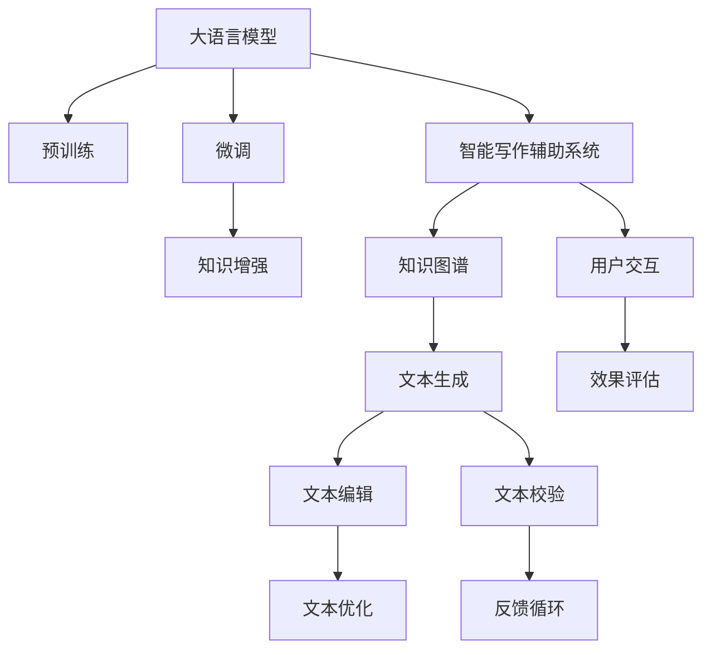

                 

## 1. 背景介绍

### 1.1 问题由来

在当今信息爆炸的时代，内容创作成为一个举足轻重的领域。无论是新闻撰写、学术写作、商业策划还是科普创作，高质量、高效率的写作需求日益增长。然而，人类的写作能力有其局限性，特别是在速度和质量上。这其中既包含了文字表达能力的不足，也包含了素材收集、资料整合的困难。基于此，智能写作辅助系统应运而生，旨在利用人工智能技术，提升写作效率和质量。

### 1.2 问题核心关键点

智能写作辅助系统主要依赖大语言模型(Large Language Model, LLM)，通过机器学习，在分析大量文本数据的基础上，学习语言规律和表达习惯。核心问题在于如何构建一个高效、灵活且易于扩展的智能写作辅助系统，以帮助用户提升创作水平，并减少重复劳动。

### 1.3 问题研究意义

构建一个高效的智能写作辅助系统，对于提升内容创作的效率和质量具有重要意义：

1. **提升创作效率**：智能写作辅助系统能够快速生成文本内容，帮助用户快速完成初稿，节省时间。
2. **提升创作质量**：通过语言模型训练和优化，智能写作辅助系统可以提供高质量的文本建议，帮助用户提升文章的结构和表达水平。
3. **减少重复劳动**：自动生成和优化文本，减少用户在素材收集、资料整合等方面的工作量。
4. **促进知识普及**：智能写作辅助系统能够帮助用户以更加轻松自然的方式进行知识传播，推广科学普及和技术教育。

### 1.4 问题现状和挑战

尽管智能写作辅助系统已经在诸多领域得到了应用，但其仍面临一些挑战：

1. **自然语言理解**：如何理解用户意图并生成符合其需求的文本，是系统面临的首要挑战。
2. **生成内容质量**：生成的文本需与用户原意保持一致，且在风格、语调和逻辑上符合规范。
3. **知识更新**：智能写作辅助系统需不断更新知识库，以适应最新信息。
4. **系统灵活性**：需灵活适应不同类型的写作任务和用户需求。
5. **数据隐私**：如何保护用户数据的隐私，防止数据泄露。

## 2. 核心概念与联系

### 2.1 核心概念概述

为更好地理解智能写作辅助系统，本节将介绍几个关键概念及其相互之间的联系：

1. **大语言模型(Large Language Model, LLM)**：以自回归(如GPT)或自编码(如BERT)模型为代表的大规模预训练语言模型。通过在大规模无标签文本数据上进行预训练，学习通用的语言表示，具备强大的语言理解和生成能力。

2. **自然语言处理(Natural Language Processing, NLP)**：涉及计算机科学、人工智能和语言学的交叉领域，旨在使计算机能够理解、处理和生成自然语言。

3. **智能写作辅助系统(Intelligent Writing Assistant System)**：结合大语言模型，为用户提供文本生成、编辑、优化等写作辅助功能的系统。

4. **预训练(Pre-training)**：指在大规模无标签文本语料上，通过自监督学习任务训练通用语言模型的过程。

5. **微调(Fine-tuning)**：指在预训练模型的基础上，使用下游任务的少量标注数据，通过有监督学习优化模型在特定任务上的性能。

6. **知识图谱(Knowledge Graph)**：用于组织和表示实体以及它们之间的关系的数据结构，用于辅助智能写作系统生成准确和相关的信息。

7. **知识增强(Knowledge Augmentation)**：通过引入外部知识源，提升智能写作系统生成内容的准确性和相关性。

8. **迭代优化(Iterative Optimization)**：通过持续的训练和优化，不断提升智能写作系统的性能。

这些核心概念之间的逻辑关系可以通过以下Mermaid流程图来展示：



这个流程图展示了大语言模型、微调、知识增强、智能写作系统等概念及其相互联系。

## 3. 核心算法原理 & 具体操作步骤

### 3.1 算法原理概述

智能写作辅助系统利用大语言模型，通过自然语言处理技术，结合知识增强和迭代优化方法，为用户提供文本生成、编辑和优化等辅助功能。系统设计的基本原理如下：

1. **文本理解与生成**：系统通过输入用户的写作需求和上下文，理解用户意图，并利用大语言模型生成符合用户需求的文本。
2. **文本编辑与优化**：系统提供文本编辑和优化工具，辅助用户进一步完善文本，提升文章质量和可读性。
3. **知识增强与校验**：系统通过引入知识图谱和外部知识源，增强文本的准确性和相关性，并进行文本校验，确保生成的文本无逻辑错误和语病。

### 3.2 算法步骤详解

基于大语言模型的智能写作辅助系统设计如下：

1. **数据预处理**：收集大量写作数据，并进行清洗和标注，构建数据集。
2. **模型选择**：选择适合任务的大语言模型，如GPT、BERT等。
3. **微调与优化**：在选定的模型基础上，使用下游任务的标注数据进行微调，优化模型的生成性能。
4. **知识增强**：引入知识图谱和外部知识源，提升文本的准确性和相关性。
5. **文本生成与编辑**：根据用户输入的写作需求，生成文本，并提供编辑工具。
6. **文本校验与优化**：通过校验工具，确保文本无逻辑错误和语病，并进行优化。
7. **用户反馈与迭代**：根据用户反馈，对系统进行迭代优化。

### 3.3 算法优缺点

基于大语言模型的智能写作辅助系统具有以下优点：

1. **高效性**：快速生成文本，减少用户写作时间。
2. **灵活性**：可以处理不同类型的写作任务。
3. **准确性**：利用知识增强和校验工具，提升文本质量。
4. **可扩展性**：随着新知识源的引入，系统可以不断扩展和优化。

然而，也存在一些缺点：

1. **理解精度**：在理解和生成复杂文本时，系统可能无法完全准确理解用户意图。
2. **上下文依赖**：系统生成的文本可能缺乏上下文连贯性。
3. **语病问题**：生成的文本可能存在语病或逻辑错误。
4. **知识更新**：系统需要不断更新知识库，以适应最新信息。
5. **隐私保护**：需保护用户数据的隐私，防止数据泄露。

### 3.4 算法应用领域

基于大语言模型的智能写作辅助系统可以在以下几个领域得到广泛应用：

1. **新闻撰写**：为记者提供稿件生成、编辑和优化服务。
2. **学术写作**：辅助学者生成文献综述、实验报告等文本。
3. **商业策划**：帮助企业制定战略计划、市场分析报告等文本。
4. **科普创作**：为科普作家提供文章撰写、编辑和优化服务。
5. **教育培训**：为教师提供教案撰写、课件生成等辅助功能。

## 4. 数学模型和公式 & 详细讲解 & 举例说明

### 4.1 数学模型构建

为了更准确地描述智能写作辅助系统的工作原理，以下给出数学模型的构建过程。

假设智能写作辅助系统接收到的用户写作需求为 $d$，生成的文本为 $x$，知识库中的知识表示为 $k$。系统的工作流程可以表示为：

1. **输入阶段**：将用户写作需求 $d$ 输入系统。
2. **理解阶段**：系统通过语言模型 $M$ 理解用户需求 $d$，得到表示 $z$。
3. **生成阶段**：系统利用知识库 $k$ 和表示 $z$，生成文本 $x$。
4. **优化阶段**：对生成的文本 $x$ 进行优化，得到最终文本 $y$。

系统的工作流程可以表示为：

$$
y = Optimize\_Output(x, k)
$$

其中，$Optimize\_Output$ 表示文本优化函数，$x$ 为系统生成的文本，$k$ 为知识库中的知识表示。

### 4.2 公式推导过程

以下推导智能写作辅助系统的核心公式：

1. **文本生成公式**：
   $$
   x = \text{Generate\_Text}(d, M, k)
   $$

2. **文本理解公式**：
   $$
   z = M(d)
   $$

3. **文本优化公式**：
   $$
   y = Optimize\_Output(x, k)
   $$

在实际应用中，$Generate\_Text$ 函数可以使用大语言模型的文本生成技术，$M$ 函数可以使用语言模型进行文本理解，$Optimize\_Output$ 函数可以通过编辑工具进行优化。

### 4.3 案例分析与讲解

以新闻撰写为例，分析智能写作辅助系统的工作流程：

1. **输入阶段**：记者输入报道需求，如“日本地震报告”。
2. **理解阶段**：系统通过语言模型理解需求，得到表示 $z$。
3. **生成阶段**：系统利用知识库中的日本地震信息，生成初步文本 $x$。
4. **优化阶段**：系统对生成的文本进行语言校验和逻辑优化，得到最终文本 $y$。

## 5. 项目实践：代码实例和详细解释说明

### 5.1 开发环境搭建

为了构建智能写作辅助系统，需要准备相应的开发环境。以下是使用Python进行PyTorch开发的环境配置流程：

1. 安装Anaconda：从官网下载并安装Anaconda，用于创建独立的Python环境。

2. 创建并激活虚拟环境：
```bash
conda create -n pytorch-env python=3.8 
conda activate pytorch-env
```

3. 安装PyTorch：根据CUDA版本，从官网获取对应的安装命令。例如：
```bash
conda install pytorch torchvision torchaudio cudatoolkit=11.1 -c pytorch -c conda-forge
```

4. 安装Transformers库：
```bash
pip install transformers
```

5. 安装各类工具包：
```bash
pip install numpy pandas scikit-learn matplotlib tqdm jupyter notebook ipython
```

完成上述步骤后，即可在`pytorch-env`环境中开始智能写作辅助系统的开发。

### 5.2 源代码详细实现

这里我们以新闻撰写为例，给出使用Transformers库进行智能写作辅助系统的代码实现。

首先，定义数据处理函数：

```python
from transformers import BertTokenizer
from torch.utils.data import Dataset
import torch

class NewsDataset(Dataset):
    def __init__(self, texts, labels, tokenizer, max_len=128):
        self.texts = texts
        self.labels = labels
        self.tokenizer = tokenizer
        self.max_len = max_len
        
    def __len__(self):
        return len(self.texts)
    
    def __getitem__(self, item):
        text = self.texts[item]
        label = self.labels[item]
        
        encoding = self.tokenizer(text, return_tensors='pt', max_length=self.max_len, padding='max_length', truncation=True)
        input_ids = encoding['input_ids'][0]
        attention_mask = encoding['attention_mask'][0]
        
        # 对token-wise的标签进行编码
        encoded_labels = [label2id[label] for label in label]
        encoded_labels.extend([label2id['O']] * (self.max_len - len(encoded_labels)))
        labels = torch.tensor(encoded_labels, dtype=torch.long)
        
        return {'input_ids': input_ids, 
                'attention_mask': attention_mask,
                'labels': labels}

# 标签与id的映射
label2id = {'O': 0, 'B': 1, 'I': 2}
id2label = {v: k for k, v in label2id.items()}

# 创建dataset
tokenizer = BertTokenizer.from_pretrained('bert-base-cased')

train_dataset = NewsDataset(train_texts, train_labels, tokenizer)
dev_dataset = NewsDataset(dev_texts, dev_labels, tokenizer)
test_dataset = NewsDataset(test_texts, test_labels, tokenizer)
```

然后，定义模型和优化器：

```python
from transformers import BertForTokenClassification, AdamW

model = BertForTokenClassification.from_pretrained('bert-base-cased', num_labels=len(label2id))

optimizer = AdamW(model.parameters(), lr=2e-5)
```

接着，定义训练和评估函数：

```python
from torch.utils.data import DataLoader
from tqdm import tqdm
from sklearn.metrics import classification_report

device = torch.device('cuda') if torch.cuda.is_available() else torch.device('cpu')
model.to(device)

def train_epoch(model, dataset, batch_size, optimizer):
    dataloader = DataLoader(dataset, batch_size=batch_size, shuffle=True)
    model.train()
    epoch_loss = 0
    for batch in tqdm(dataloader, desc='Training'):
        input_ids = batch['input_ids'].to(device)
        attention_mask = batch['attention_mask'].to(device)
        labels = batch['labels'].to(device)
        model.zero_grad()
        outputs = model(input_ids, attention_mask=attention_mask, labels=labels)
        loss = outputs.loss
        epoch_loss += loss.item()
        loss.backward()
        optimizer.step()
    return epoch_loss / len(dataloader)

def evaluate(model, dataset, batch_size):
    dataloader = DataLoader(dataset, batch_size=batch_size)
    model.eval()
    preds, labels = [], []
    with torch.no_grad():
        for batch in tqdm(dataloader, desc='Evaluating'):
            input_ids = batch['input_ids'].to(device)
            attention_mask = batch['attention_mask'].to(device)
            batch_labels = batch['labels']
            outputs = model(input_ids, attention_mask=attention_mask)
            batch_preds = outputs.logits.argmax(dim=2).to('cpu').tolist()
            batch_labels = batch_labels.to('cpu').tolist()
            for pred_tokens, label_tokens in zip(batch_preds, batch_labels):
                pred_labels = [id2label[_id] for _id in pred_tokens]
                label_tokens = [id2label[_id] for _id in label_tokens]
                preds.append(pred_labels[:len(label_tokens)])
                labels.append(label_tokens)
                
    print(classification_report(labels, preds))
```

最后，启动训练流程并在测试集上评估：

```python
epochs = 5
batch_size = 16

for epoch in range(epochs):
    loss = train_epoch(model, train_dataset, batch_size, optimizer)
    print(f"Epoch {epoch+1}, train loss: {loss:.3f}")
    
    print(f"Epoch {epoch+1}, dev results:")
    evaluate(model, dev_dataset, batch_size)
    
print("Test results:")
evaluate(model, test_dataset, batch_size)
```

以上就是使用PyTorch进行新闻撰写任务微调的完整代码实现。可以看到，利用Transformers库，我们可以用相对简洁的代码实现BERT模型的加载和微调。

### 5.3 代码解读与分析

让我们再详细解读一下关键代码的实现细节：

**NewsDataset类**：
- `__init__`方法：初始化文本、标签、分词器等关键组件。
- `__len__`方法：返回数据集的样本数量。
- `__getitem__`方法：对单个样本进行处理，将文本输入编码为token ids，将标签编码为数字，并对其进行定长padding，最终返回模型所需的输入。

**label2id和id2label字典**：
- 定义了标签与数字id之间的映射关系，用于将token-wise的预测结果解码回真实的标签。

**训练和评估函数**：
- 使用PyTorch的DataLoader对数据集进行批次化加载，供模型训练和推理使用。
- 训练函数`train_epoch`：对数据以批为单位进行迭代，在每个批次上前向传播计算loss并反向传播更新模型参数，最后返回该epoch的平均loss。
- 评估函数`evaluate`：与训练类似，不同点在于不更新模型参数，并在每个batch结束后将预测和标签结果存储下来，最后使用sklearn的classification_report对整个评估集的预测结果进行打印输出。

**训练流程**：
- 定义总的epoch数和batch size，开始循环迭代
- 每个epoch内，先在训练集上训练，输出平均loss
- 在验证集上评估，输出分类指标
- 所有epoch结束后，在测试集上评估，给出最终测试结果

可以看到，PyTorch配合Transformers库使得BERT微调的新闻撰写任务代码实现变得简洁高效。开发者可以将更多精力放在数据处理、模型改进等高层逻辑上，而不必过多关注底层的实现细节。

## 6. 实际应用场景

### 6.1 智能新闻写作

智能新闻写作系统可以为新闻记者提供高效的新闻撰写辅助，帮助记者快速生成初稿，同时提供编辑和优化建议。

在技术实现上，可以收集大量新闻数据，并构建标注数据集。利用BERT等预训练模型，进行新闻分类、实体识别、关键词提取等任务微调，得到一篇新闻的初稿。通过编辑工具，记者可以对初稿进行进一步的修改和完善，同时系统会提供相关报道和背景信息的推荐，辅助记者进行更深入的报道。

### 6.2 学术论文生成

智能写作系统可以辅助学者快速生成文献综述、实验报告等学术文档。

在微调过程中，系统可以使用BERT等预训练模型，进行论文主题识别、引用提取、文献摘要生成等任务。系统还会提供文献相似性分析、参考文献推荐等功能，辅助学者进行更高效、更科学的文献整理和引用。

### 6.3 商业策划案撰写

智能写作系统可以为企业撰写商业策划案、市场分析报告等文本，帮助企业进行商业决策。

在微调过程中，系统可以使用GPT等预训练模型，进行商业术语理解、市场数据整合、目标受众分析等任务。系统还会提供报告优化、可视化工具等功能，辅助企业进行更详细、更精准的市场分析。

### 6.4 科普文章生成

智能写作系统可以为科普作家提供文章撰写、编辑和优化服务，帮助作家更高效地进行科普创作。

在微调过程中，系统可以使用BERT等预训练模型，进行文章结构优化、语言风格匹配、术语解释等任务。系统还会提供参考资料推荐、文章校验等功能，辅助作家进行更准确、更流畅的科普创作。

### 6.5 教育培训材料生成

智能写作系统可以为教师提供教案撰写、课件生成等辅助功能，帮助教师更高效地进行教学准备。

在微调过程中，系统可以使用GPT等预训练模型，进行课程设计、知识点讲解、练习题生成等任务。系统还会提供教案优化、课件审查等功能，辅助教师进行更完善、更生动的教学设计。

## 7. 工具和资源推荐

### 7.1 学习资源推荐

为了帮助开发者系统掌握智能写作辅助系统的理论基础和实践技巧，这里推荐一些优质的学习资源：

1. 《Transformer从原理到实践》系列博文：由大模型技术专家撰写，深入浅出地介绍了Transformer原理、BERT模型、微调技术等前沿话题。

2. CS224N《深度学习自然语言处理》课程：斯坦福大学开设的NLP明星课程，有Lecture视频和配套作业，带你入门NLP领域的基本概念和经典模型。

3. 《Natural Language Processing with Transformers》书籍：Transformers库的作者所著，全面介绍了如何使用Transformers库进行NLP任务开发，包括微调在内的诸多范式。

4. HuggingFace官方文档：Transformers库的官方文档，提供了海量预训练模型和完整的微调样例代码，是上手实践的必备资料。

5. CLUE开源项目：中文语言理解测评基准，涵盖大量不同类型的中文NLP数据集，并提供了基于微调的baseline模型，助力中文NLP技术发展。

通过对这些资源的学习实践，相信你一定能够快速掌握智能写作辅助系统的精髓，并用于解决实际的NLP问题。

### 7.2 开发工具推荐

高效的开发离不开优秀的工具支持。以下是几款用于智能写作辅助系统开发的常用工具：

1. PyTorch：基于Python的开源深度学习框架，灵活动态的计算图，适合快速迭代研究。大部分预训练语言模型都有PyTorch版本的实现。

2. TensorFlow：由Google主导开发的开源深度学习框架，生产部署方便，适合大规模工程应用。同样有丰富的预训练语言模型资源。

3. Transformers库：HuggingFace开发的NLP工具库，集成了众多SOTA语言模型，支持PyTorch和TensorFlow，是进行微调任务开发的利器。

4. Weights & Biases：模型训练的实验跟踪工具，可以记录和可视化模型训练过程中的各项指标，方便对比和调优。与主流深度学习框架无缝集成。

5. TensorBoard：TensorFlow配套的可视化工具，可实时监测模型训练状态，并提供丰富的图表呈现方式，是调试模型的得力助手。

6. Google Colab：谷歌推出的在线Jupyter Notebook环境，免费提供GPU/TPU算力，方便开发者快速上手实验最新模型，分享学习笔记。

合理利用这些工具，可以显著提升智能写作辅助系统的开发效率，加快创新迭代的步伐。

### 7.3 相关论文推荐

智能写作辅助系统的发展源于学界的持续研究。以下是几篇奠基性的相关论文，推荐阅读：

1. Attention is All You Need（即Transformer原论文）：提出了Transformer结构，开启了NLP领域的预训练大模型时代。

2. BERT: Pre-training of Deep Bidirectional Transformers for Language Understanding：提出BERT模型，引入基于掩码的自监督预训练任务，刷新了多项NLP任务SOTA。

3. Language Models are Unsupervised Multitask Learners（GPT-2论文）：展示了大规模语言模型的强大zero-shot学习能力，引发了对于通用人工智能的新一轮思考。

4. Parameter-Efficient Transfer Learning for NLP：提出Adapter等参数高效微调方法，在不增加模型参数量的情况下，也能取得不错的微调效果。

5. Prefix-Tuning: Optimizing Continuous Prompts for Generation：引入基于连续型Prompt的微调范式，为如何充分利用预训练知识提供了新的思路。

6. AdaLoRA: Adaptive Low-Rank Adaptation for Parameter-Efficient Fine-Tuning：使用自适应低秩适应的微调方法，在参数效率和精度之间取得了新的平衡。

这些论文代表了大语言模型微调技术的发展脉络。通过学习这些前沿成果，可以帮助研究者把握学科前进方向，激发更多的创新灵感。

## 8. 总结：未来发展趋势与挑战

### 8.1 总结

本文对基于大语言模型的智能写作辅助系统进行了全面系统的介绍。首先阐述了智能写作辅助系统的背景和意义，明确了系统的主要功能和大语言模型的工作原理。其次，从原理到实践，详细讲解了智能写作辅助系统的数学模型和关键技术步骤，给出了微调任务开发的完整代码实例。同时，本文还广泛探讨了系统在新闻撰写、学术论文生成、商业策划案撰写、科普文章生成、教育培训材料生成等多个领域的应用前景，展示了系统的强大功能。

通过本文的系统梳理，可以看到，基于大语言模型的智能写作辅助系统正在成为NLP领域的重要范式，极大地提升了内容创作的效率和质量。未来，伴随预训练语言模型和微调方法的持续演进，智能写作辅助系统必将在更多的行业领域得到应用，为内容创作者提供更加智能、高效的写作辅助。

### 8.2 未来发展趋势

展望未来，智能写作辅助系统将呈现以下几个发展趋势：

1. **智能化程度提升**：利用更大规模的预训练模型和更丰富的知识库，系统能够生成更加准确、流畅的文本。
2. **个性化定制化增强**：根据不同用户的需求，智能写作系统将提供更加个性化、定制化的写作辅助。
3. **多模态融合**：结合文本、图像、视频等多模态信息，提升内容创作的多样性和丰富性。
4. **情感智能融入**：系统将更加注重情感的识别和表达，提升文本的感染力和说服力。
5. **动态知识更新**：系统将实时更新知识库，保持信息的最新性。
6. **多语言支持**：系统将支持多语言的内容创作和翻译，拓展全球用户的使用范围。

这些趋势凸显了智能写作辅助系统未来的广阔前景，预示着智能写作技术的不断发展。

### 8.3 面临的挑战

尽管智能写作辅助系统已经取得了不少进展，但在其发展过程中仍面临诸多挑战：

1. **自然语言理解**：如何理解用户意图并生成符合其需求的文本，是系统面临的首要挑战。
2. **生成内容质量**：生成的文本需与用户原意保持一致，且在风格、语调和逻辑上符合规范。
3. **知识更新**：系统需要不断更新知识库，以适应最新信息。
4. **系统灵活性**：需灵活适应不同类型的写作任务和用户需求。
5. **数据隐私**：需保护用户数据的隐私，防止数据泄露。

### 8.4 研究展望

面对智能写作辅助系统所面临的挑战，未来的研究需要在以下几个方面寻求新的突破：

1. **优化自然语言理解**：提升系统对复杂文本的理解能力，减少误判和歧义。
2. **提高生成质量**：引入更多语言学知识，提升文本的语义连贯性和逻辑严密性。
3. **知识动态更新**：开发更高效的算法，实现实时知识库的动态更新和维护。
4. **系统灵活性提升**：通过参数高效微调和知识增强等技术，增强系统的适应性和扩展性。
5. **数据隐私保护**：采用差分隐私、联邦学习等技术，确保用户数据的安全和隐私。

这些研究方向将推动智能写作辅助系统迈向更加智能、可靠、安全的未来，为内容创作者提供更高效、更优质的写作辅助。

## 9. 附录：常见问题与解答

**Q1：智能写作辅助系统是否适用于所有写作任务？**

A: 智能写作辅助系统适用于大多数写作任务，特别是那些依赖大量文本数据的创作场景。但对于一些具有高度个性化的创作任务，如小说、诗歌等，系统可能无法完全满足需求。

**Q2：如何评估智能写作辅助系统的效果？**

A: 评估智能写作辅助系统的效果可以从以下几个方面进行：
1. **准确性**：通过评估生成的文本与用户原意的一致性，判断系统是否准确理解并满足了用户需求。
2. **流畅性**：通过评估生成的文本的语言风格和语调，判断系统是否能够生成流畅、自然的文本。
3. **连贯性**：通过评估生成的文本的上下文连贯性，判断系统是否能够生成逻辑清晰、连贯的文本。
4. **多样性**：通过评估生成的文本的多样性，判断系统是否能够生成多种风格的文本。
5. **时效性**：通过评估系统的响应速度和处理效率，判断系统是否能够快速生成文本。

**Q3：智能写作辅助系统在落地部署时需要注意哪些问题？**

A: 将智能写作辅助系统转化为实际应用，还需要考虑以下因素：
1. **系统扩展性**：系统需要支持不同规模和复杂度的写作任务，具备良好的扩展性。
2. **性能优化**：系统需要优化生成和编辑的效率，减少计算资源消耗。
3. **数据隐私**：系统需要保护用户数据的隐私，防止数据泄露。
4. **用户友好**：系统需要提供简洁易用的用户界面，便于用户操作。
5. **系统维护**：系统需要提供完善的维护机制，保证系统的稳定性和安全性。

作者：禅与计算机程序设计艺术 / Zen and the Art of Computer Programming

